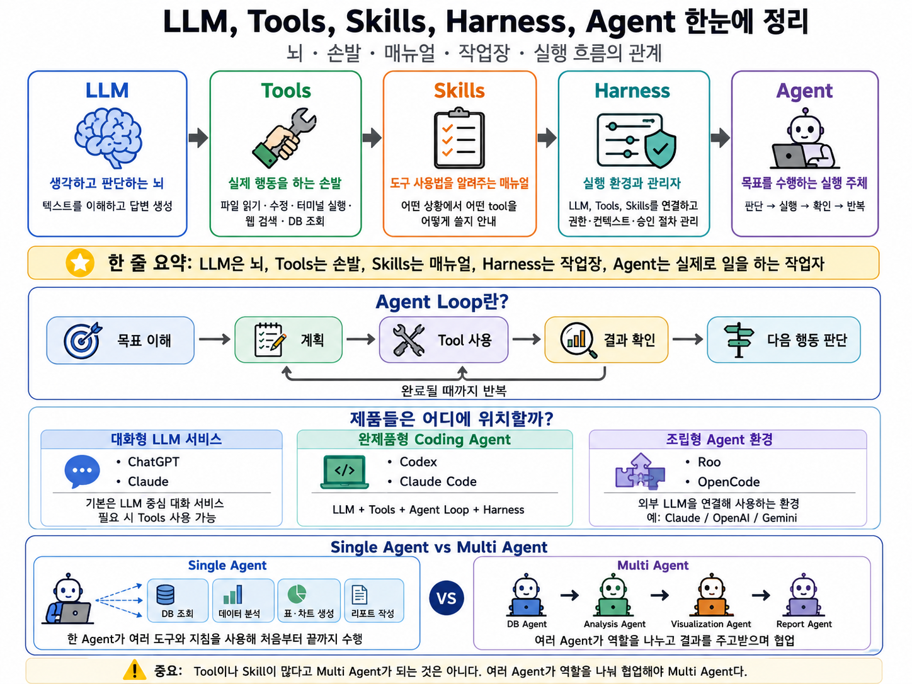

요즘 AI 관련 글을 보다 보면 LLM, Tool, Skill, Harness, Agent, Multi Agent 같은 표현이 자주 등장한다. 처음에는 전부 비슷해 보인다. "그냥 ChatGPT 같은 AI 아닌가?"라고 생각할 수도 있다.

그런데 조금만 들여다보면 각 개념의 역할이 다르다. 특히 AI Agent를 이해하려면 LLM 하나만 보는 것보다, LLM이 어떤 도구를 사용할 수 있는지, 어떤 지침을 따르는지, 어떤 실행 환경 안에서 움직이는지를 함께 봐야 한다.

이 글에서는 LLM, Tools, Skills, Harness, Agent를 하나의 흐름으로 정리해보려고 한다.



가장 먼저 비유로 잡으면 이렇게 볼 수 있다.

```text
LLM = 뇌
Tools = 손발/도구
Skills = 지침/가이드/업무 매뉴얼
Harness = 작업장/실행 관리자
Agent = 이 요소들을 사용해 목표를 수행하는 작업자
```

즉, LLM은 생각하고 판단하는 역할을 하고, Tools는 실제 행동을 수행한다. Skills는 그 행동을 어떤 방식으로 해야 하는지 알려주며, Harness는 이 모든 것이 실제 환경에서 안전하고 일관되게 작동하도록 관리한다. 그리고 이 요소들이 합쳐져 하나의 목표를 수행하면 Agent라고 볼 수 있다.

## 1. LLM은 무엇인가?

LLM은 Large Language Model, 즉 대규모 언어 모델이다. 쉽게 말하면 텍스트를 이해하고, 추론하고, 답변을 생성하는 "뇌"에 가깝다.

사용자가 질문을 입력하면 LLM은 그 문맥을 이해하고, 가장 적절한 답변을 텍스트로 생성한다. ChatGPT, Claude, Gemini 같은 서비스의 핵심에도 이런 LLM이 있다.

다만 중요한 점이 있다. LLM 자체는 기본적으로 텍스트를 입력받고 텍스트를 출력하는 모델이다. 그래서 LLM만으로는 내 컴퓨터의 파일을 직접 읽거나, 코드를 수정하거나, DB에 접속하거나, 터미널 명령을 실행할 수 없다.

예를 들어 사용자가 이렇게 물어볼 수 있다.

```text
"이 코드의 문제점을 찾아줘."
```

이때 코드 내용을 같이 붙여주면 LLM은 그 코드를 읽고 문제점을 설명할 수 있다. 하지만 사용자가 단순히 "내 프로젝트 폴더 열어서 직접 고쳐줘"라고 한다면, LLM 단독으로는 그 폴더에 접근할 수 없다.

즉, LLM은 생각하고 판단하는 능력은 있지만, 실제 환경에서 행동하려면 별도의 기능이 필요하다. 여기서 등장하는 개념이 Tools이다.

## 2. Tools는 왜 필요한가?

Tools는 LLM이 실제 행동을 할 수 있게 해주는 기능이다. 비유하면 LLM의 손발이나 도구에 해당한다.

대표적인 Tool에는 다음과 같은 것들이 있다.

```text
파일 읽기 Tool
파일 수정 Tool
터미널 실행 Tool
웹 검색 Tool
DB 조회 Tool
코드 실행 Tool
차트 생성 Tool
문서 생성 Tool
```

LLM이 "무엇을 해야 하는지" 판단한다면, Tool은 그 판단을 실제 행동으로 옮기는 역할을 한다.

예를 들어 사용자가 이렇게 요청했다고 해보자.

```text
"이번 달 불량률을 DB에서 조회해서 알려줘."
```

이때 LLM은 불량률을 계산하려면 생산 수량과 불량 수량이 필요하다고 판단할 수 있다. 하지만 실제 DB에 접속해서 데이터를 가져오는 것은 LLM 자체가 아니라 DB 조회 Tool이 수행한다.

흐름은 대략 이렇게 된다.

```text
사용자: 이번 달 불량률을 알려줘.

LLM: 불량률을 구하려면 생산 수량과 불량 수량이 필요하겠군.
Tool: DB에 접속해서 필요한 데이터를 가져옴.
LLM: 가져온 데이터를 해석해서 답변함.
```

즉, Tool이 붙으면 LLM은 단순히 말만 하는 것이 아니라 실제 작업을 수행할 수 있게 된다.

하지만 여기서 또 하나의 문제가 생긴다. 손발이 생겼다고 해서 항상 같은 방식으로, 효율적으로, 안전하게 일하는 것은 아니다. 그래서 Skills가 필요하다.

## 3. Skills는 Tools와 무엇이 다른가?

Tools와 Skills는 자주 헷갈리지만, 역할이 다르다.

```text
Tool = 실제 행동 기능
Skill = 그 행동을 어떻게 해야 하는지 알려주는 지침
```

예를 들어 DB 조회를 생각해보자.

```text
DB 조회 Tool
= 실제로 DB에 접속해 데이터를 가져오는 기능

DB 조회 Skill
= 어떤 테이블을 봐야 하는지,
  어떤 컬럼을 기준으로 계산해야 하는지,
  어떤 조건을 적용해야 하는지 알려주는 지침
```

차트 생성도 마찬가지다.

```text
차트 생성 Tool
= 실제 차트를 만드는 기능

리포트 작성 Skill
= 어떤 단위로 표시할지,
  어떤 차트가 적절한지,
  어떤 형식으로 요약할지 알려주는 지침
```

즉, Tool은 행동 능력이고, Skill은 행동 방식이다.

예를 들어 어떤 프로젝트에서 불량률을 계산할 때 이런 규칙이 있다고 해보자.

```text
불량률은 불량 수량 / 총 생산 수량 × 100으로 계산한다.
생산일 기준은 created_at이 아니라 production_date를 사용한다.
라인별 비교 시 A라인, B라인, C라인 순서로 정렬한다.
보고용 문장은 비전공자도 이해할 수 있게 작성한다.
```

이런 내용은 Tool이 아니라 Skill에 가깝다. DB를 조회하는 기능 자체가 아니라, DB를 어떤 기준으로 조회하고 결과를 어떻게 정리해야 하는지 알려주는 업무 매뉴얼이기 때문이다.

따라서 손발이 있으면 작업은 가능하지만, 매번 방식이 달라지고 비효율적일 수 있다. Skills는 이 문제를 줄이기 위해 필요하다.

## 4. Harness는 왜 필요한가?

Skills가 업무 매뉴얼이라면, Harness는 그 매뉴얼이 실제로 작동하는 작업장 시스템에 가깝다.

Harness는 LLM, Tools, Skills가 실제 환경에서 작동하도록 연결하고, 권한, 컨텍스트, 승인 절차를 관리하는 실행 환경이다.

조금 더 쉽게 말하면 이렇게 볼 수 있다.

```text
Skills = 이렇게 하라고 알려줌
Harness = 그렇게 할 수 있게 만들고, 그렇게만 하도록 제한함
```

예를 들어 Skill에 이런 지침이 적혀 있다고 해보자.

```text
.env 파일은 읽지 마세요.
위험한 명령은 실행하지 마세요.
수정 후 테스트를 실행하세요.
```

이것은 좋은 지침이다. 하지만 지침은 결국 LLM이 잘 따라야 한다. LLM이 실수로 놓치거나, 애매하게 해석할 수도 있다.

반면 Harness는 실행 환경 차원에서 더 강하게 통제할 수 있다.

```text
.env 파일 접근 자체를 차단함
rm -rf 같은 위험한 명령은 실행 전 승인 요청 또는 차단
테스트 실행 Tool을 제공하고 결과를 다시 LLM에게 전달
특정 폴더는 읽기만 가능하고 수정은 불가능하게 설정
```

즉, Skills가 "이렇게 일해라"라는 매뉴얼이라면, Harness는 실제로 그렇게 일할 수 있도록 무대와 장비, 권한, 안전장치를 제공하는 작업장이다.

이 개념은 AI Agent를 이해할 때 중요하다. LLM이 Tool을 사용할 수 있다고 해서 아무렇게나 사용하게 두면 위험할 수 있다. 어떤 정보를 볼 수 있는지, 어떤 명령을 실행할 수 있는지, 언제 사용자 승인이 필요한지 관리하는 층이 필요하다. 그 역할을 하는 것이 Harness이다.

## 5. Agent Loop는 무엇인가?

이제 Agent 개념으로 넘어갈 수 있다.

Agent는 단순히 한 번 답변하고 끝나는 것이 아니라, 목표를 달성하기 위해 판단하고, 도구를 사용하고, 결과를 확인하고, 다음 행동을 결정하는 흐름을 가진다. 이 반복 흐름을 Agent Loop라고 볼 수 있다.

기본 흐름은 다음과 같다.

```text
목표 이해
→ 계획
→ Tool 사용
→ 결과 확인
→ 다음 행동 판단
→ 반복
```

예를 들어 사용자가 이렇게 요청했다고 해보자.

```text
"DB 조회해서 이런 데이터 알려줘. 표랑 차트로 정리해줘."
```

Agent는 다음과 같이 움직일 수 있다.

```text
1. 사용자의 목표를 이해한다.
2. 어떤 데이터가 필요한지 판단한다.
3. DB 조회 Tool을 사용한다.
4. 조회 결과를 확인한다.
5. 필요한 계산을 수행한다.
6. 표와 차트를 생성한다.
7. 리포트 형식으로 요약한다.
8. 결과에 누락이나 오류가 없는지 검토한다.
9. 최종 답변을 제공한다.
```

여기서 중요한 점은 실행 결과를 보고 다음 행동을 이어간다는 것이다. 단순 챗봇은 질문에 답변하고 끝나는 경우가 많다. 반면 Agent는 목표를 향해 여러 단계를 거치며 작업을 수행한다.

이런 의미에서 Agent는 다음과 같이 이해할 수 있다.

```text
Agent = LLM + Tools + Skills + Harness + Agent Loop
```

물론 모든 Agent가 항상 명시적인 Skills를 갖고 있는 것은 아니다. 하지만 개념적으로는 LLM이 도구를 사용하고, 지침을 따르며, 실행 환경 안에서 반복적으로 목표를 수행하는 구조라고 이해하면 좋다.

## 6. ChatGPT, Claude와 Codex, Claude Code는 무엇이 다른가?

ChatGPT와 Claude는 기본적으로 LLM 중심의 대화 서비스라고 볼 수 있다.

사용자는 텍스트로 질문하고, 모델은 텍스트로 답변한다. 물론 요즘 ChatGPT나 Claude도 웹 검색, 파일 분석, 코드 실행 같은 Tool을 사용할 수 있는 경우가 있다. 그래서 단순한 LLM만 있는 것은 아니지만, 기본 성격은 대화형 AI 서비스에 가깝다.

반면 Codex나 Claude Code는 개발 작업을 위해 LLM과 Tools, Agent Loop, Harness가 더 강하게 묶인 Coding Agent에 가깝다.

비교하면 이렇게 볼 수 있다.

```text
ChatGPT / Claude
= LLM 중심 대화 서비스
= 필요하다면 Tools 사용 가능

Codex / Claude Code
= LLM + Tools + Agent Loop + Harness가 묶인 Coding Agent
```

쉽게 말하면 ChatGPT나 Claude는 똑똑한 사람과 채팅하는 느낌에 가깝고, Codex나 Claude Code는 그 똑똑한 사람이 내 개발환경에서 파일도 읽고, 수정하고, 테스트도 돌리는 느낌에 가깝다.

예를 들어 Codex나 Claude Code는 다음과 같은 작업에 초점이 맞춰져 있다.

```text
프로젝트 파일 읽기
코드 검색
코드 수정
터미널 명령 실행
테스트 실행
오류 확인 후 재수정
```

그래서 ChatGPT나 Claude를 "LLM 중심 대화 서비스"라고 본다면, Codex와 Claude Code는 "완제품형 Coding Agent"라고 볼 수 있다.

## 7. Roo, OpenCode는 어디에 위치하는가?

Roo와 OpenCode는 또 조금 다르다.

Roo나 OpenCode는 자체 LLM이라기보다, Claude, OpenAI, Gemini 같은 외부 LLM을 연결해서 사용하는 Agent 실행 환경에 가깝다.

즉, 구조는 이렇게 볼 수 있다.

```text
Roo / OpenCode
= 외부 LLM을 연결해서 사용하는 Agent 실행 환경

Claude / OpenAI / Gemini API
= 실제 판단을 수행하는 LLM
```

Roo나 OpenCode는 LLM에게 파일 읽기, 파일 수정, 터미널 실행 같은 Tools를 제공하고, VS Code나 터미널 안에서 Agent처럼 일할 수 있게 해준다.

Codex나 Claude Code가 어느 정도 LLM까지 묶인 완제품형 Coding Agent에 가깝다면, Roo와 OpenCode는 사용자가 원하는 LLM을 연결해서 쓰는 조립형 Agent 환경에 가깝다.

비교하면 이렇게 정리할 수 있다.

```text
Codex / Claude Code
= LLM과 Tools가 제품 안에서 강하게 묶인 완제품형 Coding Agent

Roo / OpenCode
= 외부 LLM을 연결해서 Tools와 Agent Loop를 제공하는 조립형 Agent 환경
```

즉, Roo나 OpenCode 자체가 뇌는 아니다. 뇌에 해당하는 LLM은 Claude, OpenAI, Gemini 같은 외부 모델이고, Roo와 OpenCode는 그 뇌가 개발환경 안에서 실제 작업을 하도록 도구와 실행 환경을 제공한다.

## 8. Single Agent와 Multi Agent는 무엇이 다른가?

마지막으로 Single Agent와 Multi Agent를 구분해보자.

먼저 Single Agent는 하나의 Agent가 여러 작업을 쭉 수행하는 구조다.

예를 들어 사용자가 이렇게 요청했다고 하자.

```text
"DB 조회해서 이런 데이터 알려줘. 표랑 차트로 정리해줘."
```

Single Agent에서는 하나의 Agent가 다음 작업을 모두 수행한다.

```text
DB 조회
데이터 분석
표 생성
차트 생성
리포트 작성
결과 검토
```

즉, 한 명의 작업자가 DB도 보고, 분석도 하고, 표도 만들고, 보고서도 쓰는 구조다.

반면 Multi Agent는 여러 Agent가 역할을 나누어 협업하는 구조다.

예를 들면 다음과 같이 나눌 수 있다.

```text
DB Agent
→ DB에서 수치와 현황을 분석

Analysis Agent
→ 조회 데이터를 해석하고 핵심 포인트를 정리

Visualization Agent
→ 표와 차트를 구성

Report Agent
→ 최종 보고서 작성

Review Agent
→ 수치 오류, 논리 오류, 누락 여부 검토
```

여기서 중요한 것은 Tool이나 Skill이 많다고 Multi Agent가 되는 것이 아니라는 점이다.

하나의 Agent가 DB 조회 Tool, RAG 검색 Tool, 차트 생성 Tool, 리포트 작성 Skill을 모두 사용하더라도, 작업 주체가 하나라면 Single Agent이다.

Multi Agent는 여러 Agent가 각자의 역할을 가지고, 서로 결과를 주고받으며 협업할 때 성립한다.

쉽게 말하면 다음과 같다.

```text
Tools가 많다
= 할 수 있는 행동이 많다

Skills가 많다
= 따를 수 있는 작업 지침이 많다

Agent가 하나다
= 한 명의 작업자가 여러 도구와 매뉴얼을 들고 일한다

Agent가 여러 명이다
= 여러 작업자가 역할을 나눠 협업한다
```

따라서 Multi Agent의 핵심은 "기능이 많음"이 아니라 "역할이 분리된 여러 Agent의 협업"이다.

## 마무리

AI Agent를 이해하려면 먼저 LLM, Tools, Skills, Harness를 구분해서 볼 필요가 있다.

LLM은 생각하고 판단하는 뇌이다. Tools는 실제 행동을 수행하는 손발이다. Skills는 그 손발을 어떤 방식으로 사용해야 하는지 알려주는 업무 매뉴얼이다. Harness는 이 모든 것이 실제 환경에서 안전하고 일관되게 작동하도록 관리하는 작업장이다.

이 요소들이 결합되어 하나의 목표를 수행하고, 실행 결과를 확인하며 다음 행동을 이어가면 Agent가 된다. 그리고 여러 Agent가 역할을 나누어 협업하면 Multi Agent가 된다.

정리하면 다음과 같다.

```text
LLM = 뇌
Tools = 손발/도구
Skills = 지침/가이드/업무 매뉴얼
Harness = 작업장/실행 관리자
Agent = 목표를 수행하는 작업자
Multi Agent = 여러 작업자가 역할을 나누어 협업하는 구조
```

결국 AI Agent는 단순히 "말을 잘하는 AI"가 아니라, 목표를 이해하고, 필요한 도구를 사용하고, 결과를 확인하며, 다음 행동을 이어가는 실행 구조라고 볼 수 있다.
