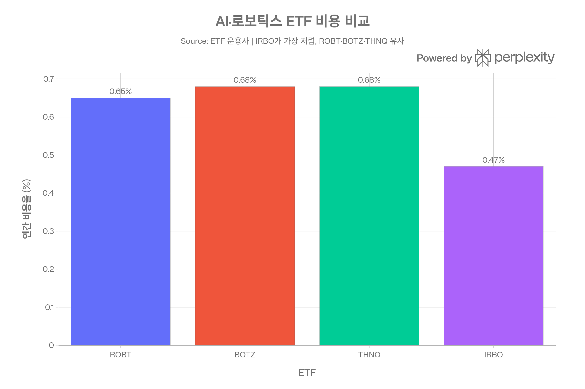
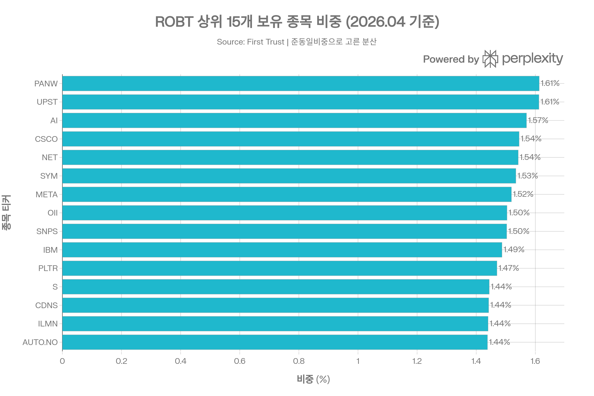
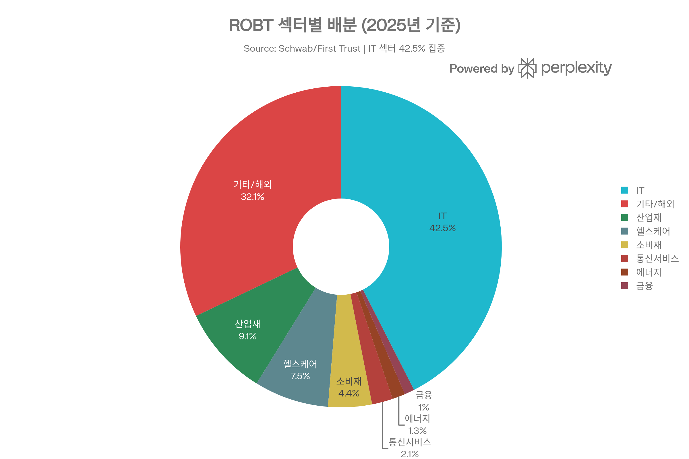
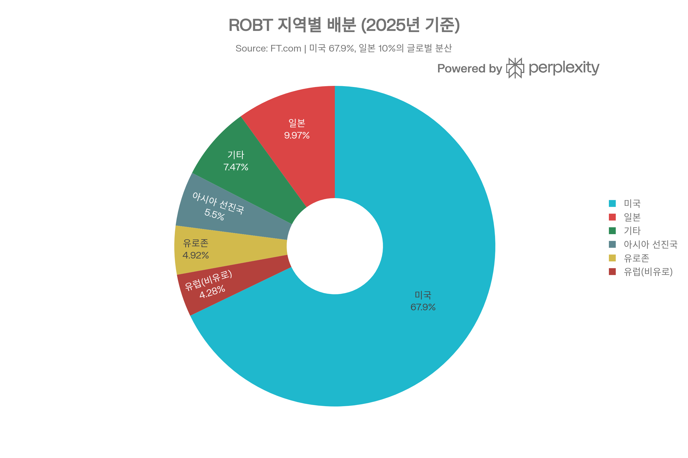
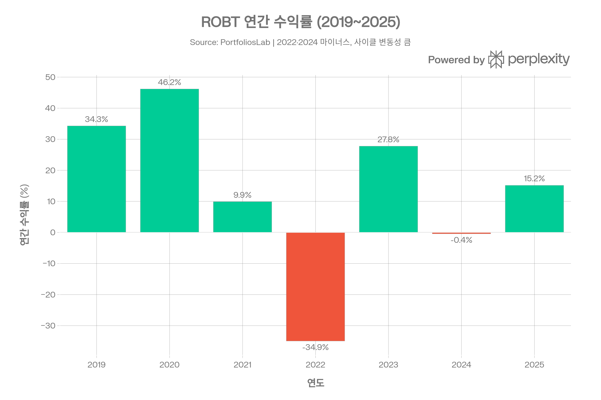
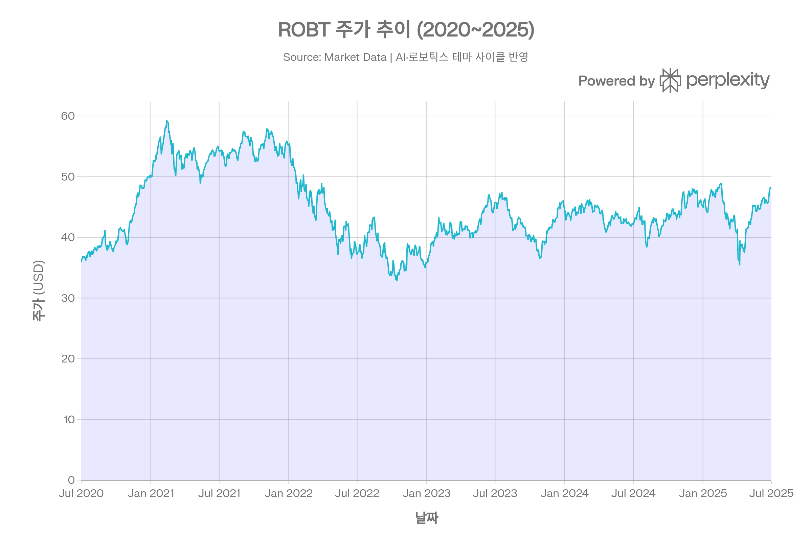

# ROBT (First Trust Nasdaq Artificial Intelligence and Robotics ETF) 종합 분석 보고서
> <strong>분석 기준일:</strong> 2026년 4월 15일  
> <strong>데이터 출처:</strong> First Trust Advisors, Market Data, PortfoliosLab, TradingView, ETF Database, Yahoo Finance 등

***

## ETF 분류

| 항목 | 내용 |
|---|---|
| 최종 폴더 | `ETF/Artificial Intelligence and Robotics/ROBT` |
| 대분류 | 테마 |
| 하위 분류 | 인공지능·로보틱스 |
| 핵심 전략 | Nasdaq CTA Artificial Intelligence and Robotics Index를 추종해 AI·로보틱스 관련 기업에 준동일 가중으로 투자 |
| 운용 방식 | 패시브 인덱스 ETF |
| 레버리지/인버스 | 없음 |
| 옵션 인컴 여부 | 없음 |
| 분류 판단 | 기술 섹터 ETF라기보다 AI·로보틱스라는 특정 산업 테마 노출이 핵심이므로 `테마 > 인공지능·로보틱스`로 분류 |

***

## 1. 기본 정보
<strong>ROBT</strong>는 First Trust Advisors L.P.가 운용하는 인공지능(AI) 및 로보틱스 테마 ETF로, 2018년 2월 설정 이후 약 8년간 운용되고 있습니다. AI·로보틱스에 특화된 패시브 인덱스 ETF로서 Consumer Technology Association(CTA)®이 AI·로보틱스 기업을 분류·선별합니다.[1][2][3]

| 항목 | 내용 |
|------|------|
| 정식 명칭 | First Trust Nasdaq Artificial Intelligence and Robotics ETF |
| 티커 | ROBT (NASDAQ) |
| 설정일 | 2018년 2월 21일 |
| 운용 기간 | 약 8년 |
| 운용사 | First Trust Advisors L.P. |
| 상장거래소 | NASDAQ |
| 추종 지수 | Nasdaq CTA Artificial Intelligence and Robotics™ Index (NQROBOT™) |
| 현재 주가 | $49.42 (2026.04.15 기준) |
| 순자산 규모(AUM) | 약 $6억 4,600만 달러 |
| 총 보수비율(TER) | 0.65% |
| 운용 스타일 | 패시브 (준동일 가중) |
| 투자 스타일 | 미드캡 성장형 |

- <strong>현재 주가:</strong> $49.42[1]
- <strong>52주 최저/최고:</strong> $37.03 / $56.64[4]
- <strong>순자산(AUM):</strong> 약 $6.46억[4][1]
- <strong>일평균 거래량:</strong> 약 89,708주[2]
- <strong>총 보유 종목 수:</strong> 123개[5]
- <strong>Morningstar 카테고리:</strong> Technology[6]
- <strong>P/E 비율:</strong> 26.33[7]

***
## 2. 추종 지수 — Nasdaq CTA Artificial Intelligence and Robotics™ Index
<strong>NQROBOT™</strong>은 Nasdaq과 Consumer Technology Association(CTA)이 공동 개발한 AI·로보틱스 테마 지수입니다.[3][8]
### 지수 방법론 (3단계 분류 체계)
CTA가 각 기업의 AI·로보틱스 사업 비중에 따라 세 그룹으로 분류하고, 가중치를 배분합니다:[3]

| 분류 | 설명 | 지수 내 집합 가중 |
|------|------|----------------|
| <strong>Enablers (인에이블러)</strong> | AI·로보틱스 기술 개발의 핵심 부품·인프라 제공 기업 | 25% |
| <strong>Engagers (인게이저)</strong> | AI·로보틱스가 핵심 사업인 기업 | 60% |
| <strong>Enhancers (인핸서)</strong> | AI·로보틱스를 보조 사업으로 활용하는 기업 | 15% |

- 각 그룹 내에서 <strong>동일 가중(Equal Weight)</strong> 배분 적용[9][3]
- <strong>재구성 주기:</strong> 반기(Semi-annual)[8]
- <strong>리밸런싱:</strong> 분기별 (3, 6, 9, 12월)[9][8]
- 시가총액 가중이 아닌 준동일 가중 방식으로 특정 메가캡 종목에의 과집중을 방지[2]

***
## 3. 추종 성과 지표
ROBT의 운용 방식은 지수를 90% 이상 추종하는 패시브 구조이므로, 비용(TER 0.65%)이 추적 차이의 주요 요인입니다.[1][7]

| 지표 | 수치 |
|------|------|
| NAV (2026.04.15) | $48.21[7] |
| 시장가격 | $49.42 |
| NAV 대비 프리미엄 | 약 +0.3%[10] |
| 배당 수익률(indicated) | 0.40%[10] |
| 분배 수익률 | 0.21%[11] |
| PE 비율 | 26.33[7] |

<strong>NAV 괴리율 분석:</strong> ROBT는 통상 약 +0.3%의 소폭 프리미엄으로 거래됩니다. AI·로보틱스 테마 관심이 높을수록 프리미엄이 커지는 경향이 있으며, 보유 종목 중 해외 주식이 약 32%를 차지해 외환 시차로 인한 일시적 괴리가 발생할 수 있습니다.[12][10][1]

***
## 4. 비용 구조
### 총 보수 및 비용
ROBT의 <strong>TER은 0.65%</strong>로, AI·로보틱스 ETF 군에서 중간 수준입니다.[1][6]
### 경쟁 AI·로보틱스 ETF 비용 비교

| ETF | 운용사 | 추종 전략 | TER | AUM |
|-----|--------|----------|-----|-----|
| <strong>ROBT</strong> | First Trust | Nasdaq CTA, 준동일 가중 | <strong>0.65%</strong>[1] | \~$6.46억 |
| BOTZ | Global X | MSCI Robotics, 집중형 | 0.68%[13] | \~$26억[13] |
| THNQ | ROBO Global | ROBO Global AI, 동일 가중 | 0.68%[14] | \~$3.8억[14] |
| IRBO | iShares | NYSE FactSet Global, 동일 가중 | 0.47%[15] | \~$7.5억[15] |
- <strong>포트폴리오 회전율:</strong> 약 87% — 분기 리밸런싱과 준동일 가중 특성상 높은 편[11]
- <strong>거래 비용:</strong> 일평균 거래량 약 89,708주로 BOTZ 대비 낮은 유동성, 스프레드가 다소 넓을 수 있음[2]
- IRBO(0.47%)는 ROBT보다 0.18%p 저렴하여 비용 측면에서 유리한 경쟁자입니다[15]

***
## 5. 유동성 평가
| 유동성 지표 | ROBT | BOTZ | IRBO |
|------------|------|------|------|
| 일평균 거래량 | \~89,708주 | \~500만주 이상 | \~10만주 수준 |
| AUM | \~$6.46억 | \~$26억 | \~$7.5억 |
| NAV 프리미엄/디스카운트 | \~+0.3%[10] | 낮음 | 낮음 |

- ROBT의 유동성은 AI·로보틱스 ETF 내에서 중간 수준입니다. BOTZ에 비해 현저히 낮으나, 소액 개인 투자자 기준으로는 일반적인 거래에 큰 문제가 없습니다.[2]
- <strong>1년간 자금 유입(Fund Flow):</strong> +$1억 1,287만 달러로 양(+)의 자금 흐름을 보이며 투자자 관심 증가 추세를 확인할 수 있습니다.[10]
- <strong>주요 기관투자자:</strong> LPL Financial LLC(956,667주), Morgan Stanley(700,695주), Bank of America(431,149주) 순으로, 리테일 어드바이저 중심의 고객 자산 구성[2]

***
## 6. 포트폴리오 구성
### 상위 15개 보유 종목 (2026년 4월 기준)

준동일 가중 특성상 상위 종목 간 비중 차이가 매우 작아, 특정 종목 집중 리스크가 낮습니다.[2][3]
| 순위 | 티커 | 종목명 | 비중 |
|------|------|--------|------|
| 1 | PANW | Palo Alto Networks | 1.61% |
| 2 | UPST | Upstart Holdings | 1.61% |
| 3 | AI | C3.ai | 1.57% |
| 4 | CSCO | Cisco Systems | 1.54% |
| 5 | NET | Cloudflare | 1.54% |
| 6 | SYM | Symbotic | 1.53% |
| 7 | META | Meta Platforms | 1.52% |
| 8 | OII | Oceaneering International | 1.50% |
| 9 | SNPS | Synopsys | 1.50% |
| 10 | IBM | IBM | 1.49% |
| 11 | PLTR | Palantir Technologies | 1.47% |
| 12 | S | SentinelOne | 1.44% |
| 13 | CDNS | Cadence Design Systems | 1.44% |
| 14 | ILMN | Illumina | 1.44% |
| 15 | AUTO.NO | AutoStore Holdings | 1.44% |

- <strong>상위 10종목 집중도:</strong> 약 <strong>15.4%</strong>로 매우 낮은 편 (SMH의 40\~50% 대비)[6][3]
- 총 <strong>123개</strong> 종목 보유로 광범위한 AI·로보틱스 밸류체인 노출[2]
- 미국 외 해외 종목(ABBN.SW - ABB, ATS.CN, AUTO.NO 등)도 다수 포함[1]
### 섹터별 배분

| 섹터 | 비중 | 보유 종목 수 |
|------|------|------------|
| 정보기술(IT) | 42.5%[5] | 42개 |
| 산업재 | 9.1%[5] | 11개 |
| 헬스케어 | 7.5%[5] | 8개 |
| 소비재 | 4.4%[5] | 5개 |
| 통신서비스 | 2.1%[5] | 2개 |
| 에너지 | 1.3%[5] | 1개 |
| 금융 | 1.0%[5] | 1개 |
| 국제/기타 | \~32% | 해외 상장 종목 |
### 국가·지역별 배분

| 지역 | 비중 |
|------|------|
| 미국 | 67.86%[12] |
| 일본 | 9.97%[12] |
| 아시아 선진국 | 5.50%[12] |
| 유로존 | 4.92%[12] |
| 유럽(비유로) | 4.28%[12] |
| 기타 | 7.47%[12] |

- <strong>글로벌 분산 투자</strong>가 AI·로보틱스 ETF 중 ROBT의 핵심 차별점. 미국 67.9%, 일본 10%, 선진 유럽 9.2%로 해외 비중이 32%를 초과[12]
- 일본에는 FANUC, Keyence 등 산업 로보틱스 글로벌 리더가 포함[5]
- <strong>리밸런싱 주기:</strong> 분기별(3·6·9·12월), 반기별 지수 재구성[9][8]

***
## 7. 성과 분석
### 연간 수익률

| 연도 | ROBT 수익률 | BOTZ 수익률 |
|------|------------|------------|
| 2019 | +34.28%[13] | +31.80%[13] |
| 2020 | +46.18%[13] | +51.92%[13] |
| 2021 | +9.91%[13] | +8.65%[13] |
| 2022 | <strong>-34.94%</strong>[13] | -42.69%[13] |
| 2023 | +27.77%[13] | +38.97%[13] |
| 2024 | <strong>-0.41%</strong>[16] | +12.26%[13] |
| 2025 | +15.16%[16] | +14.17%[13] |

### 기간별 수익률

| 기간 | ROBT | 비고 |
|------|------|------|
| 1개월 | +3.60%[10] | |
| 3개월 | +9.48%[10] | |
| 6개월 | -12.72%[13] | |
| 1년 | +13.50%[13] | |
| 3년 (연환산) | +2.99%[13] | AI 사이클 저점 포함 |
| 5년 (연환산) | -2.47%[13] | 2022년 대폭락 영향 |
| 설정 이후 | +8.8%[11] | 누적 |
> <strong>핵심 분석:</strong> ROBT의 5년 수익률(-2.47%, 연환산)은 2022년 금리 인상기 대폭락(-34.94%)의 충격이 회복을 지연시킨 결과입니다. 2019\~2020년 AI 사이클 초기에는 +34\~46%의 강한 성과를 기록했지만, 이후 변동성이 큰 패턴을 보입니다.[16][13]
### Schwab 보고서 기준 수익률
Schwab 보고서(2025년 기준) 기준 누적 수익률:[11]

| 기간 | 시장가 수익률 | NAV 수익률 |
|------|------------|-----------|
| 6개월 | +24.3% | +24.2% |
| 1년 | +5.8% | +5.9% |
| 5년 | +12.0% | +12.0% |
| 설정 이후 | +34.9% | +34.5% |

***
## 8. 리스크 지표
| 지표 | ROBT | BOTZ |
|------|------|------|
| 베타 (5Y) | 1.32[7] / 1.19[4] | \~1.3 |
| 표준편차 (1년) | 28.10% | \~28% |
| 표준편차 (3년) | 25.21% | \~28% |
| 최대 낙폭 (MDD, 전체) | <strong>-44.61%</strong> | \~-54.9% |
| 샤프 비율 (1년) | 0.49[13] | 0.63[13] |
| 샤프 비율 (전체) | 0.23[13] | 0.36[13] |
| 소르티노 비율 | 0.89[13] | 1.11[13] |

- <strong>베타 1.19\~1.32:</strong> 시장(S&P 500) 대비 20\~32% 높은 변동성. AI 테마 ETF 특성상 시장 상승기에는 더 오르고, 하락기에는 더 하락[7][4]
- <strong>최대 낙폭 -44.61%:</strong> 2021\~2022년 금리 인상 사이클에서 발생했으며, BOTZ(-54.9%)보다는 낙폭이 작아 글로벌 분산 효과가 일부 작용한 것으로 보입니다[13]
- <strong>2026년 YTD:</strong> -11.00%로, AI 섹터 전반의 조정 압력을 받고 있습니다[13]

***
## 9. 배당 정보
ROBT는 분기 배당을 지급하지만, 성장형 테마 ETF 특성상 배당 수익률은 매우 낮습니다.[17]

| 배당 지표 | 내용 |
|----------|------|
| 배당 수익률 | 0.40%[10] |
| 배당 지급 주기 | 분기별[17] |
| 최근 배당금 | $0.223/주 (2024년 12월)[17] |
| 직전 배당금 | $0.0844/주 (2024년 6월)[17] |
| 직전 증감률 | +164.2% (분기 간 변동 큼)[10] |
| 연간 배당금 (추정) | 약 $0.31/주[17] |
| 최근 배당락일 | 2024년 12월 13일[17] |

<strong>배당 특성:</strong> 배당금 지급 금액이 분기별로 큰 변동성을 보이며($0.003\~$0.223/주), 이는 포트폴리오 내 기업들의 배당 정책 변화를 그대로 반영합니다. 배당보다는 <strong>자본 성장</strong> 위주의 투자 상품으로 분류됩니다.[7][17]

***
## 10. 리스크 요소
### 주요 리스크 항목
1. <strong>테마 리스크:</strong> AI·로보틱스 산업 성장 전망이 악화되거나 버블 논란이 부각될 경우 펀드 전체가 타격[1]
2. <strong>높은 변동성:</strong> 베타 1.19\~1.32, 연간 변동성 28%, MDD -44.6%로 리스크가 상당히 높음[7][13]
3. <strong>환율 리스크:</strong> 해외 보유 비중(\~32%)으로 달러 이외 통화 변동이 수익률에 영향[1]
4. <strong>유동성 리스크:</strong> 일평균 거래량 \~89,708주로 대형 경쟁 ETF 대비 낮으나, 중간 수준[2]
5. <strong>소·중형주 리스크:</strong> 포트폴리오 내 다수의 중소형 AI·로보틱스 기업 포함, 이들 기업 주가 변동성이 큼[2]
6. <strong>지식재산권 리스크:</strong> AI·로보틱스 기업 특성상 특허, 저작권 분쟁이 수익성에 영향[1]
7. <strong>비용 상대적 불리:</strong> IRBO(0.47%) 대비 0.18%p 높은 TER, 장기 투자 시 비용 차이 누적[15]
8. <strong>신흥시장 리스크:</strong> 일부 신흥시장 기업 포함으로 추가 정치·규제 리스크[1]
9. <strong>2022년 사례:</strong> 금리 급등 시 성장주 중심 포트폴리오 특성상 S&P 500 대비 대폭 하락(-34.94% vs -18.11%)[13]
### 다른 자산군과의 상관계수
- <strong>QQQ(나스닥 100)와 상관관계:</strong> 높음 (\~0.85 이상 추정) — IT 비중 42.5%로 기술주 사이클 동조
- <strong>BOTZ와 상관관계:</strong> 높음 (\~0.85\~0.90) — 동일 테마, 다소 상이한 구성[13]
- <strong>S&P 500:</strong> 중간\~높음 수준, 시장 대하락 시 함께 하락하는 경향[7]

***
## 11. 경쟁 ETF 종합 비교
| 항목 | ROBT | BOTZ | IRBO | THNQ |
|------|------|------|------|------|
| 운용사 | First Trust | Global X | iShares | ROBO Global |
| 설정일 | 2018.02 | 2016.09 | 2018.06 | 2019.05 |
| AUM | \~$6.46억 | \~$26억 | \~$7.5억 | \~$3.8억 |
| TER | 0.65%[1] | 0.68%[13] | 0.47%[15] | 0.68%[14] |
| 종목 수 | 123개[2] | \~45개 | \~100개 | \~75개 |
| 가중 전략 | 준동일 가중 | 시가총액 가중 | 동일 가중 | 동일 가중 |
| 지역 분산 | 글로벌(미국 68%) | 글로벌(일본 강함) | 글로벌 | 글로벌 |
| 1년 수익률 | +13.50%[13] | +17.52%[13] | - | - |
| 3년 수익률(연환산) | +2.99%[13] | +9.59%[13] | - | - |
| 베타 | 1.19\~1.32[7][4] | \~1.4 | \~1.2 | \~1.3 |
| MDD | -44.61% | \~-54.9%[13] | - | - |

<strong>핵심 차별점:</strong>
- ROBT는 <strong>123개 종목의 광범위한 분산</strong>과 <strong>Engager 60% 집중 배분</strong>으로 진정한 AI·로보틱스 플레이어에 집중[3]
- BOTZ는 집중도가 높고 일본 산업 로보틱스 비중이 커 ROBT보다 3년 성과 우위[13]
- IRBO는 가장 저렴한 비용(0.47%)으로 비용 효율성 면에서 ROBT보다 유리[15]
- THNQ는 순수 AI 소프트웨어 중심으로 하드웨어 로보틱스 노출이 적음[14]

***
## 12. 투자 포인트 종합
### 투자 매력 (Bullish)
- <strong>123개 종목 광범위 분산</strong> — 준동일 가중으로 메가캡 쏠림 없이 다양한 AI·로보틱스 기업 노출[2][3]
- <strong>글로벌 분산</strong> — 미국(68%) + 일본·유럽(32%), 글로벌 AI·로보틱스 밸류체인 전체 포괄[12]
- <strong>CTA® 분류 체계</strong> — 전문 기관의 객관적 AI·로보틱스 기업 선별로 테마 순도(Purity) 확보[3]
- <strong>구조적 성장 테마</strong> — AI, 자율주행, 산업자동화, 의료로봇 장기 성장 모멘텀[1]
- <strong>MDD가 BOTZ보다 낮음</strong> — 글로벌 분산 덕분에 최대 낙폭이 상대적으로 완화[13]
### 투자 주의 (Bearish)
- <strong>5년 연환산 수익률 -2.47%</strong> — 2022년 하락 충격이 아직 완전 회복되지 않음[13]
- <strong>2026년 YTD -11.00%</strong> — 현재 AI 섹터 전반의 조정 국면에서 부진[13]
- <strong>TER 0.65%</strong> — IRBO(0.47%) 대비 비용 불리, 장기 누적 시 차이 확대[15]
- <strong>높은 변동성</strong> — 베타 1.2\~1.3, MDD -44.6%로 단기 투자자에게 적합하지 않음[13]
- <strong>환율 리스크</strong> — 해외 비중 32%로 달러 강세 시 수익률 희석[1]
- <strong>회전율 높음</strong> — 분기 리밸런싱에 따른 \~87% 회전율은 세금 효율성에 불리[11]
### 투자 적합 대상
- AI·로보틱스 테마에 분산 투자하면서 메가캡(NVDA, MSFT 등) 집중을 피하고 싶은 투자자
- 미국뿐 아니라 일본·유럽 AI·로보틱스 기업에도 노출하고자 하는 글로벌 투자자
- 5\~10년 이상 장기 보유를 전제로 AI·로보틱스 산업 전체 성장에 배팅하는 투자자
- 단, 높은 변동성과 비용을 감수할 수 있고, 단기 성과보다 장기 구조적 성장에 초점을 맞춘 투자자

> ⚠️ <strong>본 보고서는 투자 권유가 아니며, 투자 결정 전 전문가 상담과 추가 리서치를 권장합니다.</strong>
