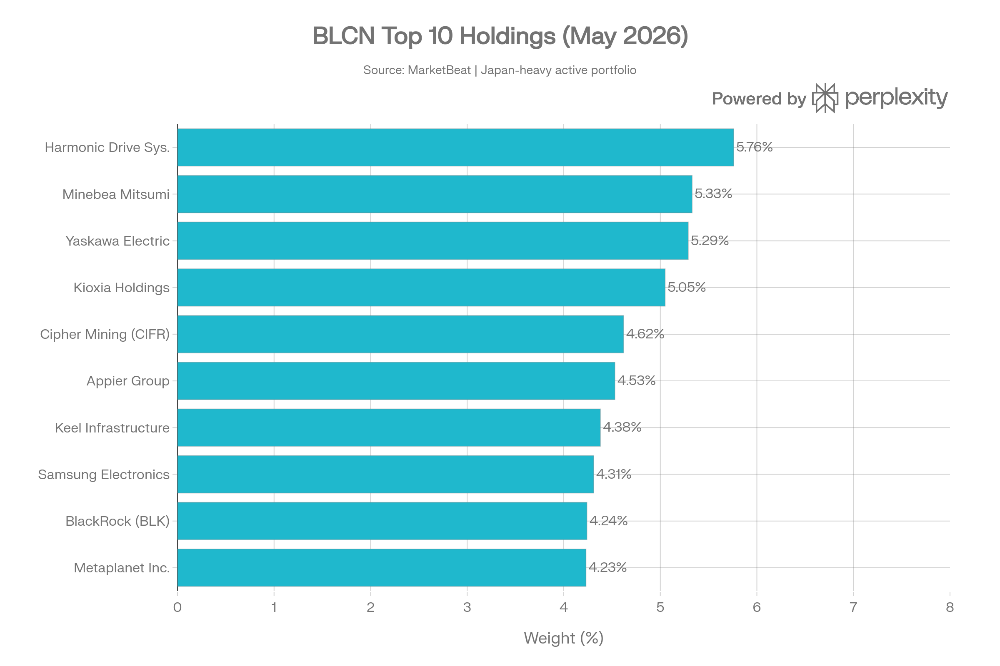
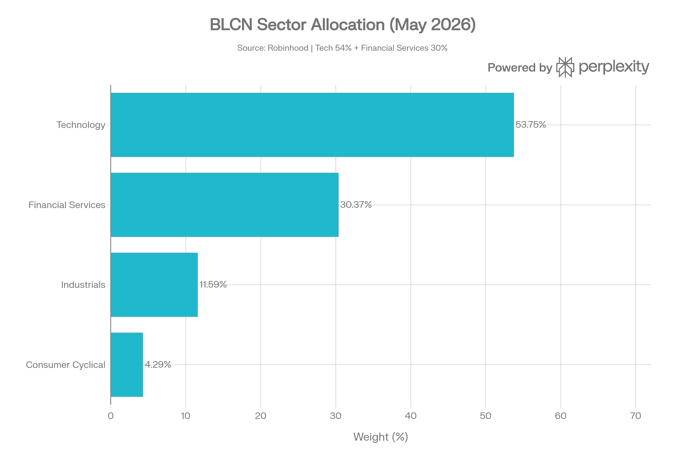
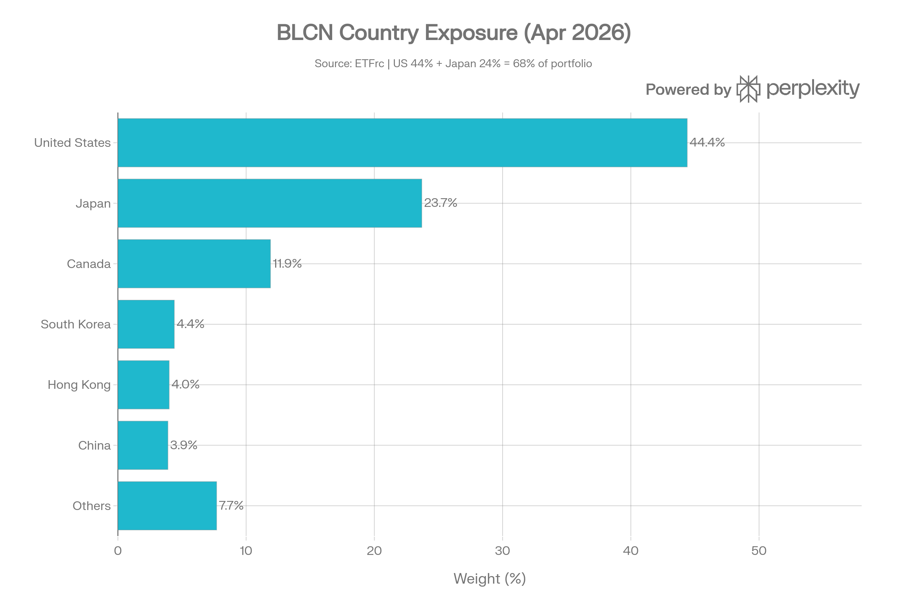
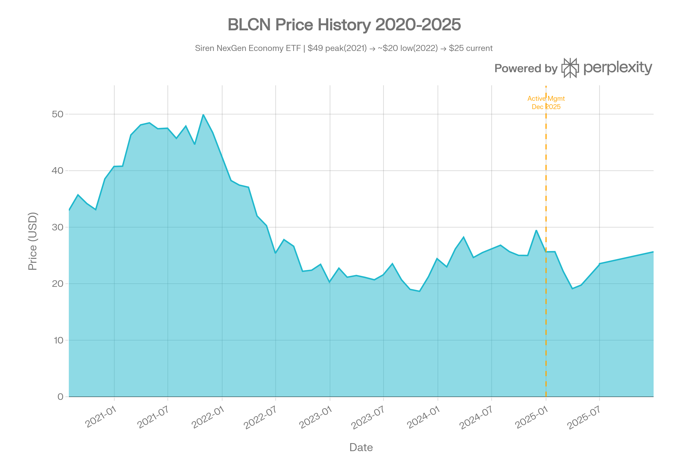
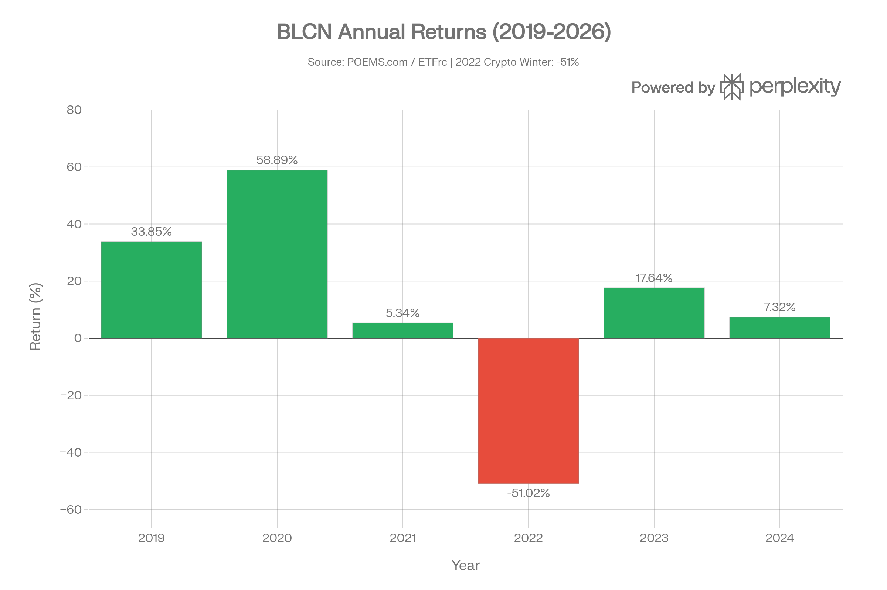
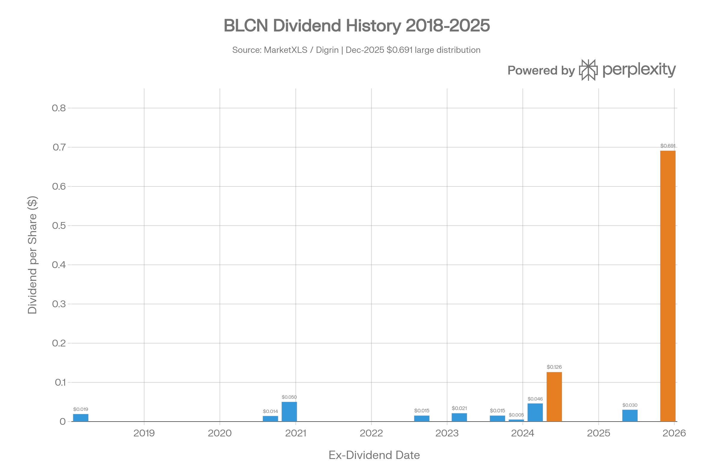

## 요약

> <strong>작성일</strong>: 2026년 5월 25일 기준 데이터 | <strong>운용사</strong>: SRN Advisors, LLC | ⚠️ <strong>중요 변경</strong>: 2025년 12월 29일부로 패시브→액티브 전략 전환

***
## ETF 분류

| 항목 | 내용 |
|------|------|
| <strong>최종 폴더</strong> | `ETF/Blockchain/BLCN` |
| <strong>대분류</strong> | 테마 |
| <strong>하위 분류</strong> | 블록체인 |
| <strong>핵심 전략</strong> | 블록체인·차세대 경제 관련 글로벌 주식에 투자 |
| <strong>운용 방식</strong> | 액티브 |
| <strong>레버리지·인버스 여부</strong> | 아니오 |
| <strong>옵션 인컴 전략 여부</strong> | 아니오 |

BLCN은 명칭과 과거 지수에 `Nasdaq`이 포함되어 있지만, 실제 투자 노출은 대표지수형 Nasdaq ETF가 아니라 <strong>블록체인·차세대 경제 테마 주식</strong>입니다. ETF 분류 기준상 레버리지, 자산군, 인컴, 대표지수, 섹터에 해당하지 않으므로 실제 노출을 기준으로 `Blockchain` 테마 폴더에 분류합니다.

***
## 1. 기본 정보
BLCN은 <strong>SRN Advisors, LLC</strong>가 운용하는 <strong>블록체인·차세대 경제(NexGen Economy) 테마 글로벌 주식 ETF</strong>다. 2018년 1월 17일 설정 이후 약 8년간 운용되어 왔으며, <strong>2025년 12월 29일을 기점으로 패시브 인덱스 추종에서 액티브 관리 전략으로 근본적인 전략 전환</strong>을 완료했다.

| 항목 | 내용 |
|------|------|
| <strong>정식 명칭</strong> | Siren NexGen Economy ETF (변경 전: Siren Nasdaq NexGen Economy ETF) |
| <strong>법인 구조</strong> | Siren ETF Trust (오픈엔드 펀드) |
| <strong>티커</strong> | BLCN (NASDAQ) |
| <strong>설정일</strong> | 2018년 1월 17일 |
| <strong>운용 기간</strong> | 약 8.3년 |
| <strong>기존 추종 지수</strong> | Nasdaq Blockchain Economy Index (RSBLCN) |
| <strong>현재 투자 목표</strong> | 장기 자본이득 추구 (액티브) |
| <strong>운용사</strong> | SRN Advisors, LLC (CEO: Scott Freeze) |
| <strong>유통사(Distributor)</strong> | Foreside Fund Services, LLC |
| <strong>수탁기관</strong> | U.S. Bank, N.A. |
| <strong>상장거래소</strong> | NASDAQ |
| <strong>순자산(AUM)</strong> | 약 $34.5M (2026년 5월 22일 기준) |
| <strong>발행 주식 수</strong> | 약 1,380,000주 |
| <strong>현재가</strong> | $24.55 (2026년 5월 22일) |
| <strong>NAV</strong> | $25.35 (2026년 5월 22일) |
| <strong>총 보수(TER)</strong> | 0.68% |
| <strong>분배 주기</strong> | 반기(Semi-Annual) → 분기(Quarterly) 변동 |
| <strong>베타</strong> | 1.58x |
| <strong>ESG Score</strong> | 6.08 (전체 38.1%ile) |

***
## 2. 핵심 전략 전환: 패시브 → 액티브 (2025년 12월)
BLCN의 가장 중요한 최근 변화는 <strong>2025년 12월 29일자 전략 전환</strong>이다.
### 변경 전 (2018.01\~2025.12)
- <strong>패시브 인덱스 추종</strong>: Nasdaq Blockchain Economy Index를 80% 이상 복제
- <strong>Nasdaq Blockchain Economy Index</strong>는 블록체인 기술을 개발·연구·지원·혁신하거나 활용하는 기업들의 성과를 추적하는 수정 블록체인 스코어 가중 지수
- 연 1회 리밸런싱 (연간 재조정)
- 자체 '블록체인 스코어(Blockchain Score)' 기반 종목 선별 및 가중
### 변경 후 (2025.12.29\~현재)
- <strong>완전 액티브 관리</strong>: 펀드 매니저가 종목 선택에 완전한 재량권 보유
- <strong>투자 목표 변경</strong>: 인덱스 복제 → 장기 자본이득(Long-term Capital Appreciation) 추구
- <strong>명칭 변경</strong>: "Siren Nasdaq NexGen Economy ETF" → "Siren NexGen Economy ETF"
- <strong>확장된 투자 범위</strong>: 블록체인 특화에서 "차세대 경제(NexGen Economy)" 광범위 테마로 확대

이 전환은 블록체인 관련 투자가 높은 변동성과 투자자 심리 변화에 직면하면서 SRN Advisors가 보다 유연한 액티브 운용으로 전략을 재편한 것이다.

***
## 3. 추종 성과 지표
### 추적오차 및 NAV 괴리율
2025년 12월 이후 액티브 관리로 전환됨에 따라 전통적 추적오차(Tracking Error) 분석은 현재 적용되지 않는다.

| 항목 | 수치 |
|------|------|
| <strong>NAV 대비 시장가격 괴리율(Premium/Discount)</strong> | +0.11% (소폭 프리미엄) |
| <strong>NAV</strong> | $25.35 (2026.05.22) |
| <strong>시장 종가</strong> | $24.55 (2026.05.22) |
| <strong>52주 고가</strong> | $30.50 |
| <strong>52주 저가</strong> | $19.36 |
| <strong>30일 평균 입찰/매도 스프레드</strong> | 3.81% |

입찰/매도 스프레드 3.81%는 소규모 AUM과 낮은 거래량을 반영하는 <strong>높은 거래 비용</strong>으로, 단기 매매 시 상당한 마찰 비용 발생에 주의가 필요하다.

***
## 4. 비용 구조
| 항목 | 수치 |
|------|------|
| <strong>총 보수(Gross Expense Ratio)</strong> | 0.68% |
| <strong>관리 수수료</strong> | 0.68% |
| <strong>기타 비용</strong> | 0.00% |
| <strong>비용 감면</strong> | 없음 |
| <strong>단기 자본이득세율(최대)</strong> | 40% |
| <strong>장기 자본이득세율(최대)</strong> | 20% |
| <strong>세금 양식</strong> | 1099 |
| <strong>포트폴리오 회전율</strong> | 2.3% |
### 경쟁 블록체인·차세대 기술 ETF 비용 비교
| ETF | 전략 | 보수 | AUM |
|-----|------|------|-----|
| <strong>BLCN</strong> | NexGen Economy 글로벌 주식 (액티브) | <strong>0.68%</strong> | \~$34.5M |
| BKCH | 블록체인 글로벌 주식 (Global X) | 0.50% | \~$300M |
| BITQ | 블록체인·크립토 주식 (Invesco) | 0.65% | \~$200M |
| BLOK | 블록체인 트렌스포메이션 (Amplify) | 0.76% | \~$450M |

0.68%의 보수는 블록체인 테마 ETF 중간 수준이지만, BKCH(0.50%) 대비 높고 BLOK(0.76%) 대비는 낮다. 포트폴리오 회전율 2.3%는 매우 낮은 편으로 거래 비용 부담이 적다.

***
## 5. 유동성 평가
| 항목 | 수치 |
|------|------|
| <strong>일평균 거래량(30일)</strong> | 약 23,325주 |
| <strong>일평균 거래대금</strong> | 약 $32,000\~$57,000 |
| <strong>AUM</strong> | $34.50M |
| <strong>발행 주식 수</strong> | 약 1,380,000주 |
| <strong>호가 스프레드 평균(30일)</strong> | 3.81% |
| <strong>숏 인터레스트</strong> | 88,100주 (AUM 대비 4.2%) |
| <strong>옵션 여부</strong> | 옵션 거래 가능 |
| <strong>1년 펀드 플로우</strong> | 데이터 미공시 |

AUM $34.5M과 일평균 거래대금 약 $3만2천은 <strong>소형 ETF로서 유동성이 매우 낮은</strong> 수준이다. 호가 스프레드 3.81%는 블록체인 테마 ETF 중에서도 높은 편으로, 기관 투자자나 대규모 거래에는 부적합하다. 유동성 리스크는 이 ETF의 핵심 약점 중 하나다.

***
## 6. 포트폴리오 구성
### 상위 10대 보유 종목 (2026년 5월 기준)
| 순위 | 종목 | 국가 | 비중 |
|------|------|------|------|
| 1 | 미국 국채 머니마켓(First American) | 미국 | 7.63% |
| 2 | <strong>Harmonic Drive Systems</strong> (6324.T) | 일본 | 5.76% |
| 3 | <strong>Minebea Mitsumi</strong> (6479.T) | 일본 | 5.33% |
| 4 | <strong>Yaskawa Electric</strong> (6506.T) | 일본 | 5.29% |
| 5 | <strong>Kioxia Holdings</strong> (285A.T) | 일본 | 5.05% |
| 6 | <strong>Cipher Mining</strong> (CIFR) | 미국 | 4.62% |
| 7 | <strong>Appier Group</strong> (4180.T) | 일본 | 4.53% |
| 8 | <strong>Keel Infrastructure Corp</strong> (KEEL.TO) | 캐나다 | 4.38% |
| 9 | <strong>BlackRock</strong> (BLK) | 미국 | 4.24% |
| 10 | <strong>Metaplanet Inc.</strong> | 일본 | 4.23% |

*▲ BLCN 상위 10대 보유 종목 비중 (2026.05): 일본 기업 비중이 높고 미국 금융·암호화폐 마이닝 기업 혼재*

> ⚠️ <strong>전략 전환 이후 포트폴리오 변화</strong>: 2025년 12월 액티브 전환 이후 포트폴리오 구성이 기존 블록체인 순수 플레이(Coinbase, MicroStrategy 등)에서 일본 정밀기계·전자 기업과 글로벌 금융 대형주(BlackRock, JPMorgan 등)로 크게 이동했다. 이는 펀드의 "NexGen Economy" 광범위 테마를 반영한다.
### 섹터별 배분 (2026년 5월)
| 섹터 | 비중 |
|------|------|
| 기술(Technology) | 53.75% |
| 금융 서비스(Financial Services) | 30.37% |
| 산업재(Industrials) | 11.59% |
| 경기소비재(Consumer Cyclical) | 4.29% |

*▲ BLCN 섹터 배분 현황 (2026.05): Technology 54% + Financial Services 30%*
### 국가별 익스포저 (2026년 4월 기준)
| 국가 | 비중 |
|------|------|
| 미국 | 44.4% |
| 일본 | 23.7% |
| 캐나다 | 11.9% |
| 한국 | 4.4% |
| 홍콩 | 4.0% |
| 중국 | 3.9% |
| 기타 | 7.7% |

*▲ BLCN 국가별 익스포저 (2026.04): 미국 44% + 일본 24%로 선진국 집중*

- <strong>대형주 비중</strong>: 34.0% / <strong>중형주</strong>: 33.9% / <strong>소형주</strong>: 7.3% / <strong>초소형주</strong>: 15.7%
- <strong>선진국 비중</strong>: 72.0% / <strong>신흥국 비중</strong>: 8.3%
- <strong>총 보유 종목 수</strong>: 약 21\~31개
### 리밸런싱 주기
- <strong>기존(패시브 시절)</strong>: 연 1회 정기 리밸런싱 (Nasdaq Index 기준)
- <strong>현재(액티브 관리)</strong>: 펀드 매니저 재량에 따라 수시 리밸런싱

***
## 7. 성과 분석
### 기간별 수익률 (2026년 4월 30일 기준)
| 기간 | BLCN 가격 수익률 | BLCN 총수익률 | 벤치마크(MSCI ACWI) |
|------|----------------|-------------|-------------------|
| YTD | <strong>-3.4%</strong> | -3.4% | — |
| 1년 | <strong>+17.0%</strong> | +17.2% | — |
| 2년 | <strong>-3.1%</strong> | -2.8% | — |
| 3년 | <strong>+3.1%</strong> | +3.5% | — |
| 5년 | <strong>-13.8%</strong> | -13.3% | — |
| 설정 이후(연환산) | <strong>-1.9%</strong> | -1.3% | — |

*▲ BLCN 가격 추이 (2020-2025): 2021년 고점($49) 이후 2022년 크립토 윈터로 큰 폭 하락, 현재 $24 수준*
### 연도별 수익률
| 연도 | 수익률 |
|------|--------|
| 2019 | +33.85% |
| 2020 | +58.89% |
| 2021 | +5.34% |
| 2022 | <strong>-51.02%</strong> |
| 2023 | +17.64% |
| 2024 | +7.32% |
| 2026 YTD | <strong>-3.4%</strong> |

*▲ BLCN 연도별 수익률: 2019\~2020년 큰 폭 상승 후 2022년 -51% 크립토 윈터 충격, 2023년 부분 회복*
### 위험 조정 성과 지표
| 지표 | 수치 |
|------|------|
| <strong>샤프 지수(Sharpe Ratio)</strong> | 0.17 |
| <strong>베타</strong> | 1.24(1년 기준) / 1.58(현재) |
| <strong>RSI(30일)</strong> | 59 |
| <strong>30일 EMA</strong> | $24.25 |
| <strong>설정 이후 연환산 수익률</strong> | -1.9% |
| <strong>5년 수익률</strong> | -13.8% |

샤프 지수 0.17은 같은 글로벌 주식 카테고리 내에서 <strong>하위 7%ile</strong> 수준으로 매우 저조한 위험 조정 성과를 보여준다. 설정 이후 연환산 -1.9%는 원금 이하의 누적 성과를 의미한다.

***
## 8. 배당 정보
### 배당 이력 (설정 이후 주요 배당)
| 배당락일 | 지급일 | 주당 배당금 | 비고 |
|---------|--------|-----------|------|
| 2018-03-26 | 2018-03-29 | $0.0190 | 설정 초기 |
| 2020-09-22 | 2020-09-25 | $0.0141 | — |
| 2020-12-xx | — | $0.0500 | — |
| 2022-09-22 | 2022-09-26 | $0.0150 | — |
| 2023-03-23 | 2023-03-27 | $0.0210 | — |
| 2023-09-22 | 2023-09-26 | $0.0149 | — |
| 2023-12-22 | 2023-12-27 | $0.0051 | — |
| 2024-03-22 | 2024-03-26 | $0.0458 | — |
| 2024-06-21 | 2024-06-24 | <strong>$0.1259</strong> | 배당 급증 |
| 2025-06-24 | 2025-06-25 | $0.0303 | — |
| 2025-12-xx | 2025-12-xx | <strong>$0.6912</strong> | 대규모 특별배당 |

*▲ BLCN 배당 이력: 소액의 반기 배당이 주를 이루며, 2025년 12월에만 이례적으로 $0.69 대형 배당 발생*
### 현재 배당 지표
| 항목 | 수치 |
|------|------|
| <strong>연간 배당금(TTM)</strong> | $0.72/주 |
| <strong>배당 수익률</strong> | 2.85\~2.93% |
| <strong>배당 성장률(3년)</strong> | <strong>-11.00%</strong> (감소 추세) |
| <strong>배당 성장률(5년)</strong> | <strong>-6.74%</strong> |
| <strong>배당 지급 주기</strong> | 반기(Semi-Annual) |
| <strong>배당 성향(Payout Ratio)</strong> | 3.31% (액티브 전환 후) |

배당은 주식 자본이득 배분에 의존하며, 일반적으로 연간 소액($0.03\~$0.13)에 불과하다. 2025년 12월 $0.69의 대형 배당은 전략 전환 시점의 자본이득 분배로 추정된다. 3년 배당 성장률 -11%는 배당 인컴 투자에 부적합함을 시사한다.

***
## 9. 리스크 요소
### 베타 계수 및 시장 민감도
- <strong>베타 1.58</strong>: 시장 평균보다 58% 높은 변동성
- S&P 500 대비 고베타로, 시장 급락 시 더 큰 손실 예상
- 비트코인과의 상관계수: 약 0.53 — 크립토 시장과 중간 수준 연동
### 최대 낙폭(Maximum Drawdown)
| 구간 | 낙폭 |
|------|------|
| <strong>2021년 고점($49) → 2022년 저점(\~$18)</strong> | <strong>약 -63%</strong> |
| <strong>2022년 크립토 윈터 연간 수익률</strong> | <strong>-51.02%</strong> |
| <strong>2025년 고점($30.50) → 2025년 저점($19.36)</strong> | <strong>-36.5%</strong> |

2022년 크립토 윈터에서 -51%의 손실은 블록체인 테마 투자의 극단적 변동성을 보여준다. 설정 이후 누적 수익률이 연환산 -1.9%로 원금 이하인 점은 장기 투자자에게 심각한 경고 신호다.
### 섹터 집중 리스크
- 기술 53.75% + 금융 30.37% = <strong>84% 이상 집중</strong>
- AI·반도체 시장 침체 또는 암호화폐 규제 강화 시 포트폴리오 전반에 동시 타격 가능
### 지역 집중 및 환위험
- 일본 비중 23.7%로 엔화 환위험 노출
- 환헤지 없음(Currency Hedged: No)
- 엔/달러 환율 변동이 실질 수익률에 직접 영향
### 액티브 전환 관련 리스크
- <strong>운용 위험(Manager Risk)</strong>: 액티브 관리 전환 후 펀드 매니저 역량에 수익률이 의존
- <strong>전략 불연속성</strong>: 과거 패시브 실적이 미래 액티브 성과의 참고 지표로 제한적
- <strong>소규모 AUM 청산 리스크</strong>: AUM $34.5M은 ETF 청산 임계 기준에 근접한 수준
### 다른 자산군과의 상관관계
| 비교 자산 | 상관계수(추정) |
|----------|-------------|
| Nasdaq-100 (QQQ) | 양의 상관 (기술주 비중 높음) |
| 비트코인 (BTC) | \~0.53 |
| 금(Gold) | 낮은 상관 |
| 미국 채권(BND) | 낮은 상관 |
| BKCH(블록체인 ETF) | 높은 양의 상관 |

***
## 10. 경쟁 ETF 비교
| 항목 | BLCN | BKCH (Global X) | BLOK (Amplify) | BITQ (Invesco) |
|------|------|-----------------|----------------|----------------|
| <strong>전략</strong> | NexGen Economy 액티브 | 블록체인 글로벌 액티브 | 블록체인 변혁 패시브 | 블록체인 글로벌 | 
| <strong>보수</strong> | 0.68% | 0.50% | 0.76% | 0.65% |
| <strong>AUM</strong> | \~$34.5M | \~$300M | \~$450M | \~$200M |
| <strong>설정일</strong> | 2018.01 | 2021.07 | 2018.01 | 2021.07 |
| <strong>종목 수</strong> | \~21\~31개 | \~26개 | \~50개 | \~35개 |
| <strong>지역</strong> | 글로벌 | 미국 중심 | 글로벌 | 글로벌 |
| <strong>비트코인 상관</strong> | \~0.53 | 높음 | 높음 | 높음 |

BLCN은 경쟁 블록체인 ETF 대비 <strong>오랜 운용 이력(2018년 설정)과 낮은 종목 집중도(글로벌 분산)</strong>라는 장점이 있다. 그러나 AUM이 $34.5M으로 경쟁사 대비 매우 소규모이고 유동성이 낮으며, 보수(0.68%)는 BKCH(0.50%) 대비 높다.

***
## 11. 투자자 고려사항 및 총평
<strong>BLCN은 2025년 12월 패시브→액티브 전략 전환을 단행한 블록체인·차세대 경제 테마 글로벌 주식 ETF다.</strong> 2018년 설정 이후 연환산 수익률 -1.9%로 원금 이하의 누적 성과를 보이고 있으며, 2022년 크립토 윈터에서 -51%의 극심한 손실을 경험했다.
### 핵심 장·단점
| 구분 | 내용 |
|------|------|
| <strong>장점</strong> | 블록체인 테마 ETF 중 가장 긴 운용 이력(2018년), 글로벌 분산(미국·일본·캐나다 등), 낮은 회전율(2.3%), 합리적 보수(0.68%) |
| <strong>단점</strong> | 설정 이후 연환산 수익률 -1.9%, 소규모 AUM $34.5M으로 낮은 유동성, 호가 스프레드 3.81%, 배당 성장률 -11%, 2025.12 전략 전환으로 과거 실적 참고 제한 |
### 투자 적합 프로파일
- <strong>적합</strong>: 블록체인·차세대 경제 테마 장기 분산 투자자, 전통 블록체인 ETF 대비 글로벌 분산 선호 투자자
- <strong>부적합</strong>: 안정적 수익과 낮은 변동성 추구 투자자, 고유동성 ETF 요구 투자자, 배당 인컴 투자자, 단기 트레이더
### 핵심 지표 요약
| 항목 | 평가 |
|------|------|
| 운용 이력 | ⭐⭐⭐⭐ (8.3년) |
| 장기 성과 | ⭐ (설정 이후 연환산 -1.9%) |
| 비용 효율성 | ⭐⭐⭐ (0.68%, 업종 평균 수준) |
| 유동성 | ⭐ (AUM $34.5M, 스프레드 3.81%) |
| 분산 효과 | ⭐⭐⭐⭐ (6개국 이상 글로벌 분산) |
| 배당 안정성 | ⭐⭐ (반기 소액, 성장률 -11%) |
| 변동성 리스크 | 🔴 매우 높음 (베타 1.58, MDD -63%) |
| 전략 명확성 | 🟡 불확실 (액티브 전환 후 방향성 관찰 필요) |

> ⚠️ <strong>면책 조항</strong>: 본 보고서는 정보 제공 목적으로 작성되었으며, 투자 권고로 해석되어서는 안 된다. 모든 투자에는 원금 손실 가능성이 있으며, 소규모 ETF 및 블록체인 테마 투자는 추가적인 변동성과 유동성 리스크를 내포한다.
