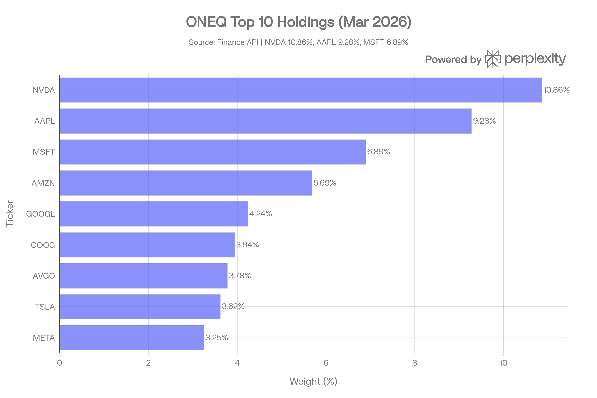
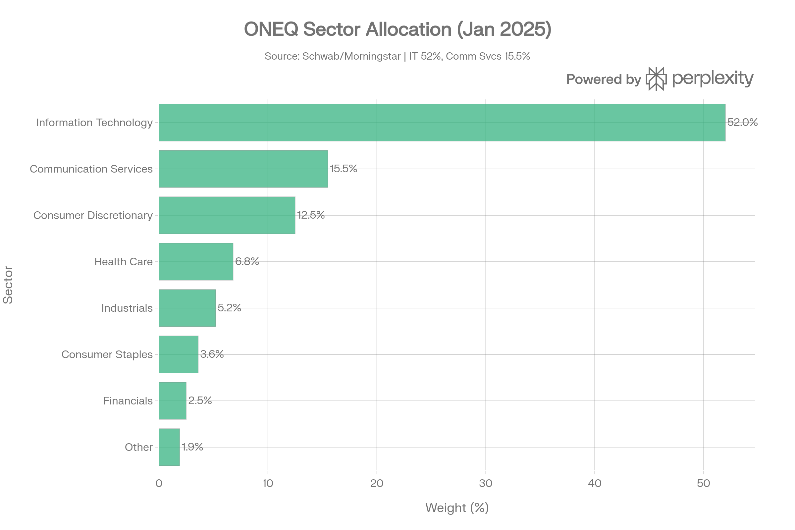
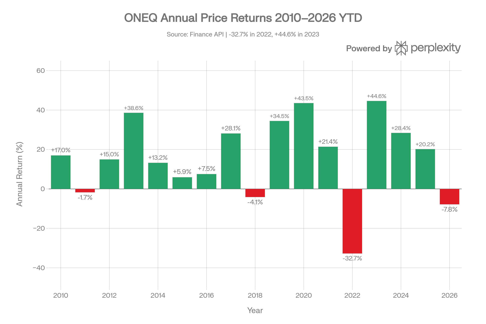

## 요약

> **분석 기준일: 2026년 3월 27일**

***
## ETF 분류

| 항목 | 내용 |
|------|------|
| **최종 폴더** | `ETF/Broad Market/Nasdaq Composite/ONEQ` |
| **대분류** | 대표지수 |
| **하위 분류** | Nasdaq Composite |
| **핵심 전략** | NASDAQ Composite Index 추종 |
| **운용 방식** | 패시브, 통계적 샘플링 |
| **레버리지·인버스 여부** | 아니오 |
| **옵션 인컴 전략 여부** | 아니오 |

ONEQ는 Nasdaq-100이 아니라 나스닥 거래소 상장 전반을 포괄하는 **NASDAQ Composite Index**를 추종합니다. 레버리지, 옵션 인컴, 섹터·테마 전략이 결합되지 않은 대표지수형 ETF이므로 `Broad Market/Nasdaq Composite`로 분류합니다.

***
## 1. 기본 정보
ONEQ는 Fidelity Investments가 **2003년 9월 25일** 출시한 ETF로, **NASDAQ Composite Index** 전체를 추종하는 세계 유일의 ETF입니다. 나스닥-100(100개 종목)이 아닌 나스닥 거래소에 상장된 **전 종목(3,000개+)**을 대상으로 하여, 중소형주부터 초대형주까지 나스닥 시장 전체를 하나의 펀드에 담습니다. 22년 이상의 운용 이력과 약 $8.7~9.0B의 AUM을 자랑하는 나스닥 전 시장 노출의 표준 ETF입니다.[1][2][3][4][5]

| 항목 | 내용 |
|------|------|
| 정식명 | Fidelity Nasdaq Composite Index ETF |
| 티커 | ONEQ |
| 설정일 | 2003년 9월 25일[2][1] |
| 추종 지수 | NASDAQ Composite Index[6][2] |
| 운용사 | Fidelity Investments[1] |
| 상장거래소 | NASDAQ[6] |
| AUM | 약 $8.64~9.0B (2026년 3월)[7][1][8] |
| 현재가 | $84.26 (2026-03-26) |
| 총 보수(TER) | **0.21%**[9][6] |
| 운용 방식 | 패시브(통계적 샘플링)[10][1] |
| 보유 종목 수 | 1,031개[10][5] |
| PE 비율 | 30.21배 |
| 52주 가격 범위 | $58.12~$94.49 |

***
## 2. 추종 지수 및 전략 구조
### NASDAQ Composite Index 특성
NASDAQ Composite Index는 나스닥 거래소에 상장된 **모든 종목(내국·외국 기업 포함)**을 시가총액 가중 방식으로 편입하는 광범위한 지수입니다. QQQ가 추종하는 나스닥-100과 달리, ONEQ는 나스닥-100에 들어가지 못하는 **중소형 성장 기업, 바이오테크, 스타트업 등 차세대 성장주**까지 포함합니다.[2][4][5]

| 구분 | ONEQ (NASDAQ Composite) | QQQ (NASDAQ-100) |
|------|------------------------|-----------------|
| 종목 수 | **1,031개+**[4] | 100개[4] |
| 시총 범위 | 대형+중형+소형[2] | 대형주 중심[4] |
| 금융주 포함 | 일부[4] | 제외[4] |
| 상장거래소 | 나스닥만[2] | 나스닥만 |
| 리밸런싱 | 일일 재구성[2] | 분기별 |
### 통계적 샘플링 운용 방식
Fidelity는 3,000개+ 전 종목을 직접 보유하지 않고, **시가총액·산업·배당수익률·P/E·P/B 등을 고려한 통계적 샘플링** 기법으로 1,031개 종목을 편입합니다. 이 방식은 거래 비용을 낮추면서도 지수 성과를 정밀하게 추적합니다.[10][1]

***
## 3. 추종 성과 지표
### 추적오차(Tracking Error) 및 추적 차이
| 기간 | 추적오차(TE) |
|------|------------|
| 1년 | 7.07%[11] |
| 3년 | 7.44%[11] |
| 5년 | 7.45%[11] |
| 10년 | 6.48%[11] |
| 15년 | 5.93%[11] |

> 추적오차가 비교적 높게 나타나는 이유는 **벤치마크(NASDAQ Composite)가 3,000+종목인데 펀드가 1,031종목을 샘플링**하기 때문입니다. 그러나 실질적 추적 차이(Tracking Difference)는 -0.17%(중앙값)로 지수 대비 오히려 소폭 초과 성과를 보입니다.[12]
### NAV 대비 시장가격 괴리율
- 중앙값 프리미엄/디스카운트: **0.01%** — 사실상 제로[12]
- 최대 업사이드 추적 차이: -0.03%[12]
- 최대 다운사이드 추적 차이: -0.31%[12]
- 1년 자금 유입: +$329.01M[8]

***
## 4. 비용 구조
### 총 보수(TER)
ONEQ의 연간 총 보수율은 **0.21%**입니다. 동일 카테고리(나스닥 기반) ETF 대비 경쟁력 있는 수준이나, QQQM(0.15%)보다는 6bp 높습니다.[9][6][13][14]
### 경쟁 ETF 비용 비교
| ETF | 추종 지수 | 보수율 | AUM | 종목 수 |
|-----|---------|--------|-----|--------|
| **ONEQ** | NASDAQ Composite | **0.21%**[6] | $8.64B[7] | 1,031개[5] |
| QQQ | NASDAQ-100 | 0.18%[15] | ~$350B+[16] | 100개 |
| QQQM | NASDAQ-100 | 0.15%[13] | $69B[13] | 100개 |
| QQQJ | NASDAQ Next Gen 100 | 0.15% | ~$710M | 99~107개 |
### 포트폴리오 회전율
포트폴리오 회전율은 약 **5%**로 매우 낮아 세금 효율이 높습니다. 나스닥 지수 구성의 큰 변화가 없는 한 잦은 교체가 발생하지 않습니다. 배당 세금 비용비율(Tax Cost Ratio)은 1년 0.2%, 3년 0.3%, 10년 0.3%로 장기 세금 효율도 양호합니다.[1][13]

***
## 5. 유동성 평가
ONEQ는 대형 ETF로 안정적인 유동성을 제공합니다. 일평균 거래량은 약 **330,161주(3개월 기준)**, 일평균 거래대금은 약 **$29.82M**으로, 개인투자자 및 중소 기관에 충분한 유동성입니다.

| 유동성 지표 | 수치 |
|------------|------|
| AUM | ~$8.64~9.0B[7][1] |
| 일평균 거래량 (3M) | ~330,161주 |
| 일평균 거래대금 (3M) | ~$29.82M |
| 10일 평균 거래량 | 237,799주[1] |
| 1년 자금 유입 | +$329M[8] |
| NAV 괴리율(중앙값) | 0.01%[12] |
| SEC Yield | 0.36%[1] |
| Distribution Yield | 0.58%[1] |

QQQM($69B AUM, 하루 $154M 거래)이나 QQQ($350B+)보다는 유동성이 낮지만, 장기 패시브 투자자에게는 전혀 문제없는 수준입니다.[14]

***
## 6. 포트폴리오 구성
### 상위 10대 보유 종목 (2026년 3월 기준)

| 순위 | 티커 | 종목명 | 비중 |
|------|------|--------|------|
| 1 | NVDA | NVIDIA | 10.86% |
| 2 | AAPL | Apple | 9.28% |
| 3 | MSFT | Microsoft | 6.89% |
| 4 | AMZN | Amazon | 5.69% |
| 5 | GOOGL | Alphabet A | 4.24% |
| 6 | GOOG | Alphabet C | 3.94% |
| 7 | AVGO | Broadcom | 3.78% |
| 8 | TSLA | Tesla | 3.62% |
| 9 | META | Meta Platforms | 3.25%[9] |
| 10 | COST | Costco | ~3.0%[4] |

**상위 10종목 합계: 약 56~62%** — 1,031종목 보유에도 상위 소수 대형주 집중도가 높습니다.[4][5]
### 섹터별 배분 (2025년 1월 기준)

| 섹터 | 비중 |
|------|------|
| 정보기술(IT) | **52.0%**[1] |
| 커뮤니케이션서비스 | 15.5%[1] |
| 경기소비재 | 12.5%[5] |
| 헬스케어 | 6.8%[1] |
| 산업재 | 5.2%[1] |
| 필수소비재 | 3.6%[1] |
| 금융 | 2.5%[1] |
| 기타 | ~1.9% |

IT 섹터 52%는 QQQ(~63%)보다는 낮지만 여전히 극도로 집중된 구조입니다. **나스닥 특성상 에너지, 재료, 유틸리티 섹터는 거의 편입되지 않습니다**.[1][2][15]
### 국가별 분산
펀드는 나스닥 상장 기업을 대상으로 하여 실질적으로 **미국 주식 96.7%**이며, 비미국 주식이 약 3.8%를 차지합니다. 이스라엘(Check Point 등), 아일랜드, 중국 ADR 등 나스닥 상장 외국 기업이 소수 포함됩니다.[1]
### 시가총액 분포 및 다양성
1,031개 종목을 보유하지만, 가중평균 시총이 높아 실질적으로는 대형주 중심입니다. 그러나 QQQ 대비 **중형·소형 성장주에 추가 노출**이 발생하며, 이것이 향후 중소형 성장주 회복 시 알파 창출의 잠재력입니다.[4]

***
## 7. 성과 분석
### 장기 성과
설정 이후(2003년~2026년) ONEQ는 **+1,279.6%**의 누적 수익률을 기록했으며, 이는 연환산 약 13.1%에 해당합니다. Schwab 기준 $10,000 투자 → **$54,145**로 성장한 것으로 나타납니다. 이는 S&P500($41,530) 및 Large Growth 카테고리($41,280)를 모두 상회합니다.[1][11]
### 기간별 총수익률 (배당 포함)
| 기간 | ONEQ | QQQ/QQQM | S&P500 |
|------|------|----------|--------|
| 1년 | **+25.1~25.3%**[1] | ~+27~29% | +20.0%[1] |
| 3년(연환산) | **+23.84%**[17] | ~+24~25% | — |
| 5년(연환산) | **+16.27~16.3%**[1][17] | ~+18~20% | +16.5%[1] |
| 10년(연환산) | **+18.4%**[1] | ~+18.6%[18] | +15.3%[1] |
| 설정 이후 | **+13.1%** 연환산[1] | — | +11.2%[1] |

> 10년 기준 ONEQ(+18.4%)는 S&P500(+15.3%)을 약 3.1%p 웃돌고 QQQ(+18.6%) 수준에 근접합니다. 단, 10년 누적 기준으로는 QQQ의 453% 대비 ONEQ 370%로 다소 뒤처집니다.[4]
### 연간 수익률 내역

| 연도 | 가격 수익률 | 특이사항 |
|------|-----------|---------|
| 2019 | +34.5% | 성장주 강세 |
| 2020 | +43.5% | 팬데믹 반등, 기술주 급등 |
| 2021 | +21.4% | 지속 성장세 |
| 2022 | **-32.7%** | 금리 급등, 성장주 급락 |
| 2023 | **+44.6%** | AI 붐, 강력 반등 |
| 2024 | +28.4% | 양호한 성장세 |
| 2025 | +20.2% | 안정적 성장 |
| 2026 YTD | -7.8% | 관세·매크로 불확실성 |
### 리스크 조정 성과
| 지표 | ONEQ | S&P500 |
|------|------|--------|
| 베타 (1년) | 1.22[11] | 1.0 |
| 베타 (10년) | 1.13[11] | 1.0 |
| 샤프 비율(1Y) | 0.61 | — |
| 소르티노 비율(1Y) | 1.15[11] | — |
| 소르티노 비율(10Y) | 1.28[11] | — |
| 상승 포착률(10Y) | 114.35%[11] | — |
| 하락 포착률(10Y) | 110.69%[11] | — |
| R² (10년) | 88.88%[11] | — |

상승 포착률(114%) > 하락 포착률(111%)로 장기적으로 비대칭 성과 우위가 존재합니다.[11]

***
## 8. 배당 정보
ONEQ는 **분기 배당** ETF로, 배당수익률은 약 **0.55~0.59%** TTM입니다. 성장주 중심 포트폴리오 특성상 배당보다 자본이득에 집중하는 구조입니다.[8][13]

- **Distribution Yield**: 0.58%[1]
- **SEC 30일 수익률**: 0.36%[1]
- **Tax Cost Ratio**: 1년 0.2%, 3년 0.3%, 10년 0.3% — 장기 세금 효율 우수[1]
- **배당 지급일**: 분기별, 최근 전일: 2025년 9월 19일[1]

배당보다는 장기 자본이득을 추구하는 성장형 ETF이며, 과세계좌 장기 투자자에게 유리한 세금 구조를 가집니다.

***
## 9. 리스크 요소
### 핵심 리스크 지표
| 지표 | ONEQ | S&P500 |
|------|------|--------|
| 베타 (10년) | 1.13[11] | 1.0 |
| 1년 변동성 | 23.08% | ~15~17% |
| 3년 변동성 | 19.68% | ~15~17% |
| 최대낙폭(All-time) | **-55.54%** (2009.03) | ~-57% |
| 최대낙폭(최근 3년) | -26.75% | ~-25% |
| 최대낙폭(10년) | -32.07%[11] | — |
| 정보 비율(10년) | 0.41[11] | — |
| 상관계수(10년, vs S&P500) | 94.28%[11] | — |
### 주요 리스크 분석
**1. 기술 섹터 집중 리스크**
IT 52% + 커뮤니케이션서비스 15.5% = **약 68%가 기술 관련 섹터**에 집중됩니다. 기술주 사이클 하락 시 S&P500 대비 더 큰 손실이 불가피합니다. 2022년 -32.7% 하락이 이를 방증합니다.[1][5]

**2. 상위 종목 집중 리스크**
1,031개 종목을 보유하지만 상위 10종목이 56~62%를 차지하는 **"중형 꼬리 달린 메가캡 집중" 구조**입니다. 매그니피센트 7 등 소수 종목의 블로우업 위험이 존재합니다.[2][4][5]

**3. QQQ 대비 장기 성과 열위**
10년 기준 QQQ +18.6% 대비 ONEQ +16.4%로, 중소형 성장주 포함으로 인한 희석 효과가 나타납니다. 강세장에서 100% 대형 나스닥주에 집중하는 QQQ가 더 유리했습니다.[4][18]

**4. 베타 위험**
베타 1.13~1.22로 시장보다 변동성이 높습니다. 하락장에서 S&P500 대비 더 큰 손실이 발생하며, 하락 포착률 110%가 이를 확인합니다.[11]

**5. 에너지·금융 등 섹터 미노출**
나스닥 거래소 특성상 에너지, 원자재, 전통 금융·산업주가 거의 편입되지 않아, 섹터 로테이션 환경에서 소외될 수 있습니다.[2]

**6. 소형·중형주 리스크(긍정적 다양성과 이면)**
QQQ 대비 중소형 성장주를 포함하므로, 금리 상승기·유동성 긴축 환경에서 추가 약세 가능성이 있습니다.

***
## 10. 경쟁 ETF와의 종합 비교
| 항목 | ONEQ | QQQ | QQQM | QQQJ |
|------|------|-----|------|------|
| 추종 지수 | NASDAQ Composite | NASDAQ-100 | NASDAQ-100 | NASDAQ Next Gen 100 |
| 종목 수 | **1,031개**[4] | 100개 | 100개 | ~100개 |
| AUM | $8.64B[7] | ~$350B+[16] | $69B[13] | ~$710M |
| 보수율 | 0.21%[6] | 0.18%[15] | 0.15%[13] | 0.15% |
| 10년 연환산 수익률 | 16.2~18.4%[1][18] | 18.6%[18] | ≈QQQ | ~14%+ |
| 설정 이후 연환산 | 13.1%[1] | — | — | 6.7% |
| 배당수익률 | 0.55%[13] | 0.5% | 0.50%[13] | 0.85% |
| 베타(10년) | 1.13[11] | ~1.13 | ~1.13 | ~1.05 |
| 최대낙폭(10년) | -32.07%[11] | ~-30% | ~-30% | ~-40% |
| 중소형주 포함 | **예**[4] | 아니오 | 아니오 | 일부 |

***
## 11. 종합 평가
ONEQ는 **나스닥 전체 시장에 한 번에 투자하는 유일한 수단**으로, 22년 이상의 운용 이력과 $8.7B AUM으로 신뢰도가 높습니다. 설정 이후 S&P500과 Large Growth 카테고리를 모두 능가하는 장기 성과를 달성했습니다.[1][2]

**ONEQ의 차별화 가치:**
- 나스닥 중소형 성장주, 바이오테크, 미래 성장 기업 포함[4][5]
- 나스닥-100에 편입되지 못한 '차세대 성장주'(QQQJ 유니버스 포함) 노출
- 장기 설정 이후 수익률 1,279% — QQQ보다 이른 설정으로 절대 성과 인상적[11]

**투자 적합 케이스:**
- 나스닥-100(대형주)보다 더 넓은 나스닥 전체 노출을 원하는 투자자
- 중소형 성장주의 미래 알파를 기대하는 장기 투자자
- 단일 ETF로 나스닥 생태계 전체를 포괄하고자 하는 투자자

**투자 주의 케이스:**
- 비용 최소화를 원하는 투자자 → QQQM(0.15%) 선호
- 순수 대형주 집중 선호 투자자 → QQQ/QQQM 우위
- 변동성 최소화 목표 투자자 → 베타 1.13 고려 필요
- 강세장 집중 시에는 QQQ 대비 성과 열위 가능성 존재[4]

ONEQ의 가장 큰 잠재력은 **AI·기술 사이클에서 소외됐던 중소형 나스닥 기업들이 성장할 때** 발휘될 것입니다. 단기적 알파보다 나스닥 전체의 장기 성장 스토리에 베팅하는 투자자에게 적합한 핵심 보유 펀드입니다.
