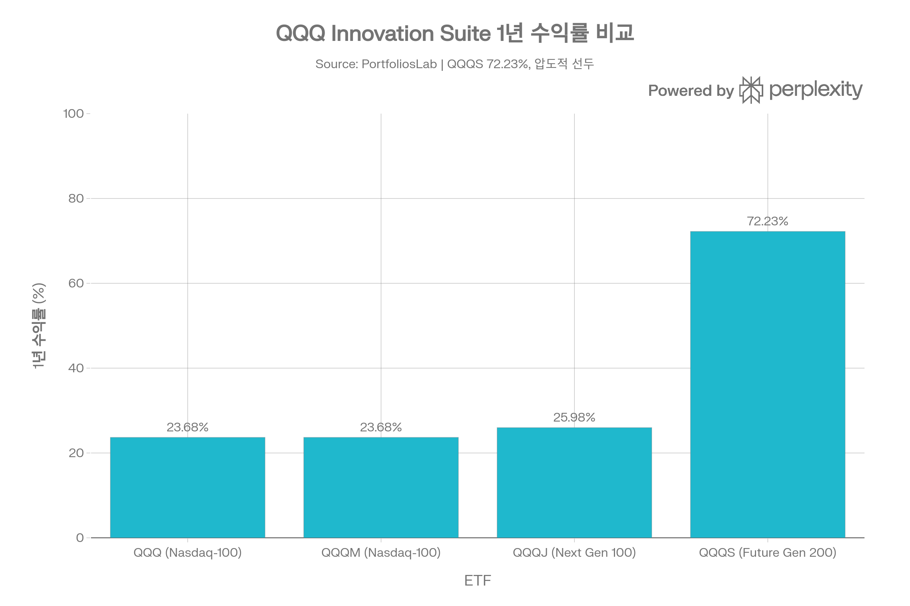
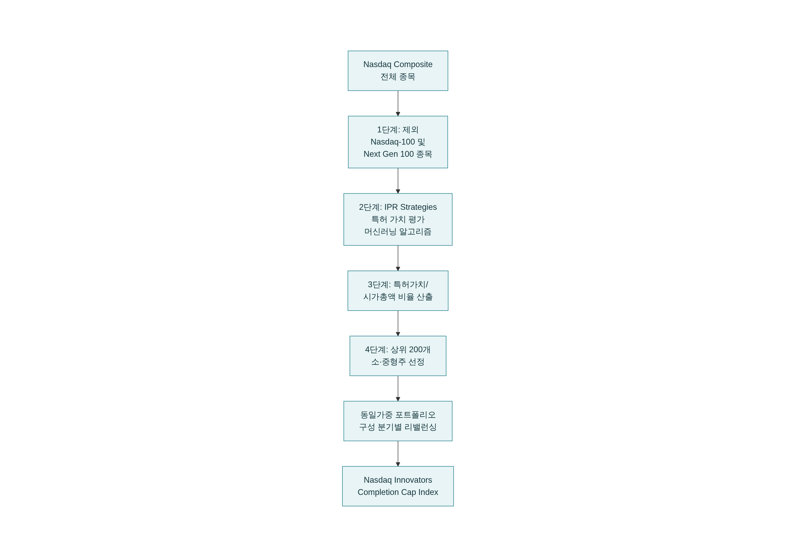
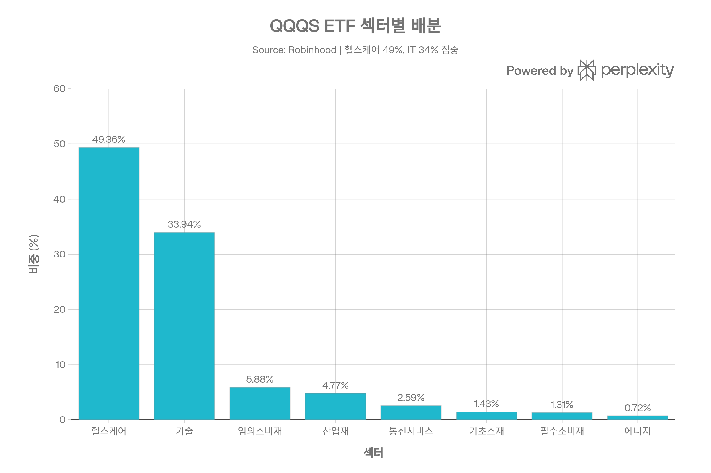
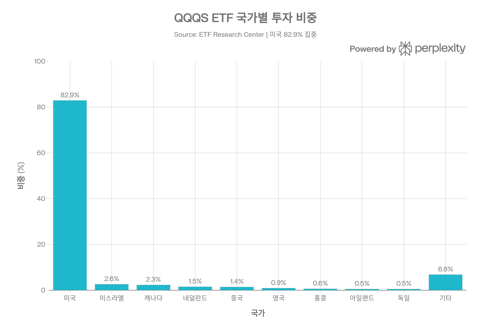
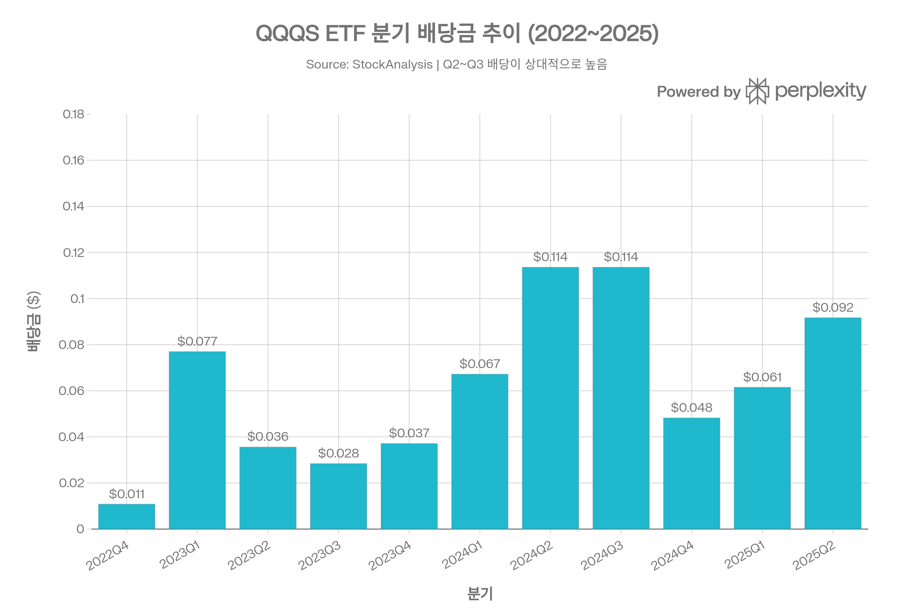

# QQQS ETF (Invesco NASDAQ Future Gen 200 ETF) 종합 분석 보고서
> <strong>분석 기준일:</strong> 2026년 4월 8일

## ETF 분류

| 항목 | 내용 |
|------|------|
| <strong>최종 폴더</strong> | `ETF/Broad Market/Nasdaq Future Gen 200/QQQS` |
| <strong>대분류</strong> | 대표지수 |
| <strong>하위 분류</strong> | Nasdaq Future Gen 200 |
| <strong>핵심 전략</strong> | Nasdaq Composite에서 Nasdaq-100 및 Nasdaq Next Gen 100을 제외한 하위 유니버스 중 특허 가치/시가총액 비율이 높은 200개 혁신 기업에 동일가중 투자 |
| <strong>운용 방식</strong> | 패시브 |
| <strong>레버리지·인버스 여부</strong> | 아니오 |
| <strong>옵션 인컴 전략 여부</strong> | 아니오 |
| <strong>분류 판단</strong> | 특허 기반 스크리닝이 강하지만 QQQ Innovation Suite의 하위 Nasdaq 계열 지수형 상품으로, 레버리지·옵션 인컴이 없는 Nasdaq Future Gen 200 노출이 핵심이므로 대표지수 하위 분류로 정리한다. |

***
## 1. 기본 정보
QQQS는 <strong>Invesco Ltd.</strong>가 운용하는 소형·중형 혁신 기업 특화 ETF로, <strong>특허 포트폴리오 가치</strong>를 핵심 선별 기준으로 삼는 세계 최초의 패턴 가치 기반 ETF입니다. 2022년 10월 13일 설정되어 QQQ(Nasdaq-100) → QQQJ(Nasdaq Next Gen 100) → <strong>QQQS(Future Gen 200)</strong>로 이어지는 <strong>Invesco QQQ Innovation Suite</strong>의 세 번째이자 최하단 시가총액 계층을 담당합니다.[1][2][3]

| 항목 | 내용 |
|------|------|
| <strong>정식 명칭</strong> | Invesco NASDAQ Future Gen 200 ETF |
| <strong>티커</strong> | QQQS (NASDAQ) |
| <strong>설정일</strong> | 2022년 10월 13일 |
| <strong>운용 기간</strong> | 약 3년 |
| <strong>추종 지수</strong> | Nasdaq Innovators Completion Cap Index™ (NCX) |
| <strong>운용사</strong> | Invesco Ltd. |
| <strong>포트폴리오 매니저</strong> | Peter Hubbard, Michael Jeanette, Pratik Doshi, Tony Seisser |
| <strong>상장 거래소</strong> | NASDAQ |
| <strong>순자산(AUM)</strong> | 약 $8.96M\~$13.58M (2026년 기준) |
| <strong>발행 주식 수</strong> | 약 310,000\~380,001주 |
| <strong>총 보수</strong> | 0.20% |
| <strong>구성 종목 수</strong> | 189\~206개 |
| <strong>가중 방식</strong> | 동일 가중 (Equal-Weighted) |
| <strong>NAV 괴리율</strong> | -0.1% (소폭 디스카운트) |
### QQQS의 포지셔닝: QQQ Innovation Suite

Invesco는 2020년 QQQ(Nasdaq 100)의 보완 상품으로 QQQM과 QQQJ를 출시한 데 이어, 2022년 QQQS를 추가하여 시가총액 스펙트럼 전체를 커버하는 'QQQ Innovation Suite'를 완성했습니다.[2][3]

| ETF | 추종 지수 | AUM | 보수 | 특징 |
|-----|---------|-----|------|------|
| QQQ | Nasdaq 100 | \~$376B | 0.18% | 메가·대형 기술주[4] |
| QQQM | Nasdaq 100 | \~$55.6B | 0.15% | QQQ 저비용 버전[5] |
| QQQJ | Nasdaq Next Gen 100 | \~$869M | 0.15% | 성장 단계 혁신 기업[6] |
| <strong>QQQS</strong> | <strong>Nasdaq Innovators Completion Cap</strong> | <strong>\~$13.4M</strong> | <strong>0.20%</strong> | <strong>특허 기반 소·중형 혁신 기업</strong>[3] |

***
## 2. 핵심 투자 개념: 특허 기반 스크리닝
### 추종 지수: Nasdaq Innovators Completion Cap Index™ (NCX)

QQQS의 가장 독특한 특징은 <strong>특허 포트폴리오 가치</strong>를 주된 종목 선정 기준으로 삼는다는 점입니다. 기존 ETF들이 주로 시가총액, 팩터(모멘텀·가치·품질), 재무지표 등을 활용하는 것과 달리, QQQS는 기업의 <strong>지식재산권(IP) 자산 가치</strong>를 현재 주가로 반영되지 않은 미래 가치의 선행 지표로 봅니다.[7][8][9]
### IPR Strategies의 특허 가치 평가 방법론
특허 평가는 <strong>IPR Strategies(특허 가치 평가 전문사)</strong>가 담당하며, 머신러닝 알고리즘을 활용한 자동화된 6단계 프로세스를 통해 이루어집니다:[9][2]

1. <strong>원시 데이터 수집</strong>: 미국·EU·일본 특허청의 특허 데이터
2. <strong>27가지 특성 분석</strong>: Assignee Value(특허 보유자 가치), Market Coverage(시장 커버리지), Market 등
3. <strong>시장 가치 유추법 활용</strong>: 실제 특허 거래 데이터 학습
4. <strong>상대적 비율 산출</strong>: 특허 총 가치 / 시가총액 비율
5. <strong>상위 종목 선별</strong>: 상대 비율 기준 상위 200개 선정
6. <strong>동일 가중 포트폴리오 구성</strong>: 분기 리밸런싱·반기 재구성

IPR Strategies의 특허 가치 데이터셋은 <strong>188개국 20,000개 이상 상장기업</strong>을 커버하며, 주당 3\~5건의 맞춤형 특허 평가를 통해 알고리즘을 지속적으로 업데이트합니다. NCX 지수의 집계 특허 가치는 2011년 11월부터 2022년 5월까지 <strong>315% 증가</strong>하여, 동기간 Russell 2000 지수(245% 증가)를 크게 앞섰습니다.[10][9]
### 적격 유니버스 및 선별 기준
- <strong>포함 조건</strong>: Nasdaq Composite 구성 종목
- <strong>제외 조건</strong>: Nasdaq-100 및 Nasdaq Next Generation 100 편입 종목 (상위 200개 대형·중형주 제외)[7][1]
- <strong>선별 기준</strong>: 특허 총 가치 / 시가총액 비율 상위 200개
- <strong>결과</strong>: 소형주·마이크로캡 중심, 대형주(시가총액 $10B+) 비중 약 21.9%[11]

***
## 3. 추종 성과 지표
| 항목 | 수치 |
|------|------|
| <strong>추적 오차</strong> | 분기 리밸런싱으로 단기 추적 오차 발생 가능 |
| <strong>NAV 대비 시장가격 괴리율</strong> | -0.1% (소폭 디스카운트) |
| <strong>포트폴리오 회전율</strong> | — (별도 공시 없음) |
| <strong>복제 방식</strong> | 완전 복제 (Physical) |

[12][13][14]

- NAV 괴리율은 -0.1%로 사실상 NAV에 수렴하여 추적이 양호합니다.[13]
- 동일 가중 포트폴리오 특성상 분기 리밸런싱 시 소형주 중심의 리밸런싱 비용이 발생할 수 있습니다. 단, AUM이 소규모($13.4M)이므로 실제 시장 충격은 제한적입니다.[15]
- 투자 자산의 최소 90%를 추종 지수 구성 종목에 투자하는 조건을 유지합니다.[14]

***
## 4. 비용 구조
| 항목 | QQQS | QQQ | QQQJ | IWM (iShares Russell 2000) |
|------|------|-----|------|------|
| <strong>총 보수</strong> | 0.20% | 0.18% | 0.15% | 0.19% |
| <strong>동일 유형 내 백분위</strong> | 21번째 (저비용 상위 21%)[11] | — | — | — |
| <strong>분배 빈도</strong> | 분기 | 분기 | 분기 | 분기 |

[13][16][3]

- 총 보수 <strong>0.20%</strong>는 동류 소형주 ETF 대비 낮은 수준이며, 동일 유니버스 내 21번째 백분위에 위치해 비용 경쟁력을 갖추고 있습니다.[11]
- QQQ(0.18%)보다 약간 높고 QQQJ(0.15%)보다 높지만, 특허 평가라는 독자적 대안 데이터 활용 비용이 반영된 수준으로 평가됩니다.[2][3]

***
## 5. 유동성 평가
| 항목 | 수치 |
|------|------|
| <strong>AUM</strong> | $8.96M\~$13.58M |
| <strong>일평균 거래량</strong> | 약 1,662\~5,730주 (매우 낮음) |
| <strong>52주 최고/최저</strong> | $37.53 / $19.55 |
| <strong>NAV 괴리율</strong> | -0.1% |
| <strong>1년 자금 흐름</strong> | -$394,870 (순유출) |

[13][17][15]

QQQS는 QQQ Innovation Suite 중 <strong>가장 소규모이자 가장 낮은 유동성</strong>을 가진 ETF입니다. AUM $13.4M, 일평균 거래량 5,700주 수준은 대형 ETF에 비해 현저히 낮습니다. 다만, 인가 참여자(AP)를 통한 ETF 차익거래 메커니즘으로 NAV 괴리는 -0.1%로 최소화되어 있습니다.[15][13]

- 2026년 기준 1년간 자금이 약 <strong>$395,000 순유출</strong>되었으며, 설정 이래 AUM이 낮은 수준에 머물러 있어 <strong>기관 투자자 채택이 매우 제한적</strong>입니다.[13]
- 일평균 거래량이 매우 낮아 대규모 거래 시 <strong>호가 스프레드 확대</strong> 리스크가 존재합니다. 소액 리테일 투자자에게는 유동성이 충분하지만, 기관급 포지션 진출입은 어려울 수 있습니다.

***
## 6. 포트폴리오 구성
### 상위 10대 보유 종목
| 순위 | 종목명 | 섹터 | 비중 |
|------|--------|------|------|
| 1 | AXT, Inc. (AXTI) | 반도체 소재 | 1.67% |
| 2 | Innovative Aerosystems (ISSC) | 산업재 | 1.25% |
| 3 | Allogene Therapeutics (ALLO) | 헬스케어 | 0.90% |
| 4 | Neogen Corporation (NEOG) | 헬스케어 | 0.88% |
| 5 | Shattuck Labs (STTK) | 헬스케어 | 0.87% |
| 6 | Codexis Inc. (CDXS) | 헬스케어 | 0.86% |
| 7 | uniQure N.V. (QURE) | 헬스케어 | 1.5%* |
| 8 | Clearpoint Neuro (CLPT) | 헬스케어 | 1.2%* |
| 9 | Arrowhead Pharmaceuticals | 헬스케어 | 0.7%* |
| 10 | Arbe Robotics (ARBE) | 기술 | 0.7%* |

*출처에 따라 비중 시점 상이[11][18]

<strong>중요한 특징</strong>: 동일 가중 방식 적용으로 상위 10종목 합계 비중은 약 <strong>9.9%</strong>에 불과합니다. 이는 카테고리 평균(25.74%)의 1/3 수준으로, 극도로 분산된 포트폴리오 구조입니다.[16]
### 섹터별 배분

| 섹터 | 비중 |
|------|------|
| 헬스케어 (Healthcare) | 49.36% |
| 기술 (Technology) | 33.94% |
| 임의소비재 | 5.88% |
| 산업재 | 4.77% |
| 통신서비스 | 2.59% |
| 기초소재 | 1.43% |
| 필수소비재 | 1.31% |
| 에너지 | 0.72% |

[12][15]

헬스케어(49.36%)와 기술(33.94%)이 포트폴리오의 83%를 차지합니다. 헬스케어 기업들이 특허를 가장 활발히 보유하고 활용하는 산업이라는 점에서, 특허 기반 스크리닝의 결과가 자연스럽게 헬스케어 집중으로 이어집니다. 바이오테크·제약·의료기기 기업들이 포트폴리오의 핵심을 구성합니다.[15][9][12]
### 국가별 배분

| 국가 | 비중 |
|------|------|
| 미국 | 82.9% |
| 이스라엘 | 2.6% |
| 캐나다 | 2.3% |
| 네덜란드 | 1.5% |
| 중국 | 1.4% |
| 영국 | 0.9% |
| 홍콩 | 0.6% |
| 아일랜드 | 0.5% |
| 독일 | 0.5% |
| 기타 | 6.8% |

[11]

미국 중심(82.9%)이지만, 전 세계 혁신 소형주에 분산 투자합니다. 이스라엘(2.6%)은 글로벌 기술 특허 강국으로서 비중이 높으며, 캐나다·유럽계 혁신 바이오·기술 기업들이 포함됩니다.[11]
### 리밸런싱 주기
- <strong>분기별 리밸런싱</strong>: 동일 가중 비율 유지를 위한 주기적 비중 조정[7]
- <strong>반기별 재구성</strong>: 새로운 특허 가치 평가 데이터 기반 구성 종목 변경[7]
- NCX 지수의 집계 특허 데이터는 지속적으로 업데이트되며, IPR Strategies는 주당 3\~5건의 신규 특허 평가를 진행합니다.[9]

***
## 7. 성과 분석
### 기간별 수익률
| 기간 | QQQS | S&P 500 | 비고 |
|------|------|---------|------|
| YTD (2026) | +1.87% | +1.54% | S&P 500과 유사[19] |
| 1개월 | +8.72% | — | [20] |
| 3개월 | +32.67% | +18.41% | 대형 초과 수익[20] |
| 6개월 | +45.0% | +20.0% | [16] |
| 1년 | +72.23% | +19.45% | <strong>압도적 초과 성과</strong>[19] |
| 3년 (연환산) | +9.98% | +11.36% | 소폭 하회[19] |
| 설정 이후 (연환산) | +11.0% | +11.2% | S&P 500과 유사[16] |

QQQS의 1년 수익률 +72.23%는 QQQ Innovation Suite 내에서 <strong>압도적인 1위</strong>이며, S&P 500 대비 약 53%p 초과 성과입니다. 그러나 설정 이후 연환산(+11.0%)은 S&P 500(+11.2%)과 거의 동일하며, 3년 누적 성과도 벤치마크를 소폭 하회합니다.[19][16]
### 연도별 수익률
| 연도 | QQQS 수익률 | 비고 |
|------|------------|------|
| 2022 (설정 후) | — | 2022년 10월 설정 |
| 2023 | +27.85% | 설정 초기 반등 |
| 2024 | +8.41% | 대형 성장주 대비 부진 |
| 2025 | +18.16% | 강한 회복 |
| <strong>2025-2026</strong> | <strong>+72.23%(1Y)</strong> | <strong>소형 혁신주 급등</strong> |
### Schwab 표준화 성과 데이터
Schwab의 2025년 9월 30일 기준 표준화 성과(NAV 기준):[16]
- YTD: +18.2%
- 6개월: +45.1%
- 1년: +25.7%
- 설정 이후 연환산: +11.0%
- 설정 이래 누적 성장: $10,000 → $12,783 (QQQS) vs $13,391 (소형 블렌드 평균) vs $18,040 (S&P 500)

***
## 8. 배당 정보
### 배당 개요

| 항목 | 수치 |
|------|------|
| <strong>배당 수익률 (TTM, 출처별 상이)</strong> | 0.87\~3.43% |
| <strong>연간 배당금 (TTM)</strong> | $0.31\~$1.19/주 |
| <strong>배당 지급 주기</strong> | 분기 배당 (연 4회) |
| <strong>배당 성장률 (1Y)</strong> | -45.90% |
| <strong>최근 배당락일</strong> | 2025년 6월 23일 ($0.0917) |
배당 수익률 표시가 출처마다 크게 다른 이유는 2023년 9월 및 2024년 9월 <strong>비정상적으로 큰 특별 배당</strong>이 발생하여 TTM 계산에 왜곡이 생겼기 때문입니다. 통상적인 분기 배당은 $0.05\~0.09 수준으로, 주가 대비 <strong>0.2\~0.4%의 미미한 배당 수익률</strong>이 실질적인 수준입니다. QQQS는 배당 수익보다 자본 이득 추구에 특화된 ETF입니다.[21][22]

***
## 9. 리스크 요소
### 베타 계수 및 변동성
| 지표 | 수치 |
|------|------|
| <strong>베타 (vs S&P 500)</strong> | 1.53\~1.57[15][11] |
| <strong>베타 (vs S&P 500, ETF Research)</strong> | 1.57 (R² 54%)[11] |
| <strong>최대 낙폭 (MDD, 전체 이력)</strong> | -38.06%[23][24] |
| <strong>최악의 분기 수익률</strong> | -30.51%[16] |
| <strong>최선의 분기 수익률</strong> | +28.21%[16] |
| <strong>ALTAR Score™</strong> | -4.2% (카테고리 1st 백분위)[11] |
| <strong>P/E 비율</strong> | -6.62 (다수 종목 적자)[15] |

베타 1.53\~1.57은 시장 대비 1.5배 이상 크게 움직이는 고위험 ETF임을 나타냅니다. ALTAR Score™(카테고리 최하위 1%)는 현재 유동성·가격 효율성 기준에서 매우 낮은 평가를 받고 있습니다. P/E 비율이 음수(-6.62)인 것은 포트폴리오 내 다수 기업이 <strong>아직 적자 단계</strong>의 초기 혁신 기업임을 반영합니다.[15][11]
### 주요 리스크 요인
<strong>1. 극소형 AUM 및 유동성 리스크 (가장 중요)</strong>
AUM $13.4M은 ETF 시장에서 매우 작은 규모입니다. 이 수준에서는 운용사의 수익성 측면에서 <strong>펀드 청산(폐쇄) 리스크</strong>가 존재하며, 낮은 거래량으로 인해 대규모 매매 시 상당한 스프레드 비용이 발생할 수 있습니다.[15]

<strong>2. 소형·성장주 집중 리스크</strong>
Herfindahl-Hirschman Index(HHI) 58로 극도로 분산되어 있지만, 포트폴리오의 대부분이 <strong>소형·마이크로캡 바이오테크 기업</strong>으로 구성되어 있어 개별 기업 임상 실패, 규제 리스크, 자금 조달 어려움에 취약합니다.[11]

<strong>3. 특허 평가 방법론 리스크</strong>
IPR Strategies의 특허 가치 평가가 부정확하거나, 특허 보유 기업이 실제로 해당 특허로부터 가치를 창출하지 못할 경우 ETF의 핵심 투자 논리가 무력화됩니다. 과거 성과(백테스트 기반)가 미래 성과를 보장하지 않습니다.[2]

<strong>4. 헬스케어·바이오테크 집중 리스크</strong>
헬스케어 비중 49.36%로, FDA 규제 변화, 임상 결과, 약가 정책 변화 등 헬스케어 섹터 고유 리스크에 강하게 노출되어 있습니다.[15]

<strong>5. 소형주 사이클 리스크</strong>
소형주는 금리 인상·경기 침체 환경에서 대형주보다 더 큰 하락을 경험합니다. 최악 분기 -30.51%와 MDD -38.06%가 이를 보여줍니다.[16][23]
### 시장 상관관계
| 비교 대상 | 베타 | R² |
|-----------|------|-----|
| S&P 500 | 1.57 | 54% |
| MSCI EAFE | 0.94 | 21% |
| MSCI EM | 0.68 | 10% |

[11]

S&P 500과의 R²가 54%로, 미국 대형주와의 연관성이 있지만 절반은 고유 요인(특허 기반 소형주 특성)으로 설명됩니다. MSCI EAFE 및 신흥시장과의 낮은 상관관계(R² 21%, 10%)는 분산 효과 가능성을 시사합니다.[11]

***
## 10. 경쟁 상품 비교
| 항목 | QQQS | QQQJ | IWM (소형주 전반) | ARKK |
|------|------|------|------|------|
| <strong>운용사</strong> | Invesco | Invesco | iShares | ARK Invest |
| <strong>설정일</strong> | 2022-10 | 2020-10 | 2000 | 2014 |
| <strong>AUM</strong> | \~$13M | \~$869M | \~$60B+ | — |
| <strong>보수율</strong> | 0.20% | 0.15% | 0.19% | 0.75% |
| <strong>1년 수익률</strong> | +72.23% | +25.98% | — | — |
| <strong>3년 연환산</strong> | +9.98% | +13.31% | — | — |
| <strong>MDD</strong> | -38.06% | -39.57% | — | — |
| <strong>베타</strong> | 1.57 | 1.17 | — | — |
| <strong>선별 기준</strong> | 특허 가치/시총 비율 | Nasdaq 101\~200위 | 전 소형주 | 파괴적 혁신 |

[19][16][11][25]

QQQJ는 QQQS의 가장 직접적인 비교 대상으로, AUM(869M vs 13M), 3년 성과(+13.31% vs +9.98%), 베타(1.17 vs 1.57) 모두 QQQJ가 우위입니다. 단, 최근 1년 수익률(QQQS +72.23% vs QQQJ +25.98%)은 QQQS가 대폭 앞서 있어 단기 성과 측면에서는 주목할 만합니다.[25][19]

***
## 11. 종합 투자 시사점
<strong>QQQS의 투자 매력:</strong>
- 세계 최초의 <strong>특허 가치 기반</strong> ETF로 독자적인 혁신 지표 활용[1][2]
- QQQ Innovation Suite의 하단 계층으로, <strong>최고 잠재력 소형 혁신 기업</strong> 집중 투자[7][2]
- <strong>0.20% 초저비용</strong> 보수로 동일 유형 하위 21% 수준의 비용 효율성[11]
- 동일 가중 방식으로 <strong>개별 종목 집중 리스크 최소화</strong> (상위 10종목 9.9%)[16]
- 최근 1년 <strong>+72.23%</strong>라는 압도적 성과[19]

<strong>QQQS의 핵심 유의 사항:</strong>
- AUM $13.4M의 <strong>극소형 규모</strong>, 펀드 청산 리스크 및 유동성 부족[13][15]
- 설정 이래 연환산 수익(+11.0%)은 S&P 500과 <strong>사실상 동일</strong>, 3년 수익률은 벤치마크 하회[16]
- 헬스케어 바이오테크 집중(49.4%)으로 <strong>임상·규제 리스크 노출</strong>[15]
- 베타 1.57의 <strong>고변동성</strong>, 최악 분기 -30.51%[11][16]
- 특허 평가 방법론이 <strong>아직 검증 역사가 짧음</strong> (2022년 10월 설정)[1]
- 다수 포트폴리오 기업이 <strong>적자 단계</strong>, P/E 비율 음수(-6.62)[15]

QQQS ETF는 <strong>QQQ Innovation Suite</strong>에서 독특한 위치를 차지하는 혁신적 테마형 ETF입니다. 특허 기반 소형 혁신 기업에 선택적으로 노출하고자 하는 투자자에게 흥미로운 실험적 옵션이 될 수 있지만, 소규모 AUM, 짧은 트랙 레코드, 고변동성, 바이오테크 집중 리스크 등을 감수할 수 있는 <strong>위험 선호형 장기 투자자</strong>에게 적합합니다. 포트폴리오의 소규모 위성 포지션으로 활용하는 접근이 현실적입니다.
