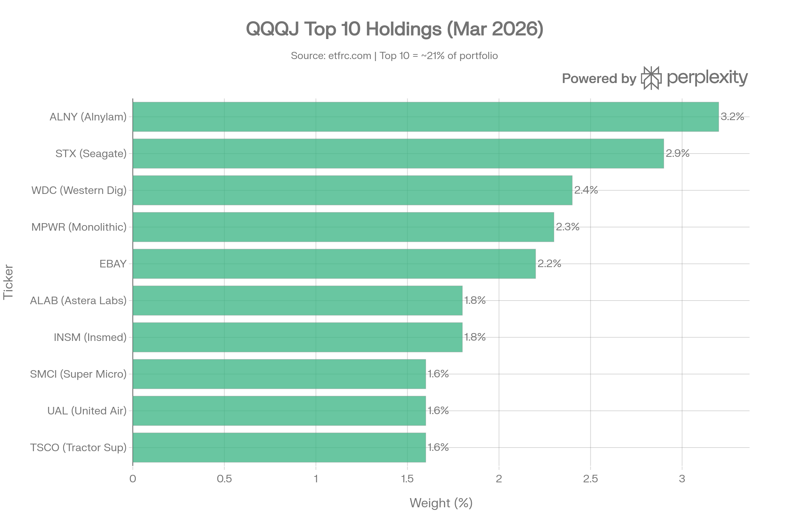
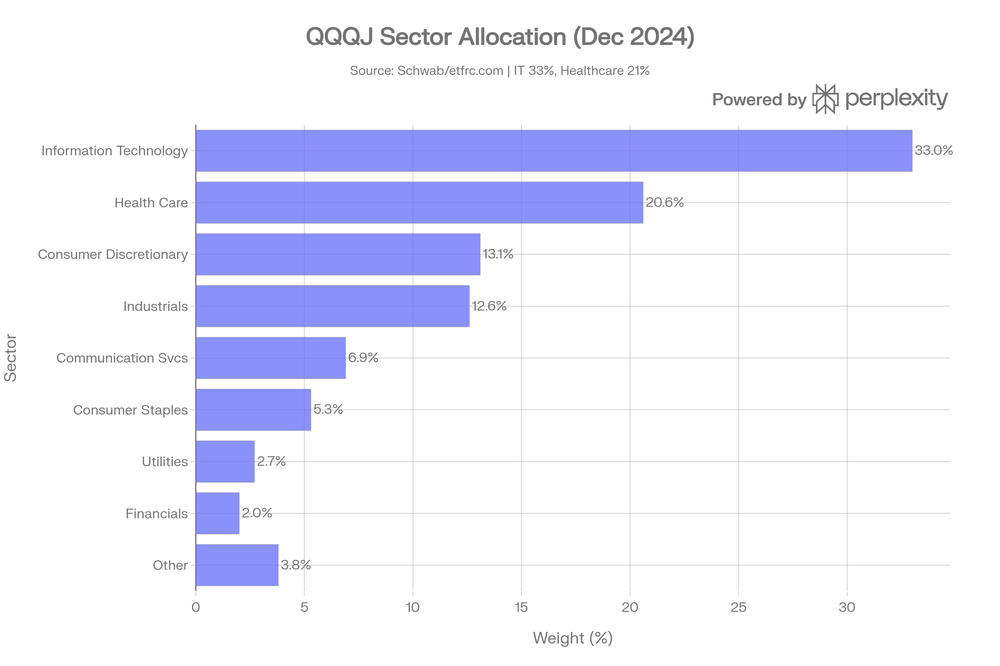
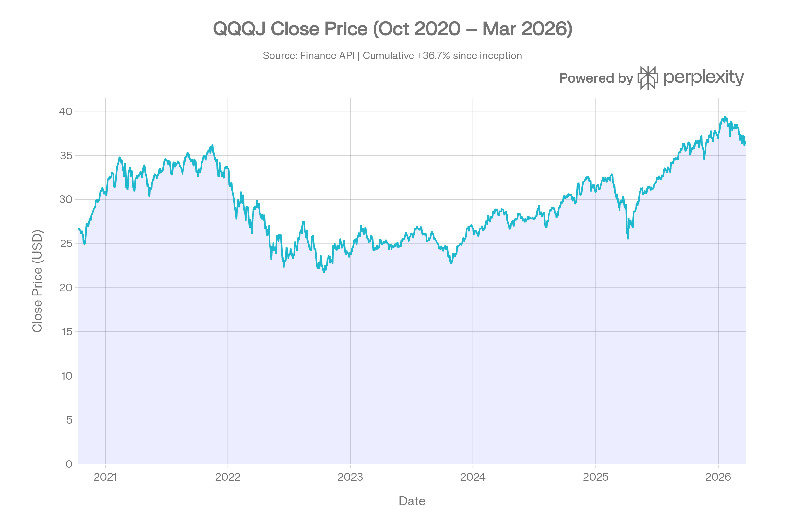
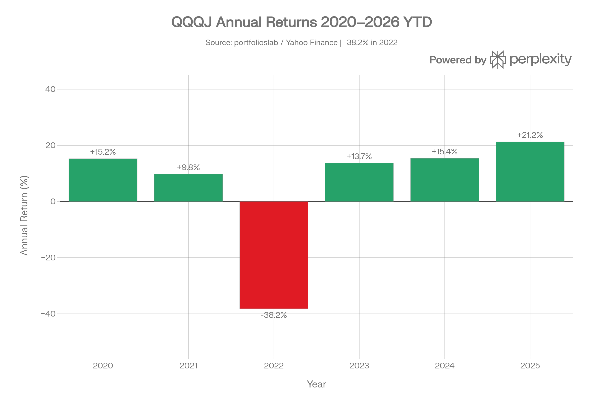

# QQQJ (Invesco NASDAQ Next Gen 100 ETF) 종합 분석 보고서
> **분석 기준일: 2026년 3월 24일**

## ETF 분류

| 항목 | 내용 |
|------|------|
| **최종 폴더** | `ETF/Broad Market/Nasdaq Next Gen 100/QQQJ` |
| **대분류** | 대표지수 |
| **하위 분류** | Nasdaq Next Gen 100 |
| **핵심 전략** | Nasdaq-100에 포함되지 않은 나스닥 상장 비금융 기업 중 시가총액 상위 100개를 수정 시가총액 가중 방식으로 추종 |
| **운용 방식** | 패시브 |
| **레버리지·인버스 여부** | 아니오 |
| **옵션 인컴 전략 여부** | 아니오 |
| **분류 판단** | QQQJ는 레버리지, 인버스, 옵션 인컴 구조가 없는 Nasdaq Next Generation 100 Index 추종 ETF이므로 대표 Nasdaq 계열 지수 ETF로 분류한다. |

***
## 1. 기본 정보
QQQJ는 Invesco가 2020년 10월 13일에 출시한 ETF로, **NASDAQ Next Generation 100 Index**를 추종합니다. 이 지수는 나스닥100(NDX)에 포함되지 않는 나스닥 상장 비금융 기업 중 시가총액 기준 상위 100개 종목으로 구성된 **나스닥100의 차세대 후보군**입니다.[1][2]

| 항목 | 내용 |
|------|------|
| 정식명 | Invesco NASDAQ Next Gen 100 ETF |
| 티커 | QQQJ |
| 설정일 | 2020년 10월 13일[1] |
| 추종 지수 | NASDAQ Next Generation 100 Index[2] |
| 운용사 | Invesco[3] |
| 상장거래소 | NASDAQ |
| 순자산(AUM) | 약 $709.9M (2026년 3월)[4] |
| 현재가 | $36.62 (2026-03-24) |
| PE Ratio | 24.12배 |
| 총 보유 종목 수 | 99~107개[4][5] |
### 추종 지수 방법론
NASDAQ Next Generation 100 Index는 **수정 시가총액 가중 방식(modified market-cap-weighted)**을 채용합니다. 나스닥100에 포함되지 않는 나스닥 상장 비금융 종목 중 상위 100개를 선정하며, 분기별로 리밸런싱이 이루어집니다. 펀드는 지수 구성 자산의 **최소 90%**를 직접 편입하는 완전 복제(full replication) 방식을 사용합니다.[6][1][2]

***
## 2. 추종 성과 지표
### 추적오차(Tracking Error) 및 추적 차이(Tracking Difference)
QQQJ는 완전 복제 방식으로 추종 정확도가 높습니다. 총 보수 0.15%가 거의 유일한 성과 드래그로, 실제 추적 차이는 보수율 수준에 근접합니다. 같은 Invesco 패밀리의 QQQ, QQQM의 사례에서 나타나듯 비용 범위 이내의 추적 오차를 실현하고 있습니다.[7]
### NAV 대비 시장가격 괴리율
QQQJ는 완전 공시(Full Holdings Transparency) 체계를 갖춰 자산운용사가 매일 포트폴리오를 공시합니다. 이로 인해 차익거래 메커니즘이 작동하여 괴리율은 매우 낮은 수준을 유지합니다. 평균 Bid/Ask 스프레드 0.05%(5bp)로 유동성도 양호합니다.[4]

***
## 3. 비용 구조
### 총 보수 및 비용(TER)
QQQJ의 연간 운용보수(Total Expense Ratio)는 **0.15%**로, 동일 카테고리 경쟁 ETF 평균 대비 크게 낮습니다. 총 소유 비용(Total Cost of Ownership)은 스프레드를 감안해도 **20bp** 수준으로, 동류 펀드 평균 62bp 대비 매우 경쟁력 있습니다.[3][1][4]
### 경쟁 ETF 비용 비교
| ETF | 추종 지수/전략 | 보수율 | QQQJ 대비 |
|-----|--------------|--------|-----------|
| **QQQJ** | NASDAQ Next Gen 100 | **0.15%** | — |
| QQJG | ESG NASDAQ Next Gen 100 | 0.20% | +5bp[4] |
| RSPT | S&P500 등가중 IT | 0.40% | +25bp[4] |
| FLQM | Franklin US Mid Cap Multifactor | 0.30% | +15bp[4] |
| AVMC | Avantis US Mid Cap Equity | 0.18% | +3bp[4] |
### 포트폴리오 회전율
포트폴리오 회전율은 **22~27%** 수준으로, 나스닥100 편입 기준 변화와 분기 리밸런싱에 따른 적정 수준의 교체가 이루어집니다.[8][5]

***
## 4. 유동성 평가
QQQJ의 일평균 거래량은 약 **22만 주(최근 3개월)**이며, 일평균 거래대금은 약 **$7.95M** 수준입니다. ETF Research Center 기준 월간 거래대금은 약 $7M으로 확인됩니다. 스프레드는 평균 5bp(범위 3~8bp)로 안정적입니다.[4]

| 유동성 지표 | 수치 |
|------------|------|
| 일평균 거래량 (3M) | ~216,956주 |
| 일평균 거래대금 (3M) | ~$7.95M |
| 평균 Bid/Ask 스프레드 | 0.05% (5bp)[4] |
| 스프레드 범위 | 3~8bp[4] |
| 총 소유 비용(TCA) | 20bp (동종평균 62bp)[4] |

$1B 미만의 AUM은 대형 기관투자자에게 다소 제약이 될 수 있으나, 개인투자자 및 중소 기관 포지션에는 충분한 유동성을 제공합니다.

***
## 5. 포트폴리오 구성
### 상위 10대 보유 종목 (2026년 3월 기준)

| 순위 | 종목 | 회사명 | 비중 |
|------|------|--------|------|
| 1 | ALNY | Alnylam Pharmaceuticals | 3.2%[4] |
| 2 | STX | Seagate Technology | 2.9%[4] |
| 3 | WDC | Western Digital | 2.4%[4] |
| 4 | MPWR | Monolithic Power Systems | 2.3%[4] |
| 5 | EBAY | eBay | 2.2%[4] |
| 6 | ALAB | Astera Labs | 1.8%[4] |
| 7 | INSM | Insmed | 1.8%[4] |
| 8 | SMCI | Super Micro Computer | 1.6%[4] |
| 9 | UAL | United Airlines Holdings | 1.6%[4] |
| 10 | TSCO | Tractor Supply | 1.6%[4] |

**상위 10종목 합계 비중: 약 21.4%** — 동일 카테고리(Mid-Cap Growth) 평균 35.05% 대비 낮아 **분산 효과가 우수**합니다.[5]
### 섹터별 배분 (2024년 12월 기준)

| 섹터 | 비중 |
|------|------|
| 정보기술(IT) | 33.0%[5] |
| 헬스케어 | 20.6%[5] |
| 경기소비재 | 13.1%[5] |
| 산업재 | 12.6%[5] |
| 커뮤니케이션서비스 | 6.9%[5] |
| 필수소비재 | 5.3%[5] |
| 유틸리티 | 2.7%[5] |
| 금융 | 2.0%[5] |
| 기타 | ~3.8% |

> 2026년 3월 ainvest 기준으로 기술섹터 비중이 39.37%까지 상승한 것으로 파악됩니다. QQQ(나스닥100)가 IT에 60% 이상 집중된 것과 비교하면, QQQJ는 헬스케어·산업재 등 다양한 섹터에 분산되어 있습니다.[9]
### 국가별 분산
| 국가 | 비중 |
|------|------|
| 미국 | 74.3%[4] |
| 이스라엘 | 4.7%[4] |
| 아일랜드 | 4.2%[4] |
| 중국 | 3.6%[4] |
| 싱가포르 | 2.4%[4] |
| 기타 | ~10.8% |

나스닥에 상장된 외국 기업(이스라엘 IT, 중국 ADR 등)이 포함되어 있어 단순 미국 펀드가 아닌 **다국적 분산 효과**도 일부 있습니다.[4]
### 시가총액 구성
| 구분 | 비중 |
|------|------|
| 대형주(>$10B) | 83.9%[4] |
| 중형주($2~10B) | 8.7%[4] |
| 소형주(<$2B) | 0.1%[4] |

보유 종목 가중평균 시총은 $23.96B으로, 명칭상 'Next Gen' 중소형주가 아니라 실질적으로는 **대형주 중심의 포트폴리오**입니다.[4]

***
## 6. 성과 분석
### 기간별 수익률

| 기간 | 수익률 |
|------|--------|
| 1개월 | -4.56% |
| 3개월 | -2.63% |
| 6개월 | +2.29% |
| 1년 | +20.64% |
| 3년(연환산) | +14.41% |
| 설정 이후(연환산) | +6.7%[4] |

> 2025년 수익률은 약 21.24%로 양호했으나, 설정 이후 전체 연환산 수익률은 6.7%로 QQQ/QQQM(17%+)에 크게 미치지 못합니다. 이는 2021~2022년 성장주 조정기에 크게 타격받은 결과입니다.[10][4][11]
### 연간 수익률 내역

| 연도 | 수익률 |
|------|--------|
| 2020 (부분) | +15.25%[2] |
| 2021 | +9.76%[2] |
| 2022 | **-38.2%**[2] |
| 2023 | +13.69%[2] |
| 2024 | +15.36%[2] |
| 2025 | +21.24%[10] |
| 2026 YTD | +3.3%[4] |
### 벤치마크 대비 성과
QQQJ는 2025년도에 약 15~21% 수익률을 기록했으나, 같은 해 QQQ(나스닥100)의 20.77% 및 S&P500의 약 17.88% 대비 소폭 부진하거나 유사한 성과를 보였습니다. 2023년 역시 QQQJ +13.69%로 QQQ의 54.76%에 크게 못 미쳤는데, 이는 초대형 기술주(Magnificent 7) 주도 랠리가 QQQJ 포트폴리오를 빗겨갔기 때문입니다.[1][12]
### 리스크 조정 성과
| 지표 | QQQJ | QQQM (참고) |
|------|------|-------------|
| 1Y 샤프 지수 | 0.85 | ~1.1 |
| 3Y 샤프 지수 (설정이후) | 0.44[13] | 0.75[13] |
| 연환산 표준편차(3Y) | 18.04% (22.0%[13]) | 22.3%[13] |
| 최대 낙폭(All-time) | **-39.6~-40.2%**[2][13] | -35.0%[13] |
| 베타 (S&P500 대비) | 1.05[4] | ~1.17[11] |

***
## 7. 배당 정보
QQQJ는 **분기 배당** ETF로, 배당수익률은 약 **0.63~0.85% TTM** 수준입니다. 배당은 주로 편입 종목의 소액 배당을 모아 분배하는 구조로, 성장형 ETF 특성상 배당 중심 투자에는 적합하지 않습니다.[1][14][15]
### 최근 배당 이력
| 지급일 | 배당금 | 지급일 | 배당금 |
|--------|--------|--------|--------|
| 2025-12-26 | $0.06645[15] | 2025-03-28 | $0.0454[15] |
| 2025-09-26 | $0.11445[15] | 2024-12-27 | $0.0353[15] |
| 2025-06-27 | $0.08779[14] | 2024-09-27 | $0.0462[14] |
### 배당 성장률
최근 1년 배당 성장률은 약 **-9.4%로 감소세**입니다. 이는 편입 종목의 배당 삭감 또는 교체보다는 포트폴리오 구성 변화에 따른 것으로, 배당보다는 자본이득을 추구하는 성장형 펀드 성격을 반영합니다.[14]

***
## 8. 리스크 요소
### 베타 및 상관관계
QQQJ의 S&P500 대비 베타는 **1.05**로, 시장보다 소폭 높은 변동성을 가집니다. R-squared는 83%로 광범위 시장과 높은 연동성을 보입니다. MSCI EAFE와는 R² 60%, MSCI 신흥국과는 R² 62% 수준입니다.[4]
### 주요 리스크 요인
**1. 섹터 집중도 리스크**
IT 섹터 비중이 33~39%로 기술주 변동에 민감합니다. 또한 헬스케어(21%)와의 결합으로 성장섹터 이중 집중이 발생합니다.[9][5]

**2. 나스닥100 편입/제외 리스크**
QQQJ 포트폴리오의 우량 종목이 나스닥100에 편입되면 오히려 QQQJ에서 제외(downgrade)되는 구조적 역설이 존재합니다. 이른바 'graduation penalty' 문제로, 주가가 상승해 성과가 좋은 종목이 이탈하는 역선택 우려가 있습니다.[16]

**3. 마켓캡 집중도**
HHI(허핀달-허쉬만 지수)는 122로 분산이 양호한 편이지만, 상위 종목에서 3%+의 집중도가 나타납니다.[4]

**4. 유동성 리스크**
AUM이 약 $700M~$900M으로 대형 ETF 대비 상대적으로 작아, 대규모 기관 매도 시 괴리율 확대 가능성이 있습니다.[17][4]

**5. 성장주 금리 민감도**
보유 종목 대다수가 고성장 기업으로, 금리 상승기에 밸류에이션 압박이 강화됩니다. 2022년 금리 인상 사이클에서 **-38.2%** 급락이 이를 방증합니다.[2]
### 경쟁 ETF와의 비교
| 항목 | QQQJ | QQQ | QQQM |
|------|------|-----|------|
| 추종 지수 | NASDAQ Next Gen 100 | NASDAQ-100 | NASDAQ-100 |
| AUM | ~$710M[4] | ~$368B[18] | ~$57.9B[18] |
| 보수율 | 0.15%[3] | 0.20%[18] | 0.15%[18] |
| 설정 이후 연환산 | ~6.7%[4] | — | ~17.03%[11] |
| 배당수익률 | ~0.85%[15] | ~0.50%[18] | ~0.53%[18] |
| 베타(시장대비) | 1.05~1.13[4][10] | ~1.17[11] | ~1.17[11] |
| 최대낙폭 | -39.6%[13] | — | -35.0%[13] |

***
## 9. 종합 평가 및 투자 고려사항
QQQJ는 '나스닥100의 바로 아래 단계'에 있는 종목들에 투자한다는 독창적인 스토리를 갖고 있으나, 실제 성과에서 마케팅 내러티브와의 괴리가 존재합니다. 상위 종목이 나스닥100에 편입되어 이탈하는 구조로 인해 **'지금 뜨는 기업' 보다 '막 성장이 꺾인 기업'**을 많이 보유하는 경향이 있습니다.[1][16]

**투자 적합 케이스:**
- 나스닥100 외 나스닥 중대형주로 분산을 원하는 경우
- QQQ/QQQM의 초대형 기술주 집중을 피하고자 할 경우
- 장기 포트폴리오에서 위성 포지션(satellite) 활용

**투자 주의 케이스:**
- 설정 이후 연환산 수익률 6.7%는 QQQ/QQQM 대비 현저히 낮음[4][11]
- 동일 비용(0.15%)으로 더 높은 성과의 대안 존재
- 고금리 환경에서 성장주 중심 포트폴리오의 민감도 높음

ETFRC의 ALTAR Score™는 5.2%(42번째 백분위, Neutral 등급)로 평가되어, 동일 카테고리 내에서 중간 수준의 매력도를 보입니다. 컨센서스 목표주가 $47.52는 현재가 대비 약 +28.5%의 상승 여력을 시사하나, 이는 개별 편입 종목들의 애널리스트 추정치를 집계한 수치임을 감안해야 합니다.[4]
