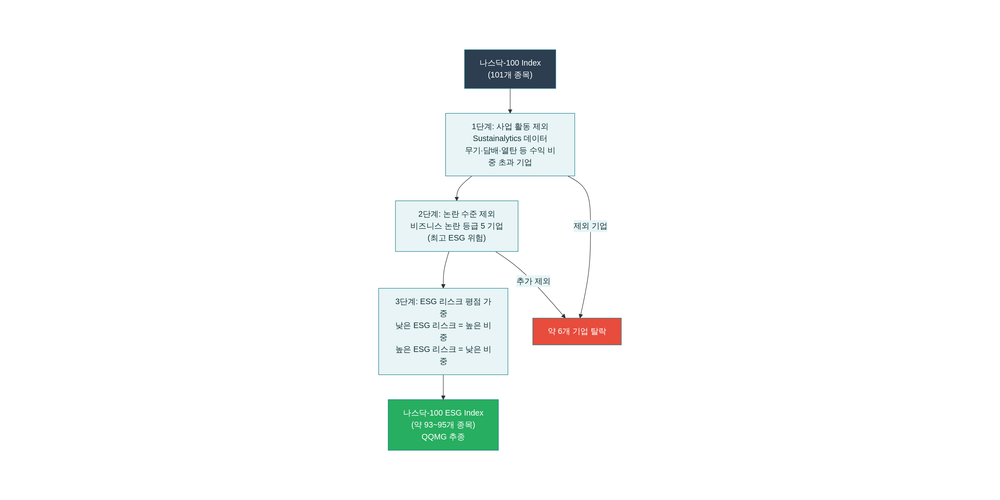
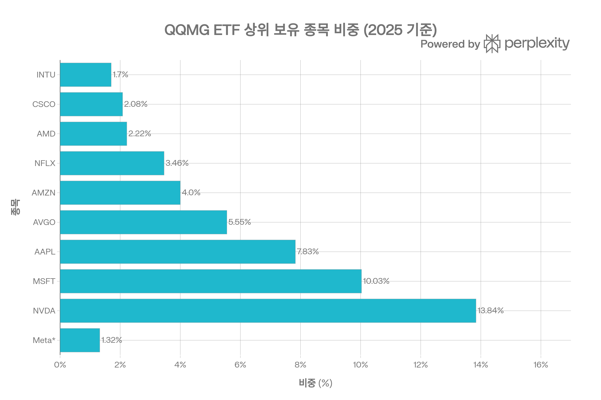
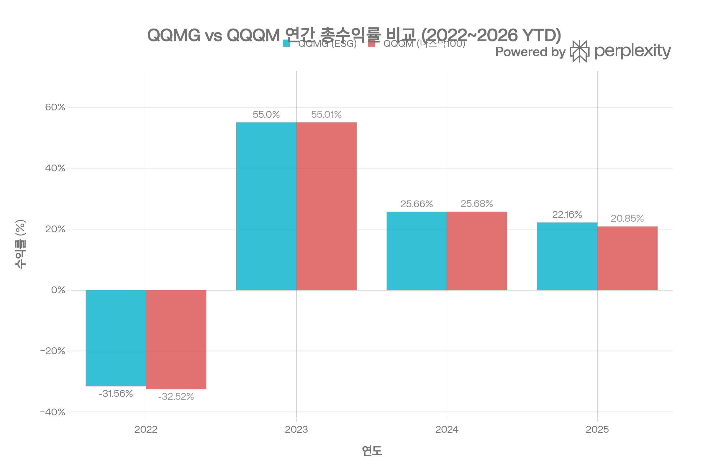
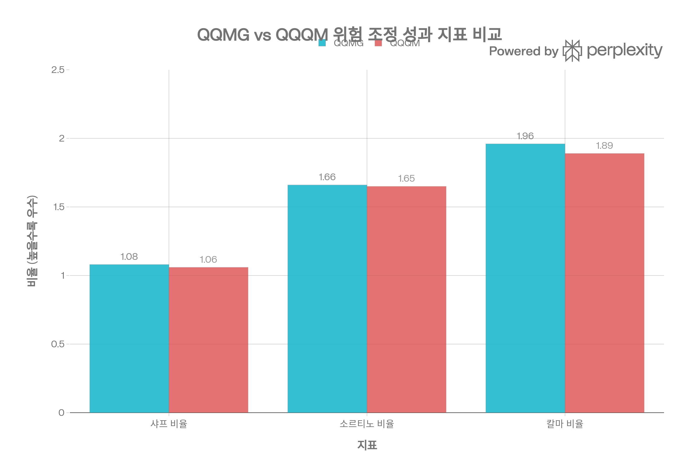

# QQMG (Invesco ESG NASDAQ 100 ETF) 종합 분석 보고서
> **작성 기준일:** 2026년 5월 11일 | **데이터 출처:** Invesco 공식 사이트, Morningstar, PortfoliosLab, StockAnalysis, Yahoo Finance, ETFdb, Nasdaq Index Research, TradingView 등

## ETF 분류

| 항목 | 내용 |
|------|------|
| **최종 폴더** | `ETF/Broad Market/Nasdaq-100/ESG/QQMG` |
| **대분류** | 대표지수 |
| **하위 분류** | Nasdaq-100 / ESG |
| **핵심 전략** | Nasdaq-100 구성 종목에 ESG 사업 활동 제외, 논란 등급 제외, ESG 리스크 기반 가중치 조정을 적용 |
| **운용 방식** | 패시브 |
| **레버리지·인버스 여부** | 아니오 |
| **옵션 인컴 전략 여부** | 아니오 |
| **분류 판단** | ESG 필터가 들어가지만 핵심 투자 유니버스와 성과 노출은 Nasdaq-100 대표지수 변형에 가깝기 때문에 `Broad Market/Nasdaq-100/ESG`로 분류한다. |

***
## 1. 기본 정보
| 항목 | 내용 |
|------|------|
| 티커 | QQMG |
| 전체명 | Invesco ESG NASDAQ 100 ETF |
| 운용사 | Invesco |
| 상장거래소 | NASDAQ |
| ISIN | US46138G5403[1] |
| 설정일 | **2021년 10월 27일**[2][3] |
| 운용기간 | 약 4년 7개월 |
| 순자산(AUM) | 약 **$1억 6,370만~$1억 9,879만** (시기별 상이)[2][4][5] |
| 총 보수(Expense Ratio) | **0.20%**[6][7] |
| 운용 방식 | **패시브 (인덱스 추종)**[8] |
| 추종 지수 | **Nasdaq-100 ESG Index™ (NDXESG)**[1][9] |
| 종목 수 | 약 **93~95개**[10][8] |
| 포트폴리오 회전율 | **9~17%**[7][11] |
| 배당 주기 | **분기 배당**[10] |
| 배당 수익률 (TTM) | **0.41~0.44%**[10][12] |
| P/E 비율 | 33.43~35.56배[6][10][13] |
| 현재 주가 (2026/04말) | $38.50~$49.03 (시기별 상이)[4][13] |
| 베타 (대 S&P 500) | **1.28~1.29**[4][14] |
| 30일 SEC 수익률 | 0.30%[6] |

***
## 2. 상장 배경 및 핵심 투자 논거
QQMG는 2021년 10월 Invesco가 'QQQ 혁신 스위트(QQQ Innovation Suite)'에 ESG 옵션을 추가하면서 출시한 상품입니다. QQQM(나스닥-100 패시브 추종)과 동일한 운용사, 동일한 지수 유니버스를 기반으로 하면서, **ESG 필터와 가중치 조정을 추가**한 변형 버전입니다.[15][16][17]

Invesco의 출시 당시 발표에 따르면 "QQQ를 선호하는 투자자들이 도덕적·환경적 가치를 유지하면서도 동일 기업들에 투자할 수 있는 선택지"를 제공하는 것이 목적이었습니다. 나스닥-100 지수 자체가 이미 ESG 친화적 기술 기업 중심이기 때문에 필터 이후에도 6개 기업만 제외되며, 나머지 기업들은 ESG 리스크 점수에 따라 가중치가 재조정됩니다.[18][19][17]

***
## 3. 추종 지수: Nasdaq-100 ESG Index™ (NDXESG)
### 지수 개요

**Nasdaq-100 ESG Index™**는 2021년 6월 21일 나스닥이 출시한 지수로, 나스닥-100 지수의 구성 기업을 **Sustainalytics의 ESG 데이터**를 기반으로 필터링하고 가중치를 조정하여 산출됩니다.[15][8][20]
### 3단계 ESG 필터링 프로세스
**1단계 — 사업 활동 기반 제외 (Business Activity Screening)**[8][20]
Sustainalytics의 데이터를 활용하여 다음 사업 활동에 관여된 기업을 제외합니다:
- 논란 무기(집속탄, 생물무기, 핵무기 등) 관련 기업
- 담배 제품 생산 기업 (수익 비중 0% 초과)
- 열탄(Thermal Coal) 채굴 기업 (수익 비중 1% 초과)
- UN 글로벌 콤팩트(UNGC) 원칙 심각 위반 기업

**2단계 — 논란 수준 기반 제외 (Business Controversy Screening)**[21]
Sustainalytics의 비즈니스 논란 등급(Controversy Rating)이 5등급(최고 위험)인 기업을 제외합니다. 이는 환경·사회·지배구조 측면에서 심각하고 지속적인 부정적 사건이 있는 기업입니다.[21]

**3단계 — ESG 리스크 평점 기반 가중치 조정 (ESG Risk Rating Reweighting)**[15][8]
위 두 단계를 통과한 기업들에 대해:
- ESG 리스크 점수가 **낮은 기업** = 상위 가중치 부여 (보상)
- ESG 리스크 점수가 **높은 기업** = 하위 가중치 부여 (패널티)
### 실제 필터링 결과
나스닥-100의 101개 종목 중 **약 6개 기업이 제외**되어 최종적으로 **93~95개 기업**이 NDXESG 구성 종목이 됩니다. 이는 필터링이 매우 관대함을 의미하며, 나스닥-100 자체가 금융·에너지 기업을 제외한 기술 중심 지수이기 때문입니다.[18][19][17]

**Meta Platforms(메타): ESG 가중치 패널티 사례**
가장 눈에 띄는 가중치 변화 사례는 Meta Platforms입니다. 개인정보 침해, 허위정보 확산, 디지털 중독 등의 논란으로 QQQM 대비 QQMG에서 비중이 크게 낮습니다. Meta는 QQQM에서 5~6% 수준인 반면 QQMG에서는 1~2% 수준에 머뭅니다.[22][23]

***
## 4. 포트폴리오 구성
### 상위 보유 종목 (2025 기준)

| 순위 | 종목 | 비중 | QQQM 대비 변화 |
|------|------|------|-------------|
| 1 | NVIDIA (NVDA) | 13.84%[22] | ↑ 과중 |
| 2 | Microsoft (MSFT) | 10.03%[22] | ↑ 과중 |
| 3 | Apple (AAPL) | 7.83%[22] | 유사 |
| 4 | Broadcom (AVGO) | 5.55%[22] | ↑ 과중 |
| 5 | Amazon (AMZN) | 4.00%[22] | ↓ 다소 낮음 |
| 6 | Netflix (NFLX) | 3.46%[22] | ↑ 과중 |
| 7 | AMD | 2.22%[22] | 유사 |
| 8 | Tesla (TSLA) | 2.10%[22] | ↓ 다소 낮음 |
| 9 | Cisco (CSCO) | 2.08%[22] | ↑ 과중 |
| 10 | Alphabet (GOOGL) | 1.97%[22] | ↓ 낮음 |
| 18 | **Meta (META)** | **1.32%**[22] | **↓↓ 크게 낮음** |

**상위 10종목 합산 비중:** 50.08~53.08%[22][24]
### 섹터별 배분
| 섹터 | 비중 |
|------|------|
| 정보기술(Technology) | 57~58% |
| 통신 서비스 (Communication Services) | ~13~14% |
| 경기소비재 (Consumer Discretionary) | ~10% |
| 헬스케어 | ~6% |
| 필수소비재 | ~5% |
| 기타 | ~8% |

미국 주식 비중 96.31%, 비미국 주식 3.64%로, QQQM과 거의 동일한 섹터 구조를 유지합니다.[3]

***
## 5. 비용 구조
| 항목 | 내용 |
|------|------|
| 총 보수율(TER) | **0.20%**[6][7] |
| 관리보수 | 0.20%[6] |
| 포트폴리오 회전율 | 9~17%[7][11] |
| 30일 중간 호가 스프레드 | 약 0.05~0.10%(추정) |
| 30일 SEC 수익률 | 0.30%[6] |
| 배당 수익률 (TTM) | 0.41~0.44%[10][12] |
### 경쟁 ESG/나스닥 ETF 비용 비교
| ETF | 운용사 | 전략 | 비용률 | AUM | 배당률 |
|-----|--------|------|--------|-----|--------|
| **QQMG** | **Invesco** | **나스닥-100 ESG** | **0.20%** | **~$1.9억** | **0.41%** |
| QQQM | Invesco | 나스닥-100 (표준) | **0.15%** | ~$487억 | 0.44~0.53% |
| QQQ | Invesco | 나스닥-100 (표준) | 0.20% | ~$3,200억 | 0.55~0.64% |
| QTOP | BlackRock | 나스닥-100 상위 30 | 0.20% | ~$2.7억 | 0.30% |

QQMG의 0.20% 비용은 QQQ와 동일하지만, 표준 나스닥-100인 QQQM(0.15%) 대비 0.05%p 높습니다. Morningstar는 QQMG를 "비용 최저 5분위 안에 드는 경쟁력 있는 비용"으로 평가합니다.[5][12][17]

***
## 6. 유동성 평가
| 항목 | 내용 |
|------|------|
| AUM | 약 $1.64억~$1.99억[4][5] |
| 일평균 거래량 | 약 **23,000~23,420주**[7][4] |
| 1년 펀드 유입(Fund Flow) | +$3,590만~$7,827만[8] |
| 52주 최저/최고 | $32.50~$49.03[4][13] |
| 총 발행 주식 수 | 약 250만~420만 주[10] |
| 회전율 | 9~17%[7][11] |
| NAV 프리미엄/디스카운트 | 약 0.00~0.01%[8] |

QQMG의 AUM $1.9억과 일평균 거래량 2.3만 주는 소규모이며, 비교 대상인 QQQM($487억, 대규모)과 비교하면 유동성이 매우 제한적입니다. 대규모 기관 매매 시 스프레드 확대와 슬리피지가 발생할 수 있어 개인 소매 투자자 중심 상품으로 적합합니다.

***
## 7. 성과 분석

### 연간 총수익률 (배당 재투자 포함)
| 연도 | QQMG | QQQM | 차이 | 비고 |
|------|------|------|------|------|
| 2021 (일부) | +5.01% | +3.67% | +1.34%p[12] | QQMG 우세 |
| 2022 | **-31.56%** | **-32.52%** | +0.96%p[12] | QQMG 하방 방어 |
| 2023 | **+55.00%** | **+55.01%** | -0.01%p[12] | 사실상 동일 |
| 2024 | **+25.66%** | **+25.68%** | -0.02%p[12] | 사실상 동일 |
| 2025 | **+22.16%** | **+20.85%** | **+1.31%p**[12] | QQMG 우세 |
| **2026 YTD** | **-6.55%** | **-5.92%** | **-0.63%p**[12] | QQQM 소폭 우세 |

**1년 수익률 (PortfoliosLab 기준):** QQMG **25.02%** vs QQQM **23.76%** (+1.26%p 우세)[12]
**3년 연환산 수익률:** QQMG **22.64%** vs QQQM **22.41%** (+0.23%p 우세)[12]
### 기간별 수익률 (2026년 4월 기준, PortfoliosLab)
| 기간 | QQMG | QQQM |
|------|------|------|
| 1일 | +3.52% | +3.37%[12] |
| 1개월 | -4.35% | -4.84%[12] |
| **YTD** | **-6.55%** | **-5.92%**[12] |
| **6개월** | **-4.09%** | **-3.59%**[12] |
| **1년** | **+25.02%** | **+23.76%**[12] |
| **3년 CAGR** | **+22.64%** | **+22.41%**[12] |

**월별 상세 (PortfoliosLab):**
- 최고 수익 달: +12.6% (2022년 7월)[14]
- 최악 수익 달: -13.6% (2022년 4월)[14]
- 최고 하루 수익: +12.0% (2025년 4월 9일)[14]
- 최악 하루 손실: -5.8% (2025년 4월 4일)[14]
- 월간 양(+) 비율: 59%[14]

***
## 8. 추종 성과 지표
| 항목 | 내용 |
|------|------|
| 복제 방식 | **완전 복제(Full Replication)** — 실물 주식 보유[8] |
| NAV 프리미엄/디스카운트 | ~0.00~0.01%[8] |
| 추적 오차 (vs NDXESG) | 매우 낮음 (실물 복제, 동일 운용사 구조) |
| Morningstar 평가 | **Bronze 등급**, Process Pillar: Average[5] |
| 알파 (vs S&P 500, 연환산) | **+1.29%**[14] |
| R² (vs S&P 500) | 0.89[14] |

Morningstar는 QQMG에 Bronze 등급을 부여하며, "동종 ETF 중 비용 최저 5분위에 포함되어 비용 우위가 있으나, 프로세스 평가는 Average"라고 평가합니다. 실물 완전 복제 방식으로 추적 오차는 매우 작습니다.[5]

***
## 9. 위험 조정 성과 지표

| 지표 | QQMG | QQQM | S&P 500 | QQMG 우열 |
|------|------|------|---------|---------|
| **샤프 비율** | **1.08** | **1.06** | 0.90 | **QQMG 우세**[12][14] |
| **소르티노 비율** | **1.66** | **1.65** | 1.39 | **QQMG 소폭 우세**[12][14] |
| **칼마 비율** | **1.96** | **1.89** | 1.40 | **QQMG 우세**[12][14] |
| 베타 (vs S&P 500) | 1.28 | ~1.0 | 1.00 | QQMG 더 공격적[14] |
| 상방 포착 비율 | 121.90% | ~100% | — | [14] |
| 하방 포착 비율 | 107.78% | ~100% | — | [14] |
| 표준편차 (월간) | **6.82%** | **6.48%** | — | QQQM 낮음[12] |
| 최대 낙폭 (MDD) | **-35.43%** | **-36.25%** | — | QQMG 소폭 낮음[14] |
| 현재 낙폭 | -9.60% | — | — | [14] |

QQMG는 S&P 500 대비 베타 1.28로 시장 변동에 더 민감하며, QQQM 대비 월간 변동성도 다소 높습니다(6.82% vs 6.48%). 그러나 위험 조정 수익률(샤프·소르티노·칼마 비율)은 QQQM보다 소폭 우세합니다.[12][14]
### 주요 낙폭 이력
| 낙폭 | 시작일 | 바닥 일자 | 낙폭 폭 | 회복 기간 |
|------|--------|---------|--------|--------|
| 최대 낙폭 | 2021/12/28 | 2022/10/14 | **-35.43%** | 289거래일[14] |
| 2차 낙폭 | 2025/02/20 | 2025/04/08 | -22.79% | 52거래일 후 회복[14] |
| 3차 낙폭 | 2024/07/11 | 2024/08/05 | -14.16% | 67거래일 후 회복[14] |
| 현재 낙폭 | 2026/01/29 | 2026/03/30 | -12.67% | 진행 중[14] |

***
## 10. 배당 정보
| 항목 | 내용 |
|------|------|
| 배당 주기 | **분기 배당 (Quarterly)**[10] |
| TTM 배당 수익률 | 0.41~0.44%[10][12] |
| QQQM TTM 배당률 | 0.50~0.53%[12] |
| 배당성향 | 14.87%[10] |
### 연간 배당 수익률 이력
| 연도 | QQMG 배당률 | QQQM 배당률 |
|------|-----------|-----------|
| 2025 | 0.41% | 0.50%[12] |
| 2024 | 0.50% | 0.61%[12] |
| 2023 | 0.60% | 0.65%[12] |
| 2022 | 0.82% | 0.83%[12] |

QQMG의 배당률은 QQQM보다 일관되게 낮습니다. 이는 ESG 가중치 조정으로 일부 고배당 기업(예: 필수소비재, 통신)의 비중이 낮아진 결과로 보입니다. 배당 수익률이 낮은 점은 배당 소득이 중요한 투자자에게 단점이 됩니다.[12]

***
## 11. ESG 투자 환경 및 반(反)ESG 흐름
QQMG 출시 이후 미국의 ESG 투자 환경은 극적으로 변화했습니다. 2023~2024년부터 공화당 주도 주(州)들의 ESG 펀드 퇴출 운동, 트럼프 행정부의 반ESG 정책 기조, 블랙록 등 자산운용사들의 ESG 후퇴로 인해 ESG ETF 전반의 자금 유입이 둔화되었습니다.[25]

QQMG의 AUM이 QQQM($487억) 대비 1% 미만에 불과한 점은 이러한 환경 변화를 반영합니다. 다만 성과 면에서는 QQQM 대비 열세가 없으며, 오히려 일부 기간에 소폭 우세한 점은 주목할 만합니다. Seeking Alpha는 QQMG를 "ESG를 추구하면서 QQQ와 비슷한 성과를 원하는 투자자에게 적합하며, 전통적인 QQQ 투자자도 수익을 희생하지 않고 가치 기반 투자를 할 수 있다"고 평가했습니다.[5][12][25]

***
## 12. 경쟁 ETF 종합 비교
| 항목 | **QQMG** | QQQM | QQQ | QTOP |
|------|----------|------|-----|------|
| 전략 | 나스닥-100 ESG | 나스닥-100 | 나스닥-100 | 나스닥-100 상위 30 |
| ESG 필터 | **있음** | 없음 | 없음 | 없음 |
| 종목 수 | 93~95 | 101 | 101 | 31 |
| 비용률 | 0.20% | **0.15%** | 0.20% | 0.20% |
| AUM | ~$1.9억 | ~$487억 | ~$3,200억 | ~$2.7억 |
| 2025 수익률 | **+22.16%** | +20.85% | +20.85% | +22.19% |
| 1년 수익률 | **+25.02%** | +23.76% | ~+23% | +26.61% |
| 3년 CAGR | +22.64% | +22.41% | ~+22% | — |
| 샤프 비율 | **1.08** | 1.06 | ~1.0 | ~1.14 |
| 베타 | 1.28 | ~1.0 | ~1.0 | 1.26 |
| MDD | -35.43% | -36.25% | -36% | -27% |
| 배당률 | 0.41% | 0.53% | 0.55% | 0.30% |
| 거래 유동성 | 낮음 | 매우 높음 | 매우 높음 | 중간 |
| Meta 비중 | 1.32% | 5~6% | 5~6% | 4.23% |

***
## 13. 투자 요약 및 핵심 결론
QQMG는 나스닥-100의 ESG 버전으로, 약 6개 기업 제외 및 ESG 리스크 기반 가중치 재조정을 통해 QQQM과 거의 동일한 포트폴리오를 구성합니다. **성과 측면에서는 QQQM과 사실상 동등하거나 소폭 우세**하며(2022년 -31.56% vs -32.52%, 2025년 +22.16% vs +20.85%), 이는 "ESG 필터가 수익률을 훼손하지 않는다"는 가설을 입증합니다. Morningstar Bronze 등급, 비용 최저 5분위, 완전 실물 복제 방식으로 운용 품질도 양호합니다.[5][12][18][17]

**유일한 의미 있는 차이:**
1. **Meta 패널티:** Meta의 비중이 QQQM의 1/4~1/5 수준으로 크게 낮아 메타 주가 강세 시 단기 언더퍼폼 가능[22]
2. **약간 높은 변동성:** 월간 표준편차 6.82% vs QQQM 6.48%[12]
3. **QQQM 대비 0.05%p 높은 비용:** 장기 복리 시 불리[12]
4. **유동성 제한:** 일 거래량 2.3만 주, AUM $1.9억으로 대규모 매매 부적합

**QQMG 투자 적합 투자자:**
- 나스닥-100 노출을 유지하면서 ESG 가치를 반영하고자 하는 투자자
- Meta 등 논란 기업 비중 축소를 선호하는 투자자
- 0.05%p 추가 비용을 ESG 프리미엄으로 수용할 수 있는 투자자

**핵심 주의사항:**
QQQM 대비 뚜렷한 성과 우위가 없고 비용도 높으며 유동성이 낮으므로, **순수 수익률·비용만을 기준으로 한다면 QQQM이 우월**합니다. QQMG의 선택은 ESG 가치 정렬이라는 비재무적 목적에 의미를 두는 투자자에게 합리적입니다.[25][17]
