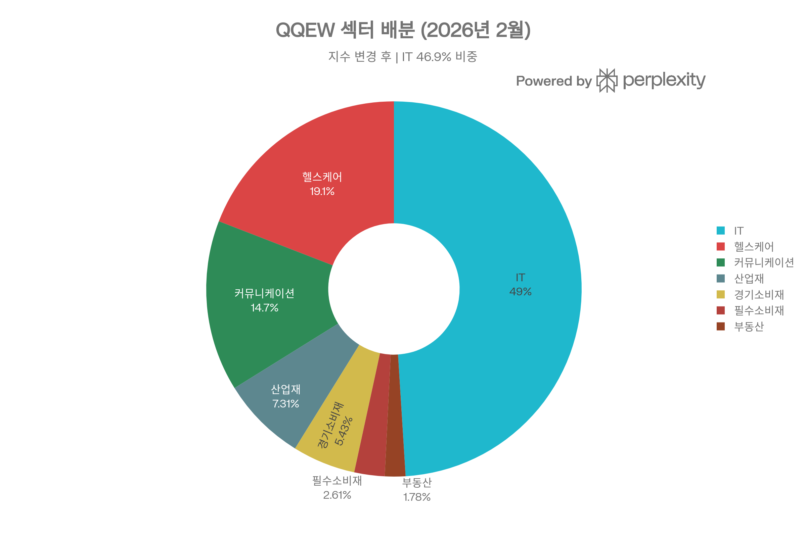
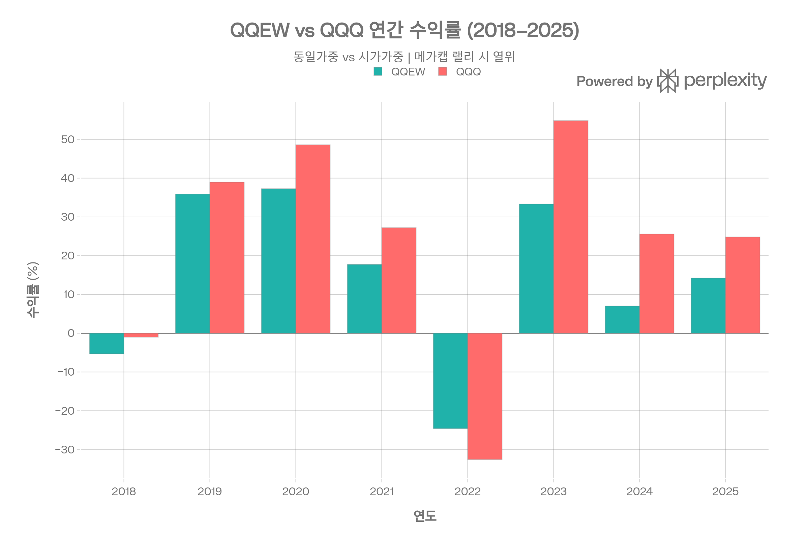
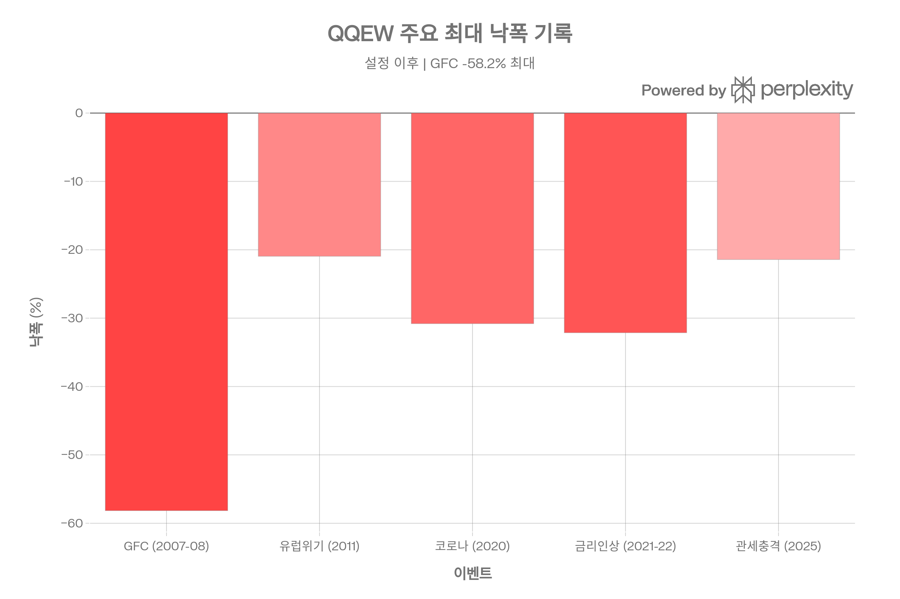
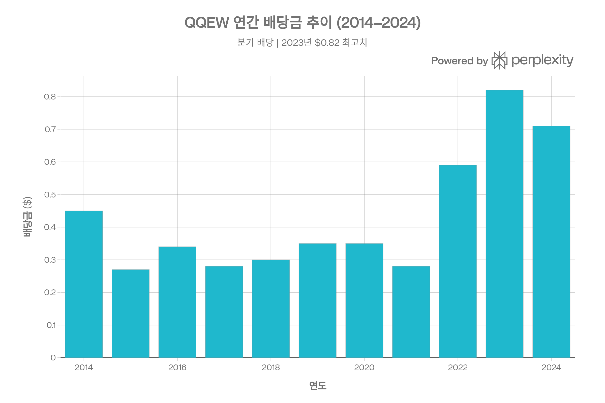
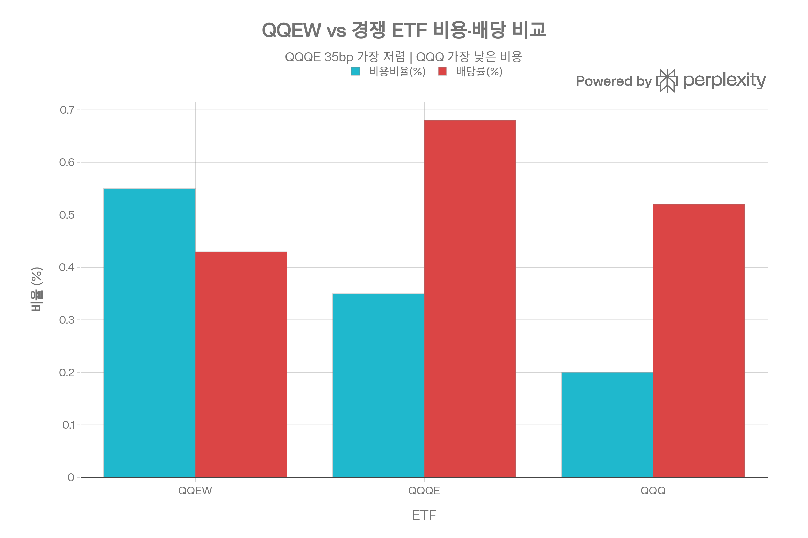

# QQEW (First Trust Nasdaq-100 Select Equal Weight ETF) 종합 분석 보고서
## 개요
QQEW는 First Trust가 운용하는 NASDAQ-100 기반 동일가중(Equal Weight) ETF로, 2006년 4월 설정 이후 약 20년의 운용 실적을 보유하고 있다. <strong>2025년 12월 22일, 기존 NASDAQ-100 Equal Weighted Index(100종목)에서 Nasdaq-100 Select Equal Weight Index(50종목)로 추종 지수를 변경하는 대대적 구조 전환</strong>을 단행했으며, 펀드명도 "First Trust Nasdaq-100 Select Equal Weight ETF"로 변경되었다. 이 전환은 단순 균등배분에서 <strong>품질·성장 스코어 기반 선별적 동일가중</strong>으로의 전략적 진화를 의미한다.[1][2][3]

현재 AUM은 약 \$16.9억(2026년 3월 기준)이며, 비용비율 0.55%, 52개 종목에 투자하고 있다. 시가가중 QQQ 대비 메가캡 집중도를 대폭 낮추되, 무작위 균등배분이 아닌 <strong>퀄리티·그로스 필터</strong>를 통해 종목을 선별하는 것이 핵심 특징이다.[4][5]

## ETF 분류

| 항목 | 내용 |
|------|------|
| <strong>최종 폴더</strong> | `ETF/Broad Market/Nasdaq-100/Equal Weight/QQEW` |
| <strong>대분류</strong> | 대표지수 |
| <strong>하위 분류</strong> | Nasdaq-100 / Equal Weight |
| <strong>핵심 전략</strong> | Nasdaq-100 구성 종목 중 품질·성장 점수 기반 선별 종목을 동일가중으로 편입 |
| <strong>운용 방식</strong> | 패시브 |
| <strong>레버리지·인버스 여부</strong> | 아니오 |
| <strong>옵션 인컴 전략 여부</strong> | 아니오 |
| <strong>분류 판단</strong> | Nasdaq-100 대표지수 노출을 기반으로 하지만 시가총액가중이 아니라 동일가중 및 선별형 구조가 핵심이므로 `Broad Market/Nasdaq-100/Equal Weight`로 분류한다. |

***
## 1. 기본 정보
| 항목 | 내용 |
|------|------|
| 정식명칭 | First Trust Nasdaq-100 Select Equal Weight ETF[2] |
| 티커 | QQEW |
| 설정일 | 2006년 4월 19일 (운용 약 20년)[1] |
| 운용사 | First Trust Advisors L.P.[6] |
| 상장거래소 | NASDAQ[1] |
| 순자산규모(AUM) | \~\$16.9억 (2026년 3월)[5] |
| 추종 지수 | Nasdaq-100 Select Equal Weight™ Index (2025.12.22부터)[3] |
| 이전 추종 지수 | NASDAQ-100 Equal Weighted™ Index (2006\~2025.12)[3] |
| 종목 수 | 52개 (변경 후)[4] |
### 지수 변경의 의미
2025년 10월 주주 승인을 거쳐, QQEW는 기존 100종목 균등배분에서 <strong>50종목 선별 균등배분</strong>으로 전환되었다. 새 지수는 NASDAQ-100 구성종목 중 <strong>3년 매출성장률, 3년 선행 EPS 성장률, 3년 FCF 성장률, ROE, 이익률</strong> 등의 복합 품질·성장 점수가 높은 50개 종목을 선별한다. 전환 시점에 약 49.6%의 포트폴리오가 교체되었으며, 약 \$3,870만의 자본이득이 실현된 것으로 추정된다.[7][2][8]

***
## 2. 추종 성과 지표
### 추적 정확도
QQEW는 완전복제(Full Replication) 방식으로 지수를 추종하며, 순자산의 최소 80%를 지수 구성종목에 투자한다. 지수 변경 이전의 추적 성과를 기준으로, 동일가중 전략은 분기 리밸런싱 비용이 수반되므로 일정 수준의 추적 차이가 발생한다.[3]
### NAV 대비 시장가격 괴리율
| 지표 | 수치 |
|------|------|
| NAV 할인/프리미엄 | -0.04% \~ -0.10%[9][10] |
| Bid/Ask Midpoint 괴리 | ±\$0.02\~\$0.05[5] |

NAV 대비 시장가격은 대체로 -0.04%에서 -0.10% 사이의 소폭 할인 상태로 거래되고 있어, 괴리율은 안정적이다. 지수 변경 직후 일시적 괴리 확대 가능성이 있었으나, 2026년 초 기준 정상 범위로 복귀한 상태이다.[10][9]

***
## 3. 비용 구조
| 항목 | QQEW | QQQE | QQQ |
|------|------|------|-----|
| 총 보수비율(TER) | 0.55%[4] | 0.35%[11] | 0.20% |
| AUM | \$16.9억[5] | \$12.6억[12] | \~\$3,100억 |
| 포트폴리오 회전율 | \~26% (변경 전)[10] | N/A | \~4% |

QQEW의 비용비율 0.55%는 직접 경쟁 ETF인 <strong>QQQE(0.35%)보다 20bp 비싸다</strong>. 2025년 주주 총회에서 기존 변동 비용 구조(0.57\~0.58%)에서 <strong>0.55% 단일 수수료(Unitary Fee)</strong> 체계로 전환되었으며, 2027년 4월까지 0.60% 비용 상한이 설정되어 있다. 동일가중 전략의 분기 리밸런싱 특성상 회전율이 시가가중 ETF보다 높으며, 지수 변경 과도기에는 49.6%의 일회성 포트폴리오 교체가 발생했다.[11][7]

***
## 4. 유동성 평가
| 지표 | 수치 |
|------|------|
| 일평균 거래량 (최근) | \~46,210주[13] |
| 30일 평균 거래량 | \~48,155주[10] |
| 호가 스프레드 | \~\$0.02[14] |
| 일평균 거래대금 | \~\$600만 (추정) |
| 공매도 잔량 | 0.03M주, 0.49일 커버[15] |

QQEW의 일평균 거래량은 약 4.6\~4.8만 주 수준으로, QQQ(수천만 주)나 QQQE(6.8만 주)에 비해 <strong>상대적으로 적은 편</strong>이다. 다만 호가 스프레드가 \$0.02(약 1.5bp) 수준으로 좁아, 소규모\~중규모 거래에는 유동성 문제가 없다. 대규모 기관 거래(수십만 주)에는 마켓 임팩트가 발생할 수 있으므로, 블록 트레이딩 활용이 권장된다.[16][14][13]

***
## 5. 포트폴리오 구성
### 상위 10대 보유 종목 (2026년 2월 기준)
| 순위 | 종목 | 티커 | 비중 |
|------|------|------|------|
| 1 | Western Digital | WDC | 3.48%[4] |
| 2 | ASML Holding | ASML | 3.16%[4] |
| 3 | Lam Research | LRCX | 3.16%[4] |
| 4 | Monolithic Power Systems | MPWR | 2.85%[4] |
| 5 | Gilead Sciences | GILD | 2.71%[4] |
| 6 | KLA Corp | KLAC | 2.68%[4] |
| 7 | Amgen | AMGN | 2.60%[4] |
| 8 | T-Mobile US | TMUS | 2.51%[4] |
| 9 | Monster Beverage | MNST | 2.49%[4] |
| 10 | DexCom | DXCM | 2.49%[4] |

<strong>상위 10종목 합계: \~27.2%</strong>. 동일가중 전략으로 각 종목이 약 2\~3.5% 사이에 분포하며, 시가가중 QQQ(상위 10 비중 \~50%)와 극명한 대조를 이룬다.[17]
### 섹터별 배분 (지수 변경 후)

| 섹터 | 비중 |
|------|------|
| 정보기술(IT) | 46.9%[4] |
| 헬스케어 | 18.3%[4] |
| 커뮤니케이션 서비스 | 14.1%[4] |
| 산업재 | 7.0%[4] |
| 경기소비재 | 5.2%[4] |
| 필수소비재 | 2.5%[4] |
| 부동산 | 1.7%[4] |
지수 변경 이전의 100종목 체제에서는 IT 39.8%, 경기소비재 12.0%, 헬스케어 9.1% 등이었으나, <strong>50종목 선별 후 IT 비중이 46.9%로 7%p 증가</strong>하고 헬스케어가 18.3%로 크게 확대되었다. 이는 품질·성장 스코어 필터가 IT와 바이오·헬스케어 종목을 선호하는 결과이다.[18][4]
### 리밸런싱
지수는 <strong>분기별(3월, 6월, 9월, 12월)</strong> 리밸런싱되며, 매 분기 세 번째 금요일 종가를 기준으로 모든 구성종목에 동일한 시장가치를 재배분한다. NASDAQ-100의 정기 종목 교체(연 1회, 12월)에 따라 편입·편출이 결정된다.[19]

***
## 6. 성과 분석
### 기간별 수익률

| 기간 | QQEW | QQQ (참고) |
|------|------|-----------|
| 1개월 | +4.40%[20] | \~+2.5% |
| 3개월 | +6.39%[20] | \~+3.0% |
| 6개월 | +4.78%[20] | \~+3.5% |
| YTD 2025 | +14.23%[21] | \~+24.8% |
| 1년 | +8.45%[1] | \~+12.4% |
| 3년 (연환산) | +5.14%[1] | \~+10% |
| 5년 (연환산) | +13.16%[1] | \~+18% |
| 10년 (연환산) | +12.07%[1] | \~+18% |
### 벤치마크 대비 분석
QQEW는 10년 연환산 12.07%로 S&P 500(10.89%)을 상회하지만, <strong>시가가중 QQQ 대비로는 연 5\~6%p 열위</strong>하다. 이는 2020\~2025년 메가캡(Apple, NVIDIA, Microsoft 등) 집중 랠리에서 동일가중 전략이 구조적으로 뒤처지기 때문이다. 반면, 2000년대 초반이나 시장 로테이션 국면에서는 동일가중이 우위를 보이는 경향이 있다.[1][22][23]
### 리스크 조정 성과
| 지표 | 1년 | 3년 | 5년 | 10년 |
|------|-----|-----|-----|------|
| 샤프 지수 | 0.38[1] | — | 0.64[1] | 0.57[1] |
| 표준편차 | 22%[15] | 15.18%[24] | 16.89%[24] | 16.99%[24] |
| 베타 | 1.04\~1.12[15][13] | — | — | — |
### 최대 낙폭(Maximum Drawdown)

| 이벤트 | 기간 | 최대 낙폭 | 회복 기간 |
|--------|------|-----------|-----------|
| 글로벌 금융위기 | 2007.10\~2008.11 | -58.16% | 533거래일[1] |
| 금리 인상 사이클 | 2021.11\~2022.10 | -32.13% | 317거래일[1] |
| 코로나 팬데믹 | 2020.02\~2020.03 | -30.80% | 53거래일[1] |
| 2025년 관세 충격 | 2025.02\~ | -21.43% | 미회복[1] |
| 유럽 재정위기 | 2011.05\~2011.10 | -20.95% | 94거래일[1] |
2025년 2월 고점 대비 -21.43%의 낙폭이 2026년 3월 현재 아직 회복되지 않았다. GFC 당시 -58.16%는 동일가중 전략의 중소형주 비중이 높아 대형 지수보다 더 큰 낙폭을 기록한 사례이다.[1]

***
## 7. 배당 정보

| 항목 | 수치 |
|------|------|
| 배당 수익률 (TTM) | 0.43\~0.54%[13][25] |
| 배당 지급 주기 | 분기별 (3월, 6월, 9월, 12월)[1] |
| 최근 배당금 | \$0.143/주 (2024년 12월)[25] |
| 2024년 연간 배당 | \$0.71/주[1] |
| 2023년 연간 배당 | \$0.82/주 (최고치)[1] |
배당 수익률은 0.43\~0.54% 수준으로, 성장주 중심 NASDAQ-100의 특성상 매우 낮다. 경쟁 ETF인 QQQE(0.68%)보다도 다소 낮은데, 이는 지수 변경 후 고성장·저배당 종목 비중이 높아진 결과로 해석된다. 배당금은 2021년 \$0.28에서 2023년 \$0.82로 크게 증가했으나, 2024년 \$0.71로 소폭 감소했다. 이 ETF는 배당보다는 <strong>자본이득 중심의 성장형 투자</strong>에 적합하다.[1][11][25]

***
## 8. 리스크 요소
### 베타 계수 및 상관관계
- <strong>베타</strong>: 1.04\~1.12 (S&P 500 대비)[15][13]
- NASDAQ-100 시가가중 지수와의 상관계수는 매우 높으나(\~0.95), 종목별 기여도는 크게 다름
- S&P 500과의 상관계수: \~0.90, 채권과의 상관계수: \~-0.10\~+0.15 (일반적 주식-채권 관계)
### 핵심 리스크 요인
- <strong>메가캡 열위 리스크</strong>: Apple, NVIDIA, Microsoft 등이 시장을 주도하는 환경에서 동일가중은 이들 종목의 비중이 제한되어 수익률이 뒤처진다. 최근 5년간 QQQ 대비 연 5%p 이상 열위하고 있다.[1][23]
- <strong>섹터 집중 리스크</strong>: 지수 변경 후 IT 비중이 46.9%로 증가하여, 기술 섹터 하락 시 영향이 확대되었다.[4]
- <strong>종목 수 축소 리스크</strong>: 100종목→50종목으로 분산 효과가 감소했으며, 품질·성장 팩터에 대한 집중이 특정 팩터 역풍 시 하방 리스크를 키울 수 있다.[23][8]
- <strong>높은 변동성</strong>: 3년 표준편차 15.18%, 5년 16.89%로 카테고리 평균(각각 16.96%, 19.21%)보다는 다소 낮으나 절대적으로 높은 편이다.[24]
- <strong>유동성 리스크</strong>: 일평균 거래량 4.6만 주로, 대규모 매매 시 스프레드 확대 가능성이 있다.[13]
- <strong>리밸런싱 비용</strong>: 분기 리밸런싱에 따른 거래 비용이 추적 차이에 영향을 미치며, 턴오버 26%는 추가적 암묵적 비용을 수반한다.[10]

***
## 경쟁 ETF 비교

| 항목 | QQEW | QQQE | QQQ |
|------|------|------|-----|
| 전략 | 50종목 선별 동일가중[2] | 100종목 동일가중[11] | 시가가중[26] |
| TER | 0.55%[4] | 0.35%[11] | 0.20% |
| AUM | \$16.9억[5] | \$12.6억[12] | \~\$3,100억 |
| 10년 연환산 | 12.07%[1] | 12.18%[11] | \~18% |
| 샤프 (1Y) | 0.38[1] | 0.43[11] | \~0.65 |
| 배당 수익률 | 0.43%[13] | 0.68%[11] | 0.52% |
| 종목 수 | 52[4] | \~101 | \~101 |
| 최대 낙폭 | -58.16%[1] | -32.14%[11] | \~-35% |
| 일평균 거래량 | \~46K[13] | \~68K[16] | \~40M |
QQQE가 <strong>낮은 비용(0.35%)과 더 넓은 분산(100종목)</strong>으로 순수 동일가중 전략을 원하는 투자자에게 유리하다. 반면 QQEW는 <strong>품질·성장 필터를 통한 선별적 접근</strong>을 차별점으로 삼으며, 이는 장기적으로 단순 동일가중 대비 알파 생성 가능성이 있으나, 20bp 추가 비용이 이를 상쇄할 수 있다.[11][7]

***
## 투자 적합성 평가
QQEW는 다음과 같은 투자자에게 적합하다:

- <strong>메가캡 집중 리스크를 줄이면서도</strong> NASDAQ-100에 노출되고 싶은 투자자
- 단순 동일가중보다 <strong>품질·성장 팩터 틸트</strong>를 선호하는 중급 이상 투자자
- QQQ의 위성(satellite) 배분으로 <strong>포트폴리오 분산 효과</strong>를 추구하는 전략적 투자자

반면, 비용 민감형 투자자는 QQQE(0.35%)를, 메가캡 랠리 참여를 원하는 투자자는 QQQ를, 최대 분산을 원하는 투자자는 기존 100종목 동일가중 전략인 QQQE를 고려하는 것이 적절하다. 지수 변경이 2025년 12월에 이루어진 만큼, 새 전략의 실적 트랙레코드가 아직 3개월에 불과하므로 <strong>최소 1\~2년의 성과 관찰 후 본격 투자</strong>를 권장한다.
