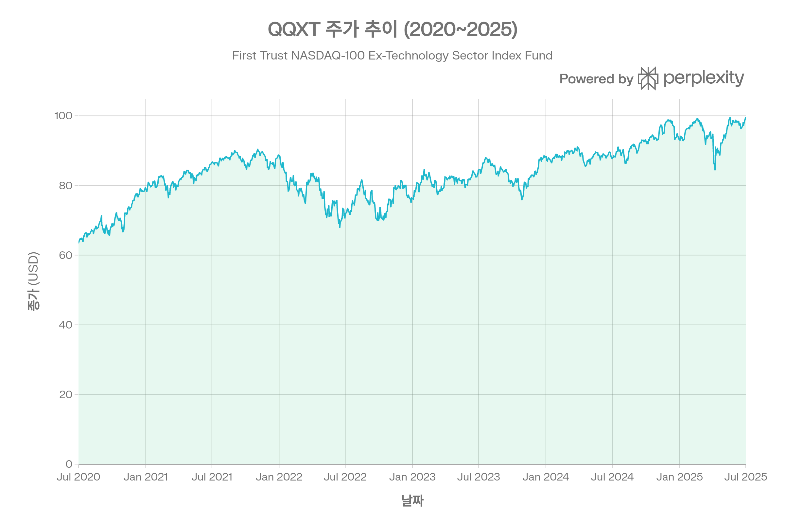
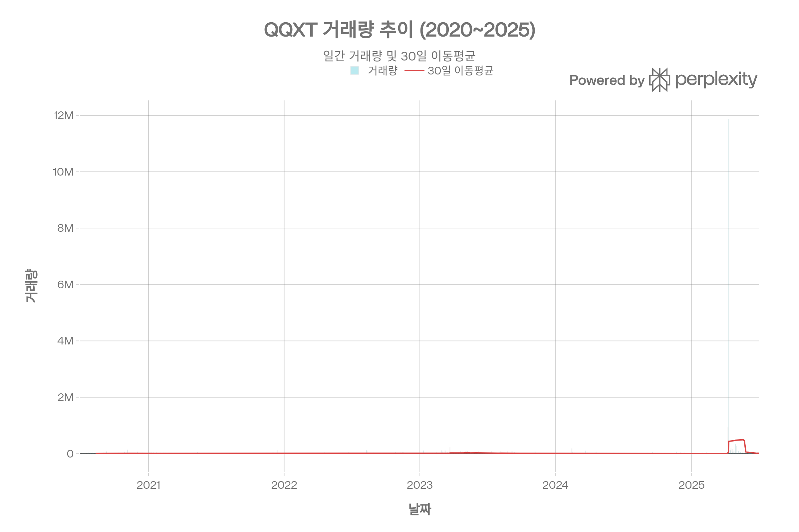
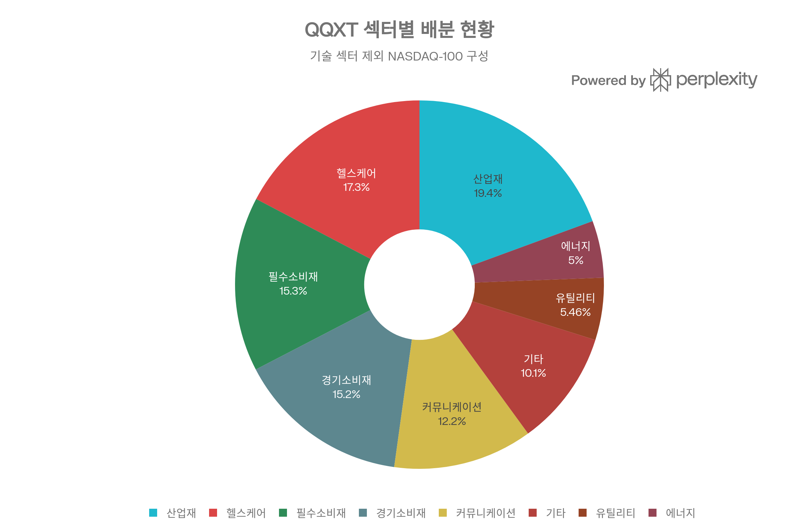
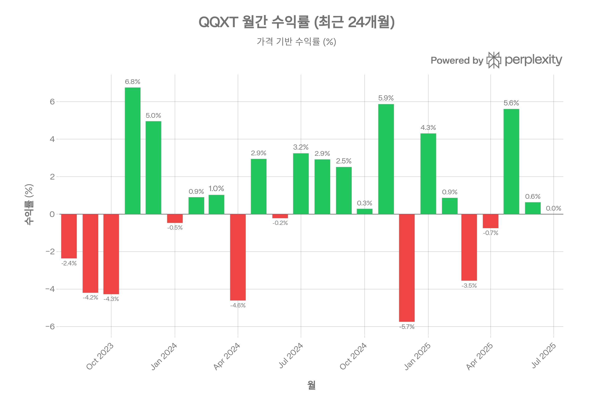
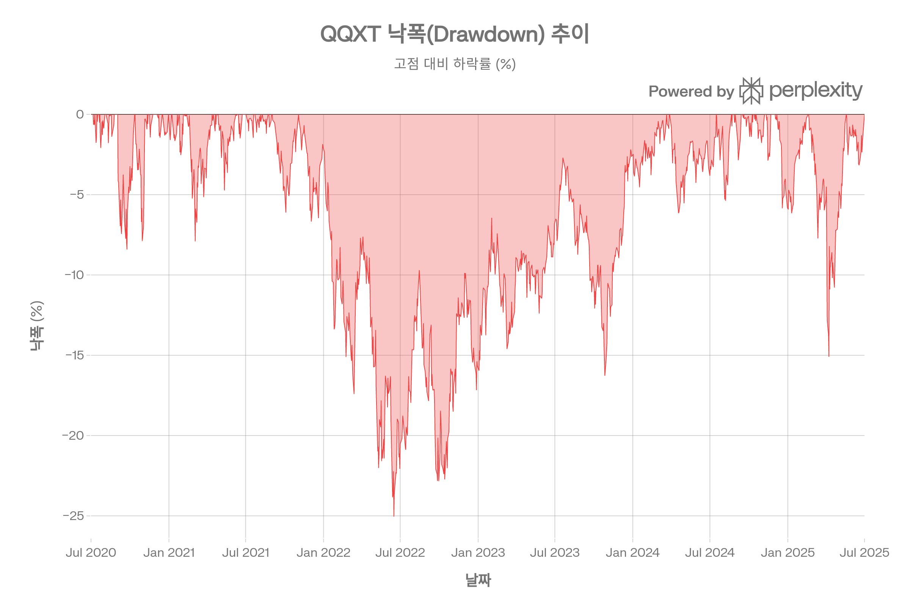

# QQXT (First Trust NASDAQ-100 Ex-Technology Sector Index Fund) 종합 분석 보고서
## 개요
QQXT는 NASDAQ-100 지수에서 기술(Technology) 섹터를 제외한 나머지 종목들로 구성된 ETF로, 기술주 집중 리스크를 피하면서 나스닥 100 기업의 비기술 분야에 투자하고자 하는 투자자를 위해 설계되었다. Equal-weighted(동일가중) 방식으로 구성되어 대형 기술주 편중을 근본적으로 차단한다. Morningstar는 이 펀드에 대해 <strong>Neutral</strong> 등급을 부여하고 있으며, Large Blend 카테고리로 분류한다.[1][2][3]

## ETF 분류

| 항목 | 내용 |
|------|------|
| <strong>최종 폴더</strong> | `ETF/Broad Market/Nasdaq-100/Ex Technology/QQXT` |
| <strong>대분류</strong> | 대표지수 |
| <strong>하위 분류</strong> | Nasdaq-100 / Ex Technology / Equal Weight |
| <strong>핵심 전략</strong> | Nasdaq-100 구성 종목 중 기술 섹터를 제외한 비기술 종목에 동일가중으로 투자 |
| <strong>운용 방식</strong> | 패시브 |
| <strong>레버리지·인버스 여부</strong> | 아니오 |
| <strong>옵션 인컴 전략 여부</strong> | 아니오 |
| <strong>분류 판단</strong> | 특정 기술 테마 ETF가 아니라 Nasdaq-100에서 기술 섹터를 제외한 대표지수 변형 ETF이므로 `Broad Market/Nasdaq-100/Ex Technology`로 분류한다. |

***
## 1. 기본 정보
| 항목 | 내용 |
|------|------|
| <strong>정식 명칭</strong> | First Trust NASDAQ-100 Ex-Technology Sector Index Fund |
| <strong>티커</strong> | QQXT (NASDAQ 상장) |
| <strong>설정일</strong> | 2007년 2월 8일[4][5] |
| <strong>운용 기간</strong> | 약 19년 |
| <strong>운용사</strong> | First Trust Advisors L.P.[6] |
| <strong>상장 거래소</strong> | NASDAQ[2] |
| <strong>추종 지수</strong> | NASDAQ-100 Ex-Tech Sector Index (NXTR)[6] |
| <strong>지수 가중 방식</strong> | Equal-weighted (동일가중)[2] |
| <strong>순자산 규모(AUM)</strong> | 약 $200M \~ $239M[4][2] |
| <strong>시가총액</strong> | $1.11B​ |
| <strong>현재가</strong> | $100.65​ (2026.03.11 기준) |
| <strong>52주 범위</strong> | $83.08​ \~ $104.06​ |
| <strong>총 보유 종목 수</strong> | 56​개 |
| <strong>펀드 매니저</strong> | Roger Testin, Daniel Lindquist, Jon Erickson 외[5] |

QQXT는 NASDAQ-100 지수 구성종목 중 기술 섹터로 분류되지 않는 약 56\~57개 종목을 동일가중 방식으로 편입한다. 이는 Consumer Discretionary, Healthcare, Industrials, Consumer Staples, Telecommunications, Utilities, Basic Materials 등 다양한 비기술 섹터에 걸친 분산 투자를 의미한다.[3]

***
## 2. 추종 성과 지표
### 추종 지수 특성
QQXT가 추종하는 NASDAQ-100 Ex-Tech Sector Index(NXTR)는 나스닥에 상장된 비금융·비기술 대형주를 동일가중 방식으로 구성한 지수이다. 분기별 리밸런싱 일정에 따라 운용되며, 이로 인해 높은 포트폴리오 회전율이 발생할 수 있다.[6][7]
### 추적 관련 요인
ETF의 인덱스 추적 성과는 운용 비용, 지수 변경에 따른 매매 비용, 포트폴리오 구성이 지수와 정확히 일치하지 않는 점 등 여러 요인에 의해 영향을 받는다. QQXT의 경우 0.60%의 비용비율이 주요 추적 차이(Tracking Difference)의 원인이 된다.[6]
### NAV 대비 괴리율
QQXT는 현재 NAV 대비 프리미엄/할인율이 약 0.00%\~0.01%로, 시장가격과 NAV 간 괴리가 거의 없는 수준이다. 이는 ETF의 차익거래(arbitrage) 메커니즘이 원활하게 작동하고 있음을 보여주지만, 유동성이 낮은 시점에서는 괴리율이 확대될 가능성이 있다.[6][8]

***
## 3. 비용 구조
| 항목 | 내용 |
|------|------|
| <strong>총 보수율 (Gross Expense Ratio)</strong> | 0.61%[6] |
| <strong>순 보수율 (Net Expense Ratio)</strong> | 0.60%[6][1] |
| <strong>비용 상한 (Cap)</strong> | 연 0.60% (계약 기반)[6] |
| <strong>포트폴리오 회전율</strong> | 높음 (분기별 리밸런싱에 따른 결과)[7] |
### 경쟁 ETF 대비 비용 비교
QQXT의 0.60% 비용비율은 동일 전략 카테고리 내에서 상대적으로 <strong>높은 편</strong>에 해당한다. 직접적 경쟁 ETF인 ProShares S&P 500 Ex-Technology ETF(SPXT)의 비용비율은 0.09%에 불과하여 QQXT 대비 약 6.7배 저렴하다. Vanguard Growth ETF(VUG)는 0.04%, Invesco QQQ(QQQ)는 0.20%로 운용된다.[9][10][11]

| ETF | 추종 지수 | 비용비율 | AUM |
|-----|-----------|----------|-----|
| <strong>QQXT</strong> | NASDAQ-100 Ex-Tech Sector | 0.60%[6] | \~$200M+ |
| <strong>SPXT</strong> | S&P 500 Ex-Information Technology | 0.09%[11] | — |
| <strong>QQQ</strong> | NASDAQ-100 | 0.20%[9] | $391B+ |
| <strong>VUG</strong> | CRSP US Large Cap Growth | 0.04%[9] | $195B+ |

QQXT의 비용은 경쟁 ETF 대비 높아, 장기 투자 시 수익률에 부정적 영향을 줄 수 있는 요소이다.[12]

***
## 4. 유동성 평가

| 항목 | 수치 |
|------|------|
| <strong>일평균 거래량 (최근 3개월)</strong> | 241,731​주 |
| <strong>평균 거래량 (장기)</strong> | 17,333​주 |
| <strong>일평균 거래대금 (최근 3개월)</strong> | $21,849,183​ |

QQXT의 거래량은 QQQ 등 대형 ETF에 비해 상당히 낮은 수준이다. 일평균 거래량이 수만 주 수준으로, 대규모 거래 시 슬리피지(slippage)가 발생할 수 있다. 다만, 최근 3개월 평균 거래량이 기존 장기 평균 대비 크게 증가한 모습을 보이며, 유동성이 개선되는 추세이다.

First Trust의 공시에 따르면, 시장 조성자(market maker) 또는 AP(Authorized Participant)가 시장 스트레스 시 역할을 축소할 경우 차익거래 효율성이 저하되어 NAV 괴리 및 호가 스프레드가 확대될 수 있다.[6]
---
## 5. 포트폴리오 구성
### 상위 10대 보유 종목
| 순위 | 종목명 | 티커 | 비중 |
|------|--------|------|------|
| 1 | Baker Hughes Company | BKR | 2.34%​ |
| 2 | Old Dominion Freight Line | ODFL | 2.18%​ |
| 3 | Honeywell International | HON | 2.13%​ |
| 4 | Diamondback Energy | FANG | 2.12%​ |
| 5 | Gilead Sciences | GILD | 2.10%​ |
| 6 | Ross Stores | ROST | 2.06%​ |
| 7 | Costco Wholesale | COST | 2.05%​ |
| 8 | American Electric Power | AEP | 2.04%​ |
| 9 | Amgen | AMGN | 2.02%​ |
| 10 | Starbucks | SBUX | 2.01%​ |

상위 10종목 합산 비중은 21.04%​로, 동일가중 방식 특성상 개별 종목 집중도가 낮고 분산이 잘 이루어져 있다.
### 섹터별 배분 현황

| 섹터 | 비중 |
|------|------|
| 산업재 (Industrials) | 약 19.4%[13] |
| 헬스케어 (Healthcare) | 약 17.31%[5] |
| 필수소비재 (Consumer Defensive) | 약 15.31%[5] |
| 경기소비재 (Consumer Cyclical) | 약 15.19%[5] |
| 커뮤니케이션 (Communication Services) | 약 12.21%[5] |
| 기타 (유틸리티, 에너지 등) | 약 20.58%[5] |
기술 섹터를 완전히 제외한 구성으로, 산업재와 헬스케어가 가장 높은 비중을 차지하며, 비교적 균등한 섹터 분산이 이루어져 있다.[13][10]
### 국가/지역별 분산
| 구분 | 비중 |
|------|------|
| 미국 주식 | 94.34%[5] |
| 비미국 주식 | 5.46%[5] |
| 현금 | 0.19%[5] |

AstraZeneca(영국), Ferrovial(스페인) 등 일부 비미국 기업이 포함되어 있으나, 사실상 미국 중심 포트폴리오이다.[5]
### 리밸런싱 주기
분기별(Quarterly) 리밸런싱을 실시하며, 이는 동일가중 지수의 특성상 각 종목의 비중을 균등하게 재조정하기 위한 것이다. 분기별 리밸런싱은 높은 포트폴리오 회전율과 관련 거래 비용을 수반한다.[7]

***
## 6. 성과 분석
### 기간별 수익률

| 기간 | 수익률 |
|------|--------|
| 1개월 | 1.50%​ |
| 3개월 | 5.98%​ |
| 6개월 | 5.80%​ |
| 1년 | 13.19%​ (가격 기준) |
| 1년 (다른 소스) | 약 2.22% \~ 4.11%[2][14] |
| 3년 | 36.23%​ (누적) |
| 설정 이래 연평균 | 약 9.50%[2] |

※ 수익률은 측정 시점에 따라 차이가 있을 수 있으며, 위 계산은 2025년 7월 1일 기준 가격 데이터에 기반한다.
### 벤치마크 대비 성과
QQXT는 기술주 중심의 QQQ 대비 장기적으로 상당한 성과 격차가 존재한다. 기술주 랠리 기간에는 QQQ가 월등히 우세하지만, 기술주 조정 국면에서는 QQXT가 상대적 방어력을 보인다.[12][15]
### 리스크 지표

| 지표 | 수치 |
|------|------|
| <strong>표준편차 (3년 연환산)</strong> | 16.55%​ |
| <strong>표준편차 (3년, 별도 소스)</strong> | 13.55%[14] |
| <strong>샤프 비율 (3년)</strong> | 0.43​ |
| <strong>샤프 비율 (별도 소스)</strong> | 0.43 \~ 0.78[16][17] |
| <strong>최대 낙폭 (2020\~)</strong> | -25.05%​ |
| <strong>최대 낙폭 (설정 이래)</strong> | -57.45%[18][19][17] |
| <strong>베타</strong> | 0.90[14][2] |
| <strong>P/E 비율</strong> | 23.66​ |
설정 이래 최대 낙폭 -57.45%는 2008\~2009년 금융위기 시기에 발생한 것으로, QQQ의 -82.97%보다는 양호하지만 S&P 500(VTI) -55.45%와 유사한 수준이다. 최근 5년간(2020\~) 최대 낙폭은 -25.05%​로 상대적으로 관리 가능한 수준이다.[18][20]

***
## 7. 배당 정보
| 항목 | 내용 |
|------|------|
| <strong>배당 수익률 (TTM)</strong> | 약 0.71% \~ 1.20%[21][4] |
| <strong>연간 배당금 (TTM)</strong> | $0.71 \~ $1.20[21][2] |
| <strong>배당 지급 주기</strong> | 분기별 (Quarterly)[21] |
| <strong>배당성향 (Payout Ratio)</strong> | 15.48%[2] |
| <strong>1년 배당 성장률</strong> | -36.33%[21] |
### 최근 배당 이력
| 배당락일 | 배당금 | 지급일 |
|----------|--------|--------|
| 2025.09.25 | $0.1463[2] | 2025.09.30 |
| 2025.06.26 | $0.1606[21] | 2025.06.30 |
| 2025.03.27 | $0.1955[21] | 2025.03.31 |
| 2024.12.13 | $0.2056[21] | 2024.12.31 |
| 2024.09.26 | $0.1618[21] | 2024.09.30 |
| 2024.06.27 | $0.2556[21] | 2024.06.28 |
| 2023.12.22 | $0.4048[21] | 2023.12.29 |

QQXT의 배당금은 분기마다 변동이 크며, 최근 1년간 배당 성장률이 -36.33%로 하락 추세를 보이고 있다. 다만, 5년간 평균 배당 성장률은 43.17%로 장기적으로는 성장 이력이 있다. 배당 수익률 자체는 1% 내외로 소득형 투자보다는 자본 이득(capital gain) 중심의 ETF로 볼 수 있다.[21][22]

***
## 8. 리스크 요소
### 베타 계수 및 시장 민감도
QQXT의 베타는 <strong>0.90</strong>으로, S&P 500 대비 시장 전체 움직임에 대한 민감도가 약간 낮은 수준이다. 기술 섹터를 제외했기 때문에 기술주 급등·급락 시 QQQ(베타 약 1.0 이상) 대비 변동성이 낮게 나타난다.[14][2]

또한, LTM 베타가 별도로 0.75x로 보고되기도 하여, 최근 기술주 중심 랠리에서 QQXT가 시장 대비 덜 민감하게 반응했음을 시사한다.[4]
### 섹터 집중도 리스크
기술 섹터를 제외하긴 했으나, 산업재(19.4%)와 헬스케어(17.3%)에 상당 부분이 집중되어 있어, 이들 섹터의 경기 민감도가 리스크 요인이 될 수 있다. 특히 경기 침체 시 산업재와 경기소비재 섹터는 큰 타격을 받을 수 있다.[13][5]
### 유동성 리스크
AUM이 약 $200M 수준으로 중소형 ETF에 해당하며, 일평균 거래량이 상대적으로 적어 대규모 매매 시 호가 스프레드 확대 및 슬리피지 리스크가 존재한다. 시장 스트레스 상황에서는 AP가 시장 조성을 축소할 가능성이 있으며, 이 경우 NAV 괴리가 확대될 수 있다.[6]
### 동일가중 방식의 구조적 리스크
동일가중 방식은 분기별 리밸런싱을 요구하므로 높은 포트폴리오 회전율과 거래 비용이 발생한다. 또한, 시가총액 가중 지수 대비 중소형주에 상대적으로 높은 비중이 부여되어, 중형주(mid-cap)의 가격 변동성에 더 노출된다.[6][7]
### 다른 자산군과의 상관관계
QQXT는 S&P 500(VTI)과의 최대 낙폭이 유사한 수준(-57.45% vs -55.45%)으로, 광범위 미국 주식 시장과 높은 상관관계를 보인다. 기술 섹터를 제외했음에도 분산 효과가 제한적일 수 있으며, 채권(BND)이나 해외 주식(VXUS) 등과의 조합이 포트폴리오 분산에 더 효과적이다.[20]
### 지수 변경 리스크
2025년 기준으로 QQXT의 기초 지수가 변경될 가능성에 대한 공시가 있었으며, 새 지수는 50개 종목으로 구성되고 정보기술 기업에 대한 유의미한 투자를 포함할 수 있어 펀드 성격이 변경될 수 있다. 이는 투자자가 주의 깊게 모니터링해야 할 사항이다.[7]

***
## 종합 평가
QQXT는 NASDAQ-100의 비기술 부문에 동일가중으로 투자하는 독특한 전략을 제공하지만, 0.60%의 높은 비용비율과 제한된 유동성이 주요 약점이다. SPXT(비용비율 0.09%) 등 유사 전략의 저비용 대안이 존재하며, 장기 투자자는 비용 효율성을 반드시 고려해야 한다. 기술주 집중 리스크를 회피하면서 나스닥 기업들의 비기술 부문 성장에 투자하고자 하는 전략적 목적이 명확한 투자자에게 적합하다.[12][10][11]
