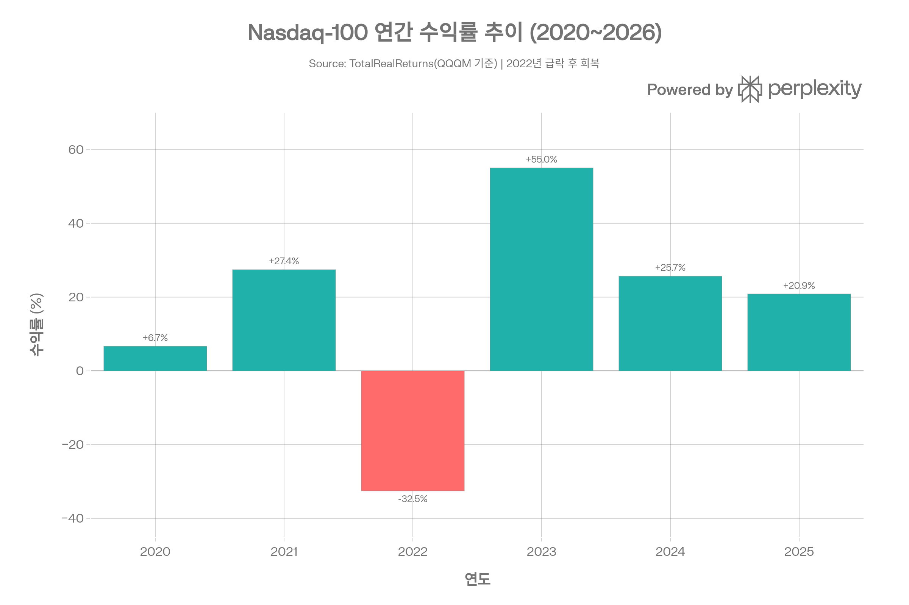
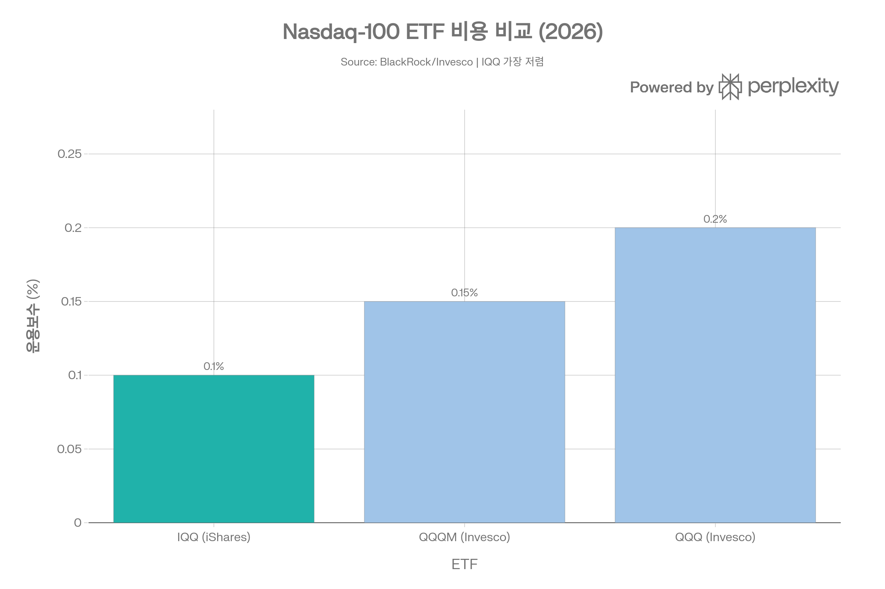
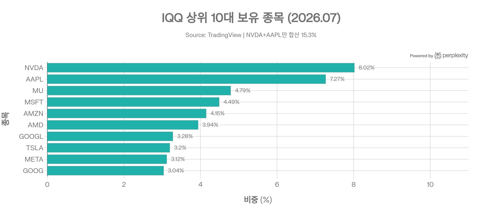
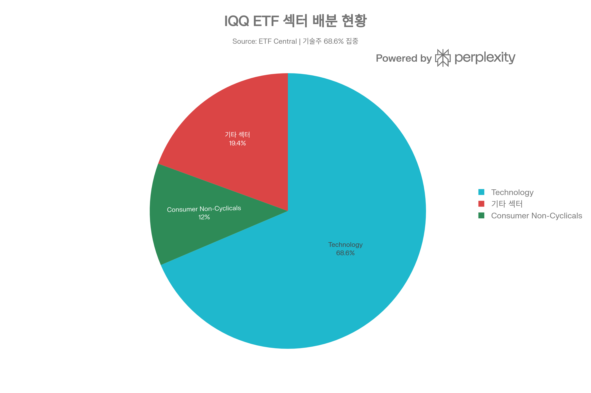

## 분류 근거

IQQ는 Nasdaq-100 지수를 그대로 추종하는 패시브 ETF로, 레버리지/인버스가 아니고 특정 섹터·테마에 국한되지 않는 광범위 지수형 상품입니다. 동일 지수를 추종하는 기존 [QQQ](/blog/etf/broad-market/nasdaq-100/qqq/qqq)/[QQQM](/blog/etf/broad-market/nasdaq-100/qqqm/qqqm-invesco-nasdaq-100-etf)과 같은 `ETF/Broad Market/Nasdaq-100` 폴더로 분류했습니다.

## 요약

IQQ(iShares Nasdaq 100 ETF)는 BlackRock이 2026년 7월 9일 NASDAQ에 상장한 신규 ETF로, Invesco의 QQQ/QQQM이 독점해온 Nasdaq-100 추종 시장에 도전장을 내밀었습니다. 2027년 7월까지 한시적으로 적용되는 **순보수 0.10%**는 QQQM(0.15%), QQQ(0.20%)보다 낮은 업계 최저 수준이며, 주당 \$24의 낮은 초기 NAV로 소액 투자자의 접근성을 높였습니다. 다만 상장 직후라 추적오차·배당 이력 등 자체 성과 데이터가 아직 없고, QQQ 대비 유동성·옵션 시장 규모는 열세입니다.

## 1. 기본 정보
IQQ는 BlackRock이 2026년 7월 7일 발표하고, **2026년 7월 9일 NASDAQ에 상장한 신규 ETF**로, 세계 최대 자산운용사인 BlackRock이 Invesco의 Nasdaq-100 ETF 독점 지위에 도전하기 위해 출시했습니다. 기존 iShares의 글로벌 Nasdaq-100 전략 자산 규모인 410억 달러 이상의 플랫폼 위에 구축되었습니다.

| 항목 | 내용 |
|------|------|
| **정식 명칭** | iShares Nasdaq 100 ETF |
| **티커** | IQQ (NASDAQ) |
| **운용사** | BlackRock Fund Advisors (iShares 브랜드) |
| **상장거래소** | NASDAQ |
| **설정일** | 2026년 7월 8일 |
| **추종 지수** | Nasdaq-100 Index (XNDX) |
| **지수 구성** | 나스닥 상장 100대 비금융 기업 (시가총액 기준) |
| **총자산(AUM)** | 약 \$1억 1,365만 (2026년 7월 13일 기준) |
| **초기 NAV** | 주당 \$24 |
| **순자산가치(NAV) 대비 괴리율** | +0.05% (2026년 7월 13일) |
| **복제 방식** | 직접 복제(Physical) |
| **배당 주기** | 분기별 배당 |
| **보유 종목 수** | 103\~104개 |
| **P/E 비율** | 42.18배 |
| **P/B 비율** | 10.03배 |

IQQ는 출시 불과 5일 만에 **1억 달러 이상의 AUM**을 달성하며 순조로운 출발을 보였습니다. 초기 NAV를 \$24로 설정해 기존 경쟁 ETF인 QQQ(\$722)나 QQQM(\$297) 대비 훨씬 낮은 진입 장벽을 제공합니다.

***
## 2. 추종 성과 지표
### 추적오차(Tracking Error) 및 추적 차이(Tracking Difference)
IQQ는 **2026년 7월 9일 상장** 후 불과 1주일이 지난 시점이므로, 아직 1년/3년/5년 추적오차 및 추적 차이 데이터는 집계되지 않았습니다. 다만 동일 지수를 추종하는 QQQM의 장기 추적 성과가 우수(설정 이후 최대 낙폭 -35.04\~-35.05%)했던 만큼, iShares의 운용 역량과 직접 복제 방식을 고려하면 양호한 추적 성과가 예상됩니다.
### NAV 대비 시장가격 괴리율
상장 직후인 2026년 7월 13일 기준 **프리미엄 +0.05%**를 기록하고 있어, 이는 ETF의 시장가격이 순자산가치와 거의 동일함을 의미합니다. 이는 유동성 공급자(Authorized Participant)가 정상적으로 작동하고 있음을 시사합니다.
### 참고: Nasdaq-100 지수 장기 성과

IQQ는 상장 역사가 짧아 자체 성과 데이터가 없습니다. 아래는 원출처가 제시한 Nasdaq-100 지수 참고 수치이며, 동일 지수를 추종하는 [QQQM 자체 포스트](/blog/etf/broad-market/nasdaq-100/qqqm/qqqm-invesco-nasdaq-100-etf)가 보고하는 실측 수익률(예: 1년 +19.83\~+26.62%, 5년 누적 +91.47%)과는 집계 시점·산출 방식 차이로 다를 수 있어, QQQM의 실제 수익률이 궁금하다면 해당 포스트를 참고하시기 바랍니다.

| 기간 | 수익률 |
|------|--------|
| 1개월 | +4.48% |
| 3개월 | +18.73% |
| 6개월 | +15.78% |
| 1년(YTD 포함) | +29.11%\~+30.66% |
| 3년 연환산 | +24.17% |
| 5년 연환산 | +15.22% |
| 2020년 이후 누적 | +150.90% |
---
## 3. 비용 구조
### 총보수 및 비용(Total Expense Ratio)
IQQ는 현재 **업계 최저 수준의 운용보수**를 제공합니다.

- **총보수(Gross Expense Ratio): 0.12%**
- **순보수(Net Expense Ratio): 0.10%** (2027년 7월 31일까지 수수료 면제 적용)
- 관리보수 0.12%, 취득 펀드 보수 0%, 외국세금 및 기타 비용 0%
### 경쟁 ETF 대비 비용 비교

| ETF | 운용사 | 운용보수 | 상장 연도 |
|-----|--------|---------|---------|
| **IQQ** | BlackRock iShares | **0.10%** (한시적 면제) | 2026 |
| QQQM | Invesco | 0.15% | 2020 |
| QQQ | Invesco | 0.18%\~0.20% | 1999 |
IQQ의 0.10% 보수는 경쟁 QQQM(0.15%) 대비 5bp, QQQ(0.20%) 대비 10bp 저렴합니다. 다만 이 혜택은 2027년 7월 31일까지의 한시적 면제이며, 그 이후에는 총보수 0.12%가 적용됩니다. 1만 달러 투자 기준, IQQ는 연간 \$10의 비용만 발생해 QQQM(\$15), QQQ(\$20) 대비 절감 효과가 있습니다.
### 포트폴리오 회전율 및 거래 비용
- **회전율(Turnover Ratio)**: 공개된 데이터 없음 (상장 직후)
- Nasdaq-100 지수는 **연 1회 리밸런싱**(매년 12월 세 번째 금요일 종료 후)하며, 분기별 비중 재조정(3월, 6월, 9월, 12월)을 실시합니다
- 거래 비용 면에서 IQQ는 상장 초기이므로 QQQ 대비 스프레드가 다소 넓을 수 있으나, 일일 거래량 기준 약 150만\~550만 주가 거래되고 있어 초기 유동성은 양호한 편입니다

***
## 4. 유동성 평가
### 일평균 거래량 및 거래대금
| 항목 | 수치 |
|------|------|
| **1일 거래량** (2026.07.13) | 1,520,560주 |
| **3개월 평균 거래량** | 2,662,062주 |
| **52주 저가** | \$24.02 |
| **52주 고가** | \$24.66 |

- 상장 초기임에도 불구하고 하루 150만\~550만 주의 거래량이 발생하고 있어 초기 유동성은 양호하게 형성되고 있습니다.
- 상장 5일째에 이미 1억 달러 이상의 AUM을 확보했다는 점은 기관 및 개인 투자자들의 빠른 관심을 보여줍니다.
### 호가 스프레드 및 안정성
IQQ는 상장 1주일이 지나지 않아 장기적인 스프레드 데이터가 아직 없습니다. 초기 단계에서 QQQ와 같이 깊은 유동성 및 옵션 시장을 갖추지는 못했으나, BlackRock의 브랜드 신뢰도와 저보수 전략으로 장기적인 AUM 성장이 예상됩니다. 장기 투자자 입장에서는 소폭의 스프레드가 큰 문제가 되지 않으며, 보수 절감 효과가 이를 상쇄합니다.

***
## 5. 포트폴리오 구성
### 상위 10대 보유 종목 및 비중

| 순위 | 티커 | 종목명 | 비중 |
|------|------|--------|------|
| 1 | NVDA | NVIDIA Corporation | 8.02% |
| 2 | AAPL | Apple Inc. | 7.27% |
| 3 | MU | Micron Technology | 4.79% |
| 4 | MSFT | Microsoft Corporation | 4.49% |
| 5 | AMZN | Amazon.com, Inc. | 4.15% |
| 6 | AMD | Advanced Micro Devices | 3.94% |
| 7 | GOOGL | Alphabet Inc. (Class A) | 3.28% |
| 8 | TSLA | Tesla, Inc. | 3.20% |
| 9 | META | Meta Platforms | 3.12% |
| 10 | GOOG | Alphabet Inc. (Class C) | 3.04% |

- 상위 2개 종목(NVDA + AAPL)만 합산해도 약 15.3%를 차지합니다.
- 상위 15개 종목이 총 보유자산의 **59.36%**를 차지해 상당한 집중도를 보입니다.
- Alphabet은 Class A(GOOGL)와 Class C(GOOG)로 분리 보유하므로 실질적 노출은 약 6.3%에 달합니다.
### 섹터별 배분 현황

| 섹터 | 비중 |
|------|------|
| **Technology (기술)** | 68.59% |
| **Consumer Non-Cyclicals (필수소비재)** | 11.99% |
| 기타 섹터 | 19.42% |

IQQ는 기술 섹터에 68.6%라는 높은 비중이 집중되어 있습니다. 이는 AI, 반도체, 클라우드, 전자상거래, 스트리밍 등 첨단 기술 기업들을 광범위하게 포함하기 때문입니다.
### 국가별/지역별 분산
| 국가/지역 | 비중 |
|----------|------|
| **미국(USA)** | 95.86% |
| 기타 국가 | 4.14% |

IQQ는 미국 기업에 95.86%가 집중된 사실상 **미국 순수 주식 ETF**입니다. 글로벌 분산 효과는 제한적입니다.
### 리밸런싱 주기
Nasdaq-100 지수는 **연 1회(12월 세 번째 금요일 종료 후) 연간 리밸런싱**을 실시하며, **분기별 비중 재조정**(3, 6, 9, 12월 세 번째 금요일 종료 후)도 진행합니다. 단일 종목의 비중이 지수 내에서 15%를 초과할 수 없고, 분기 재조정 시에는 발행자 기준 24% 상한이 적용됩니다. 2026년 5월부터 새로 상장한 기업도 7거래일 후 빠른 편입(fast entry) 방식으로 지수에 포함될 수 있게 되었습니다.

***
## 6. 성과 분석
### 기간별 수익률
IQQ는 2026년 7월 9일 상장되었으므로 자체 수익률 데이터는 아직 없습니다. 아래는 원출처가 제시한 Nasdaq-100 지수 참고 수치이며, QQQM 자체의 실측 수익률과는 다를 수 있습니다(위 "2. 추종 성과 지표" 절 참고).

| 기간 | Nasdaq-100 지수 참고 수치 |
|------|----------------------|
| 1개월 | +4.48% |
| 3개월 | +18.73% |
| 6개월 | +15.78% |
| YTD (2026) | +18.11% |
| 1년 | +29.11%\~+30.66% |
| 3년 연환산 | +24.17% |
| 5년 연환산 | +15.22% |
| 2020년 이후 누적 | +150.90% |
### 연도별 Nasdaq-100 수익률 (참고 수치)
| 연도 | 수익률 |
|------|--------|
| 2020 | +6.67% |
| 2021 | +27.45% |
| 2022 | **-32.52%** |
| 2023 | **+55.01%** |
| 2024 | +25.68% |
| 2025 | +20.85% |
| 2026(YTD) | +16.16% |

2022년 급리인상 충격으로 -32.52%의 최대 낙폭을 경험했으나, 2023년 AI 붐과 함께 +55.01%로 강하게 반등했습니다. 이후 지속적인 상승세를 기록 중입니다.
### 샤프 지수(Sharpe Ratio) 및 변동성
| 항목 | 참고 수치 |
|------|----------------|
| **샤프 지수(1Y)** | 1.05 |
| **변동성(표준편차, 1Y)** | 22.43% |
| **최대 낙폭(MDD)** | -35.04\~-35.05% (2021.11.22 \~ 2022.11.03, QQQM 자체 포스트 기준) |
| **현재 낙폭 (고점 대비)** | -4.50% (2026.06.02 고점 대비) |

***
## 7. 배당 정보
IQQ의 공식 **배당 주기는 분기(Quarterly)**이며, 상장 직후인 현재 시점(2026년 7월)에는 배당 이력 및 정확한 배당 수익률 데이터가 아직 공개되지 않은 상태입니다. 이는 신생 ETF로서 자연스러운 한계점입니다.

참고로 Nasdaq-100 ETF는 구성 종목들이 지급하는 배당금을 패스스루 형태로 분배하는데, QQQM은 자체 포스트 기준 약 **0.49\~0.55%의 배당 수익률**을 보여주고 있습니다. IQQ 역시 동일 지수를 추종하므로 유사한 수준의 배당 수익률이 기대됩니다.

Nasdaq-100 지수 특성상 **기술주 비중이 높아 전반적인 배당 수익률은 낮은 편**이며, 총수익(Total Return)은 배당보다는 주가 상승에서 주로 발생합니다.

***
## 8. 리스크 요소
### 베타 계수 및 상관계수
IQQ는 상장 직후이므로 자체 베타 데이터가 없습니다. 동일 지수 추종 ETF들의 베타 참고치는 다음과 같습니다:
- **Nasdaq-100 ETF 베타**: S&P 500 대비 약 1.05\~1.16 수준
- 이는 시장 변동 시 S&P 500 대비 약 5\~16% 더 크게 반응함을 의미합니다
### 섹터 집중도 리스크
IQQ 포트폴리오의 가장 큰 리스크는 **기술 섹터에 68.59%가 집중**되어 있다는 점입니다. AI, 반도체, 클라우드 업종의 사이클적 변동, 규제 리스크, 밸류에이션 부담(P/E 42.18배)에 직접적으로 노출되어 있습니다. 특히 상위 2개 종목(NVDA + AAPL)이 전체의 15%를 차지해 이들의 실적 및 주가 변동이 펀드 성과에 큰 영향을 미칩니다.

BlackRock도 공시에서 "특정 산업, 섹터, 시장에 집중된 펀드는 다른 섹터나 전체 증권 시장 대비 성과가 부진하거나 변동성이 높을 수 있다"고 경고하고 있습니다.
### 유동성 리스크
IQQ는 상장 초기로 아직 QQQ 수준의 **깊은 옵션 시장이나 기관 유동성이 형성되지 않았습니다**. 단기 트레이더나 대형 기관이 사용하기에는 스프레드와 충격 비용이 QQQ 대비 높을 수 있습니다. 장기 보유 투자자에게는 큰 문제가 아니지만, 빠른 청산이 필요한 상황에서는 주의가 필요합니다.
### 환율 및 지역 리스크
IQQ는 USD 기준 자산으로, **한국 투자자에게는 원/달러 환율 변동**이 추가 리스크 요인입니다. 미국 달러 강세 시 원화 기준 수익이 확대되고, 달러 약세 시에는 수익이 축소됩니다.
### 구조적 리스크
- **금리 리스크**: 고 밸류에이션 성장주로 구성된 만큼 금리 상승 환경에서 큰 타격을 받을 수 있습니다 (2022년 사례 참조)
- **SpaceX 편입 가능성**: Nasdaq-100은 최근 방법론을 개정해 SpaceX 같은 신규 상장 기업도 빠르게 편입 가능해졌으며, 이로 인한 포트폴리오 구성 변화가 예상됩니다

***
## 9. 경쟁 ETF 비교
| 항목 | IQQ | QQQM | QQQ |
|------|-----|------|-----|
| **운용사** | BlackRock iShares | Invesco | Invesco |
| **상장 연도** | 2026 | 2020 | 1999 |
| **추종 지수** | Nasdaq-100 | Nasdaq-100 | Nasdaq-100 |
| **순보수** | **0.10%** | 0.15% | 0.20% |
| **총보수** | 0.12% | 0.15% | 0.20% |
| **AUM** | \$1.1억 | \$수백억 | \$수천억 |
| **초기 NAV / 현재 주가** | 초기 \$24 | 현재가 약 \$298 | 현재가 약 \$722 |
| **배당 주기** | 분기 | 분기 | 분기 |
| **적합 투자자** | 장기 투자자 | 장기 투자자 | 활동적 트레이더 |
| **옵션 시장** | 초기 형성 중 | 제한적 | 매우 풍부 |

IQQ는 **저보수**라는 핵심 경쟁 우위를 갖추고 있으나, 아직 QQQ나 QQQM에 비해 AUM과 유동성 면에서 크게 열세입니다. 그러나 BlackRock의 브랜드 파워와 글로벌 41억 달러 규모의 iShares Nasdaq-100 플랫폼을 감안하면 향후 빠른 AUM 성장이 예상됩니다.

***
## 10. 종합 투자 관점
### 장점
- **최저 운용보수**: 현재 0.10%로 주요 Nasdaq-100 ETF 중 최저
- **BlackRock 운용 역량**: 글로벌 iShares 플랫폼과 20년 이상의 Nasdaq-100 운용 경험
- **낮은 진입 단가**: 주당 \$24 수준으로 소액 투자자도 접근 용이
- **직접 복제 방식**: 인덱스 추적 정확성 확보
- **분기 배당**: 소득 발생 가능
### 단점 및 고려사항
- **상장 역사 부족**: 2026년 7월 9일 상장으로 추적오차, 추적 차이 등 성과 데이터 없음
- **유동성 열위**: QQQ 대비 AUM 및 옵션 시장 규모가 현저히 작음
- **기술주 집중 리스크**: 포트폴리오의 68.59%가 기술 섹터
- **면제 보수의 한시성**: 0.10% 보수는 2027년 7월 31일까지만 적용되며 이후 0.12%로 인상
- **배당 이력 없음**: 신생 펀드로 배당 실적 미확보
### 투자 적합성
IQQ는 **Nasdaq-100 지수에 장기 투자를 원하는 비용 민감형 장기 투자자**에게 가장 적합합니다. 활발한 트레이딩이나 옵션 전략을 구사하는 투자자는 QQQ를, 비용과 유동성의 균형을 원한다면 QQQM을 여전히 고려할 수 있습니다. 단, 최저 보수라는 장점 외에도 BlackRock의 강력한 브랜드 신뢰도와 기관 마케팅 채널을 감안하면 IQQ는 장기적으로 중요한 경쟁자로 부상할 가능성이 높습니다.

***

> **⚠️ 면책 고지**: 본 보고서는 정보 제공 목적으로 작성되었으며, 투자 권유가 아닙니다. 투자 결정은 개인의 투자 목표, 재무 상황 및 위험 감수 능력을 고려하여 신중하게 이루어져야 합니다. 과거 수익률은 미래 수익률을 보장하지 않습니다.
