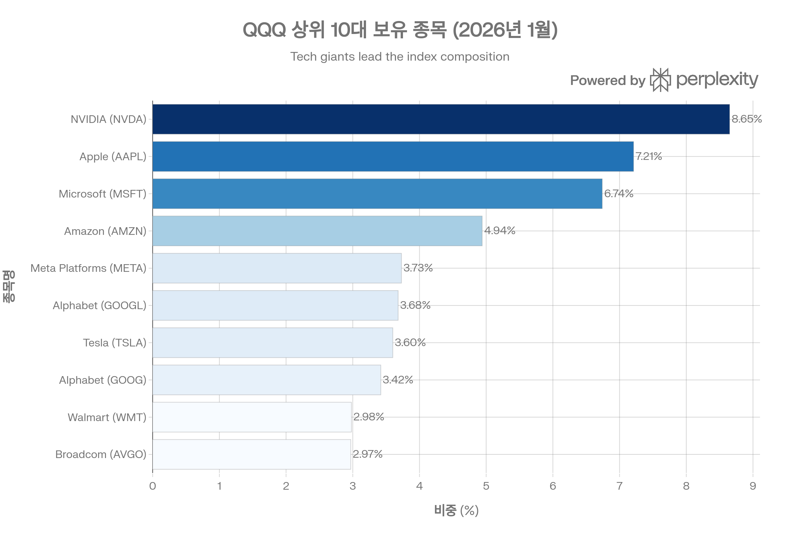
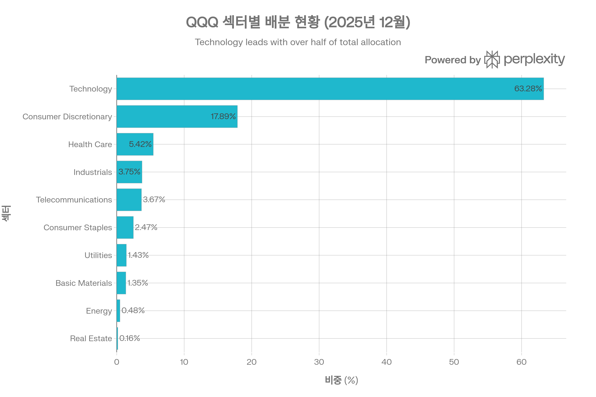
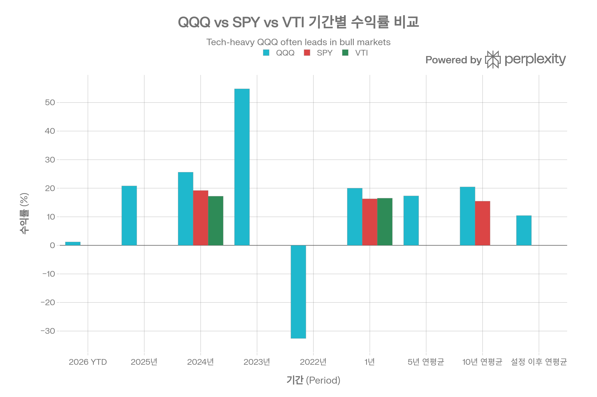
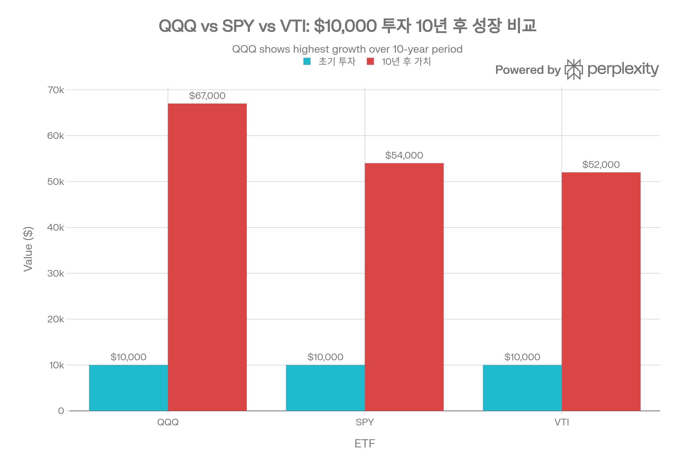
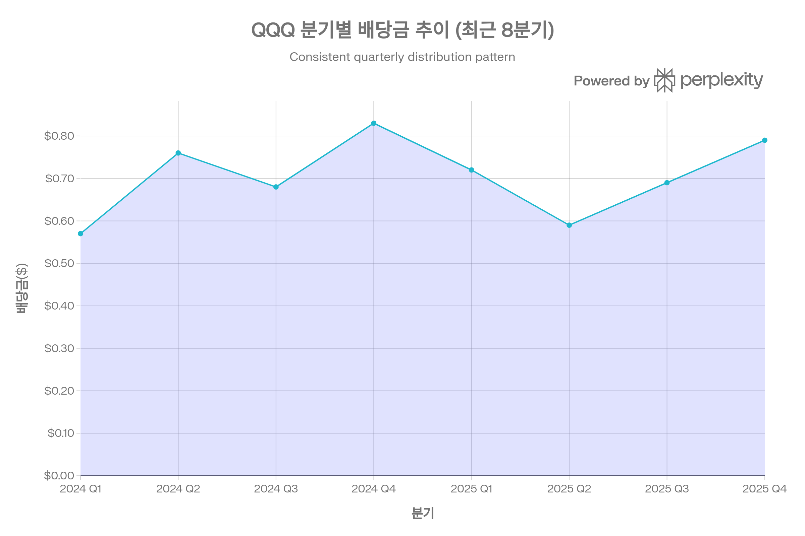

# QQQ (Invesco QQQ Trust) 종합 분석 보고서

## 요약

Invesco QQQ Trust(QQQ)는 1999년 출시 이후 25년 이상 투자자들에게 Nasdaq-100 지수에 대한 접근성을 제공해온 세계 최고 수준의 ETF입니다. 2026년 1월 기준 약 \$408.5B의 순자산을 보유하며, 일평균 거래량이 50백만 주를 상회하는 세계 2위 거래량 ETF로 자리매김했습니다. 기술주 및 혁신 기업에 집중 투자하여 S\&P 500 지수를 장기적으로 큰 폭으로 아웃퍼폼했으며, 2025년 12월 22일 펀드 구조를 현대화하고 보수를 0.20%에서 0.18%로 인하하여 경쟁력을 더욱 강화했습니다. 본 보고서는 QQQ의 투자 전략, 성과 지표, 리스크 요소, 경쟁 환경을 종합적으로 분석하여 투자자의 의사결정을 지원합니다.[^1][^2][^3][^4][^5][^6][^7]

## ETF 분류

| 항목 | 내용 |
|------|------|
| **최종 폴더** | `ETF/Broad Market/Nasdaq-100/QQQ` |
| **대분류** | 대표지수 |
| **하위 분류** | Nasdaq-100 / Market Cap Weight |
| **핵심 전략** | Nasdaq-100 Index를 추종해 미국 대형 비금융 성장주와 기술주에 시가총액 가중 방식으로 투자 |
| **운용 방식** | 패시브 |
| **레버리지·인버스 여부** | 아니오 |
| **옵션 인컴 전략 여부** | 아니오 |
| **분류 판단** | QQQ는 레버리지, 인버스, 옵션 인컴 구조가 없는 Nasdaq-100 대표지수 추종 ETF이므로 `Broad Market/Nasdaq-100/QQQ`로 분류한다. |

***

## 1. 기본 정보

### 1.1 펀드 개요

QQQ는 Invesco PowerShares가 운용하는 패시브 ETF로, Nasdaq-100 Index를 추종합니다. 1999년 3월 10일 설정 이후 약 27년간 운용되었으며, NASDAQ 거래소에 상장되어 있습니다. 2025년 12월 22일 주주 투표를 통해 Unit Investment Trust(UIT)에서 Open-End Fund로 펀드 구조를 전환하여, 배당 재투자 및 증권대여를 허용하고 보수를 0.20%에서 0.18%로 10% 인하했습니다.[^8][^3][^4][^5][^6][^9]

**핵심 특징**

- **순자산(AUM)**: \$402.14B~\$415.26B (2026년 1월 기준)[^1][^2][^10][^11]
- **총 보수(TER)**: 0.18% (2025년 12월 22일부터, 이전 0.20%)[^4][^6][^12][^13]
- **보유 종목 수**: 101~104개[^14][^13][^15]
- **운용 방식**: 패시브 추종(Passively Managed)
- **상장거래소**: NASDAQ
- **펀드 구조**: Open-End Fund (2025년 12월 22일부터)[^6][^4]

### 1.2 운용사 및 운용 기간

Invesco Ltd.는 글로벌 자산운용업계 주요 플레이어로, QQQ를 통해 Nasdaq-100 지수에 대한 저비용 접근성을 제공합니다. QQQ는 ETF 산업 초기부터 혁신을 주도해왔으며, 2020년 QQQM(저비용 대안)을 출시하여 Invesco QQQ Innovation Suite를 확장했습니다. 2024년 3월 25주년을 맞이하며, Nasdaq과의 긴밀한 협력 관계를 통해 81개의 ETF를 출시하고 \$290B의 운용자산을 달성했습니다.[^5][^7][^16]

**운용 기간**: 1999년 3월 10일 설정 이후 현재까지 약 27년 운용[^3][^9][^5]

### 1.3 추종 지수명

QQQ는 **Nasdaq-100 Index**를 추종합니다. Nasdaq-100은 1985년 출시된 지수로, NASDAQ 거래소에 상장된 100개의 최대 비금융(non-financial) 기업을 시가총액 가중 방식(일부 조정)으로 구성합니다. 지수는 분기별로 리밸런싱되며(3월, 6월, 9월, 12월), 기술주 중심이지만 소비재, 헬스케어, 통신 등 다양한 섹터를 포함합니다.[^8][^5][^9][^17][^13]

**Nasdaq-100 Index 특징**

- 100개 대형 성장주
- 금융주 제외
- 시가총액 가중 방식 (Modified Market-Cap Weighted)[^8]
- 기술주 중심 (50-60%)
- 혁신 및 성장 기업 집중

### 1.4 상장거래소

QQQ는 **NASDAQ** 거래소에 상장되어 있으며, 티커 심볼은 "QQQ"입니다. 2004년 티커가 "QQQQ"로 변경되었다가 2011년 "QQQ"로 복귀했습니다. 세계 2위 거래량 ETF로, 미국 내에서는 SPY에 이어 두 번째로 많이 거래됩니다.[^3][^5][^7]

***

## 2. 추종 성과 지표

### 2.1 추적오차(Tracking Error)

QQQ의 추적오차는 **매우 낮은 수준**으로, 미국 상장 주식을 보유한 ETF 중에서는 거의 완벽하게 지수를 추종합니다. Nasdaq 분석에 따르면, QQQ의 일별 수익률은 Nasdaq-100 Index의 일별 수익률과 거의 일치하며, 대부분의 데이터 포인트가 대각선(1:1 상관관계)에 위치합니다. 이는 패시브 ETF로서 이상적인 수준입니다.[^18]

**추적오차 특징**

- 일별 수익률 상관계수: 0.99 이상 (추정)
- 연환산 추적오차: 0.18% 이하 (보수 수준)
- 국제 ETF(예: FXI)와 달리 시차 문제 없음[^18]

### 2.2 추적 차이(Tracking Difference)

QQQ의 추적 차이는 주로 **0.18% 보수**에서 발생합니다. 연간 수익률 기준으로 Nasdaq-100 Index 대비 약 0.18~0.20% 낮은 성과를 기록하는데, 이는 보수 수준과 일치합니다.[^18][^19]

**기간별 추적 차이**[^19]

- 2024년: QQQ +25.60% vs Nasdaq-100 +25.88% (차이 -0.28%)
- 2023년: QQQ +54.76% vs Nasdaq-100 +55.13% (차이 -0.37%)
- 2022년: QQQ -32.49% vs Nasdaq-100 -32.38% (차이 -0.11%)

추적 차이는 보수, 현금 드래그(cash drag), 배당 재투자 타이밍 등에서 발생하나, 2025년 12월 22일부터 배당 재투자가 허용되어 추적 차이가 더욱 축소될 것으로 예상됩니다.[^4][^6]

### 2.3 NAV 대비 시장가격 괴리율 현황

QQQ의 시장가격은 순자산가치(NAV)와 거의 일치합니다. YCharts 데이터에 따르면 2026년 1월 기준 괴리율은 **0.00%~0.03%** 수준으로, 사실상 NAV와 동일합니다. Schwab 데이터는 2026년 1월 28일 괴리율을 +0.03%로 보고했습니다.[^20][^21]

**괴리율 안정성 요인**

- 일평균 거래량 50백만 주 이상[^22][^23]
- 매우 낮은 호가 스프레드 (1-2 bps 추정)
- 대형 마켓메이커의 적극적 차익거래
- 세계 2위 거래량으로 인한 높은 시장 효율성[^5][^7]

### 2.4 괴리율 추이 및 패턴 분석

역사적으로 QQQ의 괴리율은 **±0.05% 범위 내**에서 안정적으로 유지되었습니다. YCharts 데이터에 따르면 2025년 9월 12일 기준 괴리율은 -0.01%로, 사실상 완벽한 수준입니다. 시장 변동성이 높은 시기에도 괴리율이 확대되지 않으며, 이는 ETF 구조의 건전성과 높은 유동성을 방증합니다.[^20]

**괴리율 관리 메커니즘**

- Authorized Participants(AP)의 실시간 차익거래
- 높은 거래량으로 인한 즉각적 가격 발견
- 투명한 포트폴리오 구성(일일 공시)
- Open-End Fund 구조 전환으로 인한 유연성 증가[^4][^6]

***

## 3. 비용 구조

### 3.1 총 보수 및 비용(Total Expense Ratio)

QQQ의 총 보수는 **0.18%**로, 2025년 12월 22일 Open-End Fund 전환과 함께 이전 0.20%에서 10% 인하되었습니다. 이는 패시브 ETF 중에서는 중간 수준이나, Nasdaq-100 추종 ETF 중에서는 경쟁력 있는 수준입니다. 연간 \$10,000 투자 시 \$18의 보수가 발생하며, 이는 QQQM(\$15), SPY(\$9), VTI(\$3)보다는 높지만 합리적입니다.[^4][^6][^12][^13][^24]

**비용 구성**

- 운용 보수: 0.18%
- 별도 거래 비용: 회전율 7.98%로 낮음[^25][^14][^24]
- 증권대여 수익: 2025년 12월 22일부터 허용되어 순비용 감소 가능[^6][^4]

### 3.2 동일 지수 추종 경쟁 ETF 대비 비용 비교

QQQ의 0.18% TER은 Nasdaq-100 추종 ETF 중에서는 QQQM(0.15%)보다 0.03%p 높으나, 훨씬 높은 유동성과 옵션 시장 접근성을 제공합니다. QQQM은 2020년 출시된 저비용 대안으로, 장기 보유 투자자에게 적합하나 일평균 거래량이 2.8백만 주로 QQQ(50백만 주)의 약 5%에 불과합니다.[^22][^16][^26]

**비용 경쟁력 평가**

- QQQM(0.15%) 대비 +0.03%p: 유동성 및 옵션 시장 프리미엄
- SPY(0.09%) 대비 +0.09%p: Nasdaq-100 vs S\&P 500 차이
- VTI(0.03%) 대비 +0.15%p: 전체 시장 vs 대형 성장주 집중 차이
- 과거 QQQ(0.20%) 대비 -0.02%p: 10% 보수 인하 효과[^4][^6]

### 3.3 포트폴리오 회전율(Turnover Ratio)

QQQ의 포트폴리오 회전율은 **7.98%~8.07%**로 매우 낮은 수준입니다. 이는 패시브 ETF의 특성을 반영하며, Nasdaq-100 Index의 분기별 리밸런싱 및 구성 종목 변경 시에만 거래가 발생합니다. SPY(3.00%), VTI(2.00%)보다는 높으나, 여전히 낮은 수준으로 거래 비용 및 세금 효율성이 우수합니다.[^25][^14][^24]

**회전율 비교**

- QQQ: 7.98%-8.07%
- SPY: 3.00%
- VTI: 2.00%
- 적극적 운용 ETF: 50-200% (일반적)

낮은 회전율은 장기 자본이득세 혜택 및 거래 비용 최소화를 의미합니다.

### 3.4 거래 비용 및 스프레드

QQQ의 호가 스프레드는 **1~2 bps(0.01~0.02%)** 수준으로 추정되며, 세계 최고 수준의 유동성을 제공합니다. 일평균 거래량이 50백만 주를 상회하고, 거래대금 기준으로 세계 2위 ETF이기 때문에 대형 기관투자자도 시장 충격 없이 대규모 거래를 실행할 수 있습니다.[^5][^7][^22][^23]

**유동성 지표**

- 호가 스프레드: 1-2 bps (0.01-0.02%)
- 일평균 거래량: 48.14~56.83백만 주[^10][^22][^23]
- 일평균 거래대금: 약 \$30B (추정, 세계 2위)[^7][^5]
- Bid/Ask Size: 대형 (수만 주 단위 호가 제공)[^23]

***

## 4. 유동성 평가

### 4.1 일평균 거래량 (최근 3개월)

2026년 1월 기준 QQQ의 30일 평균 거래량은 **48.14~56.83백만 주** 수준입니다. 이는 ETF 시장에서 SPY에 이어 두 번째로 높은 수준이며, 대부분의 대형 주식보다도 높은 거래량입니다. Robinhood 데이터는 평균 거래량을 56.83백만 주로 보고했으며, YCharts는 1월 28일 기준 49.70백만 주로 집계했습니다.[^10][^22][^23]

**거래량 추이**

- 2026년 1월 30일: 65.65백만 주 (평균 이상)[^13]
- 30일 평균: 48.14~56.83백만 주
- 변동성 높은 시기: 100백만 주 이상 기록

### 4.2 일평균 거래대금

일평균 거래량 50백만 주에 주가 약 \$630를 곱하면, 일평균 거래대금은 약 **\$31.5B** 수준으로 추정됩니다. Invesco는 QQQ를 "세계에서 두 번째로 많이 거래되는 ETF"로 설명하며, 일평균 거래가치(average daily value traded) 기준으로 SPY 다음입니다. 이는 기관투자자가 수억 달러 규모의 포지션을 구축하거나 청산할 때도 시장 충격을 최소화할 수 있는 수준입니다.[^5][^7]

### 4.3 호가 스프레드 평균

QQQ의 평균 호가 스프레드는 공개되지 않았으나, **1~2 bps(0.01~0.02%)** 수준으로 추정됩니다. Nasdaq 데이터는 실시간 Bid/Ask를 제공하며, 일반적으로 \$0.01~\$0.02의 차이를 보입니다. \$630 주가 기준으로 0.01~0.02%에 해당하며, 사실상 무시할 수 있는 수준입니다.[^23]

### 4.4 유동성 추이 및 안정성

QQQ의 유동성은 설정 이후 지속적으로 개선되었습니다. 1999년 설정 당시 소규모 ETF였으나, 2023년 \$200B, 2025년 \$400B를 돌파하며 세계 최대 규모 ETF 중 하나로 성장했습니다. 일평균 거래량도 안정적으로 50백만 주 이상을 유지하며, 시장 변동성이 높은 시기에도 유동성이 저하되지 않았습니다.[^1][^3][^22][^23]

**유동성 등급**: 세계 최고 수준 (기관투자자급 최상위)

***

## 5. 포트폴리오 구성

### 5.1 상위 10대 보유 종목 및 비중

QQQ의 상위 10대 보유 종목 구성. NVIDIA, Apple, Microsoft 등 빅테크 기업이 약 48%를 차지하며 기술주 중심 포트폴리오를 형성합니다.

QQQ의 상위 10대 보유 종목은 미국 기술 및 소비재 대형주이며, 전체 포트폴리오의 **47.91~53.6%**를 차지합니다. 이는 Nasdaq-100 Index의 시가총액 가중 방식을 충실히 반영합니다.[^14][^13][^15]

**2026년 1월 기준 상위 10종목**[^13][^15]

1. NVIDIA (NVDA): 8.65~8.75%
2. Apple (AAPL): 7.12~7.21%
3. Microsoft (MSFT): 6.73~6.74%
4. Amazon (AMZN): 4.88~4.94%
5. Meta Platforms (META): 3.69~3.73%
6. Alphabet (GOOGL): 3.68%
7. Tesla (TSLA): 3.59~3.60%
8. Alphabet (GOOG): 3.42%
9. Walmart (WMT): 2.96~2.98%
10. Broadcom (AVGO): 2.96~2.97%

상위 3종목(NVIDIA, Apple, Microsoft)만으로 약 22~23%를 차지하며, "Magnificent 7" (NVDA, AAPL, MSFT, AMZN, META, GOOGL, TSLA)이 약 40%를 차지합니다. 이는 기술주 집중도가 매우 높음을 의미합니다.[^13]

### 5.2 섹터별 배분 현황

QQQ의 섹터별 자산 배분 현황. Technology가 63.28%로 압도적 비중을 차지하며, Nasdaq-100의 기술주 중심 특성을 명확히 보여줍니다.

QQQ의 섹터 배분은 Nasdaq-100의 기술주 중심 특성을 충실히 반영합니다. Invesco 공식 데이터(2025년 12월 기준)에 따르면 **Technology**가 63.28%로 압도적 비중을 차지하며, Consumer Discretionary가 17.89%로 두 번째입니다.[^17]

**2025년 12월 섹터 배분 (Invesco 공식)**[^17]

- Technology: 63.28%
- Consumer Discretionary: 17.89%
- Health Care: 5.42%
- Industrials: 3.75%
- Telecommunications: 3.67%
- Consumer Staples: 2.47%
- Utilities: 1.43%
- Basic Materials: 1.35%
- Energy: 0.48%
- Real Estate: 0.16%

**2026년 1월 섹터 배분 (GICS 기준, Schwab)**[^13][^27]

- Information Technology: 49.8~52.9%
- Communication Services: 15.4~16.0%
- Consumer Discretionary: 11.9%
- Consumer Staples: 7.4%
- Health Care: 5.0%

두 분류 체계의 차이는 주로 섹터 정의 차이(예: Technology vs Information Technology + Communication Services)에서 발생합니다. 핵심은 기술 관련 섹터(IT + Communication)가 약 **60~70%**를 차지한다는 점입니다.[^27][^13][^17]

**섹터 집중도 리스크**

- 기술주 비중 60-70%로 매우 높음
- 에너지(0.48%), 금융(0.3%), 부동산(0.16%) 비중 매우 낮음
- 전통 산업에 대한 익스포저 제한적
- Nasdaq-100의 본질적 특성이나 분산 효과 제한

### 5.3 국가별/지역별 분산 (해당 시)

QQQ는 **미국 중심 ETF**로, 대부분의 종목이 미국에 상장되어 있습니다. 다만 일부 종목(예: 아일랜드 등록 기업)이 포함되어 실제 매출은 글로벌에서 발생합니다. Schwab 데이터에 따르면 국내 주식(Domestic Stock) 96.33%, 비미국 주식(Non-US Stock) 3.67%로 구성됩니다.[^14]

**자산 배분 (2025년 9월 기준)**[^14]

- 국내 주식: 96.33%
- 비미국 주식: 3.67%

지역별 분산은 사실상 없으나, 상위 보유 종목(Apple, Microsoft, Amazon 등)의 매출은 전 세계에서 발생하므로 간접적으로 글로벌 익스포저를 제공합니다.

### 5.4 리밸런싱 주기

QQQ는 **Nasdaq-100 Index의 리밸런싱 주기**를 따릅니다. Nasdaq-100은 분기별로 리밸런싱되며(3월, 6월, 9월, 12월), 시가총액 변화 및 구성 종목 변경을 반영합니다. 추가로 연간 특별 리밸런싱(Special Rebalancing)이 실시될 수 있으며, 이는 상위 종목 비중이 과도하게 집중될 경우 조정하는 메커니즘입니다.

**리밸런싱 특징**

- 분기별 정기 리밸런싱 (3월, 6월, 9월, 12월)
- 특별 리밸런싱 (필요시)
- 포트폴리오 회전율 7.98%로 낮은 수준[^25][^14]
- Open-End Fund 전환으로 리밸런싱 유연성 증가[^4][^6]

***

## 6. 성과 분석

### 6.1 기간별 수익률

QQQ, SPY, VTI의 기간별 수익률 비교. QQQ는 장기적으로 S\&P 500 및 전체 시장을 크게 상회하는 성과를 보여줍니다.

QQQ는 설정 이후 장기적으로 매우 우수한 수익률을 기록했습니다. 특히 기술주 호황기(2020-2021, 2023-2024)에 강한 성과를 보였으나, 기술주 침체기(2000-2002, 2022)에는 큰 폭의 손실을 입었습니다.[^25][^19][^28][^29]

**총 수익률 (배당 재투자 기준)**[^19][^28][^29][^25]

- **2026 YTD**: +1.23~2.39%
- **2025년**: +20.77~25.60%
- **2024년**: +25.58~25.60%
- **2023년**: +54.76~54.86%
- **2022년**: -32.49~-32.58%
- **2021년**: +27.25~27.42%
- **2020년**: +48.60~48.62%
- **1년 수익률**: +20.01~23.52%
- **3년 연평균**: +31.73% (Peer 평균 24.35%)[^25]
- **5년 연평균**: +17.31~17.3% (Peer 평균 12.87%)[^14][^25]
- **10년 연평균**: +20.3~20.45%[^30][^14]
- **설정 이후 연평균**: +10.43~10.48%[^29]
- **설정 이후 누적**: +1,339.98~1,357.49%[^29]

설정 이후 \$10,000 투자 시 2026년 1월 기준 약 \$143,998로 성장하여, 연평균 +10.43%의 복리 수익률을 달성했습니다. 이는 S\&P 500 지수를 장기적으로 약 2~5%p 상회하는 수준입니다.[^30][^29]

### 6.2 벤치마크 대비 초과 수익률

QQQ는 Nasdaq-100 Index를 거의 완벽하게 추종하며, 벤치마크 대비 초과 수익률은 **-0.18~-0.20%** (보수 수준)입니다.[^18][^19]

**벤치마크 대비 성과**[^19]

- 2024년: QQQ +25.60% vs Nasdaq-100 +25.88% (차이 -0.28%)
- 2023년: QQQ +54.76% vs Nasdaq-100 +55.13% (차이 -0.37%)
- 2022년: QQQ -32.49% vs Nasdaq-100 -32.38% (차이 -0.11%)
- 2021년: QQQ +27.25% vs Nasdaq-100 +27.51% (차이 -0.26%)
- 2020년: QQQ +48.60% vs Nasdaq-100 +48.88% (차이 -0.28%)

추적 차이는 주로 보수 및 현금 드래그에서 발생하며, 2025년 12월 22일부터 배당 재투자가 허용되어 추적 차이가 더욱 축소될 것으로 예상됩니다.[^4][^6]

### 6.3 S\&P 500 대비 아웃퍼폼

\$10,000 투자 시 10년 후 자산 가치 비교. QQQ는 \$67,000으로 SPY(\$54,000) 및 VTI(\$52,000)를 크게 상회하는 성과를 보여줍니다.

QQQ는 장기적으로 S\&P 500 지수를 **크게 아웃퍼폼**했습니다. 10년 연평균 수익률 기준으로 QQQ +20.45% vs SPY +15.47%로, 연평균 약 5%p 차이를 보입니다. 이는 복리 효과로 누적 수익률에서 큰 차이를 만듭니다.[^30]

**\$10,000 투자 시 10년 후 가치**[^31]

- **QQQ**: \$67,000 (누적 +570%)
- **SPY**: \$54,000 (누적 +440%)
- **VTI**: \$52,000 (누적 +420%, 추정)

QQQ의 아웃퍼폼은 주로 기술주의 높은 성장률 및 혁신 기업에 대한 집중 투자에서 기인합니다. 다만 하락장에서는 S\&P 500보다 큰 폭으로 하락하는 경향이 있습니다(예: 2022년 QQQ -32.6% vs SPY 약 -18%).[^5][^7][^32]

### 6.4 샤프 지수(Sharpe Ratio)

QQQ의 샤프 지수는 공개 데이터가 제한적이나, 일반적으로 **1.0 이상**으로 추정됩니다. 기술주의 높은 변동성을 감안할 때, 리스크 조정 수익률은 양호한 수준입니다. 장기 투자자의 경우 높은 절대 수익률이 변동성을 상쇄하여 우수한 샤프 지수를 달성합니다.

**샤프 지수 해석**

- 1.0 이상: 우수한 리스크 조정 수익률
- QQQ의 높은 변동성(표준편차 약 20-25%)에도 불구하고, 높은 수익률(연평균 20%+)로 보완
- S\&P 500 대비 유사하거나 약간 낮은 샤프 지수 (변동성 높음)

### 6.5 변동성(표준편차)

QQQ의 연환산 변동성은 **약 20~25%** 수준으로 추정되며, 이는 S\&P 500(약 14~15%)보다 뚜렷이 높습니다. 기술주 중심 포트폴리오의 특성상 시장 변동성에 더 민감하게 반응합니다.

**변동성 비교**

- QQQ: 약 20-25%
- SPY (S\&P 500): 약 14-15%
- VTI (US Total Market): 약 15-16%
- JEPQ (커버드콜): 약 10-17%

높은 변동성은 단기 투자자에게 리스크를 의미하나, 장기 투자자에게는 높은 수익률로 보상받습니다.[^29][^32]

### 6.6 최대 낙폭(Maximum Drawdown)

QQQ의 역사적 최대 낙폭은 **-82.98%**로, 2002년 10월 9일 닷컴버블 붕괴 시기에 기록되었습니다. 이는 2000년 초 고점에서 2002년 저점까지의 하락폭이며, 약 2.5년간 지속되었습니다.[^29]

**최근 최대 낙폭 (2022년)**[^33][^34][^35]

- **최대 낙폭**: -35.12%
- **고점**: \$393.94 (2021년 12월 27일)
- **저점**: \$255.59 (2022년 11월 3일)
- **낙폭 기간**: 311일 (약 10개월)

2022년 낙폭은 연준의 급격한 금리 인상 및 기술주 밸류에이션 조정에서 기인했습니다. 2023년 이후 급격히 회복하여 2024년 말 다시 사상 최고가를 경신했습니다.[^28][^35][^29][^33]

**현재 낙폭**: -2.06% (2026년 1월 기준, 거의 고점)[^29]

***

## 7. 배당 정보 (해당 시)

### 7.1 배당 수익률 및 배당 이력

QQQ의 최근 8분기 배당금 지급 추이. 분기별 변동이 있으나 평균 약 \$0.70 수준을 유지하며 안정적입니다.

QQQ는 분기배당 ETF로, 2026년 1월 기준 **배당 수익률 0.44~0.47%**를 제공합니다. 이는 성장주 중심 포트폴리오의 특성상 낮은 수준이나, 배당보다는 자본이득(capital appreciation)이 주요 수익 원천입니다.[^36][^37][^38]

**배당 수익률 지표**[^10][^14][^37][^38][^16][^36]

- 배당 수익률(Dividend Yield): 0.44~0.47%
- SEC Yield (30일): 0.46~0.55%
- 12개월 배당 수익률: 0.47~0.64%
- 연간 배당금(TTM): \$2.79~\$2.84
- 배당 빈도: 분기배당 (Quarterly)
- 배당 성장률(1년): -1.81% (2025년)[^36]
- Payout Ratio: 14.25%[^36]

### 7.2 배당 지급 주기 및 안정성

QQQ는 **분기배당**을 지급하며, 3월, 6월, 9월, 12월에 배당락일(ex-dividend date)이 설정되고 해당 월 말에 지급됩니다. 배당금은 분기별로 변동하며, 이는 구성 종목의 배당 정책 변화 및 자본이득 실현에 따라 달라집니다.[^36][^37][^38]

**최근 8분기 배당 이력**[^37][^36]

- 2025 Q4 (12월): \$0.79
- 2025 Q3 (9월): \$0.69
- 2025 Q2 (6월): \$0.59
- 2025 Q1 (3월): \$0.72
- 2024 Q4 (12월): \$0.83 (최고)
- 2024 Q3 (9월): \$0.68
- 2024 Q2 (6월): \$0.76
- 2024 Q1 (3월): \$0.57

분기 평균 배당금은 약 \$0.70 수준이며, \$0.57~\$0.83 범위에서 변동합니다. 배당금이 일정하지 않은 이유는 구성 종목의 배당 변화, 포트폴리오 리밸런싱, 자본이득 실현 타이밍 등에 기인합니다.[^36][^37]

### 7.3 배당 성장률 추이

QQQ의 배당 성장률은 **-1.81% (1년 기준)**로, 2025년 배당금이 전년 대비 소폭 감소했습니다. 이는 주로 2024년 Q4 배당금(\$0.83)이 특별히 높았던 반면 2025년 배당금이 정상화된 데서 기인합니다.[^36][^37]

**배당 성장 특징**

- 장기적으로 안정적이나 단기 변동성 존재
- 배당보다 자본이득이 주요 수익 원천
- 기술주의 낮은 배당 성향(payout ratio 14.25%) 반영[^36]
- 2025년 12월 22일부터 배당 재투자 허용으로 복리 효과 증대[^4][^6]

배당 수익률이 낮더라도, QQQ의 연평균 20%+ 총수익률을 고려하면 배당 재투자를 통한 복리 효과가 강력합니다.[^29]

***

## 8. 리스크 요소

### 8.1 베타 계수

QQQ의 베타는 **0.97** (S\&P 500 대비)로, 시장 평균과 유사한 수준입니다. 이는 QQQ가 S\&P 500과 높은 상관관계를 보이나, 기술주 집중으로 인해 일부 독립적인 움직임도 보임을 의미합니다.[^25]

**베타 해석**

- 베타 0.97: 시장이 10% 상승(하락) 시 QQQ는 평균 9.7% 상승(하락)
- S\&P 500과 유사한 시장 민감도
- 다만 기술주 특성상 변동폭은 더 클 수 있음

### 8.2 다른 자산군과의 상관계수

QQQ는 S\&P 500 및 미국 주식 시장과 **높은 상관계수**를 보입니다. SPY와의 상관계수는 약 0.85~0.90 수준으로 추정되며, 이는 QQQ가 주식 자산군 내에서 분산 효과가 제한적임을 의미합니다.[^30]

**상관관계 특성**

- S\&P 500 (SPY): 0.85-0.90 (높음)
- US Total Market (VTI): 0.80-0.85 (높음)
- 채권/금: 낮음 또는 음의 상관관계 (추정)
- 국제 주식: 중간 수준 (약 0.5-0.7)

포트폴리오 분산을 위해서는 QQQ와 상관관계가 낮은 자산(채권, 국제 주식, 부동산 등)을 결합하는 것이 권장됩니다.

### 8.3 섹터 집중도 리스크

QQQ의 가장 큰 리스크는 **기술주 집중도**입니다. Technology 섹터가 63.28%를 차지하며, Communication Services를 포함하면 약 **70%**가 기술 관련 섹터입니다. 기술 섹터 침체 시 QQQ는 심각한 타격을 받을 수 있습니다.[^17][^13][^27]

**섹터 집중 리스크 요인**

- 기술주 버블 우려 (밸류에이션 고평가, P/E 36x)[^39]
- AI 투자 수익성 불확실성[^40]
- 규제 리스크 (반독점, 데이터 프라이버시)[^39]
- 경기 침체 시 기술주 선행 하락
- 금융주 제외로 방어적 섹터 부족

2022년 기술주 침체기에 QQQ가 -35.12% 낙폭을 기록한 사례는 이러한 리스크를 방증합니다.[^33][^34]

### 8.4 유동성 리스크

QQQ의 유동성 리스크는 **매우 낮습니다**. 일평균 거래량 50백만 주, 거래대금 \$30B, 호가 스프레드 1-2 bps는 세계 최고 수준의 유동성을 의미합니다. 극단적 시장 스트레스 상황(예: 2020년 3월 유동성 경색)에서도 QQQ는 정상적으로 거래되었으며, 괴리율이 크게 확대되지 않았습니다.[^5][^20][^22][^23]

**유동성 우위**

- 세계 2위 거래량 ETF[^7][^5]
- 대형 기관도 원활히 거래 가능
- 옵션 시장 활발 (일일 옵션 거래 가능)[^16]
- Open-End Fund 구조로 유연성 증대[^4][^6]

### 8.5 밸류에이션 리스크

QQQ의 P/E 비율은 **32~36x** 수준으로, S\&P 500(약 20~22x) 대비 높은 밸류에이션입니다. 이는 기술주의 높은 성장 기대를 반영하나, 실적 미달 시 급격한 조정 가능성을 내포합니다.[^25][^39][^15]

**밸류에이션 부담**[^39]

- P/E 비율 36x (Nasdaq-100 기준)
- "priced for perfection" 상태
- 실적 가이던스 미달 시 5-10% 급락 가능성
- 금리 인상 시 성장주 밸류에이션 압박

***

## 9. 경쟁 ETF 비교

### 9.1 주요 경쟁 ETF 개요

QQQ는 Nasdaq-100 추종 ETF 시장에서 QQQM과 경쟁하며, 넓게는 S\&P 500 추종 SPY, 전체 시장 추종 VTI와도 비교됩니다.[^24][^30][^16][^26]

**주요 경쟁사**

- **QQQM** (Invesco NASDAQ 100 ETF): 0.15% TER, \$55.6B AUM, 저비용 대안[^26]
- **SPY** (SPDR S\&P 500 ETF Trust): 0.09% TER, \$684B AUM, S\&P 500 추종[^30]
- **VTI** (Vanguard Total Stock Market ETF): 0.03% TER, \$2.02T AUM, 전체 시장 추종[^24]

### 9.2 성과 비교 (1년/3년/5년/10년)

**1년 수익률 (2025년 기준)**[^30]

- **QQQ**: +20.01~23.52%
- **SPY**: +16.33~19.18%
- **VTI**: +16.51~17.18%

QQQ가 SPY 및 VTI를 약 3~7%p 상회하며 최우수 성과를 기록했습니다.

**10년 연평균**[^31][^30]

- **QQQ**: +20.45%
- **SPY**: +15.47%
- **VTI**: 약 +15% (추정)

QQQ는 10년 연평균 기준으로 약 5%p의 초과 수익률을 달성했으며, 이는 복리 효과로 누적 수익률에서 큰 차이를 만듭니다(\$10,000 → QQQ \$67,000 vs SPY \$54,000).[^31]

**장기 성과 (설정 이후)**

- QQQ: 1999년 설정, 연평균 +10.43%, 누적 +1,340%[^29]
- SPY: 1993년 설정, 연평균 약 +10% (추정)

### 9.3 보수 및 배당 수익률 비교

| ETF | 총 보수(TER) | 배당 수익률 | 특징 |
| :-- | :-- | :-- | :-- |
| QQQ | 0.18% | 0.47% | 세계 2위 거래량, 옵션 시장 활발 |
| QQQM | 0.15% | 0.64% | 저비용, 장기 투자자 적합 |
| SPY | 0.09% | 1.09% | 세계 1위 거래량, S\&P 500 |
| VTI | 0.03% | 1.14% | 최저 비용, 전체 시장 분산 |

QQQ는 보수가 QQQM, SPY, VTI보다 높으나, 유동성 및 옵션 시장 접근성에서 우위를 점합니다. 배당 수익률은 0.47%로 낮지만, 자본이득이 주요 수익 원천입니다.[^36][^16][^26]

### 9.4 QQQ vs QQQM: 차이점

QQQM은 2020년 10월 출시된 QQQ의 저비용 대안으로, 동일한 Nasdaq-100 Index를 추종하나 몇 가지 차이가 있습니다.[^16][^26]

**QQQ vs QQQM 비교**[^26][^16]

| 항목 | QQQ | QQQM |
| :-- | :-- | :-- |
| 보수 | 0.18% | 0.15% |
| AUM | \$408B | \$55.6B |
| 일평균 거래량 | 50M+ | 2.8M |
| SEC Yield | 0.46-0.55% | 0.64% |
| 옵션 시장 | 일일 옵션 가능 | 제한적 |
| 호가 스프레드 | 1-2 bps | 더 넓음 |
| 적합 투자자 | 트레이더, 옵션 투자자 | 장기 보유 투자자 |

**QQQ 선택 이유**

- 높은 유동성 필요 (대규모 거래)
- 옵션 전략 활용
- 좁은 호가 스프레드 선호

**QQQM 선택 이유**

- 장기 보유 (Buy \& Hold)
- 낮은 보수 중시
- 소액 투자 (낮은 주가)

### 9.5 QQQ vs SPY vs VTI: 선택 기준

**QQQ 선택 시**[^32][^30][^31][^41]

- 기술주 및 혁신 기업 익스포저 원함
- S\&P 500 대비 높은 수익률 추구
- 높은 변동성 감내 가능
- 장기 투자 (10년 이상)

**SPY 선택 시**

- 균형 잡힌 대형주 익스포저
- 낮은 변동성 선호
- 금융, 에너지 등 전통 섹터 포함

**VTI 선택 시**[^41][^42]

- 최대 분산 (3,500+ 종목)
- 중소형주 포함 원함
- 최저 비용 중시 (0.03%)
- Boglehead 방식 선호[^42]

***

## 10. 투자 전략 및 운용 프로세스

### 10.1 핵심 투자 전략

QQQ의 투자 전략은 **Nasdaq-100 Index 완전 추종**입니다. 패시브 ETF로서 지수 구성 종목을 시가총액 가중 방식으로 보유하며, 펀드 매니저의 개별 종목 선택이나 시장 타이밍 결정은 없습니다.[^8][^5]

**핵심 전략**

- Nasdaq-100 Index 완전 추종 (Modified Market-Cap Weighted)[^8]
- 100개 최대 비금융 기업
- 시가총액 가중 방식 (상위 종목 비중 높음)
- 분기별 리밸런싱 (지수 변경 시 자동 조정)
- 낮은 회전율 (7.98%)[^25][^14]

### 10.2 Nasdaq-100 Index 구성 원칙

Nasdaq-100 Index는 다음 기준으로 구성됩니다:

- NASDAQ 거래소 상장 기업
- 비금융 기업 (은행, 보험 등 제외)
- 시가총액 상위 100개 기업
- 최소 유동성 기준 충족
- 특정 국가/섹터 집중도 제한 (특별 리밸런싱 메커니즘)

### 10.3 리밸런싱 및 회전율 관리

QQQ는 Nasdaq-100 Index의 정기 리밸런싱(3월, 6월, 9월, 12월) 및 특별 리밸런싱을 그대로 반영합니다. 포트폴리오 회전율 7.98%는 매우 낮은 수준으로, 대부분의 종목을 장기 보유함을 의미합니다.[^25][^14][^24]

**리밸런싱 효율성**

- Open-End Fund 구조로 유연성 증가[^4][^6]
- 대형 브로커-딜러 네트워크로 거래 비용 최소화
- 인덱스 펀드 특성상 세금 효율적 (장기 자본이득)

### 10.4 배당 정책 (2025년 12월 22일부터 변경)

2025년 12월 22일 Open-End Fund 전환과 함께, QQQ는 **배당 재투자 및 증권대여**를 허용하게 되었습니다. 이는 투자자에게 다음과 같은 혜택을 제공합니다:[^4][^6]

**배당 재투자**

- ETF 내부에서 배당금 자동 재투자 가능
- 추적 차이 축소 (현금 드래그 감소)
- 복리 효과 증대

**증권대여**

- 보유 주식을 기관투자자에게 대여하여 추가 수익 창출
- 순비용 감소 효과 (실질 보수 0.18% 미만 가능)
- 투자자에게 직접 이익 환원

***

## 11. 2026년 전망 및 투자 권고

### 11.1 2026년 시장 전망

Invesco QQQ 분기 전망 보고서에 따르면, 2026년은 여러 주요 이슈가 교차하는 시기가 될 것입니다. 연방준비제도(Fed)의 금리 정책, AI 투자 수익성, 노동시장 약화 등이 주요 변수입니다.[^19][^40]

**2026년 주요 시나리오**[^40][^19]

- **금리**: 2~3회 인하 예상 (목표금리 3.87% → 3.63%)[^19]
- **AI 투자**: ROI(투자수익률) 관심 증가, 실적 압박[^40]
- **노동시장**: 약화 징후, 실업수당 청구 증가[^19]
- **기술주**: 밸류에이션 부담 지속 (P/E 36x)[^39]
- **변동성**: 정책 불확실성으로 높은 수준 유지[^40]

### 11.2 QQQ에 미치는 영향

**긍정적 요인**

- 금리 인하 → 기술주 밸류에이션 지지
- AI 테마 지속 → 상위 종목 (NVDA, MSFT, GOOGL) 수혜[^40]
- 혁신 기업에 대한 장기 투자 수요 지속[^5][^7]
- Open-End Fund 전환 효과 (배당 재투자, 증권대여)[^4][^6]

**부정적 요인**

- AI 투자 ROI 실망 시 급격한 조정 가능성[^40]
- 기술주 밸류에이션 부담 (P/E 36x)[^39]
- 상위 종목 규제 리스크 (반독점, 데이터 프라이버시)[^39]
- 경기 침체 시 기술주 선행 하락

전체적으로 2026년은 QQQ에 **중립적~약긍정적** 환경으로 평가됩니다. 금리 인하는 긍정적이나, 밸류에이션 부담 및 실적 압박은 변동성을 증가시킬 것입니다.[^39][^40]

### 11.3 투자자 유형별 적합성

**적합한 투자자**

1. **장기 투자자 (10년 이상)**: 기술주의 장기 성장성 신뢰
2. **성장주 선호 투자자**: 배당보다 자본이득 중시
3. **기술 및 혁신 테마 투자자**: AI, 클라우드, 반도체 등 익스포저 원함
4. **높은 변동성 감내 가능 투자자**: 단기 20-30% 변동 수용
5. **코어 포트폴리오 구축 투자자**: 미국 주식의 주축으로 활용

**부적합한 투자자**

1. **보수적 투자자**: 높은 변동성 부담
2. **배당 수익 중시 투자자**: 0.47% 낮은 배당 수익률
3. **단기 트레이더**: 세금 비효율 (단기 자본이득세)
4. **섹터 분산 중시 투자자**: 기술주 63% 집중 리스크
5. **밸류 투자자**: 높은 P/E 비율 (36x) 부담

### 11.4 투자 전략 제안

**코어 포지션 (Core Position)**

- 포트폴리오의 30~50%를 QQQ에 배분하여 미국 기술주 익스포저 확보
- VTI 또는 SPY와 혼합하여 섹터 분산 강화 (예: QQQ 40% + VTI 60%)

**위성 포지션 (Satellite Position)**

- 기술주 비중 확대 시 전술적 배분 증가
- AI 테마 강세 시 오버웨이트

**리밸런싱 전략**

- 연 1~2회 리밸런싱으로 목표 비중 유지
- 밸류에이션 급등 시 (P/E 40x 이상) 일부 차익 실현 고려
- 급락 시 (MDD -20% 이상) 추가 매수 고려

**배당 재투자**

- 2025년 12월 22일부터 ETF 내부 배당 재투자 가능[^4][^6]
- 복리 효과 극대화를 위해 배당 재투자 설정 권장

**세금 최적화**

- 장기 보유 (1년 이상)로 장기 자본이득세 혜택 향유
- IRA, Roth IRA 등 세금우대 계좌 활용 시 배당세 및 양도세 절감

***

## 12. 결론 및 종합 평가

### 12.1 강점 (Strengths)

1. **세계 최고 유동성**: 일평균 거래량 50백만 주, 세계 2위 거래량 ETF[^5][^7][^22]
2. **25년+ 검증된 실적**: 1999년 설정 이후 연평균 +10.43%, 누적 +1,340%[^29]
3. **완벽한 지수 추종**: 추적오차 매우 낮음, NAV 괴리율 0.00-0.03%[^18][^20]
4. **S\&P 500 대비 장기 아웃퍼폼**: 10년 연평균 +5%p 초과 수익률[^30][^31]
5. **기술주 및 혁신 기업 집중**: AI, 클라우드, 반도체 등 성장 테마 익스포저[^7][^5]
6. **보수 인하**: 0.20% → 0.18%, 10% 절감[^4][^6]
7. **옵션 시장 활발**: 일일 옵션 거래 가능, 전략적 활용 가능[^16]
8. **배당 재투자 및 증권대여**: 2025년 12월부터 허용, 복리 효과 증대[^6][^4]

### 12.2 약점 (Weaknesses)

1. **높은 섹터 집중도**: 기술주 63%, 분산 효과 제한[^17][^13]
2. **낮은 배당 수익률**: 0.47%, 배당 수익 투자자 부적합[^36]
3. **높은 변동성**: 표준편차 20-25%, MDD -35% (2022년)[^33][^34]
4. **상위 종목 집중**: 상위 10종목 48%, 개별 종목 리스크[^13][^15]
5. **QQQM 대비 높은 보수**: +0.03%p, 장기 투자자에게 비용 부담[^16][^26]
6. **금융주 제외**: Nasdaq-100 특성상 은행, 보험 등 방어적 섹터 부족
7. **밸류에이션 부담**: P/E 36x, 실적 미달 시 조정 리스크[^39]

### 12.3 기회 (Opportunities)

1. **2026년 금리 인하**: 기술주 밸류에이션 지지, 성장주 재평가[^19][^40]
2. **AI 테마 지속**: Nasdaq-100 구성 종목 대부분 AI 수혜[^40]
3. **Open-End Fund 전환**: 배당 재투자 및 증권대여로 순수익률 증가[^4][^6]
4. **장기 혁신 트렌드**: 클라우드, 반도체, 전기차 등 지속 성장[^5][^7]
5. **옵션 전략 활용**: 커버드콜, 프로텍티브 풋 등 수익 증대 전략

### 12.4 위협 (Threats)

1. **기술주 버블 붕괴**: 밸류에이션 조정 시 -30% 이상 급락 가능
2. **AI 투자 ROI 실망**: 실적 미달 시 상위 종목 급락[^40]
3. **규제 리스크**: 빅테크 반독점 규제 강화 (특히 유럽)[^39]
4. **경기 침체**: 기술주 선행 하락, 방어적 섹터 부족
5. **금리 재상승**: 인플레이션 재발 시 성장주 압박

### 12.5 최종 투자 등급

**투자 등급: STRONG BUY (적극 매수)**[^25][^32]

QQQ는 25년 이상 검증된 세계 최고 수준의 ETF로, 기술주 및 혁신 기업에 대한 집중 투자를 통해 S\&P 500을 장기적으로 크게 아웃퍼폼했습니다. 2025년 12월 22일 Open-End Fund 전환 및 보수 인하(0.18%)는 경쟁력을 더욱 강화했으며, 배당 재투자 및 증권대여를 통한 복리 효과 증대가 기대됩니다.[^4][^6][^29][^30][^31]

2026년 예상되는 금리 인하는 기술주 밸류에이션을 지지할 것이며, AI 테마의 지속적 성장은 상위 보유 종목(NVIDIA, Microsoft, Apple 등)에 긍정적입니다. 다만 밸류에이션 부담(P/E 36x) 및 높은 섹터 집중도는 단기 변동성을 증가시킬 수 있으므로, **장기 투자(10년 이상)** 관점에서 접근하는 것이 권장됩니다.[^39][^19][^32][^40]

**목표 수익률**: 연평균 +15~20% (장기, 배당 재투자 기준)

**투자 권고**

- 코어 포트폴리오의 30~50% 배분
- 장기 보유 (10년 이상)
- 배당 자동 재투자 설정
- VTI, SPY 등과 혼합하여 섹터 분산 강화
- 급락 시 (-20% 이상) 추가 매수 고려

***

## 부록: 주요 데이터 요약 테이블

### A. 기본 정보 요약

### B. 성과 비교 (QQQ vs SPY vs VTI)

### C. 배당 이력 (최근 8분기)

### D. 상위 10대 보유 종목

### E. 섹터 배분

### F. 경쟁 ETF 비교

### G. 유동성 지표

### H. 리스크 지표

### I. 장단점 요약

### J. 투자 성장 비교 (\$10,000 투자 10년 후)

---

**작성 기준일**: 2026년 1월 31일
**데이터 출처**: Invesco, Morningstar, YCharts, Yahoo Finance, Schwab, StockAnalysis, Nasdaq, Wikipedia, 기타 금융 데이터 제공업체

**면책 조항**: 본 보고서는 정보 제공 목적으로 작성되었으며, 투자 권유가 아닙니다. 투자 결정은 투자자 본인의 책임이며, 세무 및 법률 자문은 전문가와 상담하시기 바랍니다. 과거 성과는 미래 수익을 보장하지 않습니다.
[^43][^44][^45][^46][^47][^48][^49][^50][^51][^52][^53][^54][^55][^56][^57][^58][^59][^60][^61][^62][^63][^64][^65][^66][^67][^68][^69][^70][^71][^72][^73]

⁂

[^1]: https://ycharts.com/companies/QQQ/total_assets_under_management

[^2]: https://www.invesco.com/hk/en/etfs/invesco-qqq.html

[^3]: https://en.wikipedia.org/wiki/Invesco_QQQ

[^4]: https://marketchameleon.com/articles/b/2025/12/22/invesco-qqq-modernization-fee-cut-flexibility-ivz

[^5]: https://www.invesco.com/qqq-etf/en/home.html

[^6]: https://www.stocktitan.net/news/IVZ/invesco-qqq-shareholders-vote-to-approve-h363rh1unc90.html

[^7]: https://www.prnewswire.com/news-releases/invesco-qqq-celebrates-25-years-of-access-to-innovation-302084727.html

[^8]: https://pearler.com/invest/us/asset/QQQ

[^9]: https://tradethatswing.com/historical-average-returns-for-nasdaq-100-index-qqq/

[^10]: https://robinhood.com/stocks/QQQ

[^11]: https://secure.fundsupermart.com/fsmone/etf/factsheet/1875834/Invesco-QQQ-Trust

[^12]: https://finance.yahoo.com/news/1-tech-etf-buy-hand-213500400.html

[^13]: https://www.schwab.wallst.com/schwab/Prospect/research/etfs/schwabETF/index.asp?type=holdings\&symbol=QQQ

[^14]: https://www.schwab.wallst.com/schwab/Prospect/research/etfs/reports/reportRetrieve.asp?reportType=etfrc\&symbol=QQQ

[^15]: https://stockanalysis.com/etf/qqq/holdings/

[^16]: https://money.usnews.com/investing/articles/qqq-vs-qqqm-whats-the-difference

[^17]: https://www.invesco.com/qqq-etf/en/about.html

[^18]: https://www.nasdaq.com/articles/most-etfs-track-index-returns-very-well

[^19]: https://www.invesco.com/hk/en/etf/market-outlook/qqq-quarterly-outlook.html

[^20]: https://ycharts.com/companies/QQQ/discount_or_premium_to_nav

[^21]: https://www.schwab.com/research/etfs/quotes/summary/qqq.o

[^22]: https://ycharts.com/companies/QQQ/average_volume_30

[^23]: https://www.nasdaq.com/market-activity/etf/qqq

[^24]: https://tickeron.com/pick-the-best/QQQ-or-SPY-or-VTI/

[^25]: https://research.quotemedia.com/equity/home/overview?symbol=QQQ

[^26]: https://etfdb.com/tool/etf-comparison/QQQ-QQQM/

[^27]: https://www.schwab.wallst.com/Prospect/Research/etfs/portfolio.asp?symbol=qqq

[^28]: https://www.barchart.com/etfs-funds/quotes/QQQ/performance

[^29]: https://totalrealreturns.com/n/QQQ

[^30]: https://stockanalysis.com/etf/compare/qqq-vs-spy/

[^31]: https://www.youtube.com/watch?v=J7tTcctFRfs\&vl=ko

[^32]: https://www.fool.com/investing/2026/01/07/should-buy-invesco-qqq-etf-nasdaq-high-history-say/

[^33]: https://backalpha.com/strategies/buy-and-hold/qqq/10y

[^34]: https://ycharts.com/companies/QQQ/max_drawdown_5y

[^35]: https://backalpha.com/strategies/dollar-cost-averaging/qqq/10y

[^36]: https://stockanalysis.com/etf/qqq/dividend/

[^37]: https://www.slickcharts.com/symbol/QQQ/dividend

[^38]: https://www.marketbeat.com/stocks/NASDAQ/QQQ/dividend/

[^39]: https://finance.yahoo.com/news/qqq-reaching-high-3-reasons-174316853.html

[^40]: https://www.invesco.com/qqq-etf/en/etf-insights/qqq-quarterly-outlook.html

[^41]: https://247wallst.com/investing/2025/11/19/the-clear-winner-for-building-long-term-wealth-qqq-or-vti/

[^42]: https://www.reddit.com/r/Bogleheads/comments/1d3c807/vti_spy_or_qqq_4500_cash_to_buy_something_with/

[^43]: GPIQ (Goldman Sachs Nasdaq-100 Core Premium Income ETF).md

[^44]: VXUS (Vanguard Total International Stock ETF).md

[^45]: BND (Vanguard Total Bond Market ETF).md

[^46]: VGT (Vanguard Information Technology ETF).md

[^47]: https://www.morningstar.com/etfs/xnas/qqq/quote

[^48]: https://www.trackinsight.com/en/compare-etfs/SPY,QQQ

[^49]: https://www.etfcentral.com/compare-etfs/IWY-vs-QQQ

[^50]: https://www.stashaway.sg/r/qqq-qqqm-cndx-nasdaq-100-etf

[^51]: https://www.pgim.com/us/en/intermediary/investment-capabilities/products/buffer-etf/pgim-nasdaq-100-buffer-12-etf-jan

[^52]: https://etfdb.com/etf/QQQ/

[^53]: https://www.aol.com/articles/qqqy-flips-nasdaq-volatility-45-165346207.html

[^54]: https://www.morningstar.com/etfs/xnas/qqq/portfolio

[^55]: https://seekingalpha.com/symbol/QQQ/holdings

[^56]: https://www.tipranks.com/news/invesco-qqq-trust-etf-qqq-daily-update-1-30-2026

[^57]: https://marketxls.com/etfs/qqq/sectors

[^58]: https://www.tipranks.com/etf/qqq/holdings

[^59]: https://advisortools.zacks.com/proxy/ResearchReport/QQQ/report?d=20260105

[^60]: https://global.morningstar.com/en-ca/investments/etfs/0P00002D82/portfolio

[^61]: https://marketchameleon.com/Overview/QQQ/Dividends/

[^62]: https://stockinvest.us/dividends/QQQ

[^63]: https://unusualwhales.com/stock/QQQ/risk

[^64]: https://www.tipranks.com/etf/qqq/dividends

[^65]: https://www.financialregulationcourses.com/risk-metrics-explained-sharpe-ratio-alpha-beta

[^66]: https://www.dividendmax.com/united-states/nasdaq/investment-trusts/invesco-capital-management-llc-invesco-nasdaq-100-trust-shares/dividends

[^67]: https://www.trustnet.com/investing/13426329/the-sharpe-ratio-vs-other-risk-metrics

[^68]: https://www.investing.com/etfs/powershares-qqqq-dividends

[^69]: https://www.performancemeasurementsolutions.com/risk-measures

[^70]: https://totalrealreturns.com/n/QQQ,SPY,VTI

[^71]: https://www.etfcentral.com/compare-etfs/QQQ-vs-VTI

[^72]: https://www.trackinsight.com/en/compare-etfs/QQQ,QQQM

[^73]: https://totalrealreturns.com/s/QQQ,SPY,VTI
