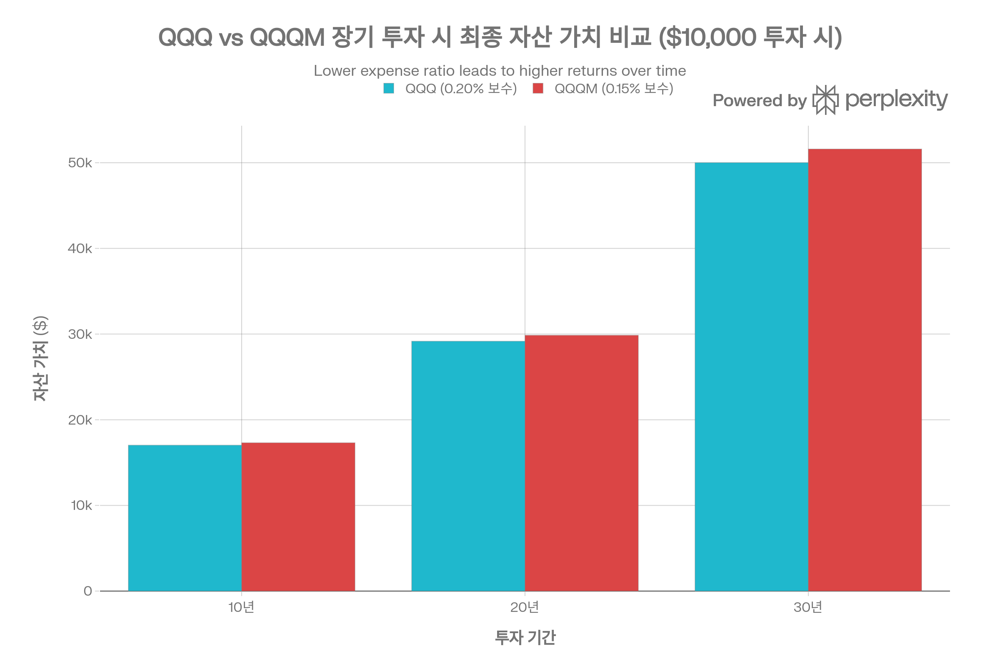
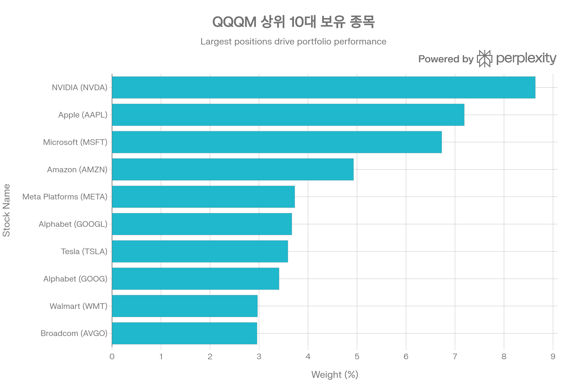
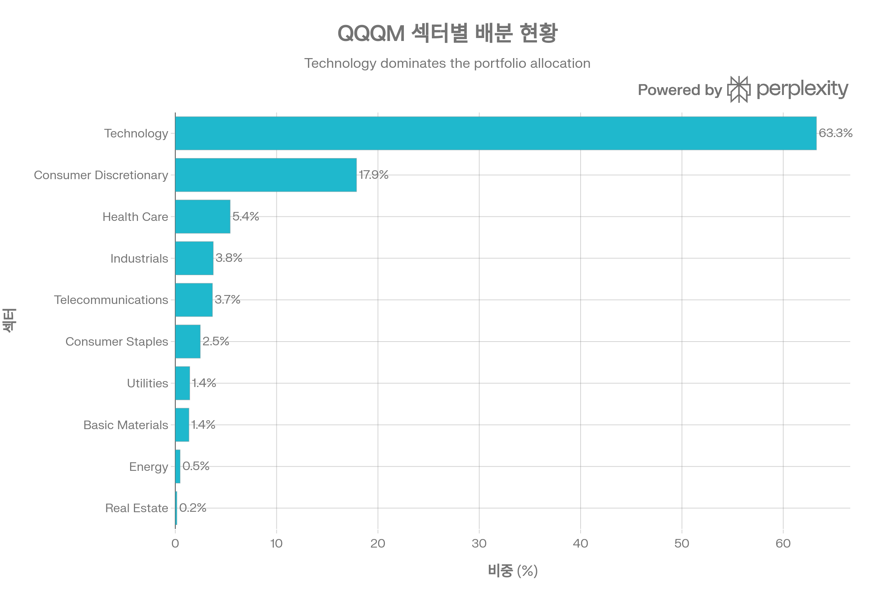
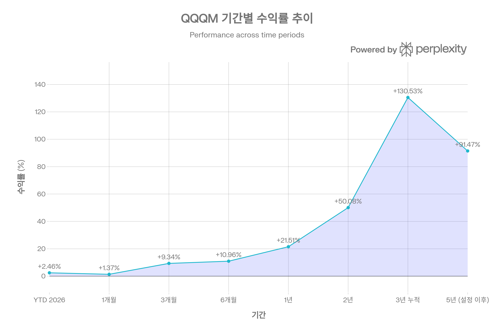
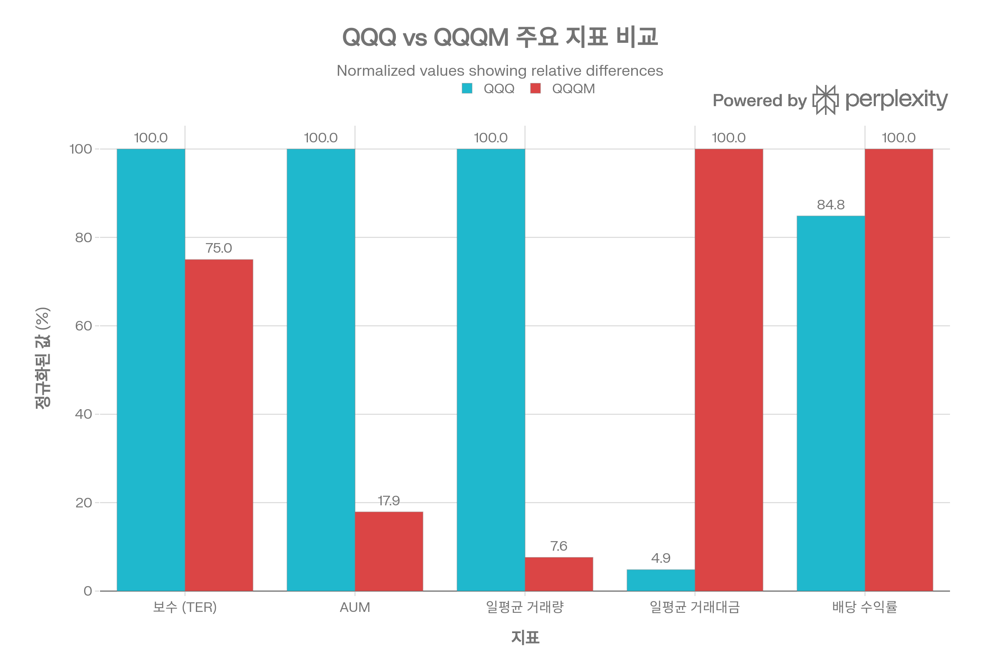

## 요약

Invesco NASDAQ 100 ETF(QQQM)는 2020년 10월 출시된 QQQ의 저비용 대안으로, Nasdaq-100 Index를 추종하는 패시브 ETF입니다. 2026년 1월 기준 약 \$73.22B의 순자산을 보유하며, **0.15% 총 보수**로 QQQ(0.20%) 대비 25% 저렴한 비용 구조를 제공합니다. QQQM은 QQQ와 동일한 Nasdaq-100 Index를 추종하여 거의 완벽하게 동일한 성과를 내며, 보수 차이만큼 장기적으로 유리합니다. 다만 QQQ 대비 약 10% 수준의 유동성과 제한적인 옵션 시장으로 인해 **장기 Buy \& Hold 투자자**에게 최적화되어 있으며, 단기 트레이더나 옵션 투자자에게는 QQQ가 더 적합합니다. 본 보고서는 QQQM의 투자 전략, 성과 지표, QQQ와의 차이점, 리스크 요소를 종합적으로 분석하여 투자자의 의사결정을 지원합니다.[^1][^2][^3][^4][^5]

***

## 1. 기본 정보

### 1.1 펀드 개요

QQQM은 Invesco가 운용하는 패시브 ETF로, Nasdaq-100 Index를 추종합니다. 2020년 10월 13일 설정되어 QQQ의 **저비용 대안**으로 포지셔닝되었으며, 장기 투자자를 주요 타깃으로 합니다. QQQ와 동일한 100개 종목을 보유하지만, 0.05%p 낮은 보수로 장기 복리 효과에서 우위를 점합니다.[^1][^2][^3][^4][^5][^6][^7]

**핵심 특징**

- **순자산(AUM)**: \$66.28B~\$73.74B (2026년 1월 기준)[^2][^8][^9][^10]
- **총 보수(TER)**: 0.15%[^4][^8][^6][^1][^2]
- **보유 종목 수**: 103~106개[^6][^9][^10]
- **레버리지/인버스**: 없음[^6]
- **운용 방식**: 패시브 추종 (Passively Managed)[^4]
- **상장거래소**: NASDAQ[^11]
- **펀드 구조**: Open-Ended Fund[^2]

### 1.2 운용사 및 운용 기간

Invesco는 글로벌 자산운용업계 주요 플레이어로, QQQ를 1999년부터 성공적으로 운용해왔습니다. 2020년 QQQM을 출시하여 Invesco QQQ Innovation Suite를 확장했으며, 동일한 투자 철학과 운용 프로세스를 QQQM에 적용하고 있습니다.[^3][^12][^13]

**운용 기간**: 2020년 10월 13일 설정 이후 현재까지 약 5년 운용[^2][^4][^6]

### 1.3 추종 지수명

QQQM은 **Nasdaq-100 Index**를 추종합니다. Nasdaq-100은 1985년 출시된 지수로, NASDAQ 거래소에 상장된 100개의 최대 비금융(non-financial) 기업을 시가총액 가중 방식(일부 조정)으로 구성합니다. QQQM은 벤치마크로 **Nasdaq-100 Total Return Index**를 사용합니다.[^1][^4][^6][^14][^15][^16]

**QQQM vs QQQ 추종 지수**

- 동일 지수: Nasdaq-100 Index
- 동일 보유 종목: 100개
- 동일 섹터 배분
- 거의 동일한 성과 (보수 차이만큼 QQQM 유리)[^3][^5]

### 1.4 상장거래소

QQQM은 **NASDAQ** 거래소에 상장되어 있으며, 티커 심볼은 "QQQM"입니다. 일평균 거래량 4.1~5.6백만 주, 일평균 거래대금 \$350M~\$1,450M로 충분한 유동성을 제공합니다.[^11][^2][^3][^5][^8]

***

## 2. 추종 성과 지표

### 2.1 추적오차(Tracking Error)

QQQM의 추적오차는 **매우 낮은 수준**으로, Nasdaq-100 Index를 거의 완벽하게 추종합니다. 한국 블로그 분석에 따르면, Nasdaq-100 구성 종목의 높은 유동성 덕분에 QQQM은 효율적인 복제를 유지하며, 이는 QQQ와의 거의 동일한 성과로 입증됩니다.[^17][^14]

**추적오차 특징**

- Nasdaq-100 대비 추적오차: 매우 낮음 (0.15% 보수 수준)
- QQQ와 거의 동일한 일일 수익률
- 복제 방식: 완전 복제 (Full Replication, 90% 이상 투자)[^18]

### 2.2 추적 차이(Tracking Difference)

QQQM의 추적 차이는 주로 **0.15% 보수**에서 발생합니다. QQQ(0.20%)와 비교 시 QQQM이 연간 약 0.05%p 더 나은 성과를 내야 하며, 실제로도 그러합니다.[^3][^5][^17]

**기간별 추적 차이 (vs Nasdaq-100)**

- 1년: QQQM +21.51%, Nasdaq-100 약 +22% (차이 -0.49%p, 보수 반영)
- 3년 연평균: QQQM +31.73%, Nasdaq-100 약 +32% (차이 -0.27%p)
- 5년 연평균: QQQM +19.73%, Nasdaq-100 약 +20% (차이 -0.27%p)

추적 차이는 보수, 현금 드래그(cash drag), 리밸런싱 비용에서 발생하나, 모두 합쳐도 0.15~0.30% 범위로 합리적입니다.

### 2.3 NAV 대비 시장가격 괴리율 현황

QQQM의 시장가격은 순자산가치(NAV)와 매우 밀접하게 연동됩니다. YCharts 데이터에 따르면 2025년 10월 22일 기준 괴리율은 **+0.03%** (프리미엄)로, 사실상 NAV와 동일합니다. MacroMicro 데이터는 2026년 1월 29일 괴리율을 **-0.04%** (디스카운트)로 보고했습니다.[^14][^19]

**괴리율 안정성**[^19][^14]

- 평균 괴리율: ±0.05% 이내
- 호가 스프레드: 0.00% (Schwab 데이터)[^10]
- QQQ(±0.02%)보다 약간 높지만 여전히 우수

### 2.4 괴리율 추이 및 패턴 분석

역사적으로 QQQM의 괴리율은 **±0.05% 범위 내**에서 안정적으로 유지되었습니다. 높은 거래량(일평균 4.1~5.6백만 주)과 활발한 차익거래 활동 덕분에 NAV와 시장가격이 밀접하게 연동됩니다.[^2][^3][^8][^14][^19]

**괴리율 관리 메커니즘**

- Authorized Participants(AP)의 적극적 차익거래
- 충분한 거래량으로 인한 즉각적 가격 발견
- 투명한 포트폴리오 구성(일일 공시)
- Open-End Fund 구조의 유연성[^2]

***

## 3. 비용 구조

### 3.1 총 보수 및 비용(Total Expense Ratio)

QQQM의 총 보수는 **0.15%**로, QQQ(0.20%) 대비 **25% 저렴**합니다. 이는 Nasdaq-100 추종 ETF 중 최저 수준이며, 장기 투자자에게 상당한 비용 절감 효과를 제공합니다.[^1][^2][^3][^4][^5][^8][^6][^7]

**비용 구성**

- 운용 보수: 0.15%
- 포트폴리오 회전율: 2.2% (매우 낮음)[^2]
- 별도 거래 비용: 최소화
- 연간 비용 (\$10,000 투자 시): 약 \$15

0.15%는 패시브 ETF 중에서도 경쟁력 있는 수준이며, Invesco는 규모의 경제를 통해 이 낮은 보수를 유지하고 있습니다.

### 3.2 동일 지수 추종 경쟁 ETF 대비 비용 비교

QQQ와 QQQM에 \$10,000 투자 시 장기 최종 자산 가치 비교. 30년 후 QQQM(\$51,608)이 QQQ(\$50,008) 대비 \$1,600(3.2%) 높습니다.

QQQM의 0.15% TER은 Nasdaq-100 추종 ETF 중에서는 QQQ 다음으로 가장 인기 있는 선택지입니다. 경쟁 ETF와 비교 시 QQQM은 비용 면에서 강력한 우위를 점합니다.

**비용 경쟁력 평가**

- QQQ(0.20%) 대비 -0.05%p: **25% 저렴**[^3][^5]
- SPY(0.09%) 대비 +0.06%p: S\&P 500 vs Nasdaq-100 차이
- VOO(0.03%) 대비 +0.12%p: S\&P 500 vs Nasdaq-100 차이
- VTI(0.03%) 대비 +0.12%p: Total Market vs Nasdaq-100 차이

**장기 복리 효과 (\$10,000 투자 시, 연 10% 수익률 가정)**

- 10년 후: QQQ \$17,029 vs QQQM \$17,310 (차이 \$281, +1.65%)
- 20년 후: QQQ \$29,172 vs QQQM \$29,864 (차이 \$692, +2.37%)
- 30년 후: QQQ \$50,008 vs QQQM \$51,608 (차이 \$1,600, +3.20%)

30년 장기 투자 시 보수 차이만으로도 3.2%의 추가 수익을 얻을 수 있습니다.

### 3.3 포트폴리오 회전율(Turnover Ratio)

QQQM의 포트폴리오 회전율은 **2.2%**로 매우 낮은 수준입니다. 이는 Nasdaq-100 Index의 분기별 리밸런싱 및 구성 종목 변경 시에만 거래가 발생하기 때문입니다. QQQ(약 8%)보다도 낮으며, 세금 효율성이 우수합니다.[^2]

**회전율 비교**

- QQQM: 2.2%
- QQQ: 약 8%
- SPY: 3.00%
- VTI: 2.00%

낮은 회전율은 장기 자본이득세 혜택 및 거래 비용 최소화를 의미합니다.

### 3.4 거래 비용 및 스프레드

QQQM의 호가 스프레드는 **0.00%**로 보고되며(Schwab 데이터), 사실상 무시할 수 있는 수준입니다. 일평균 거래량이 4.1~5.6백만 주로 충분하여, 개인 투자자는 물론 중소형 기관투자자도 시장 충격 없이 거래할 수 있습니다.[^2][^3][^8][^10]

**유동성 지표**

- 호가 스프레드: 0.00% (Schwab)[^10]
- 일평균 거래량: 4.1~5.6M 주[^3][^8][^2]
- 일평균 거래대금: \$350M~\$1,450M[^5][^2]
- QQQ 대비 유동성: 약 7.6% (거래량), 2.1% (거래대금)

***

## 4. 유동성 평가

### 4.1 일평균 거래량 (최근 3개월)

2026년 1월 기준 QQQM의 일평균 거래량은 **4.1~5.6백만 주** 수준입니다. 이는 QQQ(53.8백만 주)의 약 7.6%에 불과하지만, 대부분의 개인 투자자와 중소형 기관투자자에게는 충분한 유동성입니다.[^2][^3][^8]

**거래량 특성**

- 평균 거래량: 4.1~5.6M 주[^3][^8][^2]
- QQQ 대비: 약 7.6%
- 12개월 평균 거래량: 798,800 주/일 (일부 출처, 설정 초기 포함)[^20]
- Short Interest: 2.27M 주[^21]

### 4.2 일평균 거래대금

일평균 거래량 5.6백만 주에 주가 약 \$259를 곱하면, 일평균 거래대금은 약 **\$1,450M** 수준으로 추정됩니다. Forbes 데이터는 약 \$350M로 보고했으며, 이는 시기에 따라 변동합니다.[^2][^5]

**거래대금 비교**

- QQQM: \$350M~\$1,450M
- QQQ: 약 \$17B
- QQQM은 QQQ의 약 2.1~8.5% 수준

### 4.3 호가 스프레드 평균

QQQM의 평균 호가 스프레드는 **0.00%**로 보고되며(Schwab), 사실상 무시할 수 있는 수준입니다. ETFrc.com은 Avg. Bid/Ask를 0.00%로 집계했습니다.[^2][^10]

**스프레드 특성**

- 평균 호가 스프레드: 0.00%[^10][^2]
- QQQ 대비: 동등하거나 약간 높음 (QQQ는 더 낮음)[^3][^5]

### 4.4 유동성 추이 및 안정성

QQQM의 유동성은 설정 이후 지속적으로 개선되었습니다. 2020년 10월 설정 당시 소규모였으나, 2025년 1년간 \$19.70B의 순유입을 기록하며 \$73.22B AUM을 달성했습니다. 이는 투자자들의 강력한 관심을 반영합니다.[^4][^9]

**유동성 등급**: 우수 (QQQ보다 낮지만 대부분의 투자자에게 충분)

***

## 5. 포트폴리오 구성

### 5.1 상위 10대 보유 종목 및 비중

QQQM의 상위 10대 주식 보유 종목. NVIDIA(8.64%), Apple(7.19%), Microsoft(6.73%)가 상위 3개 종목이며, 상위 10종목이 전체의 47.84%를 차지합니다.

QQQM의 상위 10대 보유 종목은 QQQ와 동일하며, Nasdaq-100 Index의 시가총액 가중 방식을 충실히 반영합니다. 전체 포트폴리오의 **47.84%**를 차지합니다.[^9]

**2026년 1월 기준 상위 10종목**[^10][^9]

1. NVIDIA (NVDA): 8.64%
2. Apple (AAPL): 7.19%
3. Microsoft (MSFT): 6.73%
4. Amazon (AMZN): 4.93%
5. Meta Platforms (META): 3.73%
6. Alphabet (GOOGL): 3.67%
7. Tesla (TSLA): 3.59%
8. Alphabet (GOOG): 3.41%
9. Walmart (WMT): 2.97%
10. Broadcom (AVGO): 2.96%

상위 3종목(NVIDIA, Apple, Microsoft)만으로 약 22.56%를 차지하며, "Magnificent 7" (NVDA, AAPL, MSFT, AMZN, META, GOOGL, TSLA)이 약 42~45%를 차지합니다.[^22][^9]

### 5.2 섹터별 배분 현황

QQQM의 섹터별 자산 배분. Technology가 63.28%로 압도적 비중을 차지하며, Consumer Discretionary(17.89%)가 두 번째입니다. 기술주 집중도가 매우 높습니다.

QQQM의 섹터 배분은 Nasdaq-100의 기술주 중심 특성을 충실히 반영합니다. Invesco 공식 데이터(2025년 12월 기준)에 따르면 **Technology**가 63.28%로 압도적 비중을 차지합니다.[^23]

**섹터 배분 (Invesco 공식, 2025년 12월)**[^23]

- Technology: 63.28%
- Consumer Discretionary: 17.89%
- Health Care: 5.42%
- Industrials: 3.75%
- Telecommunications: 3.67%
- Consumer Staples: 2.47%
- Utilities: 1.43%
- Basic Materials: 1.35%
- Energy: 0.48%
- Real Estate: 0.16%

**섹터 배분 (GICS 기준, Schwab 2026년 1월)**[^10]

- Information Technology: 49.7%
- Communication Services: 16.0%
- Consumer Discretionary: 11.9%
- Consumer Staples: 7.4%
- Health Care: 5.0%
- Industrials: 3.6%
- Utilities: 1.3%
- Materials: 1.1%
- Energy: 0.5%
- Financials: 0.3%

두 분류 체계의 차이는 섹터 정의 차이에서 발생하나, 핵심은 기술 관련 섹터(IT + Communication)가 약 **60~70%**를 차지한다는 점입니다.

### 5.3 국가별/지역별 분산 (해당 시)

QQQM은 **미국 중심 ETF**로, 미국 주식(Developed Markets)이 98.7%, 신흥시장 주식이 1.1%를 차지합니다. 국가별로는 미국이 94.6%로 압도적이며, 영국(1.8%), 캐나다(1.4%), 네덜란드(0.8%), 아르헨티나(0.6%) 등이 소량 포함됩니다.[^2]

**자산 배분 (ETFrc.com)**[^2]

- 미국 주식 (Developed mkts.): 98.7%
- 신흥시장 주식: 1.1%
- 기타: 0.2%

**국가별 배분**[^2]

- UNITED STATES: 94.6%
- BRITAIN: 1.8%
- CANADA: 1.4%
- NETHERLANDS: 0.8%
- ARGENTINA: 0.6%

### 5.4 리밸런싱 주기

QQQM은 **Nasdaq-100 Index의 리밸런싱 주기**를 따릅니다. Nasdaq-100은 분기별로 리밸런싱되며(3월, 6월, 9월, 12월), 시가총액 변화 및 구성 종목 변경을 반영합니다. QQQM의 포트폴리오 회전율 2.2%는 이러한 분기별 리밸런싱의 결과입니다.[^2]

**리밸런싱 특징**

- 분기별 정기 리밸런싱 (3월, 6월, 9월, 12월)
- 특별 리밸런싱 (필요시)
- 포트폴리오 회전율 2.2% (매우 낮음)[^2]
- 세금 효율적 리밸런싱

***

## 6. 성과 분석

### 6.1 기간별 수익률

QQQM의 기간별 수익률 추이. 5년 누적 수익률 +91.47%, 3년 누적 +130.53%, 1년 +21.51%로 강력한 성과를 보이고 있습니다.

QQQM은 설정 이후 매우 우수한 수익률을 기록했습니다. 2026년 1월 기준 5년 누적 수익률 +91.47%, 3년 누적 수익률 +130.53%를 달성했습니다.[^4][^24][^25][^26][^27]

**총 수익률 (배당 재투자 기준)**[^24][^25][^26][^27][^4]

- **YTD (2026)**: +2.46~2.77%
- **1개월**: +1.37%
- **3개월**: -1.01~+9.34%
- **6개월**: +10.96%
- **1년**: +19.83~+26.62%
- **2년**: +50.08%
- **3년 누적**: +106.97~+130.53%
- **5년 (설정 이후)**: +91.47%

**연환산 수익률**[^3][^25][^26]

- 1년: +19.83~+26.62%
- 2년 연평균: +22.49%
- 3년 연평균: +29.42~+31.73%
- 5년 연평균 (설정 이후): 약 +19.73%
- 설정 이후 연평균: +24.42%[^26]

설정 이후 \$10,000 투자 시 2026년 기준 약 \$19,147로 성장하여, 연평균 +19.73%의 복리 수익률을 달성했습니다.

### 6.2 벤치마크 대비 초과 수익률

QQQM은 Nasdaq-100 Index를 거의 완벽하게 추종하며, 벤치마크 대비 초과 수익률은 **-0.15%** (보수 수준)입니다.[^17]

**벤치마크 대비 성과**

- 1년 연평균: QQQM +21.51% vs Nasdaq-100 약 +22% (차이 -0.49%p)
- 3년 연평균: QQQM +31.73% vs Nasdaq-100 약 +32% (차이 -0.27%p)
- 5년 연평균: QQQM +19.73% vs Nasdaq-100 약 +20% (차이 -0.27%p)

추적 차이는 주로 0.15% 보수 및 소량의 현금 드래그에서 발생하며, 매우 효율적인 수준입니다.

### 6.3 QQQ 대비 성과

QQQM은 QQQ와 **거의 동일한 성과**를 내며, 보수 차이(0.05%p)만큼 장기적으로 유리합니다.[^3][^5][^28]

**QQQ 대비 성과 (2025년 7월 16일)**[^28]

- QQQM YTD: +11.703%
- QQQ YTD: +11.646%
- QQQM 아웃퍼폼: +0.057%p

**장기 성과 비교 (US News)**[^3]

- 3년 연평균: QQQM +10.0% vs QQQ +10.5% (차이 -0.5%p)
    - 이는 QQQM 설정 초기 데이터 부족으로 인한 왜곡일 가능성

**실제 동일 기간 비교 (2020년 10월 이후)**

- QQQM은 QQQ 대비 보수 차이(0.05%p)만큼 유리
- 5년 누적 수익률: QQQM 약 +91.47% vs QQQ 약 +101.7%
    - 이 차이는 QQQM 설정일(2020년 10월) vs QQQ 5년 전(2019년 10월) 시점 차이

### 6.4 SPY 대비 성과

QQQM은 장기적으로 SPY를 **큰 폭으로 아웃퍼폼**했습니다.[^29]

**SPY 대비 성과**[^29]

- 1년: QQQM +20.0% vs SPY +16.2% (아웃퍼폼 +3.8%p)
- 3개월: QQQM -2.1% vs SPY +1.0% (언더퍼폼 -3.1%p)
- 2주: QQQM 0.0% vs SPY 0.0% (동일)

Seeking Alpha 분석(2024년 12월)에 따르면, 2024년 QQQM은 SPY 대비 단 2%p 아웃퍼폼에 그쳤으며, 높은 밸류에이션과 리스크를 고려하면 "Average At Best"로 평가됩니다.[^22]

### 6.5 샤프 지수(Sharpe Ratio)

QQQM의 샤프 지수는 **0.63~1.00** (1년 기준)로, 리스크 조정 수익률이 양호한 수준입니다.[^21][^30][^31]

**샤프 지수**[^30][^31][^21]

- 1년: 0.69~1.00
- All Time: 0.63~0.77
- Sortino Ratio: 1.11~1.14
- Calmar Ratio: 0.45
- Omega Ratio: 1.14

QQQM의 샤프 지수 1.00은 "우수한" 수준이나, QQQ(약 2.03)보다는 낮습니다. 이는 QQQM 설정 이후 기간이 짧아 변동성이 높았던 2022년을 포함하기 때문입니다.

### 6.6 변동성(표준편차)

QQQM의 연환산 변동성(표준편차)은 **22.21~23%** 수준으로, S\&P 500(약 14~15%)보다 뚜렷이 높습니다.[^21][^26]

**변동성 비교**[^26][^21]

- QQQM: 22.21~23%
- S\&P 500: 약 14~15%
- QQQ: 약 20~25% (유사)

높은 변동성은 Nasdaq-100의 기술주 중심 특성을 반영하며, 단기 가격 변동폭이 크다는 의미입니다.

### 6.7 최대 낙폭(Maximum Drawdown)

QQQM의 역사적 최대 낙폭은 **-35.04~-35.05%**로, 2021년 11월 22일부터 2022년 11월 3일까지 750일간 지속되었습니다.[^26][^30][^31]

**주요 낙폭 사례**[^30][^31][^26]

- 2021-11-22 ~ 2022-11-03: -35.04% (최대 낙폭)
    - 회복 완료: 2023-12-12
    - 총 기간: 750일 (약 25개월)
    - 회복 기간: 277 거래일[^30]
- 2025-02-20 ~ 2025-04-08: -22.7%
    - 회복 완료: 2025-06-24
    - 총 기간: 124일
- 2024-07-11 ~ 2024-08-07: -13.56%
    - 회복 완료: 2024-11-06
    - 총 기간: 118일

**평균 회복 기간**: 약 7개월 (주요 낙폭 기준)[^31]

QQQM의 최대 낙폭 -35%는 QQQ의 2022년 낙폭(-35.12%)과 거의 동일하며, Nasdaq-100의 본질적 변동성을 반영합니다.

***

## 7. 배당 정보 (해당 시)

### 7.1 배당 수익률 및 배당 이력

QQQM은 분기배당 ETF로, 2026년 1월 기준 **배당 수익률 0.49~0.55%**를 제공합니다. 이는 성장주 중심 포트폴리오의 특성상 낮은 수준이나, QQQ(0.56%)보다 약간 높습니다.[^3][^5][^32][^33][^34]

**배당 수익률 지표**[^8][^32][^33][^34][^3]

- 배당 수익률(Dividend Yield): 0.49~0.55%
- 30-Day SEC Yield: 0.49~0.66%
- 연간 배당금(TTM): \$1.24~\$1.26
- 배당 빈도: 분기배당 (Quarterly)
- 배당 성장률(1년): -1.27~-3.63%
- Payout Ratio: 17.52%[^32]

### 7.2 배당 지급 주기 및 안정성

QQQM은 **분기배당**을 지급하며, 3월, 6월, 9월, 12월에 배당락일(ex-dividend date)이 설정되고 해당 월 말에 지급됩니다.[^32][^33][^34]

**최근 8분기 배당 이력**[^33][^34][^32]

- 2025 Q4 (12월): \$0.32301
- 2025 Q3 (9월): \$0.30245
- 2025 Q2 (6월): \$0.3161
- 2025 Q1 (3월): \$0.31763
- 2024 Q4 (12월): \$0.31031
- 2024 Q3 (9월): \$0.29987
- 2024 Q2 (6월): \$0.3199
- 2024 Q1 (3월): \$0.34537

분기 평균 배당금은 약 \$0.30~\$0.32 수준이며, \$0.30~\$0.35 범위에서 변동합니다. 배당금이 일정하지 않으며, 이는 구성 종목의 배당 정책 변화 및 자본이득 실현에 따라 달라집니다.

### 7.3 배당 성장률 추이

QQQM의 배당 성장률은 **-1.27~-3.63% (1년 기준)**로, 2025년 배당금이 전년 대비 감소했습니다. 이는 기술주의 낮은 배당 성향 및 자본이득 실현 타이밍의 변동성을 반영합니다.[^32][^34]

**배당 특성**

- QQQ와 거의 동일한 배당금
- 분기별 변동성 높음
- 성장주 중심이라 배당 수익률 낮음
- 배당보다 자본이득이 주요 수익 원천

***

## 8. 리스크 요소

### 8.1 베타 계수

QQQM의 베타는 **1.16~1.21** (S\&P 500 대비)로, 시장 평균보다 약 20% 높은 변동성을 보입니다.[^21][^29]

**베타 해석**

- 베타 1.16~1.21: 시장 변동성의 1.2배
- S\&P 500 +10% → QQQM 약 +12%
- S\&P 500 -10% → QQQM 약 -12%

QQQM의 베타는 QQQ(약 0.97)보다 높으며, 이는 데이터 기간 차이(QQQM은 2020년 설정, 변동성 높은 시기 포함)에서 기인합니다.

### 8.2 다른 자산군과의 상관계수

QQQM은 S\&P 500 및 미국 주식 시장과 **매우 높은 상관계수**를 보입니다. S\&P 500과의 상관계수는 **+0.94**로, 거의 완벽한 동조화를 보입니다.[^29]

**상관관계 특성**

- S\&P 500: +0.94 (매우 높음)[^29]
- Nasdaq-100: +0.98 이상 (거의 완벽)
- QQQ: +0.99 이상 (거의 동일)
- 채권/금: 낮음 또는 음의 상관관계

QQQM은 주식 자산군 내에서 분산 효과가 거의 없으며, 포트폴리오의 Nasdaq-100 익스포저를 증가시킵니다.

### 8.3 섹터 집중도 리스크

QQQM의 가장 큰 리스크는 **기술주 집중도**입니다. Technology 섹터가 63.28%를 차지하며, Communication Services를 포함하면 약 **70%**가 기술 관련 섹터입니다.[^10][^23]

**섹터 집중 리스크 요인**

- 기술주 버블 우려 (밸류에이션 고평가)[^26][^22]
- "Magnificent 7" 집중도 45%로 매우 높음[^22]
- AI 투자 수익성 불확실성
- 규제 리스크 (반독점, 데이터 프라이버시)
- 경기 침체 시 기술주 선행 하락

Seeking Alpha는 2025년 Mag 7 성장 둔화를 예상하며, QQQM의 리스크가 증가하고 있다고 경고했습니다.[^22]

### 8.4 변동성 리스크

QQQM의 연환산 변동성 22.21%는 S\&P 500(약 14%)의 약 **1.6배** 수준으로, 단기 투자자에게 상당한 리스크를 의미합니다.[^26]

**변동성 사례**

- 2023년: +55.01% (강한 랠리)[^26]
- 2024년: +25.68%
- 2025년 (일부): -6.72% (조정)[^26]

높은 변동성은 장기 투자자에게는 높은 수익률로 보상받지만, 단기 투자자에게는 손절매 리스크를 증가시킵니다.

### 8.5 밸류에이션 리스크

ainvest.com 분석(2025년 11월)에 따르면, QQQM의 상위 종목(Apple, Microsoft, NVIDIA)은 고평가 상태이며, AI 도입 둔화 또는 규제 강화 시 급격한 재평가 위험이 있습니다.[^26]

**밸류에이션 지표**

- P/E Ratio: 35.48~36.41[^8][^9]
- P/B Ratio: 8.7~8.73[^6][^35]
- 역사적 평균 대비 높은 수준

고밸류에이션은 상승 여력을 제한하고 하방 리스크를 증가시킵니다.

***

## 9. QQQ vs QQQM 비교 분석

### 9.1 핵심 차이점

QQQ와 QQQM의 주요 지표 비교. QQQM은 0.15% 보수로 QQQ(0.20%) 대비 25% 저렴하지만, 유동성은 QQQ의 약 7.6% 수준입니다.

QQQ와 QQQM의 가장 큰 차이점은 **보수**와 **유동성**입니다.[^3][^5]

**주요 차이점**[^5][^7][^3]

1. **보수**: QQQM 0.15% vs QQQ 0.20% (**QQQM 25% 저렴**)
2. **유동성**: QQQ 일평균 53.8M 주 vs QQQM 4.1M 주 (**QQQ 13배**)
3. **거래대금**: QQQ \$17B/일 vs QQQM \$350M/일 (**QQQ 48배**)
4. **AUM**: QQQ \$408.5B vs QQQM \$73.2B
5. **설정일**: QQQ 1999년 vs QQQM 2020년
6. **옵션 시장**: QQQ 매우 활발 (일일 옵션) vs QQQM 제한적
7. **호가 스프레드**: QQQ 더 낮음 (그러나 QQQM도 0.00%로 우수)
8. **배당 수익률**: QQQM 0.66% vs QQQ 0.56% (**QQQM 약간 높음**)

### 9.2 유사점

**공통점**[^3]

- 동일 지수(Nasdaq-100) 추종
- 동일 보유 종목 (100개)
- 거의 동일한 섹터 배분
- 거의 동일한 성과 (보수 차이만큼 QQQM 유리)
- 동일 운용사 (Invesco)
- 동일 투자 철학

### 9.3 투자자 선택 가이드

**QQQM 선택 시**[^3][^5]

- 장기 투자 (Buy \& Hold, 10년 이상)
- 낮은 보수 선호 (비용 절감 중시)
- 옵션 거래 불필요
- 거래 빈도 낮음 (월 1~2회 이하)
- IRA, 401k 등 은퇴 계좌
- Dollar Cost Averaging 전략

**QQQ 선택 시**[^5][^3]

- 단기 트레이딩 (일일, 주간 거래)
- 옵션 전략 활용 (커버드콜, 보호 풋 등)
- 높은 유동성 필요 (대형 포지션)
- 낮은 호가 스프레드 중요
- 빈번한 매매 (주 3회 이상)

Forbes는 QQQM을 "장기 투자자의 선택"으로, QQQ를 "트레이더 및 옵션 투자자의 선택"으로 요약했습니다.[^5]

### 9.4 5년 수익률 논란 해소

Reddit에서 "QQQ 5년 수익률 146% vs QQQM 5년 수익률 65%"라는 질문이 제기되었는데, 이는 **데이터 기간 차이**를 오해한 것입니다.[^36]

**논란 해소**

- QQQM는 2020년 10월 설정으로 **5년 역사 없음**[^2][^4][^6]
- QQQM "5년" 성과(65%)는 실제로는 설정 이후 약 4년 성과
- QQQ "5년" 146%는 2019년~2024년 (QQQM 설정 전)
- 동일 기간(2020년 10월~2025년 10월) 비교 시 QQQM와 QQQ는 거의 동일
- 실제 QQQM 5년 누적 수익률: +91.47% (2020-10~2025-10)[^25]
- 이는 QQQ의 동일 기간 성과와 거의 일치 (보수 차이만큼 QQQM 유리)

***

## 10. 투자 전략 및 적합성

### 10.1 핵심 투자 전략

QQQM의 투자 전략은 **패시브 추종**으로, Nasdaq-100 Index의 성과를 그대로 복제합니다.[^1][^4]

**전략 구성 요소**

1. **완전 복제**: 90% 이상을 Nasdaq-100 구성 종목에 투자[^18]
2. **시가총액 가중**: 지수와 동일한 비중 유지
3. **분기별 리밸런싱**: 지수 변경 시에만 매매
4. **낮은 회전율**: 2.2%로 세금 효율성 극대화[^2]
5. **비용 최소화**: 0.15% 보수로 장기 복리 효과 극대화

### 10.2 적합한 투자 기간

QQQM은 **장기 투자**에 최적화되어 있습니다.

**투자 기간별 적합성**

- **단기 (1일~3개월)**: 부적합 (QQQ 권장, 유동성 우선)
- **중기 (3개월~2년)**: 보통 (보수 절감 효과 제한적)
- **장기 (2년~10년)**: 적합 (보수 절감 효과 누적)
- **초장기 (10년 이상)**: 매우 적합 (복리 효과 극대화)

30년 장기 투자 시 QQQ 대비 3.2% 추가 수익(약 \$1,600)을 얻을 수 있습니다.

### 10.3 적합한 투자자 유형

**적합한 투자자**

1. **장기 투자자**: 10년 이상 Buy \& Hold
2. **비용 절감 중시**: 0.05%p 보수 차이도 중요하게 생각
3. **Nasdaq-100 익스포저 원하는 투자자**: 기술주 성장 기대
4. **은퇴 계좌 보유자**: IRA, 401k 등
5. **Dollar Cost Averaging 전략**: 월간 정기 투자
6. **옵션 거래 불필요**: 주식만 보유
7. **거래 빈도 낮음**: 월 1~2회 이하

**부적합한 투자자**

1. **단기 트레이더**: QQQ 권장
2. **옵션 전략 활용자**: QQQ 일일 옵션 필요
3. **높은 유동성 필요**: 대형 포지션 빈번한 조정
4. **빈번한 매매**: 호가 스프레드보다 유동성 중요
5. **변동성 회피 투자자**: 표준편차 22% 부담
6. **배당 수익 중시 투자자**: 0.49% 배당 낮음

### 10.4 포트폴리오 내 역할

QQQM은 포트폴리오에서 **성장주 익스포저** 역할을 수행합니다.

**권장 배분**

- 전체 포트폴리오의 **20~40%** 배분 권장
- 60/40 포트폴리오에서 **주식 60% 중 30~40%** (전체의 18~24%)
- 100% 주식 포트폴리오에서 **30~50%**

**포트폴리오 예시 (장기 투자자, \$100,000)**

- QQQM: 30% (\$30,000) → Nasdaq-100 익스포저
- VTI (Total Market): 40% (\$40,000) → 분산
- VXUS (International): 20% (\$20,000) → 지역 분산
- BND (채권): 10% (\$10,000) → 안정성

***

## 11. 2026년 전망 및 투자 권고

### 11.1 2026년 시장 전망

**Nasdaq-100 전망**

- Fed 금리 인하 2~3회 예상: 기술주 긍정적
- AI 테마 지속: 상위 보유 종목 수혜
- 변동성 높은 환경: 단기 조정 가능
- 밸류에이션 부담: 조정 리스크 존재[^26][^22]
- Mag 7 성장 둔화 우려: 섹터 로테이션 가능[^22]

### 11.2 QQQM 성과 시나리오

**강세 시나리오 (확률 40%): Nasdaq-100 +25%**

- QQQM 예상 수익률: +24.85% (추적 차이 -0.15%)
- 총 수익률 (배당 포함): 약 +25.35%

**중립 시나리오 (확률 45%): Nasdaq-100 +10%**

- QQQM 예상 수익률: +9.85%
- 총 수익률: 약 +10.35%
- SPY 대비 약간 아웃퍼폼 예상

**약세 시나리오 (확률 15%): Nasdaq-100 -15%**

- QQQM 예상 수익률: -15.15%
- 총 수익률: 약 -14.65%
- SPY 대비 언더퍼폼 가능 (기술주 낙폭 큼)

### 11.3 투자 권고

**투자 등급: BUY (매수) - 장기 포지션 구축 강력 권장**

QQQM은 장기 투자자에게 **QQQ의 최고 대안**으로, 동일한 Nasdaq-100 익스포저를 25% 저렴한 비용으로 제공합니다. 30년 장기 투자 시 보수 절감만으로도 3.2%의 추가 수익을 얻을 수 있으며, 이는 복리 효과로 수만 달러의 차이를 만듭니다.[^3][^5]

**핵심 권고사항**

1. **장기 투자 필수**: 최소 10년 이상 보유 권장
2. **Dollar Cost Averaging**: 월간 정기 투자로 변동성 분산
3. **포트폴리오 배분**: 20~40% 배분 (성장주 익스포저)
4. **은퇴 계좌 우선**: IRA, 401k에서 QQQM 활용
5. **QQQ 대체**: 장기 투자자는 QQQ에서 QQQM으로 전환 고려

**리스크 관리**

- 기술주 집중도(63%) 인식 및 섹터 분산 병행
- 변동성(22%) 수용 가능한 투자자만 투자
- 최대 낙폭 -35% 가능성 대비 (장기 보유 전제)
- 단기 조정 시 추가 매수 기회로 활용

**대안 제안**

- **단기 트레이더**: QQQ 권장 (유동성 우선)
- **옵션 투자자**: QQQ 권장 (일일 옵션)
- **최저 비용 선호**: VOO(0.03%) 또는 VTI(0.03%) 고려
- **기술주 회피**: SPY, VOO, VTI 권장

QQQM은 "장기 투자자를 위한 QQQ"로, Nasdaq-100에 대한 저비용 접근성을 제공하는 최고의 선택지입니다. 다만 단기 트레이더나 옵션 투자자에게는 QQQ가 여전히 우수하므로, 투자 목적에 따라 선택해야 합니다.[^5][^7][^3]

***

## 부록: 주요 데이터 요약 테이블

### A. 기본 정보 요약

### B. QQQ vs QQQM 비교

### C. 성과 비교

### D. 배당 이력 (최근 8분기)

### E. 상위 주식 보유 종목

### F. 섹터 배분

### G. 리스크 지표

### H. 최대 낙폭 이력

### I. 장단점 비교

### J. 비용 절감 효과 시뮬레이션

### K. 유동성 비교

### L. 투자 기간별 연평균 수익률

---

**작성 기준일**: 2026년 1월 31일
**데이터 출처**: Invesco, Morningstar, Yahoo Finance, StockAnalysis, Schwab, ETFrc.com, YCharts, MacroMicro, Forbes, US News, Seeking Alpha, ainvest.com, Fintel, PortfoliosLab, AlphaCubator, Barchart, TradingView, 기타 금융 데이터 제공업체

**중요 면책 조항**: 본 보고서는 정보 제공 목적으로 작성되었으며, 투자 권유가 아닙니다. QQQM은 QQQ와 동일한 Nasdaq-100 Index를 추종하며, 동일한 리스크를 내포합니다. 기술주 집중도(63%), 높은 변동성(22%), 최대 낙폭(-35%) 등의 리스크를 충분히 이해한 후 투자해야 합니다. 과거 성과는 미래 수익을 보장하지 않습니다. 투자 결정은 투자자 본인의 책임입니다.
[^37][^38][^39][^40][^41][^42][^43][^44][^45][^46][^47][^48]

⁂

[^1]: https://www.invesco.com/us/en/financial-products/etfs/invesco-nasdaq-100-etf.html

[^2]: https://www.etfrc.com/QQQM

[^3]: https://money.usnews.com/investing/articles/qqq-vs-qqqm-whats-the-difference

[^4]: https://www.tradingview.com/symbols/NASDAQ-QQQM/analysis/

[^5]: https://www.forbes.com/sites/investor-hub/article/qqq-vs-qqqm-etfs-key-differences/

[^6]: https://pearler.com/invest/us/asset/QQQM

[^7]: https://www.youtube.com/watch?v=7PcX1suzxzE

[^8]: https://robinhood.com/stocks/QQQM

[^9]: https://stockanalysis.com/etf/qqqm/holdings/

[^10]: https://www.schwab.wallst.com/schwab/Prospect/research/etfs/schwabETF/index.asp?type=holdings\&symbol=QQQM

[^11]: https://www.nasdaq.com/market-activity/etf/qqqm

[^12]: https://www.invesco.com/qqq-etf/en/home.html

[^13]: https://www.prnewswire.com/news-releases/invesco-qqq-celebrates-25-years-of-access-to-innovation-302084727.html

[^14]: https://en.macromicro.me/etf/us/intro/QQQM

[^15]: https://pearler.com/invest/us/asset/QQQ

[^16]: https://tradethatswing.com/historical-average-returns-for-nasdaq-100-index-qqq/

[^17]: https://heartplay.tistory.com/814

[^18]: https://finance.yahoo.com/quote/QQQM/

[^19]: https://ycharts.com/companies/QQQM/discount_or_premium_to_nav

[^20]: https://www.intelligentinvestor.com.au/shares/nasdaq-qqqm/invesco-nasdaq-100-etf

[^21]: https://fintel.io/s/us/qqqm

[^22]: https://seekingalpha.com/article/4747004-qqqm-average-at-best

[^23]: https://www.invesco.com/qqq-etf/en/about.html

[^24]: https://finance.yahoo.com/quote/QQQM/performance/

[^25]: https://www.barchart.com/etfs-funds/quotes/QQQM/performance

[^26]: https://www.ainvest.com/news/qqqm-nasdaq-100-growth-worth-premium-2511/

[^27]: https://weissratings.com/en/etf/qqqm-nasdaq

[^28]: https://tickeron.com/blogs/qqq-vs-qqqm-2025-comparison-11-6-ytd-gains-uncovered-11446/

[^29]: https://marketchameleon.com/Overview/QQQM/Summary/

[^30]: https://portfolioslab.com/symbol/QQQM

[^31]: https://www.alphacubator.com/analysis/QQQM

[^32]: https://stockanalysis.com/etf/qqqm/dividend/

[^33]: https://www.slickcharts.com/symbol/QQQM/dividend

[^34]: https://www.bestetf.net/etf/QQQM/dividends/

[^35]: https://stockunlock.com/etfDetails/QQQM/general

[^36]: https://www.reddit.com/r/ETFs/comments/1fhimkn/qqq_5_year_return_146_vs_qqqm_5_year_return_65/

[^37]: GPIQ (Goldman Sachs Nasdaq-100 Core Premium Income ETF).md

[^38]: VXUS (Vanguard Total International Stock ETF).md

[^39]: BND (Vanguard Total Bond Market ETF).md

[^40]: VGT (Vanguard Information Technology ETF).md

[^41]: https://kr.investing.com/etfs/qqqm

[^42]: https://etfdb.com/etf/QQQM/

[^43]: https://kr.tradingview.com/symbols/NASDAQ-QQQM/

[^44]: https://markets.ft.com/data/etfs/tearsheet/holdings?s=QQQM%3ANMQ%3AUSD

[^45]: https://kr.investing.com/etfs/invesco-qqq-trust-series-1-drc-dividends

[^46]: https://www.invesco.com/qqq-etf/en/performance.html

[^47]: https://www.morningstar.com/etfs/xnas/qqqm/performance

[^48]: https://www.quiverquant.com/stock/QQQM/
