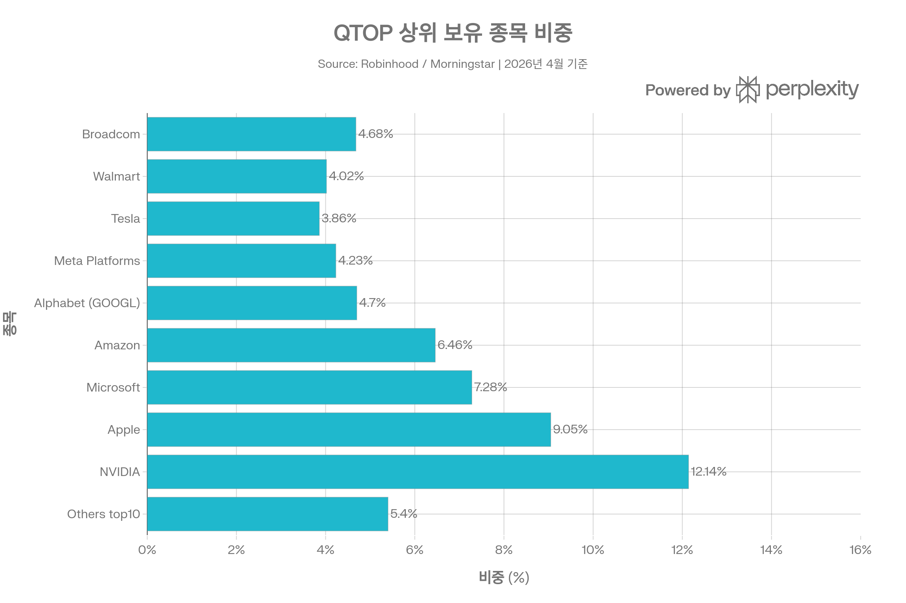
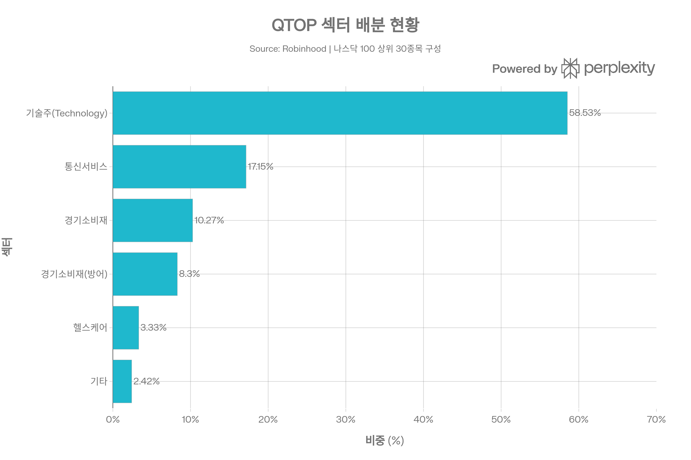
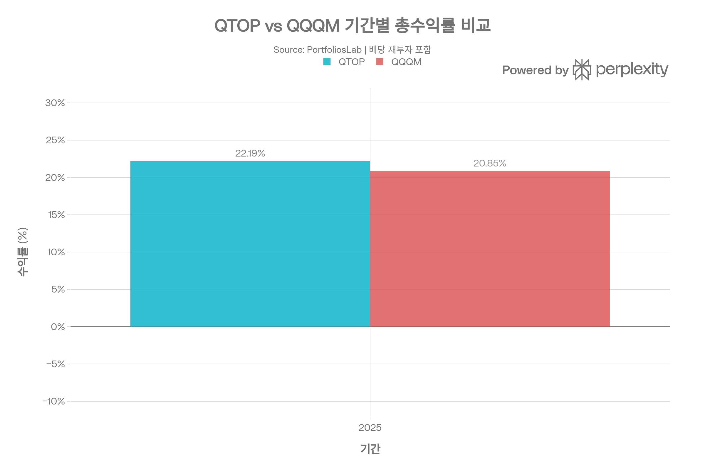

# QTOP (iShares Nasdaq Top 30 Stocks ETF) 종합 분석 보고서
> <strong>작성 기준일:</strong> 2026년 5월 3일 | <strong>데이터 출처:</strong> BlackRock/iShares 공식 사이트, Morningstar, PortfoliosLab, Nasdaq Index Research, Reuters 등

## ETF 분류

| 항목 | 내용 |
|------|------|
| <strong>최종 폴더</strong> | `ETF/Broad Market/Nasdaq-100/Top 30/QTOP` |
| <strong>대분류</strong> | 대표지수 |
| <strong>하위 분류</strong> | Nasdaq-100 / Top 30 |
| <strong>핵심 전략</strong> | Nasdaq-100 구성 종목 중 시가총액 상위 30개 종목을 수정 시가총액 가중 방식으로 추종 |
| <strong>운용 방식</strong> | 패시브 |
| <strong>레버리지·인버스 여부</strong> | 아니오 |
| <strong>옵션 인컴 전략 여부</strong> | 아니오 |
| <strong>분류 판단</strong> | QTOP은 레버리지·옵션 인컴 구조가 없는 Nasdaq-100 대표지수의 메가캡 집중 변형 ETF이므로 `Broad Market/Nasdaq-100/Top 30`으로 분류한다. |

***
## 1. 기본 정보
| 항목 | 내용 |
|------|------|
| 티커 | QTOP |
| 전체명 | iShares Nasdaq Top 30 Stocks ETF |
| 운용사 | BlackRock (iShares) |
| 상장거래소 | NASDAQ |
| CUSIP | 46438G562 |
| 설정일 | <strong>2024년 10월 23일</strong>[1][2] |
| 운용기간 | 약 6개월 (2026년 5월 기준) |
| 순자산(AUM) | 약 <strong>$2억 7,126만</strong>[1] |
| 총 보수(Expense Ratio) | <strong>0.20%</strong>[3][4] |
| 추종 지수 | Nasdaq-100 Top 30™ Index (NDX30™)[5][6] |
| 총 종목 수 | 31개 (시리즈 포함)[4] |
| 포트폴리오 회전율 | 13%[7] |
| 배당 주기 | 분기배당[1] |
| 운용 매니저 | Matt Waldron, Jennifer Hsui, Paul Whitehead[8] |
| P/E 비율 | 41.31배[4] |
| P/B 비율 | 11.43배[4] |

QTOP은 2024년 10월 24일 BlackRock이 발표하고 다음 날 나스닥에 상장한 신생 메가캡 ETF입니다. 나스닥-100 지수 구성 종목 중 <strong>시가총액 상위 30개</strong> 비금융 기업에 집중 투자하며, 0.20%의 낮은 비용률로 '매그니피센트 세븐(M7)' 외 나스닥 대형주에 효율적으로 노출되는 도구로 설계되었습니다.[6][9][10][11]

***
## 2. 상장 배경 및 BlackRock의 의도
BlackRock은 2024년 10월 QTOP, QNXT(iShares Nasdaq-100 ex-Top 30 ETF), TOPT(iShares Top 20 U.S. Stocks ETF) 3종 ETF를 동시 출시하며 <strong>"iShares Build ETFs"</strong> 시리즈를 선보였습니다. 이 제품군은 투자자가 미국 시가총액 구간별로 노출을 세분화하여 자신의 투자 전략에 맞게 포트폴리오를 구성할 수 있도록 설계되었습니다.[9]

캘리포니아대학교(UC) 최고투자책임자 Jagdeep Singh Bachher는 QTOP 초기 투자자로 참여하며 "개인 투자자, 특히 젊은 투자자들이 성장 잠재력이 높은 혁신 기업에 쉽게 접근할 수 있도록 한다"고 언급했습니다. CNBC는 이 ETF를 '매그니피센트 세븐을 넘어 확장하는 메가캡 ETF'로 소개했습니다.[11][9]

***
## 3. 추종 지수: Nasdaq-100 Top 30™ Index (NDX30™)
### 지수 개요 및 선별 방법론
<strong>Nasdaq-100 Top 30™ Index(NDX30™)</strong>는 2024년 8월 26일 나스닥이 출시한 지수로, 나스닥-100 지수(NDX)에서 시가총액 기준 상위 30개 종목을 선별해 <strong>수정 시가총액 가중(Modified Market-Cap Weighted)</strong> 방식으로 구성합니다.[12][13]

<strong>지수 가중치 결정 프로세스:</strong>
1. 나스닥-100 유니버스에서 시가총액 상위 30개 종목 선별[13][12]
2. 기본 시가총액 비중으로 초기 가중치 설정
3. <strong>최대 비중 제한 단계 1:</strong> 단일 종목 최대 비중 <strong>22.5%</strong> 초과 시 초과분 분배[14][13]
4. <strong>최대 비중 제한 단계 2:</strong> 4.5% 이상 종목들의 합산 비중이 <strong>48%</strong>를 초과하면 해당 종목들을 반복 조정하여 한도 내로 압축[14][13]
5. 동일 기업의 복수 주식(GOOGL/GOOG 등)은 동일 조정 계수 적용[13]

<strong>최종 지수 제약:</strong>
- 단일 종목 최대 비중: 22.5%[13]
- 4.5% 이상 종목 합산 비중: 최대 48%[14]

<strong>리밸런싱:</strong> 나스닥-100과 연동된 분기별 구성 검토[13]

이 구조는 QQQ/QQQM의 나스닥-100 전체(101개 종목)와 달리 상위 30개에만 집중하여 <strong>메가캡 순수 노출</strong>을 제공하되, 단일 종목 집중을 방지하는 이중 상한 구조를 갖춥니다.[14]

***
## 4. 비용 구조
| 항목 | 내용 |
|------|------|
| 총 보수율(Expense Ratio) | <strong>0.20%</strong>[3][4] |
| 관리보수(Management Fee) | 0.20%[3] |
| 기타 비용 | 0.00%[3] |
| 포트폴리오 회전율 | 13%[7] |
| 30일 중간 호가 스프레드 | <strong>0.03%</strong>[1] |
| 30일 SEC 수익률 | 0.30%[4][1] |
| 12개월 추적 수익률 | 0.42%[4] |
### 경쟁 나스닥 100 ETF 비용 비교
| ETF | 운용사 | 전략 | 비용률 | AUM |
|-----|--------|------|--------|-----|
| QQQM | Invesco | 나스닥-100 전체 (패시브) | 0.15% | \~$487억 |
| QQQ | Invesco | 나스닥-100 전체 (패시브) | 0.20% | \~$3,200억 |
| <strong>QTOP</strong> | <strong>BlackRock</strong> | <strong>나스닥-100 상위 30종목</strong> | <strong>0.20%</strong> | <strong>\~$2.7억</strong> |
| QNXT | BlackRock | 나스닥-100 하위 71종목 | 0.20% | 소규모 |

Morningstar는 QTOP의 비용이 동종 그룹 내 최저 비용 5분위 안에 든다고 평가했습니다. 0.20%는 QQQ와 동일한 수준으로, QQQM(0.15%)보다는 0.05%p 높지만 유의미한 차이는 아닙니다. 포트폴리오 회전율 13%는 QQQ/QQQM의 8\~13%와 유사한 수준입니다.[7][15]

***
## 5. 유동성 평가
| 항목 | 내용 |
|------|------|
| 현재 주가 (2026/05/01) | $35.18\~$35.57[1][16] |
| 일 평균 거래량 (3개월) | 약 152,890주[16] |
| AUM | 약 $2억 7,126만[1] |
| 52주 최저 / 최고 | $24.21 / \~$39.32[16][17] |
| 30일 중간 호가 스프레드 | <strong>0.03%</strong>[1] |
| 발행 주식 수 | 7,640,000주[1] |
| 프리미엄/디스카운트 | 0.00% (2026/04/30)[1] |
| 옵션 거래 가능 | 미공개 |

30일 중간 호가 스프레드 0.03%는 QQQ(0.01%)보다 넓지만 매우 좁은 수준으로, AUM($2.7억) 대비 우수한 유동성입니다. 이는 BlackRock의 대규모 ETF 생태계와 시장 조성 능력 덕분입니다. 다만 일 거래량 약 15만 주는 대규모 기관 거래 시 슬리피지가 발생할 수 있는 수준입니다.[1]

***
## 6. 포트폴리오 구성
### 상위 보유 종목 (2026년 4월 기준)

| 순위 | 종목명 | 티커 | 비중 |
|------|--------|------|------|
| 1 | NVIDIA Corp | NVDA | 12.14%[16] |
| 2 | Apple Inc | AAPL | 9.05%[16] |
| 3 | Microsoft Corp | MSFT | 7.28%[16] |
| 4 | Amazon.com Inc | AMZN | 6.46%[16] |
| 5 | Alphabet Inc (Class A) | GOOGL | 4.70%[16] |
| 6 | Broadcom Inc | AVGO | 4.68%[16] |
| 7 | Alphabet Inc (Class C) | GOOG | 4.37%[16] |
| 8 | Meta Platforms | META | 4.23%[16] |
| 9 | Walmart Inc | WMT | 4.02%[16] |
| 10 | Micron Technology | MU | 3.85%[16] |

상위 10개 종목 합산 비중은 약 <strong>60.8%</strong>로, 상위 4개(NVDA, AAPL, MSFT, AMZN)가 전체의 약 34.9%를 차지합니다. QQQ/QQQM 대비 하위 71개 종목의 소형 비중이 없어 동일 종목들이 상대적으로 더 높은 비중을 갖습니다.[16][18]
### 섹터별 배분

| 섹터 | 비중 |
|------|------|
| 기술주 (Technology) | 58.53%[16] |
| 통신 서비스 (Communication Services) | 17.15%[16] |
| 경기소비재 (Consumer Cyclical) | 10.27%[16] |
| 필수소비재 (Consumer Defensive) | 8.30%[16] |
| 헬스케어 (Healthcare) | 3.33%[16] |
| 기초소재 (Basic Materials) | 1.54%[16] |
| 산업재 (Industrials) | 0.88%[16] |

기술주 비중 58.53%는 QQQ/QQQM(약 54%)보다 높으며, 상위 30종목 집중으로 비기술 섹터의 비중이 상대적으로 낮습니다. 필수소비재(8.30%)는 Walmart와 Costco의 포함으로 QQQ 대비 비중이 높습니다.[18]

***
## 7. 성과 분석
### 기간별 수익률 (2026년 4월 30일 기준)

| 기간 | QTOP NAV | QTOP 시장가 | 비고 |
|------|----------|-----------|------|
| 1개월 | -4.28% | — | [4] |
| 3개월 (= YTD) | -6.25% | — | [4] |
| 6개월 | -3.52% | — | [4] |
| 1년 | <strong>+26.61%</strong> | <strong>+26.70%</strong> | [4] |
| 설정 이후 연환산 | <strong>+22.47%</strong> | <strong>+22.47%</strong> | [4] |
| 2025 연간 (시장가) | <strong>+22.19%</strong> | — | [19] |
| 2024 (설정 이후) | +5.80% | — | [19] |
| 2026 YTD (PortfoliosLab) | -6.23% | — | [19] |
| YTD (Yahoo Finance, 4/30) | <strong>+10.18%</strong> | — | [20] |

> <strong>참고:</strong> 출처마다 수익률 산정 기준일 및 배당 재투자 반영 여부 차이로 YTD 수치에 편차가 있습니다.
### QTOP vs QQQM 수익률 비교
| 기간 | QTOP | QQQM | 차이 |
|------|------|------|------|
| 2025 | +22.19% | +20.85% | <strong>+1.34%p</strong> QTOP 우세[19] |
| 2026 YTD | -6.23% | -5.92% | -0.31%p QTOP 불리[19] |
| 1년 수익률 | +26.61% | +23.76% | <strong>+2.85%p</strong> QTOP 우세[19] |
| 샤프 지수(1Y) | 1.14 | 1.06 | <strong>+0.08</strong> QTOP 우세[19] |
| 소르티노 비율 | 1.74 | 1.65 | <strong>+0.09</strong> QTOP 우세[19] |

나스닥-100 상위 30종목에 집중함으로써 짧은 운용 기간이지만 QQQM 대비 초과 수익과 위험 조정 성과 모두 소폭 우세합니다. 이는 2024\~2025년 메가캡 기술주 주도 장세 덕분입니다.[19]
### 위험 지표
| 지표 | 내용 |
|------|------|
| 베타 | 1.26[21] |
| 연간 표준편차 (1Y) | 17.22%[22] |
| 최대 낙폭 (설정 이후) | -27.01%[22] |
| 최대 낙폭 (1Y) | -12.36%[22] |
| P/E 비율 | 41.31배[4] |

베타 1.26은 나스닥-100(QQQ/QQQM의 베타 \~1.0)보다 높아, 메가캡 집중으로 인해 시장 방향성에 더 크게 반응합니다. 특히 2024년 4월부터 설정 이후 최대 낙폭 -27.01%는 관세 충격 등 시장 급락 시 집중 리스크가 현실화된 사례입니다.[21][22]

***
## 8. 추종 성과 지표
### 추적 오차 및 NAV 괴리율
| 항목 | 내용 |
|------|------|
| 복제 방식 | <strong>완전 복제(Full Replication)</strong> — 실물 주식 보유[22] |
| NAV 프리미엄/디스카운트 | <strong>0.00%</strong> (2026/04/30 기준)[1] |
| 30일 중간 호가 스프레드 | 0.03%[1] |
| 1년 추적 차이 | 소폭 (비용 0.20% 반영)[3] |
| Morningstar 평가 | 비용 최저 5분위 — 비용 경쟁력 우수[15] |

QTOP은 스왑 기반이 아닌 <strong>실물 주식 완전 복제</strong> 방식을 채택하여, 추적 오차와 카운터파티 리스크가 없습니다. NAV 대비 시장가 괴리율은 0.00%로 매우 정확한 가격 발견을 보이며, 30일 중간 호가 스프레드 0.03%는 AUM 규모 대비 탁월한 수준입니다.[22][1]

***
## 9. 배당 정보
| 항목 | 내용 |
|------|------|
| 배당 주기 | 분기배당[1] |
| 12개월 추적 배당률 | 0.42%[4] |
| 30일 SEC 수익률 | 0.30%[4] |
| 배당성향(Payout Ratio) | 약 14.79%[17] |
### 분기 배당금 이력
| 기준일 | 주당 배당금 | 지급일 |
|--------|-----------|------|
| 2026/03/17 | $0.0315[23] | 2026/03/20 |
| 2025/09/15 | $0.0296 | 2025/09/19[24] |
| 2025/06/15 | $0.0335 | 2025/06/20[24] |
| 2025/03/17 | $0.0280 | 2025/03/21[25] |
| 2024/12/16 | $0.0283 | 2024/12/20[25] |

TTM 배당금 합계는 약 $0.12 수준으로, 배당 수익률 약 0.30\~0.42%는 성장주 집중 ETF 특성상 매우 낮습니다. QTOP은 배당 소득보다 <strong>자본 차익(Capital Gain)</strong> 중심의 ETF입니다. 분기별 배당금은 $0.027\~$0.033 수준으로 비교적 안정적입니다.[4][17][24]

***
## 10. 리스크 요소
### 주요 리스크 요약
| 리스크 유형 | 내용 |
|-----------|------|
| 집중 리스크 | 상위 30종목만 편입, 상위 4종목이 34.9% 차지[16] |
| 기술주 집중 리스크 | 기술 섹터 58.53%, AI·반도체 사이클에 민감[16] |
| 짧은 운용 이력 리스크 | 설정 후 약 6개월, 약세장 검증 미흡[2] |
| 메가캡 밸류에이션 리스크 | P/E 41.31배, 고평가 해소 시 급락 가능[4] |
| 유동성 리스크 | 일 거래량 15만 주, 대규모 매매 시 슬리피지[16] |
| 높은 베타 리스크 | 베타 1.26으로 시장 대비 과도한 민감도[21] |
| 상방 집중·하방 노출 | 하위 71종목의 분산 효과 부재[18] |
| 규제·반독점 리스크 | 빅테크 규제 강화 시 주요 보유 종목 타격 가능 |

<strong>집중 vs 분산의 트레이드오프:</strong> QTOP은 나스닥-100의 하위 71개 종목(QNXT가 커버)을 제외함으로써, 성장성 집중도를 높이는 대신 분산 효과를 희생합니다. 상위 메가캡의 강세장에서는 QQQ/QQQM을 초과 성과할 가능성이 높지만, 메가캡 주도 약세 시 더 큰 손실을 야기할 수 있습니다.[9]

***
## 11. 경쟁 ETF 종합 비교
| 항목 | <strong>QTOP</strong> | QQQ | QQQM | QNXT |
|------|----------|-----|------|------|
| 운용사 | BlackRock | Invesco | Invesco | BlackRock |
| 전략 | 나스닥-100 상위 30 | 나스닥-100 전체 | 나스닥-100 전체 | 나스닥-100 하위 71 |
| 종목 수 | 31 | 101 | 101 | \~71 |
| 비용률 | 0.20% | 0.20% | 0.15% | 0.20% |
| AUM | \~$2.7억 | \~$3,200억 | \~$487억 | 소규모 |
| 2025 수익률 | +22.19% | \~+20.85% | +20.85% | — |
| 1Y 수익률 | +26.61% | \~+23.76% | +23.76% | — |
| 샤프(1Y) | 1.14 | — | 1.06 | — |
| 베타 | 1.26 | \~1.0 | \~1.0 | — |
| 배당률(12M) | 0.42% | 0.55\~0.64% | 0.64% | — |
| 복제 방식 | 실물 | 실물 | 실물 | 실물 |
| 설정 이력 | 2024.10 | 1999.03 | 2020.10 | 2024.10 |

***
## 12. 투자 요약 및 핵심 결론
QTOP은 나스닥-100의 메가캡 30종목에 0.20%의 낮은 비용으로 집중 투자하는 혁신적인 도구입니다. 짧은 운용 기간이지만 QQQM 대비 1년 기준 +2.85%p의 초과 수익과 더 높은 샤프 지수를 기록하여, 메가캡 주도 장세에서의 전략적 유효성을 초기적으로 입증했습니다. 특히 실물 완전 복제 방식, 0.03%의 좁은 스프레드, NAV 괴리율 0.00%는 운용 품질이 높음을 시사합니다.[3][19][1][9]

<strong>QTOP에 적합한 투자자:</strong>
- 나스닥 최대 메가캡 기업들에 집중 노출을 원하는 투자자
- QQQ/QQQM 대비 더 강한 메가캡 포지션을 원하는 성장 투자자
- QNXT와 결합해 나스닥-100 전체를 비중 조절 투자하고자 하는 투자자

<strong>주요 한계:</strong>
- 설정 후 약 6개월로 완전한 시장 사이클 검증 미비[2]
- QQQM(0.15%) 대비 0.05%p 높은 비용, 3Y/5Y 수익률 데이터 미존재[19]
- 베타 1.26으로 하락장에서 시장보다 큰 손실 가능성[21]
- 설정 이후 최대 낙폭 -27.01%로 집중 리스크 현실화 가능[22]
