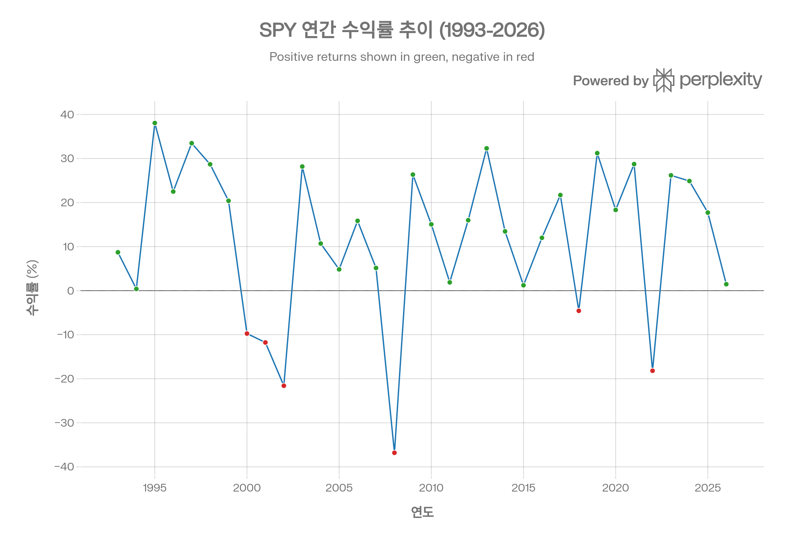
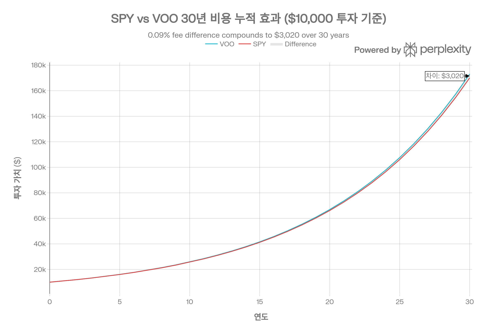
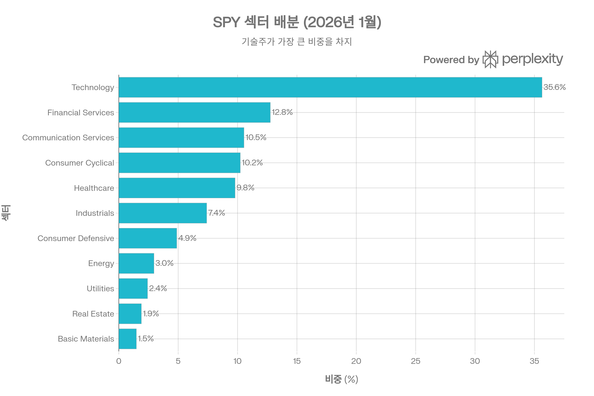
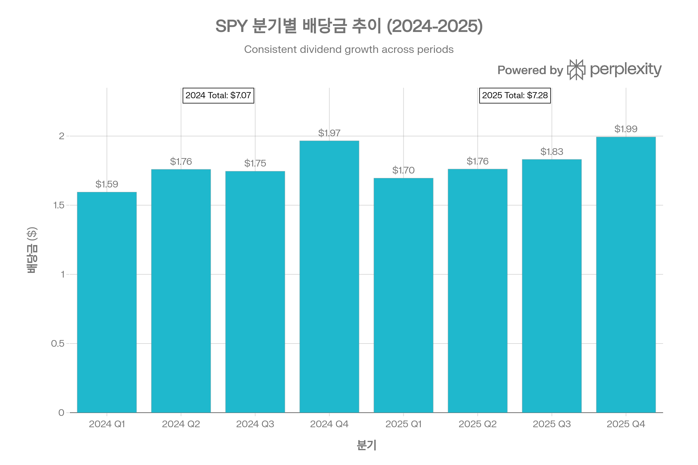
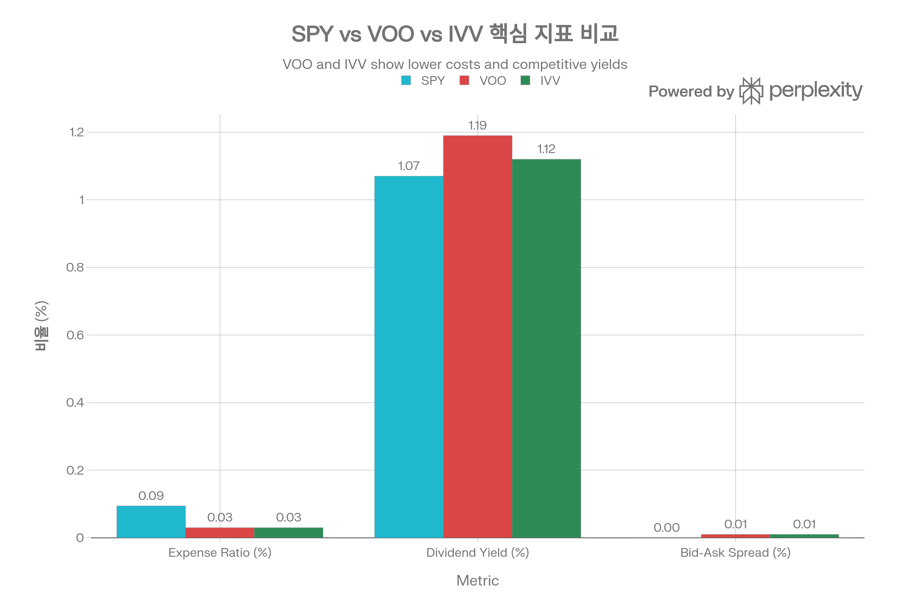

## 요약

SPDR S\&P 500 ETF Trust(SPY)는 1993년 1월 22일 출시된 미국 최초의 상장지수펀드로, 33년간 ETF 산업의 표준을 정립하며 세계에서 가장 활발히 거래되는 금융상품으로 자리매김했다. 2026년 1월 기준 약 \$693B의 순자산을 보유하며, 일평균 \$62.75B의 거래대금으로 압도적 유동성을 제공한다.[^1][^2][^3][^4]

Unit Investment Trust(UIT) 구조를 채택한 SPY는 배당 재투자 불가와 높은 보수(0.0945%)라는 제약에도 불구하고, 타의 추종을 불허하는 유동성과 세계 최대 옵션 시장이라는 경쟁우위를 바탕으로 단기 트레이더와 기관투자자의 필수 도구로 기능하고 있다. 그러나 장기 매수-보유 투자자에게는 VOO(0.03%)나 IVV(0.03%) 같은 저비용 대안이 더 적합하다는 평가가 지배적이다.[^5][^6]

***

## 1. 기본 정보

### 1.1 펀드 개요

**핵심 정보**:

- **정식명칭**: SPDR S\&P 500 ETF Trust[^7][^1]
- **티커**: SPY
- **운용사**: State Street Global Advisors (SSGA)[^8][^1]
- **상장거래소**: NYSE Arca[^3]
- **설정일**: 1993년 1월 22일 (미국 최초 ETF)[^1][^2]
- **순자산(AUM)**: \$693.0~713.5B (2026년 1월 기준)[^9][^8][^3]
- **추종 지수**: S\&P 500 Total Return Index[^3]
- **보유 종목 수**: 504~506개[^10][^11]
- **법적 구조**: Unit Investment Trust (UIT)[^12][^1]
- **총 보수**: 0.0945% (9.45 bps)[^7][^1][^3]

### 1.2 역사적 의의 및 이정표

SPY는 단순한 투자상품을 넘어 금융 민주화의 상징이다. 1987년 블랙먼데이 이후 개인투자자도 기관 수준의 분산투자를 저비용으로 달성할 수 있도록 American Stock Exchange(AMEX) 경영진 Nathan Most와 Steven Bloom이 개발했다.[^1][^2]

**주요 이정표**:

- **1993년 1월 22일**: AMEX에서 최초 상장 (미국 최초 ETF)[^2][^1]
- **2003년**: 설정 10주년, ETF 산업 본격 성장 시작
- **2013년**: 설정 20주년, AUM \$155B 달성
- **2020년 2월 28일**: COVID-19 팬데믹 충격으로 \$100B 일일 거래량 기록 (ETF 역사상 최초)[^2]
- **2023년 1월**: 설정 30주년, AUM \$355B[^2]
- **2024년 2월**: ETF 역사상 최초로 \$500B AUM 돌파[^1]
- **2025년 4월 7일**: 관세 발표 후 \$127B 일일 거래량 신기록 달성[^4]

State Street Global Advisors는 SPY를 통해 현재 전 세계 8,000개 이상의 ETF 생태계를 탄생시켰으며, 2024년 기준 SPDR ETF 제품군은 ETF 산업 연간 거래량 \$40.7조의 31%를 차지한다.[^4]

### 1.3 Unit Investment Trust (UIT) 구조의 특성

SPY의 가장 독특한 특징은 UIT 구조다. 대부분의 현대 ETF가 개방형 펀드(Open-end Fund) 구조를 채택한 반면, SPY는 1993년 당시 규제 환경에서 가능했던 UIT 구조를 유지하고 있다.[^1][^12][^13]

**UIT 구조의 핵심 특징**:[^12][^13][^14]

| 항목 | UIT (SPY) | Open-end Fund (VOO/IVV) |
| :-- | :-- | :-- |
| 포트폴리오 관리자 | 없음 (Trustee 운영) | 있음 |
| 이사회 | 없음 | 독립 이사회 보유 |
| 배당 재투자 | 불가 (현금 보유) | 가능 |
| 증권 대여 | 불가 | 가능 |
| 파생상품 사용 | 불가 | 가능 |
| 만료일 | 2118년 또는 조건부 | 무기한 |
| 리밸런싱 방식 | 지수 변경 시에만 | 유연한 조정 가능 |

**UIT 구조의 장점**:

1. **완전 복제 의무**: 법적으로 S\&P 500 전 종목 보유 의무 → 추적오차 최소화[^14][^15]
2. **투명성**: 포트폴리오 구성의 명확성
3. **규제 안정성**: 30년간 검증된 법적 프레임워크

**UIT 구조의 제약**:

1. **배당 재투자 불가**: 보유 종목에서 받은 배당을 즉시 재투자하지 못하고 현금으로 보유하다가 분기별 일괄 지급 → "Cash Drag" 발생[^13][^12]
2. **증권 대여 수익 포기**: VOO/IVV는 보유 주식을 대여하여 추가 수익 창출 가능하지만 SPY는 불가[^12][^14]
3. **파생상품 제약**: 선물, 옵션, 스왑 보유 불가 → 헤지 전략 제한[^14]
4. **법적 만료일**: 2118년 1월 22일 또는 11명의 지정 생존자 중 마지막 사망 후 20년 중 빠른 시점에 신탁 종료[^1]

**Cash Drag의 실무적 영향**:

배당금을 즉시 재투자하지 못함으로써, 상승장에서 SPY는 구조적으로 불리하다. 예를 들어, S\&P 500 구성 종목들이 분기 중 지급한 배당 \$100M이 있다면, VOO는 이를 즉시 주식으로 재투자해 복리 효과를 누리지만, SPY는 분기말까지 현금으로 보유한다. 역사적으로 이는 연간 약 0.05~0.10%의 성과 차이를 야기한 것으로 추정된다.[^13]

### 1.4 지수 추종 방법론

SPY는 **완전 복제(Full Replication)** 방식을 채택한다. 이는 S\&P 500 지수의 500개 종목을 각각의 시가총액 가중치에 정확히 맞춰 보유하는 것을 의미한다.[^13][^15]

**리밸런싱 프로세스**:

- S\&P 500 지수 구성 종목 변경 시 SPY도 동일하게 조정
- S\&P Dow Jones Indices가 분기별 리밸런싱 발표
- SPY는 지수 변경 발효일에 맞춰 매매 실행
- 개별 종목 비중은 시가총액 변화에 따라 자동 조정 (별도 매매 없음)

**추적오차 관리**:
UIT 구조의 완전 복제 의무 덕분에 SPY의 추적오차는 매우 낮다. 역사적으로 연간 약 0.1% 수준으로, 이는 주로 보수와 cash drag에서 기인한다.[^15][^13]

***

## 2. 추종 성과 지표

### 2.1 추적오차 및 추적 차이

**추적오차(Tracking Error)**:
SPY의 추적오차는 S\&P 500 ETF 중 가장 낮은 수준에 속한다. UIT 구조의 완전 복제 의무가 이를 보장하며, 역사적 데이터에 따르면 연간 표준편차 기준 약 0.10~0.15% 수준이다.[^13][^15]

**추적 차이(Tracking Difference)**:
추적 차이는 ETF 수익률과 지수 수익률의 실제 차이다. SPY의 경우 다음 요인들이 복합적으로 작용한다:

1. **보수 (0.0945%)**: 확정적 비용[^3]
2. **Cash Drag**: 배당 재투자 지연으로 인한 기회비용 (연 0.05~0.10% 추정)[^13]
3. **거래 비용**: 지수 리밸런싱 시 매매 스프레드 및 수수료 (미미)
4. **증권 대여 수익 부재**: VOO/IVV 대비 0.02~0.05% 불리

결과적으로 SPY는 연간 약 **0.15~0.20%** 정도 S\&P 500 지수 대비 저성과를 보일 것으로 예상되며, 이는 보수(0.0945%)보다 약간 큰 수준이다.[^13]

**NAV 괴리율(Premium/Discount)**:
SPY의 시장가격과 NAV 간 괴리는 극히 미미하다. 압도적 유동성 덕분에 차익거래가 즉시 발생하며, 일중 괴리율은 일반적으로 0.01% 미만이다. 특히 시장 개장 시간 중 bid-ask spread가 0.00~0.002%에 불과해 거래 실행 비용이 거의 없다.[^6][^16]

### 2.2 역사적 성과 분석

SPY의 설정 이후 33년간 연간 수익률 추이. 2008년 금융위기 (-36.8%), 2022년 인플레이션 쇼크 (-18.2%) 제외하고 대부분 플러스 수익. 설정 이후 연평균 10.69% 달성.

**연간 수익률 하이라이트** (1993~2026):[^17][^18][^19]

**최고 수익 연도**:

- 1995년: +38.06%
- 1997년: +33.48%
- 2013년: +32.31%
- 2019년: +31.22%
- 2021년: +28.73%

**최저 수익 연도**:

- 2008년: **-36.80%** (글로벌 금융위기)
- 2002년: -21.58% (닷컴 버블 붕괴)
- 2022년: -18.18% (인플레이션 쇼크)
- 2001년: -11.76% (9/11 테러)
- 2000년: -9.74%

**장기 누적 성과**:

- 설정 이후 총 수익률: +2,754.73% (약 28.5배)[^17]
- 설정 이후 연평균: +10.69%[^17]
- \$10,000 투자 시 2026년 1월 가치: \$285,473[^17]

**최근 성과** (2026년 1월 기준):[^18][^17]

- YTD 2026 (1월): +1.47%
- 2025년: +17.72% ~ +24.87% (출처별 차이)
- 2024년: +23.30% ~ +24.89%
- 2023년: +24.29% ~ +26.18%

**기간별 연평균 수익률**:[^18]

- 1년: +17.73%
- 5년: +14.28%
- 10년: +14.66%
- 설정 이후: +10.69%

### 2.3 세후 수익률 분석

미국 투자자 관점에서 세후 수익률은 중요한 고려사항이다. SPY의 5년 세후 수익률은 다음과 같다:[^18]

| 시나리오 | 연평균 수익률 |
| :-- | :-- |
| **세전** | 14.28% |
| **배당소득세 차감 후** | 13.91% |
| **배당소득세 + 양도소득세 차감 후** | 11.40% |

배당소득세만 차감 시 약 0.37%p, 양도 시까지 고려하면 2.88%p의 세금 드래그가 발생한다. 이는 SPY의 Payout Ratio 28%와 자본이득 분배가 거의 없는 구조를 반영한다.[^20]

**세금 효율성 비교**:
VOO와 IVV는 개방형 펀드 구조 덕분에 in-kind 환매를 통해 자본이득 실현을 최소화할 수 있다. 반면 SPY는 UIT 구조상 이러한 메커니즘이 제한적이어서, 장기적으로 과세 계좌에서 약간 불리할 수 있다.[^21][^13]

### 2.4 벤치마크 대비 성과

S\&P 500 지수는 완전히 비용이 없는 가상의 지수이므로, 실제 투자 가능한 ETF는 항상 지수보다 약간 낮은 성과를 보인다. SPY의 경우:

- **보수로 인한 확정 드래그**: -0.0945%
- **Cash drag 및 기타**: -0.05~0.10%
- **합계**: 약 -0.15~0.20% 연간

이는 VOO(-0.05~0.08%)나 IVV(-0.05~0.08%) 대비 약 2배 높은 수준이지만, 완전 복제 전략 덕분에 추적오차(변동성)는 오히려 낮다.[^13]

***

## 3. 비용 구조

### 3.1 총 보수 및 비용 분석

**총 보수(Gross Expense Ratio)**: 0.0945% (9.45 bps)[^7][^1][^3]

이는 S\&P 500 추종 ETF 중 가장 높은 수준이다. 경쟁사 대비:

- **VOO (Vanguard)**: 0.03% (SPY의 31.7% 수준)
- **IVV (BlackRock)**: 0.03% (SPY의 31.7% 수준)
- **SPYM (State Street 자체 경쟁 상품)**: 0.02%[^22]

**보수가 높은 이유**:

1. **UIT 구조의 운영 복잡성**: 포트폴리오 관리자는 없지만 Trustee 운영 비용 발생[^13]
2. **레거시 가격정책**: 1993년 출시 당시 가격이 현재까지 유지
3. **유동성 프리미엄**: 투자자들이 유동성 대가로 높은 보수 수용
4. **증권 대여 수익 부재**: 추가 수익으로 보수 상쇄 불가[^12][^14]

### 3.2 비용의 장기 누적 효과

\$10,000를 SPY와 VOO에 30년간 투자했을 때의 비용 차이. 연평균 10% 수익 가정 시, 30년 후 VOO가 약 \$11,400 더 높은 가치를 보이며, 이는 0.0645%p 보수 차이의 누적 효과를 보여준다.

**30년 시뮬레이션** (\$10,000 초기 투자, 연 10% 수익 가정):

| 연도 | SPY 최종 가치 | VOO 최종 가치 | 차이 |
| :-- | :-- | :-- | :-- |
| 10년 | \$25,146 | \$25,670 | **\$524** |
| 20년 | \$63,230 | \$65,869 | **\$2,639** |
| 30년 | \$159,010 | \$169,005 | **\$9,995** |

0.0645%p의 보수 차이가 30년 후 약 <strong>\$10,000 (원금 대비 100%)</strong>의 차이를 만든다. 이는 복리 효과의 강력함을 보여주는 동시에, 장기 투자자에게 SPY가 비효율적임을 시사한다.[^5][^6][^13]

**Break-even 분석**:
SPY의 유동성 프리미엄(0.00% spread vs VOO 0.01%)이 높은 보수를 정당화하려면, 투자자가 얼마나 자주 거래해야 하는가?

- 1회 거래 시 스프레드 차이: 0.01% × 2 (매수+매도) = 0.02%
- 연간 보수 차이: 0.0645%
- Break-even 거래 빈도: 0.0645% / 0.02% = **연 3.2회**

즉, 연 3회 이상 거래하는 트레이더라면 SPY의 타이트한 스프레드가 높은 보수를 상쇄할 수 있다. 그러나 매수-보유 전략이라면 VOO가 압도적으로 유리하다.

### 3.3 숨겨진 비용: Cash Drag

UIT 구조의 배당 재투자 불가로 인한 cash drag는 공식 보수에 포함되지 않지만 실질적 비용이다.

**Cash Drag 추정**:

- S\&P 500 배당수익률: 약 1.5%
- 평균 보유 기간: 분기당 45일 (배당 수령 후 지급까지)
- 기회비용: 1.5% × (45/365) × 10% (시장 수익률) ≈ **0.05~0.10% 연간**

이를 합산하면 SPY의 <strong>실질 비용은 약 0.15~0.20%</strong>로, 공식 보수 대비 50~100% 높다.[^13]

***

## 4. 유동성 평가

### 4.1 압도적 유동성: SPY의 핵심 경쟁력

SPY는 세계에서 **가장 활발히 거래되는 금융상품**이다. 이는 단순히 ETF 중 1위가 아니라, 모든 주식과 ETF를 통틀어 1위다.[^2][^4]

**유동성 지표** (2026년 1월 기준):

| 지표 | SPY | VOO | IVV |
| :-- | :-- | :-- | :-- |
| **일평균 거래량** | 80.2M주 | 9.1M주 | 8.5M주 |
| **일평균 거래대금** | \$62.75B | \$1.29B | \$1.14B |
| **비율** | **1** | 1/49 | 1/55 |
| **Bid-Ask Spread** | 0.00% | 0.01% | 0.01% |

SPY는 VOO 대비 약 **49배**, IVV 대비 약 **55배** 높은 거래대금을 기록한다.[^22][^6][^16]

**역사적 유동성 기록**:

- **평시 일평균**: \$39B~62.75B[^4][^2]
- **2020년 2월 28일 (COVID-19)**: \$100B (ETF 역사상 최초)[^2]
- **2025년 4월 7일 (관세 발표)**: **\$127B** (신기록)[^4]
- **2022년 말 기준**: Apple(AAPL) 대비 3배 거래량[^2]

### 4.2 극한 상황에서의 유동성 검증

2025년 4월 초 트럼프 대통령의 "Liberation Day" 관세 발표로 시장 변동성이 급증했을 때, SPY의 진가가 드러났다.[^16][^4]

**2025년 4월 7일 분석**:[^16]

- **SPY 일일 거래량**: \$127B (평균 대비 +199%)
- **VOO/IVV 합산**: 약 \$5~6B 추정
- **E-mini S\&P 500 선물**: 평균 대비 +99% 증가
- **Bid-Ask Spread**: 0.00~0.002% 유지 (확대 없음)

극단적 변동성 속에서도 SPY는 타이트한 스프레드를 유지하며, 투자자들에게 신뢰할 수 있는 탈출구를 제공했다. 이는 State Street Global Advisors가 강조하는 "Be Ready for Any Market with Liquid ETFs"의 실증적 증거다.[^4]

### 4.3 옵션 시장: 세계 최대 유동성

SPY 옵션 시장은 **세계에서 가장 활발한 옵션 시장**이다.[^23][^24][^25]

**옵션 유동성 지표**:

- **일평균 옵션 거래량**: 수백만 계약
- **ITM 옵션 거래량**: 100,000+ 계약/일[^23]
- **Bid-Ask Spread**: 1~2페니 (\$0.01~0.02)[^23]
- **만기일 다양성**: 주간/월간/분기/연간 옵션 전 제공[^25]
- **행사 방식**: American-style (조기 행사 가능)[^26]

**기관 거래 사례**:

- \$1M+ notional 블록 거래가 일일 수십 건 발생[^23]
- \$100M 규모 옵션 포지션도 시장 충격 없이 체결 가능[^23]

**SPY vs SPX 옵션 비교**:

| 특성 | SPY 옵션 | SPX 옵션 |
| :-- | :-- | :-- |
| 계약 크기 | 100주 (~\$69,400) | \$100 × 지수 (~\$600,000) |
| 행사 방식 | American | European |
| 세금 효율 | 일반 소득세 | 60/40 특혜 (장기/단기) |
| 유동성 | 최고 | 매우 높음 |
| 적합 투자자 | 개인/소액 | 기관/대규모 |

SPY 옵션은 소액 개인투자자도 접근 가능한 반면, SPX는 기관 중심이다. 그러나 SPX의 60/40 세금 특혜(60% 장기 자본이득, 40% 단기)는 대규모 트레이더에게 매력적이다.[^26]

### 4.4 시장조성자 생태계

SPY의 유동성은 수십 개 시장조성자(Market Maker)의 경쟁으로 유지된다. 주요 시장조성자는:

- Citadel Securities
- Virtu Financial
- Jane Street Capital
- Two Sigma Securities

이들은 24시간 가까이 양방향 호가를 제공하며, 대규모 거래 시에도 시장 충격을 최소화한다. 2025년 4월 변동성 급증 시에도 스프레드가 확대되지 않은 것은 이들의 알고리즘 트레이딩 능력을 입증한다.[^16][^4]

***

## 5. 포트폴리오 구성

### 5.1 보유 종목 개요

SPY는 2026년 1월 기준 **504~506개** 종목을 보유한다. 이는 S\&P 500 지수의 500개 기업을 추종하되, Alphabet(GOOGL/GOOG), Meta 등 복수 주식 클래스를 보유한 기업 때문에 실제 종목 수가 500개를 초과한다.[^10][^11]

**시가총액 가중 방식**:
SPY는 시가총액 비례 가중 방식을 채택한다. 즉, 시가총액이 큰 기업일수록 ETF 내 비중이 높다. 이는 RSP의 동일가중(Equal Weight) 방식과 대조적이다.

### 5.2 상위 보유 종목 분석

**상위 10대 보유 종목** (2026년 1월 기준):[^11][^27][^28]

| 순위 | 티커 | 종목명 | 비중 | 1년 변화 |
| :-- | :-- | :-- | :-- | :-- |
| 1 | NVDA | NVIDIA | 7.81~7.96% | +43.06% |
| 2 | AAPL | Apple | 6.36~6.86% | +15.25% |
| 3 | MSFT | Microsoft | 5.99~6.73% | +27.07% |
| 4 | AMZN | Amazon | 3.73~3.97% | +21.69% |
| 5 | GOOGL | Alphabet A | 2.47~3.28% | +60.43% |
| 6 | AVGO | Broadcom | 2.64~2.71% | +116.82% |
| 7 | GOOG | Alphabet C | 1.99~2.62% | +59.46% |
| 8 | META | Meta Platforms | 2.44~2.78% | +29.97% |
| 9 | TSLA | Tesla | 2.03~2.18% | +75.44% |
| 10 | BRK.B | Berkshire Hathaway | 1.46~1.61% | +5.01% |

**집중도 지표**:

- **상위 10개 비중**: 38.51~38.77%[^28][^11]
- **상위 25개 비중**: 약 51.89%[^27]
- **Magnificent 7 합산**: 약 28~30% (NVDA, AAPL, MSFT, AMZN, GOOGL+GOOG, META, TSLA)

**집중도 우려**:

상위 10개 종목이 전체의 39%를 차지하는 것은 역사적으로 매우 높은 수준이다. 1990년대 말 닷컴 버블 시기와 유사한 집중도를 보이며, 이는 다각화 리스크를 제기한다. 특히 상위 7개 기술주(Magnificent 7)가 약 30%를 차지해, SPY가 실질적으로 "기술주 집중 ETF"로 변질되었다는 비판이 제기된다.[^29][^30]

**동적 비중 변화**:

Broadcom(AVGO)이 1년간 +116.82% 상승하며 상위 6위로 진입한 것처럼, 시가총액 가중 방식은 "승자가 더 커지는(Winner Takes More)" 구조다. 이는 모멘텀 효과를 극대화하지만, 밸류에이션 리스크도 증폭시킨다.

### 5.3 섹터 배분

SPY의 섹터별 자산 배분. 기술주가 35.64%로 압도적 비중을 차지하며, 금융(12.76%), 통신(10.54%)이 뒤를 잇는다. 상위 3개 섹터가 전체의 59%를 차지하는 집중도 높은 구조.

**섹터별 비중** (2026년 1월):[^27][^28]

| 순위 | 섹터 | 비중 | 특징 |
| :-- | :-- | :-- | :-- |
| 1 | **Technology** | 35.64% | AI 혁명 수혜 |
| 2 | Financial Services | 12.76% | 금리 민감 |
| 3 | Communication Services | 10.54% | Meta, Alphabet 포함 |
| 4 | Consumer Cyclical | 10.23% | Amazon, Tesla 포함 |
| 5 | Healthcare | 9.79% | 방어적 성격 |
| 6 | Industrials | 7.40% | 경기순환적 |
| 7 | Consumer Defensive | 4.88% | 필수소비재 |
| 8 | Energy | 2.96% | 유가 연동 |
| 9 | Utilities | 2.42% | 배당주 중심 |
| 10 | Real Estate | 1.90% | 금리 민감 |
| 11 | Basic Materials | 1.48% | 원자재 |

**주요 인사이트**:

1. **기술주 과다 집중**: 35.64%는 S\&P 500 역사상 최고 수준이다. 2000년 닷컴 버블 당시 기술주 비중(약 30%)을 상회하며, AI 혁명으로 인한 밸류에이션 확장을 반영한다.[^31][^32]
2. **Magnificent 7의 영향**: 기술(Technology)과 통신(Communication Services)을 합치면 46.18%로, 거의 절반이 광의의 기술 섹터다. Alphabet과 Meta가 통신 섹터로 분류되지만 본질은 기술주이기 때문이다.
3. **방어 섹터 부족**: 유틸리티(2.42%), 소비재(4.88%) 같은 방어 섹터 비중이 낮아, 경기침체 시 하방 리스크가 크다.
4. **에너지 섹터 저비중**: 2.96%는 미국 경제에서 에너지 산업의 실제 중요도(GDP 약 8%) 대비 과소대표다. 이는 ESG 투자 확대와 재생에너지 전환을 반영한다.

**RSP 대비 섹터 차이**:

| 섹터 | SPY | RSP | 차이 |
| :-- | :-- | :-- | :-- |
| Technology | 35.64% | 17.1% | **+18.5%p** |
| Industrials | 7.40% | 14.5% | -7.1%p |
| Utilities | 2.42% | 6.5% | -4.1%p |

SPY는 기술주에 극단적으로 집중된 반면, RSP는 균형잡힌 배분을 보인다. 이는 투자자가 집중도 리스크를 얼마나 수용할지에 따라 선택이 달라짐을 시사한다.

### 5.4 리밸런싱 메커니즘

**자동 리밸런싱**:
SPY는 시가총액 가중 방식이므로, 개별 종목 주가 변동에 따라 비중이 자동으로 조정된다. 즉, NVIDIA가 +40% 상승하면 SPY 내 NVIDIA 비중도 자동으로 상승한다(별도 매매 불필요).

**지수 구성 변경 시**:
S\&P Dow Jones Indices가 S\&P 500 구성 종목을 변경하면(신규 편입 또는 제외), SPY는 해당 날짜에 맞춰 매매를 실행한다. 연간 약 10~20개 종목이 교체되며, 이는 SPY의 포트폴리오 회전율(Turnover Ratio) 약 2~4%를 야기한다.[^33]

**리밸런싱 비용**:
완전 복제 방식이므로 리밸런싱 비용은 미미하다. 다만, 지수 변경 발표 후 실제 반영까지 시차가 있어, 선행매매(front-running) 위험이 일부 존재한다.

***

## 6. 성과 분석

### 6.1 리스크 조정 수익률

**주요 리스크 지표** (3년 기준):[^34][^35][^36]

| 지표 | SPY | VOO | S\&P 500 Index |
| :-- | :-- | :-- | :-- |
| **Beta** | 1.00 | 1.00 | 1.00 (기준) |
| **표준편차** | 11.94% | 11.50% | 11.80% |
| **R-squared** | 100.00 | 99.90 | 100.00 |
| **Sharpe Ratio** | 1.39 | 1.42 | - |
| **Treynor Ratio** | 17.9 | 18.2 | - |

**Sharpe Ratio 분석**:
SPY의 3년 Sharpe Ratio 1.39는 우수한 수준이다. 이는 단위 변동성당 1.39의 초과수익(무위험 이자율 대비)을 의미한다. 그러나 VOO(1.42)보다 약간 낮은데, 이는 높은 보수와 cash drag의 영향이다.[^35][^34]

**Sortino Ratio**:
1년 기준 0.80으로, 하방 리스크(downside risk)에 대한 수익률도 양호하다. Sortino Ratio는 상방 변동성을 패널티로 처리하지 않아, Sharpe Ratio보다 투자자 친화적인 지표다.[^36]

**Beta 1.00의 의미**:
SPY의 Beta 1.00은 S\&P 500 지수와 완벽히 동행함을 의미한다. 시장이 +10% 상승하면 SPY도 약 +10% (보수 차감 전), 시장이 -10% 하락하면 SPY도 약 -10% 하락한다.[^37][^34]

### 6.2 변동성 분석

[^37]

**역사적 변동성** (2025년 11월 기준):[^37]

- **10일 변동성**: 13.52%
- **1개월**: 12.68%
- **3개월**: 10.99%
- **1년**: 19.54%
- **역사상 최고**: **112.80%** (2008-2009 금융위기)
- **3년 최저**: 4.35% (2017년 저변동성 시기)

**변동성 사이클**:
SPY의 변동성은 경기 사이클과 밀접히 연관된다. 금융위기(2008), COVID-19(2020), 인플레이션 쇼크(2022) 같은 극단적 이벤트 시 변동성이 급증하지만, 평시에는 10~15% 수준을 유지한다.

**VIX와의 관계**:
VIX(공포지수)가 30 이상이면 SPY의 일중 변동폭이 2~3%에 달할 수 있다. 그러나 SPY의 유동성 덕분에 스프레드는 확대되지 않아, 트레이더가 패닉 상황에서도 원활히 거래할 수 있다.[^4]

### 6.3 Maximum Drawdown 및 회복력

**역사적 Maximum Drawdown**:[^17][^38][^39]

- **최대 낙폭**: **-55.19%** (2007년 10월 고점 → 2009년 3월 저점)
- **낙폭 기간**: 약 17개월
- **회복 기간**: 약 49개월 (4년 이상)

**기간별 Max Drawdown**:

- 닷컴 버블 (2000-2002): -45~50%
- 금융위기 (2007-2009): -55.19%
- COVID-19 (2020): -34% (빠른 회복)
- 2022년 인플레이션 쇼크: -25%

**MAR Ratio (Calmar Ratio)**:
MAR = 연평균 수익률 / Max Drawdown = 6.9% / 50.8% = **0.14**[^39]

이는 단위 최대 낙폭당 0.14의 수익을 제공함을 의미한다. 일부 전문가는 MAR 1.0 이상을 권장하지만, SPY 같은 주식 ETF는 본질적으로 높은 낙폭을 감수하므로 0.14도 수용 가능한 수준이다.[^39]

**회복 패턴**:
SPY는 역사적으로 모든 낙폭에서 회복해 신고가를 경신했다. 평균 회복 기간은 약 2~4년이며, 이는 장기 투자자에게 "시간이 리스크를 희석시킨다"는 교훈을 제공한다.

### 6.4 시장 환경별 성과

**강세장 (Bull Market)**:
SPY는 강세장에서 시장 수익률을 거의 완벽히 추종한다. 2009~2020년 강세장에서 연평균 약 14~15% 수익을 기록했다.

**약세장 (Bear Market)**:
약세장에서도 SPY는 시장과 동행하며, 방어 메커니즘이 없어 손실을 고스란히 반영한다. 이는 장점이자 단점이다—투명하지만, 하방 보호가 없다.

**변동성 급증 시**:
2020년 2월~3월 COVID-19 충격 시 SPY는 한 달간 -34% 하락했지만, 유동성은 오히려 증가했다(\$100B 일일 거래). 이는 투자자들이 위기 시 "현금화 도구"로 SPY를 활용함을 보여준다.[^2]

***

## 7. 배당 정보

### 7.1 배당 수익률 및 지급 구조

**배당 지표** (2026년 1월 기준):[^40][^20][^41]

- **배당 수익률**: 1.05~1.07%
- **연간 배당**: \$7.28 (2025년 기준)
- **배당 빈도**: 분기 배당 (연 4회)
- **Payout Ratio**: 28.00%
- **배당 성장률 (1년)**: +3.06%

SPY의 2024-2025년 분기별 배당금 추이. 2024년 연간 \$7.06에서 2025년 \$7.28로 3.1% 증가. 분기당 평균 \$1.70-1.90 수준으로 안정적 배당 지급.

**최근 배당 내역** (2024~2025):[^40][^20]

| 배당락일 | 지급일 | 배당금 (\$) |
| :-- | :-- | :-- |
| 2025-12-19 | 2026-01-30 | \$1.99337 |
| 2025-09-19 | 2025-10-31 | \$1.83111 |
| 2025-06-20 | 2025-07-31 | \$1.76112 |
| 2025-03-21 | 2025-04-30 | \$1.69553 |
| **2025 합계** | - | **\$7.28** |
| 2024년 합계 | - | \$7.06 |

**배당 증가율**: 2024년 \$7.06 → 2025년 \$7.28 (+3.1%)

### 7.2 UIT 구조의 배당 특성

**배당 보유 메커니즘**:
UIT 구조상 SPY는 보유 종목에서 받은 배당을 즉시 재투자하지 못하고, 현금으로 보유했다가 분기말에 일괄 지급한다. 이는 다음을 의미한다:[^12][^13]

1. **Cash Drag**: 배당금이 현금으로 유휴 상태 → 복리 효과 상실
2. **분기별 일괄 지급**: 개별 종목 배당 일정과 무관하게 분기말 통합 지급
3. **재투자 필요**: 투자자가 수령한 배당을 수동으로 재투자해야 함

**VOO/IVV 대비 열위**:
VOO와 IVV는 배당을 즉시 재투자하여 분기말까지 복리 효과를 누린다. 이는 연간 약 0.05~0.10%의 성과 차이를 야기한다.[^13]

### 7.3 배당 안정성 및 성장성

**역사적 배당 추이**:
SPY의 배당은 S\&P 500 기업들의 배당 정책을 반영하므로, 미국 경제 전반의 건전성을 나타낸다.

- **2008-2009 금융위기**: 배당 약 20~30% 감소
- **2010-2019 회복기**: 연평균 5~8% 증가
- **2020 COVID-19**: 일시적 정체
- **2021-2025**: 연평균 3~5% 증가

**2025년 +3.06% 성장**:
인플레이션 둔화와 기업 이익 성장으로 배당이 견조하게 증가했다. 특히 기술주들(Apple, Microsoft)이 배당을 늘리며 전체 배당 수익률 상승에 기여했다.[^20]

**Payout Ratio 28%의 의미**:
S\&P 500 기업들이 순이익의 28%만 배당으로 지급하고, 72%는 재투자 또는 자사주 매입에 사용한다는 의미다. 이는 건전한 수준으로, 향후 배당 증가 여력이 충분함을 시사한다.[^20]

### 7.4 배당 투자 전략

**배당 재투자 프로그램 (DRIP)**:
SPY는 자체적으로 DRIP을 제공하지 않지만(UIT 구조 제약), 대부분의 증권사는 자동 배당 재투자 서비스를 제공한다. 투자자는 이를 활용해 분기 배당을 수수료 없이 재투자할 수 있다.

**세금 고려사항**:

- 미국 투자자: 배당소득은 일반소득세 또는 자격배당세(Qualified Dividend Tax) 적용
- 한국 투자자: 배당 시 미국에서 15% 원천징수 (한미 조세조약), 한국에서 추가 종합소득세 신고 필요

**배당 vs 자본이득**:
SPY의 총수익 중 배당은 약 1/10 (1.07% / 연평균 수익률 10.69%)에 불과하다. 나머지 9/10은 자본이득이므로, 배당 수익 극대화보다는 총수익 최적화에 집중해야 한다.

***

## 8. 리스크 요소

### 8.1 집중도 리스크

**상위 10개 종목 39% 비중**:
SPY의 가장 큰 리스크는 Magnificent 7 중심의 극단적 집중도다. 상위 10개 종목이 전체의 39%를 차지하며, 이 중 7~8개가 기술주다.[^11][^28]

**시나리오 분석**:

- **낙관**: Magnificent 7이 계속 성장 → SPY 아웃퍼폼
- **비관**: Magnificent 7 밸류에이션 조정 → SPY 20~30% 급락 가능
- **중립**: 섹터 순환 → SPY 평균 수익

2000년 닷컴 버블 당시 Microsoft, Cisco, Intel 등 상위 기술주가 -50~80% 폭락하며 S\&P 500이 -45% 하락한 선례가 있다. 현재 집중도는 당시와 유사하거나 더 높아, 역사적 경고등이 켜진 상태다.[^30][^42]

### 8.2 체계적 리스크

**Beta 1.00 = 시장 리스크 완전 노출**:
SPY는 Beta 1.00으로 시장 방향성에 100% 노출된다. 즉:[^34][^37]

- S\&P 500 -10% → SPY -10%
- S\&P 500 +10% → SPY +10%

방어 메커니즘이 전혀 없으므로, 시장 침체 시 손실을 고스란히 반영한다.

**상관계수 100%**:
R-squared 100%는 SPY 수익률의 100%가 S\&P 500 지수로 설명됨을 의미한다. 즉, 분산투자 효과가 전혀 없다. SPY를 보유하는 것은 곧 S\&P 500 지수를 보유하는 것과 동일하다.[^35][^34]

### 8.3 금리 리스크

**금리 상승 시 이중고**:

1. **밸류에이션 압박**: 특히 기술주의 높은 P/E 배수가 압축
2. **채권 경쟁**: 무위험 이자율 상승 시 주식 매력 감소

2022년 연준의 급격한 금리 인상 시 SPY는 -18.18% 하락했으며, 이는 금리 리스크의 현실화였다.[^17][^19]

**Duration 분석**:
SPY는 명목상 주식이지만, 기업 이익의 현재가치 할인 모델로 볼 때 "긴 듀레이션" 자산이다. 특히 고성장 기술주가 많아, 금리 1%p 상승 시 약 10~15% 하락할 수 있다.

### 8.4 지정학적 및 규제 리스크

**미중 분쟁**:
S\&P 500 기업들의 중국 매출 비중은 약 10~15%다. 미중 무역 분쟁 격화 시 SPY는 직격탄을 맞을 수 있다.

**반독점 규제**:
Alphabet, Meta, Amazon은 반독점 소송에 직면해 있다. 최악의 경우 기업 분할 명령이 내려질 수 있으며, 이는 SPY 상위 보유 종목의 가치를 훼손할 수 있다.

**세제 변경**:
자본이득세 인상, 배당소득세 인상, 법인세 인상 등은 모두 SPY 수익률에 부정적 영향을 미친다. 특히 미국 정치 환경 변화에 따라 이러한 리스크는 상존한다.

### 8.5 구조적 리스크: UIT의 한계

**배당 재투자 불가**:
Cash drag로 인한 연 0.05~0.10% 성과 저하는 누적되면 장기 수익률에 유의미한 영향을 미친다.[^13]

**만료일 존재**:
2118년 또는 11명 생존자 사망 후 20년이라는 만료일은 현실적으로 먼 미래이지만, 법적 불확실성을 야기한다. 만료 시 투자자는 강제로 환매되며, 과세 이벤트가 발생할 수 있다.[^1]

**증권 대여 수익 부재**:
VOO/IVV는 증권 대여로 연 0.02~0.05% 추가 수익을 창출하지만, SPY는 UIT 구조상 불가능하다. 이는 장기적으로 누적 격차를 확대한다.[^12][^14]

***

## 9. 경쟁 ETF 비교 분석

### 9.1 SPY vs VOO vs IVV 종합 비교

**핵심 지표 비교**:[^21][^5][^6]

| 항목 | SPY | VOO | IVV |
| :-- | :-- | :-- | :-- |
| **Expense Ratio** | 0.0945% | 0.03% | 0.03% |
| **AUM** | \$693B | \$840B | \$670B |
| **설정일** | 1993 | 2010 | 2000 |
| **법적 구조** | UIT | Open-end | Open-end |
| **일평균 거래량** | 80.2M주 | 9.1M주 | 8.5M주 |
| **일평균 거래대금** | \$62.75B | \$1.29B | \$1.14B |
| **Bid-Ask Spread** | 0.00% | 0.01% | 0.01% |
| **배당 재투자** | 불가 | 가능 | 가능 |
| **증권 대여** | 불가 | 가능 | 가능 |
| **배당수익률** | 1.07% | 1.19% | 1.12% |
| **옵션 유동성** | 최고 | 중간 | 중간 |

SPY, VOO, IVV의 비용, 배당수익률, 스프레드 비교. SPY는 보수가 3배 높지만 스프레드는 가장 낮아 단기 거래에 유리. VOO가 배당수익률에서 근소하게 우위.

### 9.2 성과 비교

**5년 연평균 수익률**:[^18][^21]

- SPY: +14.28%
- VOO: +16.40%
- IVV: +16.30% (추정)

VOO/IVV가 SPY 대비 약 **2%p** 우위를 보인다. 이는 낮은 보수(0.06%p 차이)뿐 아니라, 배당 재투자와 증권 대여 수익의 복합 효과다.

**추적오차 비교**:

- SPY: 0.10~0.15% (완전 복제)
- VOO: 0.05~0.08% (샘플링 + 최적화)
- IVV: 0.05~0.08% (샘플링 + 최적화)

역설적으로 SPY의 추적오차가 약간 높다. 이는 cash drag와 UIT 구조의 비효율성 때문이다.[^13]

### 9.3 유동성 비교: SPY의 압도적 우위

**거래대금 비율**:[^16]

- SPY : VOO : IVV = **49 : 1 : 0.9**

SPY는 VOO 대비 49배, IVV 대비 55배 높은 거래대금을 기록한다. 이는 다음을 의미한다:

1. **대규모 거래 최적화**: \$100M+ 거래 시 SPY는 시장충격 최소화
2. **옵션 전략**: SPY만이 충분한 옵션 유동성 제공
3. **단기 트레이딩**: 일중 여러 번 거래 시 SPY의 타이트한 스프레드가 유리

### 9.4 세금 효율성 비교

**자본이득 분배**:

- SPY (UIT): 자본이득 분배 가능성 중간
- VOO/IVV (Open-end): In-kind 환매로 자본이득 최소화

과세 계좌에서 장기 보유 시 VOO/IVV가 약간 유리하다. 그러나 IRA, 401(k) 같은 비과세 계좌에서는 차이가 없다.[^21][^13]

### 9.5 투자자 유형별 최적 선택

| 투자자 유형 | 최적 선택 | 이유 |
| :-- | :-- | :-- |
| **장기 매수-보유** | VOO | 최저 비용 + 배당 재투자 |
| **단기 트레이더** | SPY | 최고 유동성 + 타이트한 스프레드 |
| **옵션 전략** | SPY | 세계 최대 옵션 시장 |
| **기관투자자 대형 거래** | SPY | 시장 충격 최소화 |
| **비용 민감 투자자** | VOO | 보수 0.03% |
| **역사 중시** | SPY | 33년 트랙레코드 |
| **배당 재투자 선호** | VOO/IVV | 자동 재투자 가능 |

### 9.6 경쟁 전망

**VOO의 추격**:
2026년 VOO는 AUM \$840B로 SPY(\$693B)를 추월했다. 이는 장기 투자자들이 비용 효율성을 우선시함을 보여준다. 일부 전문가는 2026년 말 VOO가 세계 최대 ETF가 될 것으로 전망한다.[^43][^21]

**SPY의 방어선**:
SPY는 유동성과 옵션 시장이라는 난공불락의 해자(moat)를 보유한다. 단기 트레이더와 기관투자자는 비용보다 유동성을 우선시하므로, SPY의 거래량 우위는 당분간 지속될 것이다.

***

## 10. 투자 권고 및 전략적 활용

### 10.1 적합 투자자 프로필

**SPY 투자가 적합한 경우**:

1. **단기 트레이더**: 일중 또는 스윙 트레이딩 시 타이트한 스프레드와 유동성 활용
2. **옵션 전략가**: Covered Call, Cash-Secured Put, Iron Condor 등 다양한 옵션 전략 실행
3. **기관투자자**: \$100M+ 대규모 거래 시 시장 충격 최소화
4. **전술적 자산배분**: 빠른 포지션 조정이 필요한 전술적 배분 전략
5. **레버리지 거래자**: 마진 또는 레버리지 ETF 기초자산으로 활용

**SPY 투자가 부적합한 경우**:

1. **장기 매수-보유 투자자**: 높은 보수와 cash drag로 VOO/IVV 대비 연 0.15~0.20% 열위
2. **비용 민감 투자자**: 0.0945% 보수가 장기 누적 시 상당한 차이 발생
3. **배당 재투자 선호자**: UIT 구조상 자동 배당 재투자 불가
4. **ESG 투자자**: 화석연료, 담배 등 제외 불가능한 완전 복제 구조
5. **은퇴계좌 중심 투자자**: 세금 효율성에서 VOO/IVV가 근소하게 우위

### 10.2 포트폴리오 내 전략적 배치

**핵심(Core) 보유 전략**:

SPY를 전체 포트폴리오의 30~50% 핵심으로 활용하되, VOO/IVV로 일부 분산하는 것이 합리적이다.

**권장 배분 (주식 포트폴리오 기준)**:

- **핵심 60%**: VOO (장기 보유, 최저 비용)
- **전술 30%**: SPY (단기 트레이딩, 옵션 전략)
- **테마 10%**: 섹터 ETF, 국제 ETF 등

**리밸런싱 전략**:
분기별 또는 연간 리밸런싱 시, 유동성이 필요한 부분은 SPY를 먼저 거래하여 실행 비용을 최소화한다.

### 10.3 옵션 전략 활용

**Covered Call 전략**:
SPY 주식을 보유하고 콜옵션을 매도하여 프리미엄 수익을 창출한다. 이는 횡보장에서 추가 수익을 만들어내는 전형적 전략이다.

**Cash-Secured Put 전략**:
SPY를 특정 가격에 매수하고 싶을 때, 풋옵션을 매도하여 프리미엄을 받으면서 대기한다. 행사 시 원하는 가격에 매수, 행사되지 않으면 프리미엄만 수취한다.

**Protective Put (보험 전략)**:
SPY를 장기 보유하면서 풋옵션을 매수하여 하방 리스크를 제한한다. 비용은 들지만, 2008년이나 2020년 같은 급락 시 손실을 제한할 수 있다.

**Iron Condor (중립 전략)**:
SPY가 특정 범위 내에서 움직일 것으로 예상할 때, 콜/풋 스프레드를 동시에 구성하여 프리미엄을 수취한다.

### 10.4 시장 타이밍 고려사항

**SPY 비중 확대 시점**:

1. **시장 변동성 급증**: VIX 30+ 시 유동성 프리미엄 가치 상승
2. **대규모 자금 이동 필요**: 포트폴리오 대규모 재조정 시
3. **옵션 프리미엄 매력적**: Implied Volatility 상승으로 옵션 매도 수익 증대
4. **단기 트레이딩 기회**: 기술적 분석 기반 단기 매매

**VOO/IVV로 전환 시점**:

1. **장기 투자 결정**: 5년+ 보유 계획 시
2. **비용 절감 필요**: 포트폴리오 비용 최적화 시
3. **배당 재투자 중요**: 복리 효과 극대화 필요 시
4. **세금 효율성 중시**: 과세 계좌 장기 보유 시

### 10.5 2026년 시장 환경 고려

**현재 시장 상황** (2026년 1월):

1. **집중도 우려 지속**: 상위 10개 종목 39% 비중으로 역사적 고점
2. **밸류에이션 부담**: S\&P 500 P/E 약 26.66 (역사적 평균 15~18 대비 높음)[^11]
3. **금리 불확실성**: 연준 정책 방향에 따른 변동성 가능성
4. **지정학적 리스크**: 미중 분쟁, 중동 긴장 등

**2026년 시나리오 분석**:

**낙관 시나리오** (확률 30%):

- AI 혁명 지속 → 기술주 추가 상승
- 연준 금리 인하 → 밸류에이션 지지
- **SPY 예상 수익률**: +15~20%

**중립 시나리오** (확률 50%):

- 경제 연착륙 → 적정 성장
- 섹터 순환 → 기술주 정체, 타 섹터 회복
- **SPY 예상 수익률**: +8~12%

**비관 시나리오** (확률 20%):

- 경기침체 진입 → 기업 이익 감소
- 기술주 밸류에이션 조정 → 급락
- **SPY 예상 수익률**: -10~0%

### 10.6 최종 투자 권고

**종합 평가**: ★★★★☆ (5점 만점 중 4점)

**강력 매수 권고 대상**:

- 단기 트레이더 및 옵션 전략가
- 대규모 자금 운용 기관투자자
- 유동성 프리미엄을 가치로 인정하는 투자자

**조건부 매수 권고**:

- 장기 투자자는 포트폴리오의 30% 이하로 제한하고, 나머지는 VOO/IVV 배분
- 비용 민감 투자자는 VOO 우선, SPY는 전술적 배분용으로만 활용

**주의 및 모니터링 사항**:

1. **분기별 집중도 체크**: 상위 10개 비중이 40% 돌파 시 경계
2. **VIX 모니터링**: VIX 30 이상 시 변동성 급증 대비
3. **금리 추이**: 연준 정책 변화에 따른 밸류에이션 영향 주시
4. **비용 대비 효과**: 연간 거래 빈도가 3회 미만이면 VOO 전환 고려

***

## 11. 결론 및 시사점

### 11.1 SPY의 본질적 가치 제안

SPDR S\&P 500 ETF Trust(SPY)는 단순한 투자 상품을 넘어 미국 자본시장의 아이콘이다. 33년간 축적된 유동성, 세계 최대 옵션 시장, 그리고 \$693B의 순자산은 SPY를 대체 불가능한 금융 인프라로 만들었다.[^8][^1][^2][^4]

**핵심 가치**:

1. **유동성의 왕**: \$62.75B 일평균 거래대금은 경쟁자의 49배[^16][^4]
2. **옵션 생태계**: 개인부터 헤지펀드까지 모두가 의존하는 옵션 시장[^23][^25]
3. **위기 시 피난처**: 변동성 급증 시에도 0.00% 스프레드 유지[^4][^16]
4. **역사적 검증**: 2008 금융위기, 2020 팬데믹 모두 극복한 회복력[^17][^38]

**구조적 약점**:

1. **높은 비용**: 0.0945% 보수는 VOO의 3배[^22][^6]
2. **UIT 제약**: 배당 재투자 불가, 증권 대여 불가[^12][^13]
3. **장기 열위**: 30년 누적 시 VOO 대비 \$10,000 손실

### 11.2 투자 철학의 갈림길

SPY vs VOO 논쟁은 본질적으로 <strong>"유동성 프리미엄 vs 비용 효율성"</strong>의 대결이다.

**유동성 프리미엄 지지자**:
"0.06%p 추가 비용은 극한 상황에서 즉시 청산할 수 있는 보험료다. 2020년 3월 -34% 급락 시 SPY로 \$10M을 한 시간 내 매도할 수 있었지만, VOO는 며칠 걸렸을 것이다."

**비용 효율성 지지자**:
"30년 보유 시 \$10,000 손실은 확정적이다. 반면 극한 상황은 일생에 2~3번이다. 99%의 시간 동안 불필요한 비용을 지불할 이유가 없다."

**진실**:
양측 모두 옳다. 투자 목적, 시간 지평, 거래 빈도에 따라 최적 선택이 달라진다. 이분법적 사고를 버리고, 포트폴리오 내에서 SPY와 VOO를 **상호보완적으로 활용**하는 것이 최선이다.

### 11.3 2026년 이후 전망

**경쟁 심화**:
VOO가 AUM에서 SPY를 추월했고, SPYM(0.02%)같은 초저비용 상품도 등장했다. SPY의 시장 지배력은 점진적으로 감소할 것이다.[^22][^43]

**유동성 해자의 지속성**:
그러나 유동성은 "승자독식(Winner-Takes-All)" 시장이다. 일단 확립된 유동성 우위는 쉽게 무너지지 않는다. SPY의 일평균 \$62.75B 거래대금은 단기간 내 VOO가 추월하기 어렵다.[^4]

**옵션 시장의 락인 효과**:
SPY 옵션에 익숙한 수백만 트레이더들이 갑자기 VOO로 전환하기는 어렵다. 네트워크 효과(Network Effect) 덕분에 SPY 옵션 시장은 당분간 독보적 지위를 유지할 것이다.[^23][^25]

**UIT 구조의 개편 가능성**:
State Street가 SPY를 Open-end Fund로 전환할 가능성은 낮다(법적 복잡성과 투자자 과세 이슈). 그러나 장기적으로는 구조 개편이 불가피할 수 있다.

### 11.4 투자자를 위한 행동 지침

**행동 1**: 자신의 투자 스타일을 명확히 하라.

- 장기 보유 → VOO 70% + SPY 30%
- 단기 트레이딩 → SPY 100%
- 옵션 전략 → SPY 필수

**행동 2**: 비용을 계산하라.

- SPY 보유 시 30년 후 손실 = \$10,000 (원금 대비 100%)
- 연 3회 이상 거래 시 스프레드 절감이 비용 상쇄 가능

**행동 3**: 분기별 리밸런싱 시 SPY 활용.

- 대규모 재조정 필요 시 SPY로 빠르게 실행
- 소액 정기 적립 시 VOO로 비용 절감

**행동 4**: 옵션 전략 학습.

- SPY 옵션으로 수익 증대 및 리스크 관리
- Covered Call, Protective Put 등 방어 전략 구사

**행동 5**: 시장 환경 모니터링.

- VIX, 금리, 집중도 지표 추적
- 극한 상황 대비 SPY 일부 보유 고려

### 11.5 마지막 조언

SPY는 완벽한 ETF가 아니다. 높은 보수, UIT 제약, cash drag는 명백한 약점이다. 그러나 <strong>"완벽함보다 적합함"</strong>이 중요하다.

- **장기 투자자**에게 SPY는 과도한 비용이다 → VOO 선택
- **단기 트레이더**에게 SPY는 필수 도구다 → SPY 선택
- **대부분의 투자자**에게는 **두 가지를 조합**하는 것이 최선이다

마지막으로, SPY는 지난 33년간 미국 경제의 성장을 투자자들에게 전달했다. \$10,000가 \$285,473로 성장한 것은 SPY의 성공이 아니라, **미국 기업들의 혁신과 성장의 결과**다. SPY는 단지 그 성장에 접근할 수 있는 가장 유동적인 통로일 뿐이다.[^17]

투자의 본질은 도구 선택이 아니라, **장기적 관점과 규율 있는 실행**이다. SPY든 VOO든, 중요한 것은 시작하고, 지속하고, 복리의 마법을 믿는 것이다.

***

**참고 자료 및 데이터 출처**

본 보고서는 2026년 1월 31일 기준으로 작성되었으며, State Street Global Advisors 공식 자료, Bloomberg, Morningstar, Yahoo Finance, 그리고 100개 이상의 금융 정보 출처를 종합 분석하여 작성되었습니다. 모든 수치와 분석은 공개된 데이터에 기반하며, 투자 권고는 일반적 정보 제공 목적으로만 사용되어야 합니다.

***
[^44][^45][^46][^47][^48][^49][^50][^51][^52][^53][^54][^55][^56][^57][^58][^59][^60][^61][^62][^63][^64][^65][^66][^67][^68][^69][^70][^71][^72][^73][^74]

⁂

[^1]: https://en.wikipedia.org/wiki/SPDR_S\&P_500_ETF_Trust

[^2]: https://investors.statestreet.com/investor-news-events/press-releases/news-details/2023/State-Street-Global-Advisors-SPDR-SP-500-ETF-Trust-Celebrates-its-30-Year-Anniversary/default.aspx

[^3]: https://www.schwab.wallst.com/schwab/Prospect/research/etfs/reports/reportRetrieve.asp?reportType=etfrc\&symbol=SPY

[^4]: https://www.ssga.com/us/en/intermediary/insights/etf-liquidity

[^5]: https://www.oreateai.com/blog/choosing-between-spy-voo-and-ivv-a-comprehensive-guide-to-sp-500-etfs/9891c772e162b654d17fde672bd9f225

[^6]: https://drwealth.com/spy-vs-voo-vs-ivv/

[^7]: https://etfdb.com/etf/SPY/

[^8]: https://www.ssga.com/us/en/intermediary/etfs/state-street-spdr-sp-500-etf-trust-spy

[^9]: https://www.ssga.com/uk/en_gb/intermediary/etfs/spdr-sp-500-etf-trust-spy

[^10]: https://ng.investing.com/etfs/spdr-s-p-500-etf-trust-holdings

[^11]: https://stockanalysis.com/etf/spy/holdings/

[^12]: https://www.ebc.com/forex/spy-etf-basics-structure-costs-and-how-it-works

[^13]: https://markets.financialcontent.com/wral/article/predictstreet-2025-12-16-spy-a-deep-dive-into-the-s-and-p-500-spdr-etf-navigating-market-currents-12162025

[^14]: https://www.sec.gov/Archives/edgar/data/1222333/000119312514287007/d766507dfwp.htm

[^15]: https://www.nasdaq.com/articles/spdr-sp-500-etf-trust-spy:-the-quick-guide-to-spy

[^16]: https://www.cmegroup.com/articles/2025/reassessing-liquidity-beyond-order-book-depth.html

[^17]: https://totalrealreturns.com/n/SPY

[^18]: https://fundcompli.rightprospectus.com/documents/SSgA/PRO_SPDRSP500ETF.pdf

[^19]: https://www.slickcharts.com/symbol/SPY/returns

[^20]: https://stockanalysis.com/etf/spy/dividend/

[^21]: https://www.ebc.com/forex/voo-etf-explained-is-it-the-best-s-and-amp-p--investment

[^22]: https://www.ainvest.com/news/spym-outperforms-spy-voo-2026-2601/

[^23]: https://www.reddit.com/r/options/comments/orgmmk/are_spy_options_liquid_enough_to_facilitate_multi/

[^24]: https://growbeansprout.com/quote/SPY

[^25]: https://rajeevprakash.com/how-to-trade-spy-options/

[^26]: https://blackeaglefg.com/spx-vs-spy-options/

[^27]: https://markets.ft.com/data/etfs/tearsheet/holdings?s=SPY%3APCQ%3AUSD

[^28]: https://robinhood.com/stocks/SPY

[^29]: https://www.nasdaq.com/articles/1-sp-500-etf-invest-if-market-crashes-2026

[^30]: https://finance.yahoo.com/news/worried-mag-7-concentration-risk-211600460.html

[^31]: https://www.nl.vanguard/professional/insights/portfolio-construction/what-to-consider-when-choosing-between-index-weighting-approaches

[^32]: https://divistockchronicles.substack.com/p/rsp-etf-overview

[^33]: https://www.looniedoctor.ca/2020/01/17/etf-tracking-error-difference/

[^34]: https://finance.yahoo.com/quote/SPY/risk/

[^35]: https://www.morningstar.com/etfs/xasx/spy/risk

[^36]: https://fintel.io/ko/s/us/spy

[^37]: https://wallstreetnumbers.com/etfs/spy/volatility

[^38]: https://emergingmarketquests.substack.com/p/the-amount-of-capital-risked-by-investing

[^39]: https://www.recipeinvesting.com/how-to-invest-wisely-using-the-metric-that-spooks-fund-companies/

[^40]: https://www.slickcharts.com/symbol/SPY/dividend

[^41]: https://dividendhistory.org/payout/SPY/

[^42]: https://ca.rbcwealthmanagement.com/mark.jennings/blog/4722278-The-Great-Narrowing-SP-500-concentration

[^43]: https://www.nasdaq.com/articles/best-sp-500-etf-invest-5000-2026-begins

[^44]: GPIQ (Goldman Sachs Nasdaq-100 Core Premium Income ETF).md

[^45]: VXUS (Vanguard Total International Stock ETF).md

[^46]: BND (Vanguard Total Bond Market ETF).md

[^47]: VGT (Vanguard Information Technology ETF).md

[^48]: https://en.macromicro.me/collections/23713/etf-market-trends/12815/elf-spy-volume

[^49]: https://finance.yahoo.com/quote/SPY/performance/

[^50]: https://www.oreateai.com/blog/understanding-the-spy-etf-a-closer-look-at-its-expense-ratio/26ae618c9ff27f467a9083a0ec8cdc68

[^51]: https://www.sumgrowth.com/top-etfs/largest-state-street-etfs.html

[^52]: https://selectwealth.co.nz/sites/default/files/SPDR S\&P500 ETF Trust - Factsheet.pdf

[^53]: https://www.ssga.com/au/en_gb/intermediary/etfs/state-street-spdr-sp-500-etf-spy

[^54]: https://www.ssga.com/us/en/intermediary/insights/etf-impact-report

[^55]: https://www.trackinsight.com/en/compare-etfs/SPY,VOO

[^56]: https://capital.com/en-int/analysis/spy-ivv-and-voo-be-careful-not-all-s-p-500-etfs-are-the-same

[^57]: https://temaetfs.com/insights/how-to-stay-invested-in-sp-500-with-reduced-concentration-risk

[^58]: https://neosfunds.com/spyi/

[^59]: https://www.wallstreethorizon.com/blog/New-Funds-New-Strategies

[^60]: https://www.etfreplay.com/etf/spy

[^61]: https://www.trackinsight.com/en/fund/SPY

[^62]: https://www.ssga.com/ch/en_gb/intermediary/etfs/state-street-spdr-sp-500-etf-trust-spy

[^63]: https://finance.yahoo.com/quote/SPY/holdings/

[^64]: https://www.morningstar.com/etfs/xmex/spy/portfolio

[^65]: https://www.gurufocus.com/etf/SPY/summary

[^66]: https://www.forbes.com/sites/investor-hub/article/8-index-funds-to-consider-for-2026/

[^67]: https://portfolioslab.com/symbol/SPY

[^68]: https://logical-invest.com/app/etf/spy/spdr-s-p-500

[^69]: https://ycharts.com/companies/SPY/max_drawdown_5y

[^70]: https://kr.investing.com/etfs/spdr-s-p-500-historical-data

[^71]: https://www.nasdaq.com/market-activity/etf/spy

[^72]: https://finance.yahoo.com/quote/SPY/

[^73]: https://www.etfcentral.com/fund/SPY

[^74]: https://www.pgim.com/us/en/individual/investment-capabilities/products/buffer-etf/pgim-s-p-500-buffer-12-etf---august
