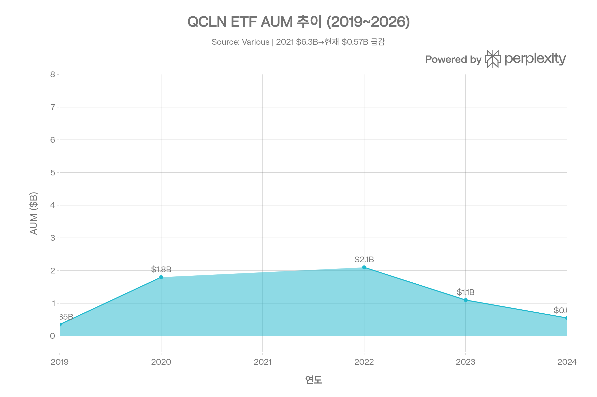
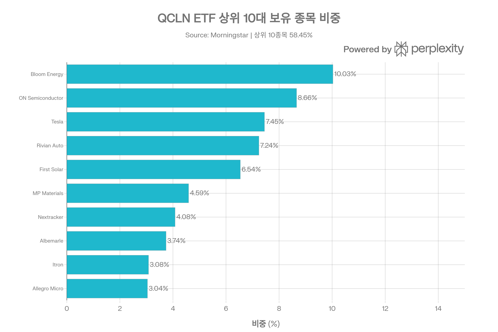
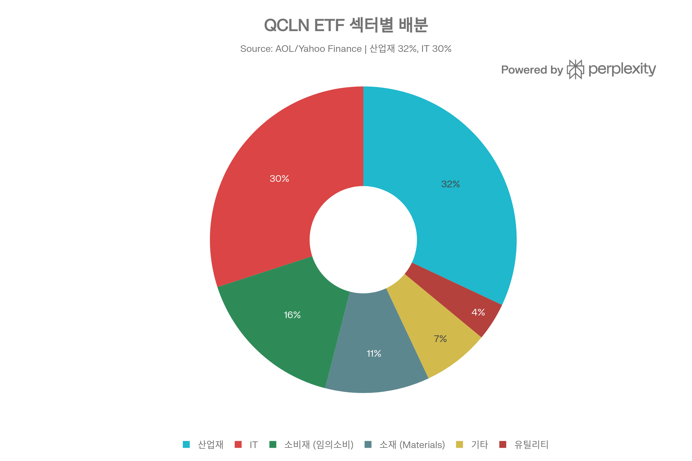
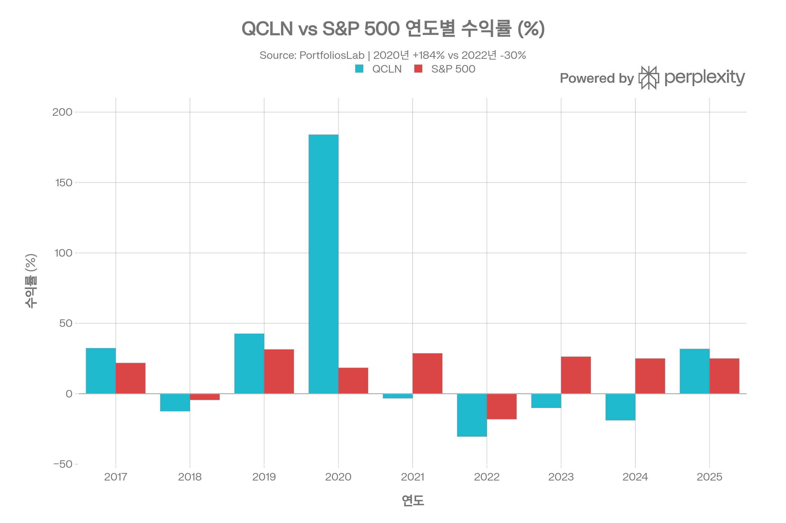
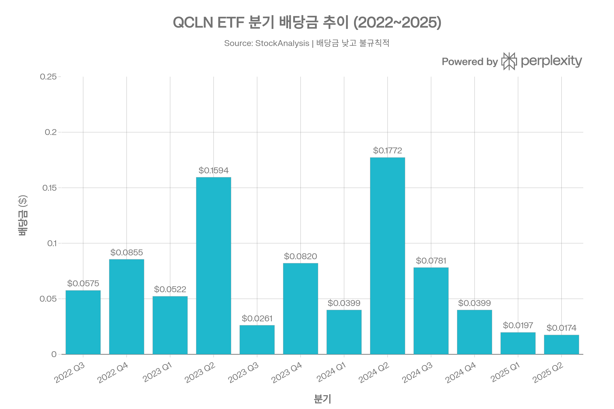

# QCLN ETF (First Trust NASDAQ Clean Edge Green Energy Index Fund) 종합 분석 보고서
> <strong>분석 기준일:</strong> 2026년 4월 8일

## ETF 분류

| 항목 | 내용 |
|------|------|
| <strong>최종 폴더</strong> | `ETF/Clean Energy/QCLN` |
| <strong>대분류</strong> | 테마 |
| <strong>하위 분류</strong> | 클린에너지 / 그린에너지 |
| <strong>핵심 전략</strong> | NASDAQ Clean Edge Green Energy Index 기반으로 미국 상장 청정에너지 가치사슬 기업에 투자 |
| <strong>운용 방식</strong> | 패시브 |
| <strong>레버리지·인버스 여부</strong> | 아니오 |
| <strong>옵션 인컴 전략 여부</strong> | 아니오 |
| <strong>분류 판단</strong> | 이름에 NASDAQ이 포함되어 있지만 Nasdaq-100 대표지수 ETF가 아니라 태양광, 전기차, 연료전지, 배터리 소재 등 청정에너지 밸류체인에 투자하는 테마 ETF이므로 `Clean Energy`로 분류한다. |

***
## 1. 기본 정보
QCLN은 <strong>First Trust Advisors L.P.</strong>가 운용하는 청정에너지 테마 패시브 ETF로, 태양광·풍력·전기차·연료전지·첨단 배터리 등 광범위한 청정에너지 가치사슬 전체에 걸쳐 투자합니다. 2007년 2월에 설정되어 약 19년의 운용 역사를 보유한, 미국 내 가장 오래된 청정에너지 ETF 중 하나입니다.[1][2][3]

| 항목 | 내용 |
|------|------|
| <strong>정식 명칭</strong> | First Trust NASDAQ® Clean Edge® Green Energy Index Fund |
| <strong>티커</strong> | QCLN (NASDAQ) |
| <strong>설정일</strong> | 2007년 2월 8일 |
| <strong>운용 기간</strong> | 약 19년 (2007\~현재) |
| <strong>추종 지수</strong> | NASDAQ® Clean Edge® Green Energy Index™ |
| <strong>운용사</strong> | First Trust Advisors L.P. |
| <strong>상장 거래소</strong> | NASDAQ |
| <strong>순자산(AUM)</strong> | 약 5억 4,300만\~5억 7,200만 달러 (2026년 기준) |
| <strong>발행 주식 수</strong> | 약 1,170만\~1,205만 주 |
| <strong>ISIN</strong> | US33733E5006 |
| <strong>복제 방식</strong> | 완전 복제 (Physical Full Replication) |
| <strong>운용 스타일</strong> | 패시브 (Passively Managed) |
### AUM 변천: 2021년 피크 후 대규모 감소

QCLN은 2020년 바이든 행정부 출범 및 청정에너지 붐을 타고 AUM이 약 1.8억 달러(2020년 초)에서 2021년 초반 <strong>약 63억 달러</strong>까지 폭증했다가, 2022년부터 금리 인상·정책 불확실성 등으로 <strong>현재 약 5.7억 달러</strong> 수준으로 급격히 축소되었습니다. 이는 QCLN ETF의 투자 특성을 이해하는 데 핵심적인 배경입니다.[4][5]
### 추종 지수 소개
<strong>NASDAQ® Clean Edge® Green Energy Index™(티커: CELS)</strong>는 미국에 상장된 청정에너지 기업들로 구성된 수정 시가총액 가중 지수입니다. 태양광, 풍력, 연료전지, 전기차, 첨단 배터리, 바이오연료 등 다양한 청정에너지 기술 분야를 포괄합니다. 지수는 <strong>분기별 리밸런싱, 반기별 재구성(3월·9월)</strong>을 실시합니다. 다만 해당 지수는 <strong>2025년 9월 8일부로 공식 중단(Discontinued)</strong>되었으며, 이후 운용 방향에 변화가 발생할 수 있습니다.[6][7][5]

***
## 2. 추종 성과 지표
### 추적 오차 및 NAV 괴리율
| 항목 | 수치 |
|------|------|
| <strong>NAV 대비 시장가격 괴리율</strong> | 약 +0.002\~+0.06% (사실상 괴리 없음) |
| <strong>1Y NAV 수익률</strong> | 35.02% |
| <strong>포트폴리오 회전율</strong> | 약 3% (매우 낮음) |

[5][8]

- 완전 복제 방식으로 기초 지수 구성 종목 전체를 보유하며, NAV 대비 시장가격 괴리율은 사실상 0에 근접합니다.[8][5]
- 포트폴리오 회전율이 약 3%로 매우 낮아, 거래 비용이 최소화됩니다. 이는 보수율(0.56%) 이상으로 추가 비용이 발생하지 않음을 의미합니다.[9]
- 추종 지수가 2025년 9월 중단된 이후의 추적 성과는 향후 모니터링이 필요합니다.[5]

***
## 3. 비용 구조
### 총 보수 및 비용
| 항목 | QCLN | ICLN (iShares) | GRID (First Trust) |
|------|------|------|------|
| <strong>총 보수(Expense Ratio)</strong> | 0.56\~0.60% | 0.41\~0.46% | 0.56% |
| <strong>포트폴리오 회전율</strong> | \~3% | \~39% | \~26% |
| <strong>배당 수익률</strong> | 0.22\~0.24% | 0.95\~1.47% | 0.91\~0.92% |

[1][10][11][12]

- 보수율은 <strong>0.56%</strong>(일부 소스 0.58\~0.60%로 표시)로, iShares ICLN(0.41\~0.46%)보다 높고 동사의 GRID ETF(0.56%)와 동일합니다.[10][1]
- 회전율 3%는 업계 최저 수준으로, 지수 변경에 따른 거래가 최소화되어 실질 비용이 낮게 유지됩니다.[9]
- 캐나다 버전 First Trust ETF의 MER은 0.75%이며, 유럽 UCITS 버전(아일랜드 법인)의 TER은 0.60%입니다.[13][14]

***
## 4. 유동성 평가
| 항목 | 수치 |
|------|------|
| <strong>일평균 거래량 (30일 기준)</strong> | 약 79,000\~115,000주 |
| <strong>일평균 거래대금</strong> | 약 $165,000\~$3M |
| <strong>AUM</strong> | 약 $543M\~$572M |
| <strong>52주 최고/최저</strong> | $57.16 / $24.02 |
| <strong>NAV 괴리율</strong> | 약 -0.02\~+0.06% |

[1][8][15]

- AUM 규모가 2021년 고점($6.3B) 대비 약 <strong>91% 감소</strong>한 현재 약 5.7억 달러 수준으로, 2026년 기준 1년 동안 <strong>약 $211M\~$242M의 자금 순유출</strong>이 지속되었습니다.[5][8]
- 자금 유출로 인해 GRID ETF($7.74B)와 비교했을 때 유동성 격차가 현저합니다. 단, AUM 5억 달러대에서도 하루 거래량은 7만\~12만 주 수준을 유지하여 소규모 투자자에게는 충분한 유동성입니다.[10][1]
- Barchart에 따르면 역사적 변동성은 43.27%로 옵션 내재 변동성(43.34%)과 유사하게 움직입니다.[16]

***
## 5. 포트폴리오 구성
### 상위 10대 보유 종목

| 순위 | 종목명 | 섹터 | 비중 |
|------|--------|------|------|
| 1 | Bloom Energy Corp (BE) | 산업재 | 10.03% |
| 2 | ON Semiconductor Corp (ON) | 기술 | 8.66% |
| 3 | Tesla, Inc. (TSLA) | 임의소비재 | 7.45% |
| 4 | Rivian Automotive (RIVN) | 임의소비재 | 7.24% |
| 5 | First Solar, Inc. (FSLR) | 기술 | 6.54% |
| 6 | Albemarle Corp (ALB) | 기초소재 | 4.59% |
| 7 | MP Materials Corp (MP) | 기초소재 | 4.08% |
| 8 | Nextracker Inc. (NXT) | 산업재 | 3.74% |
| 9 | Itron, Inc. (ITRI) | 기술 | 3.08% |
| 10 | Allegro MicroSystems (ALGM) | 기술 | 3.04% |

[17][18]

<strong>상위 10종목 합계 비중: 약 58.45%</strong>[10]
### 섹터별 배분

| 섹터 | 비중 |
|------|------|
| 산업재 (Industrials) | 32% |
| 정보기술 (IT) | 30% |
| 임의소비재 (Consumer Disc.) | 16% |
| 소재 (Materials) | 11% |
| 유틸리티 | 4% |
| 기타 | 7% |

[13][3]

QCLN은 단순 유틸리티나 태양광 ETF가 아닌, <strong>청정에너지 전체 가치사슬</strong>에 투자하는 포괄적 테마 ETF입니다. 태양광 기업(First Solar), EV 제조사(Tesla, Rivian), 연료전지(Bloom Energy), 파워 반도체(ON Semiconductor), 배터리 소재(Albemarle, MP Materials) 등 다양한 서브테마를 한 펀드에서 보유할 수 있는 것이 특징입니다. 다만 이로 인해 개별 서브테마 ETF 대비 특정 분야 집중 노출 효과는 낮아집니다.[3][19]
### 국가별 배분
QCLN은 <strong>미국에 상장된 기업</strong>에만 투자하는 미국 중심 ETF입니다. 단, Tesla(EV), ON Semiconductor(반도체), Bloom Energy(연료전지) 등 미국 상장 기업들이 글로벌 매출 기반을 가지므로, 간접적인 글로벌 노출은 존재합니다. 이는 글로벌 기업 포트폴리오(미국 비중 21.7%)인 GRID ETF와 가장 큰 구조적 차이점입니다.[1][6]
### 리밸런싱 주기
분기별 리밸런싱, 3월·9월 반기별 지수 재구성을 실시합니다. 단, 기준 지수(CELS)가 2025년 9월 8일부로 공식 중단되어 향후 추종 방식 변경 여부에 대한 모니터링이 필요합니다.[6][7][5]

***
## 6. 성과 분석
### 기간별 수익률

| 기간 | QCLN 수익률 | S&P 500 수익률 |
|------|------------|------|
| YTD (2026) | +4.31% | -3.84% |
| 1개월 | -4.61% | -2.33% |
| 6개월 | +8.63% | -1.98% |
| 1년 | +61.08\~79.73% | +29.73% |
| 3년 (연환산) | -2.46\~-2.97% | +16.86% |
| 5년 (연환산) | -7.09\~-7.24% | +10.37% |
| 10년 (연환산) | +12.87% | +12.29% |
| 설정 이후 (연환산) | +5.16% | — |
### 연도별 수익률 (2017\~2025)
| 연도 | QCLN | 비고 |
|------|------|------|
| 2017 | +32.34% | — |
| 2018 | -12.38% | — |
| 2019 | +42.65% | — |
| <strong>2020</strong> | <strong>+184.00%</strong> | <strong>역사적 최고 단일년도</strong> |
| 2021 | -3.21% | 금리 상승 압박 시작 |
| 2022 | -30.37% | 금리 인상 충격 |
| 2023 | -10.02% | 2년 연속 하락 |
| 2024 | -18.86% | 3년 연속 하락 |
| <strong>2025</strong> | <strong>+31.81%</strong> | <strong>강한 반등</strong> |

[20][21][11]

QCLN의 가장 큰 특징은 <strong>극단적 변동성</strong>입니다. 2020년 바이든 당선 기대와 청정에너지 붐으로 +184%를 기록한 반면, 2022\~2024년 3년간 누적 -47%에 달하는 극심한 하락을 경험했습니다. 이는 청정에너지 테마가 정책·금리 환경에 극도로 민감함을 보여줍니다.[21][11]
### 위험조정 수익률 비교
| 지표 | QCLN | ICLN | 비고 |
|------|------|------|------|
| <strong>샤프 비율 (1Y)</strong> | 1.63 | 2.38 | ICLN 우위 |
| <strong>소르티노 비율 (1Y)</strong> | 2.23 | 3.01 | ICLN 우위 |
| <strong>칼마 비율 (1Y)</strong> | 3.97 | 5.60 | ICLN 우위 |
| <strong>샤프 비율 (전체 이력)</strong> | 0.15 | -0.12 | QCLN 우위 |
| <strong>3년 샤프 비율</strong> | -0.49 | — | 부정적 |

[9][11]

단기 위험조정 성과는 ICLN에 뒤지지만, 전체 이력 기준 장기 샤프 비율은 QCLN이 ICLN보다 높습니다. 이는 장기 성과의 가치를 보여주지만, 최근 3\~5년간의 극심한 변동성도 무시할 수 없습니다.

***
## 7. 배당 정보
### 배당 개요

| 항목 | 수치 |
|------|------|
| <strong>배당 수익률 (TTM)</strong> | 약 0.21\~0.24% |
| <strong>연간 배당금 (TTM)</strong> | 약 $0.10\~$0.11/주 |
| <strong>배당 지급 주기</strong> | 분기 배당 (연 4회) |
| <strong>배당 성향(Payout Ratio)</strong> | 약 7.20\~10.76% |
| <strong>배당 성장률 (1Y)</strong> | -45.64% (급감) |
### 배당 이력 분석
| 기간 | 주요 배당금 |
|------|------------|
| 2021년 합계 | \~$0.401 (주가 대비 0.3\~0.5%) |
| 2022년 합계 | \~$0.204 |
| 2023년 합계 | \~$0.319 |
| 2024년 합계 | \~$0.335 |
| 2025년 Q1+Q2 | \~$0.037 |

[22][11]

QCLN의 배당금은 극히 미미하며, <strong>배당 수익률 0.21\~0.24%는 사실상 배당 투자 목적으로는 적합하지 않은 수준</strong>입니다. 2025년에는 배당이 전년 대비 -45% 이상 감소하여 변동성이 큽니다. QCLN은 순수하게 자본 이득을 추구하는 성장형 투자 수단으로 이해해야 합니다.[10][22]

***
## 8. 리스크 요소
### 베타 계수 및 변동성
| 지표 | 수치 |
|------|------|
| <strong>베타 계수 (5년 월간)</strong> | 1.50\~1.87 |
| <strong>변동성 (1M)</strong> | 13.73% |
| <strong>변동성 (3Y 연환산)</strong> | 32.44\~36.87% |
| <strong>역사적 변동성 (Barchart)</strong> | 43.27% |
| <strong>최대 낙폭 (MDD, 전체 이력)</strong> | -76.18% |
| <strong>최대 낙폭 (MDD, 5Y)</strong> | -62.34% |
| <strong>PE 비율 (TTM)</strong> | 25.77\~30.72배 |

[10][23][24][21][16]

QCLN의 베타는 1.5\~1.87로, 시장 대비 1.5\~1.9배 더 크게 움직이는 <strong>고위험 테마 ETF</strong>입니다. 역대 최대 낙폭 -76.18%는 GRID ETF(-40.56%)와 비교해도 약 2배에 달하는 극심한 하락을 경험했음을 보여줍니다.[23][25][24]
### 주요 리스크 요인
<strong>1. 정책 리스크 (가장 중요한 요인)</strong>
청정에너지 정책 변화에 극도로 민감합니다. 바이든 행정부 청정에너지 확대 기대로 2020년 +184%, 이후 금리 인상·정책 불확실성으로 2022\~2024년 3년 연속 하락. 트럼프 행정부의 에너지 정책 변화가 단기적 역풍 요인이 될 수 있습니다.[3][20][21]

<strong>2. 금리 리스크</strong>
청정에너지 기업들은 대규모 자본 투자가 필요하며, 고금리 환경에서 자금조달 비용이 크게 상승합니다. 2022\~2023년의 급격한 금리 인상 사이클이 QCLN을 3년 연속 하락으로 이끈 주요 원인입니다.[26][21]

<strong>3. 단일 종목 집중 리스크</strong>
Bloom Energy가 약 10\~12.8%, Tesla가 7\~9%를 차지합니다. 특히 Bloom Energy의 주가 급등이 2025\~2026년 ETF 성과를 크게 좌우했습니다. 개별 기업 이슈가 ETF 전체에 큰 영향을 미칩니다.[17][27][3]

<strong>4. 섹터 간 분산 및 집중 리스크</strong>
EV(Tesla, Rivian), 반도체(ON Semiconductor), 태양광(First Solar), 소재(Albemarle) 등 다양한 섹터에 노출되지만, 각 섹터의 사이클이 달라 포트폴리오 성과가 예측하기 어렵습니다.[19]

<strong>5. 추종 지수 중단 리스크</strong>
NASDAQ Clean Edge Green Energy Index가 2025년 9월 8일부로 공식 중단되었습니다. 향후 ETF 운용 방향과 추종 지수 변경 계획이 불명확한 상태로, 이는 잠재적 구조적 리스크입니다.[5]

<strong>6. 유동성 및 AUM 감소 리스크</strong>
AUM이 고점 대비 91% 감소하여, 운용사 관점에서 펀드 존속·수익성에 대한 우려가 제기될 수 있습니다. 지속적인 자금 순유출(2026년 기준 -$211\~242M)이 진행 중입니다.[8][5]
### 거시 요인 민감도
| 거시 요인 | 민감도 방향 |
|-----------|----------|
| 성장 (Growth) | +0.3 (약한 양(+)) |
| 신용 (Credit) | +6.4 (강한 양(+)) |
| 유동성 (Liquidity) | -0.2 (약한 음(-)) |
| 인플레이션 | -3.4 (강한 음(-)) |
| 금리 | -2.3 (음(-)) |

[26]

QCLN은 신용 환경이 좋고, 금리·인플레이션이 낮은 환경에서 성과가 좋은 구조입니다. 이는 2022\~2023년 금리 인상기 부진의 원인을 설명해줍니다.[26]

***
## 9. 경쟁 ETF 비교
| 항목 | QCLN | ICLN (iShares) | GRID (First Trust) | TAN (Invesco Solar) |
|------|------|------|------|------|
| <strong>운용사</strong> | First Trust | BlackRock | First Trust | Invesco |
| <strong>설정일</strong> | 2007-02-08 | 2008-06-24 | 2009-11-16 | 2008-04-15 |
| <strong>AUM</strong> | \~$543M | \~$1.48B | \~$7.74B | — |
| <strong>보수율</strong> | 0.56% | 0.41\~0.46% | 0.56% | 0.69% |
| <strong>1년 수익률</strong> | +61\~79% | +61.77% | +45.75% | — |
| <strong>3년 연환산</strong> | -2.46% | -1.04% | +20.80% | — |
| <strong>5년 연환산</strong> | -7.09% | -4.16% | +15.01% | — |
| <strong>10년 연환산</strong> | +12.87% | +8.94% | +18.39% | — |
| <strong>MDD</strong> | -76.18% | — | -40.56% | — |
| <strong>베타</strong> | 1.50\~1.87 | — | 1.22 | — |
| <strong>투자 범위</strong> | 미국 상장 전체 | 글로벌 청정에너지 | 글로벌 스마트그리드 | 글로벌 태양광 집중 |

[11][12][19]

<strong>10년 기준 QCLN(+12.87%) vs ICLN(+8.94%)</strong>: 장기적으로 QCLN이 ICLN을 약 4%p 앞서나, 동사의 GRID ETF(+18.39%)와 비교하면 뚜렷하게 뒤집니다. GRID는 상대적으로 낮은 변동성과 높은 장기 수익률을 동시에 제공하는 반면, QCLN은 더 높은 변동성과 더 낮은 장기 수익률을 기록했습니다.[11]

***
## 10. 종합 투자 시사점
<strong>QCLN의 투자 매력:</strong>
- 2007년 설정, <strong>약 19년의 긴 운용 역사</strong>로 가장 오래된 청정에너지 ETF 중 하나[2]
- 태양광, EV, 연료전지, 반도체, 배터리 소재 등 <strong>청정에너지 가치사슬 전 분야</strong>를 한 번에 커버[3]
- 포트폴리오 회전율 약 3%로 <strong>내부 거래 비용이 매우 낮음</strong>[9]
- 2025년 +31.81% 강한 반등, 2026년 YTD +4.31%로 <strong>최근 회복 모멘텀</strong> 존재[21][11]
- 10년 연환산 +12.87%로 <strong>S&P 500(+12.29%)와 유사한 장기 성과</strong>[21]

<strong>QCLN의 핵심 유의 사항:</strong>
- 역대 최대 낙폭 <strong>-76.18%</strong>, 3\~5년 수익률 <strong>연환산 -7%</strong> 수준의 극심한 변동성[24][21]
- AUM이 2021년 $6.3B에서 현재 $0.57B으로 <strong>91% 급감</strong>하여 자금 유출 지속[5]
- 기준 지수(CELS)가 <strong>2025년 9월 8일 중단</strong>되어 향후 운용 방향 불확실[5]
- 정책·금리 환경에 <strong>극도로 민감</strong>하여 정권 교체·금리 변화 시 큰 충격 가능[26][20]
- 배당 수익률 <strong>0.22%</strong>, 성장 기대가 없다면 보유 근거 약함[10]

QCLN ETF는 청정에너지 테마의 광범위한 성장에 베팅하는 고위험·고변동성 투자 수단입니다. 정책·금리 환경이 청정에너지에 우호적인 시기에 탁월한 성과를 내지만, 환경이 악화될 경우 극심한 하락을 감수해야 합니다. 유사 테마 내에서 낮은 변동성과 더 높은 장기 성과를 추구하는 투자자에게는 GRID ETF가 더 적합한 대안으로 평가됩니다.
