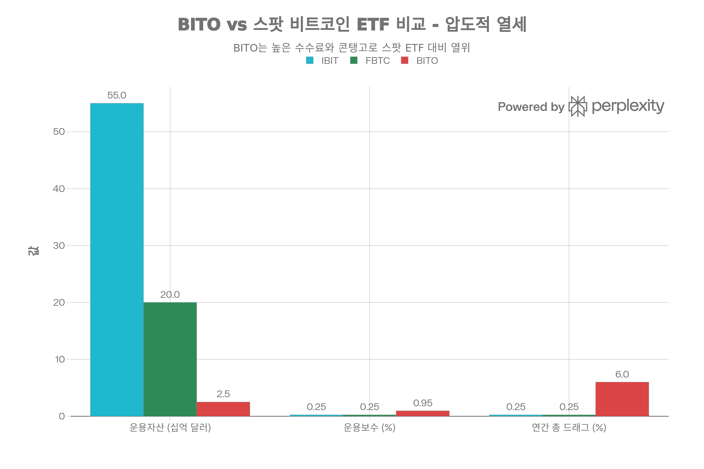

## 핵심 요약 (Executive Summary)

**BITO(ProShares Bitcoin Strategy ETF)** 는 2021년 10월 ProShares가 출시한 **미국 최초의 비트코인 연계 ETF**로 역사적 의미를 지니지만, **비트코인 현물이 아닌 CME 비트코인 선물**에 투자하는 구조적 결함으로 인해 **연 5-10%의 콘탱고 드래그**와 **0.95%의 높은 운용보수**로 비트코인 현물 가격 대비 **체계적 저성과**를 기록합니다. 특히 **2024년 1월 SEC의 스팟 비트코인 ETF 승인** 이후, BlackRock의 IBIT(\$55B AUM, 0.25% 수수료)와 Fidelity의 FBTC(\$20B AUM, 0.25% 수수료)가 출시되면서 **BITO는 사실상 구식 상품**이 되었습니다. BITO의 \$2.5B AUM은 IBIT의 4.5%에 불과하며, **50-70%라는 헤드라인 배당수익률은 2024년 비트코인 6배 랠리로 인한 일회성 선물 수익 분배**로 지속 불가능하고 세금 악몽(일반 소득 과세)을 초래합니다. **명확한 결론**: BITO는 **장기 투자자에게 재앙적 선택**이며, IRA 계좌에서 스팟 ETF 접근 불가능한 극소수 경우를 제외하고는 **IBIT나 FBTC가 모든 면에서 압도적으로 우월**합니다. 10년 보유 시 BITO는 스팟 ETF 대비 **-50-100%+ 누적 저성과**가 예상됩니다.[^1][^2][^3][^4][^5][^6][^7][^8][^9][^10][^11][^12]

## 펀드 기본 정보

### 개요

**BITO**는 ProShares가 2021년 출시한 **역사적 의미의 비트코인 선물 ETF**입니다:[^1][^2]

**핵심 특징:**

- **운용사**: ProShares
- **설정일**: 2021년 10월 18-19일[^2][^13][^1]
- **상장거래소**: NYSE Arca[^14]
- **운용자산(AUM)**: 22억~25억 달러[^13][^15]
- **운용보수**: **0.95%**[^11][^1][^2][^13]
- **투자 대상**: **CME 비트코인 선물 계약** (현물 비트코인 아님)[^3][^7][^2]
- **투자 목표**: 비트코인 선물을 통한 자본 이득[^2]
- **역사적 의의**: **미국 최초 비트코인 연계 ETF**[^1][^2]


### 현재 시장 지표 (2026년 1월)

| 지표 | 수치 |
| :-- | :-- |
| 현재 가격 | \$12.22-13.13[^13][^15] |
| 52주 최저가 | \$12.00[^13] |
| 52주 최고가 | \$26.10[^13] |
| Beta | 1.05x[^13] |
| **배당수익률** | **49.60-72.70%**[^13][^15][^11] **(오해의 소지, 지속 불가)** |
| 연간 배당금 | \$9.52-11.19[^13][^11] |
| 발행주식수 | 1억 7,800만 주[^15] |
| 시가총액 | \$22억[^15] |
| 일평균 거래량 | 94.5만~3,671만 주[^13] |

## 투자 전략 심층 분석

### 비트코인 선물 기반 구조 (치명적 결함)

**BITO는 비트코인을 직접 보유하지 않습니다**:[^2][^13]

**실제 보유**:

- CME (Chicago Mercantile Exchange) 비트코인 선물 계약
- 현금 결제 선물 (물리적 비트코인 인도 없음)
- 비트코인 가격 움직임 추적 시도

**왜 현물이 아닌 선물?**:[^2]

- 2021년 10월 출시 시점: 스팟 비트코인 ETF 미승인
- 규제 거래소(CME) 감독 더 쉬움
- 물리적 비트코인 보관 불필요
- SEC 승인 경로 단순했음 (당시)


### 선물 롤링 메커니즘: 숨겨진 비용

**"롤링"이란?**:[^3][^7]

비트코인 선물 계약은 만기일이 있습니다(월별). 계약 만기 전, BITO는 포지션을 "롤"해야 합니다:

1. **매도**: 만기 임박한 전월물 계약 매도
2. **매수**: 차월물 또는 더 먼 만기 계약 매수
3. **목적**: 비트코인 연속 노출 유지

**작동 예시**:

```
2026년 1월 25일:
- BITO가 2월 2026 비트코인 선물 보유
- 2월 계약 곧 만기
- BITO가 2월 계약 매도
- BITO가 3월 또는 4월 계약 매수
- 매달 반복
```


### 콘탱고: 조용한 살인자

**콘탱고란?**:[^3][^5][^7]

시장 구조에서 **장기 선물 가격 > 단기 선물 가격**인 상황:

```
예시:
2월 선물: $100,000
3월 선물: $102,000
콘탱고: 2% ($2,000)
```

**BITO에 미치는 타격**:[^5][^8][^3]

1. BITO가 2월 계약을 \$100,000에 매도
2. BITO가 3월 계약을 \$102,000에 매수
3. **손실**: 계약당 \$2,000 = "롤 비용" 또는 "마이너스 롤 수익률"
4. 매달 반복 → **누적 드래그**

**역사적 콘탱고**:[^7]

- CME 비트코인 선물 출시: 2017년 12월
- 평균 연환산 프리미엄: ~5% (전월물 → 차월물)
- BITO 출시 후: ~2-3%로 감소[^7]
- 2022년 3월: 평균 2.1%[^7]
- **여전히 지속적 비용**

**StockTitan 분석**:[^3]
> "When the fund rolls its positions from expiring contracts to longer-dated ones, it sells at the lower near-term price and buys at the higher future price, creating what's known as roll cost or roll yield."

**수익률 영향**:[^5][^3]

```
비트코인 현물 가격: +20%/년
콘탱고 드래그: -5%/년
BITO 수익률: +15% (뒤처짐)
추적 오차 vs 비트코인 현물
```


### 백워데이션: 드문 이점

**백워데이션이란?**:[^3][^8]

콘탱고의 반대: **단기 선물 > 장기 선물**

```
예시:
2월: $100,000
3월: $98,000
```

**BITO에 도움**:[^8][^3]

1. BITO가 2월을 \$100,000에 매도
2. BITO가 3월을 \$98,000에 매수
3. **이득**: \$2,000 = "플러스 롤 수익률"
4. BITO가 현물 비트코인 초과 수익

**발생 시기**:[^3]

- 약세장에서 높은 매도 압력
- 극심한 변동성 급등
- 시장 스트레스 기간
- **비트코인에서 역사적으로 드묾**


### 담보 이자 수입

**부분적 상쇄**:[^3]

- BITO가 선물용 현금 담보 보유
- 현금에서 이자 수취 (국채, 머니마켓)
- 금리 상승 → 이자 수입 증가
- 롤 비용 부분적 상쇄
- **하지만 드래그 제거에는 불충분**


## 성과 분석

### 역사적 수익률 (2021년 10월 ~ 2026년 1월)

**BITO 공식 성과**:[^1]


| 기간 | NAV 수익률 |
| :-- | :-- |
| **YTD 2026** | -3.46% |
| **1년** | -24.06% |
| **3년** | -20.19% |
| **출시 이후 연환산** | **-10.86%** |
| **출시 이후 누적** | +63.12% |

**대체 데이터**:[^16][^14]


| 기간 | 수익률 |
| :-- | :-- |
| YTD 2026 | +7.89-11.7% |
| 1년 | +3.63-10.50% |
| 3년 | +58.09-68.44% |

**데이터 불일치**:

- ProShares: -24.06% (1년)
- Yahoo Finance: +3.63-10.50% (1년)
- **가능성**: 다른 기간 또는 NAV vs 시장 가격


### vs 비트코인 현물: 심각한 저성과


BITO는 스팟 비트코인 ETF(IBIT, FBTC) 대비 모든 지표에서 압도적으로 열세입니다. AUM \$2.5B(IBIT의 4.5%), 운용보수 0.95%(3.8배 비쌈), 콘탱고 드래그 포함 연간 총 비용 6%(24배 높음)로, 2024년 1월 스팟 ETF 승인 이후 사실상 구식 상품이 되었습니다.

위 차트가 명확히 보여주듯이, **BITO는 모든 지표에서 스팟 ETF에 압도적으로 열세**입니다.[^10][^17]

**추적 오차 문제**:[^18][^19][^20]

**Duke University 학술 연구**:[^19]
> "The use of futures to track BTC may introduce a difference between the return of the ETF and that of its underlying benchmark. The standard deviation of this difference – the so-called 'tracking error' – is the typical measure."

**추적 오차의 주요 원인**:[^19]

1. 선물 vs 현물 투자 (콘탱고)
2. 일일 리밸런싱 제약
3. 운용보수 (0.95%)
4. 거래 시간 불일치 (CME vs 24/7 암호화폐)

**실제 사례** (Reddit 토론):[^4]
> "BITO tends to lag a few percentage points behind actual bitcoin gains... given the 23% payout, that seems minimal."

사용자 답변:
> "BITO will only issue dividends when they make a profit off the futures... if btc is in a falling environment you get no dividends. But if btc is going up, the price increase in BITO + dividends will likely be less than the percentage increase in spot btc due to the transaction costs."

**추정 장기 드래그**: 비트코인 현물 대비 **연 -5-10%**[^5][^8][^9]

### vs 스팟 비트코인 ETF: 완패

**스팟 ETF 출시**: 2024년 1월 11일[^6][^10]

**AUM 비교** (2025년 중반):[^10]


| ETF | AUM | 운용보수 | 유형 |
| :-- | :-- | :-- | :-- |
| **IBIT** (BlackRock) | **\$550억** | **0.12-0.25%** | **스팟** |
| **FBTC** (Fidelity) | **\$177-200억** | **0.25%** | **스팟** |
| **BITO** (ProShares) | **\$22-25억** | **0.95%** | **선물** |

**핵심 인사이트**:[^9][^6][^10]

- IBIT AUM: **BITO의 22배**
- 스팟 ETF: 비트코인 직접 보유 (콘탱고 없음)
- 스팟 ETF: 수수료 4-8배 낮음
- **BITO AUM이 \$10억에서 \$25억으로** (vs IBIT \$550억)

**성과 비교**:[^6][^10]

- 모든 스팟 ETF: 28-55% 수익률 (비트코인 추적)
- BITO: -10-20% 낮은 수익률 (콘탱고 드래그)
- **스팟 ETF가 장기적으로 객관적 우위**

**Mezzi 분석**:[^9]
> "For long-term holding, IBIT and ARKB stand out due to their low fees and direct Bitcoin exposure. BITO may suit short-term goals but is less ideal for buy-and-hold strategies."

**StashAway 비교**:[^21]
> "Spot Bitcoin ETFs like IBIT and FBTC have expense ratios as low as 0.25%, while futures-based ETFs like BITO charge up to 0.95%."

**Return-to-Fee 비율**:[^10]

- IBIT: 454.17 (현상적)
- FBTC: 217.20 (강력)
- BITO: 추정 <100 (형편없음)


## 배당 정보: 오해의 소지 높은 고수익률

### 현재 배당 지표[^13][^15][^11]

**경고**: 헤드라인 수익률은 **극도로 오해의 소지**

- **배당수익률**: 49.60-72.70%[^13][^15][^11]
- **연간 배당금**: \$9.52-11.19[^11][^13]
- **빈도**: 월별[^4][^15]
- **최근 배당금**: \$0.74-0.78[^15][^11]


### 50-70% 수익률이 오해의 소지인 이유

**Reddit 토론: "뭐가 문제인가?"**[^12]

사용자 질문:
> "배당수익률이 지난 1년간 약 53%였습니다. \$10,000 투자로 \$5,000 이상의 배당을 생성할 수 있다는 것인데, 엄청나게 높아 보입니다."

**현실**:[^4][^8][^12]

**1. 배당 = 실현된 선물 수익**:[^4]

- BITO가 수익으로 계약 롤 → 분배 필수
- 비트코인 상승 시, 선물 계약 이익
- ETF 규정이 이익 분배 요구
- **전통적 배당 소득 아님**

Reddit 설명:[^4]
> "When that date arrives and what you paid for the future is not exceeded by the spot price that date then you book a profit but by law you have to distribute that in dividends in an ETF."

**2. 상승장에서만 배당**:[^12][^4]
> "BITO will only issue dividends when they make a profit off the futures... if btc is in a falling environment you get no dividends."

**2024년 비트코인 랠리 맥락**:

- 비트코인: \$16K (2022년 11월) → \$100K+ (2024년 12월)
- **6배 증가** = 엄청난 선물 수익
- BITO가 분배 강제 → 50%+ "수익률"
- **일회성 이벤트, 지속 불가능**

**3. 가격 + 배당 ≠ 비트코인 수익률**:[^12][^4]
> "The price increase in BITO + dividends will likely be less than the percentage increase in spot btc due to the transaction costs BITO has to incur."

**4. 세금 악몽**:[^11][^12]

- 분배금이 **일반 소득**으로 과세 (최대 39.6%)[^11]
- 적격 배당 아님 (15-20%)
- 월별 분배 = 세금 복잡성
- **K-1 양식 필요** (복잡)[^11]

Reddit 사용자:[^12]
> "The dividends are substantial, they can be a real hassle if you're aiming for tax efficiency in a brokerage account... I wish I had conducted more thorough research."

### 역사적 배당 추세[^22][^15]

| 연도 | 총 배당금 | 성장률 |
| :-- | :-- | :-- |
| 2023 | \$3.10 | - |
| 2024 | \$14.03 | **+352%** |
| 2025 | \$9.52 | **-32%** |

**2024년 급증**: 비트코인 6배 랠리가 대규모 분배 강제
**2025년 하락**: 비트코인 가격 안정화 = 분배 감소
**미래**: 횡보 시장에서 0-10% 수익률 가능성[^4][^12]

## 전략 분석

### BITO 장점 (최소)

**1. 역사적 최초**:[^1][^2]

- 미국 최초 비트코인 연계 ETF (2021년 10월)
- 선구적 상품
- **하지만 현재는 구식 vs 스팟 ETF**

**2. 규제 거래소 노출**:[^2]

- CME 선물 = CFTC 감독
- 암호화폐 거래소 보관 리스크 없음
- 전통적 중개 계좌 접근
- **하지만 스팟 ETF도 규제됨 (SEC)**

**3. 잠재적 백워데이션 이익**:[^3][^8]

- 드문 기간: BITO가 현물 초과
- 2022년 약세장: 일부 백워데이션
- **역사적으로 드묾**

**4. 담보 이자 수입**:[^3]

- 현금에서 국채 금리 수취
- 콘탱고 부분 상쇄
- **드래그 제거에는 불충분**

**5. 단기 거래 수단**:[^9]

- 데이 트레이더용 높은 유동성
- 옵션 이용 가능
- **장기 보유 장점 아님**


### BITO 단점 (심각)

**1. 콘탱고 드래그: 연 -5-10%**[^3][^5][^7][^8]

**수학**:[^7]

- 평균 연환산 콘탱고: 2-5%
- 월별 롤링: 연 12회
- 누적 효과: **연 -5-10% 저성과** vs 비트코인

**AMB Crypto**:[^8]
> "These costs, along with its 0.95% management fee, often cause BITO to underperform the live price of Bitcoin."

**AInvest**:[^5]
> "In persistent contango, BITO underperforms the spot price. For instance, during the 2023 sideways market, Bitcoin's spot price rose just 5%, but BITO lagged due to cumulative roll decay."

**2. 극도로 높은 운용보수**[^1][^13][^21][^11]

**0.95%**:[^11][^1]

**비교**:


| ETF | 운용보수 | BITO 대비 |
| :-- | :-- | :-- |
| IBIT | 0.12-0.25% | **BITO가 3.8-7.9배 비쌈** |
| FBTC | 0.25% | **BITO가 3.8배 비쌈** |
| VOO | 0.03% | **BITO가 31.7배 비쌈** |

**\$10,000 연간 비용**:

- BITO: \$95
- IBIT: \$12-25
- **\$70-83 추가 비용**

**10년 복리 비용**:

- 0.95% 연간 on \$10,000 → \$903 총 드래그
- 0.25% 연간 → \$247 총 드래그
- **\$656 추가 비용** (65% 더 비쌈)

**3. 추적 오차: 체계적 저성과**[^18][^19][^20]

**학술 연구** (Market Impact):[^20][^18]
> "BITO invests in bitcoin futures and may assume the tracking errors. Thus, BITO may not fully capture the performance of spot bitcoin."

**추적 오차의 원천**:[^19]

1. **콘탱고**: -2-5%/년
2. **운용보수**: -0.95%/년
3. **거래 시간 불일치**: CME 시간 vs 24/7 암호화폐
4. **일일 리밸런싱 슬리피지**
5. **매수-매도 스프레드**

**총 추정 드래그**: 비트코인 현물 대비 **연 -5-10%**

**4. 스팟 ETF 이후 구식**[^6][^9][^10]

**2024년 1월 11일**: SEC가 스팟 비트코인 ETF 승인

- IBIT (BlackRock): \$550억 AUM
- FBTC (Fidelity): \$200억 AUM
- **BITO: \$25억 AUM** (붕괴)

**투자자 대탈출**:[^10][^6]

- 1년 차에 스팟 ETF로 \$362억 유입[^23]
- BITO AUM 정체/감소
- **시장 투표 결과: 스팟 > 선물**

**Mezzi 평결**:[^9]
> "BITO may suit short-term goals but is less ideal for buy-and-hold strategies."

**5. 오해의 소지 배당수익률**[^4][^12]

**50-70% 수익률은 지속 불가능**:[^12][^4]

- 강력한 비트코인 랠리에서만 발생
- 2024년: 비트코인 6배 → 50% 수익률
- 2025년: 비트코인 횡보 → 10% 수익률
- 약세장: 0% 수익률 가능성
- **정보 부족 투자자 유인**

**6. 세금 비효율**[^11][^12]

**일반 소득 처리**:[^11]

- 연방 최대 세율: 39.6%
- 주 최대 세율: +13% (CA)
- **총**: 최대 52.6% 세금
- vs 장기 자본이득: 연방 20%

**K-1 복잡성**:[^11]

- K-1 양식 필요 가능 (선물)
- 세금 신고 복잡성
- CPA 비용 증가

**7. 직접 비트코인 소유 아님**[^2][^13]

**거래상대방 리스크**:

- CME 선물 시장 의존
- 청산소 리스크 (드물지만 존재)
- 당신의 키가 아니면, 당신의 코인도 아님

**8. 유동성 감소**[^18][^10]

**거래량**:[^13][^17]

- BITO 일일 거래량: 94.5만~3,671만 주
- **IBIT 일일 거래량: 4배 높음**[^17]
- 매수-매도 스프레드 확대
- 기관 관심 감소


## BITO vs 경쟁 제품

### vs IBIT (BlackRock 스팟 비트코인 ETF)[^10][^17]




BITO는 스팟 비트코인 ETF(IBIT, FBTC) 대비 모든 지표에서 압도적으로 열세입니다. AUM \$2.5B(IBIT의 4.5%), 운용보수 0.95%(3.8배 비쌈), 콘탱고 드래그 포함 연간 총 비용 6%(24배 높음)로, 2024년 1월 스팟 ETF 승인 이후 사실상 구식 상품이 되었습니다.


| 특징 | BITO | IBIT | 승자 |
| :-- | :-- | :-- | :-- |
| 유형 | 선물 | **스팟 비트코인** | **IBIT** |
| AUM | \$25억 | **\$550억** | **IBIT** (22배) |
| 운용보수 | 0.95% | **0.12-0.25%** | **IBIT** (3.8-7.9배 저렴) |
| 추적 오차 | -5-10%/년 | **최소** | **IBIT** |
| 콘탱고 드래그 | **-5%/년** | 없음 | **IBIT** |
| 일일 거래량 | 3,671만 | **4배 높음** | **IBIT** |
| Return-to-Fee | <100 | **454.17** | **IBIT** |
| 출시 | 2021년 10월 | 2024년 1월 | - |

**SSRN 연구**:[^17]
> "IBIT, for instance, has an average daily trading volume (TVOL) more than four times higher than BITO's and an expense ratio nearly one-quarter of BITO's."

**평결**: **IBIT가 모든 지표에서 BITO 압도**

### vs FBTC (Fidelity 스팟 비트코인 ETF)[^10][^24]

| 특징 | BITO | FBTC | 승자 |
| :-- | :-- | :-- | :-- |
| 유형 | 선물 | **스팟 비트코인** | **FBTC** |
| AUM | \$25억 | **\$177-200억** | **FBTC** (7-8배) |
| 운용보수 | 0.95% | **0.25%** | **FBTC** (3.8배 저렴) |
| 1년 수익률 | +3.63-10.50% | **+54.3%** | **FBTC** |
| 보관 기관 | CME | **Coinbase Custody** | **FBTC** |
| Return-to-Fee | <100 | **217.20** | **FBTC** |

**평결**: **FBTC가 압도적 우위**

### vs 비트코인 직접 소유

| 특징 | BITO | 스팟 비트코인 | 승자 |
| :-- | :-- | :-- | :-- |
| 추적 | -5-10% 지연 | **100%** | **비트코인** |
| 수수료 | 0.95%/년 | **0%** (자체 보관) | **비트코인** |
| 세금 | 일반 소득 | **LTCG 20%** | **비트코인** |
| 보관 | CME 선물 | **본인 통제** | **비트코인** |
| 24/7 거래 | 아니오 (CME 시간) | **예** | **비트코인** |
| IRA 접근 | **예** | 아니오 (복잡) | **BITO** |

**유일한 BITO 장점**: 보관 복잡성 없이 IRA/401k 접근

## 적합한 경우 (매우 드묾)

### BITO가 수용 가능한 시나리오[^9][^12]

**1. 은퇴 계좌 노출**:[^12]

- IRA/401k가 비트코인 직접 보유 불가
- 스팟 ETF (IBIT/FBTC) 더 나음, 하지만 불가능 시:
- BITO가 비트코인 노출 제공
- 세금 이연 성장이 일부 드래그 상쇄

**2. 단기 거래 (일/주)**:[^9]

- 액티브 트레이딩용 높은 유동성
- 헤징용 옵션 이용 가능
- 일중 움직임은 비트코인 밀접 추적
- **일 단위에서는 콘탱고 무시 가능**

**3. 규제 거래소 요구사항**:

- CFTC 규제 상품 기관 의무
- 암호화폐 거래소 접근 불가
- CME 선물 노출 필요
- **매우 니치한 사용 사례**

**4. 백워데이션 투기**:

- 비트코인 약세장 예상
- 선물이 백워데이션 진입 가능
- BITO가 일시적으로 현물 초과
- **매우 투기적, 드묾**


### 투자자 프로필 (매우 제한적)[^9][^12]

✅ **BITO가 괜찮을 수 있는 경우**:

- **은퇴 계좌** (IRA)에서 스팟 ETF 접근 불가
- **액티브 데이 트레이더** (보유 <1주)
- **기관** CME 선물 요구
- **세금 손실 수확** 스팟 ETF와[^12]
- **매우 단기 투기자**

❌ **BITO가 끔찍한 경우**:

- **장기 투자자** (스팟 ETF 압도적 우위)
- **매수 후 보유 전략** (연 -5-10% 드래그)
- **과세 계좌** (일반 소득세)
- **비용 민감 투자자** (0.95% vs 0.25%)
- **비트코인 맥시멀리스트** (진짜 비트코인 아님)
- **50-70% 수익률 찾는 사람** (지속 불가능한 오해)


## 전문가 의견 \& 커뮤니티

### 학술 연구

**Duke University** (Bitcoin ETFs Performance):[^19]

- 선물 기반 ETF의 추적 오차 측정
- 현물 비트코인 대비 유의미한 차이 발견
- 원인: 선물 구조, 콘탱고, 거래 시간
- **결론**: 선물 ETF는 내재적 불리함

**Market Impact Study** (Science Direct):[^18][^20]

- BITO 출시가 CME 선물 시장에 미친 영향 조사
- 발견: 유동성 증가, 단기 효율성 개선
- 하지만: "BITO invests in bitcoin futures and may assume the tracking errors"
- **BITO는 현물 비트코인 성과 완전 포착 못함**

**SSRN 논문: "Spot Bitcoin ETFs: The Struggle Was Worth It"**:[^17]
> "IBIT has an average daily trading volume more than four times higher than BITO's and an expense ratio nearly one-quarter of BITO's."

**평결**: 스팟 ETF가 승인 후 객관적 우위

### Reddit 커뮤니티

**r/CryptoMarkets: "왜 스팟 ETF를 BITO로 바꾸면 안 되나?"**[^4]

사용자 질문:
> "BITO가 23% 연환산 배당을 제공하며... 비트코인 가격을 밀접하게 추적합니다. 스팟 ETF보다 나은 옵션으로 간주되지 않는 이유를 설명해 주실 수 있나요?"

**주요 답변**:

1. **콘탱고 설명**:[^4]
> "A 23% yield sounds amazing, but... futures contracts have something called 'contango' where the futures price is often higher than the spot price. This can erode your returns over time."
2. **배당 환상**:[^4]
> "BITO will only issue dividends when they make a profit off the futures... if btc is in a falling environment you get no dividends. But if btc is going up, the price increase in BITO + dividends will likely be less than the percentage increase in spot btc."
3. **스팟 ETF 우위**:[^4]
> "It would still be better to hold Bitcoin which is the underlying asset that the ETF. Future ETF can seem nice but for long term can go down more than Spot ETF."

**r/investing: "BITO의 배당수익률. 뭐가 문제?"**[^12]

사용자:
> "배당수익률이 지난 1년간 약 53%... 무엇이 그렇게 놀라운 수익률을 설명하나요?"

**주요 답변**:

1. **세금 복잡성**:[^12]
> "The dividends are substantial, they can be a real hassle if you're aiming for tax efficiency in a brokerage account... I wish I had conducted more thorough research. Currently, I'm reinvesting those distributions to acquire additional FBTC."
2. **선물 비용 인식**:[^12]
> "Many people point out that the expenses associated with futures and the need to roll over expired contracts can diminish returns."

### 금융 미디어

**AInvest** (2025년 7월):[^5]
> "In persistent contango, BITO underperforms the spot price... Yet, BITO's active futures management offers a nuanced solution. By strategically rolling contracts, BITO mitigates prolonged contango risks."

**평가**: 낙관적 분석조차 저성과 인정

**AMB Crypto**:[^8]
> "When it swaps expiring futures contracts for new ones, it can incur costs... These costs, along with its 0.95% management fee, often cause BITO to underperform the live price of Bitcoin."

**ProShares** (2022년 4월):[^7]
> "A welcome development that is enhancing BITO's value proposition is occurring in the bitcoin futures market, where contract premiums, sometimes called 'roll costs,' have recently declined."

**하지만**: 프리미엄 여전히 연 2-5% = 지속적 드래그

### Morningstar \& 투자 가이드

**Mezzi**:[^9]
> "For long-term holding, IBIT and ARKB stand out due to their low fees and direct Bitcoin exposure. BITO may suit short-term goals but is less ideal for buy-and-hold strategies."

**JustETF**:[^25]
> "Several Bitcoin spot ETFs from various providers are available in the USA now, like the iShares Bitcoin Trust ETF (IBIT) from BlackRock and the Fidelity Wise Origin Bitcoin ETF."

**함의**: 스팟 ETF가 현재 표준 권장사항

**U.S. News** (11 Spot Bitcoin ETFs to Buy):[^24]

- IBIT, FBTC, ARKB 등 나열
- **BITO 미포함**
- **선물 기반 ETF 무시됨**


## 2026년 전망

### 성과 기대

**강세 시나리오** (비트코인 랠리):

- 비트코인 현물: +50%
- 콘탱고 드래그: -5%
- 운용보수: -0.95%
- **BITO**: +44% (뒤처짐)
- 높은 배당 분배 (20-30%)
- **하지만 여전히 스팟 ETF 저성과**

**기본 시나리오** (비트코인 온건 성장):

- 비트코인 현물: +20%
- 콘탱고 드래그: -5%
- 운용보수: -0.95%
- **BITO**: +14%
- 적당한 배당 (10-15%)
- **IBIT/FBTC 대비 유의미한 지연**

**약세 시나리오** (비트코인 하락):

- 비트코인 현물: -30%
- 잠재적 백워데이션: +2%
- 운용보수: -0.95%
- **BITO**: -29% (약간 나음)
- 제로 배당
- **폭락 중 미미한 초과 수익**


### 시장 환경

**BITO가 약간 덜 나쁜 경우**:[^3][^8]

- 비트코인 약세장 (백워데이션)
- 극심한 변동성 (높은 담보 수입)
- 단기 거래 기간

**BITO가 계속 뒤처지는 경우**:[^5][^7][^8]

- 지속적 콘탱고 (가장 가능성)
- 강세장 (스팟 ETF 지배)
- 장기 보유 (누적 드래그)


### 경쟁 환경

**스팟 ETF 지배**:[^6][^10][^23]

- IBIT: \$550억 증가 중
- FBTC: \$200억 증가 중
- **BITO: \$25억 정체/감소**
- 99% 투자자에게 BITO 선택 이유 없음

**예상 결과**:

- BITO는 니치 상품화
- AUM 지속 감소
- AUM 너무 낮으면 최종 상장폐지 가능
- **스팟 ETF 이전 시대의 역사적 유물**


## 베스트 프랙티스 (BITO 회피)

### 대체 전략

**장기 비트코인 노출**:

1. **IBIT** (BlackRock): 최저 수수료, 최고 유동성
2. **FBTC** (Fidelity): 강력한 브랜드, 0.25% 수수료
3. **직접 비트코인**: 편하다면 자체 보관
4. **BITO 아님** (연 -5-10% 드래그)

**은퇴 계좌**:

1. **IRA에서 IBIT**: 최적
2. **401k에서 FBTC**: 가능하다면
3. **BITO**: 스팟 ETF 접근 불가 시만 (먼저 확인!)

**단기 거래**:

1. **IBIT**: BITO보다 높은 유동성 현재
2. **비트코인 선물 직접**: 경험 있다면
3. **BITO**: <1주 보유만 허용 가능

### 이미 BITO 보유 시

**권장사항**: **매도 후 IBIT/FBTC로 전환**[^12]

**이유**:

- 연 -5-10% 드래그 제거
- 수수료 0.95%에서 0.25%로 감소
- 월별 분배의 세금 복잡성 회피
- 비트코인 가격 더 나은 추적

**세금 고려사항**:[^12]

- 과세 계좌: 자본이득 발생 가능
- 계산: (남은 연수 × 5-10% 드래그) vs (일회성 자본이득세)
- 2년+ 남았다면 보통 전환 가치 있음
- IRA: 즉시 전환 (세금 없음)

**세금 손실 수확**:[^12]
> "I purchased BITO primarily for tax loss harvesting with FBTC following the drop... while the dividends are substantial, they can be a real hassle."

### 레드 플래그

🚩 **50-70% 배당수익률에 끌림** (지속 불가능, 오해의 소지)
🚩 **콘탱고 드래그 모름** (연 -5-10%)
🚩 **BITO = 비트코인 노출 생각** (선물이지, 현물 아님)
🚩 **IBIT/FBTC와 비교 안 함** (압도적 우위)
🚩 **과세 계좌에서 장기 사용** (세금 악몽)
🚩 **3개월+ 보유** (누적 드래그)

## 결론: "구식, 회피하라"

### 핵심 강점 (최소)

1. **역사적 최초**: 미국 비트코인 연계 ETF 선구자[^1]
2. **IRA 접근**: 은퇴 계좌 보유 가능
3. **규제 거래소**: CME 선물 감독
4. **높은 유동성**: 일일 3,671만 거래량 (하지만 IBIT 더 높음)[^13]
5. **백워데이션 잠재력**: 약세장 드문 초과 수익[^3]
6. **이자 수입**: 부분 콘탱고 상쇄[^3]

### 치명적 약점 (심각)

1. **콘탱고 드래그**: 연 -5-10% 저성과[^3][^5][^7][^8]
2. **극도로 높은 수수료**: 0.95% (스팟 ETF의 3.8-7.9배)[^21][^11]
3. **추적 오차**: 비트코인 현물 대비 체계적 지연[^18][^19][^20]
4. **구식**: 스팟 ETF (IBIT/FBTC) 압도적 우위[^6][^9][^10]
5. **AUM 붕괴**: \$25억 vs IBIT \$550억[^10]
6. **오해의 소지 수익률**: 50-70% 지속 불가능[^4][^12]
7. **세금 비효율**: 일반 소득, K-1 복잡성[^11][^12]
8. **직접 비트코인 아님**: 선물 노출, 거래상대방 리스크[^2]

### 경쟁 포지셔닝

- **vs IBIT**: 모든 지표에서 패배 (수수료, AUM, 추적, 유동성)[^10][^17]
- **vs FBTC**: 압도적 열세 (0.95% vs 0.25%, -5% 드래그)[^24][^10]
- **vs 스팟 비트코인**: -5-10% 지연 + 0.95% 수수료 = 끔찍함[^5][^8]
- **vs 2024년 이전 BITO**: 유일한 옵션이었지만, 현재는 구식[^6]


### 최종 평가: "구식, 회피하라"

**BITO는 2021년 10월 미국 유일의 비트코인 연계 ETF였을 때 의미가 있었던 레거시 상품**입니다. 하지만 **2024년 1월 SEC의 스팟 비트코인 ETF 승인 이후, 99% 투자자에게 BITO는 객관적으로 구식**이 되었습니다. **연 -5-10% 콘탱고 드래그**, **0.95% 운용보수** (스팟 ETF의 3.8-7.9배), **체계적 추적 오차**로 인해 BITO는 비트코인을 직접 보유하고 0.12-0.25% 수수료를 부과하며 각각 **\$550억과 \$200억 AUM**을 보유한 IBIT (BlackRock)나 FBTC (Fidelity)에 비해 압도적으로 열세입니다. BITO의 정체된 **\$25억 AUM**과 비교됩니다.[^1][^2][^3][^5][^6][^7][^18][^9][^10][^21][^11][^19][^20]

**50-70% 배당수익률은 위험한 환상**입니다—분배금은 단순히 비트코인 랠리 동안(2024년 6배 급등 같은) 실현된 선물 수익이지, 지속 가능한 소득이 아닙니다. 횡보나 약세장에서는 0-10% 수익률에 지속적인 가격 저성과를 예상하세요. 분배금은 **일반 소득(최대 39.6%)** 으로 과세되어, 과세 계좌에서 세금 악몽을 만듭니다.[^4][^11][^12]

**누가 BITO를 사야 하나?** 거의 아무도. **유일하게 정당화 가능한 사용 사례**:

1. **스팟 ETF 접근 불가능한 은퇴 계좌 (IRA)**—하지만 IBIT/FBTC가 널리 이용 가능하니 먼저 확인[^12]
2. **<1주 보유하는 액티브 데이 트레이더**—일 단위에서는 콘탱고 무시 가능[^9]
3. **스팟 ETF 포지션과 세금 손실 수확**[^12]

**누가 BITO를 피해야 하나?** 다른 모든 사람:

- **장기 투자자**: 스팟 ETF가 10년간 50-100%+ 초과 수익
- **수익률 추구자**: 50-70% 수익률은 지속 불가능하고 오해의 소지[^4][^12]
- **비용 민감 투자자**: 필요 이상 3.8-7.9배 지불[^21]
- **세금 효율 투자자**: 일반 소득 처리가 잔인함[^11][^12]

**권장사항**: BITO를 보유 중이라면, **즉시 매도하고 IBIT나 FBTC로 전환**하세요. IRA에 있고 스팟 ETF가 불가능한 경우(드묾)가 아니라면. 연 -5-10% + 0.95% 수수료의 누적 드래그는 10년간 0.25% 콘탱고 없는 IBIT 보유 대비 **수만 달러 비용**이 듭니다.[^5][^8][^10][^12]

**2026년 전망**: BITO는 비트코인 현물과 스팟 ETF를 연 5-10% 저성과할 것입니다. 우월한 스팟 상품이 존재하는데 선물을 보유하는 무용함을 남은 투자자들이 깨달으면서 AUM은 추가 감소할 것입니다. **구식화를 기다리는 역사적 유물**.[^6][^10]
<span style="display:none">[^26][^27][^28]</span>

<div align="center">⁂</div>

[^1]: https://www.proshares.com/our-etfs/strategic/bito

[^2]: https://cbonds.com/etf/12959/

[^3]: https://www.stocktitan.net/overview/BITO/

[^4]: https://www.reddit.com/r/CryptoMarkets/comments/1ctk0xu/why_should_i_not_sell_the_spot_bitcoin_etf_for/

[^5]: https://www.ainvest.com/news/bito-navigating-bitcoin-contango-conundrum-active-futures-management-2507/

[^6]: https://global.morningstar.com/en-gb/etfs/winners-and-losers-in-the-us-spot-bitcoin-etf-race

[^7]: https://www.proshares.com/resources/fund-marketing/whats-happening-in-bitcoin-futures-shrinking-roll-costs-demonstrate-maturing-market

[^8]: https://ambcrypto.com/blog/why-is-bito-dividend-so-high-explained-in-simple-terms/

[^9]: https://www.mezzi.com/blog/ibit-vs-fbtc-vs-arkb-vs-bito-bitcoin-etf-long-term-holding-brokerage

[^10]: https://cryptoresearch.report/crypto-research/fidelitys-fbtc-vs-blackrocks-ibit-a-deep-dive-into-bitcoin-etf-performance/

[^11]: https://etfdb.com/etf/BITO/

[^12]: https://www.reddit.com/r/investing/comments/1lvq953/bitos_dividend_yield_whats_the_catch/

[^13]: https://public.com/stocks/bito

[^14]: https://kr.investing.com/etfs/proshares-bitcoin-strategy

[^15]: https://www.dividendmax.com/united-states/nyse-arca/unknown/proshares-trust-proshares-bitcoin-strategy-etf/dividends

[^16]: https://finance.yahoo.com/quote/BITO/

[^17]: https://papers.ssrn.com/sol3/Delivery.cfm/5138230.pdf?abstractid=5138230\&mirid=1

[^18]: https://www.sciencedirect.com/science/article/abs/pii/S1057521924007427

[^19]: https://darec.duke.edu/sites/darec.duke.edu/files/images/Bitcoin_ETFs.pdf

[^20]: https://papers.ssrn.com/sol3/Delivery.cfm/bfc03e2c-8285-4944-aba7-e686172d2281-MECA.pdf?abstractid=4767336

[^21]: https://www.stashaway.sg/r/bitcoin-etfs-to-buy

[^22]: https://www.etfreplay.com/etf/bito

[^23]: https://www.investopedia.com/spot-bitcoin-etf-biggest-winners-and-losers-one-year-on-8771158

[^24]: https://money.usnews.com/investing/articles/new-spot-bitcoin-etfs-to-buy

[^25]: https://www.justetf.com/en/how-to/invest-in-bitcoin.html

[^26]: https://global.morningstar.com/en-ca/investments/etfs/0P0001N2N7/quote?investments=ca

[^27]: https://etfdb.com/themes/bitcoin-etfs/

[^28]: https://www.perplexity.ai/finance/BITO
