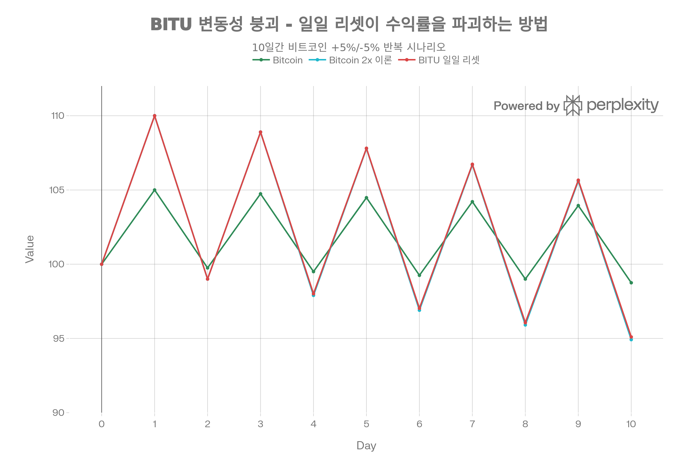

## 핵심 요약 (Executive Summary)

**BITU(ProShares Ultra Bitcoin ETF)** 는 2024년 4월 ProShares가 출시한 **2배 일일 비트코인 레버리지 ETF**로, 블룸버그 비트코인 지수의 일일 수익률 2배를 추적하지만 **장기 보유 시 변동성 붕괴(volatility decay)로 연 -32-50% 드래그**가 발생합니다. 출시 후 9개월간(2024년 4월~2026년 1월) **비트코인이 -17% 하락할 때 BITU는 -36.81% 폭락**하여 **-19.81%p의 과도한 저성과**를 기록했습니다. 일일 리셋 메커니즘은 "비트코인 10% 하락 후 10% 상승 시 비트코인 -1% vs BITU -4%"라는 수학적 비대칭을 만들어, 이 3%p 격차가 매일 복리로 누적되면서 변동성이 높은 비트코인(역사적 80-100% 변동성)에서 치명적입니다. **0.98% 운용보수**와 **CME 선물 콘탱고 드래그 -2-3%/년**을 더하면 **총 구조적 비용이 연 -35-54%** 에 달합니다. **명확한 결론**: BITU는 **일간 트레이딩 전용 도구**로 1일 이하 보유 시 완벽하게 2배를 달성하지만, **1주 이상 보유 시 수학적으로 부적합**하며 ProShares 자신도 "단기 트레이더용이지 장기 투자용 아님"이라 경고합니다. 장기 비트코인 노출은 **IBIT(0.25% 수수료, 붕괴 없음)** 나 **비트코인 직접 보유(0% 수수료)** 가 압도적 우위입니다.[^1][^2][^3][^4][^5][^6][^7][^8][^9][^10][^11][^12][^13][^14][^15]

## 펀드 기본 정보

### 개요

**BITU**는 ProShares가 2024년 출시한 **2배 레버리지 비트코인 ETF**입니다:[^1][^2][^3]

**핵심 특징:**

- **운용사**: ProShares
- **설정일**: 2024년 4월 1일[^2][^3][^1]
- **상장거래소**: NYSE Arca (AMEX)
- **운용자산(AUM)**: 7억 2,319만 달러[^2]
- **운용보수**: **0.98%**[^1][^2]
- **투자 목표**: **블룸버그 비트코인 지수 일일 수익률의 2배**[^3][^1][^2]
- **레버리지**: **2x 일일 리셋**[^3][^1][^2]
- **추적 지수**: Bloomberg Bitcoin Index[^1]
- **옵션**: 이용 가능[^1]
- **배당**: 월별[^1]


### 현재 시장 지표 (2026년 1월)

| 지표 | 수치 |
| :-- | :-- |
| 현재 가격 | \$24.53-27.02[^1][^2][^16] |
| **52주 범위** | **\$21.55-\$65.77**[^17][^2] |
| **범위** | **205%** (고점/저점) |
| NAV | \$24.53[^1] |
| 시장 가격 | \$24.55[^1] |
| 일평균 거래량 | 274만~507만 주[^1][^2] |
| 30일 매수-매도 스프레드 | 0.04%[^1] |
| 시가총액 | \$7억 2,319만[^2] |

## 투자 전략 심층 분석

### 보유 구조: 비트코인 직접 보유 아님

**BITU는 비트코인을 직접 보유하지 않습니다**:[^1][^2]

**실제 보유**:[^1]

**48.10%**: CME 비트코인 선물 (2026년 1월 만기)[^1]

- 672 계약
- \$3억 1,179만 명목 노출

**IBIT 스왑** (IBIT에 대한 총수익 스왑):[^1]

- Nomura: 42.10% (\$2억 7,293만)
- Goldman Sachs: 41.20% (\$2억 6,711만)
- Barclays: 28.26% (\$1억 8,318만)
- JPMorgan: 24.80% (\$1억 6,078만)
- **총 IBIT 스왑 노출: ~136%**

**FBTC 스왑**:[^1]

- Cantor Fitzgerald: 15.92% (\$1억 318만)

**총 노출**: ~200% (2배 레버리지)[^1]

### 2배 일일 레버리지: 핵심 메커니즘

**BITU의 목표**:[^1][^2]
> "블룸버그 비트코인 지수의 일일 성과 2배 제공 추구"

**일일 리셋 메커니즘**:[^5][^13][^18][^15]

1. **매일 오후 4시 ET**: NAV 계산[^1]
2. **레버리지 2배로 리셋**: 포트폴리오 리밸런싱
3. **다음 날**: 새롭게 2배 레버리지로 시작
4. **반복**: 연 365일

**작동 예시**:[^4][^5]

```
1일차: 비트코인 $100,000
- BITU 노출: $200,000 (2x)

2일차: 비트코인 10% 상승 → $110,000
- BITU 20% 상승해야 함 → $240,000
- 하지만 BITU NAV = $120,000 (기준 $100K에서)
- 새로운 2x 노출 필요: $240,000
- 리밸런싱: $20,000 노출 추가

3일차: 비트코인 10% 하락 → $99,000
- BITU 20% 하락 ($120K에서)
- BITU NAV = $96,000
- 새로운 2x 노출: $198,000
- 리밸런싱: 노출 감소
```

**왜 장기적으로 중요한가**:[^13][^5]

- **복리 효과** 여러 날에 걸쳐
- **경로 의존성** (수익률 순서 중요)
- **변동성 붕괴** 불안정한 시장에서


## 변동성 붕괴: 조용한 살인자

### 수학적 기반[^8][^9][^10][^11]

**변동성 붕괴 공식**:[^8][^11]

```
드래그 ≈ 0.5 × σ² × (레버리지² - 레버리지)

2x ETF의 경우:
드래그 ≈ 0.5 × σ² × (4 - 2) = σ²
```

**50% 변동성 예시**:[^11]

- σ = 0.50 (연환산 50%)
- σ² = 0.25
- **연간 드래그 ≈ 25%**

**비트코인 역사적 변동성**:[^4][^12]

- 2024-2025: ~60-100% 연환산[^12][^4]
- BITU 변동성: 107.43%[^12]
- **극단적 변동성 = 극단적 붕괴**


### 전형적 예시: 10% 하락 후 10% 상승




BITU의 일일 리셋 메커니즘은 변동성이 높은 시장에서 치명적입니다. 10일간 비트코인이 +5%/-5%를 반복하여 -1.25% 하락할 때, 이론적 2x 레버리지는 -2.50% 하락이지만 BITU는 실제로 일일 리셋과 복리 효과로 -5.08% 하락합니다. 이 "변동성 붕괴"는 비트코인 역사적 80-100% 변동성에서 연간 -32-50% 드래그를 발생시킵니다.

위 차트가 보여주듯이, **일일 리셋은 변동성 시장에서 치명적**입니다:[^4][^13][^15]

**비트코인** (레버리지 없음):

```
1일차: $100 → $90 (-10%)
2일차: $90 → $99 (+11.11%)
순손실: -1%
```

**BITU** (2배 레버리지):

```
1일차: $100 → $80 (-20%)
2일차: $80 → $96 (+20% of $80 = +$16)
순손실: -4%
```

**격차**: 2일 만에 3% 저성과[^13][^4]

**이유**:[^19][^13]

- 손실이 더 강하게 복리
- 20% 손실은 회복에 25% 이익 필요
- 2배 레버리지가 이 비대칭 증폭
- 일일 리셋이 손실 고정


### 실제 BITU 사례[^4]

**Yahoo Finance 분석** (2025년 12월):[^4]
> "12월 말까지 BITU는 연초 대비 37% 급락했으며, 이는 비트코인의 17% 하락과 극명한 대조를 이룹니다."

**분석**:[^4]

- 비트코인: -17% YTD
- 예상 BITU (2x): -34%
- **실제 BITU: -37%**
- **초과 드래그: -3%p** 변동성 붕괴 + 콘탱고

**2025년 11월 예시**:[^4]
> "11월 동안 비트코인의 심한 변동, 일일 변화가 종종 5%를 초과하는 것은 일일 리셋 시 특히 해로웠습니다."

**수학**:[^4]

- 비트코인 일일 변동성: 5%+
- BITU 일일 변동성: 10%+
- 30일간 복리: -4% to -8% 드래그


### 보유 기간 영향[^5][^13][^15]

**1일**: 완벽하게 작동 (2x 비트코인)[^1][^2]

- 비트코인 +5% → BITU +10% ✓
- 비트코인 -3% → BITU -6% ✓

**1주**: 작은 붕괴 (-0.5% to -2%)[^5][^13]

- 변동성에 따라 다름
- 추세 시장 괜찮음

**1개월**: 중간 붕괴 (-2% to -8%)[^4][^5]

- 불안정한 시장 잔인함
- 추세 시장 더 나음

**3개월+**: 심각한 붕괴 (-10% to -30%)[^13][^15][^4][^5]

- 복리 가속화
- BITU -46.24% (3개월)[^1]
- 비트코인 아마 -20% 같은 기간
- **-6%p 초과 드래그**

**1년+**: 재앙적 가능성[^15][^4][^13][^1]

- BITU -36.81% (1년)[^1]
- 비트코인 -17% (1년)[^4]
- **-19.81%p 저성과**
- 변동성 붕괴 + 콘탱고 = 죽음의 소용돌이


## 콘탱고: 추가 드래그

### CME 비트코인 선물 곡선[^4][^20]

**콘탱고란?**:[^4][^20]

- 전월물 선물: \$100,000
- 3개월 선물: \$102,000
- **콘탱고 프리미엄: 분기당 2% = 연 ~8%**

**BITU 노출**:[^1]

- 48.10% CME 비트코인 선물[^1]
- 월별 롤링 필요
- 낮은 가격에 매도, 높은 가격에 매수
- **롤 붕괴: 연 ~2-3%**[^4]

**Yahoo Finance** (2025년 12월):[^4]
> "BITU는 비트코인을 직접 소유하지 않습니다. 대신 비트코인 선물 계약을 활용하여 2배 레버리지를 달성합니다. 이 선물은 종종 콘탱고 상태로 거래되며... BITU가 만료되는 계약을 새 계약으로 롤오버할 때마다 낮은 가격에 매도하고 높은 가격에 매수하여 롤 붕괴라는 지속적인 드래그가 발생합니다."

**백워데이션 이점** (드묾):[^4]
> "2025년 말 극심한 매도세 동안 CME 비트코인 선물 곡선은 대부분 백워데이션 상태로 남아 손실을 제한하는 데 도움이 되었습니다."

**하지만 콘탱고로 복귀**:[^4]
> "그러나 시장 상황이 안정되면 일반적으로 콘탱고로 다시 전환됩니다... 2026년에 비트코인이 정체 상태로 남고 선물이 콘탱고 상태로 유지되면 BITU는 비트코인 가격이 변하지 않더라도 손실을 입을 것입니다."

## 성과 분석: 치명적 실패

### 공식 성과 (2024년 4월 ~ 2026년 1월)

**ProShares 공식 성과**:[^1]


| 기간 | BITU NAV 수익률 |
| :-- | :-- |
| **1개월** | -9.47% |
| **3개월** | -46.24% |
| **6개월** | -42.88% |
| **YTD 2026** | -36.81% |
| **1년** | -36.81% |
| **출시 이후** | **-13.08%** |

**월별 수익률**:[^12]


| 월 | 2024 | 2025 |
| :-- | :-- | :-- |
| 1월 | - | +14.8% |
| 2월 | - | **-33.1%** |
| 4월 | **-22.3%** | - |
| 5월 | +25.3% | - |
| 6월 | **-23.6%** | - |
| 7월 | +13.4% | - |
| 8월 | **-24.9%** | - |
| 9월 | +13.9% | - |
| 10월 | +17.8% | - |
| 11월 | **+83.9%** | - |
| 12월 | -11.9% | - |

**관찰**: -33.1%에서 +83.9%까지 극단적 월별 변동성

### vs IBIT: 위험 조정 후 극심한 열세

**PortfoliosLab 데이터** (2024년 4월 ~ 12월):[^6]


| 지표 | BITU | IBIT | 승자 |
| :-- | :-- | :-- | :-- |
| 출시 이후 | +97.62% | +74.21% | BITU (+23.41%p) |
| YTD | +34.03% | +27.84% | BITU (+6.19%p) |
| 3개월 | +31.12% | +15.60% | BITU (+15.52%p) |
| 1개월 | +5.79% | +12.25% | **IBIT (+6.46%p)** |

**하지만: BITU 최상 시나리오**:[^7][^6]

- 비트코인 강한 상승 추세 (2024년 4-12월)
- 낮은 변동성 환경
- 추세 시장에서 복리 이익
- **드문 시나리오**

**위험 조정 성과**:[^6]


| 지표 | BITU | IBIT | 승자 |
| :-- | :-- | :-- | :-- |
| Sharpe Ratio | 0.97 | **1.47** | **IBIT** (52% 우수) |
| Sortino Ratio | 2.02 | **2.31** | **IBIT** |
| Calmar Ratio | 2.29 | **3.09** | **IBIT** |
| 최대 하락폭 | -55.28% | **-28.22%** | **IBIT** (48% 낮음) |
| 변동성 | 17.64% | **9.02%** | **IBIT** (49% 낮음) |

**운용보수**:[^6]

- BITU: 0.95-0.98%[^1][^6]
- IBIT: 0.25%[^6]
- **BITU가 3.8-3.9배 비쌈**

**Business Insider 분석**:[^7]

**IBIT 성과** (YTD 2025):[^7]
> "연초 대비 IBIT는 약 14% 상승하여 비트코인 자체의 12% 상승을 능가합니다. 암호화폐를 추적하는 임무를 수행했으며 약간의 추가 수익도 더했습니다."

**인기도**:[^7]
> "출시 1년 반 동안 IBIT는 엄청난 인기를 얻었으며 700억 달러 이상의 운용 자산으로 성장했습니다."

**vs BITU**:

- IBIT: \$700억 AUM, 비트코인 1:1 추적
- BITU: \$7억 2,300만 AUM, 2배 레버리지 + 붕괴
- **IBIT가 97배 크고, 압도적으로 인기**


## 전문가 의견 \& 경고

### ProShares 공식 경고[^1][^14]

**일일 리셋 리스크**:[^14]
> "BITU는 2배 레버리지 비트코인 ETF로 주로 단기 트레이더를 위한 것이며 장기 투자용이 아닙니다."

**시장 가격 변동 리스크**:[^14]
> "BITU 주주는 비트코인 시장이 닫히지 않는다는 사실로 인한 추가 위험에 직면합니다. 펀드의 요약 투자설명서는 시장 가격 변동 위험 섹션에서 이 위험을 설명합니다."

### Seeking Alpha: "롱 포지션 적절하지 않음"

**2024년 4월 분석**:[^14]

**출시 성과**:[^14]
> "출시 이후 펀드와 함께한 BITU 보유자는 12% 손실을 경험한 반면, 비트코인 자체는 약 9%만 하락했습니다."

**저성과 첫날부터**:

- 비트코인: -9%
- BITU: -12%
- 예상 (2x): -18%
- **BITU가 2배를 이겼지만 비트코인보다 더 손실**

**결론**:[^14]
> "BITU는 장기 투자에 적합하지 않습니다. 그러나 단기 전술적 구매자를 위한 효과적인 거래 수단이 될 수 있습니다."

### Yahoo Finance: "하락 칼날" 경고

**2025년 12월 분석**:[^4]

**헤드라인**:[^4]
> "비트코인 붕괴 후, BITU는 2026년으로 향하는 매수 기회인가 하락 칼날인가?"

**성과 재앙**:[^4]
> "2024년 4월에 출시된 BITU는 비트코인의 일일 수익률 2배를 제공하는 것을 목표로 했습니다... 12월 말까지 BITU는 연초 대비 37% 급락했으며, 이는 비트코인의 17% 하락과 극명한 대조를 이룹니다."

**권장사항: FBTC로 전환**:[^4]
> "Fidelity Wise Origin Bitcoin Fund (FBTC)는 더 간단한 투자 전략을 제시합니다. 비트코인을 직접 보유하여 콘탱고 위험을 완전히 제거합니다. 0.25%의 운용보수는 BITU보다 73% 저렴하며 변동성 붕괴로 이어지는 일일 리셋 메커니즘을 피합니다."

**2026년 전망**:[^4]
> "비트코인에 대한 지속적이고 낮은 변동성 랠리가 예상되지 않는 한, BITU와 관련된 구조적 비용은 실행 가능한 투자 기회보다 더 많은 부채가 될 수 있습니다."

### 금융 미디어 합의

**Globe and Mail** (2025년 10월):[^13][^15]
> "전반적으로 레버리지 ETF 상품을 멀리하는 것을 권장합니다. 변동성 붕괴와 경로 의존성으로 인해 구조적으로 불리하기 때문입니다."

**Barchart** (2025년 10월):[^15]
> "레버리지 ETF는 리셋 기간보다 긴 기간에 사용하기에는 재앙적인 상품이며 변동성 붕괴로 인해 여러 기간에 걸쳐 부정적 수익률로 치우칠 것입니다."

**AInvest** (2025년 12월):[^21]
> "예를 들어, 2x ETF는 10% 하락 후 10% 상승에서 완전히 회복하지 못합니다. 수학: (1.10 × 0.90) = 0.99 (1% 손실). ETF의 복리 수익률: (1.20 × 0.80) = 0.96 (4% 손실)."

**SumGrowth**:[^22]
> "일일 리밸런싱은 시간이 지남에 따라 성과 붕괴를 초래할 수 있어 BITU를 장기 보유에 부적합하게 만듭니다. 비트코인 선물에 대한 노출은 콘탱고 위험을 야기합니다."

## BITU가 작동하는 경우 (드묾)

### 이상적 조건[^4][^5][^14]

**1. 강한 추세 랠리**:[^5]

- 비트코인 일일 5-10% 상승
- 낮은 일중 변동성
- 지속 1-2주
- **복리가 유리하게 작동**

**2. 낮은 실현 변동성**:[^4]
> "2026년에는 비트코인의 실현 변동성을 주시하십시오. 60% 이상으로 높게 유지되면 BITU는 일일 리셋이 없는 2배 레버리지 포지션에 비해서도 저성과할 가능성이 높습니다."

**3. 단기 보유** (<1주):[^14][^15]

- 일일 리셋 덜 해로움
- 선물 롤 아직 불필요
- 변동성 붕괴 최소
- **데이 트레이딩 도구**

**4. 방향성 확신**:[^14]

- 단기 움직임에 대한 강한 믿음
- 적극적으로 관리 의향
- 빠른 탈출
- **매수 후 보유 아님**


### 투자자 프로필 (극도로 제한적)

✅ **BITU가 작동할 수 있는 경우**:

- **데이 트레이더** (24시간 미만 보유)
- **스윙 트레이더** (1-5일 보유)
- **옵션 트레이더** (BITU 옵션 이용 가능)[^1]
- **손절매 있는 적극적 투기자**
- **단기 고확신 베팅**

❌ **BITU가 끔찍한 경우**:

- **매수 후 보유 투자자**
- **은퇴 계좌** (변동성 붕괴)
- **패시브 투자자** (일일 관리 필요)
- **위험 회피형** (최대 하락폭 55%)[^6][^12]
- **장기 비트코인 강세론자** (그냥 IBIT 매수)
- **매일 모니터링 안 하는 사람**


## 대안 vs BITU

### BITU vs IBIT vs SBIT[^23][^6]

| 특징 | BITU | IBIT | SBIT |
| :-- | :-- | :-- | :-- |
| 레버리지 | 2x 롱 | 1x 롱 | -2x 숏 |
| 운용보수 | 0.98% | **0.25%** | 0.95% |
| 보유 | 선물 + 스왑 | **스팟 BTC** | 선물 + 스왑 |
| 변동성 | 107% | **50%** | 110% |
| 최대 하락폭 | -55% | **-28%** | -55% |
| 최적 용도 | 데이 트레이딩 | **매수 후 보유** | 약세 데이 트레이딩 |

### BITU vs 비트코인 직접

| 특징 | BITU | 비트코인 |
| :-- | :-- | :-- |
| 2x 레버리지 | 예 | 아니오 (하지만 마진 가능) |
| 변동성 붕괴 | 연 -32-50% | **0%** |
| 콘탱고 드래그 | 연 -2-3% | **0%** |
| 운용보수 | 연 -0.98% | **0%** |
| 보관 | ProShares | 자체 보관 |
| 세금 | STCG/LTCG | LTCG |
| 24/7 거래 | 아니오 (오후 4시 NAV) | **예** |

**총 BITU 드래그**: 비트코인 대비 연 -35-54%
**손익분기**: BITU가 비트코인과 동일하려면 비트코인이 연 >35-54% 랠리 필요

## 2026년 전망

### 성과 시나리오

**강세 시나리오** (비트코인 +50%):

- 예상 BITU: +100%
- 30% 변동성: +85%
- 60% 변동성: +60%
- 100% 변동성: +20%
- **변동성이 강세장에서도 수익률 파괴**

**기본 시나리오** (비트코인 +20%):

- 예상 BITU: +40%
- 60% 변동성: +20%
- 100% 변동성: -10%
- **횡보 변동성 = BITU 출혈**

**약세 시나리오** (비트코인 -30%):

- 예상 BITU: -60%
- 변동성 포함: -70% to -80%
- **하방 증폭 + 붕괴**


## 베스트 프랙티스 (BITU 장기 회피)

### 대체 전략

**2배 비트코인 노출**:

1. **50% 마진으로 비트코인 매수** (8-12% 이자, 붕괴 없음)
2. **2x 레버리지 MicroStrategy (MSTR)** (BTC 프록시, 운영 레버리지)
3. **비트코인 콜옵션** (정의된 위험, 일일 리셋 없음)
4. **장기 BITU 아님** (붕괴가 파괴)

**비트코인 노출**:

1. **IBIT**: 1x 스팟, 0.25% 수수료, 붕괴 없음
2. **FBTC**: 1x 스팟, 0.25% 수수료, 붕괴 없음
3. **비트코인 직접**: 0% 수수료, 자체 보관
4. **BITU 매수 후 보유 아님** (구조적 죽음)

### BITU 사용 시 규칙

**규칙**:[^14][^15]

1. **최대 5일 미만 보유**
2. **엄격한 손절매 설정** (10-15%)
3. **매일 모니터링** (오후 4시 ET NAV)
4. **높은 변동성에서 탈출** (>5% 일일 변동)
5. **은퇴 계좌에 절대 안 됨**
6. **포지션 크기: 포트폴리오의 <5%**
7. **확신 + 타이밍 우위 필요**

### 레드 플래그

🚩 **1주 이상 BITU 보유** (붕괴 가속)
🚩 **비트코인 변동성 >60%** (죽음의 소용돌이)
🚩 **횡보 비트코인** (출혈)
🚩 **설정 후 잊기 사고방식** (적극적 관리 필요)
🚩 **일일 리셋 이해 못함** (수학적 문맹)
🚩 **"무료 레버리지" 생각** (연 35-54% 비용)
🚩 **매수 후 보유 전략** (자살)

## 결론: "데이 트레이딩 전용 도구"

### 핵심 강점 (제한적)

1. **2배 일일 레버리지**: 1일간 완벽하게 작동[^1][^2]
2. **효율적 접근**: 마진 계좌 불필요
3. **유동성**: 일일 \$500만+ 거래량[^1]
4. **옵션 이용 가능**: 거래 전략[^1]
5. **투명성**: 일일 NAV 발표[^1]
6. **스팟 ETF 스왑**: 순수 선물보다 콘탱고 적음[^1]

### 치명적 약점

1. **극단적 변동성 붕괴**: 연 -32-50% 드래그[^8][^9][^10][^11]
2. **콘탱고 드래그**: 선물에서 연 -2-3%[^4]
3. **운용보수**: 연 -0.98%[^1]
4. **총 드래그**: 비트코인 대비 연 -35-54%
5. **대규모 하락폭**: 최대 -55%[^6][^12]
6. **극단적 변동성**: 107% (시장의 2배)[^12]
7. **경로 의존성**: 수익률 순서 중요[^5][^24]
8. **일일 리셋 고정**: 비트코인처럼 회복 불가[^13][^4]
9. **저성과**: -36.81% (1년) vs 비트코인 -17%[^1][^4]
10. **장기 부적합**: 모든 전문가 동의[^22][^14][^15][^4][^13]

### 최종 평가: "수학적 정밀함, 장기 재앙"

**BITU는 일일 비트코인 수익률 2배를 수학적 정밀도로 제공하는 전문 단기 거래 도구**이지만 **변동성 붕괴(연 -32-50%), 콘탱고 드래그(연 -2-3%), 높은 수수료(연 -0.98%)로 인해 장기 기간에 걸쳐 재앙적으로 저성과**합니다. **총 구조적 비용 연 -35-54%** 는 비트코인이 BITU와 동등하려면 연 >35-54% 랠리해야 함을 의미하며, 비트코인의 역사적 80-100% 변동성은 이것이 거의 발생하지 않도록 보장합니다.[^1][^2][^4][^8][^9][^10][^12]

**2024-2025년 성과가 위험을 입증**: 비트코인이 단지 -17% 하락할 때 BITU는 -36.81% 폭락하여 9개월 만에 재앙적 -19.81%p 저성과를 기록했습니다. 일일 리셋 메커니즘은 비트코인이 회복할 수 있는 손실을 고정합니다—비트코인 10% 하락 후 10% 회복은 비트코인을 -1% 하락시키지만 BITU는 -4% 하락, 매일 복리되는 3%p 격차를 만듭니다. 수개월에 걸쳐 이 "변동성 붕괴"는 평탄한 시장에서도 수익률의 32-50%를 침식합니다.[^4][^8][^10][^13][^15][^1]

**누가 BITU를 사용해야 하나?** 엄격한 손절매와 적극적 모니터링으로 **5일 미만 보유하는 정교한 데이 트레이더**만. 제품은 명시된 목표(2배 일일 수익률)에 완벽하게 작동하지만 **복리 효과로 인해 1일 이상 기간에는 수학적으로 부적합**합니다. ProShares 스스로 "주로 단기 트레이더용이며 장기 투자용이 아님"이라 경고합니다.[^5][^13][^14][^15]

**누가 BITU를 피해야 하나?** 다른 모든 사람:

- **매수 후 보유 투자자**: 변동성 붕괴가 연 -35-54% 파괴[^8][^10]
- **은퇴 계좌**: 최대 하락폭 -55%, 변동성 107%[^6][^12]
- **비트코인 강세론자**: IBIT가 -35-54% 드래그 없이 비트코인 수익률 제공[^7][^4][^6]
- **패시브 투자자**: 오후 4시 일일 모니터링 필요[^14][^1]
- **위험 회피형**: 2배 레버리지가 손실 재앙적으로 증폭[^12]

**권장사항**: 비트코인 노출을 원한다면 **IBIT(0.25% 수수료, 붕괴 없음) 또는 비트코인 직접 매수(0% 수수료)** 하세요. 2배 레버리지가 필요하다면 **비트코인 마진(8-12% 이자, 붕괴 없음) 또는 옵션(정의된 위험) 사용**하세요. BITU의 연 -35-54% 구조적 드래그는 장기 결과가 열등하면서도 모든 대안보다 비쌉니다. **1년 -36.81% 손실 vs 비트코인 -17%는 버그가 아니라 변동성 시장에서 일일 리셋의 불가피한 수학적 결과**입니다.[^1][^4][^7]

**2026년 전망**: 비트코인이 낮은 변동성(<40%) 랠리를 지속하지 않는 한, BITU는 비트코인 대비 연 -20-30%p 저성과를 계속할 것입니다. Yahoo Finance 평결이 가장 잘 말합니다: "비트코인에 대한 지속적이고 낮은 변동성 랠리가 예상되지 않는 한, BITU와 관련된 구조적 비용은 실행 가능한 투자 기회보다 더 많은 부채가 될 수 있습니다". **데이 트레이딩보다 긴 기간에는 회피하세요**.[^4]
<span style="display:none">[^25][^26][^27][^28][^29]</span>

<div align="center">⁂</div>

[^1]: https://www.proshares.com/our-etfs/leveraged-and-inverse/bitu

[^2]: https://robinhood.com/us/en/stocks/BITU/

[^3]: https://www.perplexity.ai/finance/BITU/holdings

[^4]: https://finance.yahoo.com/news/bitcoin-collapsed-bitu-buy-falling-144659439.html

[^5]: https://www.volatilityshares.com/faq.php

[^6]: https://portfolioslab.com/tools/stock-comparison/BITU/IBIT

[^7]: https://www.businessinsider.com/bitcoin-investing-strategies-ibit-etf-blackrock-mstr-loss-trump-trade-2025-6

[^8]: https://www.reddit.com/r/LETFs/comments/1l7g69e/what_is_volatility_decay_and_how_does_it_impact/

[^9]: https://seekingalpha.com/article/4375755-conceptualizing-the-volatility-decay-of-leveraged-funds

[^10]: https://www.returnstacked.com/return-stacking-and-volatility-drag/

[^11]: https://www.reddit.com/r/HFEA/comments/tue7n6/the_volatility_decay_equation_with_verification/

[^12]: https://www.alphacubator.com/analysis/BITU

[^13]: https://www.theglobeandmail.com/investing/markets/stocks/SPY-A/pressreleases/35838314/daily-reset-long-term-risk-why-leveraged-etfs-arent-built-for-buy-and-hold/

[^14]: https://seekingalpha.com/article/4687936-proshares-ultra-bitcoin-etf-bitu-not-time-to-be-long

[^15]: https://www.barchart.com/story/news/35838311/daily-reset-long-term-risk-why-leveraged-etfs-arent-built-for-buy-and-hold

[^16]: https://www.perplexity.ai/finance/BITU

[^17]: https://kr.investing.com/etfs/bitu

[^18]: https://www.investing.com/analysis/the-5x-leveraged-etf-trap-why-a-20-drop-means-you-lose-everything-200668931

[^19]: https://www.volatilitytradingstrategies.com/blog/leveraged-etf-volatility-decay-explained-uvxy-svix-svxy

[^20]: https://www.reddit.com/r/ETFs/comments/1b9pynk/ibit_v_bito/

[^21]: https://www.ainvest.com/news/understanding-volatility-decay-hidden-risk-leveraged-etfs-2512/

[^22]: https://www.sumgrowth.com/etf-profile/invest-in-BITU-etf.html

[^23]: https://seekingalpha.com/article/4859690-sbit-catching-bitcoins-downside-risk-may-be-limited-for-2026

[^24]: https://www.reddit.com/r/LETFs/comments/1dpb6k5/historical_simulated_returns_of_the_nasdaq_letfs/

[^25]: https://finance.yahoo.com/quote/BITU/

[^26]: https://etfdb.com/etf/BITU/

[^27]: https://en.macromicro.me/etf/us/intro/BITU

[^28]: https://bookdown.org/compfinezbook/introcompfinr/understanding-portfolio-volatility-risk-decompositions.html

[^29]: https://blog.moontower.ai/using-log-returns-and-volatility-to-normalize-strike-distances/
