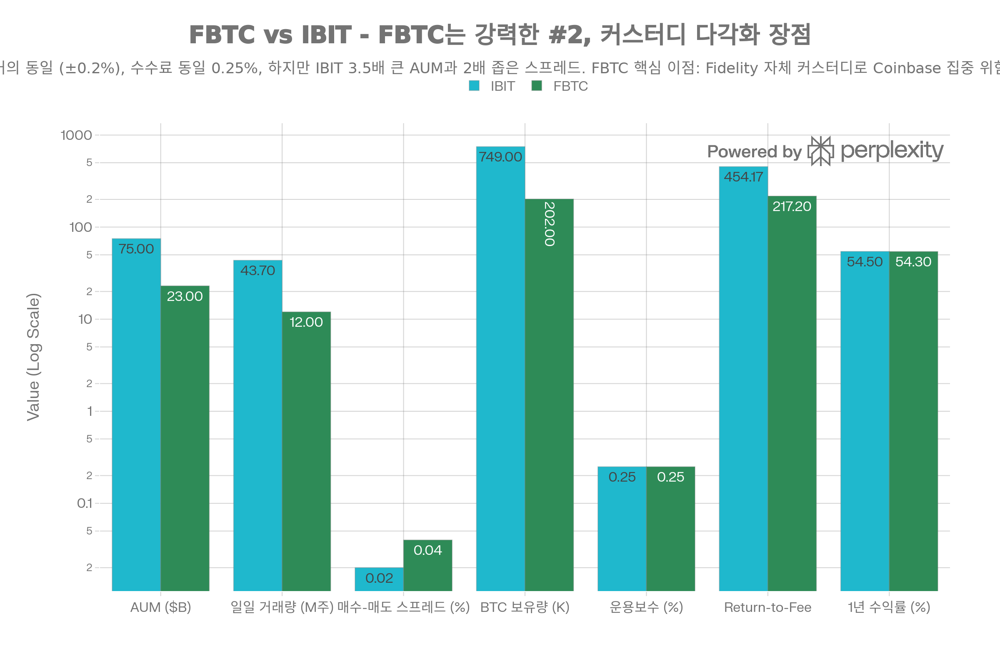

## 핵심 요약 (Executive Summary)

**FBTC(Fidelity Wise Origin Bitcoin Fund)** 는 Fidelity Investments가 2024년 1월 출시한 **스팟 비트코인 ETF**로, **\$20-26B AUM과 ~20% 시장점유율**로 IBIT에 이어 **확고한 \#2 위치**를 차지하며, IBIT와 **거의 동일한 성과**(1년 수익률 54.3% vs 54.5%, ±0.2% 차이)와 **동일한 0.25% 운용보수**를 제공합니다. FBTC의 **핵심 차별화 요소는 Fidelity Digital Assets 자체 커스터디**로, 11개 스팟 비트코인 ETF 중 8개(73%)가 사용하는 Coinbase 의존도를 제거하여 **커스터디 집중 위험을 완화**합니다. Fidelity는 **2014년부터 비트코인 연구**와 **70년 이상의 증권 시장 경험**을 바탕으로 NYDFS 인가 신탁회사인 Fidelity Digital Assets를 통해 **100% 콜드 스토리지, 다중 사이트 이중화, 옴니버스 모델**로 기관급 보안을 제공합니다. **2026년 1월 최근 유입**에서 FBTC는 IBIT를 초과하여 **\$351M vs \$126M(2.8배)** 를 기록하며 기관 신뢰를 증명했습니다. 하지만 FBTC의 **주요 약점은 유동성 격차**로, IBIT 대비 **3-4배 낮은 거래량**과 **2배 넓은 매수-매도 스프레드**(0.04% vs 0.02%)가 "악순환"을 만들어 활발한 트레이더를 IBIT로 유도합니다. **명확한 결론**: FBTC는 **Fidelity 계좌 보유자, 매수 후 보유 투자자, 커스터디 다각화 추구자에게 탁월**하며, **IBIT + FBTC 50/50 분할**이 Coinbase와 Fidelity 이중 커스터디로 단일 장애점 위험을 제거하는 **최적 전략**입니다. 활발한 트레이더는 IBIT의 유동성 우위를 선호하지만, 장기 보유자에게 0.02% 스프레드 차이는 \$10K당 \$2로 무의미하며 FBTC는 "IBIT의 Pepsi"—약간 덜 인기지만 동등한 품질과 정당한 선호 이유를 가진 강력한 대안입니다.[^1][^2][^3][^4][^5][^6][^7][^8][^9][^10][^11][^12][^13][^14][^15][^16]

## 펀드 기본 정보

### 개요

**FBTC**는 Fidelity Investments가 2024년 출시한 **스팟 비트코인 ETF**입니다:[^1][^17][^18]

**핵심 특징:**

- **운용사**: Fidelity Investments (70년 이상 증권 시장 경험)
- **설정일**: 2024년 1월 11일[^18][^19][^1]
- **상장거래소**: NYSE/CBOE
- **운용자산(AUM)**: **\$20-26B**[^2][^19][^12][^14][^15][^16]
- **운용보수**: **0.25%** (처음 6개월 또는 \$1B까지 면제)[^17][^3][^20][^1]
- **투자 목표**: **비트코인 스팟 가격 추적**[^1][^17]
- **구조**: Grantor Trust
- **커스터디**: **Fidelity Digital Assets (자체 커스터디)**[^6][^7][^8][^10][^17][^1]
- **옵션**: 이용 가능
- **비트코인 보유량**: ~202,000 BTC[^15]

### 현재 시장 지표 (2026년 1월)

| 지표 | 수치 |
| :-- | :-- |
| 현재 가격 | \$78.59-85.12[^21][^22][^19] |
| **52주 범위** | **\$66.06-\$110.25**[^21][^19] |
| **범위** | **67%** (고점/저점) |
| NAV | 일일 계산 (오후 4시 ET)[^17][^23] |
| 일평균 거래량 | 5.35M 주 (IBIT의 ~27%)[^19][^5][^12] |
| **시가총액** | **\$18.65-23.19B AUM**[^19][^12] |
| **시장점유율** | **~17-22%** (비트코인 ETF)[^2][^16] |
| 비트코인 보유량 | ~202,000 BTC (IBIT 749,000의 27%)[^15] |

## 핵심 차별화: Fidelity 자체 커스터디 모델

FBTC는 IBIT와 거의 동일한 성과(1년 수익률 54.3% vs 54.5%, ±0.2% 차이)와 동일한 0.25% 운용보수를 제공하지만, AUM \$23B(IBIT \$75B의 31%), 일일 거래량 12M주(IBIT 43.7M의 27%), 매수-매도 스프레드 0.04%(IBIT 0.02%의 2배)로 유동성 격차가 존재합니다. 하지만 FBTC의 핵심 이점은 Fidelity Digital Assets 자체 커스터디로, 8개 ETF(73%)가 사용하는 Coinbase 집중 위험을 제거합니다. 최근 일일 유입에서 FBTC가 IBIT를 초과한 사례(\$351M vs \$126M, 2026년 1월)는 기관 신뢰를 증명합니다. 매수 후 보유 투자자에게는 유동성 격차가 무의미하며, IBIT + FBTC 50/50 분할이 커스터디 다각화를 위한 최적 전략입니다.

위 차트가 보여주듯이, **FBTC는 성과와 수수료에서 IBIT와 동등하지만 유동성에서 격차**가 있으며, **핵심 이점은 자체 커스터디**입니다.[^8][^10][^15]

### 독립적 커스터디 (Coinbase 아님)[^1][^17][^6][^7][^10][^8]

**Fidelity Digital Assets** (2024):[^1]
> "Fidelity Digital Assets®는 광범위한 운영, 사이버 및 물리적 통제로 자산을 보호하여 Fidelity® Wise Origin® Bitcoin Fund의 비트코인 커스터디를 제공합니다."

**LinkedIn 분석**:[^10]
> "많은 경쟁사와 달리 FBTC는 NYDFS 인가 신탁회사인 Fidelity Digital Assets (FDAS)를 통해 자체 커스터디(자체 보관이라고도 함)를 사용합니다. 이는 Fidelity 자체(외부 당사자가 아님)가 FBTC를 뒷받침하는 비트코인을 보유하고 보안을 유지함을 의미합니다."

**OKX 분석**:[^8]
> "Fidelity Digital Assets는 독립적으로 운영하고 독점 인프라를 활용하여 비트코인 커스터디에 대한 독특한 접근 방식을 취합니다. 이 전략은 기관 고객을 위한 안전하고 신뢰할 수 있는 서비스 제공에 대한 Fidelity의 헌신을 강조합니다. 예를 들어, Fidelity의 FBTC 펀드는 전적으로 사내에서 관리되며, 이는 제3자 솔루션보다 자체 보관을 선호하는 회사의 선호를 반영합니다."

**핵심 이점**: 커스터디 집중 위험 제거

- **IBIT**: Coinbase 커스터디 (11개 스팟 ETF 중 8개가 Coinbase 사용)
- **FBTC**: Fidelity Digital Assets (독점)
- **다각화 이점**: IBIT + FBTC 보유 = 두 커스터디언

### Fidelity Digital Assets 보안[^6][^7][^13]

**콜드 스토리지**:[^6][^7]

- 100% 오프라인 콜드 볼트 스토리지
- 24/7 현장 보안
- 견고한 룸 구조 (TEMPEST 차폐, RF 차단)
- 다중 인원 및 다중 조직 접근 제어
- 동적 권한 구조
- 다단계 인증

**다중 사이트 스토리지**:[^7]
> "프라이빗 키는 각각 별도의 직원 팀이 다양한 지리적 위치에서 접근하고 승인해야 합니다. 우리의 다중 사이트 설계는 어떤 사이트가 완전히 사용 불가능해도 완전한 이중화를 허용합니다."

**옴니버스 모델**:[^13]

- 자산을 옴니버스 방식으로 관리
- 장부 및 기록 수준에서 분리
- 온체인 프라이버시
- 최대 유동성 및 보안
- 향상된 운영 효율성

**Fidelity 옴니버스 모델 이점**:[^13]

1. **키 생성 및 관리**: 유연성, 위험 관리 제어
2. **유동성**: 고객 간 효율적인 자금 이동
3. **거래 수수료**: 집계 및 일괄 처리 도구
4. **프라이버시**: 분리된 주소가 개별 고객과 연결되지 않음
5. **확장성**: 수천 개의 키 쌍 관리 없이 효율적

### Fidelity 경험[^1]

**기관 배경**:[^1]
> "Fidelity는 2014년부터 비트코인을 연구하고 블록체인 솔루션을 개발해 왔습니다."

> "70년 이상의 증권 시장 경험을 바탕으로, 우리는 디지털 자산에서 성장하는 시장 존재감을 구축하고 있습니다."

**Fidelity Digital Assets®**:[^7]

- NYDFS 인가 신탁회사[^10]
- BTC, ETH, LTC, SOL 커스터디 및 거래 제공[^7]
- 기업급 커스터디 솔루션[^17]
- 기관급 인프라

## 성과 분석: IBIT와 거의 동일

### 공식 성과 비교[^2][^24][^4]

**Crypto Research Report** (2026년 1월):[^2]

| 특징 | IBIT | FBTC |
| :-- | :-- | :-- |
| AUM | \$55B | \$20B |
| 운용보수 | 0.12% → 0.25% | 0.25% |
| **1년 수익률** | **+54.5%** | **+54.3%** |
| Return-to-Fee | 454.17 | 217.20 |
| 최대 하락폭 | -28% | 유사 |

**Forbes 분석** (2025년 3월):[^4]
> "1년 성과 측면에서 FBTC는 137.65% 수익률로 IBIT의 137.32%를 약간 능가했지만, 미래 수익률은 유사할 것으로 예상됩니다."

**핵심 인사이트**: **성과 본질적으로 동일** (±0.2%), 하지만 IBIT가 위험 조정 후 더 나음

**위험 조정 성과**:[^24]

- GBTC 위험 조정 비율: 0.23
- FBTC 위험 조정 비율: 0.21
- **IBIT 위험 조정 비율: 0.37 (최고)**

### 비트코인 추적[^17][^23]

**Fidelity 공식**:[^17]
> "펀드는 Fidelity Bitcoin Reference Rate의 성과로 측정되는 비트코인의 성과를 수동적으로 추적합니다. FBTC는 100% 비트코인을 보유합니다."

**지수 방법론**:[^23]
> "지수는 적격 비트코인 스팟 시장의 비트코인 가격 피드와 15초마다 계산되는 거래량 가중 중앙값 가격('VWMP') 방법론을 사용하여 구성되며, 60분 롤링 증분에 걸친 VWMP 스팟 시장 데이터를 기반으로 합니다."

**NAV 산출**: 매일 오후 4:00 ET[^17][^23]

## 운용보수: IBIT와 동일 (면제 후)

### 수수료 구조[^1][^17][^3][^20]

**공식 Fidelity 성명**:[^17]
> "Fidelity Investments는 2024년 8월 1일 기준으로 25 베이시스 포인트의 운용보수를 부과하고 있습니다."

**현재 상태**: **0.25%** (IBIT와 동일)[^2][^3][^20][^4]

### 연간 비용 분석[^3]

| 투자 금액 | 연간 수수료 (0.25%) |
| :-- | :-- |
| \$1,000 | \$2.50 |
| \$5,000 | \$12.50 |
| \$10,000 | \$25.00 |
| \$50,000 | \$125.00 |

**10년 비용**: 누적 -2.5% (IBIT와 동일)

### Return-to-Fee Ratio[^2]

**FBTC**: 217.20
**IBIT**: 454.17

**IBIT가 2.1배 우수**—하지만 이는 IBIT의 0.12% 면제 기간 이점을 반영

- IBIT는 처음 6개월 또는 \$5B AUM까지 0.12% (빠르게 달성)
- FBTC는 처음부터 0.25% (또는 면제가 덜 관대)
- **앞으로 0.25% 둘 다에서 수렴해야 함**

## 유동성 격차: FBTC의 주요 약점

### 거래량 비교[^5][^9][^12][^15]

**QuickNode 분석** (2025):[^15]
> "두 ETF 모두 동일한 0.25% 운용보수를 부과하지만 IBIT는 다음을 보유합니다:
> - IBIT는 ~202,000 BTC를 보유한 FBTC보다 ~3.5–3.7배 많은 BTC를 보유,
> - 3-4배 높은 일일 거래량, 그리고
> - 더 좁은 매수-매도 스프레드 (0.02% vs FBTC의 0.04%)."

**Seeking Alpha** (2024년 12월):[^5]
> "FBTC의 주요 단점—거의 모든 비트코인 ETF가 공유하는—은 IBIT에 비해 높은 평균 스프레드입니다. 이것이 매수 후 보유 투자자에게 반드시 거래 중단 요인은 아니지만, 더 자주 거래하거나 더 큰 주문을 빠르게 실행해야 하는 사람들에게는 마찰을 만듭니다."

**C-Charge 분석**:[^12]

| 측면 | FBTC | IBIT |
| :-- | :-- | :-- |
| AUM | \$16.6-26B | \$48.8-98.5B |
| 일일 거래량 | 낮음 | 높음 |
| 매수-매도 스프레드 | 넓음 | **좁음** |
| 유동성 | 좋음 | **우수** |

### "악순환" 문제[^5]

**Seeking Alpha**:[^5]
> "IBIT는 '선순환'의 이점을 얻으며, 우수한 유동성이 빈번한 트레이더를 유치하여 스프레드를 향상시킵니다. 반대로 FBTC는 '악순환'을 경험하며 거래 활동이 감소합니다."

**선순환 (IBIT)**:

1. 큰 AUM → 더 많은 유동성
2. 더 많은 유동성 → 더 좁은 스프레드
3. 더 좁은 스프레드 → 트레이더 유치
4. 더 많은 트레이더 → 더 많은 유동성
5. **피드백 루프가 지배력 강화**

**악순환 (FBTC)**:

1. 작은 AUM → 적은 유동성
2. 적은 유동성 → 넓은 스프레드
3. 넓은 스프레드 → 활발한 트레이더 억제
4. 적은 트레이더 → 더 적은 유동성
5. **피드백 루프가 격차 확대**

### 실질적 영향[^9][^12][^5]

**매수 후 보유 투자자의 경우**: 최소 영향[^5]

- 0.04% vs 0.02% 스프레드 = \$10K에서 \$2 vs \$4
- 드문 거래 = 스프레드 비용 무시 가능
- **FBTC 완벽하게 적합**

**활발한 트레이더의 경우**: 눈에 띄는 영향[^12][^5]

- 2배 넓은 스프레드가 여러 거래에 걸쳐 누적
- 더 큰 주문은 더 나쁜 실행 가능
- \$1M+ 주문에서 슬리피지
- **IBIT 명확히 우수**

**기관의 경우**: 중간 영향[^9][^12]

- IBIT의 \$87.63B AUM vs FBTC의 \$23.19B[^12]
- IBIT가 \$100M+ 배분에 더 쉬움
- IBIT에서 가격 영향 낮음
- **IBIT 선호하지만 FBTC 허용 가능**

## 기관 채택: 강력한 최근 모멘텀

### 최근 유입 (2025-2026)[^11][^14]

**AInvest 보고서** (2026년 1월):[^11]
> "2026년 초 비트코인 ETF 유입 급증—2026년 1월 13일 \$7억 5,370만 정점—은 2025년 말 유출에서 중요한 반전을 나타냅니다. 이 유입은 **Fidelity의 FBTC (\$3억 5,100만)**, Bitwise의 BITB (\$1억 5,900만), BlackRock의 IBIT (\$1억 2,600만)을 포함한 주요 기관 참여자가 주도했습니다."

**Spectrum Search** (2025년 12월):[^14]
> "유입 돌격을 이끈 것은 **Fidelity의 Wise Origin Bitcoin Fund (FBTC)** 로, 인상적인 **\$3억 9,100만**의 신규 자본을 포획했습니다—그날 총 유입의 가장 큰 몫을 차지합니다. Fidelity의 성과는 약 \$1억 1,100만을 끌어들인 **BlackRock의 iShares Bitcoin Trust (IBIT)** 를 크게 앞질렀습니다."

**핵심 인사이트**: **FBTC가 때때로 유입 주도**

- 2026년 1월 13일: FBTC \$351M vs IBIT \$126M (2.8배)
- 2025년 12월: FBTC \$391M vs IBIT \$111M (3.5배)
- **FBTC가 상당한 기관 자본 포획**

### 누적 포지션[^16][^11][^14]

**AInvest** (2026년 1월):[^11]
> "신선한 활동의 물결은 모든 미국 스팟 비트코인 ETF의 총 누적 유입을 **\$570억** 이상으로 밀어 올렸으며, 총 자산은 이제 **\$1,120억**을 초과합니다."

**B2Broker** (2025년 12월):[^16]
> "2025년 말까지 스팟 비트코인 ETF는 \$1,150억 이상의 결합 자산을 관리했으며, BlackRock의 IBIT (\$750억)와 Fidelity의 FBTC (> \$200억)가 주도했습니다."

**FBTC 시장 포지션**:

- AUM 기준 \#2 스팟 비트코인 ETF
- \$20-26B AUM (vs IBIT \$75-100B)
- ~17-22% 시장점유율 (vs IBIT 61-75%)
- **확고한 \#2, 하지만 먼 2위**

## FBTC vs IBIT: 직접 비교

### FBTC가 적합한 경우[^5][^9][^10][^12]

**Seeking Alpha** (2024년 12월):[^5]
> "IBIT는 동등한 접근 권한을 가진 투자자에게 유동성 우위로 인해 선호되는 선택으로 남아 있습니다. 그러나 FBTC는 Fidelity 계좌로 제한된 사람들에게 주요 단점 없이 경쟁력 있는 노출을 제공하는 견고한 옵션입니다."

**Cortex Alpha**:[^9]
**FBTC 고려 대상:**

- Fidelity의 직접 커스터디 모델 선호
- 이미 투자에 Fidelity 사용
- 장기 매수 후 보유 투자자

**LinkedIn 분석**:[^10]
> "재무 자문가가 비트코인 ETF로 FBTC를 선택해야 하는 이유:
> 1. Coinbase 의존 ETF보다 깨끗한 커스터디 모델
> 2. Fidelity의 70년 이상 증권 시장 경험
> 3. Fidelity 플랫폼과의 원활한 통합"

### IBIT가 적합한 경우[^12][^5][^9]

**Cortex Alpha**:[^9]
**IBIT 고려 대상:**

- 더 높은 유동성과 거래량 선호
- BlackRock의 브랜드와 실적이 매력적
- 포지션을 자주 출입 거래

**C-Charge**:[^12]
> "IBIT는 일반적으로 더 큰 관리 자산과 더 활발한 기관 채택 덕분에 더 높은 유동성을 가지고 있습니다. 이 증가된 유동성은 더 좁은 매수-매도 스프레드와 더 낮은 거래 비용으로 이어져 활발한 트레이더와 대형 기관 투자자에게 이익이 됩니다."

### 하이브리드 전략 (최고)[^5][^10]

**권장 접근법**:

1. **IBIT + FBTC 둘 다 보유**
2. **커스터디 다각화**: Coinbase (IBIT) + Fidelity (FBTC)
3. **단일 커스터디언 위험 감소**
4. **배분 최적화**:
    - IRA: IBIT (더 크고 유동적)
    - 과세 계좌: FBTC (Fidelity 통합)
    - 또는 50/50 분할

**LinkedIn**:[^10]
> "상당한 배분을 관리하는 자문가의 경우 FBTC의 자체 커스터디는 제3자 커스터디언과 함께 존재하는 거래상대방 위험 계층을 제거합니다."

## Designated Investments Agreement (DIA)[^17]

### Fidelity 특정 요구사항[^17]

**DIA란?**:[^17]
> "Fidelity® Wise Origin® Bitcoin Fund 및 유사한 스팟 비트코인 ETP 상품에 대한 주문을 하려면 투자자가 Fidelity의 Designated Investments Agreement (DIA)를 실행해야 합니다. Fidelity는 특정 복잡하고 위험한 상품에 DIA를 요구합니다."

**계좌 요구사항**:[^17]

- 투자 목표가 "Most Aggressive"여야 함
- 일회성 계약 실행
- Fidelity.com 사용자: 거래 세부 정보 입력 후 프롬프트
- 모바일 앱 사용자: 브라우저로 리디렉션

**비교**:

- IBIT: 특별 계약 없음 (표준 증권)
- FBTC: DIA 필요 (Fidelity 특정)
- **FBTC에 약간 더 높은 마찰**

## IBIT 대비 장점

### 1. 자체 커스터디 모델[^8][^10]

**Coinbase 집중 위험 제거**:

- 11개 스팟 비트코인 ETF 중 8개가 Coinbase 커스터디 사용
- Coinbase 실패 = 시장 73%에 시스템 위험
- **FBTC는 Fidelity Digital Assets 사용 = 독립적**

### 2. Fidelity 브랜드 \& 통합[^1][^9][^10]

**70년 이상 증권 경험**:[^1]

- 확립된 브랜드 신뢰
- 막대한 개인 투자자 기반
- 원활한 플랫폼 통합

### 3. 2014년부터 암호화폐 전문성[^1]

**초기 진입자**:[^1]
> "Fidelity는 2014년부터 비트코인을 연구하고 블록체인 솔루션을 개발해 왔습니다."

### 4. 강력한 최근 유입[^11][^14]

**때때로 IBIT 능가**:

- 2026년 1월 13일: FBTC \$351M vs IBIT \$126M
- 2025년 12월: FBTC \$391M vs IBIT \$111M
- **기관 신뢰 입증**

## IBIT 대비 단점

### 1. 낮은 유동성[^5][^9][^12][^15]

**3-4배 낮은 거래량**:

- IBIT: 일평균 43.7M 주
- FBTC: ~10-15M 주
- **넓은 매수-매도 스프레드 (0.04% vs 0.02%)**

### 2. 작은 AUM[^2][^12][^15]

**\$20-26B vs \$75-100B**:

- IBIT 3.5-3.7배 더 큼
- 기관 규모 적음
- **유동성 낮은 "악순환"**

### 3. 낮은 Return-to-Fee Ratio[^2]

**217.20 vs 454.17**:

- IBIT 2.1배 우수
- IBIT 수수료 면제 기간 이점 반영
- **앞으로 0.25% 둘 다에서 수렴해야**

## 사용 사례: FBTC가 빛나는 곳

### ✅ FBTC가 탁월한 경우:

**1. Fidelity 계좌 보유자**:[^5][^9][^10]

- 이미 투자에 Fidelity 사용
- 원활한 통합
- 통합 계좌 관리
- **Fidelity 생태계 내 자연스러운 선택**

**2. 매수 후 보유 투자자**:[^9][^12][^5]

- 넓은 스프레드가 드문 거래에 무의미
- 0.04% vs 0.02% = \$10K에서 \$2 차이
- 장기 비트코인 신봉자
- **FBTC 완벽하게 적합**

**3. 커스터디 다각화**:[^10]

- IBIT와 짝을 이루어 Coinbase 위험 감소
- Fidelity 자체 커스터디 = 독립적
- 두 커스터디언 = 더 나은 위험 관리
- **최적: 50% IBIT + 50% FBTC**

**4. Fidelity 관계가 있는 자문가**:[^10]

- Fidelity 플랫폼의 RIA
- Fidelity의 고객 계좌
- 자체 커스터디에 대한 커스터디 선호
- **FBTC = 최선의 선택**

**5. 다각화를 추구하는 기관 배분자**:[^11][^14]

- 위험을 분산하는 대형 기관
- Harvard, Abu Dhabi Investment Council
- 모든 계란을 IBIT/Coinbase 바구니에 넣고 싶지 않음
- **FBTC = 견고한 \#2 옵션**

### ❌ FBTC가 차선책인 경우:

**1. 활발한 트레이더**:[^5][^12]

- 넓은 스프레드 누적 (0.04% vs 0.02%)
- 주당 여러 거래
- IBIT의 유동성 우위 명확
- **대신 IBIT 사용**

**2. 대형 기관 주문** (\$100M+):[^12]

- IBIT의 더 깊은 유동성
- 가격 영향 적음
- 더 좁은 실행
- **IBIT 선호**

## 2026년 전망

### 성과 기대

**IBIT ±0.2% 추적**:[^2][^4]

- 둘 다 100% 비트코인 보유
- 둘 다 0.25% 운용보수
- 추적 오차 최소
- **본질적으로 동일한 수익**

### AUM 성장 시나리오

**강세 시나리오**: \$35-40B로 성장

- 20-25% 시장점유율 포획
- 강력한 Fidelity 유통
- 커스터디 다각화 테마 견인력 확보
- **확고한 \#2 유지**

**기본 시나리오**: \$25-30B에서 안정

- ~20% 시장점유율 유지
- 꾸준한 기관 채택
- IBIT 격차 지속하지만 확대되지 않음
- **IBIT에 대한 견고한 대안**

## 최종 평가: ★★★★½ (4.5/5) - 탁월한 비트코인 ETF, 강력한 IBIT 대안

### 핵심 강점 (강함)

1. **자체 커스터디 모델**: Fidelity Digital Assets, Coinbase 집중 위험 제거[^8][^10]
2. **Fidelity 브랜드**: 70년 이상, 막대한 개인 기반, 신뢰[^1][^10]
3. **암호화폐 전문성**: 2014년부터, 전용 인프라[^1]
4. **경쟁력 있는 수수료**: 0.25%, 업계 최고 수준[^2][^3]
5. **강력한 유입**: 때때로 일일 유입에서 IBIT 주도[^11][^14]
6. **확고한 \#2 포지션**: \$20-26B AUM, IBIT에 대한 명확한 대안[^16][^2]
7. **플랫폼 통합**: Fidelity 사용자에게 원활[^9][^10]
8. **성과**: IBIT와 거의 동일 (±0.2%)[^4][^2]
9. **커스터디 다각화**: 위험 의식 투자자를 위한 핵심 이점[^10]
10. **기관 신뢰**: Harvard, Abu Dhabi IC 배분[^11]

### 약점 (중간)

1. **낮은 유동성**: IBIT보다 3-4배 낮은 거래량[^5][^12][^15]
2. **넓은 스프레드**: IBIT 0.02%에 비해 0.04%[^15]
3. **작은 AUM**: IBIT \$75-100B에 비해 \$20-26B[^2][^12][^16]
4. **"악순환"**: 낮은 유동성 → 넓은 스프레드 → 적은 거래[^5]
5. **DIA 요구사항**: Fidelity 사용자를 위한 추가 마찰[^17]
6. \#2 포지션: 네트워크 효과가 \#1 선호 (IBIT)[^15]
7. **낮은 Return-to-Fee**: IBIT 454.17에 비해 217.20 (수수료 면제 기간으로 인해)[^2]

**FBTC는 탁월한 비트코인 ETF이자 IBIT에 대한 가장 강력한 대안**으로, 거의 동일한 성과(±0.2% 추적 오차), 경쟁력 있는 0.25% 수수료, 그리고 11개 스팟 비트코인 ETF 중 8개에 영향을 미치는 Coinbase 집중 위험을 제거하는 **Fidelity 자체 커스터디**라는 핵심 차별화 요소를 제공합니다. \$20-26B AUM과 ~20% 시장점유율로 FBTC는 때때로 일일 유입에서 IBIT를 주도하는(\$351M vs \$126M, 2026년 1월 13일) 확고한 \#2로, Fidelity의 70년 이상 증권 경험과 10년 이상 암호화폐 전문성에 대한 기관 신뢰를 입증합니다.[^1][^3][^4][^8][^10][^11][^14][^2]

**유동성 격차가 FBTC의 주요 단점**입니다: 3-4배 낮은 거래량과 2배 넓은 매수-매도 스프레드(0.04% vs 0.02%)가 활발한 트레이더를 억제하는 "악순환"을 만듭니다. 하지만 **매수 후 보유 투자자에게 이것은 무의미**합니다—0.02% 스프레드 차이는 \$10K에서 \$2이며 수년간 보유하면 사라집니다. FBTC의 Return-to-Fee Ratio 217.20은 IBIT의 454.17에 뒤처지지만, 이는 IBIT의 수수료 면제 이점을 반영하며; 앞으로 0.25% 둘 다에서 성과가 수렴해야 합니다.[^12][^2][^5][^15]

**FBTC의 킬러 앱은 커스터디 다각화**입니다: FBTC(Fidelity Digital Assets)를 IBIT(Coinbase)와 짝을 이루면 투자자는 두 독립 커스터디언에 노출되어 단일 장애점 위험을 완화합니다. Fidelity 계좌 보유자의 경우 FBTC는 원활한 플랫폼 통합을 제공하고 이미 "Most Aggressive" 목표를 가진 사람들의 DIA 마찰을 피합니다. Fidelity 플랫폼의 재무 자문가는 FBTC를 고객 비트코인 배분의 자연스러운 선택으로 간주합니다.[^9][^10][^17]

**대안과 비교**: FBTC는 GBTC를 압도하고(6배 낮은 수수료, 현대 ETF 구조), 더 작은 ETF에 대한 편안한 \#2 지배력을 유지하며, 약간 낮은 유동성을 받아들이려는 장기 보유자에게 IBIT와 거의 동등함을 제공합니다. **대부분의 투자자를 위한 최적 전략은 50% IBIT + 50% FBTC**—IBIT의 우수한 유동성과 FBTC의 커스터디 다각화를 균형 잡습니다.[^10][^16][^2]

**2026년 전망**: FBTC는 기관이 계속 배분함에 따라 \$25-30B AUM과 ~20% 시장점유율을 유지하며 강력한 \#2로 남을 것입니다(ETF 노출의 57%가 기관). IBIT 대비 유동성 격차는 네트워크 효과로 인해 지속되지만, FBTC의 자체 커스터디 모델과 Fidelity 브랜드는 관련성을 보장합니다. 최근 유입은 FBTC가 특정 날에 주도할 수 있음을 보여주며, "IBIT의 백업"이 아니라 커스터디 의식 배분자를 위한 정당한 첫 번째 선택임을 증명합니다.[^11][^14]

**권장사항**: **Fidelity 사용자, 매수 후 보유 투자자 또는 커스터디 다각화 추구자라면 FBTC 매수**하세요. 활발한 트레이더나 최대 유동성을 우선시하는 사람은 IBIT를 선택하세요. 최적 위험 관리를 위해 **IBIT + FBTC 50/50 보유**로 커스터디언을 다각화하세요. FBTC는 위안상이 아닙니다—IBIT가 동급 최고인 세계에서 \#2가 된 최상급 비트코인 ETF입니다. IBIT가 존재하지 않는 세계에서 FBTC는 논란의 여지가 없는 챔피언이 될 것입니다. **FBTC = "IBIT의 Coke에 대한 Pepsi"**—약간 덜 인기지만 동등한 품질과 정당한 이유로 많은 사람이 선호합니다.
[^25][^26][^27][^28]

⁂

[^1]: https://institutional.fidelity.com/app/item/SCIC_P00000677/fidelity-wise-origin-bitcoin-fund-fbtc.html

[^2]: https://cryptoresearch.report/crypto-research/fidelitys-fbtc-vs-blackrocks-ibit-a-deep-dive-into-bitcoin-etf-performance/

[^3]: https://cryptoresearch.report/crypto-research/understanding-the-fbtc-expense-ratio-a-key-factor-in-your-bitcoin-etf-investment/

[^4]: https://www.forbes.com/sites/investor-hub/article/ibit-vs-fbtc-which-bitcoin-etf-better-buy/

[^5]: https://seekingalpha.com/article/4742598-bitcoin-etfs-showdown-fbtc-trails-ibit-in-liquidity-but-fits-retirement-accounts

[^6]: https://www.fidelity.com/learning-center/trading-investing/crypto/safety-and-security-fidelity-crypto

[^7]: https://www.fidelitydigitalassets.com/trading-custody

[^8]: https://www.okx.com/learn/btc-fidelity-institutional-bitcoin-custody

[^9]: https://etf-alpha.com/bitcoin-etf-ibit-vs-fbtc.html

[^10]: https://www.linkedin.com/pulse/why-financial-advisors-should-choose-fbtc-goto-bitcoin-getter-7gwie

[^11]: https://www.ainvest.com/news/bitcoin-etf-inflows-institutional-entry-signal-critical-buy-point-crypto-markets-2601/

[^12]: https://c-charge.io/fbtc-vs-ibit-which-bitcoin-etf-should-you-buy/

[^13]: https://www.fidelitydigitalassets.com/sites/g/files/djuvja3256/files/acquiadam/1098628.3.0 - FDA The Omnibus Model for Custody V1.pdf

[^14]: https://spectrum-search.com/insights/institutional-capital-reignites-bitcoin-momentum-amid-shifting-macro-and-liquidity-cycles

[^15]: https://blog.quicknode.com/ibit-blackrock-bitcoin-etf-guide-2025/

[^16]: https://b2broker.com/news/institutional-adoption-of-crypto/

[^17]: https://www.fidelity.com/etfs/crypto-funds

[^18]: https://www.perplexity.ai/finance/FBTC/history

[^19]: https://robinhood.com/us/en/stocks/FBTC/

[^20]: https://www.tradingview.com/symbols/CBOE-FBTC/

[^21]: https://kr.investing.com/etfs/fbtc-nyse

[^22]: https://finance.yahoo.com/quote/FBTC/

[^23]: https://stockevents.app/kr/stock/FBTC

[^24]: https://www.coinfeeds.ai/crypto-blog/gbtc-vs-ibit-vs-fbtc-bitcoin-etfs

[^25]: https://www.fidelitydigitalassets.com/research-and-insights/fidelity-investmentsr-launches-spot-bitcoin-exchange-traded-product-fidelityr

[^26]: https://kr.investing.com/etfs/fbtc-nyse-news/913

[^27]: https://powerdrill.ai/blog/institutional-cryptocurrency-adoption

[^28]: https://juanencripto.com/blog/1
