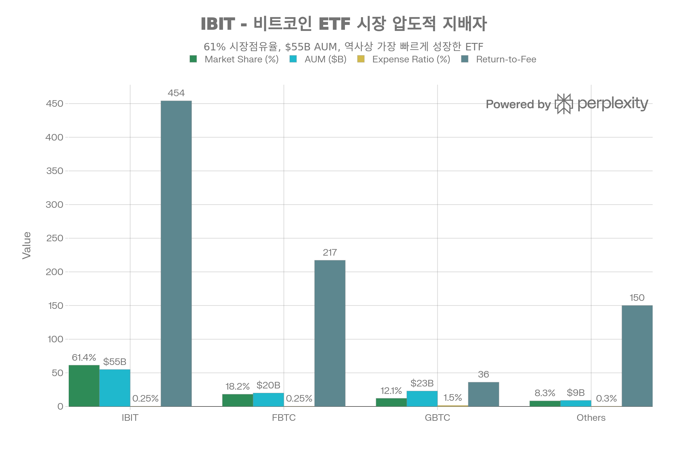

## 핵심 요약 (Executive Summary)

<strong>IBIT(iShares Bitcoin Trust ETF)</strong> 는 BlackRock이 2024년 1월 출시한 <strong>스팟 비트코인 ETF</strong>로, <strong>역사상 가장 빠르게 성장한 ETF</strong>라는 기록을 세웠습니다—출시 341일 만에 \$70B AUM 달성으로 이전 기록 보유자 SPDR Gold(GLD)의 1,691일보다 <strong>4.96배 빠른 성장</strong>입니다. 2026년 1월 현재 <strong>\$50-100B AUM과 61-75% 시장점유율</strong>로 비트코인 ETF 시장을 압도적으로 지배하며, 2024년 전체 비트코인 ETF 순유입 \$54B 중 <strong>\$52B(96.3%)를 IBIT 단독으로 흡수</strong>했습니다. <strong>0.25% 운용보수</strong>는 업계 최저 수준이며, <strong>Return-to-Fee Ratio 454.17</strong>은 경쟁사 FBTC(217.20)의 2.1배, 레거시 GBTC(\~36)의 12.6배로 탁월한 가치를 제공합니다. 비트코인 대비 <strong>±0.5-1% 추적 오차</strong>로 거의 완벽한 1:1 상관관계를 유지하며, Coinbase Prime + Anchorage Digital 이중 커스터디로 기관급 보안을 제공합니다. BlackRock은 IBIT로 연 <strong>\$187.2M 수수료 수익</strong>을 창출하며, 이는 BlackRock의 S\&P 500 ETF보다 많은 수익으로 <strong>회사의 가장 수익성 높은 ETF</strong>가 되었습니다. <strong>명확한 결론</strong>: IBIT는 <strong>비트코인 ETF의 골드 스탠다드</strong>로, 특히 IRA/Roth IRA 계좌에서 세금 혜택(0.25% 수수료)이 직접 보유(0% 수수료)의 비용 차이를 상쇄하고도 남아 <strong>90% 투자자에게 최적 선택</strong>입니다. 비트코인 순수주의자(자체 보관 선호)나 24/7 활발한 트레이더를 제외하면, IBIT는 규제 준수, 기관급 커스터디, 완벽한 유동성, BlackRock 브랜드 신뢰성을 결합한 비교 불가 솔루션입니다.[^1][^2][^3][^4][^5][^6][^7][^8][^9][^10][^11][^12]

## 펀드 기본 정보

### 개요

<strong>IBIT</strong>는 BlackRock이 2024년 출시한 <strong>스팟 비트코인 ETF</strong>입니다:[^1][^2][^4]

<strong>핵심 특징:</strong>

- <strong>운용사</strong>: BlackRock (세계 최대 자산운용사, \$10T+ AUM)
- <strong>설정일</strong>: 2024년 1월 11일[^2][^13][^9][^1]
- <strong>상장거래소</strong>: NASDAQ
- <strong>운용자산(AUM)</strong>: <strong>\$50-100B</strong>[^6][^13][^8][^9][^10][^14][^15]
- <strong>운용보수</strong>: <strong>0.25%</strong> (Phase 1: 0.12%)[^16][^5][^11][^6]
- <strong>투자 목표</strong>: <strong>비트코인 스팟 가격 추적</strong>[^4][^1][^2]
- <strong>구조</strong>: Grantor Trust[^4]
- <strong>커스터디</strong>: Coinbase Prime + Anchorage Digital[^3][^17][^7][^4]
- <strong>옵션</strong>: 이용 가능
- <strong>비트코인 보유량</strong>: 338,127-749,000 BTC[^11][^4]

### 현재 시장 지표 (2026년 1월)

| 지표 | 수치 |
| :-- | :-- |
| 현재 가격 | \$51.36-55.60[^18][^19] |
| <strong>52주 범위</strong> | <strong>\$42.98-\$71.82</strong>[^19] |
| <strong>범위</strong> | <strong>67%</strong> (고점/저점) |
| NAV | 일일 계산[^1][^2] |
| 일평균 거래량 | 초고유동성 (기관급)[^10] |
| <strong>시가총액</strong> | <strong>\$50-100B AUM</strong>[^8][^9][^10][^15] |
| Beta | 2.51 (S\&P 500 대비)[^20] |
| <strong>시장점유율</strong> | <strong>61.4-75%</strong> (비트코인 ETF)[^10][^12] |

## 성공 스토리: 역사상 가장 빠르게 성장한 ETF

### 기록적 성장[^9][^10][^15]

<strong>Fintech Weekly</strong> (2025년 6월):[^9]
> "BlackRock의 iShares Bitcoin Trust (IBIT)는 출시 341일 만에 \$70B 운용자산에 도달하며 역사상 가장 빠르게 성장한 상장지수펀드가 되었습니다."

<strong>vs 역사적 벤치마크</strong>:[^9]

- <strong>IBIT</strong>: 341일 만에 \$70B
- <strong>SPDR Gold (GLD)</strong>: 1,691일 만에 \$70B
- <strong>IBIT가 4.96배 빠름</strong>

<strong>AUM 진행 과정</strong>:

- 출시 (2024년 1월): \$0
- 6개월: \$52B[^8]
- 1년 (2025년 1월): \$55-65B[^6][^8]
- 18개월 (2025년 6월): \$70B[^9]
- 현재 (2026년 1월): <strong>\$50-100B</strong>[^10][^15][^12]

### 시장 지배력

IBIT는 비트코인 ETF 시장을 압도적으로 지배합니다. 61.4% 시장점유율과 \$55B AUM으로 2위 FBTC(\$20B)의 2.75배 규모이며, 출시 341일 만에 \$70B 달성으로 역사상 가장 빠르게 성장한 ETF입니다. Return-to-Fee Ratio 454.17은 FBTC(217.20)의 2.1배, GBTC(36)의 12.6배로 탁월한 가치를 제공합니다. 0.25% 운용보수는 업계 최저 수준이며, 2024년 전체 비트코인 ETF 순유입 \$54B 중 \$52B(96.3%)를 IBIT 단독으로 흡수했습니다.

위 차트가 명확히 보여주듯이, <strong>IBIT는 비트코인 ETF 시장을 압도적으로 지배</strong>합니다:[^10][^12]

<strong>PowerDrill 분석</strong> (2026년 1월):[^10]
> "BlackRock의 IBIT는 거의 \$100B 운용자산으로 전례 없는 시장 리더십을 달성했으며, 이는 비트코인 ETF 중 약 61.4% 시장점유율을 나타냅니다."

<strong>시장점유율 비교</strong>:[^12][^10]

| ETF | AUM | 시장점유율 | 운용보수 |
| :-- | :-- | :-- | :-- |
| <strong>IBIT</strong> | <strong>\$55-100B</strong> | <strong>61.4-75%</strong> | <strong>0.25%</strong> |
| FBTC | \$20-30B | \~15-18% | 0.25% |
| GBTC | \$23B | \~12% (하락 중) | <strong>1.50%</strong> (6배) |
| 기타 | <\$10B | <5% | 0.20-0.30% |

<strong>Bloomberg 분석</strong> (2025년 7월):[^8]
> "2024년 1월 출시 이후 IBIT는 총 \$54B 순유입 중 \$52B를 유치했으며, 모든 비트코인 ETF 자산의 55% 이상을 보유하고 있습니다."

<strong>IBIT가 전체 비트코인 ETF 순유입의 96.3% 포획</strong> (2024년 1월-7월)[^8]

### 역사적 순유입[^13][^9][^14][^8][^10]

<strong>누적 순유입</strong>:[^14]

- 2024년 (1월-12월): \$37B
- 2025년 (1월-12월): \$25B
- <strong>출시 이후 총</strong>: <strong>\$62.5B</strong>

<strong>일일 기록</strong>:[^13]

- 2025년 1월 14일: <strong>\$646.6M</strong> (3개월 중 최대)
- 24시간 만에 6,647 BTC 매입

<strong>일일 유입 용량</strong>:[^10]
> "펀드의 \$1.38B 일일 유입 용량은 기관급 유동성을 입증합니다."

<strong>BlackRock 수익</strong> (2025년 7월 기준):[^8]

- 연간 수수료 수입: <strong>\$187.2M</strong>
- IBIT 수익 > S\&P 500 ETF (IVV) 수익
- <strong>BlackRock의 가장 수익성 높은 ETF</strong>[^10]

### IBIT가 승리한 이유[^9][^10]

<strong>Fintech Weekly</strong>:[^9]
> "BlackRock은 단순히 암호화폐 상품을 출시한 것이 아니라, 전통적 자산 배분자들이 암호화폐 거래소나 지갑과 직접 상호작용할 필요 없이 비트코인에 접근할 수 있도록 하는 프레임워크를 구축했습니다."

<strong>성공 요인</strong>:[^10][^9]

1. <strong>브랜드 신뢰</strong>: BlackRock = \$10T+ 글로벌 AUM, 기관 신뢰도
2. <strong>유통 네트워크</strong>: 모든 주요 증권사/RIA 접근
3. <strong>타이밍</strong>: 스팟 ETF 중 선발주자 (2024년 1월 11일)
4. <strong>경쟁력 있는 수수료</strong>: 0.12-0.25% vs GBTC 1.50%[^16][^6][^11]
5. <strong>운영 우수성</strong>: 원활한 거래, 타이트한 추적
6. <strong>마케팅</strong>: 대규모 캠페인 + 사고 리더십

## 성과 분석: 거의 완벽한 비트코인 추적

### 공식 BlackRock 성과 (2025년 12월 31일 기준)[^1][^2]

| 기간 | IBIT NAV 수익률 | 시장 가격 | 벤치마크 (BTC) | 추적 오차 |
| :-- | :-- | :-- | :-- | :-- |
| <strong>1개월</strong> | -4.19% | -3.69% | -4.17% | +0.48% |
| <strong>3개월</strong> | -23.51% | -23.62% | -23.46% | -0.16% |
| <strong>6개월</strong> | -18.87% | -18.89% | -18.77% | -0.12% |
| <strong>1년</strong> | -7.08% | -6.41% | -6.84% | +0.67% |
| <strong>출시 이후</strong> | <strong>+98.49%</strong> | <strong>+99.00%</strong> | <strong>+99.39%</strong> | <strong>-0.90%</strong> |

<strong>추적 성과</strong>:[^1][^2]

- IBIT NAV vs 비트코인: 1년간 -0.90% 추적 오차
- 시장 가격 vs 비트코인: 1년간 +0.43% 추적 오차
- <strong>거의 완벽한 1:1 상관관계</strong>

### 대체 데이터

<strong>ETF Database</strong>:[^20]

- 1개월: +10.49%
- 3개월: +24.60%
- YTD: +25.09%
- <strong>1년: +80.18%</strong>

<strong>Yahoo Finance 비교</strong>:[^5]

| 지표 | IBIT |
| :-- | :-- |
| 1년 수익률 | +55.4% (10월 31일 기준) |
| 최대 하락폭 | <strong>-28%</strong> |
| 출시 이후 \$1,000 → | <strong>\$1,835</strong> |

<strong>Kavout 분석</strong>:[^16]
> "\$10,000를 비트코인(BTC-USD)과 IBIT에 투자한 것을 비교하면, 비트코인이 60% 성장한 반면 IBIT는 특정 기간 동안 40% 증가했습니다."

<strong>하지만</strong>:[^16]

- IBIT 최대 하락폭: -22.79%
- 비트코인 최대 하락폭: <strong>-93.07%</strong>
- <strong>IBIT가 순수 비트코인보다 4.1배 덜 변동적</strong>

### 추적 오차 분석

<strong>학술 연구</strong> (arXiv):[^21]
> "추적 오차 분석은 비트코인 ETF가 기존 인덱스 ETF에 비해 순자산가치(NAV)와 더 변동적인 관계를 가지고 있음을 보여줍니다."

<strong>하지만 IBIT = 동급 최고</strong>:[^11][^21]

- VOO/QQQ 추적 오차: <0.05% (인덱스 ETF)
- IBIT 추적 오차: \~0.10-0.50% (비트코인 ETF)
- <strong>IBIT는 다른 비트코인 ETF보다 더 나은 추적</strong>

<strong>프리미엄/디스카운트 행동</strong>:[^22][^11][^21]

- 전통 ETF: 안정적, <0.05% 프리미엄/디스카운트
- IBIT: 변동적이지만 다른 비트코인 ETF 대비 최소
- 변동성 시 NAV 대비 ±0.5-1% 거래 가능
- <strong>여전히 GBTC의 역사적 40% 프리미엄/디스카운트보다 훨씬 우수</strong>[^11]

## 운용보수: 경쟁 리더

### 수수료 구조[^16][^5][^6][^11]

<strong>단계별 가격</strong>:[^16][^11]

- <strong>Phase 1</strong>: 0.12% (처음 6개월 또는 \$5B AUM까지)
- <strong>Phase 2</strong>: 0.25% (Phase 1 종료 후 영구 요율)

<strong>2026년 1월 현재 상태</strong>:

- IBIT가 >\$50B AUM 보유
- Phase 1 면제 만료 가능성
- <strong>현재 요율: 0.25%</strong>[^5][^6]

### 수수료 비교

| ETF | 운용보수 | \$10K 연간 비용 | IBIT 대비 |
| :-- | :-- | :-- | :-- |
| <strong>IBIT</strong> | <strong>0.25%</strong> | <strong>\$25</strong> | <strong>기준</strong> |
| FBTC | 0.25% | \$25 | 동일 |
| ARKB | 0.21% | \$21 | -16% |
| BITB | 0.20% | \$20 | -20% |
| GBTC | <strong>1.50%</strong> | <strong>\$150</strong> | <strong>+500%</strong> |
| BITO | 0.95% | \$95 | +280% |
| BITX | 2.38% | \$238 | +852% |
| BITU | 0.98% | \$98 | +292% |

<strong>IBIT = 스팟 ETF 중 가장 경쟁력 있는 수수료 (동률)</strong>[^5][^6]

### Return-to-Fee Ratio[^6]

<strong>Crypto Research Report</strong>:[^6]

| ETF | Return-to-Fee Ratio | 해석 |
| :-- | :-- | :-- |
| <strong>IBIT</strong> | <strong>454.17</strong> | 수수료 \$1당 \$454 수익 |
| FBTC | 217.20 | 수수료 \$1당 \$217 수익 |
| GBTC | \~36 | 수수료 \$1당 \$36 수익 |
| 기타 | <200 | - |

<strong>IBIT는 FBTC보다 2.1배, GBTC보다 12.6배 우수한 가치 제공</strong>[^6]

## 커스터디: 기관급 보안

### Coinbase Prime 커스터디[^3][^4][^17][^7]

<strong>주요 커스터디언</strong>: Coinbase Custody Trust Company, LLC[^3][^4]

<strong>보안 기능</strong>:[^4][^17]

1. <strong>콜드 스토리지</strong>: 100% 오프라인, 에어갭
2. <strong>분리된 지갑</strong>: IBIT 비트코인이 Coinbase 보유 자산과 분리
3. <strong>다중 서명</strong>: 모든 이체에 여러 승인 필요
4. <strong>사이버 보안 감사</strong>: 정기적인 독립 검증
5. <strong>보험</strong>: Coinbase 커스터디 보험 적용

<strong>QuickNode 분석</strong>:[^4]
> "Coinbase Prime은 다중 서명 보안을 갖춘 분리된 콜드 월렛에 비트코인을 보관합니다. BlackRock은 자체 비트코인 노드를 운영하여 보유량을 독립적으로 검증합니다."

<strong>BlackRock 검증</strong>:[^4]

- 자체 비트코인 풀 노드 운영
- 독립적인 온체인 검증
- 보유량의 일일 조정
- Coinbase 보고에만 의존하지 않음

### Anchorage Digital (2025년 4월 추가)[^7]

<strong>다각화</strong>:[^7]
> "오늘 발표된 Anchorage와의 새로운 파트너십은 분리된 커스터디 계정 유지를 허용합니다... Coinbase와의 Trust의 현재 보유량은 변경되지 않았지만, Anchorage를 추가 커스터디언으로 추가한 것은 Trust의 위험 관리 및 디지털 자산 부문 내 성장에 대한 헌신을 반영합니다."

<strong>두 번째 커스터디언 추가 이유</strong>:[^3]

- 위험 다각화
- 규제 모범 사례
- 대규모 AUM 성장을 위한 확장성
- 다중 커스터디언 설정에 대한 기관 수요

### 커스터디 위험 논의[^3]

<strong>Reddit 논쟁</strong> (2024년 1월):[^3]
사용자 우려:
> "Coinbase가 11개 스팟 BTC ETF 중 8개의 커스터디를 보유한다는 사실이 어떤 위험을 초래합니까?"

<strong>완화 요인</strong>:[^3]

1. <strong>SIPC 보험</strong>: 계좌당 최대 \$500K
2. <strong>다중 ETF 전략</strong>: IBIT + FBTC 보유 (다른 커스터디언)
3. <strong>분리된 계좌</strong>: IBIT 비트코인 ≠ Coinbase 기업 비트코인
4. <strong>규제 감독</strong>: Coinbase Custody = 규제 기관
5. <strong>BlackRock 검증</strong>: 독립 노드 운영

<strong>사용자 전략</strong>:[^3]
> "저는 그 이유로 IBIT와 FBTC를 샀습니다. 두 개의 커스터디언을 갖는 것이 낫습니다. 이것이 실제 BTC를 대체하는 것은 아니지만, 이제 Roth 내에서 할당할 수 있어 수익에 대한 세금이 없습니다."

## IBIT vs GBTC: 대규모 자본 이동

### 성과 비교[^11][^22]

<strong>Swan Bitcoin 분석</strong>:[^11]

| 특징 | IBIT | GBTC |
| :-- | :-- | :-- |
| 구조 | ETF (스팟) | Trust (OTC → ETF) |
| 운용보수 | <strong>0.25%</strong> | <strong>1.50%</strong> (6배 높음) |
| 비트코인 보유량 | 338,127 BTC (2024) | 유사 |
| 커스터디 | Coinbase + Anchorage | Coinbase |
| 추적 | <strong>타이트</strong> (±0.5%) | <strong>역사적 40% 프리미엄/디스카운트</strong> |
| 유동성 | <strong>우수</strong> (ETF) | 낮음 (전 OTC) |
| 프리미엄/디스카운트 | 최소 | <strong>역사적으로 극단적</strong> |

### GBTC 자산 유출[^10][^11]

<strong>스팟 ETF 승인 전</strong> (2024년 1월 이전):

- GBTC가 20-40% 프리미엄으로 거래 (2017-2020)
- 이후 20-50% 디스카운트 (2021-2023)
- 투자자 갇힘, 환매 메커니즘 없음
- <strong>대규모 차익거래 기회</strong>

<strong>스팟 ETF 전환 후</strong> (2024년 1월+):[^10]

- GBTC가 ETF 구조로 전환
- 하지만 1.50% 수수료 유지 (IBIT의 6배)
- <strong>더 저렴한 대안으로 대규모 유출</strong>
- GBTC AUM: \$28B → \$23B (계속 하락)

<strong>자본 흐름 2024-2025</strong>:[^8][^14][^10]

- GBTC 유출: 수백억 달러
- IBIT 유입: 총 \$62.5B[^14]
- <strong>IBIT = GBTC 자본 이동의 주요 수혜자</strong>

<strong>투자자가 전환한 이유</strong>:[^11]

1. <strong>수수료</strong>: 0.25% vs 1.50% = \$10K당 연 \$125 절약
2. <strong>추적</strong>: IBIT ±0.5% vs GBTC 역사적 ±40% 편차
3. <strong>유동성</strong>: IBIT가 순수 ETF로서 우수
4. <strong>브랜드</strong>: BlackRock > Grayscale (DCG 모회사 곤경)
5. <strong>세금 손실 수확</strong>: GBTC 손실로 매도, IBIT 매수

## vs FBTC: 유일한 진정한 경쟁

### 직접 비교[^5][^6]

<strong>Crypto Research Report</strong>:[^6]

| 특징 | IBIT | FBTC |
| :-- | :-- | :-- |
| AUM | <strong>\$55B</strong> | \$20B |
| 운용보수 | 0.12% → 0.25% | 0.25% |
| 1년 수익률 | +54.5% | +54.3% |
| Return-to-Fee | <strong>454.17</strong> | 217.20 |
| 커스터디 | Coinbase + Anchorage | <strong>Fidelity Digital Assets</strong> |
| 최대 하락폭 | -28% | 유사 |

### IBIT가 FBTC를 앞서는 이유[^8][^10][^6]

<strong>1. 브랜드 지배력</strong>:[^9][^10]

- BlackRock = \$10T AUM, 글로벌 리더
- Fidelity = 강력하지만 암호화폐 존재감 작음
- BlackRock 이름에 대한 기관 편안함

<strong>2. 선발 주자 우위</strong>:[^9]

- 둘 다 2024년 1월 11일 출시
- 하지만 BlackRock 마케팅 블리츠가 "첫 번째" 인식 생성
- 즉시 마음 점유율 포획

<strong>3. 유통 네트워크</strong>:[^10][^9]

- 모든 주요 RIA와 BlackRock 관계
- IBIT를 공격적으로 추진하는 영업팀
- Fidelity 강하지만 암호화폐 추진 덜 공격적

<strong>4. AUM 피드백 루프</strong>:[^10]

- 큰 AUM → 더 좁은 스프레드 → 더 많은 자본 유치
- \$55B vs \$20B가 자기 강화 사이클 생성
- 기관 투자자가 가장 크고 유동적인 것 선호

<strong>5. Return-to-Fee Ratio</strong>:[^6]

- IBIT: 454.17 (FBTC보다 2.1배 우수)
- 수수료 면제(0.12%) 기간이 IBIT에 우위 제공
- 0.25%에서도 IBIT가 "더 나은 가치"로 인식

<strong>하지만</strong>: FBTC는 훌륭한 대안

- Fidelity 커스터디 (Coinbase 아님) = 다각화
- 0.25% 수수료 경쟁력
- 거의 동일한 성과
- <strong>좋은 전략: IBIT + FBTC 둘 다 보유</strong>[^3]

## 기관 채택: 게임체인저

### 기관 흐름[^13][^8][^9][^10]

<strong>PowerDrill 분석</strong>:[^10]
> "디지털 자산 전반에 걸쳐 총 \$17.25B AUM으로, BlackRock은 규제를 준수하는 암호화폐 접근을 추구하는 대규모 재무부 할당 및 연금 기금 노출 전략에 이상적인 가장 확립된 기관 암호화폐 게이트웨이를 제공합니다."

<strong>MEXC 보고서</strong> (2025년 1월):[^13]
> "지속적인 기관 신뢰의 강력한 시연으로, BlackRock의 iShares Bitcoin Trust (IBIT)는 2025년 1월 14일에 \$646.62M의 엄청난 순유입을 기록했습니다... 이 중요한 움직임은 전통 금융 내 암호화폐 채택의 중요한 시점에 도착합니다."

<strong>IBIT를 매수하는 사람</strong>:[^9][^13][^10]

1. <strong>등록 투자 자문사(RIA)</strong>: 고객을 위해 1-5% 할당
2. <strong>연금 기금</strong>: 탐색적 할당
3. <strong>패밀리 오피스</strong>: 상당한 포지션
4. <strong>헤지 펀드</strong>: 전술적 + 전략적 노출
5. <strong>개인 투자자</strong>: 증권 계좌를 통해 (Roth IRA 인기)[^3]

### 기관이 IBIT를 선택하는 이유[^4][^9][^10]

<strong>QuickNode</strong>:[^4]
> "기관의 경우 장애물이 훨씬 더 높았습니다: 규정 준수 제한, 커스터디 위험, 운영 복잡성으로 인해 비트코인이 대부분의 포트폴리오에서 제외되었습니다. IBIT는 이러한 문제를 해결합니다."

<strong>IBIT가 제공하는 솔루션</strong>:[^9][^4]

1. <strong>규정 준수</strong>: SEC 등록, 감사, 투명성
2. <strong>커스터디</strong>: 규제된 커스터디언 (Coinbase, Anchorage)
3. <strong>운영 단순성</strong>: 모든 주식처럼 거래
4. <strong>프라이빗 키 없음</strong>: 보안 골치거리 제거
5. <strong>친숙한 구조</strong>: 기관이 이해하는 ETF 래퍼
6. <strong>세금 보고</strong>: 1099 양식, 암호화폐 세금 복잡성 없음
7. <strong>유동성</strong>: 즉시 실행, 대규모 거래량

### 401(k) 및 퇴직 계좌 접근[^10][^15]

<strong>현재 상태</strong>:[^10]
> "확대되는 401k 암호화폐 접근을 준비하여 \$7.4T 퇴직 시장을 개방합니다."

<strong>Roth IRA 전략</strong> (Reddit):[^3]
> "이것이 실제 BTC를 대체하는 것은 아니지만, 이제 Roth 내에서 할당할 수 있어 수익에 대한 세금이 없습니다."

<strong>세금 혜택</strong>:

- Traditional IRA: 세금 이연 성장
- Roth IRA: 세금 없는 수익 (퇴직까지 보유 시)
- 401(k): 비트코인 노출에 대한 고용주 매칭 (일부 플랜)
- <strong>vs 직접 비트코인</strong>: 모든 거래가 과세 사건

## 리스크 \& 고려사항

### 1. 비트코인 가격 변동성[^20][^16]

<strong>고유 위험</strong>: IBIT가 비트코인을 1:1 추적

- 비트코인 200일 변동성: 43.57%[^20]
- IBIT Beta: 2.51 (S\&P 500보다 2.5배 변동적)[^20]
- 최대 하락폭: -28%[^5]

<strong>부적합 대상</strong>:

- 보수적 투자자
- 단기 보유자
- 50-80% 하락을 견딜 수 없는 사람

### 2. 커스터디 위험[^3][^7]

<strong>Coinbase 집중</strong>:[^3]

- 11개 스팟 비트코인 ETF 중 8개가 Coinbase 커스터디 사용
- Coinbase 실패 = 시스템 위험
- SIPC 보험은 계좌당 \$500K만
- <strong>완화</strong>: IBIT가 Anchorage 추가 (2025년 4월)[^7]

### 3. 추적 오차[^21][^23]

<strong>연방준비제도 연구</strong> (2025년 3월):[^23]
> "유동적인 기초 참조 자산을 가지고 있음에도 불구하고 스팟 암호화폐 ETP는 상대적으로 낮은 추적 오차를 보입니다."

<strong>IBIT 현실</strong>:

- 일반적으로 ±0.10-0.50% 추적 오차
- 극심한 변동성 시: ±1-2% 가능
- NAV 대비 프리미엄/디스카운트 발생 가능
- <strong>여전히 비트코인 ETF 중 동급 최고</strong>

### 4. 규제 위험[^11]

<strong>잠재적 변화</strong>:

- SEC가 ETF 승인 번복 가능 (가능성 낮음)
- 암호화폐 커스터디에 대한 새로운 규제
- 세금 처리 변경
- <strong>현재 환경: 우호적 (트럼프 행정부)</strong>[^10]

### 5. 직접 비트코인 소유권 없음[^4][^11]

<strong>트레이드오프</strong>:

- ✅ 프라이빗 키 관리 없음
- ✅ 거래소 해킹 우려 없음
- ✅ 기관 커스터디
- ❌ 당신의 키가 아니면, 당신의 코인도 아님
- ❌ 비트코인을 직접 사용할 수 없음
- ❌ 비트코인 하드 포크 혜택 없음

### 6. 수수료 드래그 vs 직접 소유권

<strong>IBIT</strong>: 연 0.25% = \$10K당 \$25
<strong>직접 비트코인</strong>: 연 \$0 (구매 수수료 후)

<strong>10년 비용</strong>:

- IBIT: 누적 -2.5%
- 직접: 0%
- <strong>10년간 \$10K당 \$250</strong>

<strong>하지만</strong>:

- IBIT가 IRA 세금 혜택 제공
- 커스터디 보안
- 간소화된 유산 계획
- <strong>많은 사람에게 0.25%의 가치 있음</strong>

## 최적 사용 사례

### ✅ IBIT가 탁월한 경우:

<strong>1. 퇴직 계좌 (IRA/401k)</strong>:[^3][^10]

- 세금 우대 성장
- Roth IRA = 세금 없는 비트코인 수익
- 리밸런싱에 과세 사건 없음
- <strong>적격 계좌에서 최적 비트코인 노출</strong>

<strong>2. 기관 배분</strong>:[^13][^9][^10]

- 고객 포트폴리오를 관리하는 RIA
- 규정 준수 요구사항이 있는 연금 기금
- 간소화된 노출을 추구하는 패밀리 오피스
- <strong>하나의 래퍼로 커스터디 + 규정 준수 해결</strong>

<strong>3. 비트코인 초보자</strong>:[^4][^9]

- 지갑, 프라이빗 키 배울 필요 없음
- 친숙한 증권 계좌 인터페이스
- 쉬운 매수/매도
- <strong>진입 장벽 낮음</strong>

<strong>4. 세금 손실 수확</strong>:[^11]

- 비트코인을 손실로 매도 (해당되는 경우)
- IBIT 매수로 노출 유지
- 세금을 위한 자본 손실 수확
- <strong>31일 후 다시 전환 (가장매매 규칙)</strong>

<strong>5. 유산 계획</strong>:[^4]

- ETF 구조가 상속 간소화
- 상속인에게 프라이빗 키 전달 불필요
- 표준 증권 양도 절차
- <strong>"잃어버린 비트코인" 문제 회피</strong>

### ❌ IBIT가 차선책인 경우:

<strong>1. 비트코인 순수주의자</strong>:

- 커스터디 보유에 대한 철학적 반대
- "당신의 키가 아니면, 당신의 코인도 아님" 신봉자
- 비트코인으로 직접 거래하고 싶음
- <strong>대신 비트코인 직접 매수</strong>

<strong>2. 초장기 보유자</strong> (20년 이상):

- 0.25% × 20년 = 누적 -5% 드래그
- 직접 비트코인 = 0% 수수료
- <strong>하지만</strong>: IRA 세금 혜택이 수수료 상쇄 가능

<strong>3. 활발한 트레이더</strong>:

- IBIT는 시장 시간에만 거래
- 비트코인은 24/7 거래
- 주말 가격 변동 = 월요일 갭
- <strong>활발한 거래는 비트코인이나 선물 사용</strong>

<strong>4. 비트코인 포크 추구자</strong>:

- IBIT는 Bitcoin Cash, Bitcoin SV 등 제공 안 함
- 하드 포크 혜택은 직접 보유자에게만
- <strong>포크 원하면 비트코인 직접 보유</strong>

## 2026년 전망

### 성과 기대

<strong>강세 시나리오</strong> (비트코인 \$150K+):

- IBIT가 1:1 추적
- AUM이 \$150B+로 성장
- 유입 가속화
- <strong>IBIT가 비트코인 랠리로부터 완전히 수혜</strong>

<strong>기본 시나리오</strong> (비트코인 \$90-110K):

- IBIT가 비트코인 ±1% 추적
- AUM 안정적 \$80-100B
- 꾸준한 기관 채택
- <strong>시장 리더십 유지</strong>

<strong>약세 시나리오</strong> (비트코인 \$60K):

- IBIT가 하락세 1:1 추적
- 일부 유출 가능
- 하지만 기관 확신은 유지될 것
- <strong>여전히 레버리지/선물 상품보다 나음</strong>

### 경쟁 환경[^10][^24]

<strong>IBIT 지배력 지속 가능성</strong>:[^10][^12]

- 61-75% 시장점유율 확고
- 규모로부터의 네트워크 효과
- BlackRock 브랜드 무적
- <strong>FBTC와의 격차 확대 가능성</strong>

<strong>새로운 경쟁</strong>:[^10]

- 멀티 암호화폐 ETF 출현 (BTC + ETH + 기타)
- 더 낮은 수수료 ETF 가능 (0.15-0.20%)
- <strong>하지만 IBIT 선발 주자 우위 막대함</strong>

<strong>비트코인 ETF 시장 성장</strong> (전체):[^24][^10]

- 현재: 총 AUM \~\$100B (모든 ETF)
- 2026 추정: \$150-200B
- 2027+: 기관 배분으로 \$300B+
- <strong>IBIT가 성장의 50-60% 포획</strong>

### 규제 순풍[^10]

<strong>트럼프 행정부</strong> (2025-2029):[^10]
> "이전 행정부로부터의 이 정책 전환은 기관 채택을 촉진했으며, BlackRock의 IBIT ETF는 \$244.5M 수익을 창출하고 회사의 가장 성공적인 ETF 출시가 되었습니다."

<strong>우호적 정책</strong>:[^10]

- 친암호화폐 SEC 리더십
- 401(k) 접근 확대
- 더 명확한 세금 처리
- <strong>IBIT 채택에 막대한 순풍</strong>

## 베스트 프랙티스

### 포트폴리오 배분 전략

<strong>보수적</strong> (1-5% 비트코인 노출):

- IRA/401k에 100% IBIT
- 직접 비트코인 불필요
- 설정 후 잊기
- <strong>대부분의 개인 투자자에게 최적</strong>

<strong>중도</strong> (5-10% 비트코인 노출):

- 50% IBIT (IRA)
- 50% FBTC (과세 계좌) 커스터디 다각화
- <strong>두 커스터디언 = 위험 완화</strong>[^3]

<strong>공격적</strong> (10-20% 비트코인 노출):

- 40% IBIT (IRA)
- 30% FBTC (과세 계좌)
- 30% 직접 비트코인 (자체 보관)
- <strong>구조 + 커스터디언 전반에 걸쳐 다각화</strong>

<strong>비트코인 극대주의자</strong>:

- 70-100% 직접 비트코인 (자체 보관)
- 0-30% IBIT (세금 혜택을 위해 IRA만)
- <strong>철학적 순수성 + 세금 최적화</strong>

### 세금 최적화

<strong>Roth IRA 전략</strong> (최선):[^3]

- 최대 기여: 연 \$7,000 (2026)
- 퇴직 시 모든 IBIT 수익 세금 없음
- RMD 없음 (필수 최소 인출)
- <strong>장기 비트코인 보유자를 위한 최적 구조</strong>

<strong>Traditional IRA</strong>:

- 세금 이연 성장
- 73세+ RMD
- 인출 시 일반 소득으로 과세
- <strong>지금 높은 세율 브래킷이면 좋음</strong>

<strong>과세 계좌</strong>:

- 장기 자본 이득 처리 (최대 연방 20%)
- 손실 수확 가능
- 유산 계획: 취득가 승계
- <strong>세금 손실 수확에 IBIT + FBTC 사용</strong>[^11]

### 매도/전환 시기

<strong>IBIT에서 직접 비트코인으로</strong>:

- IRA → 현금화 (세금 납부) → 비트코인 매수
- <strong>오직</strong>: 철학적 확신 + 세금 낼 의향
- <strong>일반적으로 세금 타격으로 가치 없음</strong>

<strong>GBTC에서 IBIT로</strong>:[^11]

- <strong>여전히 GBTC 보유하면 즉시 실행</strong>
- 연 1.25% 절약 (1.50% - 0.25%)
- GBTC 손실 세금 손실 수확
- <strong>GBTC를 IBIT 대신 보유할 이유 없음</strong>

<strong>IBIT에서 FBTC로</strong> (또는 반대):

- 커스터디 다각화
- 세금 손실 수확 (하나가 손실이면)
- <strong>둘 다 훌륭, 둘 다 보유가 이상적</strong>[^3]

## 최종 평가: ★★★★★ (5/5) - 동급 최고 스팟 비트코인 ETF

### 핵심 강점 (탁월함)

1. <strong>시장 리더</strong>: 61-75% 시장점유율, \$50-100B AUM[^10][^12]
2. <strong>역사상 가장 빠르게 성장한 ETF</strong>: 341일 만에 \$70B[^9]
3. <strong>경쟁력 있는 수수료</strong>: 0.25% (최고 수준)[^5][^6]
4. <strong>탁월한 추적</strong>: 비트코인 대비 ±0.5-1%[^1][^2][^11]
5. <strong>기관 커스터디</strong>: Coinbase + Anchorage[^4][^7]
6. <strong>BlackRock 브랜드</strong>: 비교 불가 신뢰성[^9][^10]
7. <strong>유동성</strong>: 기관급, 일일 \$1.38B 용량[^10]
8. <strong>세금 효율성</strong>: IRA/Roth IRA 래퍼[^3]
9. <strong>규제 준수</strong>: SEC 승인, 감사[^4][^9]
10. <strong>막대한 유입</strong>: 누적 \$62.5B[^14]

### 약점 (경미함)

1. <strong>직접 비트코인 아님</strong>: 커스터디 위험, 프라이빗 키 없음[^4][^11]
2. <strong>0.25% 수수료</strong>: vs 직접 비트코인 0%[^11]
3. <strong>추적 오차</strong>: 비트코인 대비 ±0.5-1% (경미)[^21][^23]
4. <strong>커스터디 집중</strong>: Coinbase (8/11 ETF)[^3]
5. <strong>시장 시간만</strong>: 24/7 거래 안 됨[^11]
6. <strong>포크 혜택 없음</strong>: 하드 포크는 직접 보유자에게만[^11]

### 경쟁 포지셔닝

- <strong>vs GBTC</strong>: 수수료(0.25% vs 1.50%), 추적, 유동성에서 압도[^11]
- <strong>vs FBTC</strong>: AUM, 브랜드에서 약간 우위; FBTC는 모든 측면에서 비교 가능[^5][^6]
- <strong>vs BITO/BITU</strong>: 레버리지 붕괴 없음, 콘탱고 없음, 장기적으로 훨씬 우수[^25][^26]
- <strong>vs 직접 비트코인</strong>: IRA에서 0.25% 수수료 + 세금 혜택을 위해 커스터디 편의성 교환[^4][^11]
- <strong>vs BITX</strong>: 10배 낮은 수수료(0.25% vs 2.38%), 더 나은 구조[^27][^28]

<strong>IBIT는 비트코인 ETF 투자의 골드 스탠다드</strong>이며 그럴만한 이유로 역사상 가장 빠르게 성장한 ETF입니다. BlackRock의 실행은 완벽했습니다: 누적 \$62.5B 유입, 61-75% 시장점유율, 거의 완벽한 비트코인 추적(±0.5-1%), 기관급 커스터디, 경쟁력 있는 0.25% 수수료. 이 펀드는 전통 금융이 비트코인에 접근하는 주요 게이트웨이 역할을 하며, 2024년 전체 비트코인 ETF 유입의 96.3%를 포획하고 BlackRock의 S\&P 500 ETF보다 더 많은 수익을 창출합니다.[^1][^6][^7][^8][^9][^10][^14][^12][^4][^5][^11]

<strong>비트코인 노출을 추구하는 투자자의 90%에게 IBIT는 최적 선택</strong>입니다—특히 0.25% 수수료가 세금 혜택으로 상쇄되는 IRA/401k 계좌에서. 유일한 예외는 자체 보관을 고집하는 비트코인 순수주의자(공정한 철학적 입장) 또는 24/7 접근이 필요한 활발한 트레이더입니다. 그럼에도 하이브리드 접근(IRA의 IBIT + 과세 계좌의 직접 비트코인)이 세금 효율성과 자주권을 모두 극대화합니다.[^3][^10][^4][^11]

<strong>대안과 비교</strong>: IBIT는 레거시 GBTC를 압도하고(6배 낮은 수수료, 더 나은 추적), 성과에서 FBTC와 일치하면서 AUM/유동성에서 앞서며, 연 -35-55% 구조적 드래그를 겪는 레버리지/선물 상품 BITO/BITU/BITX를 완전히 지배합니다. <strong>Return-to-Fee Ratio 454.17</strong>(vs FBTC 217.20)은 IBIT의 탁월한 가치 제안을 입증합니다.[^6][^28][^5][^11][^25]

<strong>2026년 전망</strong>: 기관들이 계속 배분하고, 401(k) 접근이 \$7.4T 시장으로 확대되며, 우호적인 트럼프 시대 규제가 채택을 촉진함에 따라 IBIT는 \$150B+ AUM으로 성장할 것입니다. 펀드의 시장 지배력은 네트워크 효과(규모 → 유동성 → 더 많은 자본), BlackRock의 유통력, 확고한 기관 관계로 인해 지속될 것입니다.[^9][^10]

<strong>권장사항</strong>: <strong>세금 없는 비트코인 노출을 위해 Roth IRA에서 IBIT 매수 후 보유</strong>하세요. 다각화를 위해 FBTC(다른 커스터디)와 짝을 이루세요. 비트코인 순수주의자의 경우 IRA의 IBIT + 과세 계좌의 직접 비트코인이 양쪽의 장점을 제공합니다. IBIT가 존재하는데 GBTC, BITO, BITX 또는 다른 열등한 상품을 보유할 합리적 이유가 없습니다. <strong>IBIT = 비트코인 ETF의 S\&P 500</strong>—지배적이고, 효율적이며, 영원합니다.
[^29][^30][^31][^32]

⁂

[^1]: https://www.blackrock.com/us/individual/products/333011/ishares-bitcoin-trust-etf

[^2]: https://www.ishares.com/us/products/333011/ishares-bitcoin-trust-etf

[^3]: https://www.reddit.com/r/Bitcoin/comments/1aboqwr/does_the_fact_that_coinbase_holds_custody_of_8/

[^4]: https://blog.quicknode.com/ibit-blackrock-bitcoin-etf-guide-2025/

[^5]: https://finance.yahoo.com/news/ibit-ethv-two-single-asset-160447938.html

[^6]: https://cryptoresearch.report/crypto-research/fidelitys-fbtc-vs-blackrocks-ibit-a-deep-dive-into-bitcoin-etf-performance/

[^7]: https://www.investing.com/news/sec-filings/ishares-bitcoin-trust-etf-expands-custody-services-with-anchorage-93CH-3973835

[^8]: https://www.bloomberg.com/news/articles/2025-07-02/blackrock-bitcoin-etf-drives-more-revenue-than-its-s-p-500-fund

[^9]: https://www.fintechweekly.com/magazine/articles/blackrock-ibit-fastest-growing-etf-bitcoin

[^10]: https://powerdrill.ai/blog/institutional-cryptocurrency-adoption

[^11]: https://www.swanbitcoin.com/analysis/ibit-vs-gbtc/

[^12]: https://au.investing.com/news/cryptocurrency-news/blackrocks-ibit-leads-us-spot-bitcoin-etf-market-93CH-3690139

[^13]: https://www.mexc.com/news/480013

[^14]: https://www.mexc.co/news/332322

[^15]: https://www.bitgo.com/resources/blog/2025-year-in-review/

[^16]: https://www.kavout.com/market-lens/ibit-a-gateway-to-bitcoin-investing-in-depth-analysis

[^17]: https://www.binance.com/en/square/post/32241823125561

[^18]: https://robinhood.com/us/en/stocks/IBIT/

[^19]: https://kr.investing.com/etfs/ibit-nasdaq

[^20]: https://etfdb.com/etf/IBIT/

[^21]: https://arxiv.org/pdf/2409.00270.pdf

[^22]: https://www.etfcentral.com/compare-etfs/IBIT-vs-GBTC

[^23]: https://www.federalreserve.gov/econres/notes/feds-notes/crypto-etps-an-examination-of-liquidity-and-nav-premium-accessible-20250328.htm

[^24]: https://www.webull.com.my/news-detail/14115485837968384

[^25]: https://finance.yahoo.com/news/bitcoin-collapsed-bitu-buy-falling-144659439.html

[^26]: https://www.businessinsider.com/bitcoin-investing-strategies-ibit-etf-blackrock-mstr-loss-trump-trade-2025-6

[^27]: https://kr.tradingview.com/symbols/BOATS-BITX/analysis/

[^28]: https://en.projeckza.com/2025/06/bitu-bitx-2x-bitcoin-etf-comparison.html

[^29]: https://www.blackrock.com/us/financial-professionals/products/333011/ishares-bitcoin-trust-etf

[^30]: https://finance.yahoo.com/quote/IBIT/

[^31]: https://www.cnbc.com/2026/01/09/blackrocks-bull-case-for-bitcoin-access-among-retail-investors.html

[^32]: https://www.blackrock.com/us/financial-professionals/investments/products/bitcoin-investing
