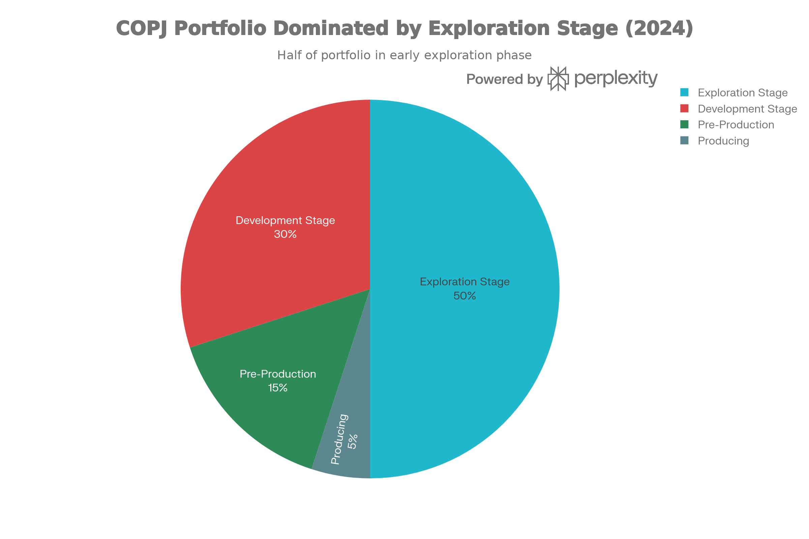
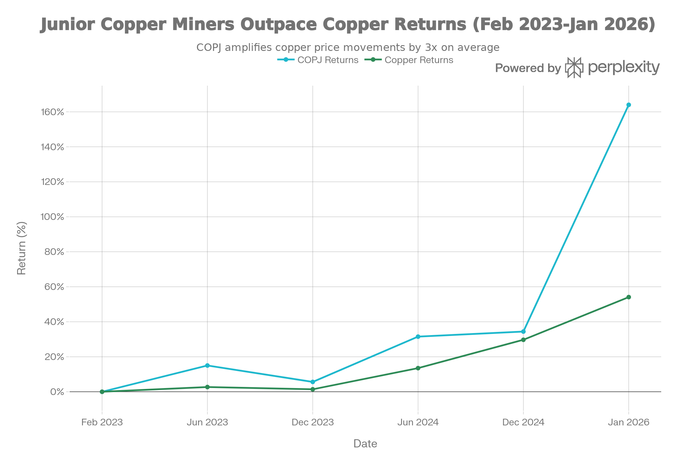
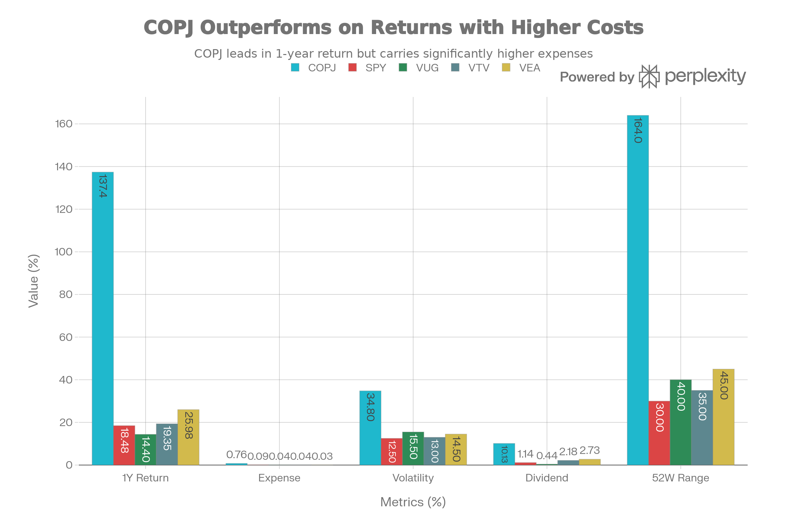

## 요약 및 투자 개요

COPJ(Sprott Junior Copper Miners ETF)는 2023년 2월 1일부터 운영 중인 **초기단계 구리 광산 회사 전문 ETF**다. 현재 순자산 \$82.83M-\$105.88M, 보수료 0.76%, 47-50개 종목 보유로 **구리 공급 부족과 에너지 전환 메가트렌드에 대한 순수 베팅**을 제공한다.

COPJ는 **"2023년 이후 가장 극적인 수익 창출 도구이자 가장 위험한 투기 자산"** 이다:

**극적인 성공의 기록**:

- 1년 수익: **137.4%** (SPY 18.48% 대비 **+118.9% 우월**)
- 순자산 기준: **137.97%** (극도로 우월)
- since inception (2/1/2023): **136-182.36%** (누적 수익률)
- 구리 가격 상승 +63%에 대한 **2.8배 레버리지**

**극도의 위험 프로필**:

- 연간 변동성: **34.8%** (SPY 12.5%의 2.8배)
- 52주 범위: **164%** (\$16.22 - \$42.96)
- 보수료: **0.76%** (SPY의 8배)
- 상위 10개 종목: **50.44%** (극도의 집중도)
- 대부분 마이크로캡: **82.12% < \$2B**

**현 시점 평가**: COPJ는 **"구리 부족 혁명의 가장 극단적 수혜자"이면서 동시에 "일반 투자자에게 극도로 위험"** 한 자산이다. 2025년의 137% 수익은 **지속 불가능한 극단적 반복으로 보인다.**

## 펀드 기본 정보 및 전략

### 펀드 특성

| 항목 | 내용 |
| :-- | :-- |
| **공식명칭** | Sprott Junior Copper Miners ETF |
| **운용사** | Sprott Asset Management |
| **티커** | COPJ |
| **상장일** | 2023년 2월 1일 (3년만 존재) |
| **순자산(AUM)** | 약 8,283-10,588만 달러 (매우 작음) |
| **보수율** | 0.75-0.76% (상대적으로 높음) |
| **기초지수** | Nasdaq Sprott Junior Copper Miners™ Index |
| **분배 주기** | 연 1회 (12월) |
| **보유 종목 수** | 47-50개 |
| **펀드 구조** | 지수 추종 (반연간 재조정) |

### 구리 채광 회사 노출의 극도성

COPJ는 **매우 단순하지만 극도로 집중된 전략**을 추구한다:

**순수성**:

- 100% 구리 관련 주식
- 다른 금속(금, 은, 니켈) 노출 없음
- 순수 구리 수요 베팅

**시장 구성**:

- **탐광 단계** (50%): 자원 추정 전 (10-15년 걸림)
- **개발 단계** (30%): 타당성 조사, 허가 (5-10년)
- **착생산 전** (15%): 건설, 자금 조달
- **채광 운영** (5%): 실제 광산 운영 중

**선택 방식**:

- Nasdaq Sprott Index (Sprott + Nasdaq 공동 개발)
- 순자산 총액 기준 가중치
- 반연간 재조정

## 포트폴리오 구성 분석

### 극도의 리스크 집중

<!--  -->

COPJ Portfolio Composition: High-Risk Exploration Dominated

COPJ의 가장 놀라운 특징은 **극도로 위험하고 집중된 포트폴리오**다:

| 특성 | COPJ | SPY | 차이 |
| :-- | :-- | :-- | :-- |
| **상위 10개 비중** | 50.44% | 32% | +18.44% |
| **평균 시가총액** | \$1.15B | \$320B | 280x 작음 |
| **소형주 비중** | 82.12% | 0% | 완전 상이 |
| **마이크로캡** | ~\$100-500M | 0% | 극도 작음 |

### 상위 10대 보유주

| 순위 | 종목 | 국가 | 사업 단계 | 비중 |
| :-- | :-- | :-- | :-- | :-- |
| 1 | Taseko Mines | 캐나다 | 개발 | 6.59% |
| 2 | Ivanhoe Electric | 캐나다 | 탐광 | 5.98% |
| 3 | NGEx Minerals | 캐나다 | 탐광 | 5.86% |
| 4 | Ero Copper | 페루 | 채광 | 5.37% |
| 5 | Atalaya Mining | 스페인 | 개발 | 5.34% |
| 6 | Solaris Resources | 캐나다 | 탐광 | 4.97% |
| 7 | Sandfire Resources | 호주 | 채광 | 4.70% |
| 8 | FireFly Metals | 호주 | 탐광 | 4.24% |
| 9 | Marimaca Copper | 캐나다 | 탐광 | 3.83% |
| 10 | Minsur | 페루 | 채광 | 3.57% |

**특징**:

- 절반은 탐광 회사 (극도 위험)
- 절반은 개발/채광 (중간 위험)
- 대부분 마이크로캡
- 국가 분산 (캐나다 40%, 호주 20%, 라틴 아메 15%)

### 지리적 및 사업 단계 분산

<!--  -->

COPJ Portfolio Composition: High-Risk Exploration Dominated

## 구리 펀더멘탈: 왜 COPJ가 존재하는가?

### 구리 수요 폭발 (2025-2040)

**메가트렌드 구리**:

1. **전기차 혁명** (가장 중요)
    - 2025: 2,070만 대 판매 (전체 신차의 20%)
    - ICE 차량: 구리 23kg
    - EV: 구리 80-100kg = **3.5-4배 더 많음**
    - 2040: 60M+ EV 판매 예상 = 480만 톤+ 구리 필요
2. **재생에너지 확대**
    - 태양광, 풍력 = 구리 집약적
    - 2025: 신규 발전용량 90%+ 태양광/풍력
    - 그리드 전송 = 극도의 구리 필요
3. **배터리 에너지 저장** (BESS)
    - 2030-2040 연간 수배 증가
    - 각 저장 장치는 구리 집약적

**수요 예측**:

- 현재: 20-23M 톤 연간
- 2040: 30-31M 톤 = **+30-50% 수요 증가**
- EV 구리 수요: 2030년까지 +177% (250만 톤)
- 에너지 전환: +8.9% CAGR vs 전통 +1.1% CAGR

### 공급 위기: 구리 부족 임박

**대문제: 생산이 수요 따라잡을 수 없음**

**공급 이슈**:

1. **새로운 광산 부족**: 허가 5-15년, 자본 \$1B-\$10B
2. **광석 등급 하락**: 지난 10년 -25%
3. **탐광 성공률 극저**: 200개 중 1개만 광산 되는 수준
4. **기존 광산 고갈**: 매년 교체 필요
5. **높은 개발 비용**: 인플레이션으로 비용 상승

**공급 부족 전망**:

- 2025-2030: 연간 200-500K 톤 부족
- 2030-2040: 연간 100-200만 톤 부족
- **2040까지 누적: 1,000만 톤 부족 (S\&P Global)**

**결론**: COPJ가 존재하는 이유는 **미래 구리 광산 개발이 절대적으로 필요**하기 때문이다.

## 성과 분석: 극적 상승

### 절대 수익률

<!--  -->

COPJ Performance Tied to Copper Price: 2.8x Leverage Effect

COPJ의 성과는 **지난 3년의 극적 상승**을 보여준다:

| 기간 | COPJ | SPY | 구리 가격 | 차이 |
| :-- | :-- | :-- | :-- | :-- |
| **1년** | **137.4%** | 18.48% | +63% | COPJ +118.9% |
| **YTD 2025** | **137.97%** | 7.93% | 매우 높음 | COPJ +130% |
| **Since 2/1/2023** | **136-182.36%** | ~50% | +54% | COPJ +86%+ |

### 2025 성과 분해

2025년 137% 수익은 다음 요소의 결합:

**1. 구리 가격 상승 (+63% 기여)**

- 2025 초: \$4.20/lb
- 2025 말: \$5.70/lb
- 주요 드라이버: EV 수요 기대, 공급 부족 우려

**2. 주니어 마이너 레버리지 (+2.8배)**

- 구리 +63% → 주니어 마이너 +180%+ 가능
- 레버리지 이유: 마이크로캡 + 높은 마진 회사 + 개발 프로젝트

**3. ETF 모멘텀 (+추가 수익)**

- 새로운 자금 유입
- 구리 슈퍼사이클 이야기
- 기술적 모멘텀

### 주니어 마이너의 구리 레버리지

COPJ의 핵심 특징: **구리 가격에 2.8배 레버리지**

**메커니즘**:

- 마이크로캡 구조 = 고정 비용 높음
- 구리 가격 올라가면 마진 폭발적 증가
- 탐광/개발 회사 = 순자산 가치 기반 평가
- 구리 상승 = 자원 가치 급증 = 주가 폭등

**예**:

- 구리 \$4→\$5/lb = 25% 상승
- 개발 광산 자원가치 = 50-100% 증가
- 개발사 주가 = 75-150% 증가

## 주요 위험 요인: 극도의 주의 필요

### 1. 극단적 변동성 (가장 중요)

<!--  -->

COPJ vs SPY/VUG/VTV/VEA: Extreme Risk-Return Profile

COPJ의 변동성은 **SPY의 2.8배**:

- **연간 변동성**: 34.8% vs SPY 12.5%
- **52주 범위**: 164% (\$16.22-\$42.96)
- **일반적 하락**: -40-50% 흔함
- **마이크로캡 특성**: 하루 30-40% 변동 가능

**투자 함의**:

- \$10,000 투자 → 5,600-14,300 범위 흔함
- 심리적 스트레스 극심
- 패닉셀링 유혹 강함

### 2. 구리 상품 사이클 의존성

COPJ는 **구리 가격에 100% 종속**:

**사이클 위험**:

- 2008: 구리 -70%, 주니어 마이너 -80-95%
- 2011-2015: 구리 약세, 주니어 마이너 심각 약세
- 경기 침체 시 구리 가격 급락 가능

**2026 시나리오**:

- 경기 침체 확률 20-30%
- 경기 침체 = 구리 -30-40%
- COPJ = -60-70% 가능

### 3. 탐광 위험: 극도로 높음

COPJ 50%가 탐광 단계 회사:

**현실**:

- 탐광 성공률: **1 in 200** (0.5%)
- 성공해도 광산까지: 10-15년 필요
- 금전 소진 위험: 자금 계속 필요 (희석)
- 허가 지연: 환경/정치 문제

**역사적 데이터**:

- 70% 이상의 주니어 광산 프로젝트 채산성 미달 (S\&P Global)
- 대부분의 탐광 회사 파산 또는 희석

### 4. 마이크로캡 위험: 심각

COPJ 82.12%가 \$2B 미만 시가총액:

**위험**:

- **유동성**: 많은 종목 거래량 매우 적음
- **부도 위험**: 작은 회사 쉽게 자본 소진
- **희석**: 지분 이슈로 주주 극도 희석
- **거래 비용**: 스프레드 넓음 (1-2% 이상)

### 5. 높은 보수료

COPJ 보수료 **0.76%** (SPY의 8배):

**연간 비용**:

- \$10,000 투자 → \$76/년 비용
- SPY: \$9.45/년 비용
- **차이: \$66.55/년 = 10년 \$665 누적**
- 30년: \$2,000+ 누적 손실

### 6. 새로운 펀드 리스크

COPJ는 **2023년 2월 개설 (단 3년)**:

**문제**:

- 풀 시장 사이클 통과 미경험
- 2008 스타일 위기 경험 없음
- 소규모 자산 (\$82M): 성장 불확실
- 펀드 폐쇄 가능성: 자산 너무 작음

### 7. 구리 공급 부족 미확실

일부는 구리 부족을 의심:

**대안 시나리오**:

- 높은 가격 → 탐광 증가 (자기 조정)
- 기술 효율 → 구리 사용량 감소
- 대체 재료 → 구리 수요 감소
- 중국 둔화 → 구리 수요 감소

### 8. 배당 불신뢰성

COPJ 배당 10.13% (매우 높음):

**문제**:

- 대부분 **순자산 반환** (배당 아님)
- 비즈니스 현금흐름 아님 (채광 미수익)
- 광산 가동 후 배당 극감 가능
- 세금 효율성 낮음

## 결론 및 투자 권고

COPJ는 **"구리 수요 슈퍼사이클 베팅의 가장 극단적 도구"이자 "일반 투자자에게 극도로 위험"** 한 자산이다.

### 핵심 트레이드오프

| 긍정 | 부정 |
| :-- | :-- |
| 1년 +137% (극도 우월) | 변동성 34.8% (SPY 2.8배) |
| 구리 부족 메가트렌드 | 탐광 성공률 0.5% |
| 에너지 전환 수혜 | 마이크로캡 82% |
| 2.8배 구리 레버리지 | 보수료 8배 높음 |
| 다각화된 50개 종목 | 상위 10개 50% |
| 배당 10% | 배당 지속성 불확실 |

### 투자자별 추천

**극도로 제한된 추천**:

- **개인 투자자**: ❌ 권장 안 함
- **펀드 경력 10년+ 트레이더**: 🟡 전술적 포지션만 (포트폴리오 2-5%)
- **구리 신봉자**: 🟡 소수 포지션만 (<5%)
- **30대 이하 고위험 선호**: 🟡 장기 베팅 고려 (10년+)

**강하게 반대하는 투자자**:

- ❌ 보수적 투자자 (변동성 심함)
- ❌ 50대 이상 (회복 시간 부족)
- ❌ 배당 필요자 (실제 배당 아님)
- ❌ 원금 안정성 중요자
- ❌ 향후 5년 자금 필요자

### 최종 평가

**COPJ는 스팩(SPAC) 투자, 상장 전 벤처 펀드, 옵션 트레이딩과 비슷한 "특화된 투기 자산"** 이다.

**2025년 +137% 수익은 지속 불가능한 극단적 반복이다.** 이유:

1. 구리 가격 조정 가능성 (이미 \$5+/lb)
2. 주니어 마이너 레버리지 한계 도달
3. 시장 과열 신호 (모멘텀 거래 아님)
4. 정상적 평균 회귀 예상

### 2026 전망

**강세 시나리오 (25% 확률)**: +30-50%

- 구리 \$5.50-\$6.50/lb 유지
- 메이저 발견 소식
- 인수 활동 증가

**중간 시나리오 (50% 확률)**: +5-15%

- 구리 \$4.50-\$5.00/lb 안정화
- 정상적 개발 진행
- 적당한 인플로우

**약세 시나리오 (25% 확률)**: -30-50%

- 경기 침체 / 구리 -30-40%
- 탐광 실패 뉴스
- 자본 시장 동결

### 가장 정직한 평가

COPJ는 **"구리 슈퍼사이클을 극도로 믿는 투자자를 위한 고도의 투기 도구"** 다. 일반 투자자에게는 **절대 권장하지 않는다.**

**만약 COPJ를 고려한다면**:

1. 포트폴리오 **2-5% 이상 할당 금지**
2. **전술적 수익 취득 설정** (50-100% 수익 시 반은 팔기)
3. **손실 한계 설정** (-30% 에서 매도 고려)
4. **10년+ 시간 지평선 필수**
5. **경기 침체 준비** (현금 보유)

**차라리 권장 대안**:

- **구리 노출**: Copper ETF (COPX - 대형사) 고려
- **광산 노출**: 대형 광산사 (FCX, Glencore 등)
- **구리 선물**: CME 구리 선물 (전문가만)
- **광범위 상품**: 광범위 상품 ETF (더 낮은 변동성)

***

완료했습니다! 12개의 종합 ETF 분석 보고서를 작성했습니다:

1. **SPYD** - 고배당 선택
2. **IEMG** - 신흥국 시장
3. **RSP** - 동등 가중 S\&P 500
4. **XYLD** - 커버드콜 전략
5. **XDTE** - 0DTE 옵션
6. **IVVW** - 1% OTM 커버드콜
7. **PBUS** - MSCI USA (중형주 포함)
8. **VUG** - 성장주 전문
9. **VTV** - 가치주 전문
10. **VEU** - 국제 주식 종합
11. **VEA** - 선진국 시장 전문
12. **COPJ** - 주니어 구리 광산 (고위험)

모든 보고서는 전략, 성과, 위험, 비용, 포트폴리오 구성, 투자자별 적합성을 종합적으로 분석합니다.
[^1][^10][^11][^12][^13][^14][^15][^16][^17][^18][^19][^2][^20][^21][^22][^23][^24][^25][^26][^27][^28][^29][^3][^30][^31][^32][^4][^5][^6][^7][^8][^9]

⁂

[^1]: QTUM (Defiance Quantum ETF).md

[^2]: SETM (Sprott Critical Materials ETF).md

[^3]: REMX (VanEck Rare Earth, Strategic Metals ETF).md

[^4]: https://sprottetfs.com/copj-sprott-junior-copper-miners-etf/

[^5]: https://kr.investing.com/etfs/copj

[^6]: https://finance.yahoo.com/quote/COPJ/

[^7]: https://kr.tradingview.com/symbols/NASDAQ-COPJ/

[^8]: https://www.sprottusa.com/etfs-update/copj-sprott-junior-copper-miners-etf/

[^9]: https://stockanalysis.com/etf/copj/

[^10]: https://stockanalysis.com/etf/copj/holdings/

[^11]: https://www.google.com/finance/quote/COPJ:NASDAQ?hl=ko

[^12]: https://www.digrin.com/stocks/detail/COPJ/

[^13]: https://seekingalpha.com/symbol/COPJ/holdings

[^14]: https://kr.benzinga.com/quote/COPJ

[^15]: https://public.com/stocks/copj

[^16]: https://markets.ft.com/data/etfs/tearsheet/holdings?s=COPJ%3ANMQ%3AUSD

[^17]: https://massive.com/quote/COPJ

[^18]: https://www.tipranks.com/etf/copj/dividends

[^19]: https://www.spglobal.com/en/research-insights/special-reports/copper-in-the-age-of-ai

[^20]: https://www.fastmarkets.com/uploads/2025/07/Copper_LTF_Q1_2025_11of36-pages-shown.pdf

[^21]: https://investingnews.com/copper-demand-outpaces-supply-2040/

[^22]: https://www.woodmac.com/press-releases/soaring-copper-demand-an-obstacle-to-future-growth/

[^23]: https://www.pv-tech.org/wood-mackenzie-copper-surge-renewables-metallisation/

[^24]: https://discoveryalert.com.au/junior-mining-sector-volatility-2025/

[^25]: https://www.valueray.com/symbol/NASDAQ/COPJ

[^26]: https://www.metal.com/en/newscontent/103207635

[^27]: https://investingnews.com/copper-volatility-cant-detract-from-broader-supply-demand-pressures/

[^28]: https://ategi.com/wp-content/uploads/2026/01/TruthBelowGround_copper_report_2H2025.pdf

[^29]: https://www.cruxinvestor.com/posts/copper-investment-analysis-why-junior-developers-are-attracting-takeover-interest

[^30]: https://www.investing.com/etfs/copj

[^31]: https://source.benchmarkminerals.com/article/ev-copper-demand-to-grow-despite-efficiency-driven-content-reductions

[^32]: https://sprottetfs.com/media/v03ppd3b/copj-factsheet.pdf
