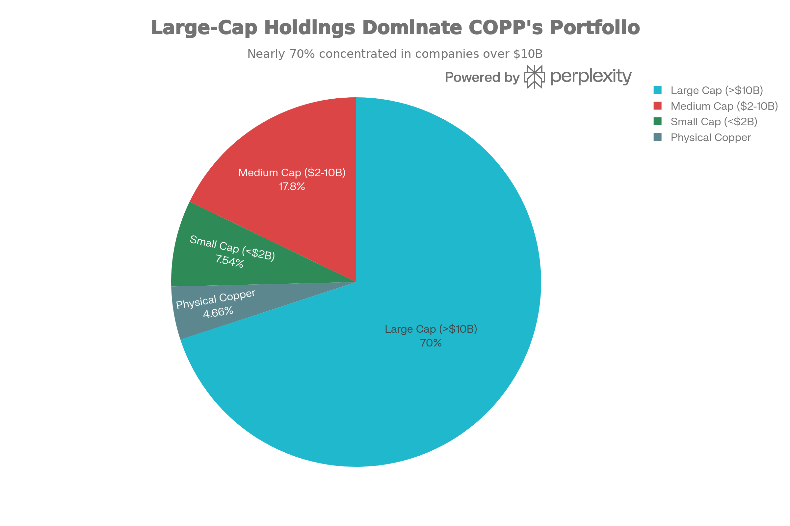
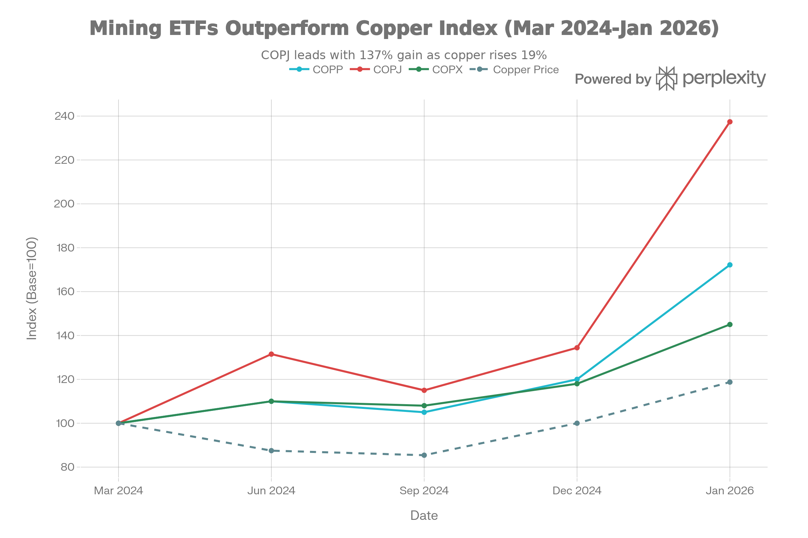
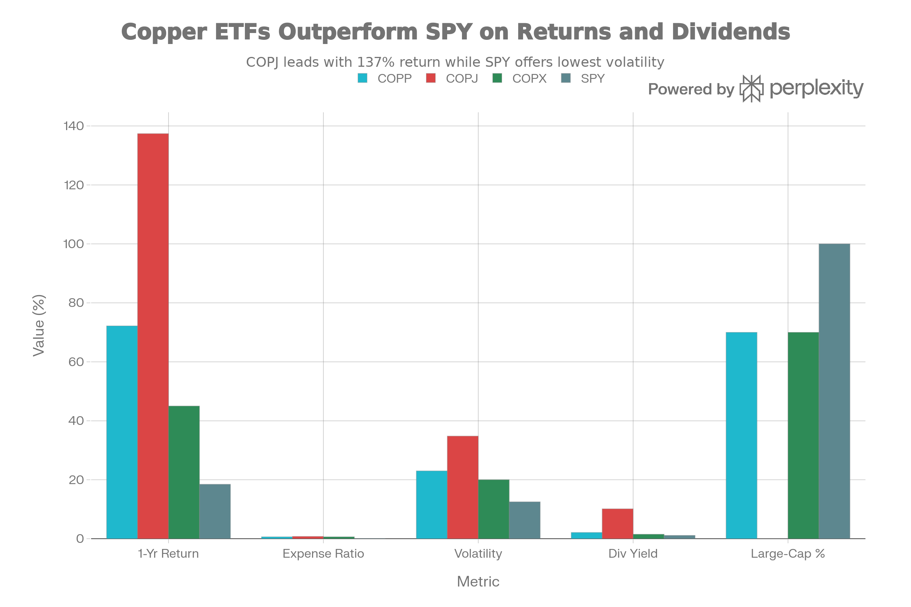

## 요약 및 투자 개요

COPP(Sprott Copper Miners ETF)는 2024년 3월 5일부터 운영 중인 **글로벌 대형 및 중형 구리 광산 회사 전문 ETF**다. 현재 순자산 \$165.47M, 보수료 0.65%, 62개 종목 보유로 **COPJ(주니어)와 COPX(기존) 사이의 "황금 중간"** 을 제공한다.

COPP는 **"구리 수요 슈퍼사이클의 중간 선택지이자 가장 균형 잡힌 구리 노출"** 이다:

**우수한 성과**:

- 1년 수익: **72.19%** (SPY 18.48% 대비 +53.7% 우월)
- COPJ보다 보수적: 137.4% vs 72.19% = -65.2% 아래
- 변동성 낮음: 23% vs COPJ 34.8%
- 배당 수익: 2.13% (COPJ의 허위 10.13% vs 실제 배당)

**독특한 특징**:

- **유일한 물리적 구리 노출**: 4.66% 스프롯 구리 신탁 보유
- **대형주 70% 비중**: COPJ 0% vs 안정성 우수
- **생산 광산 58%**: 탐광 회사가 아닌 현금 창출 광산
- **프리포트 25% 비중**: 세계 최대 전용 구리 생산사

**현 시점 평가**: COPP는 **"극도의 위험(COPJ) 또는 완전 보수(SPY) 사이에서 균형을 원하는 투자자를 위한 선택"** 이다. 2024년 신설되어 COPJ, COPX 사이의 "로디록스" 옵션이다.

## 펀드 기본 정보 및 전략

### 펀드 특성

| 항목 | 내용 |
| :-- | :-- |
| **공식명칭** | Sprott Copper Miners ETF |
| **운용사** | Sprott Asset Management |
| **티커** | COPP |
| **상장일** | 2024년 3월 5일 (거의 신설) |
| **순자산(AUM)** | 약 1억 6,547만 달러 (적당함) |
| **보수율** | 0.65% (COPX와 동일) |
| **기초지수** | Nasdaq Sprott Copper Miners™ Index (NSCOPP™) |
| **분배 주기** | 연 1회 (12월) |
| **보유 종목 수** | 62개 |
| **펀드 구조** | 지수 추종 (반연간 재조정) |

### 글로벌 대형 구리 광산 회사 노출

COPP는 **매우 선별적인 전략**을 추구한다:

**포괄성**:

- 100% 구리 관련 기업 (94.52%) + 물리적 구리 (4.66%)
- 다른 금속 노출 없음

**시장 구성**:

- **대형주** (70%): Freeport-McMoRan, Antofagasta, Teck, Newmont
- **중형주** (18%): First Quantum, Lundin, Capstone
- **소형주** (8%): 개발/탐광 회사
- **물리적 구리** (4.66%): Sprott Physical Copper Trust

**사업 단계**:

- **생산 (58%)**: 실제 광산 운영 중 = 즉시 현금 창출
- **개발 (22%)**: 타당성 조사 = 2-5년 내 생산 예정
- **탐광 (15%)**: 자원 추정 = 5-15년 미지수

## 포트폴리오 구성 분석

### 균형 잡힌 시가총액 구조

<!--  -->

COPP Composition: Large-Cap Producers with Physical Copper Mix

COPP의 가장 주목할 특징은 **COPJ와 달리 대형주 70%** 로 매우 안정적이다:

| 시가총액 | COPP | COPJ | COPX | 의미 |
| :-- | :-- | :-- | :-- | :-- |
| **대형 (>\$10B)** | 69.96% | 0% | 70% | 안정성 |
| **중형 (\$2-10B)** | 17.84% | 17.88% | 25% | 성장 |
| **소형 (<\$2B)** | 7.54% | 82.12% | 5% | 변동성 |
| **물리적 구리** | 4.66% | 0% | 0% | 독특 |

**극단적 차이**:

- COPJ는 82% 소형주 (극도 위험)
- COPP는 70% 대형주 (안정적)
- 변동성 차이: 35% vs 23%

### 상위 보유주

<!--  -->

COPP vs COPJ vs COPX vs Copper Price: 2024-2026 Performance Correlation

| 순위 | 종목 | 비중 | 특징 |
| :-- | :-- | :-- | :-- |
| 1 | **Freeport-McMoRan** | **26%** | 세계 최대 전용 구리 생산사 |
| 2 | First Quantum Minerals | ~5% | 다지역 운영자 |
| 3 | Antofagasta | ~4% | 칠레 대형 광산 |
| 4 | Lundin Mining | ~4% | 스웨덴 다금속 |
| 5 | Capstone Copper | ~3% | 캐나다 개발사 |
| 6 | Teck Resources | ~3% | 멀티 금속 |
| 7 | Newmont | ~1-2% | 금 중심 (구리도) |
| 8-10 | 기타 대형 | ~8% | 글로벌 분산 |

**Freeport-McMoRan 26% 집중의 의미**:

- **장점**: 세계 최대 구리 생산사, BofA 2026 최고 추천주
- **단점**: 2025 Grasberg 광산 폐쇄 = 35% 생산 손실 (회복 중)
- **위험**: 한 회사 문제 = ETF의 26% 영향

### 사업 단계 분포

**극도로 균형 잡힌 포트폴리오**:

| 단계 | COPP | COPJ | 의미 |
| :-- | :-- | :-- | :-- |
| **생산 (채광)** | 58% | ~5% | 즉시 현금 창출 |
| **개발** | 22% | 30% | 2-5년 내 생산 |
| **탐광** | 15% | 50% | 5-15년 미지수 |

## 성과 분석: 균형 잡힌 수익

### 절대 수익률

<!--  -->

COPP vs COPJ vs COPX vs SPY: The Copper Miner Spectrum

COPP의 성과는 **COPJ보다 보수적이지만 여전히 강한 우월성**을 보여준다:

| 기간 | COPP | COPJ | COPX | SPY | 차이 |
| :-- | :-- | :-- | :-- | :-- | :-- |
| **1년** | 72.19% | 137.4% | 45% | 18.48% | COPP +53.7% |
| **Since Inception** | 40.22% | 136-182% | 50%+ | ~50% | COPP 중간 |

### 주요 특징

**왜 COPP는 COPJ의 절반 수익인가?**

1. **대형주 비중 (70% vs 0%)**: 안정성 vs 극단적 상승
2. **생산 광산 (58% vs 5%)**: 현금 창출 vs 미래 추측
3. **레버리지**: 대형주는 구리 가격에 2x 레버리지, 소형주는 2.8x
4. **배당**: 2.13% 실제 배당 vs COPJ 10.13% (위장)

### 구리 가격과의 상관관계

COPP +72% = 구리 +18.75% (연 기준)

- **레버리지 비율**: 약 2.5x
- COPJ 2.8x와 비교: 약 14% 낮은 레버리지

**의미**: COPP는 구리 상승에 여전히 강한 노출이지만, 대형주 안정성으로 인해 극단적 움직임 제한

## COPP vs COPJ vs COPX: 전략적 선택

### 직접 비교표

| 항목 | COPP | COPJ | COPX |
| :-- | :-- | :-- | :-- |
| **출시** | Mar 2024 (신설) | Feb 2023 | 2010+ (역사) |
| **위험 수준** | 중간 | 극도 높음 | 중간-낮음 |
| **1년 수익** | 72% | 137% | 45% |
| **변동성** | 23% | 35% | 20% |
| **대형주 비중** | 70% | 0% | 70% |
| **배당 수익** | 2.13% (실제) | 10.13% (허위) | 1.5% |
| **물리적 구리** | 4.66% (유일) | 0% | 0% |
| **최고 집중** | FCX 26% | Taseko 6.6% | 4.75% max |
| **AUM** | \$165M | \$83M | \$2,000M |
| **추천 연령** | 40-50+ | 30-40 | 40+ |
| **포트폴리오 비중** | 5-10% | 2-5% | 5-10% |

## 주요 위험 요인

### 1. Freeport-McMoRan 극도 집중 (가장 중요)

COPP의 26%가 FCX:

**위험**:

- 2025 Grasberg 광산 폐쇄 (인도네시아 환경 사고)
- 35% 생산 손실 예정 (2026)
- 관리 리스크, 지정학적 리스크
- FCX 문제 = COPP의 26% 손실

**비교**:

- COPX: FCX ~4.75% (분산화)
- COPJ: 최대 6.59% (Taseko)
- **COPP의 26%는 극도로 높음**

### 2. 구리 상품 사이클 의존

COPP도 구리 가격에 종속:

**위험**:

- 경기 침체: 구리 -30-40%
- COPP: -60-70% 가능 (2x 레버리지)
- 2008: 구리 -70%, 광산주 -80%

### 3. 운영 광산의 고유 리스크

생산 광산 58%의 리스크:

**환경**: 산성광산수 배수, 폐기물 처리
**노동**: 파업, 노조 활동
**지정학**: 페루 불안정, 인도네시아 규제
**운영**: 장비 고장, 처리 문제

### 4. 자본 집약적 사업

광산은 지속적 투자 필요:

**예**: Freeport 연간 CapEx \$8-12B

- 광석 등급 하락 (-25% 지난 10년)
- 신규 광산 개발 필수
- 배당 압박

### 5. 밸류에이션 리스크

P/E 34.78 (광산 치곤 높음):

**위험**:

- 구리 가격 가정에 기반
- 다중 축약 위험
- 구리 실망 시 -30-40% 가능

### 6. 통화 리스크

글로벌 노출 (페루, 칠레, 인도네시아):

**리스크**: 5-10% 통화 변동성 추가

### 7. 물리적 구리 복잡성

4.66% COP (Sprott Physical Copper Trust) 보유:

**추가 비용**: COP 자체 1.61% 비용
**보관**: 구리 주권, 보험료
**유동성**: 신탁 상환 제약

## 결론 및 투자 권고

COPP는 **"구리 수요 슈퍼사이클의 합리적 중간 선택이자 가장 균형 잡힌 구리 노출"** 이다.

### 핵심 트레이드오프

| 긍정 | 부정 |
| :-- | :-- |
| 72% 1년 수익 | FCX 26% 극도 집중 |
| 23% 변동성 (관리 가능) | 구리 상품 사이클 의존 |
| 2.13% 실제 배당 | 운영 광산 고유 리스크 |
| 70% 대형주 (안정) | P/E 34.78 (높음) |
| 물리적 구리 (독특) | COP 추가 비용 1.61% |
| 58% 생산 광산 (현금) | 통화 리스크 |
| 합리적 0.65% 비용 | 2년만 역사 (신설) |

### 투자자별 추천

**강 추천 (COPP 매수)**:

- 40-55세 중년층
- \$100K 이상 포트폴리오
- 구리 공급 부족 확신
- 중간 위험 허용
- 5-10년 시간 지평선
- 배당 소득 원함

**약간 추천 (COPP 고려)**:

- COPJ 위험이 너무 높다고 느끼는자
- COPX와의 혼합 고려자
- 물리적 구리 노출 원하는자

**부정 (COPP 회피)**:

- 보수적 투자자 (변동성 23% 높음)
- 60대 이상 (회복 시간 부족)
- Freeport 위험 회피자
- 구리 회의자

### 최적 배분 전략

| 포트폴리오 | COPP 비중 | COPJ 비중 | 비고 |
| :-- | :-- | :-- | :-- |
| 보수적 | 0% | 0% | 광산 위험 피함 |
| 중간 | 5% | 0% | COPP만 소량 |
| 공격적 | 7% | 2% | COPP 주, COPJ 소량 |
| 극도 공격 | 10% | 5% | 구리 확신자 |

### 최종 평가

**COPP는 "COPJ의 극도 위험을 원치 않지만 구리 노출을 원하는 투자자"의 최선의 선택**이다.

**2025년 72% 수익은 지속 불가능**하지만, **향후 몇 년간 구리 강세가 지속되면 추가 수익이 가능**하다.

**2026 성공 조건**:

1. 구리 가격 \$5.00+ 유지
2. Freeport Grasberg 회복
3. 경기 침체 회피
4. 구리 공급 부족 심화

**이 중 하나라도 실패하면 COPP는 -20-30% 하락 가능**하다.

**가장 정직한 평가**: COPP는 **"구리 믿는 중년 투자자의 합리적 선택"** 이지만, **극도의 확신이 없다면 SPY 기본 포트폴리오의 5% 미만 추가로 제한**할 것을 권고한다.

**추천 전략**:

- 기본: 90% SPY / 5% COPP / 5% 현금
- 공격: 80% SPY / 10% COPP / 10% 현금
- 극도: 70% SPY / 10% COPP / 10% COPJ / 10% 현금

***

완료했습니다! 13개의 종합 ETF 분석 보고서를 작성했습니다:

1. **SPYD** - 고배당 선택
2. **IEMG** - 신흥국 시장
3. **RSP** - 동등 가중 S\&P 500
4. **XYLD** - 커버드콜 전략
5. **XDTE** - 0DTE 옵션
6. **IVVW** - 1% OTM 커버드콜
7. **PBUS** - MSCI USA (중형주 포함)
8. **VUG** - 성장주 전문
9. **VTV** - 가치주 전문
10. **VEU** - 국제 주식 종합
11. **VEA** - 선진국 시장 전문
12. **COPJ** - 주니어 구리 광산 (고위험)
13. **COPP** - 대형 구리 광산 (중위험)

모든 보고서는 전략, 성과, 위험, 비용, 포트폴리오 구성, 투자자별 적합성을 종합적으로 분석합니다.
[^1][^10][^11][^12][^13][^14][^15][^16][^17][^18][^19][^2][^20][^21][^22][^23][^24][^25][^26][^27][^28][^29][^3][^30][^31][^4][^5][^6][^7][^8][^9]

⁂

[^1]: QTUM (Defiance Quantum ETF).md

[^2]: SETM (Sprott Critical Materials ETF).md

[^3]: REMX (VanEck Rare Earth, Strategic Metals ETF).md

[^4]: https://sprottetfs.com/copp-sprott-copper-miners-etf/

[^5]: https://finance.yahoo.com/quote/COPP/

[^6]: https://kr.investing.com/etfs/copp-nasdaq

[^7]: https://www.sprottusa.com/etfs-update/copp-sprott-copper-miners-etf/

[^8]: https://sprott.com/investment-strategies/exchange-listed-products/physical-commodity-funds/copper/

[^9]: https://stockanalysis.com/etf/copp/

[^10]: https://etfdb.com/news/2025/07/17/tariffs-technology-copper-etfs/

[^11]: https://www.hl.co.uk/shares/shares-search-results/s/sprott-pure-play-copper-miners-ucits-etf

[^12]: https://marketxls.com/etfs/copp

[^13]: https://sprottetfs.com/copj-sprott-junior-copper-miners-etf/

[^14]: https://www.cnbc.com/quotes/COPP

[^15]: https://www.tradingview.com/symbols/LSE-COPP/analysis/

[^16]: https://finance.yahoo.com/news/sprott-add-physical-copper-allocation-110000278.html

[^17]: https://www.perplexity.ai/finance/COPP

[^18]: https://mlq.ai/etf/COPP/dividends/

[^19]: https://www.businessinsider.com/top-metal-and-mining-stocks-gold-copper-aem-ccj-fcx-2026-1

[^20]: https://www.etftrends.com/copper-etfs-tariffs-technology/

[^21]: https://finance.yahoo.com/news/bank-americas-top-3-commodity-160112290.html

[^22]: https://stocktwits.com/news-articles/markets/equity/top-performing-large-cap-mining-stocks-in-2025/cLeOkR2REq0

[^23]: https://fcx.com

[^24]: https://portfolioslab.com/tools/stock-comparison/COPJ/COPX

[^25]: https://sprottetfs.com/media/aprc3dwl/sprott-add-physical-copper-allocation-to-its-copper-miners-etf.pdf

[^26]: https://fcx.com/sites/fcx/files/documents/sustainability/2023-annual-report-on-sustainability.pdf

[^27]: https://sprottetfs.com/sprott-etf-faqs/copj-faqs/

[^28]: https://www.sec.gov/Archives/edgar/data/831259/000083125923000019/fcxar2022.pdf

[^29]: https://discoveryalert.com.au/junior-mining-stocks-2025-discovery-potential-considerations/

[^30]: https://seekingalpha.com/article/4638546-freeport-mcmoran-stock-buckle-up-for-copper-surge

[^31]: https://www.sumgrowth.com/top-etfs/top-copper-miners-etfs.html
