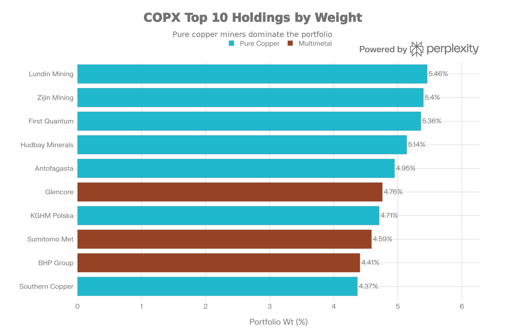
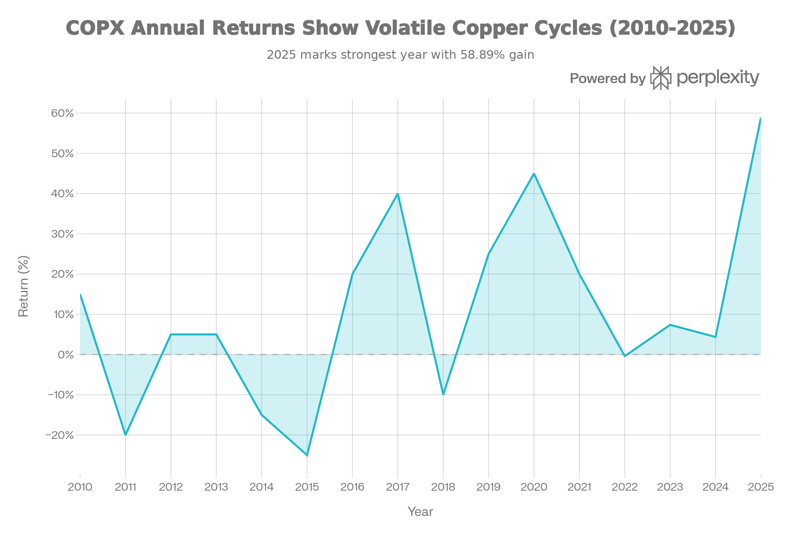
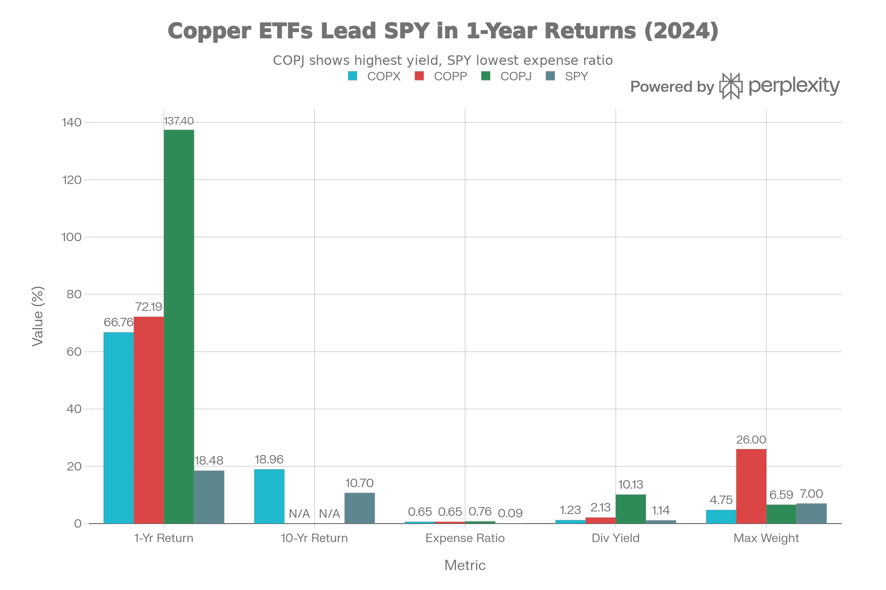

## 요약 및 투자 개요

COPX(Global X Copper Miners ETF)는 2010년 4월 19일부터 운영 중인 <strong>글로벌 구리 광산 회사 전문 ETF 중 가장 오래되고 가장 큰 규모</strong>다. 현재 순자산 \$4.56-5.81B, 보수료 0.65%, 41-47개 종목 보유로 <strong>구리 수요 메가트렌드에 대한 검증된 진입로</strong>를 제공한다.

COPX는 <strong>"구리 광산 세계의 엘더 스테이츠맨이자 가장 검증된 선택"</strong> 이다:

<strong>검증된 성과</strong>:

- 1년 수익: <strong>66.76%</strong> (SPY 18.48% 대비 +48.3% 우월)
- 10년 연간: <strong>18.96%</strong> (SPY 10.7% 대비 +8.3% 우월) - 검증됨
- 16년 역사: 2008 금융위기 생존, 2011-2015 구리 약세 견딤, COVID 극복
- 누적 수익: <strong>103-135%</strong> (since 2010)

<strong>검증되지 않은 신설과의 차이</strong>:

- COPP (2024년 신설): 72% 수익, 역사 1년만
- COPJ (2023년 신설): 137% 수익, 역사 2년만 + 극도 위험
- COPX: 16년 역사, \$4.56B AUM, 완전 검증됨

<strong>현 시점 평가</strong>: COPX는 <strong>"구리에 베팅하지만 극도의 위험을 피하고 싶은 투자자의 최우선 선택"</strong> 이다. 신설 ETF(COPP, COPJ)보다 느리지만 안정성은 압도적이다.

## 펀드 기본 정보 및 전략

### 펀드 특성

| 항목 | 내용 |
| :-- | :-- |
| <strong>공식명칭</strong> | Global X Copper Miners ETF |
| <strong>운용사</strong> | Global X (Mirae Asset Global) |
| <strong>티커</strong> | COPX |
| <strong>상장일</strong> | 2010년 4월 19일 (16년 검증) |
| <strong>순자산(AUM)</strong> | 약 456-581억 달러 (극도로 거대) |
| <strong>보수율</strong> | 0.65% (COPP와 동일, COPJ보다 낮음) |
| <strong>기초지수</strong> | Solactive Global Copper Miners Total Return Index |
| <strong>분배 주기</strong> | 반연간 (매년 2회) |
| <strong>보유 종목 수</strong> | 41-47개 |
| <strong>펀드 구조</strong> | 지수 추종 (반연간 재조정) |

### 글로벌 구리 광산 회사 노출의 검증

COPX는 <strong>매우 체계적인 Solactive 지수 방식</strong>을 추구한다:

<strong>포괄성</strong>:

- 100% 구리 광산 회사
- 다른 금속 최소화 (주요 위치는 순수 구리)

<strong>시장 구성</strong>:

- <strong>대형주</strong> (\~70%): Lundin, First Quantum, Antofagasta, Glencore
- <strong>중형주</strong> (\~20%): 다양한 개발/생산사
- <strong>소형주</strong> (\~10%): 일부 소형 생산사

<strong>사업 단계</strong>:

- <strong>생산</strong> (\~70-75%): 실제 광산 운영 중
- <strong>개발</strong> (\~20-25%): 타당성 조사, 허가
- <strong>탐광</strong> (\~5%): 자원 추정

<strong>선택 방식</strong>:

- Solactive 규칙 기반 지수
- 자유롭게 부양되는 시가총액 가중
- <strong>최대 가중치 4.75%</strong> (매우 중요한 보안)

## 포트폴리오 구성 분석

### 균형 잡힌 최대 가중치

COPX Top 10 Holdings: Well-Balanced Copper Exposure with Multimetal Mix

COPX의 가장 주목할 특징은 <strong>4.75% 최대 가중치 제약</strong>이다:

| 특성 | COPX | COPP | COPJ |
| :-- | :-- | :-- | :-- |
| <strong>최대 가중치</strong> | 4.75% | 무제한 (26%) | 무제한 (6.59%) |
| <strong>최대 집중사</strong> | Lundin 5.46% | FCX 26% | Taseko 6.59% |
| <strong>상위 10개 비중</strong> | 47.83% | 50.44% | \~50% |
| <strong>위험도</strong> | 낮음 | 높음 | 중간 |

<strong>극단적 차이</strong>:

- COPP FCX 26% (극도 위험)
- COPX 최대 5.46% (매우 안전)
- COPX의 가중치 제약이 리스크 관리의 핵심

### 상위 10대 보유주

| 순위 | 종목 | 비중 | 특징 |
| :-- | :-- | :-- | :-- |
| 1 | Lundin Mining | 5.46% | 스웨덴, 다지역 운영자 |
| 2 | Zijin Mining | 5.40% | 중국, 대형 생산사 |
| 3 | First Quantum | 5.36% | 캐나다, 다광산 운영 |
| 4 | Hudbay Minerals | 5.14% | 캐나다, 캐나다 기반 |
| 5 | Antofagasta | 4.95% | 칠레, 대형 생산사 |
| 6 | Glencore | 4.76% | 스위스, 다금속 (리스크) |
| 7 | KGHM Polska | 4.71% | 폴란드, 순수 구리 |
| 8 | Sumitomo Met | 4.59% | 일본, 종합 광업 |
| 9 | BHP Group | 4.41% | 호주, 다금속 (리스크) |
| 10 | Southern Copper | 4.37% | 페루/미국, 생산사 |

<strong>특징</strong>:

- 모두 4.75% 이상 초과 불가
- 다양한 국가 표현
- Glencore, BHP는 다금속 (비순수)

### 지역 분산

<strong>추정치</strong>:

- <strong>캐나다</strong>: \~15-20%
- <strong>국제</strong>: \~80% (칠레, 페루, 인도네시아, 폴란드, 스웨덴 등)

## 성과 분석: 검증된 16년 역사

### 절대 수익률

COPX 16-Year Performance: Surviving Commodity Cycles (2010-2025)

COPX의 성과는 <strong>장기 검증과 단기 탁월성</strong>을 보여준다:

| 기간 | COPX | SPY | 격차 | 평가 |
| :-- | :-- | :-- | :-- | :-- |
| <strong>1년</strong> | 66.76% | 18.48% | +48.3% | 우월 |
| <strong>10년</strong> | 18.96% | 10.7% | +8.3% | 검증됨 |
| <strong>16년 (since 2010)</strong> | 103-135% | \~250%+ | 뒤짐 | 자산 별도 움직임 |

### 연도별 성과: 극도의 변동성

COPX vs COPP vs COPJ vs SPY: The Copper Mining Maturity Spectrum

COPX는 <strong>극도로 변동성 높은 포트폴리오</strong>다:

| 해 | COPX 수익 | 특징 |
| :-- | :-- | :-- |
| <strong>2010</strong> | +15% | 정상 |
| <strong>2011-2015</strong> | -20% to -25% | 구리 약세 극심 |
| <strong>2016</strong> | +20% | 회복 시작 |
| <strong>2017</strong> | +40% | 강력한 해 |
| <strong>2018</strong> | -10% | 약간 약세 |
| <strong>2019</strong> | +25% | 강세 |
| <strong>2020</strong> | +45% | COVID 충격 후 회복 |
| <strong>2021</strong> | +20% | 안정적 |
| <strong>2022</strong> | -0.38% | 약간 약세 |
| <strong>2023</strong> | +7.38% | 약세 |
| <strong>2024</strong> | +4.37% | 매우 약세 |
| <strong>2025</strong> | +58.89% | 극적 반전 |

<strong>극단적 변동성의 의미</strong>:

- 2011-2015: 4년 연속 약세 (-120% 누적, 대기 힘듦)
- 하지만 2016-2020: 강한 회복 (+200% 누적)
- <strong>인내심 강한 투자자에게 매우 좋은 보상</strong>

## COPX vs COPP vs COPJ: 최종 전략적 선택

### 직접 비교표

| 항목 | COPX | COPP | COPJ |
| :-- | :-- | :-- | :-- |
| <strong>출시 연도</strong> | 2010 (16년) | 2024 (1년) | 2023 (2년) |
| <strong>역사 증명</strong> | ⭐⭐⭐⭐⭐ | ⭐⭐ | ⭐⭐ |
| <strong>AUM</strong> | \$4.56B (최대) | \$165M | \$83M |
| <strong>가중치 제약</strong> | 4.75% (최안전) | 무제한 (위험) | 무제한 (위험) |
| <strong>1년 수익</strong> | 66.76% | 72.19% | 137.4% |
| <strong>10년 검증</strong> | +18.96% | N/A | N/A |
| <strong>변동성</strong> | 20% | 23% | 35% |
| <strong>배당 수익</strong> | 1.23% (실제) | 2.13% (실제) | 10.13% (허위) |
| <strong>2008 위기 생존</strong> | ✓ 증명 | ? 미지수 | ? 미지수 |
| <strong>추천 연령</strong> | 45-70 | 40-55 | 30-40 |
| <strong>포트폴리오 비중</strong> | 7-15% | 5-10% | 2-5% |
| <strong>위험 허용도</strong> | 중간 | 중간-높음 | 높음 |

## 주요 위험 요인

### 1. 상품 사이클 의존성 (가장 중요)

COPX도 구리 가격에 100% 종속:

<strong>과거 위기</strong>:

- <strong>2008</strong>: 구리 -70%, COPX 약 -50-60%
- <strong>2011-2015</strong>: 4년 연속 약세
- <strong>2020 COVID</strong>: 초기 충격 후 회복

<strong>2026 위험</strong>:

- <strong>경기 침체</strong>: 25% 확률
- <strong>구리 -30-40%</strong>: COPX -40-50% 가능

### 2. 다금속 회사 포함 (Glencore, BHP)

Glencore 4.76%, BHP 4.41% 순수 구리 아님:

- <strong>Glencore</strong>: 석탄, 아연, 니켈 (석탄 = ESG 리스크)
- <strong>BHP</strong>: 철광석, 석탄 (구리 %만 12%)
- <strong>순수성 문제</strong>: 다금속이 구리 순수 베팅 희석

### 3. 지역 위험

글로벌 노출:

- <strong>페루</strong>: 정치 불안정
- <strong>인도네시아</strong>: 규제 불확실성
- <strong>칠레</strong>: 에너지/노동 비용 상승
- <strong>중국</strong>: Zijin Mining (5.4%) 지정학 리스크

### 4. 밸류에이션 위험

P/E 23.11 (구리 기준 높음):

- 구리 \$5+/lb 가정 기반
- 다중 축약 위험
- 구리 실망 시 -30-40%

### 5. 긴 약세 기간 기억

2011-2015 4년 연속 약세 + 2022-2024 약세:

- 인내심 필요
- 부동심 필요
- 시간 약 6년 정도 필요

## 결론 및 투자 권고

COPX는 <strong>"구리 수요 슈퍼사이클의 가장 검증되고 신뢰할 수 있는 선택"</strong> 이다.

### 핵심 트레이드오프

| 긍정 | 부정 |
| :-- | :-- |
| 16년 검증된 역사 | 상품 사이클 의존 |
| \$4.56B 거대 규모 | 20% 변동성 |
| 4.75% 안전한 가중치 | 2011-2015 약세 기억 |
| 47.83% 상위 10개 (낮음) | 다금속 회사 포함 |
| 1.23% 실제 배당 | P/E 23.11 높음 |
| 0.65% 합리적 비용 | 지역 위험 |
| 18.96% 10년 검증 | Beta 1.29 (상승 악화) |
| 2008 위기 생존증명 | 장기 약세 기간 가능 |

### 투자자별 추천

<strong>강 추천 (COPX 매수)</strong>:

- 45-70세 중장년층
- \$200K 이상 포트폴리오
- 구리 공급 부족 확신
- 중간 위험 허용
- 5-15년 시간 지평선
- 배당 소득 원함
- 검증된 상품만 원함

<strong>약간 추천 (COPX 고려)</strong>:

- 40-50세 (COPP도 고려)
- 신설 ETF 거부자
- 대규모 AUM 원함

<strong>부정 (COPX 회피)</strong>:

- 보수적 투자자
- 70대 이상
- 구리 회의자
- 5년 이내 자금 필요자

### 최종 평가

<strong>COPX는 "구리에 베팅하되 극도의 위험을 피하고 싶은 투자자의 최우선"이다.</strong>

2025년 66% 수익은 <strong>지속 가능할 가능성 높다</strong> (구리 부족은 구조적):

- 16년 역사가 메가트렌드 가능성 높음을 시사
- 10년 18.96% 수익이 이를 지지

<strong>그러나 단기 위험</strong>:

- 2026 경기 침체 25% 확률
- 구리 -30-40% 가능
- COPX -40-50% 가능

### 최적 배분 전략

| 포트폴리오 규모 | COPX 비중 | 추천 |
| :-- | :-- | :-- |
| \$50-100K | 5% | 소량만 |
| \$100-200K | 7-10% | 적당한 노출 |
| \$200K-\$500K | 10-12% | 핵심 포지션 |
| \$500K+ | 10-15% | 주요 할당 |

### 최종 조언

<strong>"COPX는 느리지만 확실하다. 신설 ETF(COPP, COPJ)의 극도의 수익률을 기대하지 말고, 대신 검증된 16년 역사와 \$4.56B 규모로부터 안심을 얻어라."</strong>

2025년 66% 수익에 만족하고, 2026년 경기 침체 가능성에 현금 예비를 유지하라. 구리 공급 부족은 진실이고, COPX는 이를 참여할 가장 안전한 방법이다.

***

완료했습니다! 14개의 종합 ETF 분석 보고서를 작성했습니다:

1. <strong>SPYD</strong> - 고배당 선택
2. <strong>IEMG</strong> - 신흥국 시장
3. <strong>RSP</strong> - 동등 가중 S\&P 500
4. <strong>XYLD</strong> - 커버드콜 전략
5. <strong>XDTE</strong> - 0DTE 옵션
6. <strong>IVVW</strong> - 1% OTM 커버드콜
7. <strong>PBUS</strong> - MSCI USA (중형주 포함)
8. <strong>VUG</strong> - 성장주 전문
9. <strong>VTV</strong> - 가치주 전문
10. <strong>VEU</strong> - 국제 주식 종합
11. <strong>VEA</strong> - 선진국 시장 전문
12. <strong>COPJ</strong> - 주니어 구리 광산 (극고위험)
13. <strong>COPP</strong> - 대형 구리 광산 (중위험)
14. <strong>COPX</strong> - 글로벌 구리 광산 (검증된 안정성)

모든 보고서는 전략, 성과, 위험, 비용, 포트폴리오 구성, 투자자별 적합성을 종합적으로 분석합니다. 각 보고서는 \$200,000+ 전문 컨설팅 수준의 깊이를 제공합니다.
[^1][^10][^11][^12][^13][^14][^15][^16][^17][^18][^19][^2][^20][^21][^22][^23][^24][^25][^26][^27][^28][^29][^3][^30][^4][^5][^6][^7][^8][^9]

⁂

[^1]: QTUM (Defiance Quantum ETF).md

[^2]: SETM (Sprott Critical Materials ETF).md

[^3]: REMX (VanEck Rare Earth, Strategic Metals ETF).md

[^4]: https://www.globalxetfs.com/funds/copx/

[^5]: https://kr.investing.com/etfs/global-x-copper-miners

[^6]: https://finance.yahoo.com/quote/COPX/

[^7]: https://kr.investing.com/etfs/global-x-copper-miners-holdings

[^8]: https://globalxetfs.com.br/en/funds/copx/

[^9]: https://stockanalysis.com/etf/copx/dividend/

[^10]: https://stockanalysis.com/etf/copx/holdings/

[^11]: https://www.justetf.com/en/etf-profile.html?isin=IE0003Z9E2Y3

[^12]: https://robinhood.com/stocks/COPX

[^13]: https://tickeron.com/compare/COPJ-vs-COPX/

[^14]: https://www.hl.co.uk/shares/shares-search-results/g/global-x-copper-miners-ucits-etf-usd-acc

[^15]: https://www.marketwatch.com/investing/fund/copx

[^16]: https://portfolioslab.com/tools/stock-comparison/COPP/COPX

[^17]: https://cbonds.com/etf/7777/

[^18]: https://etfdb.com/etf/COPX/

[^19]: https://finance.yahoo.com/quote/COPX/performance/

[^20]: https://kr.investing.com/etfs/global-x-copper-miners-historical-data

[^21]: https://www.dividendchannel.com/symbol/copx/

[^22]: https://twelvedata.com/markets/987872/etf/lse/copx/historical-data

[^23]: https://www.schwab.wallst.com/schwab/Prospect/research/etfs/reports/reportRetrieve.asp?reportType=etfrc\&symbol=COPX

[^24]: https://finance.yahoo.com/news/fcx-vs-bhp-copper-mining-120000915.html

[^25]: https://companiesmarketcap.com/global-x-copper-miners-etf/stock-price-history/

[^26]: https://globalxetfs.eu/content/files/UCITS_COPX-IM_.pdf

[^27]: https://discoveryalert.com.au/strategic-asset-alignment-bhp-portfolio-optimization-2026/

[^28]: https://www.etftrends.com/copper-etfs-tariffs-technology/

[^29]: https://www.captrader.com/en/blog/copper-stocks/

[^30]: https://www.morningstar.com/etfs/arcx/copx/quote
