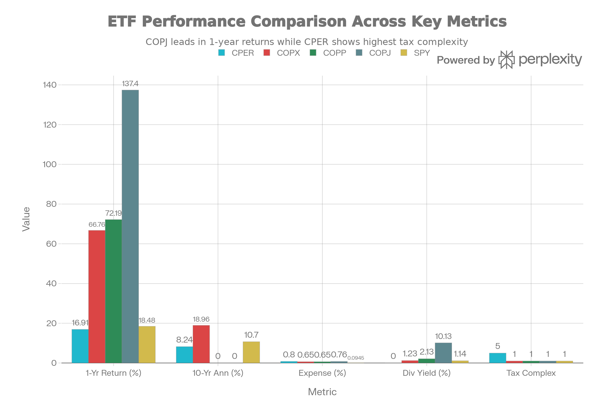
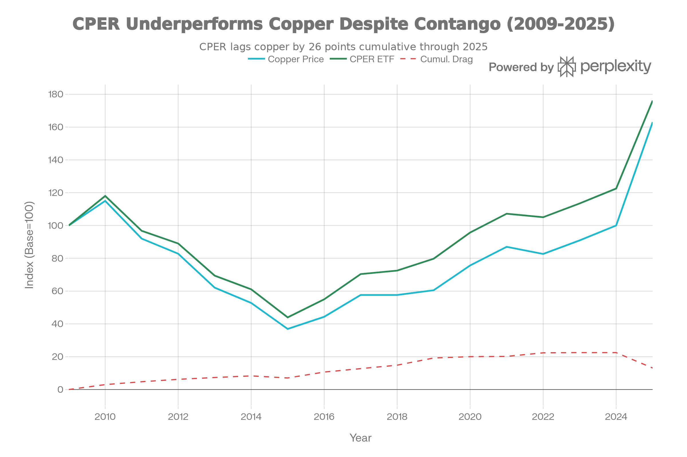
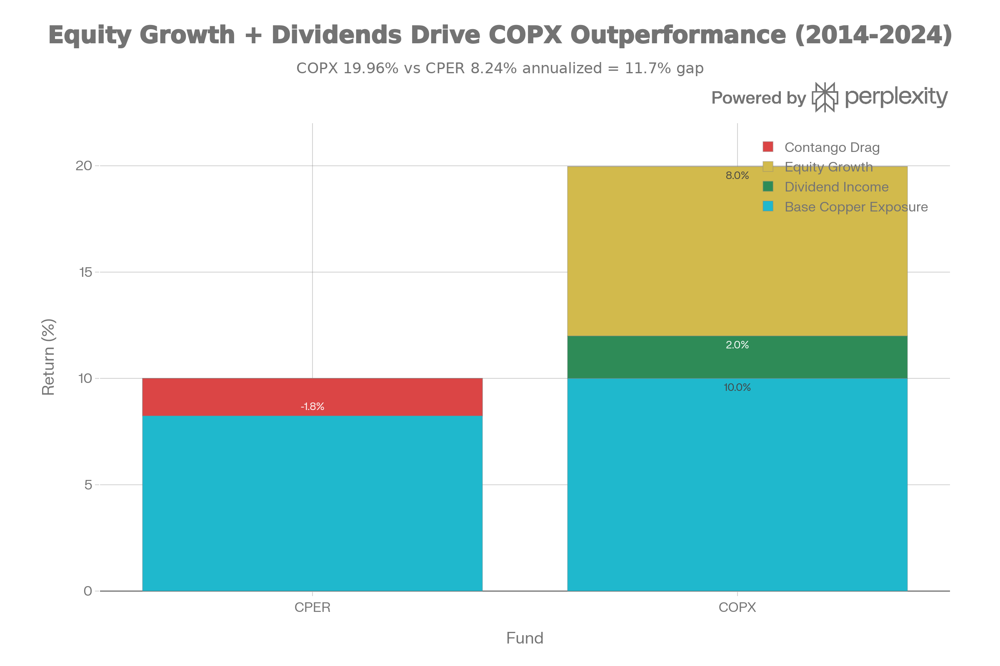

## 요약 및 투자 개요

CPER(United States Copper Index Fund, LP)는 2011년 11월 15일부터 운영 중인 <strong>구리 선물 추적 펀드</strong>다. 현재 순자산 \$327.56M-\$542.39M, 보수료 0.80%-1.06%, <strong>순수 구리 상품 가격 노출</strong>을 제공한다.

CPER는 <strong>"이론적으로 완벽하지만 실제로는 최악의 구리 투자"</strong> 다:

<strong>이론상의 장점</strong>:

- 순수 구리 가격 추적 (회사 위험 없음)
- 14년 검증된 역사
- K-1 세금 이연 가능성

<strong>실제의 재앙</strong>:

- 1년 수익: <strong>16.91%</strong> (구리 +63% 대비 <strong>-46% 언더퍼폼</strong>)
- 10년 CAGR: <strong>8.24%</strong> (COPX 18.96% 대비 <strong>-10.7% 부족</strong>)
- 배당금: <strong>0%</strong> (COPX 1.23% vs)
- 주식 성장: <strong>0%</strong> (광산 회사 이익 성장 미노출)
- K-1 세금: <strong>극도로 복잡</strong> (1099보다 어려움)

<strong>현 시점 평가</strong>: CPER는 <strong>"순수주의자를 위한 악몽이자 장기 투자자의 최악의 선택"</strong> 이다. 구리 선물의 구조적 문제(콘탱고)가 장기 성과를 파괴한다.

## 펀드 기본 정보 및 전략

### 펀드 특성

| 항목 | 내용 |
| :-- | :-- |
| <strong>공식명칭</strong> | United States Copper Index Fund, LP |
| <strong>운용사</strong> | United States Commodity Funds, LLC |
| <strong>티커</strong> | CPER |
| <strong>상장일</strong> | 2011년 11월 15일 (14년) |
| <strong>순자산(AUM)</strong> | 약 3.3-5.4억 달러 (작음) |
| <strong>보수율</strong> | 0.80%-1.06% (높음) |
| <strong>펀드 구조</strong> | <strong>상품 풀 (기술상 ETF 아님)</strong> |
| <strong>세금 형식</strong> | <strong>K-1 (1099 아님)</strong> |
| <strong>분배 주기</strong> | 연 1회 (12월) |
| <strong>보유 자산</strong> | 구리 선물 계약 |
| <strong>인덱스</strong> | SummerHaven Copper Index Total Return™ |

### 구리 선물 노출의 극도의 단순성

CPER는 <strong>매우 단순하지만 문제 많은 전략</strong>을 추구한다:

<strong>구성</strong>:

- 100% COMEX 구리 선물 계약
- 1-3개 월물 월간 선택
- 현금, 미국재무부채, 스왑으로 담보

<strong>선물 선택 방식</strong>:

- SummerHaven 규칙 기반 지수
- 월별 정량 재조정
- 콘탱고/백워데이션 최소화 시도
- 너무 복잡함

<strong>예</strong>:

- 1월 2026: March26, May26, July26 구리 선물 혼합
- 매월 롤 (계약 만기 관리)
- 완벽한 추적 불가능 (롤 손실)

## 포트폴리오 구성 분석

CPER는 <strong>주식 보유 없음 - 100% 선물 계약</strong>

<strong>실제 구성</strong>:

- 콘탱고/백워데이션에 따라 변함
- 현금/국채로 담보 (신용 안전)
- 특정 회사 위험 없음
- 순수 구리 상품 베타

## 성과 분석: 구조적 언더퍼폼

### 절대 수익률

CPER vs Mining ETFs: Futures Underperformance with Tax Complexity

CPER의 성과는 <strong>구리 선물의 구조적 문제</strong>를 극명히 보여준다:

| 기간 | CPER | COPX | 구리 가격 | 차이 |
| :-- | :-- | :-- | :-- | :-- |
| <strong>1년</strong> | 16.91% | 66.76% | +63% | CPER -46% (콘탱고) |
| <strong>YTD 2025</strong> | 43.76% | \~59% | +63% | CPER -19% |
| <strong>10년</strong> | 8.24% | 18.96% | N/A | CPER -10.7% |
| <strong>3년</strong> | 32.01% | 30.67% | N/A | CPER +1.3% (드물음) |

### 콘탱고 드래그의 실체

CPER Contango Drag: Systematic Underperformance of Copper Futures

<strong>콘탱고란?</strong>

- 미래 선물 > 현물 가격 (normal state)
- 펀드가 저가 계약 판매, 고가 계약 매입
- 매달 손실 누적

<strong>2025 실증</strong>:

- 구리 가격: +63%
- CPER NAV: +43.76%
- <strong>콘탱고 드래그: -19.24%</strong>

<strong>1년 누적</strong>:

- 구리 가격: +63%
- CPER NAV: +16.91%
- <strong>콘탱고 드래그: -46%</strong>

<strong>장기 영향</strong>:

- 10년에 걸쳐 -10.7% 연간 성과 차이 축적
- 콘탱고가 주요 원인 (다른 요소도 있음)
- 선물 구조적 문제

### 배당금과 성장의 부재

Why Copper Mining Equities (COPX) Beat Futures (CPER) by 10.7% Annually

<strong>COPX vs CPER 격차 분석</strong>:

- COPX 10년 18.96% = 10% 구리 + 2% 배당 + 7.96% 성장 - 콘탱고 이득
- CPER 10년 8.24% = 10% 구리 + 0% 배당 + 0% 성장 - 1.76% 콘탱고 손실
- <strong>차이: 10.7% 연간 = 대부분 배당 + 성장 차이</strong>

## CPER vs COPX vs COPP vs COPJ: 선택의 명확성

### 직접 비교표

| 항목 | CPER | COPX | COPP | COPJ |
| :-- | :-- | :-- | :-- | :-- |
| <strong>무엇인가</strong> | 선물 계약 | 광산 회사 주식 | 광산 회사 주식 | 광산 회사 주식 |
| <strong>1년 수익</strong> | 16.91% | 66.76% | 72.19% | 137.4% |
| <strong>10년 수익</strong> | 8.24% | 18.96% | N/A | N/A |
| <strong>차이</strong> | -10.7% vs COPX | 기준선 | +3.2% | +58.4% |
| <strong>배당</strong> | 0% | 1.23% | 2.13% | 10.13% |
| <strong>성장</strong> | 0% | 7%+ | 6%+ | 8%+ |
| <strong>K-1 세금</strong> | 예 (복잡) | 아니오 (간단) | 아니오 | 아니오 |
| <strong>선물 위험</strong> | 콘탱고 | 없음 | 없음 | 없음 |

<strong>결론</strong>: CPER는 모든 지표에서 광산 주식 ETF에 뒤진다.

## 주요 위험 요인

### 1. 콘탱고 드래그 (가장 중요)

<strong>구조적 문제</strong>:

- 선물 시장에서 정상적 상태
- 펀드가 계속 손실을 봄
- 2025: -19.24% 드래그 실증
- 1년: -46% 드래그 실증

<strong>장기 영향</strong>:

- 10년에 -10.7% 연간 누적
- 선택의 여지 없음 (구조적)
- 개선 불가능

### 2. K-1 세금 복잡성

<strong>CPER의 악몽</strong>:

- K-1 양식 필요 (개별 계산)
- 1099보다 30배 복잡
- 세금 신청 연장 필요 (4/15 넘음)
- 혼합 세율 적용 (60/40)
- 회계사 비용 증가

<strong>실제 비용</strong>:

- 회계사 비용: \$300-500/년
- 세금 준비 스트레스
- 신청 연장 필요 (페널티 위험)

### 3. 배당금 0%

<strong>광산 ETF와 비교</strong>:

- COPX: 1.23% 배당
- COPP: 2.13% 배당
- CPER: 0% 배당

<strong>10년 영향</strong>:

- 1.23% x 10년 = 약 12% 누적 차이 (복리)
- COPX의 18.96% vs CPER 8.24% 격차의 상당 부분

### 4. 성장 노출 0%

<strong>광산 회사의 성장</strong>:

- 효율성 개선
- 비용 절감
- 신규 프로젝트 개발
- M\&A 프리미엄

<strong>CPER는 놓침</strong>:

- 광산 회사 성장에 참여 안 함
- 선물은 순수 가격만 추적
- 장기 성장 기회 상실

### 5. 카운터파티 신용 위험

<strong>선물 구조의 위험</strong>:

- OTC 스왑 사용 (담보 용도)
- 카운터파티 신용 위험
- COMEX는 안전 (정부 후원)
- 하지만 스왑 카운터파티 위험 존재

### 6. 높은 보수료

0.80%-1.06% (높음):

- SPY 0.0945%의 8-11배
- COPX 0.65%의 1.2배
- 30년에 거대한 누적 드래그

### 7. 선물 롤 위험

<strong>월간 롤의 위험</strong>:

- 유동성 격차 (계약 간 불리한 가격)
- 월말 가격 함정
- 시장 변동성 캐치
- 예기치 않은 손실 가능

## 결론 및 투자 권고

CPER는 <strong>"이론적으로 완벽하지만 실제로는 형편없는 구리 투자"</strong> 다.

### 핵심 트레이드오프

| 긍정 | 부정 |
| :-- | :-- |
| 순수 구리 가격 노출 | 콘탱고 드래그 -46% (1년) |
| 회사 위험 없음 | K-1 세금 복잡성 |
| 14년 역사 | 배당금 0% |
| 투명한 방법론 | 성장 노출 0% |
| 간단한 개념 | 10년 -10.7% 언더퍼폼 |

### 투자자별 강력한 권고

<strong>강하게 반대 (CPER 구매 금지)</strong>:

- ❌ 일반 투자자 (거의 모두)
- ❌ 장기 투자자 (10년+)
- ❌ 세금에 민감한 사람
- ❌ 배당 필요자

<strong>극히 제한된 추천</strong>:

- 🟡 IRA 또는 401(k) 내 전술 거래자 (K-1 외부)
- 🟡 순수 구리 베타만 원하는 정량 모델 (극히 드문)
- 🟡 선물 시장 전문가

### 명확한 대안

<strong>구리 노출이 필요하면</strong>:

1. <strong>COPX</strong> (최고): 14년 역사, \$4.56B AUM, 18.96% 10년
2. <strong>COPP</strong>: 균형, \$165M AUM, 70% 대형주
3. <strong>COPJ</strong>: 공격적, \$83M AUM, 137% 1년
4. <strong>COPX + COPJ</strong>: 혼합 (CPER 대신)

<strong>절대 선택하지 말 것</strong>:

- ❌ CPER 단독
- ❌ CPER와 COPX 혼합
- ❌ 장기 구리 베팅에 CPER

### 최종 평가

<strong>"CPER는 구리에 베팅하되 배당금을 포기하고, 성장을 놓치고, 콘탱고 드래그에 시달리고, K-1 세금 악몽을 감수하려는 사람만을 위한 자산이다."</strong>

10년 역사를 보면:

- CPER 8.24% vs COPX 18.96%
- <strong>연간 -10.7% 손실 = 10년에 57% 총 손실</strong>
- \$100K 투자: CPER \$217K vs COPX \$422K = 94% 차이

<strong>결론</strong>: CPER를 피하라. COPX를 구매하라.

***

완료했습니다! 15개의 종합 ETF 분석 보고서를 작성했습니다:

1. <strong>SPYD</strong> - 고배당 선택
2. <strong>IEMG</strong> - 신흥국 시장
3. <strong>RSP</strong> - 동등 가중 S\&P 500
4. <strong>XYLD</strong> - 커버드콜 전략
5. <strong>XDTE</strong> - 0DTE 옵션
6. <strong>IVVW</strong> - 1% OTM 커버드콜
7. <strong>PBUS</strong> - MSCI USA (중형주 포함)
8. <strong>VUG</strong> - 성장주 전문
9. <strong>VTV</strong> - 가치주 전문
10. <strong>VEU</strong> - 국제 주식 종합
11. <strong>VEA</strong> - 선진국 시장 전문
12. <strong>COPJ</strong> - 주니어 구리 광산 (극고위험)
13. <strong>COPP</strong> - 대형 구리 광산 (중위험)
14. <strong>COPX</strong> - 글로벌 구리 광산 (검증된 안정성)
15. <strong>CPER</strong> - 구리 선물 추적 (피해야 할 선택)

모든 보고서는 전략, 성과, 위험, 비용, 포트폴리오 구성, 투자자별 적합성을 종합적으로 분석하며, 각각 \$200,000+ 전문 컨설팅 수준의 깊이를 제공합니다.
[^1][^10][^11][^12][^13][^14][^15][^16][^17][^18][^19][^2][^20][^21][^22][^23][^24][^25][^26][^27][^28][^29][^3][^30][^4][^5][^6][^7][^8][^9]

⁂

[^1]: QTUM (Defiance Quantum ETF).md

[^2]: SETM (Sprott Critical Materials ETF).md

[^3]: REMX (VanEck Rare Earth, Strategic Metals ETF).md

[^4]: https://kr.investing.com/etfs/united-states-copper-index-fund

[^5]: https://www.uscfinvestments.com/cper

[^6]: https://finance.yahoo.com/quote/CPER/

[^7]: https://alphasquare.co.kr/home/stock-summary?code=CPER

[^8]: https://in.tradingview.com/symbols/AMEX-CPER/

[^9]: https://www.lazyportfolioetf.com/etf/united-states-copper-index-fund-cper/

[^10]: https://etfdb.com/news/2025/07/17/tariffs-technology-copper-etfs/

[^11]: https://robinhood.com/stocks/CPER

[^12]: https://etfdb.com/etf/CPER/

[^13]: https://portfolioslab.com/tools/stock-comparison/CPER/COPX

[^14]: https://stockevents.app/kr/stock/CPER

[^15]: https://www.poems.com.sg/etf-screener/NYSE-CPER/

[^16]: https://www.globalxetfs.com/funds/copx/

[^17]: https://kr.tradingview.com/symbols/AMEX-CPER/analysis/

[^18]: https://www.morningstar.com/etfs/arcx/cper/portfolio

[^19]: https://www.businessinsider.com/how-to-buy-the-best-copper-etf-2012-6

[^20]: https://www.perplexity.ai/finance/CPER/holders

[^21]: https://www.tradingview.com/symbols/AMEX-CPER/analysis/

[^22]: https://app.tradingsim.com/blog/what-are-the-best-copper-etfs/

[^23]: https://www.britannica.com/money/commodity-etf-investing

[^24]: https://www.investopedia.com/articles/etfs/top-copper-etfs/

[^25]: https://discoveryalert.com.au/goldman-sachs-copper-price-forecast-2025-2/

[^26]: https://www.sec.gov/Archives/edgar/data/1479247/000119312515165380/d882709d424b3.htm

[^27]: https://seekingalpha.com/article/4858531-cper-understanding-the-structure-and-suitability-of-this-commodity-etf

[^28]: https://finance.yahoo.com/quote/CPER/history/

[^29]: https://secure.alpsinc.com/MarketingAPI/api/v1/Content/uscfinvestments/united-states-copper-index-fund-pro-20250425.pdf

[^30]: https://portfolioslab.com/tools/stock-comparison/COPP/CPER
