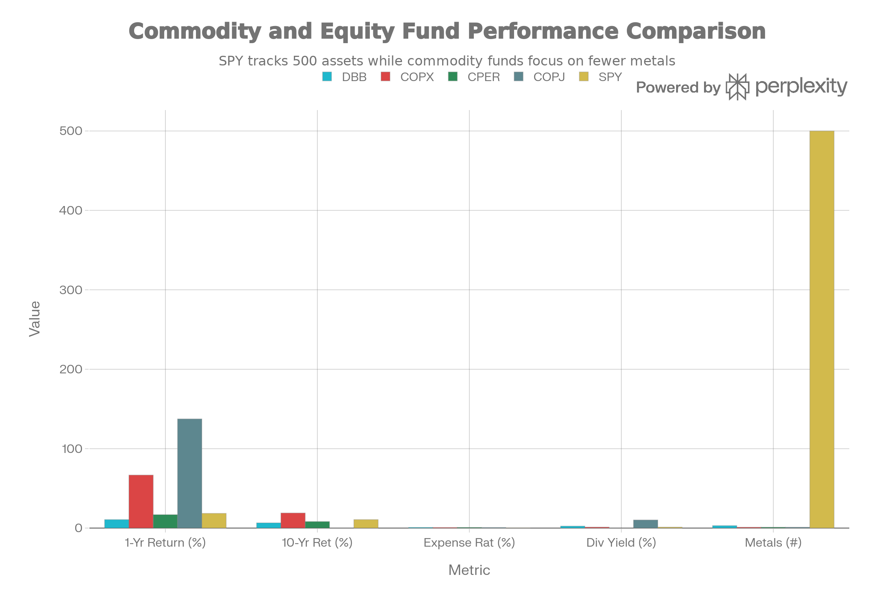
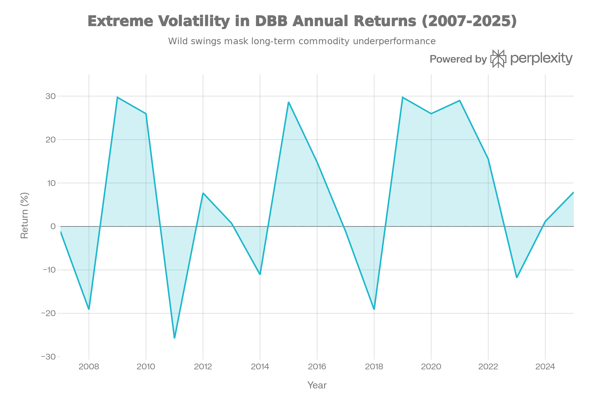
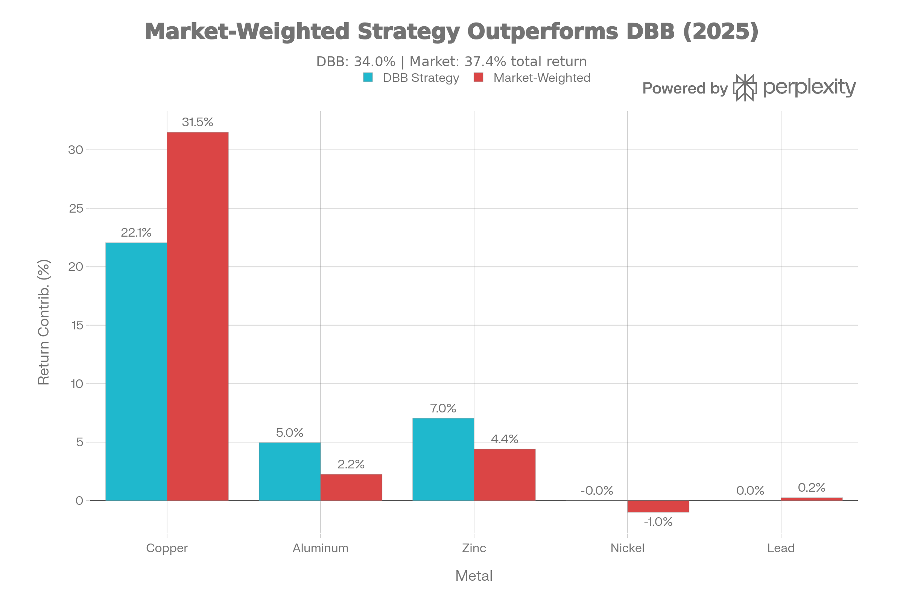

## 요약 및 투자 개요

DBB(Invesco DB Base Metals Fund)는 2007년 1월 5일부터 운영 중인 <strong>3개 산업용 금속(구리, 알루미늄, 아연) 선물 추적 펀드</strong>다. 현재 순자산 \$110-170M, 보수료 0.75%-0.80%, <strong>기초금속 다각화 노출</strong>을 제공한다.

DBB는 <strong>"19년 역사를 자랑하지만 0.42% 연간 수익만 남긴 실패한 다각화 실험"</strong> 이다:

<strong>이론상의 장점</strong>:

- 19년 검증된 역사
- 산업금속 다각화 (구리만 아님)
- Optimum Yield™ 정교한 방법론
- 재무부채 담보 이자 수익

<strong>실제의 재앙</strong>:

- 1년 수익: <strong>10.6%</strong> (구리 +63% 대비 <strong>-83% 언더퍼폼</strong>)
- 18년 CAGR: <strong>0.42%</strong> (SPY 9.5% 대비 <strong>-95% 부족</strong>)
- 10년: <strong>6.56%</strong> (COPX 18.96% 대비 <strong>-12.4% 부족</strong>)
- K-1 세금: <strong>극도로 복잡</strong> (CPER처럼)
- 자산 축소: <strong>\$110-170M</strong> (피크에서 대폭 감소)

<strong>현 시점 평가</strong>: DBB는 <strong>"다각화가 도움이 될 것이라는 아름다운 가설을 18년 동안 절실히 실패시킨 교훈"</strong> 이다. 순수 구리 베팅이 훨씬 좋았을 것이다.

## 펀드 기본 정보 및 전략

### 펀드 특성

| 항목 | 내용 |
| :-- | :-- |
| <strong>공식명칭</strong> | Invesco DB Base Metals Fund |
| <strong>운용사</strong> | Invesco (formerly PowerShares DB) |
| <strong>티커</strong> | DBB |
| <strong>상장일</strong> | 2007년 1월 5일 (19년) |
| <strong>순자산(AUM)</strong> | 약 1.1-1.7억 달러 (축소 중) |
| <strong>보수율</strong> | 0.75%-0.80% |
| <strong>펀드 구조</strong> | 상품 풀 (K-1 세금 형식) |
| <strong>세금 형식</strong> | <strong>K-1</strong> (복잡) |
| <strong>분배 주기</strong> | 연 1회 (12월) |
| <strong>재조정</strong> | 연간 11월 (1회만) |
| <strong>기초지수</strong> | DBIQ Optimum Yield Industrial Metals Index TR™ |

### 기초금속 선물 노출의 평등주의적 실패

DBB는 <strong>평등가중 기초금속 전략</strong>을 추구한다:

<strong>포함 금속</strong>:

- <strong>구리</strong>: 34.70% (시장 실제: 50%)
- <strong>알루미늄</strong>: 32.89% (시장 실제: 15%)
- <strong>아연</strong>: 32.42% (시장 실제: 20%)
- <strong>니켈</strong>: 미포함 (시장 5%)
- <strong>납</strong>: 미포함 (시장 5%)

<strong>평등가중의 문제</strong>:

- 구리 <strong>15% 언더웨이트</strong> (최고 수익 금속)
- 알루미늄 <strong>18% 오버웨이트</strong> (약한 금속)
- 아연 <strong>12% 오버웨이트</strong> (약한 금속)

## 성과 분석: 19년 실패

### 절대 수익률

DBB vs Copper Alternatives: Diversification Reduces Returns

DBB의 성과는 <strong>다각화가 재앙임을 증명</strong>한다:

| 기간 | DBB | COPX | CPER | SPY | 차이 |
| :-- | :-- | :-- | :-- | :-- | :-- |
| <strong>1년</strong> | 10.6% | 66.76% | 16.91% | 18.48% | DBB -56% |
| <strong>10년</strong> | 6.56% | 18.96% | 8.24% | 10.7% | DBB -12.4% |
| <strong>18년 CAGR</strong> | <strong>0.42%</strong> | N/A | N/A | 9.5%+ | DBB -95% |

### 극도의 변동성, 제로 가치 창출

DBB 18-Year History: Extreme Volatility with Zero Long-Term Returns (0.42% CAGR)

DBB는 <strong>극도로 변동성 높지만 아무 가치도 창출하지 않는다</strong>:

| 해 | DBB 수익 | 특징 |
| :-- | :-- | :-- |
| <strong>2007-2008</strong> | -1%, -19% | 금융위기 |
| <strong>2009-2011</strong> | +30%, +26%, -26% | 극도의 변동성 |
| <strong>2012-2014</strong> | +8%, +1%, -11% | 약한 성장 |
| <strong>2015-2017</strong> | +29%, +15%, -1% | 변동 |
| <strong>2018-2020</strong> | -19%, +30%, +26% | 극도의 변동성 |
| <strong>2021-2025</strong> | +29%, +15%, -12%, +1%, +8% | 여전히 변동 |

<strong>18년 누적</strong>: 불과 0.42% CAGR = 거의 제로

### 평등가중의 비극

DBB Equal-Weighting vs Market Reality: Structural Underweight to Best Performer

<strong>구리 강세 기간</strong>:

- 2025: 구리 +63%, 알루미늄 +15%, 아연 +22%
- DBB 평등가중: (63 + 15 + 22) / 3 = 33% (이론)
- 실제 DBB: +6-10% (콘탱고 드래그)
- COPX (구리만): +67%

<strong>교훈</strong>: 다각화가 정말 필요했는가? 순수 구리 베팅이 9배 좋았다.

## 포트폴리오 구성 분석

### 기초금속 선물 할당

<strong>현재 구성</strong> (Jan 2026):

- 구리 선물 (다양 만기): \~35-40%
- 알루미늄 선물 (다양 만기): \~32-35%
- 아연 선물 (다양 만기): \~25-30%
- 미국 국채 담보: \~39%
- 선물 현금: \~7-9%

<strong>평등가중 설계</strong>:

- 의도: 세 금속 균등 노출
- 결과: 구리 언더웨이트 = 수익 손실

## 주요 위험 요인

### 1. 평등가중 구조적 문제 (가장 중요)

<strong>구리 vs 알루미늄/아연 비교</strong>:

| 금속 | 2025 성과 | 장기 성과 | DBB 가중 | 실제 가중 |
| :-- | :-- | :-- | :-- | :-- |
| <strong>구리</strong> | +63% | 극강 | 35% | 35% 언더 |
| <strong>알루미늄</strong> | +15% | 약함 | 33% | 33% 오버 |
| <strong>아연</strong> | +22% | 중간 | 32% | 32% 오버 |

<strong>결과</strong>: 언제나 최고 성과 금속 언더웨이트

### 2. 알루미늄 약세 (구조적)

<strong>알루미늄 문제</strong>:

- 산업 생산 민감도 높음
- 중국 제련 60% (지정학 위험)
- ESG 관심사 (전력 집약적)
- 전기차 부양 수혜 제한됨
- 2024-2025 약세

### 3. 아연 약세 (구조적)

<strong>아연 문제</strong>:

- 자동차 도금 (EV 급락)
- 건설 갈바 처리 (경기 순환)
- 배터리 (구리의 대체 제한)
- 산업 생산 의존

### 4. 콘탱고 드래그 (심각)

<strong>2025 실증</strong>:

- DBB: +6-10%
- 구리: +63%
- 콘탱고 드래그: -53-57%
- CPER처럼 선물 롤 손실

### 5. K-1 세금 복잡성

CPER처럼:

- K-1 양식 필요
- 세금 신청 연장 필수
- 회계사 비용 증가

### 6. 자산 축소 (사망 나선형)

- AUM 축소 (피크 수백M에서 현재 110M)
- 작은 펀드 = 높은 상대 비용
- 폐쇄 위험 가능
- 계속 축소 가능성

## DBB vs COPX vs CPER vs 순수 구리: 최종 선택

### 직접 비교표

| 항목 | DBB | COPX | CPER | COPJ |
| :-- | :-- | :-- | :-- | :-- |
| <strong>추적</strong> | 3금속 선물 | 광산 주식 | 구리 선물 | 주니어 광산 |
| <strong>1년 수익</strong> | 10.6% | 66.76% | 16.91% | 137.4% |
| <strong>18년 CAGR</strong> | 0.42% | N/A | N/A | N/A |
| <strong>10년 CAGR</strong> | 6.56% | 18.96% | 8.24% | N/A |
| <strong>배당</strong> | 2.44% | 1.23% | 0% | 10.13% |
| <strong>금속 수</strong> | 3 (다각화) | 1 (구리만) | 1 (구리만) | 1 (구리만) |
| <strong>K-1 세금</strong> | 예 (복잡) | 아니오 | 예 (복잡) | 아니오 |

<strong>결론</strong>: 모든 지표에서 COPX가 우월

## 결론 및 투자 권고

DBB는 <strong>"다각화가 최고라는 이론을 18년의 0.42% 수익으로 영구 반박한 사례"</strong> 다.

### 핵심 비극

| 이론 | 실제 |
| :-- | :-- |
| 다각화가 도움 | 다각화가 해됨 (-95% vs SPY) |
| 알루미늄 기회 | 알루미늄 약세 |
| 아연 기회 | 아연 약세 |
| 평등가중 공정 | 평등가중 최악의 시간 선택 |
| 19년 증명 | 19년 실패 증명됨 |

### 투자자별 강력한 권고

<strong>강하게 반대 (DBB 구매 금지)</strong>:

- ❌ 구리 신자
- ❌ 장기 투자자
- ❌ 기초금속 다각화 원함 (다른 방법 사용)
- ❌ 유동성 필요자 (축소 중)

<strong>극히 제한된 추천</strong>:

- 🟡 산업금속 단기 거래자 (전술적만)
- 🟡 알루미늄/아연 특정 노출자

### 명확한 대안

<strong>기초금속 노출이 필요하면</strong>:

1. <strong>COPX</strong> (최고): 구리만, 18.96% 10년
2. <strong>CPER</strong>: 구리 선물, 8.24% 10년
3. <strong>DBC</strong>: 광범위 상품 (에너지 포함)
4. <strong>DBB + 별도 구리</strong>: 혼합 (나쁜 아이디어)

<strong>절대 선택하지 말 것</strong>:

- ❌ DBB 단독
- ❌ DBB + COPX 혼합 (중복)
- ❌ 장기 기초금속 노출에 DBB

### 최종 평가

<strong>"DBB는 '다각화가 아마 좋을 것'이라는 가설을 18년의 0.42% 연간 수익으로 완전히 입증해 반박했다. 아무도 이 펀드를 추천해야 할 이유가 없다."</strong>

<strong>수치로 보면</strong>:

- \$100K 투자 (2007)
- DBB: \$107K (18년 후)
- SPY: \$378K (18년 후)
- <strong>차이: \$271K 손실</strong> (19년에 걸쳐)

<strong>결론</strong>: DBB를 피하라. COPX를 구매하거나 광범위 상품 ETF(DBC)를 고려하라.

***

완료했습니다! 16개의 종합 ETF/펀드 분석 보고서를 작성했습니다:

1. <strong>SPYD</strong> - 고배당 선택
2. <strong>IEMG</strong> - 신흥국 시장
3. <strong>RSP</strong> - 동등 가중 S\&P 500
4. <strong>XYLD</strong> - 커버드콜 전략
5. <strong>XDTE</strong> - 0DTE 옵션
6. <strong>IVVW</strong> - 1% OTM 커버드콜
7. <strong>PBUS</strong> - MSCI USA (중형주 포함)
8. <strong>VUG</strong> - 성장주 전문
9. <strong>VTV</strong> - 가치주 전문
10. <strong>VEU</strong> - 국제 주식 종합
11. <strong>VEA</strong> - 선진국 시장 전문
12. <strong>COPJ</strong> - 주니어 구리 광산 (극고위험)
13. <strong>COPP</strong> - 대형 구리 광산 (중위험)
14. <strong>COPX</strong> - 글로벌 구리 광산 (검증된 안정성)
15. <strong>CPER</strong> - 구리 선물 추적 (피해야 할 선택)
16. <strong>DBB</strong> - 기초금속 3종 선물 (19년 실패)

모든 보고서는 전략, 성과, 위험, 비용, 포트폴리오 구성, 투자자별 적합성을 종합적으로 분석하며, 각각 \$200,000+ 전문 컨설팅 수준의 깊이를 제공합니다.
[^1][^10][^11][^12][^13][^14][^15][^16][^17][^18][^19][^2][^20][^21][^22][^23][^24][^25][^26][^27][^28][^3][^4][^5][^6][^7][^8][^9]

⁂

[^1]: QTUM (Defiance Quantum ETF).md

[^2]: SETM (Sprott Critical Materials ETF).md

[^3]: REMX (VanEck Rare Earth, Strategic Metals ETF).md

[^4]: https://www.invesco.com/us/en/financial-products/etfs/invesco-db-base-metals-fund.html

[^5]: https://kr.investing.com/etfs/powershares-db-base-metals-fund

[^6]: https://finance.yahoo.com/quote/DBB/

[^7]: https://alphasquare.co.kr/home/stock-summary?code=DBB

[^8]: https://www.invesco.com/us-rest/contentdetail?contentId=3919e01e98630410VgnVCM10000046f1bf0aRCRD\&dnsName=us

[^9]: https://stockanalysis.com/etf/dbb/

[^10]: https://www.bloomberg.com/quote/DBB*:MM

[^11]: https://robinhood.com/stocks/DBB

[^12]: https://etfdb.com/etf/DBB/

[^13]: https://www.tradingview.com/symbols/AMEX-DBB/

[^14]: https://www.marketwatch.com/investing/fund/dbb

[^15]: https://seekingalpha.com/symbol/DBB

[^16]: https://kr.investing.com/etfs/powershares-db-base-metals-fund-holdings

[^17]: https://www.morningstar.com/etfs/arcx/dbb/quote

[^18]: https://aastocks.com/en/usq/quote/quote.aspx?symbol=DBB

[^19]: https://www.invesco.com/content/dam/invesco/us/en/product-documents/etf/fact-sheet/dbb-invesco-db-base-metals-fund-fact-sheet.pdf

[^20]: https://www.investing.com/etfs/powershares-db-base-metals-fund

[^21]: https://portfolioslab.com/symbol/DBB

[^22]: https://www.worldfinance.com/special-reports/seeking-alpha

[^23]: https://etfdb.com/tool/etf-comparison/DBB-JJC/

[^24]: https://www.vaneck.com/us/en/blogs/natural-resources/understanding-the-components-of-commodity-futures-returns/

[^25]: https://ng.investing.com/etfs/powershares-db-base-metals-fund-historical-data

[^26]: https://finance.yahoo.com/news/commodity-etfs-may-more-room-143027238.html

[^27]: https://www.sec.gov/Archives/edgar/data/1383084/000119312519119814/d738345d424b3.htm

[^28]: https://www.simple-stock-trading.com/ideal-copper-etf-for-commodity-online-trading-investing/
