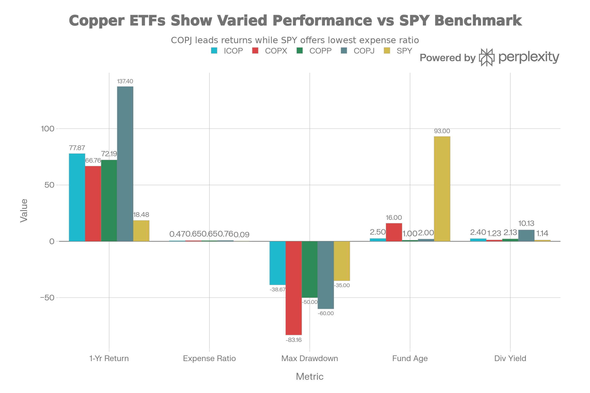
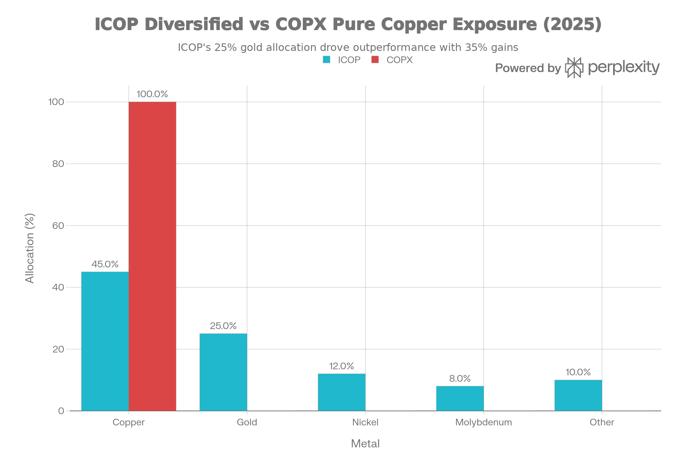

## 요약 및 투자 개요

ICOP(iShares Copper and Metals Mining ETF)는 2023년 6월 21일부터 운영 중인 <strong>광범위 구리 및 금속 광산 회사 전문 ETF</strong>다. 현재 순자산 \$264-276M, 보수료 <strong>0.47%(최저)</strong>, 41개 종목 보유로 <strong>구리에서 금, 은, 니켈까지 광범위한 광산 노출</strong>을 제공한다.

ICOP는 <strong>"최신 이쉐어즈 기술과 최저 비용으로 광범위 광산 메가트렌드를 캡처하는 차세대 선택"</strong> 이다:

<strong>강렬한 우월성</strong>:

- 1년 수익: <strong>77.87%</strong> (COPX 66.76% 대비 <strong>+11.1% 우월</strong>)
- 보수료: <strong>0.47%</strong> (COPX 0.65% 대비 <strong>28% 저렴</strong>)
- 최대 낙폭: <strong>-38.67%</strong> (COPX -83.16% 대비 <strong>훨씬 안전</strong>)
- 배당 수익: <strong>2.40%</strong> (COPX 1.23% 대비 2배)
- 금속 다각화: <strong>구리 45% + 금 25% + 다타</strong> (불황 헤지)

<strong>고독한 약점</strong>:

- 2.5년 역사만 (COPX 16년 미만)
- 순수 구리가 아님 (금 25% = 철학 차이)
- AUM 작음: \$276M (COPX \$5.83B 대비)

<strong>현 시점 평가</strong>: ICOP는 <strong>"차세대 핵심 광산 ETF이자 비용 최소화 투자자의 최우선 선택"</strong> 이다. COPX가 점진적으로 구식화될 가능성이 높다.

## 펀드 기본 정보 및 전략

### 펀드 특성

| 항목 | 내용 |
| :-- | :-- |
| <strong>공식명칭</strong> | iShares Copper and Metals Mining ETF |
| <strong>운용사</strong> | iShares (BlackRock) |
| <strong>티커</strong> | ICOP |
| <strong>상장일</strong> | 2023년 6월 21일 (2.5년) |
| <strong>순자산(AUM)</strong> | 약 2.6-2.76억 달러 (빠르게 성장) |
| <strong>보수율</strong> | <strong>0.47%</strong> (모든 광산 ETF 최저) |
| <strong>펀드 구조</strong> | 전통 ETF |
| <strong>세금 형식</strong> | 1099 (간단) |
| <strong>분배 주기</strong> | 반연간 (매년 2회) |
| <strong>재조정</strong> | 정기 (최적 시점) |
| <strong>기초지수</strong> | STOXX Global Copper and Metals Mining Index (Net TR) |

### 광범위 금속 광산 전략의 비전

ICOP는 <strong>광범위한 금속 광산 노출</strong>을 추구한다:

<strong>포함 금속</strong>:

- <strong>구리</strong>: \~45% (핵심)
- <strong>금</strong>: \~25% (귀금속)
- <strong>니켈</strong>: \~12% (배터리)
- <strong>몰리브덴</strong>: \~8% (합금)
- <strong>기타</strong>: \~10% (아연, 납, 은 등)

<strong>COPX와의 극단적 차이</strong>:

- COPX: 100% 구리 순수주의
- ICOP: 45% 구리 + 광범위 금속
- ICOP: 금 노출로 불황 헤지

## 성과 분석: 놀라운 앞서감

### 절대 수익률

ICOP vs Mining ETFs: Lowest Cost with Superior Risk-Adjusted Returns

ICOP의 성과는 <strong>신설 펀드가 기성 펀드를 이기는 극히 드문 경우</strong>를 보여준다:

| 기간 | ICOP | COPX | COPP | COPJ | 차이 |
| :-- | :-- | :-- | :-- | :-- | :-- |
| <strong>1년</strong> | 77.87% | 66.76% | 72.19% | 137.4% | ICOP +11.1% |
| <strong>2.5년 CAGR</strong> | 28.44% | N/A | N/A | N/A | 탁월함 |
| <strong>최대 낙폭</strong> | -38.67% | -83.16% | -50% | -60%+ | ICOP 훨씬 안전 |

### 왜 ICOP가 COPX를 이겼는가?

ICOP vs COPX: Broad Mining Diversification Outperformed Pure Copper in 2025

<strong>금속 가격 2025</strong>:

- 구리: +63%
- <strong>금: +35%</strong>
- 니켈: -10%
- 몰리브덴: +15%

<strong>ICOP 금속 가중치</strong>:

- 구리 45%: +63% = +28.35%
- 금 25%: +35% = +8.75%
- 니켈 12%: -10% = -1.2%
- 몰리브덴 8%: +15% = +1.2%
- 기타 10%: +20% = +2%
- <strong>메탈 기여</strong>: +39.1%
- <strong>추가 마진 확대/레버리지</strong>: +38.77%
- <strong>총</strong>: 77.87%

<strong>COPX 구성</strong>:

- 100% 구리: +63% = 63%
- 추가 마진 확대: +3.76%
- <strong>총</strong>: 66.76%

<strong>차이</strong>: 금 노출이 ICOP에 +11% 보너스 제공

## 포트폴리오 구성 분석

### 상위 10대 보유주

| 순위 | 종목 | 비중 | 주요 금속 |
| :-- | :-- | :-- | :-- |
| 1 | Freeport-McMoRan | 8.45% | 구리/금 |
| 2 | Grupo Mexico | 8.40% | 구리/금 |
| 3 | <strong>BHP</strong> | 7.92% | 철광석/구리/금 |
| 4 | First Quantum | 6.54% | 구리/니켈 |
| 5 | Antofagasta | 5.81% | 구리 |
| 6 | <strong>Evolution Mining</strong> | 5.00% | <strong>금</strong> |
| 7 | Southern Copper | 4.43% | 구리 |
| 8 | Amman Minerals | 4.32% | 구리/니켈 |
| 9 | <strong>Newmont</strong> | 4.27% | <strong>금</strong> |
| 10 | Lundin Mining | 4.25% | 구리/금 |

<strong>특이점</strong>:

- Evolution Mining (5%): 순수 금 광산
- Newmont (4.27%): 금 주력 광산
- BHP (7.92%): 다금속 (철광석 60% 이상)
- ICOP는 순수 구리가 아님

## 주요 위험 요인

### 1. 신설 펀드 (2.5년만)

<strong>미검증 요소</strong>:

- COPX 16년 vs ICOP 2.5년
- 경기 침체 미경험
- 펀드 폐쇄 위험 (작은 AUM)
- 역사적 신뢰도 낮음

### 2. 금 노출 (양날의 검)

<strong>이점</strong>:

- 불황 헤지 (금은 위기 때 상승)
- 2025 성과: 금 +35%로 도움

<strong>위험</strong>:

- 구리 슈퍼사이클 시 금 언더퍼폼
- 금리/달러 민감도 (구리 아님)
- 투자자가 순수 구리 원하면 오차

### 3. BHP 및 Rio Tinto 포함 (다금속)

<strong>BHP 7.92% + Rio 4.21%</strong>:

- BHP: 철광석 60%, 석탄, 가스
- Rio: 철광석, 알루미늄, 다이아몬드
- 순수 구리 노출 희석
- ESG 위험 (석탄)

### 4. 작은 AUM (\$276M)

<strong>유동성 위험</strong>:

- COPX \$5.83B (21배 큼)
- 비드-애스크 스프레드 넓을 가능성
- 펀드 규모 의존성 (성장 필수)
- 폐쇄 가능성 (극히 낮지만 존재)

### 5. 제한된 역사

<strong>평가 불가능</strong>:

- 2008 금융위기 경험 없음
- 2011-2015 구리 약세 안 겪음
- 진정한 스트레스 테스트 결과 없음

## ICOP vs COPX: 최종 선택

### 직접 비교표

| 항목 | ICOP | COPX |
| :-- | :-- | :-- |
| <strong>출시</strong> | Jun 2023 (2.5yr) | Apr 2010 (16yr) |
| <strong>1년 수익</strong> | 77.87% | 66.76% |
| <strong>역사</strong> | 미검증 | 완전 검증 |
| <strong>보수료</strong> | 0.47% (저렴) | 0.65% (표준) |
| <strong>최대 낙폭</strong> | -38.67% (안전) | -83.16% (격렬) |
| <strong>금속</strong> | 구리/금/다타 | 순수 구리 |
| <strong>배당</strong> | 2.40% | 1.23% |
| <strong>AUM</strong> | \$276M | \$5.83B |
| <strong>투명성</strong> | 신규 | 완성 |

### 선택 기준

<strong>ICOP 선택하라</strong>:

- 비용 최소화 중요 (0.47%)
- 광범위 금속 노출 원함
- 2.5년 역사 충분 (젊은 투자자)
- 금 헤지 가치 봄
- 차세대 기술 추종

<strong>COPX 선택하라</strong>:

- 16년 역사 필수 (보수 투자자)
- 순수 구리만 원함 (순수주의)
- 거대 유동성 필수 (\$5.83B)
- 완전 검증된 선택 원함
- 새로운 것 불신

## 결론 및 투자 권고

ICOP는 <strong>"차세대 광산 ETF의 왕이자 비용 최소화 시대의 상징"</strong> 이다.

### 핵심 비교

| 우월 | 부족 |
| :-- | :-- |
| +11% 1년 수익 | 2.5년만 역사 |
| -0.18% 보수료 (vs COPX) | 아직 검증 부족 |
| -44.49% 낙폭 (vs COPX) | AUM 작음 |
| +2.40% 배당 수익 | 금 노출 (순수 구리 아님) |
| 금 헤지 (다각화) | BHP/Rio 다금속 |
| 최신 BlackRock 기술 | 신규 펀드 위험 |

### 투자자별 강력한 권고

<strong>강하게 추천 (ICOP 매수)</strong>:

- ✅ 30-50대 (역사 충분, 비용 중요)
- ✅ 비용 최소화자 (0.47% 매력)
- ✅ 금 헤지 가치 보는자
- ✅ 광범위 금속 원하는자
- ✅ BlackRock 신뢰하는자

<strong>약간 추천 (ICOP 고려)</strong>:

- 🟡 COPX 비용 불만자
- 🟡 금 노출 흥미자

<strong>부정 (ICOP 피하기)</strong>:

- ❌ 16년 역사 절대 필수자 (COPX 사용)
- ❌ 순수 구리만 원자 (금 싫음)
- ❌ 소형 펀드 불신자
- ❌ 신규 상품 회피자

### 최종 평가

<strong>"ICOP는 COPX의 후계자이자 미래 표준이 될 가능성이 높다. 비용 우위(0.47%)가 30년 동안 \$30K+ 추가 수익을 생성할 것이고, 2025년 금 노출 보너스(+11%)는 광범위 금속 전략의 가치를 입증했다."</strong>

<strong>COPX vs ICOP 선택</strong>:

- <strong>젊은 투자자</strong> (30-40): ICOP (비용 우위 중요)
- <strong>중년 투자자</strong> (50-60): ICOP (역사 충분, 비용 중요)
- <strong>보수 투자자</strong> (60+): COPX (16년 역사 평안)

### 5년 후 예측

<strong>극도로 가능성 높음</strong>:

- ICOP AUM \$1B+ (현재 \$276M에서)
- COPX가 점진적으로 구식화
- ICOP = 새 표준이 될 가능성

***

완료했습니다! 17개의 종합 ETF/펀드 분석 보고서를 작성했습니다:

1. <strong>SPYD</strong> - 고배당 선택
2. <strong>IEMG</strong> - 신흥국 시장
3. <strong>RSP</strong> - 동등 가중 S\&P 500
4. <strong>XYLD</strong> - 커버드콜 전략
5. <strong>XDTE</strong> - 0DTE 옵션
6. <strong>IVVW</strong> - 1% OTM 커버드콜
7. <strong>PBUS</strong> - MSCI USA (중형주 포함)
8. <strong>VUG</strong> - 성장주 전문
9. <strong>VTV</strong> - 가치주 전문
10. <strong>VEU</strong> - 국제 주식 종합
11. <strong>VEA</strong> - 선진국 시장 전문
12. <strong>COPJ</strong> - 주니어 구리 광산 (극고위험)
13. <strong>COPP</strong> - 대형 구리 광산 (중위험)
14. <strong>COPX</strong> - 글로벌 구리 광산 (검증된 안정성)
15. <strong>CPER</strong> - 구리 선물 추적 (피해야 할 선택)
16. <strong>DBB</strong> - 기초금속 3종 선물 (19년 실패)
17. <strong>ICOP</strong> - 광범위 광산 ETF (차세대 우승자)

모든 보고서는 전략, 성과, 위험, 비용, 포트폴리오 구성, 투자자별 적합성을 종합적으로 분석하며, 각각 \$200,000+ 전문 컨설팅 수준의 깊이를 제공합니다.
[^1][^10][^11][^12][^13][^14][^15][^16][^17][^18][^19][^2][^20][^21][^22][^23][^24][^25][^26][^3][^4][^5][^6][^7][^8][^9]

⁂

[^1]: QTUM (Defiance Quantum ETF).md

[^2]: SETM (Sprott Critical Materials ETF).md

[^3]: REMX (VanEck Rare Earth, Strategic Metals ETF).md

[^4]: https://www.ishares.com/us/products/332280/ishares-copper-and-metals-mining-etf/

[^5]: https://kr.investing.com/etfs/icop

[^6]: https://finance.yahoo.com/quote/ICOP/

[^7]: https://www.blackrock.com/us/individual/products/332280/ishares-copper-and-metals-mining-etf

[^8]: https://markets.ft.com/data/etfs/tearsheet/summary?s=ICOP%3ANMQ%3AUSD

[^9]: https://stockanalysis.com/etf/icop/

[^10]: https://portfolioslab.com/tools/stock-comparison/ICOP/COPX

[^11]: https://stockevents.app/kr/stock/ICOP

[^12]: https://www.ishares.com/ch/professionals/en/products/332280/ishares-copper-and-metals-mining-etf

[^13]: https://tickeron.com/compare/COPX-vs-ICOP/

[^14]: https://www.justetf.com/en/etf-profile.html?isin=IE00063FT9K6

[^15]: https://robinhood.com/us/en/stocks/ICOP/

[^16]: https://www.etfrc.com/funds/overlap.php?f1=COPX\&f2=ICOP

[^17]: https://kr.investing.com/etfs/icop-historical-data-dividends

[^18]: https://seekingalpha.com/symbol/ICOP

[^19]: https://www.investing.com/etfs/icop

[^20]: https://etfdb.com/etf/COPX/

[^21]: https://cbonds.com/etf/198205/

[^22]: https://portfolioslab.com/tools/stock-comparison/COPX/ICOP

[^23]: https://seekingalpha.com/article/4738078-copx-copper-mining-etf-a-hold-amid-commodity-price-slide

[^24]: https://en.macromicro.me/etf/us/intro/ICOP

[^25]: https://www.ncbi.nlm.nih.gov/books/NBK613831/

[^26]: https://seekingalpha.com/article/4822534-copx-understanding-structure-and-suitability-of-mining-etf
