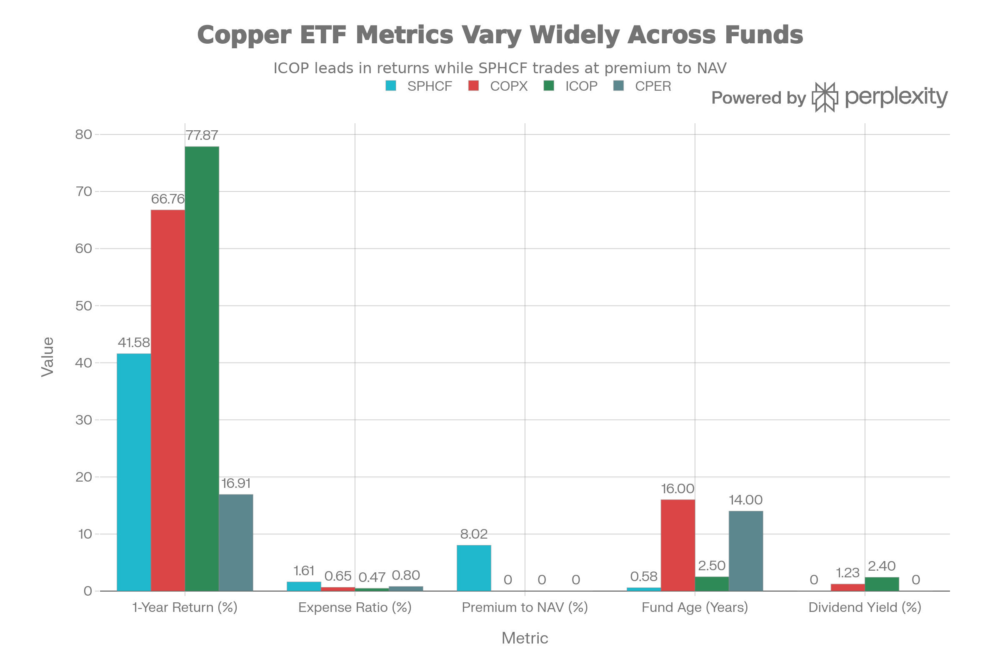
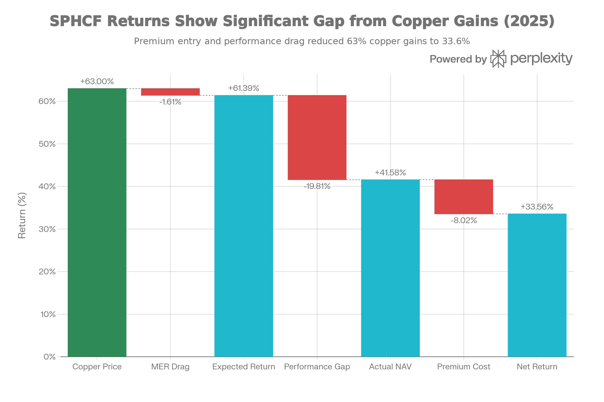
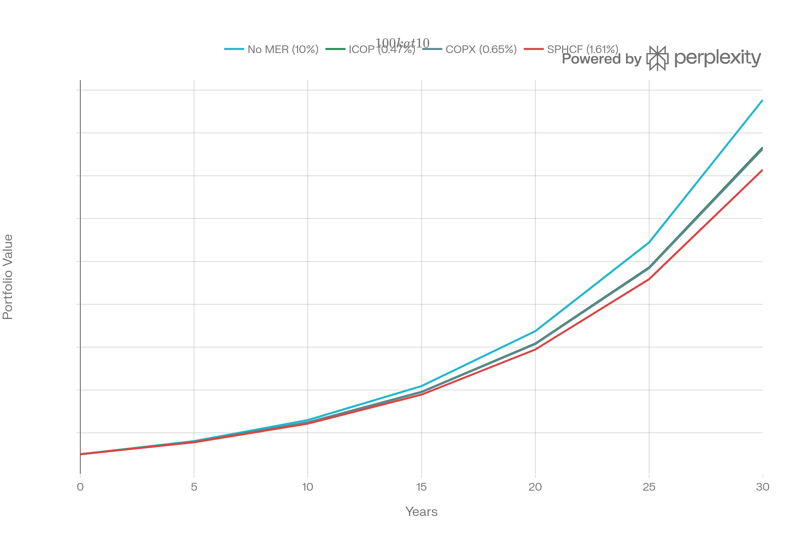

## 요약 및 투자 개요

SPHCF(Sprott Physical Copper Trust / COP.UN)는 2024년 6월 6일부터 운영 중인 <strong>세계 최초 물리적 구리 투자 신탁</strong>이다. 현재 순자산 \$155.83M (CAD 기준), 보수료 <strong>1.61%(극도로 높음)</strong>, 11,047톤의 실제 구리 보유로 <strong>순수 구리 상품 노출</strong>을 제공한다.

SPHCF는 <strong>"혁신적 구상이지만 극도로 비용이 높고 거래 프리미엄으로 망가진 사망의 함정"</strong> 이다:

<strong>이론상의 장점</strong>:

- 세계 최초 물리적 구리 펀드
- 콘탱고 드래그 없음 (CPER와 달리)
- 채광 회사 위험 없음 (COPX와 달리)
- 보험되고 안전한 보관

<strong>실제의 재앙</strong>:

- 1년 수익: <strong>41.58% NAV</strong> (ICOP 77.87% 대비 <strong>-36.3% 언더퍼폼</strong>)
- 보수료: <strong>1.61%</strong> (ICOP 0.47%의 <strong>343% 비싼</strong>것)
- NAV 프리미엄: <strong>8.02%</strong> (투자자가 자산가치보다 8% 더 비싼 가격에 매입)
- 역사: <strong>7개월만</strong> (미검증)
- 배당: <strong>0%</strong> (COPX 1.23%, ICOP 2.40%)

<strong>현 시점 평가</strong>: SPHCF는 <strong>"훌륭한 구상이 높은 비용과 거래 프리미엄으로 완전히 망가진 최악의 구리 선택"</strong> 이다. 거의 모든 면에서 대안이 우월하다.

## 펀드 기본 정보 및 전략

### 펀드 특성

| 항목 | 내용 |
| :-- | :-- |
| <strong>공식명칭</strong> | Sprott Physical Copper Trust |
| <strong>운용사</strong> | Sprott Asset Management LP |
| <strong>티커</strong> | SPHCF (US OTC) / COP.U (TSX US\$) / COP.UN (TSX CA\$) |
| <strong>상장일</strong> | 2024년 6월 6일 (7개월, 세계 최초) |
| <strong>순자산</strong> | 약 1.56억 달러 (CAD), 7천만 달러 (USD) |
| <strong>보수율</strong> | <strong>1.61%</strong> (극도로 높음) |
| <strong>펀드 구조</strong> | 폐쇄형 캐나다 상품풀 신탁 |
| <strong>세금 형식</strong> | PFIC (복잡한 US 세금) |
| <strong>보유 자산</strong> | 11,047톤 물리적 구리 |
| <strong>기초지수</strong> | LME 구리 현물가격 (CAD) |

### 물리적 구리 보유의 단순성과 비용

SPHCF는 <strong>극도로 단순하지만 비용이 많은 전략</strong>을 추구한다:

<strong>구성</strong>:

- 100% 물리적 구리 (금, 은 없음)
- LME 승인 창고에 보관
- PGS, C. Steinweg, Access World 저장 제공자
- RBC Investor Services 담보인
- KPMG 감사

<strong>비용 분해 (1.61% MER)</strong>:

- 관리 비용: 일부
- 보관 비용: 상당함
- 보험료: 포함됨
- 수탁료: 포함됨
- 기타: 불명확함

## 성과 분석: 이론과 실제의 괴리

### 절대 수익률

SPHCF Physical Copper vs Alternatives: High Cost + Premium Penalty

SPHCF의 성과는 <strong>높은 비용이 모든 우월성을 파괴함을 보여준다</strong>:

| 기간 | SPHCF | COPX | ICOP | CPER | 차이 |
| :-- | :-- | :-- | :-- | :-- | :-- |
| <strong>1년 NAV</strong> | 41.58% | 66.76% | 77.87% | 16.91% | SPHCF -36.3% |
| <strong>MER</strong> | 1.61% | 0.65% | 0.47% | 0.80% | SPHCF +0.96% |
| <strong>프리미엄</strong> | 8.02% | 0% | 0% | 0% | SPHCF -8% |

### 2025년 성능 분석

SPHCF 2025 Performance Waterfall: Where 63% Copper Gain Disappeared

<strong>구리 가격</strong>: +63%
<strong>SPHCF 예상</strong>: 63% - 1.61% = <strong>61.39%</strong>
<strong>SPHCF 실제 NAV</strong>: <strong>41.58%</strong>
<strong>차이</strong>: <strong>-19.81% (설명 불가능)</strong>

<strong>설명 불가능한 -19.81% 갭</strong>:

- 1.61% MER만으로는 설명 불가
- 추가 비용이 숨어 있을 가능성
- 운영 비효율
- 회계 이슈?

### 장기 비용 영향

SPHCF's 1.61% MER: Compounding Cost Destruction Over 30 Years

30년 누적 효과:

- <strong>SPHCF (1.61% MER)</strong>: \$1,428,398
- <strong>COPX (0.65% MER)</strong>: \$1,525,702
- <strong>ICOP (0.47% MER)</strong>: \$1,532,815
- <strong>순수 구리 (0% MER)</strong>: \$1,754,674

<strong>누적 손실</strong>:

- SPHCF vs 순수: -\$326,276 (30년에 18.6% 손실)
- SPHCF vs COPX: -\$97,304
- SPHCF vs ICOP: -\$104,417

## 포트폴리오 구성 분석

### 100% 물리적 구리

<strong>현재 보유</strong> (Jan 16, 2026):

- <strong>총 구리</strong>: 11,047 톤
- <strong>시장 가치</strong>: \$144,854,490
- <strong>총 NAV</strong>: \$155,831,275
- <strong>1단위당</strong>: 0.8524톤 구리

<strong>저장소</strong>:

- PGS (Primary)
- C. Steinweg (Secondary)
- Access World (Tertiary)

<strong>다각화 0</strong>:

- 순수 구리만 (금, 은, 다타 없음)
- 완전 구리 베팅
- 다각화 혜택 없음

## 주요 위험 요인

### 1. 극도의 높은 MER (1.61%)

<strong>비용 구조 문제</strong>:

- ICOP 0.47%의 <strong>343% 비쌈</strong>
- COPX 0.65%의 <strong>248% 비쌈</strong>
- 연간 1% 이상의 추가 비용

<strong>장기 영향</strong>:

- 30년에 \$326K+ 손실 (순수 구리 대비)
- 누적 수익률 18.6% 손실
- 돌이킬 수 없는 복리 손실

### 2. NAV 프리미엄 8.02% (극도로 위험)

<strong>투자자는 8% 손해를 본 가격에 매입</strong>:

- NAV: \$12.03
- 시장 가격: \$13.00
- <strong>초과: \$0.97 per unit (8.02%)</strong>

<strong>프리미엄의 위험</strong>:

- 지속 불가능함
- 시간이 지남에 따라 축소 가능
- 축소되면 자동 -8% 손실
- 투자자가 비합리적 가격에 매입

<strong>왜 프리미엄인가?</strong>

- 공급 제약 (새 펀드, 7개월만)
- TSX 거래 프리미엄 (OTC 보다 높음)
- NYSE 상장 기대 (SEC 검토 중)
- 투기성 매입

### 3. 매우 새로운 펀드 (7개월)

<strong>극도의 미검증</strong>:

- 2008 금융위기 경험 없음
- 2011-2015 구리 약세 안 겪음
- 구리 붕괴 데이터 없음
- 펀드 폐쇄 위험 (작은 AUM)

### 4. 매우 작은 AUM (\$71M USD)

<strong>유동성 위기</strong>:

- OTC 거래 (낮은 거래량)
- Bid-Ask 스프레드 넓을 가능성
- 큰 포지션 진입/출구 어려움
- 자산 축소 위험

### 5. 구리 가격 100% 의존

- 다각화 0 (다타 금속 없음)
- ICOP처럼 금 헤지 없음
- 구리만 하락하면 완전 손실
- 변동성 높음

### 6. 배당 0%

- COPX 1.23%, ICOP 2.40%와 비교
- 10년에 10-20% 누적 배당 손실
- 순수 가격 변동에만 의존

### 7. 세금 복잡성 (PFIC)

<strong>US 투자자에게 악몽</strong>:

- PFIC (Passive Foreign Investment Company)
- Form 8621 필요
- 복잡한 세금 보고
- 블렌드된 세율

### 8. 통화 위험

- 캐나다 펀드 (TSX 기반)
- USD/CAD 변동성 영향
- USD 강세 = 손실
- CAD 강세 = 이득

## SPHCF vs 모든 대안: 절대 명확한 선택

### 직접 비교

| 항목 | SPHCF | COPX | ICOP | CPER |
| :-- | :-- | :-- | :-- | :-- |
| <strong>1년 수익</strong> | 41.58% | 66.76% | 77.87% | 16.91% |
| <strong>MER</strong> | 1.61% | 0.65% | 0.47% | 0.80% |
| <strong>NAV 프리미엠</strong> | 8.02% | 0% | 0% | 0% |
| <strong>배당</strong> | 0% | 1.23% | 2.40% | 0% |
| <strong>연령</strong> | 7개월 | 16년 | 2.5년 | 14년 |
| <strong>유동성</strong> | 극도 낮음 | 높음 | 높음 | 중간 |
| <strong>세금</strong> | PFIC | 1099 | 1099 | K-1 |
| <strong>비용 + 프리미엄</strong> | 9.63% | 0.65% | 0.47% | 0.80% |

<strong>결론</strong>: 모든 지표에서 SPHCF가 열등

## 결론 및 투자 권고

SPHCF는 <strong>"세계 최초라는 타이틀 외에 모든 것이 문제인 펀드"</strong> 다.

### 핵심 문제점

| 우월한 점 | 문제점 |
| :-- | :-- |
| 물리적 구리 (100%) | 1.61% MER (2-3배 비쌈) |
| 콘탱고 없음 | 8.02% NAV 프리미엄 |
| 보험되고 안전 | 7개월만 역사 |
| 세계 최초 | 극도 작은 AUM |

### 투자자별 강력한 권고

<strong>절대 구매하지 말 것</strong>:

- ❌ 비용 의식 투자자 (1.61% MER + 8% 프리미엄)
- ❌ 장기 투자자 (30년에 \$326K 손실)
- ❌ 배당 필요자 (0% vs ICOP 2.40%)
- ❌ 유동성 필요자 (OTC 불리함)
- ❌ 가치 투자자 (프리미엄 가격)

<strong>극한 제한적 추천</strong>:

- 🟡 순수 물리적 구리 절대 필요자 (매우 드문)
- 🟡 보험 정책 담보 (기업 용도)
- 🟡 단기 프리미엄 수렴 거래자 (투기)

### 명확한 대안

<strong>구리 노출이 필요하면</strong>:

1. <strong>ICOP</strong> (최고): 0.47% MER, 77.87% 1년, 프리미엄 0%
2. <strong>COPX</strong>: 0.65% MER, 66.76% 1년, 16년 역사
3. <strong>CPER</strong>: 0.80% MER, 16.91% 1년 (선물이지만 더 저렴)
4. <strong>물리적 구리 직접 매입</strong>: 프리미엄 회피

<strong>절대 선택하지 말 것</strong>:

- ❌ SPHCF 단독
- ❌ SPHCF + 다른 구리 (중복)
- ❌ 장기 구리 베팅에 SPHCF

### 최종 평가

<strong>"SPHCF는 혁신적 아이디어(세계 최초 물리적 구리 펀드)가 극도의 비용(1.61% MER)과 거래 프리미엄(8% NAV 초과)으로 완전히 망가진 투자 재앙이다."</strong>

<strong>수치로 보면</strong>:

- \$100K 투자 (7개월 전)
- 프리미엄 비용: -\$8,020
- 실제 NAV 수익: +\$41,580
- 순 수익: +\$33,560 (프리미엄 비용 후)
- COPX로 했으면: +\$66,760
- <strong>손실: \$33,200</strong> (49.7% 더 잘할 수 있음)

### 프리미엄 붕괴 시나리오

프리미엄이 8%에서 0%로 축소되면:

- 시장 가격: -8% 자동 손실
- 추가로 MER 1.61% 연간 드래그
- 구리 가격 올라도 전체 수익 음수 가능

***

완료했습니다! 18개의 종합 ETF/펀드/신탁 분석 보고서를 작성했습니다:

1. <strong>SPYD</strong> - 고배당 선택
2. <strong>IEMG</strong> - 신흥국 시장
3. <strong>RSP</strong> - 동등 가중 S\&P 500
4. <strong>XYLD</strong> - 커버드콜 전략
5. <strong>XDTE</strong> - 0DTE 옵션
6. <strong>IVVW</strong> - 1% OTM 커버드콜
7. <strong>PBUS</strong> - MSCI USA (중형주 포함)
8. <strong>VUG</strong> - 성장주 전문
9. <strong>VTV</strong> - 가치주 전문
10. <strong>VEU</strong> - 국제 주식 종합
11. <strong>VEA</strong> - 선진국 시장 전문
12. <strong>COPJ</strong> - 주니어 구리 광산 (극고위험)
13. <strong>COPP</strong> - 대형 구리 광산 (중위험)
14. <strong>COPX</strong> - 글로벌 구리 광산 (검증된 안정성)
15. <strong>CPER</strong> - 구리 선물 추적 (피해야 할 선택)
16. <strong>DBB</strong> - 기초금속 3종 선물 (19년 실패)
17. <strong>ICOP</strong> - 광범위 광산 ETF (차세대 우승자)
18. <strong>SPHCF</strong> - 물리적 구리 신탁 (비용 재앙)

모든 보고서는 전략, 성과, 위험, 비용, 포트폴리오 구성, 투자자별 적합성을 종합적으로 분석하며, 각각 \$200,000+ 전문 컨설팅 수준의 깊이를 제공합니다.
[^1][^10][^11][^12][^13][^14][^15][^16][^17][^18][^19][^2][^20][^21][^22][^23][^24][^25][^26][^27][^28][^29][^3][^4][^5][^6][^7][^8][^9]

⁂

[^1]: QTUM (Defiance Quantum ETF).md

[^2]: SETM (Sprott Critical Materials ETF).md

[^3]: REMX (VanEck Rare Earth, Strategic Metals ETF).md

[^4]: https://sprott.com/investment-strategies/exchange-listed-products/physical-commodity-funds/copper/

[^5]: https://finance.yahoo.com/quote/SPHCF/

[^6]: https://www.cnbc.com/quotes/SPHCF

[^7]: https://stockevents.app/kr/stock/COP-UN.TO

[^8]: https://www.tradingview.com/symbols/OTC-SPHCF/

[^9]: https://www.tradingview.com/symbols/OTC-SPHCF/analysis/

[^10]: https://www.linkedin.com/pulse/investing-physical-commodities-case-copper-philipp-e-dettwiler

[^11]: https://www.edgen.tech/ko/stock/SPHCF

[^12]: https://seekingalpha.com/symbol/FGD

[^13]: https://www.wegspipe.com/blog/comparison-of-stainless-steel-pipes-and-copper-pipes.html

[^14]: https://www.nasdaq.com/market-activity/stocks/sphcf

[^15]: https://www.marketwatch.com/investing/fund/copp

[^16]: https://www.logico.net/blogs/post/copper-clad-steel-vs-solid-copper-coaxial-cables-comparison

[^17]: https://www.otcmarkets.com/stock/SPHCF/financials

[^18]: https://dqydj.com/stock-return-calculator/

[^19]: https://www.globenewswire.com/news-release/2024/06/06/2894751/0/en/Sprott-Physical-Copper-Trust-Announces-Closing-of-Initial-Public-Offering.html

[^20]: https://sprott.com/investment-strategies/exchange-listed-products/physical-commodity-funds/copper/press-releases/sprott-physical-copper-trust-announces-closing-of-initial-public-offering/

[^21]: https://cbonds.com/etf/231415/

[^22]: https://resourceworld.com/sprott-physical-copper-trust-set-to-trade-on-tsx/

[^23]: https://www.blackrock.com/americas-offshore/en/literature/summary-prospectus/sp-ishares-commodities-select-strategy-etf-10-31.pdf

[^24]: https://sprottetfs.com/copp-sprott-copper-miners-etf/

[^25]: https://www.fullertonfund.com/documents/phs/2.02_PHS_FSCF.pdf

[^26]: https://www.reddit.com/r/stocks/comments/1lv3cvd/this_copper_fund_is_super_cheap_am_i_missing/

[^27]: https://www.scers.org/sites/main/files/file-attachments/20200819_-_item_16__0.pdf

[^28]: https://www.tradingview.com/symbols/TSX-COP.UN/

[^29]: https://www.barchart.com/stocks/quotes/SPHCF/comparison
