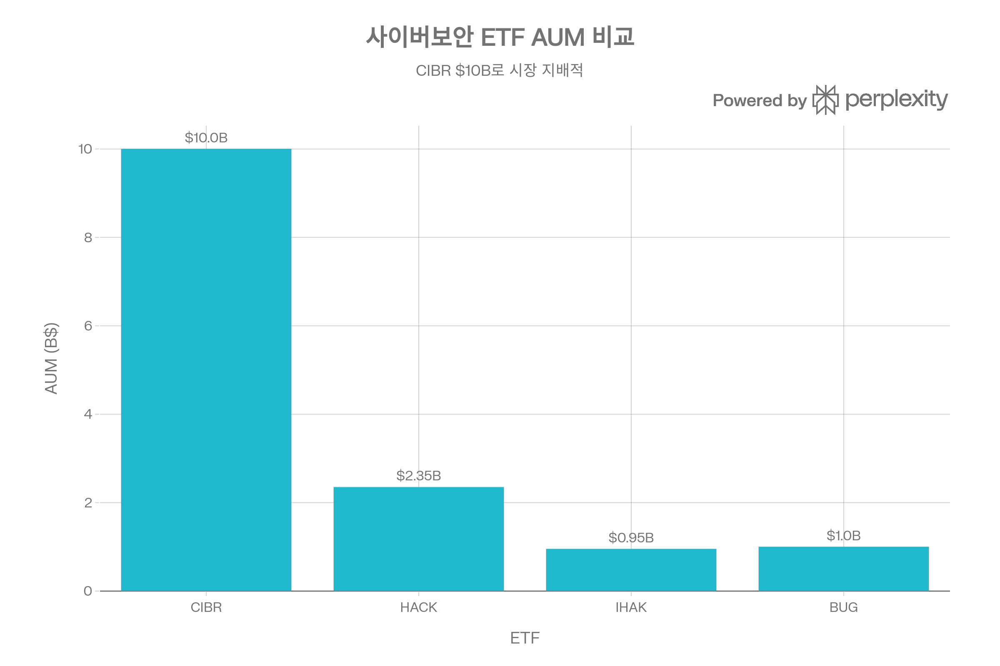
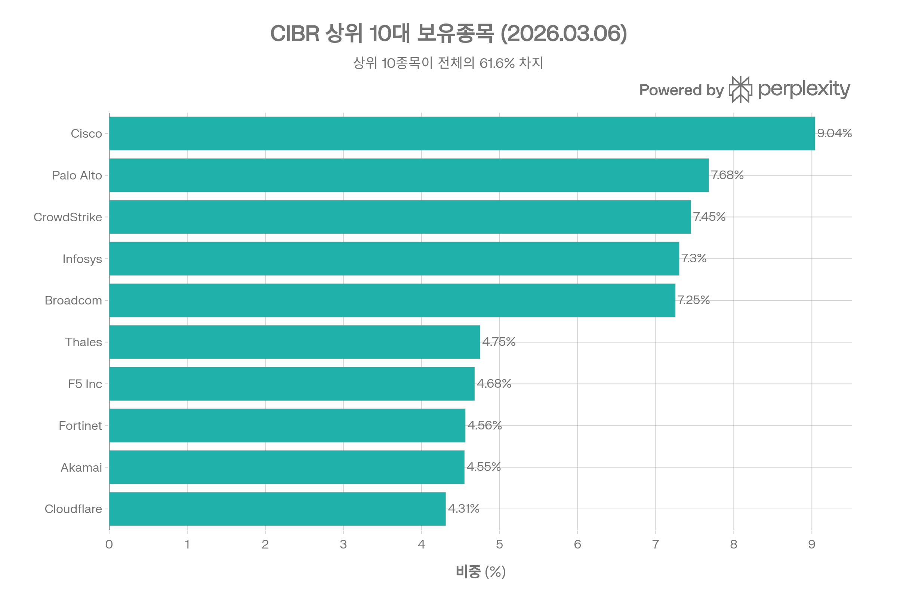
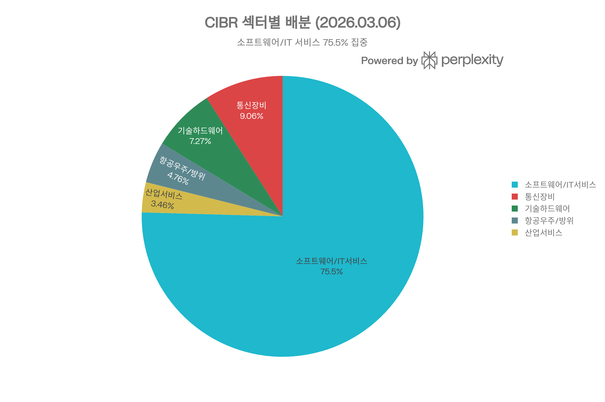
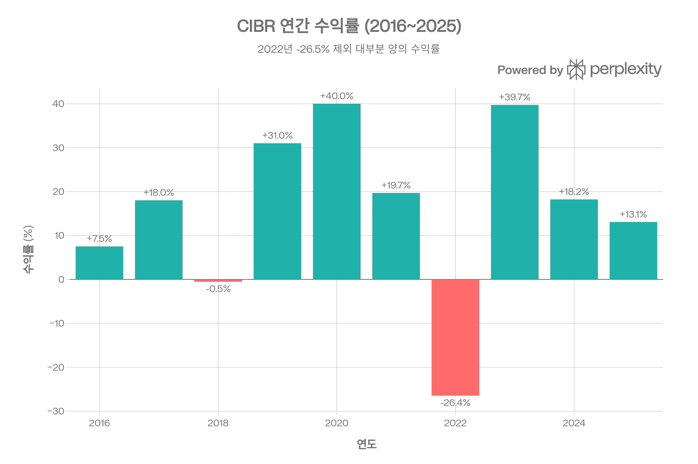

## 요약

## 개요
First Trust Nasdaq Cybersecurity ETF(CIBR)는 사이버보안 분야에 특화된 미국 최대 규모의 테마 ETF로, Nasdaq CTA Cybersecurity™ Index를 추종한다. 2015년 7월 설정 이후 약 10년 8개월간 운용되어 왔으며, AUM은 약 $100억으로 사이버보안 ETF 카테고리에서 압도적 1위를 차지한다. 설정 이후 연환산 수익률은 약 13.5%로, 사이버보안이라는 구조적 성장 테마에 대한 효율적 투자 수단으로 자리매김했다. 다만 기술주 섹터 특성상 변동성이 높아(표준편차 17.1%), 2022년에는 -26.5%의 손실을 기록한 바 있다.[1][2][3][4]

***
## ETF 분류

| 항목 | 내용 |
|------|------|
| **최종 폴더** | `ETF/Cybersecurity/CIBR` |
| **대분류** | 테마 |
| **하위 분류** | 사이버보안 |
| **핵심 전략** | Nasdaq CTA Cybersecurity Index 추종 |
| **운용 방식** | 패시브 |
| **레버리지·인버스 여부** | 아니오 |
| **옵션 인컴 전략 여부** | 아니오 |

CIBR은 명칭과 추종 지수에 `Nasdaq`이 포함되어 있지만, 실제 노출은 Nasdaq 대표지수가 아니라 **사이버보안 기업 테마**입니다. ETF 분류 기준상 레버리지, 자산군, 인컴, 대표지수, GICS 섹터에 해당하지 않으므로 실제 투자 노출을 기준으로 `Cybersecurity` 테마 폴더에 분류합니다.

***
## 1. 기본 정보
| 항목 | 내용 |
|------|------|
| **티커** | CIBR |
| **정식 명칭** | First Trust Nasdaq Cybersecurity ETF |
| **운용사** | First Trust Advisors L.P.[1] |
| **상장 거래소** | Nasdaq[1] |
| **설정일** | 2015년 7월 6일[1] |
| **운용 기간** | 약 10년 8개월 |
| **순자산 규모(AUM)** | $9,970,116,842 (~$99.7억, 2026.03.06 기준)[1] |
| **발행 주식수** | 151,000,002주[1] |
| **추종 지수** | Nasdaq CTA Cybersecurity™ Index[1] |
| **전략 유형** | 패시브 (인덱스 추종)[1] |
| **리밸런싱 주기** | 분기별 (Quarterly)[1] |
| **총 비용비율** | 0.58% (2026.02.02 기준)[1] |
### 추종 지수 개요
Nasdaq CTA Cybersecurity™ Index는 Consumer Technology Association(CTA)이 사이버보안 기업으로 분류한 종목들의 성과를 추적한다. 편입 요건은 시가총액 $5억 이상, 3개월 평균 일일 거래대금 $100만 이상, 유통주식 비율 20% 이상이다. 지수는 유통주식 시가총액 가중(Free Float Market Cap Weighted) 방식을 사용하되, 개별 종목 비중에 상한을 두며, 반기(3월·9월) 종목 평가 및 분기별 리밸런싱을 실시한다.[1]

***
## 2. 추종 성과 지표
### 벤치마크 대비 추적 성과 (2026.02.27 기준, 연환산)
| 기간 | CIBR NAV | 벤치마크 지수 | 추적 차이 |
|------|---------|-------------|----------|
| 1년 | -4.44% | -4.10% | -0.34%[1] |
| 3년 | 15.54% | 16.18% | -0.64%[1] |
| 5년 | 8.77% | 9.41% | -0.64%[1] |
| 10년 | 15.46% | 16.23% | -0.77%[1] |
| 설정 이후 | 11.98% | 12.72% | -0.74%[1] |

추적 차이(Tracking Difference)는 연간 약 **-0.64%~-0.77%**로, 비용비율(0.58%)을 고려하면 비용 외 추가 추적 오차가 0.06~0.19%p 수준으로 양호하다. US News는 CIBR의 추적오차를 "Good"으로 평가하고 있다.[1][5]
### NAV 대비 시장가격 괴리율
| 항목 | 수치 |
|------|------|
| NAV (2026.03.06) | $66.03[1] |
| 시장가격 (2026.03.06) | $66.00[1] |
| Bid/Ask 중간가 | $66.03[1] |
| Bid/Ask 프리미엄 | 0.00%[1] |
| 30일 중간 Bid/Ask 스프레드 | 0.05%[1] |
### 괴리율 추이 분석
2025년 전체 기간 중 프리미엄 거래일이 **203일**, 디스카운트 거래일이 **47일**로, 약간의 프리미엄 편향을 보인다. 2026년 Q1(3/6까지)에는 프리미엄 28일, 디스카운트 16일이다. 전반적으로 NAV 대비 괴리율은 극히 작아 가격 효율성이 높다.[1]

***
## 3. 비용 구조
### 총 보수 및 비용
| 항목 | 수치 |
|------|------|
| **총 비용비율(TER)** | **0.58%**[1] |
| 비용 구조 | AUM 규모에 따른 브레이크포인트 적용[1] |

First Trust는 AUM 규모에 따라 운용 보수가 단계적으로 인하되는 브레이크포인트(Fee Breakpoint) 구조를 도입하였다. 현재 AUM이 $100억 수준이므로 실효 비용은 명목보다 소폭 낮을 수 있다.[1]
### 경쟁 ETF 대비 비용 비교

| ETF | 운용사 | 비용비율 | AUM | 종목수 |
|-----|--------|---------|-----|--------|
| **CIBR** | First Trust | **0.59%**[6] | ~$10.0B[4] | 32~36[7] |
| HACK | Amplify | 0.60%[8] | ~$2.35B[8] | ~24[4] |
| IHAK | BlackRock | 0.47%[6] | ~$0.95B[6] | ~30-35[4] |
| BUG | Global X | 0.51%[4] | ~$1.0B[4] | ~24-34[4] |
CIBR의 비용비율 0.59%는 사이버보안 ETF 중 중간 수준이다. 가장 저렴한 IHAK(0.47%)와 12bp, HACK(0.60%)과 1bp 차이가 난다. 10년 장기 보유 시 IHAK 대비 약 1.2%p의 비용 차이가 누적될 수 있다.[6][4]
### 포트폴리오 회전율
| 기간 | 회전율 |
|------|--------|
| 최근 분기 (2024 Q4) | 6.26%[9] |
| 2024 연간 추정 | ~38%[9] |
| 장기 평균 | 6~17% (분기별)[9] |

CIBR의 분기별 회전율은 일반적으로 **3~17%** 범위이며, 지수 리밸런싱 시기에 상승하는 패턴을 보인다. 캐나다 상장 CIBR의 연간 회전율은 약 6~10%로 낮은 편이다.[10][9]

***
## 4. 유동성 평가
### 거래량 및 거래대금
| 항목 | 수치 |
|------|------|
| 일일 거래량 (2026.03.06) | 1,431,832주[1] |
| 30일 평균 거래량 | 1,826,775주[1] |
| 평균 거래량 (다른 소스) | ~2,007,000주[11] |
| 평균 일일 거래대금 | ~$132M[11] |
### 호가 스프레드
| 항목 | 수치 |
|------|------|
| 30일 중간 Bid/Ask 스프레드 | **0.05%**[1] |
| 평균 Bid/Ask (% of price) | 0.03%[11] |

US News는 CIBR의 Bid/Ask Ratio를 **"Good"**으로 평가한다. 사이버보안 ETF 중 가장 우수한 유동성을 제공하며, HACK(일평균 ~14만주)이나 IHAK(~5만주) 대비 압도적인 거래량 우위를 보인다.[5][6][4]
### 유동성 안정성
일평균 거래량이 약 180만~200만 주로 매우 안정적이며, AUM $100억 규모와 맞물려 기관 투자자의 대규모 주문도 시장 충격 없이 소화할 수 있다. 사이버보안 테마 ETF 중 유동성 면에서 CIBR이 사실상 유일한 선택지라 할 수 있다.[1][4]

***
## 5. 포트폴리오 구성
### 상위 10대 보유 종목 (2026.03.06 기준)

| 순위 | 종목 | 비중 | 분류 |
|------|------|------|------|
| 1 | Cisco Systems | 9.04%[12] | 통신장비 |
| 2 | Palo Alto Networks | 7.68%[12] | 소프트웨어 |
| 3 | CrowdStrike Holdings | 7.45%[12] | 소프트웨어 |
| 4 | Infosys (ADR) | 7.30%[12] | IT 서비스 |
| 5 | Broadcom | 7.25%[12] | 기술하드웨어 |
| 6 | Thales S.A. | 4.75%[12] | 항공우주/방위 |
| 7 | F5, Inc. | 4.68%[12] | 소프트웨어 |
| 8 | Fortinet | 4.56%[12] | 소프트웨어 |
| 9 | Akamai Technologies | 4.55%[12] | 소프트웨어 |
| 10 | Cloudflare | 4.31%[12] | 소프트웨어 |

상위 10종목 합산 비중은 **61.57%**로, 상당한 집중도를 보인다. 상위 5종목만으로도 38.78%를 차지하며, 특히 Cisco(9.04%)와 Palo Alto(7.68%)가 가장 큰 비중이다.[2][7]
### 섹터별 배분

| 섹터 | 비중 |
|------|------|
| 소프트웨어/컴퓨터 서비스 | 75.45%[1] |
| 통신장비 | 9.06%[1] |
| 기술 하드웨어/장비 | 7.27%[1] |
| 항공우주/방위 | 4.76%[1] |
| 산업 서비스 | 3.46%[1] |
### 국가별/지역별 분산
| 지역 | 비중 |
|------|------|
| 미국 | 77.39%[2] |
| 이머징 아시아 (인도) | 8.30%[2] |
| 유로존 | 4.15%[2] |
| 중동 (이스라엘) | 4.03%[2] |
| 캐나다 | 3.46%[2] |
| 기타 | 2.67%[2] |

CIBR은 미국 77.4%, 해외 22.6%의 비중으로 글로벌 사이버보안 기업에 분산 투자한다. 인도(Infosys), 프랑스(Thales), 이스라엘(Check Point), 캐나다(OpenText) 등 글로벌 사이버보안 강국의 주요 기업을 포함하고 있어, 순수 미국 기술주 ETF 대비 지역 분산이 우수하다.[2]
### 리밸런싱 주기
지수 종목 평가는 반기(3월·9월)에 실시되며, 리밸런싱은 **분기별**로 수행된다. 중간에 편입 기준을 더 이상 충족하지 못하는 종목은 즉시 제거되나 대체되지는 않는다. 외국인 투자 한도에 도달한 종목도 분기 리밸런싱 사이에 제거될 수 있다.[1]

***
## 6. 성과 분석
### 기간별 수익률 (2026.02.27 기준, 월말)
| 기간 | NAV 수익률 | 시장가격 수익률 | 벤치마크 |
|------|-----------|--------------|---------|
| 3개월 | -14.43% | -14.30% | -14.49%[1] |
| YTD | -11.89% | -11.88% | -11.92%[1] |
| 1년 | -4.44% | -4.45% | -4.10%[1] |
| 3년 (연환산) | 15.54% | 15.57% | 16.18%[1] |
| 5년 (연환산) | 8.77% | 8.75% | 9.41%[1] |
| 10년 (연환산) | 15.46% | 15.49% | 16.23%[1] |
| 설정 이후 (연환산) | 11.98% | 11.98% | 12.72%[1] |
### 분기 말 기준 성과 (2025.12.31 기준)
| 기간 | NAV 수익률 | 벤치마크 | S&P 500 |
|------|-----------|---------|---------|
| 1년 | **13.10%** | 13.59% | 17.88%[1] |
| 3년 (연환산) | **23.16%** | 23.91% | 23.01%[1] |
| 5년 (연환산) | **10.47%** | 11.16% | 14.42%[1] |
| 10년 (연환산) | **15.55%** | 16.32% | 14.82%[1] |
### 연도별 총 수익률

| 연도 | CIBR | S&P 500 | 비고 |
|------|------|---------|------|
| 2025 | +13.07%[3] | +17.88% | S&P 500 대비 소폭 열위 |
| 2024 | +18.20%[3] | +21.96% | 양호한 성과 |
| 2023 | +39.71%[3] | +26.29% | **S&P 500 대폭 초과** |
| 2022 | **-26.45%**[3] | -18.11% | 기술주 약세에 대폭 하락 |
| 2021 | +19.67%[3] | +28.71% | S&P 500 대비 열위 |
| 2020 | +40.0%(추정) | +18.40% | 코로나 이후 사이버보안 급등 |

2022년 금리 인상기에 -26.45%로 대폭 하락했지만, 2023년 +39.71%의 강력한 반등에 성공했다. 10년 장기 연환산 수익률 15.46%는 동기간 S&P 500(14.82%)을 소폭 초과한다.[1][3]
### 벤치마크 대비 초과 수익률
CIBR의 벤치마크 대비 연환산 추적 차이는 약 **-0.64%~-0.77%**이다. 이는 비용비율(0.58%)과 거의 일치하며, 인덱스 펀드로서 효율적인 운용이 이루어지고 있음을 나타낸다. S&P Composite 1500 IT Index(22.15%)와 비교하면, 사이버보안 서브섹터 특성상 광범위 기술 섹터 대비 상대적으로 변동이 큰 편이다.[1]
### 리스크 조정 성과 지표 (3년 기준, 2026.02.27)
| 지표 | CIBR | S&P 500 |
|------|------|---------|
| **표준편차** | 17.10% | 11.49%[1] |
| **알파** | -2.80 | -[1] |
| **베타** | 0.89 | 1.00[1] |
| **샤프 지수** | 0.66 | 1.38[1] |
| **상관계수** | 0.60 | 1.00[1] |

다른 소스 기반 추가 지표:

| 지표 | 수치 | 출처 |
|------|------|------|
| 3년 샤프 | 0.86[9] | GuruFocus |
| 3년 소르티노 | 1.49[9] | GuruFocus |
| 베타 (TTM) | 0.74[13] | MLQ.ai |
| 최대 낙폭 (설정 이후) | ~-33.7%[14] | 2022년 하락 |
| 최대 낙폭 (최근) | -5.53%[15] | MacroAxis |

CIBR의 표준편차 17.10%는 S&P 500(11.49%) 대비 약 1.5배 높아 변동성이 크다. 3년 샤프 지수는 0.66~0.86 범위로, 성장주 특성을 반영한 "보통~양호" 수준이다. 베타 0.89는 시장보다 약간 낮은 민감도를 나타내며, 이는 해외 종목 포함에 따른 분산 효과로 해석된다.[1][9]
### 최대 낙폭 분석
CIBR의 설정 이후 최대 낙폭은 약 **-33.7%**로, 2022년 기술주 약세장에서 기록되었다. 최장 낙폭 회복 기간은 약 **25개월**이며, 평균 회복 기간은 약 **11개월**이다. $10,000 투자 기준 최악의 3개월 수익률은 **-23.9%**(2022년 3~6월)이며, 최고의 3개월 수익률은 **+31.9%**(2020년 10월~2021년 1월)이다.[16][14][17]

***
## 7. 배당 정보
### 배당 개요
| 항목 | 수치 |
|------|------|
| **SEC 30일 수익률** | 0.84%[1] |
| **12개월 분배율** | 0.48%[1] |
| **배당 수익률 (TTM)** | 0.23%~0.48%[18][19] |
| **연간 배당금 (TTM)** | $0.18~$0.30[18][20] |
| **지급 주기** | 분기별 (Quarterly)[18] |
| **배당 성장률 (1Y)** | -34.00%[18] |
| **배당 성향(Payout Ratio)** | 6.98%~11.62%[18][20] |
### 배당 이력
| 날짜 | 배당금/주 |
|------|----------|
| 2025.12.13 | $0.2084[1] |
| 2025.09.25 | 미확인 |
| 2025.06.26 | $0.0898[13] |
| 2025.03.27 | $0.0043[13] |
| 2024.12.13 | $0.0812[13] |
| 2024.09.26 | $0.0108[13] |
| 2024.06.27 | $0.0662[13] |
| 2024.03.21 | $0.0237[13] |
| 2023.12.22 | $0.1658[13] |
### 배당 특성 분석
CIBR은 성장주 중심 ETF로서 배당 수익률이 극히 낮다(약 0.2~0.5%). 사이버보안 기업들은 대부분 수익을 재투자하는 고성장 단계에 있으므로, 배당보다는 **자본이득(Capital Appreciation)**이 핵심 투자 수익원이다. 배당금은 분기별로 지급되나 금액이 매우 변동적이며, 연말(12월) 배당이 가장 큰 비중을 차지하는 패턴을 보인다. 인컴 투자 목적으로는 적합하지 않다.[18][13]

***
## 8. 리스크 요소
### 주요 리스크 지표 요약
| 지표 | 수치 |
|------|------|
| **베타 계수** | 0.89 (S&P 500 대비, 3년)[1] |
| **S&P 500 상관계수** | 0.60[1] |
| **표준편차 (3년)** | 17.10%[1] |
| **최대 낙폭 (설정 이후)** | -33.7%[14] |
| **알파 (3년)** | -2.80[1] |
### 섹터 집중도 리스크
CIBR은 **100% 사이버보안 테마** 단일 섹터에 집중되어 있으며, 그 중 소프트웨어/IT 서비스가 **75.45%**를 차지한다. 이는 기술 섹터 전체의 약세장에서 광범위 지수 대비 큰 폭의 손실을 야기할 수 있다. 2022년 CIBR이 -26.45%를 기록한 반면 S&P 500은 -18.11%에 그친 것이 대표적 사례이다.[1][3]
### 종목 집중도 리스크
32개 종목에 투자하되, 상위 5종목이 전체의 **38.78%**, 상위 10종목이 **61.57%**를 차지한다. Cisco, Palo Alto, CrowdStrike 등 개별 종목의 대형 이벤트(실적 미달, 보안 사고 등)가 ETF 전체 성과에 유의미한 영향을 줄 수 있다.[2][7]
### 밸류에이션 리스크
CIBR 포트폴리오의 P/E는 **25.47배**, P/B는 **5.70배**, P/S는 **3.40배**로 기술 성장주 특성을 반영한 높은 밸류에이션이다. 금리 인상이나 성장 둔화 시 멀티플 수축으로 인한 가격 조정 위험이 존재한다.[1]
### 해외 비중 리스크
해외 주식 비중이 22.6%로, 환율 변동(특히 인도 루피, 유로, 이스라엘 셰켈)에 따른 추가 변동성이 발생할 수 있다. CIBR은 환헤지를 하지 않으므로 달러 강세 시 해외 보유분의 수익이 감소한다.[2]
### 다른 자산군과의 상관관계
S&P 500과의 상관계수가 **0.60**으로, 주식시장 전반의 방향성에 영향을 받되 완벽히 연동되지는 않는다. 이는 사이버보안 섹터 고유의 수급·이벤트가 독립적 가격 움직임을 만들어낼 수 있음을 시사한다. 다만 기술 성장주 특성상 금리 환경에 민감하여, 채권·원자재와의 분산 효과는 제한적이다.[1]

***
## 9. 경쟁 ETF 비교
| 항목 | CIBR | HACK | IHAK | BUG |
|------|------|------|------|-----|
| 운용사 | First Trust[6] | Amplify[8] | BlackRock[6] | Global X[4] |
| 설정일 | 2015.07[1] | 2014.11[8] | 2019.06[6] | 2019.10[4] |
| AUM | ~$10.0B[4] | ~$2.35B[8] | ~$0.95B[6] | ~$1.0B[4] |
| 비용비율 | 0.59%[6] | 0.60%[8] | **0.47%**[6] | 0.51%[4] |
| 가중 방식 | 유통 시총 가중[1] | 조정 시총[4] | 수정 시총[4] | 수정 균등 가중[4] |
| 종목수 | 32~36[7] | ~24[4] | ~30-35[4] | ~24-34[4] |
| 일평균 거래량 | ~1.8M주[1] | ~145K주[8] | ~50K주[6] | 낮음[4] |
| Bid/Ask 스프레드 | 0.05%[1] | 높음 | 높음 | 가장 높음 |
### 경쟁 포지셔닝 분석
CIBR은 사이버보안 ETF 카테고리에서 **AUM, 유동성, 거래량 모든 면에서 압도적 1위**이다. AUM은 2위 HACK의 약 4배 수준이며, 거래량은 10배 이상 많다.[8][4]

- **액티브 트레이딩**: CIBR이 최적 (최고 유동성, 최소 스프레드)[4]
- **장기 보유 (비용 절감)**: IHAK가 최적 (최저 비용비율 0.47%)[4]
- **글로벌 분산/균등 가중**: BUG가 최적[4]
- **기관 투자**: CIBR 또는 IHAK (규모와 브랜드 신뢰도)[4]

***
## 10. 투자 고려사항
CIBR은 사이버보안이라는 **구조적 성장 테마**에 투자하는 가장 유동적이고 규모가 큰 ETF이다. 핵심 투자 고려사항은 다음과 같다:

- **강점**: AUM $100억 압도적 규모, 10년+ 운용 실적(연환산 ~12%), 우수한 유동성(일평균 180만 주), 글로벌 사이버보안 기업 분산 투자, 안정적 추적 성과[1][4]
- **약점**: 높은 변동성(표준편차 17.1%), 높은 비용비율(0.59%), 극히 낮은 배당(~0.3%), 상위 종목 집중도 높음(Top 5 = 38.8%), 2022년 -26.5% 대폭 손실 경험[3][1]
- **적합한 투자자**: 사이버보안 산업의 장기 성장에 베팅하는 투자자, 포트폴리오의 테마 위성(Satellite) 배분으로 활용하려는 투자자, 액티브 트레이딩 목적
- **부적합한 투자자**: 안정적 인컴 추구, 낮은 변동성 선호, 비용에 극도로 민감한 장기 보유자(IHAK 고려)
- **거시적 관점**: 사이버보안 시장은 AI 위협 증가, 규제 강화, 디지털 전환 가속으로 구조적 성장이 전망되며, CIBR은 이 테마에 대한 가장 효율적인 접근 수단으로 자리잡고 있다
