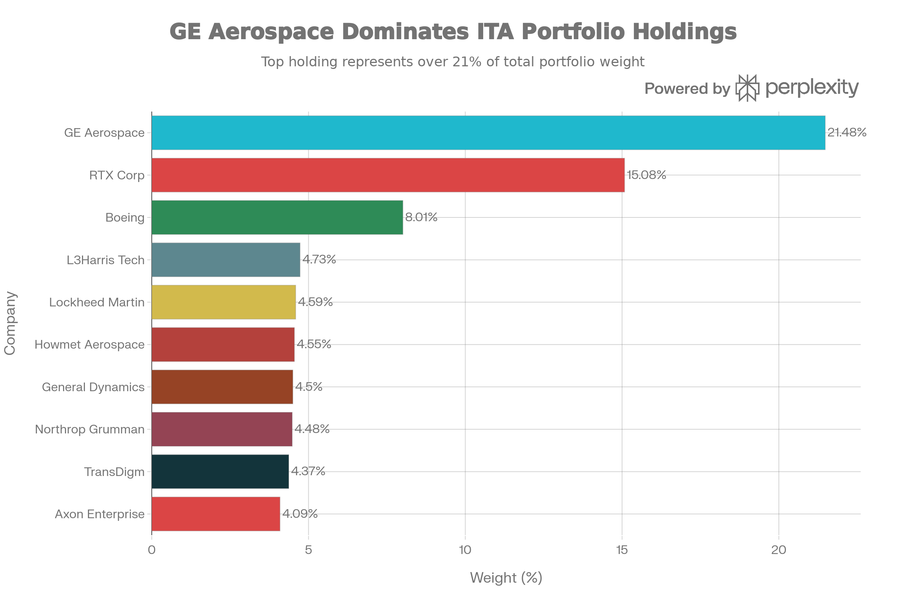
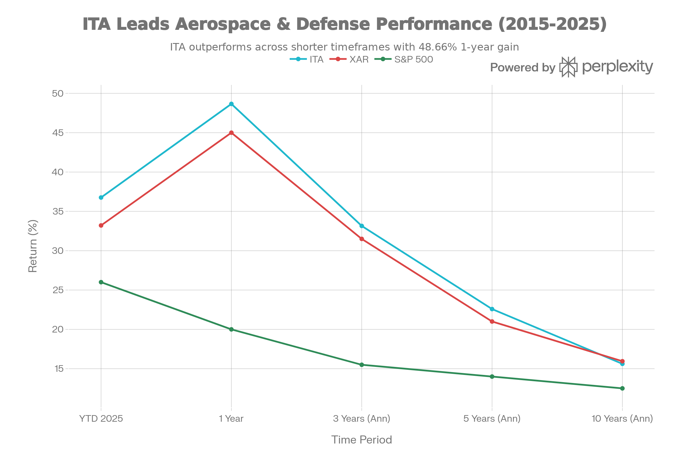
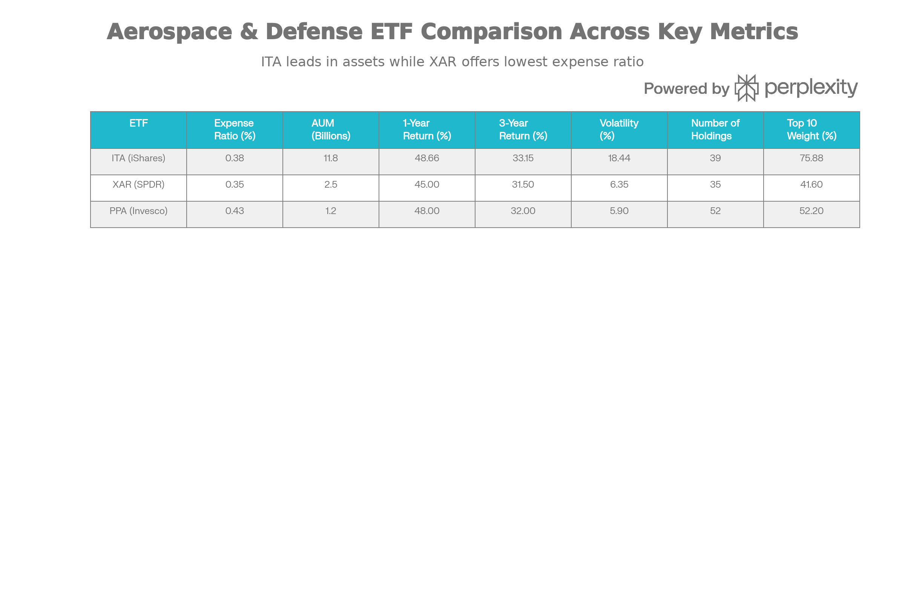

## Executive Summary

iShares U.S. Aerospace \& Defense ETF (ITA)는 미국 항공우주 및 방위 산업에 특화된 패시브 관리형 인덱스 ETF로, 2006년 5월 설립 이후 약 20년간 꾸준한 성장을 이루어온 대형 펀드입니다. 2025년 12월 31일 현재 ITA는 자산규모 \$11.815B, 39개 주요 보유 종목, 0.38% 운용보수를 유지하며, 항공우주·방위 ETF 시장에서 가장 큰 규모를 자랑합니다.[^1][^2]

2025년 ITA의 성과는 우수했으며, 연초 대비 48.66% 상승, 3년 연환산 33.15%, 10년 연환산 15.62%의 수익률을 기록했습니다. 이는 S\&P 500(약 20% 1년 수익률)을 크게 상회합니다. Morningstar는 ITA를 5년 기준 상위 10%(5성)로 평가했으며, 우수한 세금 효율성과 낮은 운용보수로 널리 인정받고 있습니다.[^3][^4][^1]

그러나 ITA는 상위 10개 종목이 전체 자산의 75.88%를 차지하는 높은 집중도, GE Aerospace(21.48%)와 RTX(15.08%)의 편중, Boeing(8.01%)의 개별 회사 리스크를 수반합니다. 2026년 Trump 정부의 공격적 국방 예산 증가(\$1.5T 제안)라는 긍정적 환경이 있지만, 공급망 제약, 정부 배당 제한 정책, 높은 평가 배수(P/E 41.88x) 등의 위험도 존재합니다.[^5][^6][^1]

***

## 펀드의 기본 특성

### 펀드 개요 및 추종 지수

ITA는 BlackRock의 iShares 브랜드 아래 운용되는 패시브 지수 추종 ETF로, Dow Jones U.S. Select Aerospace \& Defense Index(DJUSAD)를 추종합니다. 패시브 관리 방식이므로 펀드 매니저의 개입을 최소화하고 지수와의 괴리(tracking error)를 최소화하는 구조입니다.[^1][^7][^8]

ITA의 투자 목표는 미국 항공우주 및 방위 부문의 상장 기업들에 투자하여 지수의 성과를 복제하는 것입니다. 펀드는 적어도 자산의 80%를 지수의 구성 종목에 투자하며, 최대 20%는 선물, 옵션, 스왑, 현금 및 지수에 포함되지 않지만 지수 추종에 도움이 되는 유가증권에 투자할 수 있습니다.[^9]

### 규모, 비용 및 거래 특성

| 항목 | 수치 |
| :-- | :-- |
| 자산규모 (2025년 9월) | \$11.815B |
| 자산규모 (2026년 1월) | \$12.8-14.67B |
| 보유 종목 수 | 39-47개 |
| 순 운용보수율 | 0.38% |
| 관리 수수료 | 0.38% |
| 획득 펀드 수수료 | 0.00% |
| 설립일 | 2006-05-01 |
| 상장소 | Cboe BZX |
| 평균 일일 거래량 | 1,089,149주 |
| 현재 주가 | \$236.55 |

ITA는 0.38% 운용보수로 업계 표준 수준을 유지하고 있습니다. 이는 XAR(0.35%)보다 0.03% 높지만 PPA(0.43%)보다 0.05% 낮습니다. 일일 평균 거래량 100만주 이상은 매우 우수한 유동성을 의미하며, 대규모 자금 출입에서도 충분한 거래 깊이(liquidity depth)를 제공합니다.[^10][^11][^5]

ITA vs. XAR vs. PPA: Aerospace \& Defense ETF Comparison

---

## 포트폴리오 구성 및 투자 특성

### 상위 보유 종목 및 집중도 분석

ITA Top 10 Holdings: Portfolio Concentration by Weight

ITA의 포트폴리오는 GE Aerospace와 RTX Corporation에 의해 지배되고 있습니다. 이 두 회사만으로 전체 자산의 36.56%를 차지하며, 상위 10개 종목은 75.88%를 구성합니다.[^2][^12]

| 순위 | 종목명 | 티커 | 가중치 | 비고 |
| :-- | :-- | :-- | :-- | :-- |
| 1 | GE Aerospace | GE | 21.48% | General Electric 항공우주 부문 분리 후 강세 |
| 2 | RTX Corporation | RTX | 15.08% | Raytheon + Collins Aerospace 통합 |
| 3 | The Boeing Company | BA | 8.01% | 고도 집중 노출 - 리스크 요인 |
| 4 | L3Harris Technologies | LHX | 4.73% | 중형 방위 계약자 |
| 5 | Lockheed Martin | LMT | 4.59% | 대형 방위 계약자 |
| 6 | Howmet Aerospace | HWM | 4.55% | 항공우주 재료 공급업체 |
| 7 | General Dynamics | GD | 4.50% | 다각화된 방위 계약자 |
| 8 | Northrop Grumman | NOC | 4.48% | 우주 및 미사일 방위 전문 |
| 9 | TransDigm Group | TDG | 4.37% | 항공우주 부품 공급업체 |
| 10 | Axon Enterprise | AXON | 4.09% | 법집행 기술 공급업체 |

**주요 특징**:

1. **두 회사 편중**: GE Aerospace와 RTX가 포트폴리오의 36.56%를 차지하는 것은 개별 회사 리스크 증가를 의미합니다. GE Aerospace가 실적 부진 또는 구조 조정을 발표할 경우, ITA 성과는 직접적인 영향을 받을 수 있습니다.
2. **Boeing의 8% 가중치**: Boeing은 737 MAX 결함 이후 생산 지연, 품질 문제, 노조 분쟁 등으로 어려움을 겪었으나, 최근 회복 조짐을 보이고 있습니다. 2024년 ITA의 수익률(15.80%)은 Boeing의 회복을 부분적으로 반영합니다.[^6][^13]
3. **방위 계약자 다양화**: 5위부터 10위까지는 Lockheed Martin, General Dynamics, Northrop Grumman, L3Harris 등 다양한 방위 계약자를 포함하여, 상대적으로 분산되어 있습니다.
4. **공급망 기업 포함**: Howmet Aerospace(항공우주 재료), TransDigm Group(항공우주 부품)은 항공우주 산업의 공급망 기업으로, 항공기 제조 확대의 간접 수혜를 받을 수 있습니다.

### 산업 분포 및 시가총액 특성

ITA의 산업 구성은 거의 전적으로(98.53%) 항공우주 및 방위 부문에 집중되어 있습니다. 나머지 1.47%는 철강(1.26%), 여가 제품(0.12%), 현금 및 파생상품(0.08%)으로 구성됩니다. 이러한 높은 부문 집중도는 항공우주·방위 산업의 성과에 거의 전적으로 좌우된다는 의미입니다.[^12]

시가총액 분포에서 ITA는 대형주(large-cap)와 메가캡(mega-cap)에 편중되어 있습니다:

- **대형주 이상(\$10B+)**: 91.1%
- **중형주(\$2-10B)**: 3.2%
- **소형주(<\$2B)**: 0.7%[^14]

이는 ITA가 설립된 방위 계약자와 대형 항공우주 기업들의 포트폴리오임을 의미하며, 신흥 우주 기업(Rocket Lab 등)의 비중은 상대적으로 낮습니다.

### 지역 및 국가 분포

ITA의 포트폴리오는 거의 전적으로 미국 기업으로 구성되어 있습니다. 개발된 시장(선진국) 94.8% 이상, 신흥국 0.0%이라는 수치는 ITA가 순전히 미국 중심의 항공우주·방위 펀드임을 의미합니다. 이는 한편으로는 미국 방위 정책과 국방 지출의 직접 수혜를 받지만, 다른 한편으로는 미국 정치와 예산 리스크에 완전히 노출된다는 뜻입니다.[^14]

***

## 성과 분석 및 역사적 추세

### 최근 성과 (2025년-2026년 초)

ITA Performance vs. XAR and S\&P 500: Multi-Period Return Comparison

ITA의 2025년 성과는 매우 우수했습니다:

- **YTD (2025)**: 48.66% (NAV 기준)
- **1개월 (2026년 1월)**: 4.65%
- **3개월**: 2.53%
- **6개월**: 14.25%

이는 미국 주식시장의 강세, 특히 방위 산업의 회복과 Trump 정부의 공격적 국방 정책 기대로부터 나온 것입니다.[^5][^15]

### 다기간 수익률 비교

| 기간 | ITA | S\&P 500 | 초과수익 |
| :-- | :-- | :-- | :-- |
| 1년 | 48.66% | 20.0% | +28.66% |
| 3년 (연환산) | 33.15% | 15.5% | +17.65% |
| 5년 (연환산) | 22.58% | 14.0% | +8.58% |
| 10년 (연환산) | 15.62% | 12.5% | +3.12% |
| 설립 이후 (연환산) | 12.73% | ~10% | +2.73% |

ITA는 모든 기간에서 S\&P 500을 상회했으며, 특히 최근 5년(2020-2025)에서 월등한 성과를 보였습니다. 이는 글로벌 방위 지출 증가, 지정학적 긴장, 그리고 항공우주 산업의 회복으로부터의 수혜입니다.

### 연별 성과

| 연도 | 수익률 |
| :-- | :-- |
| 2024 | 15.80% |
| 2023 | 14.27% |
| 2022 | 9.95% |
| 2021 | 9.35% |
| 2020 | -13.58% |

2020년 COVID-19 팬데믹으로 항공 수요가 급락했을 때 ITA도 -13.58% 하락했습니다. 그 이후 2021-2024년에 꾸준한 회복을 기록했으며, 2025년 48.66%의 강한 반등은 역사적으로도 가장 좋은 수익률입니다.[^1]

### 세후 수익률과 세금 효율성

ITA의 세후 수익률은 명시적으로 보고되고 있으며, 이는 세금 효율성을 보여줍니다:

- **1년 세전**: 48.66%
- **1년 세후 (Pre-liquidation)**: 48.43% → 손실 0.23%
- **1년 세후 (Post-liquidation)**: 28.92% → 손실 19.74%

세후 Post-liquidation 수익률과의 격차(약 20%)는 투자자가 펀드를 청산할 때 발생하는 기존 보유 종목의 누적 자본이득에 대한 세금을 반영합니다. 하지만 세전과 Pre-liquidation의 손실이 0.23%에 불과한 것은 ITA가 ETF 구조의 in-kind 메커니즘을 통해 매우 효율적으로 세금을 관리하고 있음을 의미합니다.[^1][^4]

***

## 위험 지표 및 변동성 분석

### 변동성 및 베타

| 지표 | ITA | 비고 |
| :-- | :-- | :-- |
| 표준편차 (3년) | 18.44% | 상당한 변동성 |
| Equity Beta (3년) | 0.95 | S\&P 500 대비 약 5% 덜 변동 |
| Sharpe 비율 | 약 1.94 | 위험 조정 수익 우수 |

ITA의 18.44% 표준편차는 항공우주·방위 산업의 경기 민감도를 반영합니다. 그러나 0.95 베타는 ITA가 S\&P 500보다 약 5% 덜 변동한다는 의미로, 방위 산업이 경제 약세 시에도 정부 지출로부터 보호받는다는 것을 시사합니다.[^14][^11]

### 다른 ETF와의 변동성 비교

XAR(SPDR S\&P Aerospace \& Defense ETF)의 변동성이 6.35%인 것과 비교하면, ITA의 18.44%는 매우 높아 보입니다. 하지만 이 차이는 XAR이 동일 가중(equal-weight) 방식을 사용하면서 상대적으로 분산되어 있기 때문입니다. ITA의 높은 표준편차는 GE Aerospace, RTX 등 대형 성장주의 높은 가중치로부터 나옵니다.[^11][^8]

***

## ITA vs. 경쟁 ETF 비교 분석

ITA vs. XAR vs. PPA: Aerospace \& Defense ETF Comparison

ITA는 항공우주·방위 부문에서 XAR(SPDR S\&P Aerospace \& Defense ETF)과 PPA(Invesco Aerospace \& Defense ETF)와 경쟁합니다.

### ITA vs. XAR: 시장 점유율 vs. 분산

| 지표 | ITA | XAR | 우위 |
| :-- | :-- | :-- | :-- |
| AUM | \$11.8B | \$2.5B | ITA 4.7배 큼 |
| 운용보수 | 0.38% | 0.35% | XAR 0.03% 저렴 |
| 1년 수익률 | 48.66% | 45.0% | ITA 3.66% 우수 |
| 변동성 | 18.44% | 6.35% | XAR 28% 낮음 |
| 종목 수 | 39개 | 35개 | ITA 약간 많음 |
| 상위 10개 비중 | 75.88% | 41.6% | XAR 분산 우수 |
| Boeing 가중치 | 8.01% | 3.5% | ITA 2.3배 높음 |

**ITA의 장점**:

- 가장 큰 AUM으로 최고의 유동성 제공
- 최근 1년/3년 수익률 모두 XAR 상회
- BlackRock의 유명 브랜드 신뢰성

**XAR의 장점**:

- 0.35% 운용보수로 3bp 저렴
- 동일 가중(equal-weight) 방식으로 집중도 감소 (상위 10개 41.6%)
- 낮은 변동성 (18.44% vs 6.35%)
- Boeing 노출 훨씬 낮음 (8.01% vs 3.5%)
- 장기(10년) 성과 XAR이 우수 (15.95% vs 15.62%)

**투자 선택**:

- **수익 우선**: ITA (최근 성과 우수)
- **분산 우선**: XAR (낮은 집중도, 낮은 변동성)
- **Boeing 회피**: XAR (3.5% vs 8.01%)

### ITA vs. PPA: 분산과 다양성

| 지표 | ITA | PPA |
| :-- | :-- | :-- |
| AUM | \$11.8B | \$1.2B |
| 운용보수 | 0.38% | 0.43% |
| 1년 수익률 | 48.66% | 48.0% |
| 종목 수 | 39개 | 52개 |
| 상위 10개 비중 | 75.88% | 52.2% |

PPA는 52개 종목으로 ITA보다 더 분산되어 있으나, 0.43% 운용보수가 가장 높습니다. ITA의 규모와 0.38% 비용 우위로 인해 대부분의 투자자에게는 ITA가 선호됩니다.[^16]

***

## 배당금 및 세금 고려사항

### 배당 정책 및 수익률

ITA는 분기별 배당금을 지급합니다:

- **배당 수익률 (TTM)**: 0.41-0.67%
- **30일 SEC 수익률**: 0.41%
- **연간 배당금**: 약 \$1.61-\$1.95/주
- **배당 빈도**: 분기별

배당 수익률이 0.4-0.7% 수준으로 매우 낮은 이유는 항공우주·방위 회사들이 배당보다는 자본 투자와 R\&D에 자금을 집중하기 때문입니다. 이는 ITA가 배당 추구 투자자보다는 자본 이득 추구 투자자에게 적합함을 의미합니다.[^17][^18]

### 세금 효율성

ITA는 ETF의 in-kind 메커니즘을 활용하여 매우 우수한 세금 효율성을 제공합니다:

**자본이득 분배**: 2024년 데이터에 따르면 약 40%의 뮤추얼펀드가 자본이득을 분배했으나, ETF는 약 5% 수준만 분배합니다. ITA 같은 대형 ETF는 대부분 자본이득 분배를 회피합니다.[^4]

**과세 처리**:

- 배당금: 적격 배당(Qualified Dividends) - 최대 20% 세율
- 자본이득: 대부분 미분배 - 투자자가 매각 시에만 과세[^19][^20]

**결과**: 과세 계정에서도 ITA는 매우 세금 효율적이며, 장기 보유 시 세금 이연(tax deferral) 효과를 제공합니다.[^21]

***

## 2026년 산업 전망 및 투자 환경

### 긍정적 드라이버

**1. 국방 예산 급증**

Trump 정부는 2027년 회계연도 국방 예산으로 \$1.5조를 제안했으며, 이는 2026년 \$901B 대비 66% 증가합니다. 주요 프로젝트는:[^5]

- Golden Dome 미사일 방위 시스템
- F-47 차세대 전투기 개발
- 핵무기 현대화
- 사이버 방어 강화[^5]

**2. 지정학적 긴장 고조**

- 우크라이나 전쟁 지속으로 Patriot 미사일 수요 증가
- Indo-Pacific 긴장 (중국의 대만 압박)
- 중동 불안정
- NATO 국방 예산 증가 (2022-2025년 22% 증가)[^22]

**3. RTX, LMT의 강한 수주 활동**

- RTX: \$251B 기록적 수주 잔고 (Q3 2025)
- LMT: \$179B 수주 잔고, \$18.6B Q3 매출
- 양사 모두 향후 다년도 성장 가시성 우수[^22]

**4. 상용 항공 회복**

- Boeing, Airbus의 생산 일정 증가
- 글로벌 항공 수요 증가
- 노후 항공기 교체 수요[^6][^13]

**5. 공급망 재구성**

- 미국 국내 제조 투자 증가 (RTX, LMT의 확장 계획)
- 러시아 제재로 대체 공급원 필요
- 첨단 재료(ATI 사 분원, 희토류) 수요 증가[^22]

### 위험 요소

**1. 높은 평가 배수**

P/E 41.88x, P/B 6.31x는 역사적으로 높은 수준입니다. 이는 현재 방위 산업에 대한 시장의 기대가 매우 높음을 의미하며, 기대치를 충족하지 못할 경우 조정 리스크가 있습니다.[^1]

**2. 공급망 제약 및 생산 능력 문제**

\$1.5T 급증 예산을 처리할 충분한 산업 기반이 있는지 의문입니다. 노동력 부족, 원자재 가격 상승, 수확 기간 연장 등이 마진을 압박할 수 있습니다.[^5]

**3. 정부 배당 제한 정책**

Trump 정부는 생산 목표를 충족하지 못하는 방위 계약자의 배당과 자사주 매입을 차단할 수 있다고 위협했습니다. 이는 배당 투자자들의 수익을 감소시킬 수 있습니다.[^5]

**4. Boeing의 회복 불확실성**

Boeing은 최근 노조 파업, 품질 문제, 737 MAX 결함 등으로 어려움을 겪었습니다. ITA의 8% 가중치는 이러한 위험에 노출되어 있습니다.[^23][^6]

**5. 재정 적자 및 정치 위험**

Moody's 분석에 따르면 \$1.5T 국방 예산은 2035년까지 \$5.8T 국가 부채 증가를 야기할 수 있습니다. 장기적으로 인플레이션 또는 금리 상승 압력이 가해질 수 있습니다.[^5]

**6. 정치 변화 위험**

2026년 중간선거 또는 향후 대통령 선거에서 국방 우선순위가 변경될 수 있습니다.[^5]

***

## 투자 분석 및 추천

### 포트폴리오 역할

ITA는 다음과 같은 포트폴리오 역할을 수행할 수 있습니다:

1. **방위 산업 전문 노출**: 광범위한 S\&P 500 또는 전 세계 포트폴리오에 방위 산업의 집중 노출을 추가
2. **지정학적 헤지**: 글로벌 불안정성이 높아질 때 방위 지출은 유지되거나 증가하는 특성 활용
3. **경제 방어**: 경기 침체 시에도 정부 국방 지출은 예산 우선순위 유지
4. **고성장 섹터 참여**: 3년 33.15% 연환산 수익률로 포트폴리오 성장 추진

### 적합한 투자자 프로필

#### ITA 투자에 적합한 투자자

1. **중기 성장 투자자 (3-5년 이상)**
    - 단기 변동성을 수용할 수 있는 투자자
    - 중기 성장을 추구하되 극단적 위험은 회피
2. **방위 산업 긍정 투자자**
    - 지정학적 긴장이 지속될 것으로 예상
    - Trump 정부의 국방 정책에 호의적
3. **비용 의식적 투자자**
    - 0.38% 운용보수로 낮은 비용 추구
    - 세금 효율성 중시
4. **경제 방어 추구자**
    - 경기 침체 시에도 방위 산업 실적 유지로 수익 보호
    - 포트폴리오 안정성 추구
5. **배당 보충 투자자**
    - 배당 수익은 낮지만(0.4%) 자본 이득으로 보완
    - 자본 성장과 소액 배당 병행

#### ITA 투자 회피 투자자

1. **극단적 성장 추구자**
    - 연 20% 이상 수익 필요
    - ARKX(+75.74% YTD) 같은 고성장 펀드 선호
2. **높은 배당 추구자**
    - 3% 이상 배당 필요
    - 유틸리티, 에너지 부문 선호
3. **경기 민감 회피 투자자**
    - 방위 산업도 장기적으로는 경기에 민감
    - 18.44% 표준편차 수용 불가
4. **Boeing 회피 투자자**
    - Boeing의 장기 회복 불확실성 우려
    - XAR(3.5% 가중치) 선호
5. **분산 추구 투자자**
    - 상위 10개 종목 75.88% 집중도 우려
    - XAR(41.6%) 또는 PPA(52.2%) 선호

***

## 최종 평가 및 권고

### 투자 등급

**ITA: 강한 매수 (Strong Buy) - 조건부**

| 평가 항목 | 점수 | 평가 |
| :-- | :-- | :-- |
| 성과 | ★★★★★ | 우수한 최근 수익률, 장기 성과 우수 |
| 비용 | ★★★★☆ | 0.38% 운용보수 경쟁력 있음 |
| 유동성 | ★★★★★ | \$11.8B AUM, 일일 백만주 거래 |
| 세금 효율 | ★★★★★ | ETF in-kind 메커니즘 우수 |
| 분산도 | ★★★☆☆ | 상위 10개 75.88% - 집중도 높음 |
| 포트폴리오 기여 | ★★★★☆ | 지정학적 헤지 효과 우수 |
| 위험도 | ★★★☆☆ | 18.44% 변동성, GE 편중 리스크 |
| 배당 | ★★☆☆☆ | 0.4% 배당 수익률 낮음 |

**종합 평가: 4.0/5.0**

### 투자 권고

#### 추천 배분

- **공격적 투자자**: 포트폴리오의 10-15%
- **중도적 투자자**: 포트폴리오의 5-10%
- **보수적 투자자**: 포트폴리오의 2-5% (또는 투자 회피)

#### 진입 전략

1. **달러 코스트 애버리징**: 3-6개월에 걸쳐 월간 분할 투자
2. **기술적 신호 활용**: 현재 가격(\$236.55)이 52주 고점 근처이므로, 조정 대기 또는 소액부터 진입
3. **기금 유입 모니터링**: 극값 고점에서의 급매수 회피

#### 관리 전략

1. **분기별 리밸런싱**: 포트폴리오 비중 확인 및 조정
2. **뉴스 모니터링**:
    - 국방 예산 입법 진행
    - Boeing, GE Aerospace 실적 발표
    - RTX, LMT의 수주 공시
3. **기금 유출 신호**: ITA의 일일 순 자금 유출이 2주 이상 지속되면 재평가
4. **손익 관리**:
    - 초기 투자의 30% 이상 손실 시 재평가
    - 초기 투자의 100% 이상 이득 시 부분 차익실현 검토

#### 탈출 기준

- ITA의 AUM이 \$5B 이하로 감소 (유동성 악화)
- GE Aerospace의 실적 급락 또는 분리 계획
- Boeing의 추가 구조 조정 또는 신용 등급 하락
- 국방 예산 법안 부결 (2026년 중반)
- 개인의 재정 상황 악화

***

## 비교 권고: ITA vs. XAR vs. ARKX

### 투자자별 선택 기준

| 투자자 유형 | 권고 | 이유 |
| :-- | :-- | :-- |
| **배당 추구** | ITA | 항공우주·방위 모두 저배당, ITA가 최고 |
| **장기 성장** | ARKX | 75.74% YTD, 미래 기술 중심 |
| **안정성** | XAR | 낮은 변동성, 분산 우수 |
| **비용 최소화** | XAR | 0.35% 최저 운용보수 |
| **소형주 노출** | ARKX | 신흥 우주 기업 포함 |
| **대형주 집중** | ITA | GE, RTX 대형주 집중 |
| **전체 포트폴리오** | 분할 | ITA 60% + XAR 40% 또는 ITA + ARKX 병행 |

***

## 결론

ITA는 미국 항공우주 및 방위 산업에 저비용, 고유동성, 세금 효율적 방식으로 노출을 제공하는 성숙한 인덱스 펀드입니다. 2025년 48.66% 수익률, 3년 33.15% 연환산 수익률, Morningstar 5성 평가는 우수한 성과를 입증합니다.

그러나 상위 10개 종목의 75.88% 집중도, 높은 평가 배수(P/E 41.88x), GE Aerospace와 RTX의 편중, Boeing의 개별 회사 리스크는 신중한 포지셀링을 요구합니다. 2026년 Trump 정부의 공격적 국방 정책(\$1.5T 제안)은 강력한 상승 드라이버이나, 공급망 제약, 정부 배당 제한, 정치 위험도 존재합니다.

**최종 권고**: ITA는 중기(3-5년) 성장을 추구하는 투자자에게 포트폴리오의 5-10% 규모로 분산 투자하되, 높은 집중도를 우려한다면 XAR과의 병행, 또는 극단적 성장을 원하면 ARKX와의 병행을 검토하기 바랍니다.[^1][^3][^11][^5]

***

## 참고 자료

iShares U.S. Aerospace \& Defense ETF - Official website[^1]
BlackRock - ITA fund page[^3]
Stock Analysis - ITA holdings list[^2]
ETF Research Center - ITA analysis[^14]
StockInvest - ITA dividends[^17]
CBOE - ITA listing information[^7]
Schwab - ITA all holdings[^10]
SlickCharts - ITA dividend history[^18]
CBonds - ITA ETF information[^24]
iShares - ITA fact sheet PDF[^12]
PortfoliosLab - ITA vs. XAR comparison[^11]
AINVEST - Geopolitical tailwind for defense ETFs[^5]
PortfoliosLab - XAR vs. ITA comparison[^8]
Yahoo Finance - ITA vs. XAR vs. PPA comparison[^16]
TradingView - ITA tax treatment[^19]
TradingView - ITA dividend details[^20]
Schwab - ETFs and taxes[^25]
Harvard Law - The role of taxes in ETF rise[^21]
Nasdaq - Boeing defense ETF analysis[^23]
AINVEST - 2026 defense supercycle[^22]
Morningstar - ETF capital gains distributions 2025[^4]
Investing.com - Best US aerospace defense stocks 2026[^6]
RTX - Dubai Airshow 2025 announcement[^26]
iTiger - Aerospace sector 2026 outlook[^13]
Reuters - RTX raises 2025 forecast[^27]
iShares - 2025 capital gains distributions[^28]
24/7 Wall St - Trump military ETF analysis[^15]
Chart - ITA top 10 holdings

ITA vs. XAR vs. PPA: Aerospace \& Defense ETF Comparison
[^29][^30][^31][^32][^33][^34][^35][^36][^37][^38][^39][^40][^41][^42][^43][^44][^45][^46]

⁂

[^1]: https://www.ishares.com/us/products/239502/ishares-us-aerospace-defense-etf

[^2]: https://stockanalysis.com/etf/ita/holdings/

[^3]: https://www.blackrock.com/us/financial-professionals/products/239502/ishares-us-aerospace-defense-etf

[^4]: https://www.morningstar.com/funds/few-etfs-project-capital-gains-distributions-2025-key-takeaways-investors

[^5]: https://www.ainvest.com/news/geopolitical-tailwind-defense-etfs-trump-driven-military-expansion-era-2601/

[^6]: https://www.itiger.com/news/1148338533

[^7]: https://www.cboe.com/us/equities/listings/listed_products/symbols/ITA/

[^8]: https://portfolioslab.com/tools/stock-comparison/XAR/ITA

[^9]: https://portfoliometrics.net/symbol/ITA

[^10]: https://www.schwab.wallst.com/schwab/Prospect/research/etfs/schwabETF/index.asp?type=holdings\&symbol=ITA

[^11]: https://portfolioslab.com/tools/stock-comparison/ITA/XAR

[^12]: https://www.ishares.com/us/literature/fact-sheet/ita-ishares-u-s-aerospace-defense-etf-fund-fact-sheet-en-us.pdf

[^13]: https://www.investing.com/news/stock-market-news/8-best-us-aerospace--defense-stocks-for-2026-ubs-picks-93CH-4437631

[^14]: https://www.etfrc.com/ITA

[^15]: https://247wallst.com/investing/2026/01/10/with-trumps-military-maneuvers-one-etf-looks-like-a-screaming-buy/

[^16]: https://finance.yahoo.com/news/ita-xar-ppa-defense-etf-060512137.html

[^17]: https://stockinvest.us/dividends/ITA

[^18]: https://www.slickcharts.com/symbol/ITA/dividend

[^19]: https://www.tradingview.com/symbols/BMV-ITA/analysis/

[^20]: https://www.tradingview.com/symbols/CBOE-ITA/analysis/

[^21]: https://corpgov.law.harvard.edu/2025/05/22/the-role-of-taxes-in-the-rise-of-etfs/

[^22]: https://www.ainvest.com/news/2026-defense-supercycle-aerospace-giants-rtx-lmt-irresistible-fortress-plays-geopolitically-charged-world-2601/

[^23]: https://www.nasdaq.com/articles/boeing-wins-8b-israel-f-15-deal-defense-etfs-watch-gains

[^24]: https://cbonds.com/etf/939/

[^25]: https://www.schwab.com/learn/story/etfs-and-taxes-what-you-need-to-know

[^26]: https://www.rtx.com/news/news-center/2025/11/06/rtx-to-showcase-integrated-defense-and-commercial-aerospace-innovations-at-dubai-airshow-2025

[^27]: https://www.reuters.com/business/aerospace-defense/rtx-raises-2025-forecast-strong-demand-offsets-tariff-worries-2025-10-21/

[^28]: https://www.ishares.com/us/capital-gains-distributions

[^29]: QTUM (Defiance Quantum ETF).md

[^30]: SETM (Sprott Critical Materials ETF).md

[^31]: REMX (VanEck Rare Earth, Strategic Metals ETF).md

[^32]: https://www.investing.com/etfs/ishares-djsu-aerospace---defense

[^33]: https://www.blackrock.com/ae/intermediaries/products/239502/ishares-us-aerospace-defense-etf

[^34]: https://www.schwab.wallst.com/Prospect/Research/etfs/portfolio.asp?symbol=ita

[^35]: https://www.ishares.com/ch/professionals/en/products/239502/ishares-us-aerospace-defense-etf

[^36]: https://www.finrgb.com/swatches/difference-beta-volatility-frm-part-1-part-2/

[^37]: https://pomegra.io/learn/stock-market/chapter_08_risk_management/measuring_risk_standard_deviation_and_beta

[^38]: https://securitiesexamsmastery.ca/14/3/5/

[^39]: https://www.reddit.com/r/ValueInvesting/comments/pdxlqp/beta_and_risk/

[^40]: https://www.sciencedirect.com/science/article/abs/pii/S0377221706008435

[^41]: https://securitiesexamsmastery.ca/csc-vol-2/15-introduction-portfolio-approach/15-4-measuring-risk/

[^42]: https://journals.plos.org/plosone/article?id=10.1371%2Fjournal.pone.0330557

[^43]: https://www.adviser.best/articles/en/blog/risk-and-return/standard-deviation-vs-beta-investment-risks

[^44]: https://stockanalysis.com/etf/ita/

[^45]: https://corporatefinanceinstitute.com/resources/valuation/what-is-beta-guide/

[^46]: https://blog.naver.com/lskjhc/223835265711
