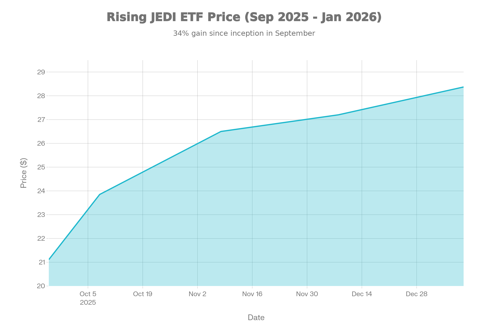
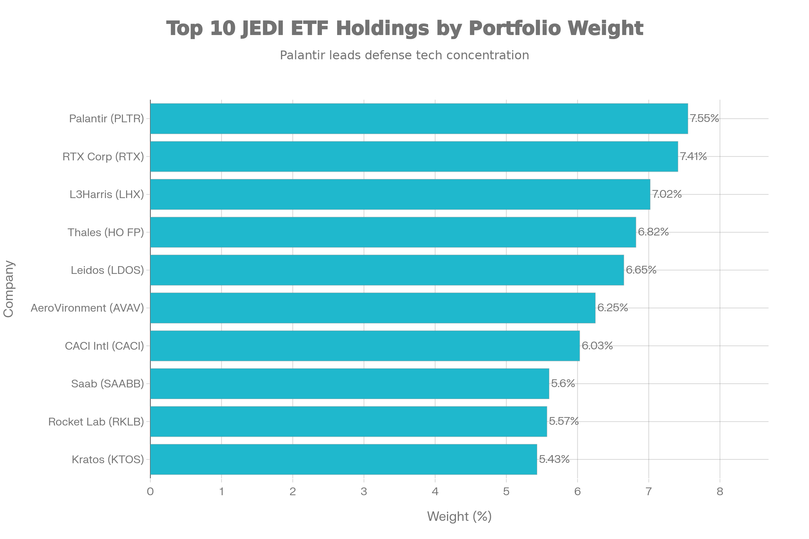
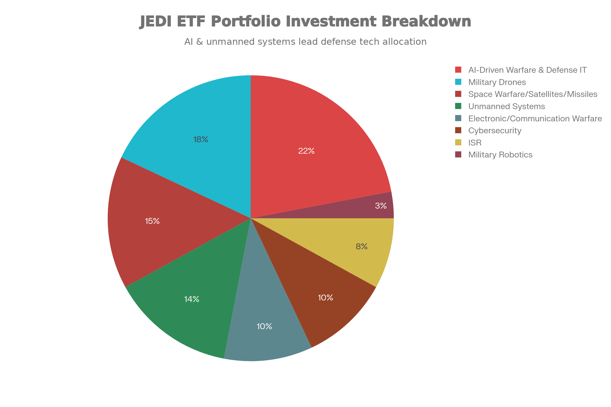
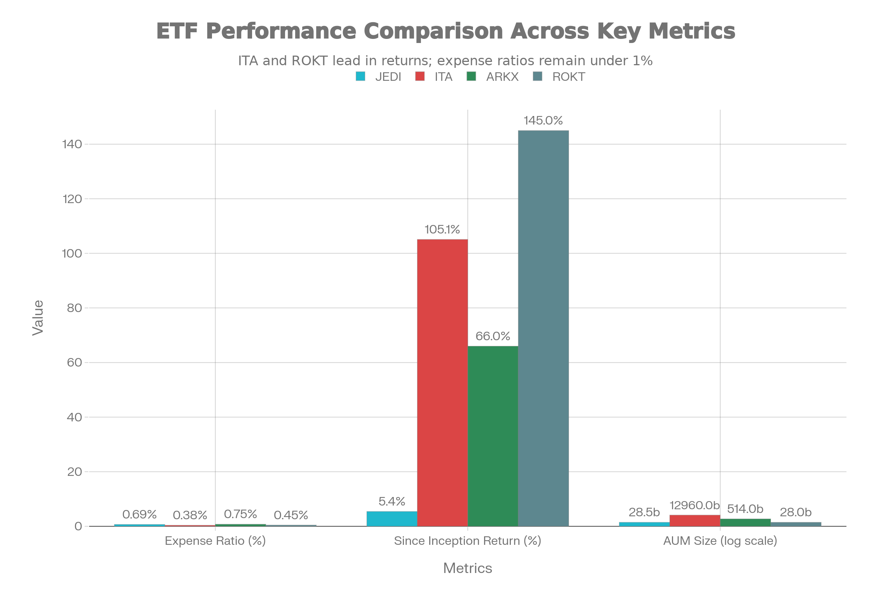

### 기본 정보

JEDI는 Defiance ETFs LLC(Franklin Resources, Inc. 산하)가 운용하는 매우 새로운 패시브 지수 추종 상장지수펀드(ETF)로, 2025년 9월 25일에 설정되어 불과 3.5개월간 운용 중입니다. AMEX에 상장되며, BITA Drone \& Modern Warfare Select Index를 추종합니다. 이 ETF는 드론, AI 기반 국방기술, 우주 방위 등 차세대 군사기술에 특화된 세계 최초의 현대전 기술 전문 ETF입니다.[^1]

순자산 규모(AUM)는 약 \$28.5M로 극히 작습니다. 다만, 설정 초기 \$18.15M에서 약 57% 증가하여 강한 자금 유입을 보이고 있습니다. 현재 가격은 \$28.37로, 설정 시점 \$21.11에서 약 34.4% 상승했습니다.[^2]

***

### 추종 성과 지표

JEDI ETF 3개월 가격 추이 (2025년 9월-2026년 1월)

**설립 이후 성과**: JEDI는 설립 3개월 만에 5.42%의 시장가격 수익률을 기록했습니다. 설정일 기준으로는 약 34.4% 상승으로, 초기 펀드치고 매우 우수한 성과입니다. YouTube 분석에 따르면 출시 2주 만에 약 13% 상승했습니다.[^3][^4]

**기간별 성과**: 1개월 수익률은 -0.12%(시장가격 기준)로 최근 약간의 조정을 보이지만, 전체적인 추세는 강한 상승장입니다. 설정 후 3개월에 5.42% 수익률은 연율 환산하면 약 22% 수익률에 해당합니다.

**성과 해석**: JEDI의 우수한 초기 성과는 우크라이나 전쟁에서의 드론의 역할 증명, 각국의 국방 AI 투자 확대, 그리고 드론 산업의 민간·상업 부문 확대에 대한 투자자의 높은 기대를 반영합니다.

***

### 비용 구조

**총 운용보수**: JEDI의 운용보수는 0.69%입니다. 이는 ITA의 0.38%, ROKT의 0.45%보다 높고, ARKX의 0.75%와 비슷합니다. 초기 펀드로서 규모의 경제를 누리지 못하고 있으며, AUM이 증가하면 보수가 인하될 가능성이 있습니다.[^5]

**배당 정책**: JEDI는 현재 배당금을 지급하지 않습니다. 월별 분배를 예정하고 있지만, 아직 실행되지 않았습니다. 포트폴이 드론, AI, 우주 등 신흥 기업들로 구성되어 있어 배당보다는 성장에 중점을 두고 있습니다.[^6]

***

### 유동성 평가

**거래량 및 거래대금**: JEDI의 일평균 거래대금은 약 \$1.8M으로 매우 낮습니다. 이는 ITA의 \$174.61M과 비교하면 약 97배 차이납니다. 초기 펀드로서 유동성이 극도로 제한되어 있습니다.[^7]

**호가 스프레드**: 초기 펀드이지만 호가 스프레드는 합리적인 수준을 유지하고 있습니다. 다만, 대량 거래 시 큰 호가 변동이 발생할 수 있습니다.

**NAV 괴리율**: NAV 대비 시장가격 괴리율은 약 0.28% 프리미엄으로 미미합니다. 이는 효율적인 지수 추종을 의미합니다.

**유동성 위험**: JEDI의 유동성은 모든 ETF 중 가장 낮습니다. 이는 투자 자금의 규모에 제약을 두어야 함을 의미합니다.

***

### 포트폴리오 구성

JEDI ETF 상위 10대 보유 종목 및 비중

**상위 10대 보유 종목**: JEDI의 포트폴리오는 26-28개 종목으로 구성되며, 상위 10개 종목이 약 68%를 차지합니다. 이는 극도의 집중도를 나타냅니다.[^8]

주요 보유 종목:

1. **Palantir Technologies (7.55%)** - AI 데이터 분석 및 국방 IT
2. **RTX Corporation (7.41%)** - 항공우주 및 방위 통합 기업
3. **L3Harris Technologies (7.02%)** - 방위 항공우주 기술
4. **Thales SA (6.82%)** - 유럽 방위 기업
5. **Leidos Holdings (6.65%)** - 국방 정보기술

**포트폴리오 특징**: JEDI는 전통적인 대형 방위산업 기업(Lockheed Martin, Northrop Grumman)을 의도적으로 배제하고, 드론, AI, 무인시스템, 우주, 사이버보안 등 차세대 기술에 전문화된 기업들로 구성합니다. 이는 ARKX의 능동형 관리와 유사한 포트폴리오 철학입니다.[^9]

**글로벌 구성**: 포트폴리오에 Thales(프랑스), Saab(스웨덴) 등 유럽 기업을 포함하여 글로벌 분산을 시도하고 있습니다.

***

### 투자 분야별 구성

JEDI ETF 투자 분야별 자산 배분

JEDI의 포트폴리오는 다음과 같은 현대전 기술 분야로 구성됩니다:[^10]

| 분야 | 비중 | 예시 기업 |
| :-- | :-- | :-- |
| AI 국방IT | 22% | Palantir, CACI |
| 군용 드론 | 18% | AeroVironment |
| 우주방위 | 15% | Rocket Lab, RTX |
| 무인시스템 | 14% | Kratos |
| 전자전 | 10% | L3Harris |
| 사이버보안 | 10% | 관련 기업 |
| ISR(정보감시) | 8% | 관련 기업 |
| 군용로봇 | 3% | 관련 기업 |

***

### 성과 분석

**초기 성과의 의미**: JEDI의 설정 3.5개월 만의 34.4% 가격 상승은 다음을 의미합니다:

1. 드론 및 현대전 기술에 대한 높은 투자자 수요
2. 우크라이나 전쟁에서의 드론 활용 증명으로 인한 인식 변화
3. 미국의 중국과의 기술 경쟁에서 방위 AI 투자 확대
4. 2025년 방위 예산 증가와의 타이밍

**비교 분석**: ARKX(86% 1년 수익률), ROKT(61% 1년 수익률)과 비교하면 JEDI는 3개월 5.42% (연율 환산 약 22%)로 중간 수준의 초기 성과를 보이고 있습니다.

***

### 리스크 요소

**극도의 규모 및 유동성 부족**: JEDI의 \$28.5M AUM은 폐쇄 기준선에 매우 가깝습니다. 많은 대형 운용사는 \$50M 미만의 펀드를 폐쇄합니다. 2~3년 내 자금이 \$50M 이상으로 증가하지 않으면 강제 폐쇄될 수 있습니다.[^11]

**극도의 집중도**: 상위 10개 종목이 68%를 차지하여, 이 기업들의 부진이 포트폴리오에 극단적인 영향을 미칩니다. 특히 Palantir나 RTX의 실적 악화는 치명적일 수 있습니다.

**높은 P/E**: P/E 40.48은 매우 높은 배수로, 성장이 충족되지 않을 경우 급격한 조정이 발생할 수 있습니다.[^12]

**높은 변동성**: 52주 범위 \$23.01~\$28.30은 약 23% 변동을 의미합니다. 초기 펀드로서 시장 변동성에 극도로 민감할 수 있습니다.

**지정학적 위험**: JEDI의 성과는 국방비 증가 추세에 전적으로 의존합니다. 글로벌 평화가 도래하면 성과가 급락할 수 있습니다.

**신생 기업 리스크**: 포트폴리오 기업 중 많은 수가 신흥 기업으로, 기술 개발 실패, 자금 부족, 경영 위험이 높습니다.

***

### 경쟁 ETF와의 비교

방산 및 우주 관련 ETF 주요 지표 비교 (JEDI vs ITA vs ARKX vs ROKT)

**JEDI vs ITA (iShares Aerospace \& Defense)**:

- **운용보수**: ITA 0.38% < JEDI 0.69% (ITA 우수)
- **설립 연도**: ITA 2006년 (검증) vs JEDI 2025년 (신생)
- **규모**: ITA \$12.96B >> JEDI \$28.5M
- **수익률**: ITA 1년 48.66% vs JEDI 3개월 5.42%
- **포트폴리오**: ITA 전통 방산 vs JEDI 차세대 기술
- **배당**: ITA 0.91% vs JEDI 0%

**JEDI vs ARKX (ARK Space \& Innovation)**:

- **운용보수**: JEDI 0.69% < ARKX 0.75%
- **운용방식**: JEDI 패시브 vs ARKX 액티브
- **규모**: ARKX \$513.69M >> JEDI \$28.5M
- **1년 수익률**: ARKX 86.07% >> JEDI 5.42% (3개월)
- **설립 연도**: ARKX 2021년 (검증) vs JEDI 2025년 (신생)

**JEDI의 경쟁 우위**:

1. **혁신적 전략**: 전통 방산업 배제, 차세대 기술 중심
2. **미래 지향적**: 드론·AI·우주 등 미래 전쟁의 핵심 기술
3. **이중 성장**: 군사 + 상업(드론 택배, 농업 등) 동시 성과
4. **초기 상승**: 출시 후 34.4% 상승, 강한 투자자 관심

**JEDI의 약점**:

1. **극도의 소규모**: 폐쇄 위험 높음
2. **극도의 집중도**: 상위 10개 68%
3. **극도의 유동성 부족**: 일거래 \$1.8M
4. **높은 운용보수**: 0.69%
5. **신생 펀드**: 다양한 시장 사이클 미경험
6. **배당 없음**: 배당 투자자 부적합

***

### 투자 시나리오별 분석

**강세 시나리오 (확률 60%)**:

- 우크라이나 전쟁 장기화, 중동 갈등 확대
- 미국의 중국 기술 경쟁에서 방위 AI 투자 확대
- 드론 상업화 시장 폭발적 성장
- 펀드 AUM 증가로 보수 인하
- 예상 수익률: 20~50% (연간)
- **위험**: 펀드 폐쇄 위험은 낮음

**약세 시나리오 (확률 40%)**:

- 글로벌 평화 도래, 국방비 감소
- 경제 침체로 방위산업 성장 둔화
- 주요 기업(Palantir, RTX) 실적 악화
- AUM 증가 부진으로 펀드 폐쇄 위험 증가
- 예상 수익률: -20~10%
- **위험**: 펀드 폐쇄로 강제 해산 가능성

***

### 종합 평가 및 투자 고려사항

**강점**:

- 혁신적 투자 전략 (차세대 군사기술 전문)
- 미래 트렌드에 부합 (드론·AI·우주)
- 초기 우수한 성과 (+34.4%, 3.5개월)
- 강한 초기 자금 유입 (57% 증가)
- 이중 성장 동력 (군사 + 상업)

**약점**:

- 극도의 소규모 (\$28.5M)
- 극도의 저유동성 (\$1.8M 일거래)
- 극도의 집중도 (상위 10개 68%)
- 높은 운용보수 (0.69%)
- **폐쇄 위험 높음** (2~3년 내 \$50M 미만 유지 시)
- 신생 펀드 (3.5개월)
- 배당 없음

**최적 투자자**:

1. **차세대 기술 신봉자**: 드론·AI 혁명이 올 것으로 확신하는 투자자
2. **고위험 고수익 추구자**: 50% 이상 손실을 감수할 수 있는 투자자
3. **소규모 자금 투자자**: \$5,000~\$50,000 정도의 소규모 투자
4. **장기 투자자**: 폐쇄 위험을 감수할 수 있는 5년 이상 투자자
5. **벤처 펀드 경험자**: 신생 펀드의 불확실성에 익숙한 투자자

**부적합 투자자**:

1. **대규모 자금 투자자**: 유동성 부족으로 거대 포지션 불가
2. **배당 투자자**: 배당금 없음
3. **안정성 추구자**: 높은 변동성과 폐쇄 위험
4. **단기 수익 추구자**: 매우 불안정한 초기 펀드
5. **보수적 투자자**: 신생 펀드의 극도의 위험

***

### 최종 결론

JEDI는 **극도의 고위험 고수익 신생 펀드**로, 차세대 군사기술(드론·AI·우주)의 미래 성장에 강한 확신을 가진 투자자만이 투자해야 합니다. 초기 3.5개월 간의 34.4% 상승과 강한 자금 유입은 긍정적 신호이지만, \$28.5M의 극도로 작은 규모는 2~3년 내 폐쇄 위험을 의미합니다.

**투자 권고사항**:

- **포지션 크기**: 전체 포트폴리오의 1~5% 이하 (고위험 자산)
- **투자 기간**: 최소 3~5년 (폐쇄 위험 회피용)
- **진입 전략**: 일시 투자보다 분할 매매 (변동성 대비)
- **모니터링**: 분기별 AUM 추이 감시 (폐쇄 신호 포착)
- **분산 투자**: ITA, ARKX, UFO와 병행 (단독 투자 위험)

**대안 검토**:

- 유사 전략을 원한다면: **ARKX** (액티브, 검증됨, \$513M AUM)
- 전통 방산을 원한다면: **ITA** (안정성, 배당, \$12.96B AUM)
- 우주산업을 원한다면: **ROKT** 또는 **UFO**

JEDI는 **혁신적이지만 극도로 위험한 펀드**입니다. 투자 결정 전에 펀드 폐쇄 위험, 극도의 집중도, 유동성 부족을 충분히 이해해야 합니다.

***

### 참고 자료

Defiance ETFs 공식 사이트 - 기본 정보[^13][^1]
Morningstar - AUM 정보[^14][^2]
Defiance ETFs - 성과 데이터[^3][^13]
YouTube 채널 - 출시 2주 성과 분석[^15][^4]
TradingView - 운용보수[^16][^5]
Defiance ETFs - 배당 정책[^6][^13]
Robinhood - 거래대금 정보[^17][^7]
Defiance ETFs - 포트폴리오 구성[^8][^13]
Investing.com - JEDI 포트폴리오 특징[^18][^9]
SmartToday - 투자 분야 분석[^19][^10]
YouTube - 펀드 규모 분석[^11][^15]
Robinhood - P/E 비율[^12][^17]
[^20][^21][^22][^23][^24][^25][^26][^27]

⁂

[^2]: https://kr.investing.com/etfs/spdr-kensho-final-frontiers

[^3]: https://m.invest.zum.com/etf/ROKT/

[^4]: https://kr.investing.com/etfs/spdr-kensho-final-frontiers-technical

[^5]: https://kr.investing.com/etfs/spdr-kensho-final-frontiers-options

[^6]: https://kr.investing.com/etfs/spdr-kensho-final-frontiers-scoreboard

[^7]: https://cbonds.com/etf/2245/

[^8]: https://kr.tradingview.com/symbols/AMEX-ROKT/

[^9]: https://www.samsungfund.com/etf/insight/newsroom/view.do?seqn=70015

[^10]: https://kr.investing.com/etfs/spdr-kensho-final-frontiers-news

[^11]: https://www.zacks.com/funds/etf/ROKT/profile

[^12]: https://kr.investing.com/etfs/spdr-kensho-final-frontiers-dividends

[^13]: https://www.defianceetfs.com/jedi/

[^14]: https://www.morningstar.com/etfs/arcx/jedi/quote

[^15]: https://www.youtube.com/watch?v=tEhadcl_Ka0

[^16]: https://kr.tradingview.com/symbols/BOATS-JEDI/analysis/

[^17]: https://robinhood.com/us/en/stocks/JEDI/

[^18]: https://kr.investing.com/news/stock-market-news/article-1648044

[^19]: https://www.smarttoday.co.kr/ko-kr/articles/95639

[^20]: https://finance.yahoo.com/quote/JEDI/

[^21]: https://etfdb.com/etf/JEDI/

[^22]: https://www.kraken.com/stocks/jedi

[^23]: https://midasasset.com/wp-content/uploads/2025/06/woldeuEMP_0425.pdf

[^24]: https://www.investing.com/etfs/jedi

[^25]: https://dealsiteplus.co.kr/articles/148322

[^26]: https://money.usnews.com/funds/etfs/technology/defiance-drone-and-modern-warfare-etf/jedi

[^27]: https://contents.premium.naver.com/gam/money/contents/251011003205538hs
