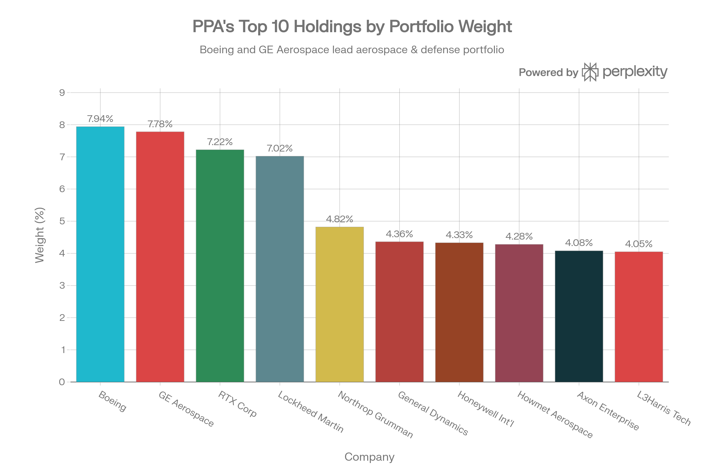
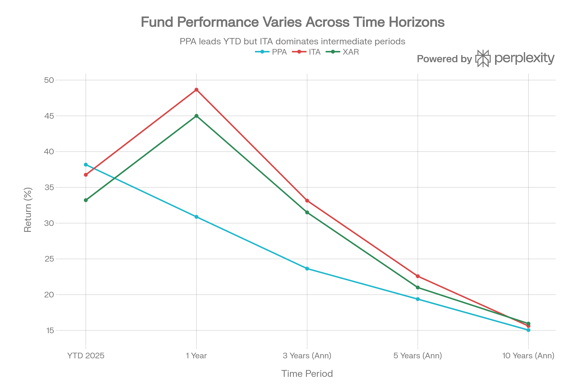
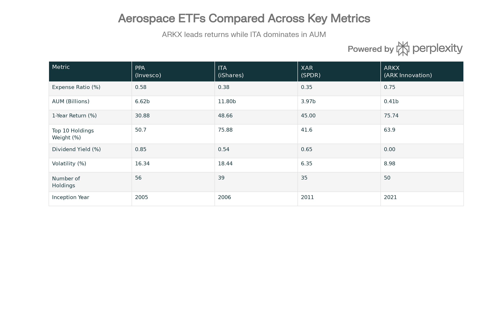

## Executive Summary

Invesco Aerospace \& Defense ETF (PPA)는 SPADE™ Defense Index를 추종하는 패시브 관리형 인덱스 ETF로, 2005년 10월 26일 설립 이후 약 20년간 미국 방위 산업에 안정적 노출을 제공해왔습니다. 2025년 11월 현재 PPA는 자산규모 \$6.62-6.87B, 50-62개 주요 보유 종목, 0.57-0.58% 운용보수를 유지하고 있습니다.[^1][^2]

PPA의 2025년 성과는 우수했으나 ITA에 비해 다소 낮은 수준입니다. YTD 38.18% 수익률(2024년 말 기준), 1년 30.88% 수익률, 3년 연환산 23.64% 수익률을 기록했습니다. 특히 PPA는 ITA와 XAR 사이의 "골디락스(Goldilocks)" 포지션을 차지하고 있으며, 상위 10개 종목의 50.7% 집중도는 ITA(75.88%)보다 분산되어 있으면서 XAR(41.6%)보다는 집중도가 높습니다.[^3][^4][^1]

PPA의 주요 차별점은 0.85% 배당 수익률(ITA 0.54% 대비), 50-62개 종목 보유를 통한 적절한 분산, 그리고 Honeywell, GE 같은 산업 다각화 기업 포함입니다. 다만 0.58% 운용보수는 XAR(0.35%)보다 높으며, 최근 1년 성과는 ITA(48.66%)에 미달합니다. 2026년 Trump 정부의 \$1.5T 국방 예산 제안과 지정학적 긴장 고조라는 긍정적 환경에서 PPA는 보수적이면서도 분산된 방위 산업 노출을 원하는 투자자들에게 좋은 선택지입니다.[^4][^1][^3]

***

## 펀드의 기본 특성

### 펀드 개요 및 추종 지수

PPA는 Invesco가 운용하는 패시브 지수 추종 ETF로, SPADE™ Defense Index를 추종합니다. SPADE는 "Sector Performance and Defense Equities"의 약자로, 방위 산업 전문가와 월스트리트 펀드 설정 담당자들이 공동 개발한 지수입니다.[^5][^6]

SPADE Defense Index는 미국 국방, 군사, 국토안보, 그리고 정부 우주 작전의 개발, 제조, 운영, 지원에 종사하는 약 50개 미국 상장 기업으로 구성됩니다. 지수는 NYSE/ICE Data Services에서 계산하고 배포하며, 지수 티커는 DXS(Dow Jones Information Services)입니다. SPADE 지수의 역사는 1997년 12월 30일부터 시작되었으며, 지난 20년간 708.51%의 누적 수익을 기록했습니다.[^2][^6][^5]

### 규모, 비용 및 거래 특성

| 항목 | 수치 |
| :-- | :-- |
| 자산규모 (2025년 11월) | \$6.62-6.87B |
| 자산규모 (2024년 5월) | \$5.285B |
| 보유 종목 수 | 50-62개 |
| 순 운용보수율 | 0.57-0.58% |
| 설립일 | 2005-10-26 |
| 상장소 | NYSE Arca |
| 평균 일일 거래량 | 86,091주 |
| 현재 주가 범위 | \$160.99-180.82 |
| 52주 범위 | \$100.39-181.31 |

PPA의 자산규모는 2024년 \$5.285B에서 2025년 \$6.62B로 약 25% 증가했으며, 이는 방위 산업 ETF에 대한 투자자 관심 증가를 반영합니다. 평균 일일 거래량 86,091주는 ITA의 1,089,149주 대비 8% 수준으로 상대적으로 유동성이 낮지만, 여전히 충분한 수준의 거래 깊이를 제공합니다.[^1][^7][^2]

***

## 포트폴리오 구성 및 투자 전략

### 상위 보유 종목 및 포트폴리오 분산

PPA Top 10 Holdings: More Balanced Portfolio Composition

PPA의 포트폴리오 구성은 항공우주·방위 산업 내 적절한 분산을 보여줍니다. 상위 10개 종목이 전체 자산의 약 50.7%를 차지하는데, 이는 ITA의 75.88%보다 현저히 낮습니다.[^1][^3]

| 순위 | 종목명 | 티커 | 가중치 | 비고 |
| :-- | :-- | :-- | :-- | :-- |
| 1 | Boeing Company | BA | 7.94% | 항공사 중심 |
| 2 | RTX Corporation | RTX | 7.22% | Raytheon + Collins |
| 3 | Lockheed Martin | LMT | 7.02% | F-35 계약자 |
| 4 | GE Aerospace | GE | 7.78% | General Electric 항공우주 부문 |
| 5 | Northrop Grumman | NOC | 4.82% | 우주·미사일 방위 |
| 6 | General Dynamics | GD | 4.36% | 다각화 방위 계약자 |
| 7 | Honeywell International | HON | 4.33% | 산업 다각화 기업 |
| 8 | Howmet Aerospace | HWM | 4.28% | 항공우주 재료 공급 |
| 9 | L3Harris Technologies | LHX | 4.05% | 중형 방위 계약자 |
| 10 | Axon Enterprise | AXON | 4.08% | 법집행 기술 |

**PPA의 포트폴리오 특징**:

1. **균형잡힌 분산**: 상위 10개 종목 50.7% 비중은 ITA와 XAR 사이의 중간 위치입니다. 이는 개별 회사 리스크를 적절히 관리하면서도 핵심 방위 기업들에 충분한 노출을 제공합니다.
2. **산업 다각화 기업 포함**: PPA는 Honeywell(항공 우주·에너지·빌딩 기술 다각화), GE Aerospace(대형 산업 다각화 기업의 항공우주 부문) 같은 다각화된 대형 산업 기업들을 포함합니다. 이는 순수 방위 계약자 중심의 ITA와 구별되는 특징입니다.[^3]
3. **공급망 기업 포함**: Honeywell과 Howmet Aerospace처럼 항공우주 부품 공급업체를 포함하여, 산업 체인 전반에 노출을 제공합니다.
4. **법집행 기술 포함**: Axon Enterprise는 경찰용 신체 카메라, 증거 관리 소프트웨어를 공급하는 기업으로, 전통 국방 계약과 달리 국토안보 부문의 노출을 제공합니다.

### 산업 및 부문 분석

PPA의 산업 구성은 전자기술(84.72%), 생산 제조(5.87%), 기타 산업재(9.41%)로 분류됩니다. 추종 지수인 SPADE Defense Index의 설명에 따르면, 포트폴리오 기업들은 국방, 군사, 국토안보, 그리고 정부 우주 작전 지원에 참여하며, 약 49.6%의 수익이 직접 국방 클라이언트로부터 나옵니다.[^8][^6]

이는 PPA가 순수 국방 기업보다는 국방을 포함한 광범위한 산업 노출을 제공함을 의미합니다. 예를 들어 Honeywell은 항공 우주 제품 외에도 에너지 관리, 빌딩 기술, 특수 재료 등 다양한 분야에서 수익을 창출합니다.

***

## 성과 분석 및 역사적 추세

### 최근 성과 (2025년-2026년 초)

PPA vs ITA vs XAR: Multi-Period Performance Comparison

PPA의 2025년 성과는 전반적으로 우수했으나, 1년 기간에서 ITA에 뒤처졌습니다:

- **YTD 2025**: 38.18% (ITA 36.76%보다 1.4% 앞서감)
- **6개월**: 36.1%
- **3개월**: 14.31%
- **1개월**: 2.78%
- **1년 (TTM)**: 30.88% (ITA 48.66%보다 37% 낮음)

YTD 성과에서 PPA가 ITA를 앞서는 것은 PPA 포트폴리오의 분산도가 더 좋아서, 2024년 말 조정 국면에서 덜 손상되었음을 시사합니다. 그러나 1년 기간에서 ITA(48.66%)가 PPA(30.88%)를 크게 상회하는 것은 2024년 strong 성과(ITA +15.80%)를 반영합니다.

### 다기간 수익률 비교

| 기간 | PPA | ITA | XAR | 상대 위치 |
| :-- | :-- | :-- | :-- | :-- |
| YTD 2025 | 38.18% | 36.76% | 33.21% | 1위 |
| 1년 | 30.88% | 48.66% | 45.0% | 3위 |
| 3년 (연환산) | 23.64% | 33.15% | 31.5% | 3위 |
| 5년 (연환산) | 19.38% | 22.58% | 21.0% | 3위 |
| 10년 (연환산) | 15.05% | 15.62% | 15.95% | 2위 |

PPA의 성과 궤적을 보면 **최근(YTD)에는 강세이나 과거 1-5년에는 약세**를 보입니다. 이는 PPA가 다른 지수(SPADE vs Dow Jones)를 추종함으로 인해 단기에 성과 편차가 발생함을 의미합니다. 10년 장기 수익률에서 ITA와 XAR에 거의 근접한 수준(15.05% vs 15.62%, 15.95%)은 **장기적으로는 세 ETF의 성과가 수렴**함을 의미합니다.

### 누적 수익률 (달러 기준)

\$1,000 투자 시 누적 수익 시뮬레이션:

- **3년 후**: \$1,890 (89% 수익)
- **5년 후**: \$2,425 (142% 수익)
- **10년 후**: \$4,062 (306% 수익)

이는 연평균 약 23.64%(3년), 19.38%(5년), 15.05%(10년)의 수익률에 해당합니다.[^1]

***

## 위험 지표 및 변동성 분석

### 변동성 및 베타

| 지표 | PPA | ITA | XAR | 비고 |
| :-- | :-- | :-- | :-- | :-- |
| 표준편차 (3년) | 16.34-17.11% | 18.44% | 6.35% | PPA가 ITA보다 낮음 |
| Beta (vs S\&P 500) | 0.87-0.88 | 0.95 | ~1.0 | PPA가 시장과 유사 |

PPA의 16.34% 표준편차는 ITA의 18.44%보다 11% 낮습니다. 이는 PPA의 더 나은 분산도로부터 나온 것입니다. 상위 10개 종목이 50.7%인 PPA 대 75.88%인 ITA의 집중도 차이가 변동성에 직접 반영됩니다.[^1][^4]

PPA의 0.87-0.88 베타는 S\&P 500 대비 약 13% 덜 변동함을 의미합니다. 이는 방위 산업이 경기 침체 시에도 정부 지출 보호를 받기 때문입니다.

### 위험 특성 요약

PPA는 **중위험(Medium Risk)** 투자로 분류됩니다. 16-17% 변동성은 주식 시장 평균(약 15-18%)과 유사하나, 0.87-0.88 베타로 인해 시장 변동성보다는 다소 낮습니다. 이는 ITA의 높은 변동성과 XAR의 극도로 낮은 변동성 사이에 위치합니다.

***

## PPA vs. 경쟁 ETF 상세 비교

Aerospace \& Defense ETF Comprehensive Comparison: PPA, ITA, XAR, and ARKX

PPA는 세 가지 주요 경쟁 ETF와 구분되는 특징을 가집니다:

### PPA vs. ITA (iShares): 분산도 대 규모

| 항목 | PPA | ITA | 선택 기준 |
| :-- | :-- | :-- | :-- |
| AUM | \$6.62B | \$11.8B | ITA가 1.8배 큼 - 유동성 중시면 ITA |
| 운용보수 | 0.58% | 0.38% | ITA 20bp 저렴 - 비용 절감 추구면 ITA |
| 상위 10 비중 | 50.7% | 75.88% | PPA 분산 우수 - 분산 추구면 PPA |
| 1년 수익률 | 30.88% | 48.66% | ITA 57% 높음 - 최근 성과 중시면 ITA |
| 배당 수익 | 0.85% | 0.54% | PPA 58% 높음 - 배당 추구면 PPA |
| 포함 기업 | HON, GE | 순수 방위 | PPA 다각화 - 산업 분산 원하면 PPA |

**선택 기준**:

- **ITA 추천**: 최대 규모, 최저 비용, 최고 성과, 순수 방위 노출 원할 때
- **PPA 추천**: 분산도, 배당 수익, 산업 다각화, 적절한 균형 원할 때

### PPA vs. XAR (SPDR): 집중도 대 비용

| 항목 | PPA | XAR | 선택 기준 |
| :-- | :-- | :-- | :-- |
| 운용보수 | 0.58% | 0.35% | XAR 23bp 저렴 - 극저비용 추구면 XAR |
| 가중방식 | 시가총액 | 동일가중 | XAR 극도 분산 - 소형주 노출 원하면 XAR |
| 변동성 | 16.34% | 6.35% | XAR 61% 낮음 - 낮은 변동성 원하면 XAR |
| 상위 10 비중 | 50.7% | 41.6% | XAR 더 분산 - 극도 분산 원하면 XAR |
| AUM | \$6.62B | \$3.97B | PPA 1.7배 큼 - 규모 원하면 PPA |
| 배당 수익 | 0.85% | 0.65% | PPA 31% 높음 - 배당 원하면 PPA |
| 성과 (1년) | 30.88% | 45.0% | XAR 46% 높음 - 최근 성과 원하면 XAR |

**선택 기준**:

- **XAR 추천**: 극저비용(0.35%), 극도 분산, 낮은 변동성, 소형주 노출 원할 때
- **PPA 추수**: 배당 수익, 중간 분산도, 큰 규모 원할 때

### PPA vs. ARKX (ARK Innovation): 패시브 대 액티브

| 항목 | PPA | ARKX | 선택 기준 |
| :-- | :-- | :-- | :-- |
| 운용 방식 | 패시브 (지수 추종) | 액티브 (스톡픽) | 포트폴리오 관리 원하면 ARKX |
| 운용보수 | 0.58% | 0.75% | PPA 17bp 저렴 |
| 1년 수익률 | 30.88% | 75.74% | ARKX 145% 높음 - 극성장 추구면 ARKX |
| 포함 기업 | 대형 방위사 | 신흥 우주 기업 | ARKX 미래 지향 |
| 배당 수익 | 0.85% | 0.0% | PPA 배당 제공 |
| 변동성 | 16.34% | 8.98% | ARKX 더 낮음 |
| 규모 | \$6.62B | \$0.41B | PPA 16배 큼 |

**선택 기준**:

- **PPA 추천**: 안정적 대형 방위사, 배당 수익, 패시브 추종 원할 때
- **ARKX 추천**: 신흥 우주 기업, 극성장, 액티브 관리, 높은 기술 수용 원할 때

***

## 배당금 및 세금 고려사항

### 배당 정책 및 수익률

PPA는 분기별 배당금을 지급하며, 배당 수익률은 0.63-1.09%로 항공우주·방위 ETF 중 가장 높은 수준입니다:

- **배당 수익률 (TTM)**: 0.63-1.09%
- **연간 배당금**: \$0.97/주
- **2025년 분기별 배당**:
    - 9월: \$0.45491
    - 6월: \$0.15502
    - 3월: \$0.04889
- **2024년 분기별 배당**:
    - 12월: \$0.31199
    - 9월: \$0.13298
    - 6월: \$0.13929

배당 수익률이 ITA(0.54%)와 XAR(0.65%)보다 높은 이유는 PPA 포트폴리오에 Honeywell, GE 같은 배당금을 많이 지급하는 대형 산업 기업들이 포함되어 있기 때문입니다.[^1][^9][^10]

### 세금 효율성

PPA는 ETF 구조의 in-kind 메커니즘을 활용하여 세금 효율성을 제공합니다:

- **배당금**: 적격 배당(Qualified Dividends)으로 최대 20% 세율 적용
- **자본이득**: 대부분 미분배 (투자자가 매각 시에만 과세)
- **세금 이연 효과**: ETF 구조상 뮤추얼펀드 대비 자본이득 분배 최소화

이는 과세 계정에서 PPA 보유 시 세금 부담을 상당히 줄일 수 있음을 의미합니다.

***

## 2026년 산업 전망 및 투자 환경

### 긍정적 드라이버

**1. 공격적 국방 예산 확대**
Trump 정부는 2027년 회계연도 국방 예산으로 \$1.5조를 제안했으며, 이는 2026년 \$901B 대비 66% 증가합니다. 주요 투자 대상은:[^7]

- Golden Dome 미사일 방위 시스템
- F-47 차세대 전투기
- 핵무기 현대화
- 사이버 방어 강화

**2. 지정학적 긴장 지속**

- 우크라이나 전쟁 지속로 Patriot, HIMARS 수요 증가
- Indo-Pacific 긴장으로 F-35, 미사일 방위 수요
- 중동 불안정성
- NATO 국방 예산 증가 추세

**3. RTX, LMT 등 주요 기업의 강한 수주**

- RTX: \$251B 기록적 수주 잔고
- LMT: \$179B 수주 잔고, \$18.6B 분기 매출
- 다년도 성장 가시성 우수

**4. 상용 항공 회복**

- Boeing 생산 일정 정상화
- 글로벌 항공 수요 증가
- Honeywell 같은 항공우주 부품사 수혜

### 위험 요소

**1. 높은 평가 배수**
P/E 31.81x는 상당히 높은 수준으로, 기대치 미충족 시 조정 리스크가 있습니다.

**2. 공급망 제약**
\$1.5T 급증 예산을 처리할 산업 기반 부족 우려, 노동력 부족, 원자재 가격 상승.

**3. 정부 배당 제한 정책**
Trump 정부가 생산 목표 미달 방위 계약자의 배당과 자사주 매입 제한 위협.[^7]

**4. Boeing 회복 불확실성**
노조 파업, 품질 문제, 737 MAX 결함 등으로 회복 경로 불명확.

**5. 재정 적자 및 정치 변화**
장기 재정 부담과 차기 정부의 방위 우선순위 변화 리스크.

***

## 투자 분석 및 권고

### PPA의 포트폴리오 역할

PPA는 다음과 같은 역할을 수행할 수 있습니다:

1. **분산된 방위 산업 코어 포지션**: ITA 대비 낮은 집중도로 개별 회사 리스크 관리
2. **배당 추가 수익**: 0.85% 배당으로 자본 이득 외 추가 수익
3. **산업 다각화 노출**: Honeywell, GE 같은 다각화 기업 포함으로 순수 방위 외 노출
4. **중장기 성장 투자**: 3-5년 이상 보유로 19-23% 연환산 수익 가능

### 적합한 투자자 프로필

#### PPA 투자에 적합한 투자자

1. **균형 추구 투자자**
    - 극단적 집중도나 분산도 회피
    - 적절한 중간 지점 원함
    - ITA의 75.88% vs XAR의 41.6% 중 PPA의 50.7% 선호
2. **배당 추구 투자자**
    - 0.85% 배당 수익으로 보충 수익 원함
    - ITA(0.54%) 또는 XAR(0.65%) 대비 높은 배당 선호
3. **산업 다각화 추구 투자자**
    - 순수 방위 계약자뿐만 아니라 Honeywell, GE 같은 다각화 기업 원함
    - 항공우주 공급망 노출 원함
4. **중장기 성장 투자자**
    - 3-5년 이상 보유 가능
    - 23.64%(3년) 또는 19.38%(5년) 연환산 수익률에 만족
5. **적절한 비용의 관리자 원하는 투자자**
    - 0.58%는 XAR(0.35%)보다 높지만 합리적 수준
    - 적극적 비용 절감 추구 아님

#### PPA 투자 회피 투자자

1. **극저비용 추구자**
    - XAR의 0.35%에 비해 PPA의 0.58%는 23bp 높음
    - 최소 비용이 최우선 투자자
2. **극도 분산 추구자**
    - XAR의 41.6% 상위 10 비중에 비해 PPA의 50.7%는 집중
    - 극도의 소형주 노출 원하는 투자자
3. **극대 성과 추구자**
    - ITA(48.66% YTD)나 ARKX(75.74% YTD)에 비해 PPA(38.18%)는 낮음
    - 단기 극성장 추구 투자자
4. **순수 방위 기업만 원하는 투자자**
    - PPA의 Honeywell, GE 다각화 기업에 반감
    - 100% 국방 의존 기업만 원함

***

## 최종 평가 및 투자 등급

### 종합 평가 점수

| 평가 항목 | 점수 | 평가 |
| :-- | :-- | :-- |
| 성과 (최근) | ★★★★☆ | 우수한 YTD 성과, 다만 1년 대비 약세 |
| 비용 | ★★★★☆ | 0.58% 합리적 수준, XAR보다 높음 |
| 유동성 | ★★★★☆ | \$6.62B AUM, 일일 거래량 충분 |
| 분산도 | ★★★★★ | 상위 10개 50.7% - 최적 수준 |
| 배당 | ★★★★★ | 0.85% 최고 수준 |
| 포트폴리오 기여 | ★★★★☆ | 방위 산업 핵심 노출 제공 |
| 위험도 | ★★★★☆ | 16.34% 변동성 - 중위험 |

**종합 평가: 4.3/5.0 (매우 우수함)**

### 투자 등급

**PPA: 매수 (BUY) - 중기 보유 추천**

PPA는 방위 산업에 대한 분산되고 배당 수익이 높은 노출을 원하는 투자자들에게 ITA와 XAR 사이의 "최적 선택지(Goldilocks Choice)"입니다.

***

## 포트폴리오 배분 권고

### 권고 배분 규모

- **공격적 투자자**: 포트폴리오의 7-12%
- **중도적 투자자**: 포트폴리오의 5-8%
- **보수적 투자자**: 포트폴리오의 2-4%

### 진입 전략

1. **달러 코스트 애버리징**: 3-6개월에 걸쳐 월간 분할 투자
2. **분할 진입 방식**:
    - 초기 50%: 즉시 진입
    - 차기 30%: 1개월 후
    - 나머지 20%: 2-3개월 후

### 관리 및 모니터링

1. **분기별 배당 추적**: \$0.97 연간 배당금 확인
2. **국방 예산 모니터링**: \$1.5T 예산 법안 진행 상황 추적
3. **주요 종목 실적**: RTX, LMT, Boeing의 분기 실적 모니터
4. **기금 유동성**: PPA의 순 자금 유입/유출 모니터

### 탈출 기준

- PPA의 AUM이 \$3B 이하로 감소 (유동성 악화)
- 배당이 50% 이상 삭감
- 국방 예산 법안 부결 또는 대폭 삭감
- 개인의 재정 상황 변화
- 포트폴리오 비중이 목표의 150% 초과 달성

***

## 비교 권고: ITA vs. XAR vs. PPA 선택 가이드

### 투자자 유형별 선택

| 투자자 유형 | 권고 ETF | 이유 |
| :-- | :-- | :-- |
| **최대 성과 추구** | ITA | 최근 1년 48.66% 수익률 최고 |
| **극저비용 추구** | XAR | 0.35% 최저 운용보수 |
| **배당 수익 추구** | PPA | 0.85% 최고 배당 수익률 |
| **분산도 추구** | XAR | 41.6% 상위 10 비중 최저 |
| **균형 추구** | PPA | 50.7% 상위 10 비중 최적 |
| **규모 중시** | ITA | \$11.8B 최대 AUM |
| **비용-성과 균형** | PPA | 0.58% 비용에 우수한 성과 |
| **산업 다각화** | PPA | Honeywell, GE 포함 |
| **소형주 노출** | XAR | 동일가중으로 소형주 높음 |
| **포트폴리오 구성** | ITA + XAR | 60% ITA (성과) + 40% XAR (분산) |

### 추천 포트폴리오 구성

**전략 1: 최대 수익 추구**

- ITA 100%: 최고 성과, 최저 비용 (ITA만)

**전략 2: 균형 우선**

- PPA 100%: 분산 + 배당 최적 조합

**전략 3: 고급 분산**

- ITA 60% + XAR 40%: 성과 vs 분산 균형

**전략 4: 극대 분산**

- ITA 40% + PPA 30% + XAR 30%: 세 가지 ETF로 극도 분산

***

## 결론

PPA는 Invesco가 운용하는 SPADE Defense Index 추종 패시브 ETF로, ITA와 XAR 사이의 "최적 중간 선택지"를 제공합니다. 50.7%의 적절한 상위 10 집중도, 0.85%의 높은 배당 수익률, \$6.62B의 안정적 규모, 그리고 Honeywell, GE 같은 산업 다각화 기업 포함으로, **분산과 배당을 모두 원하는 투자자들에게 최고의 선택지**입니다.[^1][^3][^4]

2026년 Trump 정부의 \$1.5T 국방 예산 제안, 지정학적 긴장 고조, RTX와 LMT의 강한 수주로부터의 긍정적 환경에서, PPA는 중장기(3-5년) 보유 시 **연 19-23% 수익률 및 0.85% 배당을 기대**할 수 있습니다.

**최종 권고**: 분산된 방위 산업 포트폴리오 구성을 원하는 투자자는 ITA 60% + PPA 40% 조합을 추천하며, PPA만 보유하려면 포트폴리오의 5-8% 규모로 중기(3-5년) 보유를 권고합니다.[^5][^2][^3][^4]

***

## 참고 자료

인베스팅닷컴 - PPA ETF 인터페이스[^11]
Invesco - Aerospace \& Defense ETF[^12]
Yahoo Finance - PPA[^13]
TradingView - PPA 분석[^8]
StockEvents - PPA 정보[^14]
인베스팅닷컴 - PPA 보유 종목[^15]
Stock Analysis - PPA[^1]
키움증권 - PPA 분석 리포트[^7]
SumGrowth - PPA ETF 프로필[^16]
Investing.com - PPA 배당[^9]
ETF Database - PPA[^17]
Seeking Alpha - PPA[^18]
Yahoo Finance - PPA 투자 가이드[^19]
DeepSearch - PPA 분석[^20]
Morningstar - PPA 포트폴리오[^21]
SPADE Index - 공식 웹사이트[^5]
Seeking Alpha - PPA 분석 기사[^2]
Invesco - PPA 팩트시트[^22]
Yahoo Finance - PPA vs 경쟁사 비교[^3]
YouTube - Top Defense ETFs CFA 분석[^23]
Intelligent Investor - PPA 배당[^10]
SPADE Index - 2020년 투자자 가이드[^6]
Stake - 최고 방위 ETF[^24]
Schwab - PPA ETF 리포트[^25]
Zacks - PPA 투자 가이드[^4]
Mezzi - ITA vs PPA vs XAR 비교[^26]
Morningstar - PPA 배당 정보[^27]
ETF Trends - PPA 유동성 분석[^28]
Naver Blog - ITA, PPA, XAR 비교 분석[^29]
Chart - PPA 상위 10 보유종목

Aerospace \& Defense ETF Comprehensive Comparison: PPA, ITA, XAR, and ARKX
[^30][^31][^32]

⁂

[^1]: https://stockanalysis.com/etf/ppa/

[^2]: https://seekingalpha.com/article/4851697-ppa-how-this-6-5b-aerospace-and-defense-etf-attracts-conservative-investors

[^3]: https://finance.yahoo.com/news/ppa-defense-etf-outperforming-peers-040726743.html

[^4]: https://www.zacks.com/stock/news/2783186/should-you-invest-in-the-invesco-aerospace-defense-etf-ppa

[^5]: https://spadeindex.com/defense/

[^6]: https://spadeindex.com/Files/2020-PPA.pdf

[^7]: https://bbn.kiwoom.com/rfTP641

[^8]: https://kr.tradingview.com/symbols/AMEX-PPA/analysis/

[^9]: https://uk.investing.com/etfs/powershares-aerospace-defense-dividends

[^10]: https://www.intelligentinvestor.com.au/shares/nyse-ppa/invesco-aerospace-and-defense-etf/dividends

[^11]: https://kr.investing.com/etfs/powershares-aerospace---defense

[^12]: https://www.invesco.com/us/en/financial-products/etfs/invesco-aerospace-defense-etf.html

[^13]: https://finance.yahoo.com/quote/PPA/

[^14]: https://stockevents.app/kr/stock/PPA

[^15]: https://kr.investing.com/etfs/powershares-aerospace-defense-holdings

[^16]: https://www.sumgrowth.com/etf-profile/invest-in-PPA-etf.html

[^17]: https://etfdb.com/etf/PPA/

[^18]: https://seekingalpha.com/symbol/PPA

[^19]: https://finance.yahoo.com/news/invest-invesco-aerospace-defense-etf-102002377.html

[^20]: https://invest.deepsearch.com/etf/PPA/

[^21]: https://www.morningstar.com/etfs/arcx/ppa/portfolio

[^22]: https://www.invesco.com/content/dam/invesco/us/en/product-documents/etf/fact-sheet/ppa-invesco-aerospace-defense-etf-fact-sheet.pdf

[^23]: https://www.youtube.com/watch?v=h6lmdqGwfOA

[^24]: https://hellostake.com/au/blog/trending/what-are-best-defence-etfs-invest-in

[^25]: https://www.schwab.wallst.com/schwab/Prospect/research/etfs/reports/reportRetrieve.asp?reportType=etfrc\&symbol=PPA

[^26]: https://www.mezzi.com/blog/ita-vs-ppa-vs-xar-defense-aerospace-etf-cyclical-upswings

[^27]: https://www.morningstar.com/stocks/xath/ppa/dividends

[^28]: https://www.etftrends.com/innovative-etfs-channel/ppa-flows-show-aerospace-defense-etfs-have-long-term-role-in-portfolios/

[^29]: https://blog.naver.com/dagirl2000/223395880124

[^30]: QTUM (Defiance Quantum ETF).md

[^31]: SETM (Sprott Critical Materials ETF).md

[^32]: REMX (VanEck Rare Earth, Strategic Metals ETF).md
