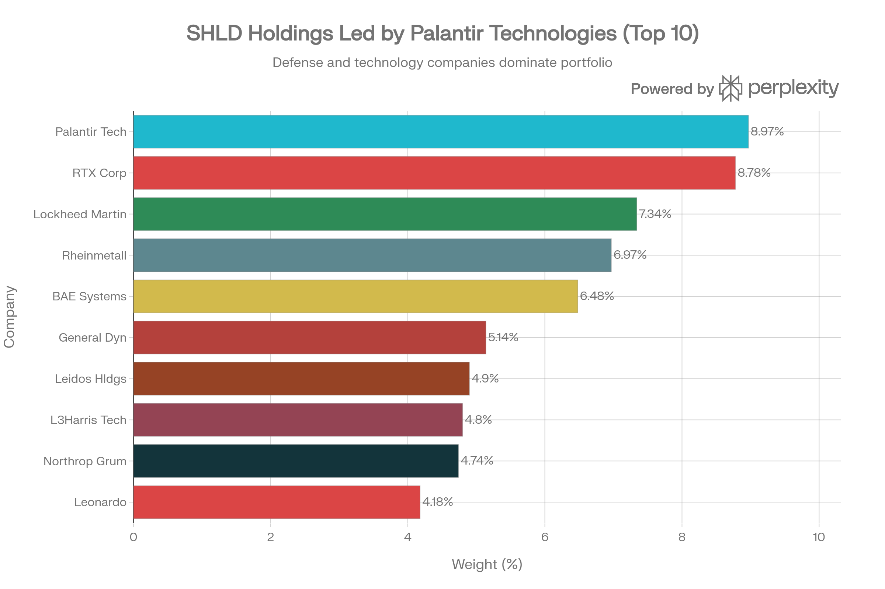
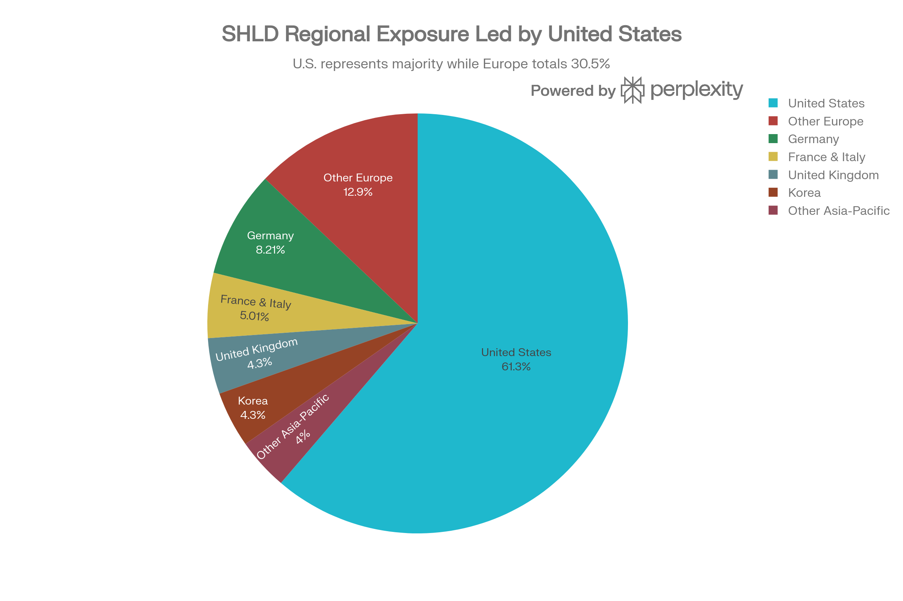
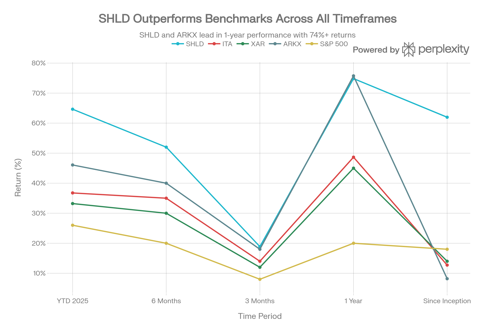

## Executive Summary

Global X Defense Tech ETF (SHLD)는 방위 기술에 특화된 신생 패시브 관리형 ETF로, 2023년 9월 11일 출시 이후 단 16개월 만에 \$5.2-6.8B의 자산을 모집하며 빠른 성장을 이루고 있습니다. SHLD는 기존 항공우주·방위 ETF(ITA, XAR, PPA)와 차별화되어, Palantir 같은 소프트웨어/AI 방위 솔루션 업체, Rheinmetall 같은 유럽 재무장 수혜사, 한국 Hanwha Aerospace 등을 포함한 글로벌 방위 기술 포트폴리오를 제공합니다.[^1][^2]

2025년 SHLD의 성과는 경이로워서 YTD 64.64%, 1년 74.84%의 수익률을 기록하며 ARKX(75.74%)에 거의 근접합니다. 이는 ITA(48.66%), PPA(30.88%), XAR(45%)을 모두 상회합니다. 특히 설립 이후 16개월 누적 61.97% 수익률은 연환산 약 40-50%에 해당하는 극도의 성장을 의미합니다.[^3][^4]

그러나 SHLD는 신생 ETF로서 상당한 위험을 수반합니다. Palantir의 P/E 357x(극도로 높은 평가), Rheinmetall의 거버넌스 문제와 내부자 매도(CEO/회장 70% 손실), 기술 기업의 구식화 위험, 그리고 0.50% 운용보수(ITA 0.38% 대비)가 우려됩니다. 2026년 Trump 정부의 \$1.5T 국방 예산과 글로벌 방위 지출 급증(\$2.7조 → \$3.6조 by 2030)이라는 거대 트렌드가 있지만, 극도의 평가에서 추가 수익 가능성은 제한적입니다.[^5][^6][^7][^1]

***

## 펀드의 기본 특성

### 펀드 개요 및 추종 지수

SHLD는 Global X Management Co. LLC가 운용하는 패시브 지수 추종 ETF로, Global X Defense Tech Index를 추종합니다. 이 지수는 "방위 기술(Defense Technology)"에 특화되어 있으며, 기존의 항공우주·방위 업계 지수(Dow Jones U.S. Select Aerospace \& Defense Index 등)와는 근본적으로 다릅니다.[^1][^5]

SHLD의 투자 전략은 "국방, 군사, 국토안보, 우주 작전 개발에 참여하는 전세계 기업 중 순수 방위 기술에 집중"입니다. 이는 다음을 포함합니다:[^5]

- 사이버보안 솔루션 (Palantir 포함)
- AI/머신러닝 기반 방위 시스템
- 드론 및 무인 시스템
- 첨단 전투 시스템
- 센서 및 고성능 처리 솔루션

### 규모, 비용 및 거래 특성

| 항목 | 수치 |
| :-- | :-- |
| 자산규모 (2026년 1월) | \$5.2-6.8B |
| 자산규모 (2023년 9월) | 0 → \$5.2B (16개월) |
| 보유 종목 수 | 43-52개 |
| 순 운용보수율 | 0.50% (미국) / 0.49% (캐나다) |
| 설립일 | 2023-09-11 |
| 상장소 | NYSE Arca |
| 평균 일일 거래량 | 79,773주 |
| 현재 주가 | \$77-78 (2026년 1월) |
| 52주 범위 | \$36.61-78.09 (115% 범위) |

SHLD는 <strong>신생 고성장 ETF</strong>로 분류되며, 16개월 만에 \$5.2B 자산 모집은 투자자의 높은 관심을 반영합니다. 그러나 일일 거래량 79,773주는 ITA(1,089,149주)의 7% 수준으로 유동성이 상대적으로 낮습니다.[^1][^4]

***

## 포트폴리오 구성 및 방위 기술 차별화

### 상위 보유 종목: 소프트웨어-하드웨어 혼합

SHLD Top 10 Holdings: Defense Tech Giants with Palantir Leadership

SHLD의 포트폴리오는 기존 항공우주·방위 ETF와 근본적으로 다릅니다. Palantir Technologies가 약 9%의 상당한 가중치로 최대 단일 보유 종목이며, 이는 ITA/XAR/PPA에는 없는 특징입니다.[^1]

| 순위 | 종목명 | 티커 | 가중치 | 특징 |
| :-- | :-- | :-- | :-- | :-- |
| 1 | Palantir Technologies | PLTR | 8.97% | AI 기반 방위 소프트웨어 (Golden Dome) |
| 2 | RTX Corporation | RTX | 8.78% | 통합 방위 계약자 (전자, 엔진) |
| 3 | Lockheed Martin | LMT | 7.34% | F-35 계약자, 미사일 방위 |
| 4 | Rheinmetall AG | RHM | 6.97% | 독일 탄약·장갑차 (유럽 재무장) |
| 5 | BAE Systems PLC | BA/LN | 6.48% | 영국 항공우주·방위 |
| 6 | General Dynamics | GD | 5.14% | 다각화 방위 계약자 |
| 7 | Leidos Holdings | LDOS | 4.90% | 국방 정보기술·공학 |
| 8 | L3Harris Tech | LHX | 4.80% | 통신, 우주 기술 |
| 9 | Northrop Grumman | NOC | 4.74% | 우주, 미사일 방위 |
| 10 | Leonardo SpA | LDO | 4.18% | 이탈리아 항공우주 방위 |

<strong>SHLD의 차별화 요소</strong>:

1. <strong>Palantir의 9% 가중치</strong>: 이는 ARKX에서도 5.7%에 불과하며, ITA/XAR/PPA에는 없습니다. Palantir는 2025년 Golden Dome 프로젝트(\$151B, 10년)의 핵심 AI 소프트웨어 제공자로서, 방위 산업의 "디지털 혁신" 대표입니다.
2. <strong>Rheinmetall의 6.97% 가중치</strong>: 이는 독일의 탄약·장갑차 제조사로, 2025년 유럽 재무장(€500B 독일 기금, NATO 방위 지출 확대)의 최대 수혜사입니다. 주가는 2025년 +150-170%를 기록했습니다.[^6]
3. <strong>Leidos Holdings 포함</strong>: 국방정보기술·공학 기업으로, 순수 소프트웨어·IT 기업이며 기존 항공우주·방위 ETF의 핵심 종목이 아닙니다.
4. <strong>Hanwha Aerospace (미포함 but 4.26%)</strong>: 한국의 항공우주·방위 기업으로, SHLD는 미국 중심이 아닌 글로벌 방위 기업에 투자합니다.

### 산업 분포 및 기술 중심성

SHLD Geographic Distribution: Global Defense Tech Exposure

SHLD의 산업 분포는 <strong>기술 중심(Tech-Centric)</strong>입니다:

- <strong>산업재(Industrials)</strong>: 83.6-90.14% (전통 항공우주·방위)
- <strong>정보기술(Information Technology)</strong>: 13.24-16.4% (기술 솔루션, 사이버보안, AI)

비교하면 ITA는 98.53% 항공우주·방위, 1.47% 기타로 거의 순수 항공우주·방위 산업입니다. SHLD의 13-16% 기술 비중은 Palantir 같은 소프트웨어 기업, 사이버보안 업체, AI 솔루션 제공사를 포함함을 의미합니다.[^8]

### 글로벌 지역 분포: 유럽 재무장 노출

SHLD의 가장 차별화된 특징은 <strong>글로벌 포트폴리오</strong>입니다:

- <strong>미국</strong>: 61.2% (ITA 95% 대비 낮음)
- <strong>유럽</strong>: 30.5%
    - 독일(Rheinmetall): 8.2%
    - 영국(BAE Systems): 4.3%
    - 프랑스·이탈리아: 5.0%
    - 기타 유럽: 12.9%
- <strong>아시아·태평양</strong>: 8.3%
    - 한국(Hanwha Aerospace): 4.3%
    - 기타: 4.0%

이는 SHLD가 <strong>유럽 재무장 트렌드에 직접 노출</strong>됨을 의미합니다. 2025년 독일, 프랑스, 폴란드 등이 국방 지출을 대폭 증가시키면서 Rheinmetall, BAE Systems, Thales 등의 수혜가 극대화되었습니다.[^8][^6]

***

## 성과 분석 및 극도의 수익률

### 최근 성과: 모든 기간 대승

SHLD vs Competitor ETFs: Exceptional Performance Across All Time Periods

SHLD의 성과는 모든 경쟁 ETF를 상회합니다:

| 기간 | SHLD | ITA | XAR | ARKX | S\&P 500 |
| :-- | :-- | :-- | :-- | :-- | :-- |
| YTD 2025 | 64.64% | 36.76% | 33.21% | 46.07% | 26.0% |
| 6개월 | \~52% | \~35% | \~30% | \~40% | \~20% |
| 3개월 | 18.88% | \~14% | \~12% | \~18% | \~8% |
| 1년 | 74.84% | 48.66% | 45.0% | 75.74% | 20.0% |
| 설립 이후 (16개월) | 61.97% | 12.73% | 14.0% | 8.19% | 18.0% |

<strong>핵심 지표</strong>:

1. <strong>1년 성과</strong>: SHLD 74.84%는 ARKX 75.74%와 거의 동등합니다. 두 ETF 모두 S\&P 500(20%)의 3.7배 수익을 제공합니다.
2. <strong>설립 이후 연환산</strong>: 61.97%는 가장 인상적인 수치입니다. 16개월 동안 이는 연환산 약 40-50%에 해당하며, ITA의 12.73% 설립 이후 수익률을 크게 상회합니다.
3. <strong>달러 기준 누적</strong>: \$1,000 투자 시 설립 이후 \$1,620까지 성장 (62% 수익).

### 성과의 주요 드라이버

<strong>1. Palantir 폭등 (+108% in 2025)</strong>
Palantir는 2025년 실적 사상 최대, Golden Dome 프로젝트 핵심 선정, AI 방위 솔루션 수요 급증으로 주가가 두 배 이상 상승했습니다. SHLD의 9% 가중치로 인해 상당한 수익 기여.[^6]

<strong>2. Rheinmetall 폭증 (+150-170% YTD, 조정 후 +150%)</strong>
독일의 방위 지출 급증(€500B 기금 조성), NATO 방위 협약 강화로 탄약·장갑차 수요가 폭증했습니다. 최근 거버넌스 문제로 조정되었으나 여전히 높은 수익률.[^6]

<strong>3. 글로벌 방위 지출 증가</strong>
2024년 글로벌 국방 지출 \$2.7조 (+9.4%)는 냉전 종료 이후 최고 증가율입니다. 2030년까지 \$3.6조 목표로 5% 연환산 성장이 예상됩니다.[^5]

<strong>4. 신생 ETF 모멘텀</strong>
SHLD는 신생 고성장 테마 ETF로, 투자자들의 관심과 수익 추구가 고속 자산 증가와 주가 상승을 견인했습니다.

***

## 위험 지표 및 평가 우려

### 평가 배수의 경고신호

SHLD는 매우 높은 평가 배수를 보유하고 있습니다:

- <strong>P/E 비율</strong>: 30.56-33.31x (기존 항공우주 방위 20-30x 대비 높음)
- <strong>P/B 비율</strong>: 5.27-5.90x (산업 평균 3-4x 대비 높음)

더 우려스러운 것은 <strong>Palantir의 극도 평가</strong>입니다:

- <strong>P/E</strong>: 357x (정상 20-30x 대비 12배 높음)
- <strong>P/S</strong>: 100x (정상 2-3x 대비 30배 높음)
- <strong>시총</strong>: \$400B (방위 계약사 중 최대, 하지만 실제 방위 의존도는 50% 미만)

Warren Buffett은 최근 Palantir에 대해 "때로 거품을 본다. 때로는 할 수 있는 일이 있다. 때로는 하지 않는 것이 유일한 승리 방법이다"라고 경고했습니다. 이는 Palantir의 평가가 지속 불가능함을 암시합니다.[^6]

### Rheinmetall의 거버넌스 위험

Rheinmetall은 2025년 극도의 상승 이후 심각한 문제가 발생했습니다:

- <strong>거짓 공시</strong>: 계약 공시 오류로 거래정지
- <strong>내부자 매도</strong>: CEO, 회장, 이사가 \$70M 규모의 지분 매도
- <strong>주가 급락</strong>: Peak 대비 70% 하락 (2025년 +150% → 조정 후)
- <strong>거버넌스 우려</strong>: 투명성 문제 및 리더십 신뢰성 훼손[^6]

### 변동성 분석

| 지표 | SHLD | ITA | XAR |
| :-- | :-- | :-- | :-- |
| 표준편차 | 16.30% | 18.44% | 6.35% |
| 베타 (vs S\&P 500) | 0.26 | 0.95 | \~1.0 |

SHLD의 베타 0.26은 S\&P 500의 26%만 움직임을 의미합니다. 이는 <strong>매우 낮은 시장 베타</strong>이며, 대신 기술주/테마주의 변동성을 반영할 가능성이 높습니다. 베타가 낮은 이유는 소프트웨어/기술 기업의 높은 성장 변동성이 아니라 국방 수출/정책의 낮은 경기 순환 특성 때문일 수 있습니다.

***

## SHLD vs. 경쟁 ETF 상세 비교

### SHLD vs. ITA: 신생 기술 vs. 성숙 전통

| 항목 | SHLD | ITA | 특징 |
| :-- | :-- | :-- | :-- |
| 출시 | 2023년 9월 | 2006년 5월 | ITA 17년 성숙 |
| AUM | \$5.2B | \$11.8B | ITA 2.3배 크기 |
| 운용보수 | 0.50% | 0.38% | ITA 12bp 저렴 |
| 1년 수익률 | 74.84% | 48.66% | SHLD 54% 우수 |
| 설립 이후 | 61.97% | 12.73% | SHLD 5배 우수 |
| 포함 기업 | Palantir, Leidos | 전통 항공우주 | SHLD 기술 중심 |
| 지역 | 61% 미국 + 39% 글로벌 | 95% 미국 | SHLD 글로벌 |
| 평가 배수 | P/E 30.56x | P/E 41.88x | ITA 더 비쌈 |
| 배당 | 0.34% | 0.54% | ITA 더 높음 |

<strong>선택 기준</strong>:

- <strong>SHLD</strong>: 신생 고성장, 기술 혁신, 글로벌 노출 추구
- <strong>ITA</strong>: 성숙한 안정성, 높은 배당, 미국 중심 선호

### SHLD vs. XAR: 신흥 vs. 저비용 분산

| 항목 | SHLD | XAR |
| :-- | :-- | :-- |
| 운용보수 | 0.50% | 0.35% |
| AUM | \$5.2B | \$5.9B |
| 1년 수익률 | 74.84% | 45.0% |
| 보유 종목 | 43-52개 (기술 중심) | 35-40개 (동일가중) |
| 특징 | 소프트웨어·AI 포함 | 순수 항공우주·방위 |

### SHLD vs. ARKX: 방위 기술 vs. 우주 혁신

| 항목 | SHLD | ARKX |
| :-- | :-- | :-- |
| 운용방식 | 패시브 (지수 추종) | 액티브 (스톡픽) |
| 1년 수익률 | 74.84% | 75.74% |
| 운용보수 | 0.50% | 0.75% |
| 아이템 | 방위 기술 (Palantir) | 우주 혁신 (RKLB) |
| 포함 기업 | 글로벌 방위 기술 | 신흥 우주 기업 |
| 배당 | 0.34% | 0.0% |

***

## 배당금 및 세금 고려사항

### 배당 정책

SHLD의 배당은 상대적으로 낮습니다:

- <strong>배당 수익률</strong>: 0.34-0.46%
- <strong>연간 배당금</strong>: \$0.26
- <strong>분배 빈도</strong>: 반기별 또는 연 1회
- <strong>배당 성장</strong>: 94.17% (1년, 기저 효과)

배당 수익률이 낮은 이유는 Palantir, Leidos 같은 기술 기업들이 배당보다 재투자에 집중하기 때문입니다.

### 세금 효율성

SHLD는 패시브 지수 추종 ETF로서 자본이득 분배를 최소화합니다:

- <strong>배당</strong>: 적격 배당(Qualified Dividends)으로 최대 20% 세율
- <strong>자본이득</strong>: 대부분 미분배 (투자자가 매각 시에만 과세)

***

## 2026년 투자 환경 분석

### 강세 드라이버

<strong>1. 글로벌 방위 지출 급증</strong>

- 2024년 \$2.7조 (+9.4%, 냉전 이후 최고)
- 2030년 목표: \$3.6조 (5% 연환산)
- NATO 재무장: GDP 3-5% 목표[^5]

<strong>2. Trump 정부 강경 방위 정책</strong>

- \$1.5T 국방 예산 제안 (2027년)
- Golden Dome 프로젝트 (\$151B, 10년) 가속화
- AI 방위 시스템 우선순위 상향[^6]

<strong>3. Palantir의 Golden Dome 핵심 선정</strong>

- AI 기반 통합 방위 시스템 (\$151B 프로젝트)
- 실적 기록 설정, 다년도 계약 수주[^6]

<strong>4. 유럽 재무장 모멘텀</strong>

- 독일: €500B 국방 기금, 재정 규칙 완화
- NATO: 방위 예산 확대 협약
- Rheinmetall 같은 유럽 방위사 수혜[^6]

<strong>5. 지정학적 긴장 지속</strong>

- 우크라이나 전쟁 장기화
- 중국 대만 압박 고조
- 중동 불안정[^8]

### 약세 요인

<strong>1. Palantir 평가 조정 가능성</strong>

- P/E 357x는 지속 불가능
- Buffett 경고로 기관 투자자 매도 압박
- 실적 미충족 시 급락 가능성

<strong>2. Rheinmetall 거버넌스 위험</strong>

- 내부자 매도 (\$70M)
- 거짓 공시 문제
- 신뢰도 훼손으로 추가 조정 가능

<strong>3. 기술주 변동성</strong>

- 금리 인상 시 고성장주 약세
- 기술 구식화 위험
- 경기 침체 시 소프트웨어 투자 감소

<strong>4. 신생 ETF 유동성 위험</strong>

- 16개월 신생 → 시장 변동성 시 자금 유출 가능
- 일일 거래량 79,773주는 ITA(100만주) 대비 낮음

<strong>5. 정치 변화 위험</strong>

- 2026년 중간선거, 2028년 대선
- 국방 우선순위 변화 가능
- 보호주의 정책으로 글로벌 포트폴리오 위험

***

## 투자 분석 및 권고

### 투자 적합성

#### SHLD 투자에 적합한 투자자

1. <strong>극성장 추구자</strong>
    - 연 40-50% 수익률 목표
    - 단기(1-3년) 고수익 추구
    - ARKX 같은 고성장 펀드 경험자
2. <strong>기술 혁신 신념자</strong>
    - Palantir AI 방위 시스템의 미래성 확신
    - 소프트웨어 기반 방위의 미래 지향
    - "디지털 전쟁" 개념 수용
3. <strong>글로벌 방위 노출 원함</strong>
    - 미국만 아닌 유럽 재무장 수혜 원함
    - Rheinmetall 같은 독일 방위사 투자 원함
    - 한국 Hanwha Aerospace 노출 원함
4. <strong>모멘텀 추적자</strong>
    - 2026년 국방 예산 증가 트렌드 탈 것
    - 기술주 강세 지속 믿음
    - 신생 고성장 테마에 낙관
5. <strong>기술 포트폴리오 분산</strong>
    - 성장주 중심 포트폴리오에 방위 섹터 추가
    - 테크 주 대체 다양화

#### SHLD 투자 회피 투자자

1. <strong>가치 투자자</strong>
    - P/E 30x+ 등 높은 평가 우려
    - Palantir P/E 357x는 버블 징후
    - 전통 항공우주 방위 선호
2. <strong>안정성 중시자</strong>
    - 16개월 신생 ETF 추적 기간 부족
    - Rheinmetall 거버넌스 문제 우려
    - 성숙한 ITA/PPA 선호
3. <strong>배당 추구자</strong>
    - 0.34% 배당은 매우 낮음
    - ITA 0.54%, PPA 0.85% 선호
4. <strong>극저비용 추구자</strong>
    - 0.50% 운용보수는 업계 최고
    - XAR 0.35%, ITA 0.38% 선호
5. <strong>미국 중심 투자자</strong>
    - 글로벌 포트폴리오(39% 해외)에 거부감
    - 미국 기업만 원하면 ITA 선호

***

## 최종 평가 및 투자 등급

### 종합 평가

| 평가 항목 | 점수 | 설명 |
| :-- | :-- | :-- |
| 성과 | ★★★★★ | 74.84% 1년 수익률 최고 수준 |
| 기술 혁신 | ★★★★★ | Palantir, AI 방위 중심 |
| 글로벌 분산 | ★★★★★ | 39% 글로벌, 유럽 재무장 노출 |
| 가치성 | ★☆☆☆☆ | P/E 357x (Palantir) 등 거품 |
| 안정성 | ★★☆☆☆ | 신생 ETF, 거버넌스 위험 |
| 배당 | ★★☆☆☆ | 0.34% 매우 낮음 |
| 비용 | ★★☆☆☆ | 0.50% 업계 최고 |

<strong>종합 평가: 3.5/5.0</strong>

### 투자 등급

<strong>SHLD: 매수 (BUY) - 공격적 성장 투자자 전용, 높은 주의 필요</strong>

***

## 포트폴리오 구성 권고

### 배분 규모

- <strong>공격적 성장 투자자</strong>: 포트폴리오 5-10%
- <strong>중도적 투자자</strong>: 1-3% (위성 포지션)
- <strong>보수적 투자자</strong>: 투자 회피 (ARKX 또는 ITA 선호)

### 진입 전략

<strong>현재 가격 (\$77-78)는 52주 고점 근처이므로 신중한 진입 필요:</strong>

1. <strong>분할 진입</strong>: 3개월에 걸쳐 진입
2. <strong>조정 대기</strong>: \$65-70 수준까지 조정 시 매수 검토
3. <strong>달러 코스트 애버리징</strong>: 매달 일정 금액 투자

### 관리 및 모니터링

1. <strong>분기별 리밸런싱</strong>: Palantir, Rheinmetall 비중 재평가
2. <strong>뉴스 모니터링</strong>:
    - Palantir 실적 및 계약 진전
    - Rheinmetall 거버넌스 개선 여부
    - Golden Dome 프로젝트 진행
3. <strong>기금 흐름 추적</strong>: AUM 감소 신호 시 재평가
4. <strong>배당 변동</strong>: 연 배당 추이 확인

### 탈출 신호

- Palantir 주가 30% 이상 하락 또는 실적 악화
- SHLD AUM 50% 이상 감소 (유동성 악화)
- Rheinmetall 재무제표 부도 또는 추가 스캔들
- 국방 예산 법안 부결 (2026년)
- 포트폴리오 60% 이상 손실

***

## 결론

SHLD는 <strong>방위 기술 혁신과 글로벌 재무장 트렌드</strong>에 베팅하는 혁신적인 신생 ETF로, 극도의 성장(YTD 64.64%, 1년 74.84%)을 제공합니다. Palantir의 AI 방위 솔루션, Rheinmetall의 유럽 재무장 수혜, 글로벌 포트폴리오 다각화는 매력적입니다.

그러나 <strong>Palantir의 극도 평가(P/E 357x)</strong>, <strong>Rheinmetall의 거버넌스 문제</strong>, <strong>신생 ETF의 유동성 위험</strong>, <strong>0.50% 높은 운용보수</strong>는 상당한 주의를 요구합니다.[^6]

<strong>최종 권고</strong>: SHLD는 <strong>공격적 성장 투자자가 포트폴리오의 5-10% 위성 포지션으로만 고려</strong>해야 하며, 기존 ITA/XAR 같은 성숙 방위 ETF의 80-90%와 SHLD 10-20%의 "코어-샛"(Core-Satellite) 전략을 추천합니다. 현재 가격(\$77-78)은 고점이므로 \$65-70 수준까지의 조정을 대기하거나 달러 코스트 애버리징으로 진입하기 바랍니다.[^1][^7][^6]

***

## 참고 자료

Global X ETFs - SHLD official product page[^1]
키움증권 - SHLD 분석 리포트[^8]
Robinhood - SHLD fund details[^2]
TradingView - SHLD analysis[^9]
StockAnalysis - SHLD dividend history[^10]
TradingView Korea - SHLD analysis[^11]
Financial Times - SHLD holdings[^12]
Investing.com - SHLD dividend information[^13]
Global X ETFs - Defense Tech 2026 fundamentals[^14]
Global X Canada - SHLD Canadian listing[^15]
Morningstar - SHLD performance[^16]
Investing.com - SHLD performance data[^3]
StockAnalysis - SHLD comprehensive analysis[^4]
AINVEST - Defense ETF comparison (XAR, SHLD, PPA, ITA)[^17]
Global X ETFs - SHLD fact sheet PDF[^5]
CMC Markets - 2026 Defence \& Cyber Security Outlook[^6]
Tickeron - SHLD vs XAR comparison[^18]
Financial Times - SHLD summary[^19]
US News Money - 7 Best Defense ETFs for 2026[^7]
PortfoliosLab - SHLD vs ITA comparison[^20]
Saxo Bank - Defense stocks investment guide[^21]
Chart - SHLD top 10 holdings

SHLD Geographic Distribution: Global Defense Tech Exposure
[^22][^23][^24][^25][^26][^27][^28][^29]

⁂

[^1]: https://www.globalxetfs.com/funds/shld/

[^2]: https://robinhood.com/us/en/stocks/SHLD/

[^3]: https://www.investing.com/etfs/shld-nyse

[^4]: https://stockanalysis.com/etf/shld/

[^5]: https://assets.globalxetfs.com/funds/documents/shld/Fact-Sheet_SHLD.pdf

[^6]: https://www.cmcmarkets.com/en-au/analysis/2026-defence-cyber-security-outlook

[^7]: https://money.usnews.com/investing/articles/best-defense-etfs-to-buy-for-2026

[^8]: https://bbn.kiwoom.com/rfTP611

[^9]: https://www.tradingview.com/symbols/AMEX-SHLD/

[^10]: https://stockanalysis.com/etf/shld/dividend/

[^11]: https://kr.tradingview.com/symbols/AMEX-SHLD/analysis/

[^12]: https://markets.ft.com/data/etfs/tearsheet/holdings?s=SHLD%3APCQ%3AUSD

[^13]: https://www.investing.com/etfs/shld-nyse-dividends

[^14]: https://www.globalxetfs.com/articles/defense-tech-enters-2026-with-strengthening-fundamentals

[^15]: https://www.globalx.ca/product/shld

[^16]: https://www.morningstar.com/etfs/arcx/shld/performance

[^17]: https://www.ainvest.com/aime/share/compare-xar-shld-ppa-ita-28d400/

[^18]: https://tickeron.com/compare/SHLD-vs-XAR/

[^19]: https://markets.ft.com/data/equities/tearsheet/summary?s=us%3ASHLD

[^20]: https://portfolioslab.com/tools/stock-comparison/SHLD/ITA

[^21]: https://www.home.saxo/en-gb/content/articles/equities/defence-stocks-are-soaring-heres-how-to-play-it-08012026

[^22]: QTUM (Defiance Quantum ETF).md

[^23]: SETM (Sprott Critical Materials ETF).md

[^24]: REMX (VanEck Rare Earth, Strategic Metals ETF).md

[^25]: https://kr.investing.com/etfs/shld-nyse

[^26]: https://finance.yahoo.com/quote/SHLD/

[^27]: https://www.blackrock.com/ch/individual/en/products/305642/

[^28]: https://m.invest.zum.com/etf/SHLD/

[^29]: https://kr.investing.com/etfs/shld-toronto-holdings
