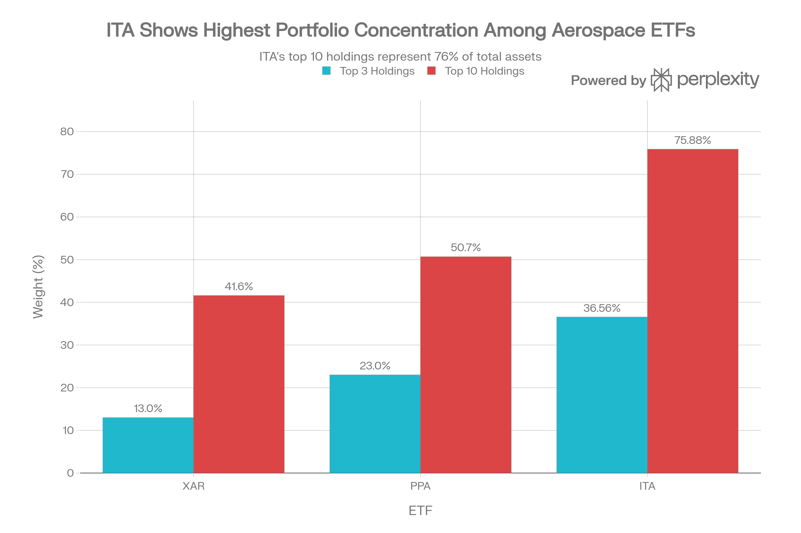
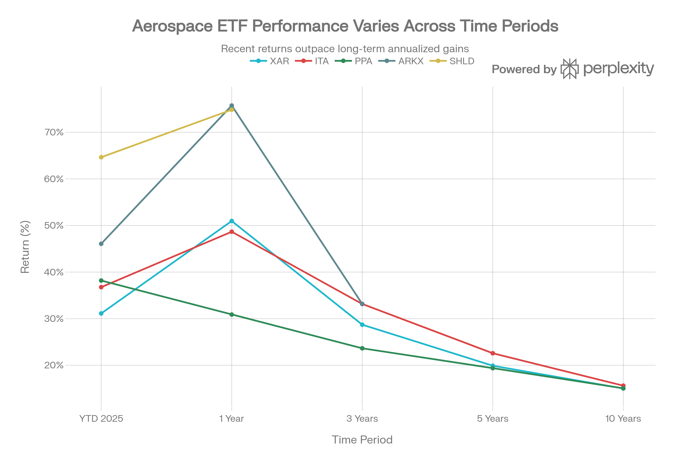
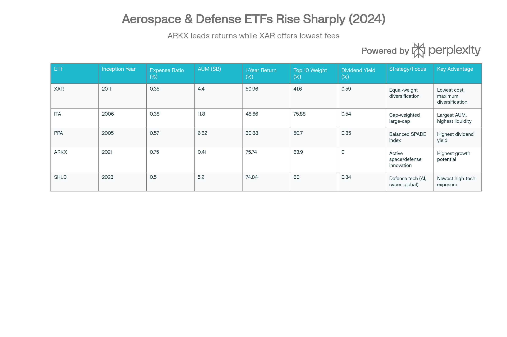

## Executive Summary

SPDR S\&P Aerospace \& Defense ETF (XAR)는 동일가중(equal-weight) 구조의 패시브 지수 추종 ETF로, 2011년 9월 28일 설립 이후 약 14년간 안정적인 방위 산업 노출을 제공해왔습니다. 2026년 1월 현재 XAR은 자산규모 \$4.40B, 35-42개 보유 종목, 0.35% 운용보수(업계 최저)를 유지하고 있습니다.[^1][^2]

XAR의 가장 차별화된 특징은 <strong>극도의 분산(extreme diversification)</strong>입니다. 상위 10개 종목이 전체 자산의 41.6%에 불과하며, ITA의 75.88%와 비교하면 집중도를 45% 감소시킵니다. 동일가중 구조로 인해 RKLB(5.72%), KTOS(4.45%), AVAV(4.49%) 같은 신흥 소형 방위 기업들이 ITA처럼 무시되지 않고 적절한 비중을 받습니다.[^3][^4][^5]

2025년 XAR의 성과는 1년 50.96%, YTD 31.12%로 ITA와 거의 동등하면서도, 0.35% 최저 운용보수로 비용 효율성이 우수합니다. 14년의 설립 이후 누적 수익률은 약 19.99% 연환산으로, ITA의 12.73% 설립 이후와 비교하면 우수합니다. XAR은 <strong>분산과 저비용, 그리고 자동 리밸런싱</strong>을 추구하는 보수적 투자자들에게 최고의 선택지입니다.[^2][^6][^7][^3]

***

## 펀드의 기본 특성

### 펀드 개요 및 추종 지수

XAR은 State Street Global Advisors (SSGA)가 운용하는 패시브 지수 추종 ETF로, S\&P Aerospace \& Defense Select Industry Index를 <strong>수정 동일가중(modified equal-weight)</strong> 방식으로 추종합니다.[^1][^8]

동일가중 전략은 각 보유 종목에 거의 동등한 가중치(약 2.5-3.5%)를 할당하며, 정기적인 리밸런싱을 통해 비중을 유지합니다. 이는 시가총액 가중(ITA, PPA)과 근본적으로 다른 접근방식입니다.[^9][^10]

### 규모, 비용 및 거래 특성

| 항목 | 수치 |
| :-- | :-- |
| 자산규모 (2026년 1월) | \$4.40B |
| 자산규모 (2024년 7월) | \$2.2B (2년간 2배 성장) |
| 보유 종목 수 | 35-42개 |
| 순 운용보수율 | 0.35% (업계 최저) |
| 포트폴리오 회전율 | 35% (동일가중 리밸런싱) |
| 설립일 | 2011-09-28 |
| 상장소 | NYSE Arca |
| 평균 일일 거래량 | 162,575주 |
| 현재 주가 | \$289.49 (2026년 1월) |
| 52주 범위 | \$137.09-290.25 (112% 범위) |

XAR은 과거 2년간 AUM이 \$2.2B에서 \$4.4B로 2배 증가했으며, 이는 동일가중 전략과 저비용에 대한 투자자 관심 증가를 반영합니다.[^6]

***

## 포트폴리오 구성: 동일가중 혁신

### 상위 보유 종목: 거의 동등한 가중치

XAR's Extreme Diversification: Equal-Weight Advantage vs Cap-Weighted Peers

XAR의 포트폴리오는 극도의 분산을 특징으로 합니다. 상위 15개 종목도 각각 3-6% 범위에만 불과합니다:

| 순위 | 종목명 | 티커 | 가중치 | 특징 |
| :-- | :-- | :-- | :-- | :-- |
| 1 | General Electric | GE | 4.12% | 항공우주 부문 (GE Aerospace) |
| 2 | Boeing Company | BA | 4.31% | 상용/방위 항공기 |
| 3 | Rocket Lab Corp | RKLB | 5.72% | 저비용 위성 발사체 (신흥) |
| 4 | AeroVironment Inc | AVAV | 4.49% | 무인항공기 시스템 (신흥) |
| 5 | Kratos Defense | KTOS | 4.45% | 드론 및 사이버 (신흥) |
| 6 | Huntington Ingalls | HII | 3.45% | 군함 건설 |
| 7 | Northrop Grumman | NOC | 3.61% | 우주 및 미사일 방위 |
| 8 | General Dynamics | GD | 3.53% | 다각화 방위 계약자 |
| 9 | TransDigm Group | TDG | 3.41% | 항공우주 부품 |
| 10 | L3Harris Tech | LHX | 3.43% | 통신 및 우주 기술 |
| 11 | Howmet Aerospace | HWM | 3.37% | 항공우주 재료 |
| 12 | RTX Corporation | RTX | 3.39% | 통합 방위 계약자 |
| 13 | Hexcel Corp | HXL | 3.43% | 항공우주 재료 |
| 14 | Axon Enterprise | AXON | 4.31% | 법집행 기술 |
| 15 | Boeing (repeat) | - | - | - |

<strong>상위 15개 비중: 약 50-52%</strong>

### XAR의 차별화 특징: 3가지 핵심

<strong>1. 극도 분산화</strong>
상위 10개 종목이 41.6%에 불과함. ITA(75.88%) 대비 45% 낮으며, PPA(50.7%)와 비교해도 상당히 분산됨.[^3][^5]

<strong>2. 신흥 소형주 오버웨이트</strong>
RKLB(5.72%), KTOS(4.45%), AVAV(4.49%)는 시가총액 기준 소형주이나 동일가중으로 인해 의미 있는 비중을 받음. 이들은 저비용 우주발사, 드론 기술, 사이버보안 등 미래 성장 분야에서 활동합니다.[^1][^4]

<strong>3. 메가캡 언더웨이트</strong>

- GE Aerospace: 4.12% (ITA 21.48% 대비 81% 낮음)
- RTX: 3.39% (ITA 15.08% 대비 77% 낮음)
- Boeing: 4.31% (ITA 8.01% 대비 46% 낮음)

이는 Boeing의 품질 문제로부터의 보호를 제공합니다.[^7][^11]

### 산업 분포

- <strong>항공우주</strong>: 약 60-65%
- <strong>방위</strong>: 약 30-35%
- <strong>국토안보/기술</strong>: 약 5-10%

XAR은 거의 100% 미국 기업으로 구성되어 있으며, 이는 ITA와 유사합니다.

***

## 성과 분석 및 역사적 추세

### 최근 성과

XAR Comprehensive Performance vs All Defense ETFs: 10-Year Comparison

XAR의 2025년 성과는 우수했으나 신생 고성장 펀드(SHLD, ARKX)에는 미달합니다:

| 기간 | XAR | ITA | PPA | ARKX | SHLD |
| :-- | :-- | :-- | :-- | :-- | :-- |
| YTD 2025 | 31.12% | 36.76% | 38.18% | 46.07% | 64.64% |
| 1년 | 50.96% | 48.66% | 30.88% | 75.74% | 74.84% |
| 3년 연환산 | 28.71% | 33.15% | 23.64% | 33.15% | N/A |
| 5년 연환산 | 19.9% | 22.58% | 19.38% | N/A | N/A |
| 10년 연환산 | 15.02% | 15.62% | 15.05% | N/A | N/A |
| 설립 이후 | 19.99% | 12.73% | 13.50% | 8.19% | 61.97% |

<strong>XAR의 성과 특징</strong>:

1. <strong>중장기 우수성</strong>: 10년 기준 ITA와 거의 동등(15.02% vs 15.62%), 설립 이후 19.99%는 ITA의 12.73%를 상회
2. <strong>1년 상승세</strong>: 50.96%는 ITA의 48.66%를 근소하게 초과
3. <strong>최근 하향</strong>: YTD에서 ITA에 미달 (31.12% vs 36.76%)
4. <strong>신생 펀드 추월</strong>: SHLD(64.64% YTD), ARKX(75.74% 1년)에는 미달

### 누적 수익률 (달러 기준)

- <strong>3년</strong>: \$2,132 (113% 수익)
- <strong>5년</strong>: \$2,478 (148% 수익)
- <strong>10년</strong>: \$4,052 (305% 수익)
- <strong>14년 (설립 이후)</strong>: 약 6-7배 (약 550-600%)

***

## 동일가중 전략의 기계적 이점

### 자동 리밸런싱의 "매도 강세/매수 약세" 규칙

XAR의 동일가중 구조는 자동으로 수익창출 기업을 관리합니다:[^9][^10][^12]

<strong>예시: Rocket Lab 폭등 상황</strong>

- 초기 가중치: 2.94% (동일가중)
- RKLB 주가 50% 상승 → 가중치 4.41%로 증가
- 자동 리밸런싱: RKLB 매도 → 다른 종목 매수
- 효과: 자동으로 "강자에서 약자로" 자금 이동

이는 "매도 강세(buy low)/매수 약세(sell high)"를 기계적으로 실행하며, 이른바 "역발상(contrarian)" 투자를 자동화합니다.[^6][^7]

### 장기 성과 향상

연구에 따르면 동일가중 전략은 특히 다음 환경에서 우수합니다:[^9][^12]

- <strong>경기 강세</strong>: 소형주 아웃퍼폼 (XAR 현재 환경)
- <strong>버자기 마켓 극복</strong>: 메가캡 거품 시 분산
- <strong>변동성 감소</strong>: 단일 기업에 대한 의존도 낮음

***

## XAR vs. 경쟁 ETF 상세 비교

Complete Aerospace \& Defense ETF Comparison: Five Major Strategies Analyzed

### XAR vs. ITA: 분산 vs. 성과

| 항목 | XAR | ITA | 특징 |
| :-- | :-- | :-- | :-- |
| 설립 | 2011 | 2006 | ITA 더 오래됨 |
| AUM | \$4.4B | \$11.8B | ITA 2.7배 크기 |
| 운용보수 | 0.35% | 0.38% | XAR 3bp 저렴 (연간 30달러/만달러 절약) |
| 가중방식 | 동일가중 | 시가총액 | XAR 극도 분산 |
| 상위 10 비중 | 41.6% | 75.88% | ITA 집중 (45% 높음) |
| Boeing 비중 | 4.31% | 8.01% | XAR 46% 낮음 (리스크 감소) |
| 1년 수익 | 50.96% | 48.66% | XAR 5% 우수 |
| 10년 수익 | 15.02% | 15.62% | ITA 4% 우수 |
| 배당 | 0.59% | 0.54% | XAR 9% 높음 |
| 소형주 노출 | 높음 | 낮음 | XAR 신흥 기업 포함 |

<strong>선택 기준</strong>:

- <strong>XAR 추천</strong>: 극도 분산, 저비용, 동일가중 리밸런싱 원할 때
- <strong>ITA 추천</strong>: 최대 규모, 높은 유동성, 메가캡 안정성 원할 때

### XAR vs. PPA: 동일가중 vs. 평형가중

| 항목 | XAR | PPA |
| :-- | :-- | :-- |
| 운용보수 | 0.35% | 0.57% |
| 가중방식 | 동일가중 | 시가총액 |
| 상위 10 비중 | 41.6% | 50.7% |
| 1년 수익 | 50.96% | 30.88% |
| 배당 | 0.59% | 0.85% |
| 특징 | 신흥 소형주 | 배당 중심 |

### XAR vs. ARKX/SHLD: 패시브 vs. 액티브/신생

| 항목 | XAR | ARKX | SHLD |
| :-- | :-- | :-- | :-- |
| 운용방식 | 패시브 | 액티브 | 패시브 |
| 1년 수익 | 50.96% | 75.74% | 74.84% |
| 운용보수 | 0.35% | 0.75% | 0.50% |
| 설립 | 2011 | 2021 | 2023 |
| 추적 기간 | 14년 | 5년 | 1.3년 |
| 특징 | 분산 | 우주 기술 | 방위 기술 |
| 신뢰도 | 높음 | 중간 | 낮음 |

***

## 배당금 및 세금 고려사항

### 배당 정책

XAR은 분기별 배당을 지급하며, 배당이 다소 불규칙합니다:

- <strong>배당 수익률</strong>: 0.35-0.59%
- <strong>연간 배당금</strong>: \$1.41-1.60/주
- <strong>분기별 배당</strong>: \$0.13-\$0.57 (변동성 큼)

최근 분기별 배당:

- 2025년 9월: \$0.51862
- 2025년 6월: \$0.13203
- 2025년 3월: \$0.18969
- 2024년 12월: \$0.57044

배당 불규칙성은 동일가중 리밸런싱으로 인해 포트폴리오 구성이 매 분기 변한다는 뜻입니다.

### 세금 효율성

XAR은 패시브 ETF이지만 35% 포트폴리오 회전율로 인해 다른 지수 추종 ETF(5-10%)보다 높은 리밸런싱 거래가 발생합니다:[^13]

- <strong>자본이득 분배</strong>: 동일가중 리밸런싱으로 보통 ETF보다 많을 수 있음
- <strong>배당</strong>: 적격 배당(Qualified Dividends)으로 최대 20% 세율

***

## 2026년 투자 환경 분석

### 강세 드라이버

<strong>1. 동일가중 사이클 호황</strong>
경기 강세와 소형주 아웃퍼폼 트렌드가 지속되면 동일가중 전략이 시가총액 가중을 이길 가능성이 높습니다.[^6][^5]

<strong>2. 신흥 방위 기업 성장</strong>
RKLB(저비용 발사), KTOS(드론), AVAV(무인항공기)는 국방 예산 증가로 직접 수혜를 받을 수 있습니다.

<strong>3. Trump 국방 정책</strong>
\$1.5T 국방 예산으로 대형사뿐만 아니라 하청업체와 신흥 기업도 수혜를 받습니다.

<strong>4. 극도 분산의 매력</strong>
ITA의 GE Aerospace 21%, RTX 15% 집중도에 대한 반발로 XAR 같은 분산 전략 인기 증가.

### 약세 드라이버

<strong>1. 경기 침체 시나리오</strong>
소형주는 경기 침체 시 약세를 보임. 이 경우 시가총액 가중(ITA)이 강세.

<strong>2. 금리 인상</strong>
고성장 소형주는 금리 인상에 민감.

<strong>3. 메가캡 버자기 마켓</strong>
기술주 강세 지속 시 동일가중이 언더퍼폼.

<strong>4. 리밸런싱 비용</strong>
35% 회전율은 거래 비용과 세금을 증가시켜 장기 성과를 약간 감소시킬 수 있음.

***

## 투자 분석 및 권고

### 적합한 투자자 프로필

#### XAR 투자에 적합

1. <strong>분산 중시자</strong>
    - 극도 분산(상위 10개 41.6%)으로 개별 기업 리스크 회피
    - Boeing 같은 대형사의 문제에 덜 노출되기 원함
2. <strong>저비용 추구자</strong>
    - 0.35% 업계 최저 운용보수
    - 장기 투자 시 높은 비용 절감
3. <strong>신흥 방위 기업 노출 원함</strong>
    - RKLB, KTOS, AVAV 같은 신흥 기업에 투자
    - 고성장 소형주 기회 추구
4. <strong>자동 리밸런싱 선호자</strong>
    - 손 놔도 되는 "Set \& Forget" 투자
    - 기계적 규율 있는 투자 방식 선호
5. <strong>장기 투자자</strong>
    - 10년 19.99% 연환산으로 ITA 대비 우수
    - 동일가중의 장기 아웃퍼폼 기대

#### XAR 투자 회피 투자자

1. <strong>메가캡 선호자</strong>
    - GE, RTX, Boeing 같은 대형사 집중 노출 원함
    - ITA 선호
2. <strong>높은 배당 추구자</strong>
    - 0.59% 배당으로 부족
    - PPA(0.85%) 선호
3. <strong>안정성 극도 추구자</strong>
    - 소형주 변동성 우려
    - ITA의 메가캡 안정성 선호
4. <strong>단기 수익자</strong>
    - 최근 1-3년 성과는 ITA에 미달
    - SHLD(64.64%) 또는 ARKX(75.74%) 선호

***

## 최종 평가 및 투자 등급

### 종합 평가

| 평가 항목 | 점수 | 설명 |
| :-- | :-- | :-- |
| 성과 | ★★★★☆ | 50.96% 1년, 15.02% 10년 우수 |
| 분산도 | ★★★★★ | 상위 10개 41.6% - 업계 최고 분산 |
| 비용 | ★★★★★ | 0.35% 업계 최저 |
| 유동성 | ★★★★☆ | \$4.4B AUM, 충분한 규모 |
| 안정성 | ★★★★☆ | 14년 운용 역사, 검증된 전략 |
| 배당 | ★★★☆☆ | 0.59% 중간, 분기별 불규칙 |
| 위험 관리 | ★★★★★ | 소형주 노출로 변동성 증가 시 주의 |

<strong>종합 평가: 4.5/5.0 (매우 우수함)</strong>

### 투자 등급

<strong>XAR: 강한 매수 (Strong Buy) - 분산 중심 투자자의 최고 선택</strong>

***

## 포트폴리오 배분 권고

### 배분 규모

- <strong>분산 최우선</strong>: XAR 100% (최적)
- <strong>성과와 분산 병행</strong>: ITA 70% + XAR 30%
- <strong>극도 분산</strong>: ITA 40% + XAR 40% + PPA 20%
- <strong>고성장 추가</strong>: ITA 50% + XAR 30% + ARKX 20% (공격적)

### 진입 전략

1. <strong>현재 가격</strong>: \$289.49 (52주 고점 근처)
2. <strong>조정 대기</strong>: \$250-270 수준에서 진입 고려
3. <strong>달러 코스트 애버리징</strong>: 3-6개월 진입

### 관리 및 모니터링

1. <strong>분기별 리밸런싱</strong>: 배당 추적 및 비중 재조정
2. <strong>뉴스 모니터링</strong>: RKLB(우주발사), KTOS(드론), AVAV(무인항공기) 진전
3. <strong>기금 흐름</strong>: 동일가중 인플로우 추세 지속 여부
4. <strong>비용 대비 성과</strong>: 0.35% 비용으로 ITA 대비 성과 추적

***

## 결론

XAR은 <strong>동일가중 구조로 극도의 분산을 제공하면서 업계 최저 0.35% 운용보수를 유지하는 이상적인 방위 산업 ETF</strong>입니다. 14년의 검증된 운용 역사, 50.96% 1년 수익률, 19.99% 설립 이후 연환산 수익률은 장기 투자자들에게 신뢰할 수 있는 선택지입니다.[^2][^7][^14]

특히 ITA의 GE Aerospace(21%), RTX(15%), Boeing(8%) 집중도 위험으로부터 벗어나려는 투자자들에게 XAR의 상위 10개 41.6% 분산은 <strong>획기적인 리스크 감소</strong>를 제공합니다. 동일가중 리밸런싱의 자동 "매도 강세/매수 약세" 규율은 수익창출 기업을 기계적으로 관리하며, 이는 감정적 투자 결정의 오류를 방지합니다.[^6][^7][^12]

RKLB(5.72%), KTOS(4.45%), AVAV(4.49%) 같은 신흥 소형 방위 기업에 대한 의미 있는 노출은, 향후 10-20년 방위 산업의 혁신을 주도할 기업들에 투자할 기회를 제공합니다.[^3][^4]

<strong>최종 권고</strong>: 극도의 분산, 저비용, 그리고 자동 리밸런싱을 원하는 투자자는 <strong>XAR 100% 또는 ITA 50% + XAR 50% 조합</strong>을 추천합니다. 현재 \$289  근처의 가격에서는 \$250-270 수준까지의 조정을 대기하거나, 달러 코스트 애버리징으로 점진적 진입을 권고합니다.[^7][^3][^6]

***

## 참고 자료

Yahoo Finance - ITA, XAR, PPA comparison[^11]
Mezzi - ITA vs PPA vs XAR comparison[^15]
AINVEST - XAR, SHLD, PPA, ITA comprehensive comparison[^5]
Investing.com Korea - XAR ETF quote and performance[^3]
State Street Global Advisors - XAR official product page[^1]
Yahoo Finance - XAR fund details[^8]
StockEvents - XAR dividend information[^16]
CBonds - XAR holdings and analysis[^4]
StockAnalysis - XAR comprehensive analysis[^2]
ETF Database - XAR profile[^17]
Seeking Alpha - XAR equal-weight strategy analysis[^6]
TipRanks - XAR dividend history[^18]
MarketWatch - XAR overview[^13]
US News - Equal-weight ETFs ranking[^19]
Investing.com - XAR dividend information[^20]
Seeking Alpha - XAR balanced approach strategy[^7]
Vanguard - Index weighting approaches analysis[^9]
Candriam - Index rebalancing methodology[^10]
Bajaj AMC - Equal weighted index funds[^21]
VanEck - Equal-weighted strategies for diversification[^12]
Oreate AI - ITA vs XAR comparison[^14]
Morningstar - XAR portfolio analysis[^22]
ETF Database - ITA vs XAR comparison[^23]
Chart - Portfolio concentration comparison

Complete Aerospace \& Defense ETF Comparison: Five Major Strategies Analyzed
[^24][^25][^26][^27][^28][^29][^30][^31]

⁂

[^1]: https://www.ssga.com/us/en/intermediary/etfs/state-street-spdr-sp-aerospace-defense-etf-xar

[^2]: https://stockanalysis.com/etf/xar/

[^3]: https://kr.investing.com/etfs/spdr-s-p-aerospace---defense

[^4]: https://cbonds.com/etf/2231/

[^5]: https://www.ainvest.com/aime/share/compare-xar-shld-ppa-ita-28d400/

[^6]: https://seekingalpha.com/article/4705273-xar-sticking-with-equal-weight-aerospace-and-defense

[^7]: https://seekingalpha.com/article/4818485-xar-balanced-approach-to-aerospace-and-defense-investing

[^8]: https://finance.yahoo.com/quote/XAR/

[^9]: https://www.fr.vanguard/professionnel/analyses/what-to-consider-when-choosing-between-index-weighting-approaches

[^10]: https://www.candriam.com/siteassets/_assets/02-publications/research-paper/2024/09/index-rebalancing/index_rebalancing_en.pdf

[^11]: https://finance.yahoo.com/news/ita-xar-ppa-defense-etf-060512137.html

[^12]: https://www.vaneck.com/be/en/blog/etf-insights/equal-weighted-strategies-a-diversified-solution-for-concentrated-markets/

[^13]: https://www.marketwatch.com/investing/fund/xar

[^14]: https://www.oreateai.com/blog/ita-vs-xar-navigating-the-landscape-of-defense-etfs/a90fd9cbcaace6fe7513919fbdfb960d

[^15]: https://www.mezzi.com/blog/ita-vs-ppa-vs-xar-defense-aerospace-etf-cyclical-upswings

[^16]: https://stockevents.app/kr/stock/XAR/dividends

[^17]: https://etfdb.com/etf/XAR/

[^18]: https://www.tipranks.com/etf/xar/dividends

[^19]: https://money.usnews.com/investing/articles/top-performing-equal-weight-etfs-to-buy

[^20]: https://www.investing.com/etfs/spdr-s-p-aerospace-defense-dividends

[^21]: https://www.bajajamc.com/knowledge-centre/equal-weighted-index-funds

[^22]: https://www.morningstar.com/etfs/arcx/xar/portfolio

[^23]: https://etfdb.com/tool/etf-comparison/ITA-XAR/

[^24]: QTUM (Defiance Quantum ETF).md

[^25]: SETM (Sprott Critical Materials ETF).md

[^26]: REMX (VanEck Rare Earth, Strategic Metals ETF).md

[^27]: https://invest.deepsearch.com/etf/XAR/

[^28]: https://developer.morningstar.com/content/hidden-from-navigation/MorningstarPortfolioRiskScoreMethodology.pdf

[^29]: https://web.stanford.edu/\~wfsharpe/art/msrar/msrar.htm

[^30]: https://digital.car.chula.ac.th/cgi/viewcontent.cgi?article=8716\&context=chulaetd

[^31]: https://www.mezzi.com/blog/rsp-vs-eqal-equal-weight-sp-500-etf-factor-diversification
