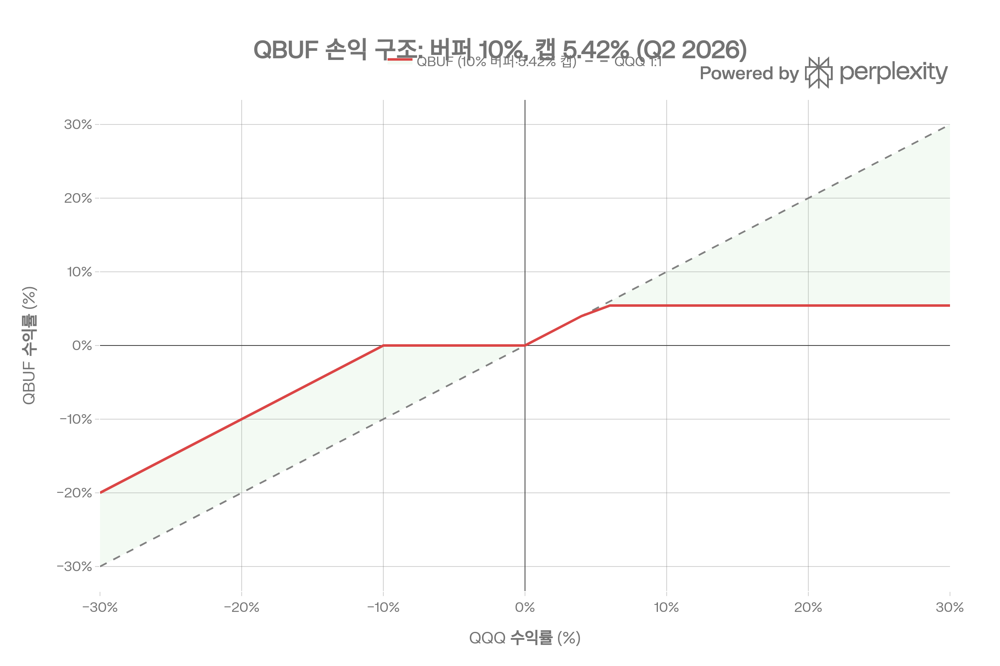
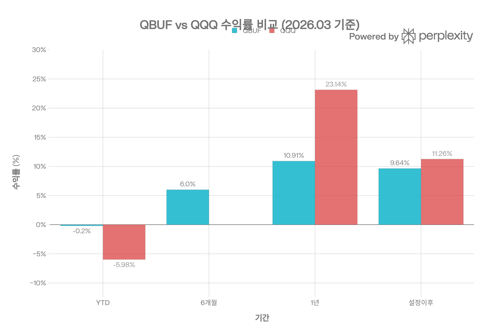
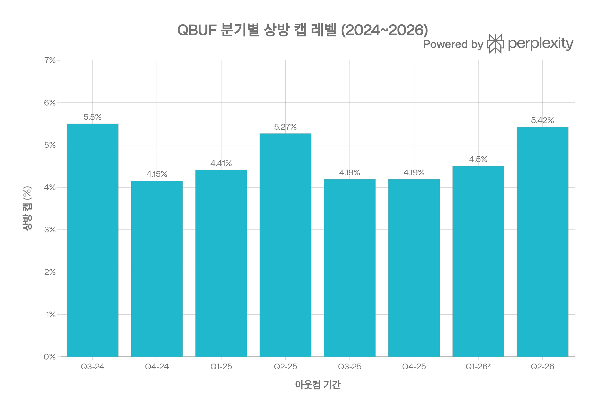

# QBUF (Innovator Nasdaq-100® 10 Buffer ETF™) 종합 분석 보고서
> <strong>작성 기준일:</strong> 2026년 5월 3일 | <strong>데이터 출처:</strong> Innovator ETFs 공식 사이트·프로스펙터스·팩트시트, Schwab, ETFdb, TradingView, PortfoliosLab, Morningstar 등

## ETF 분류

| 항목 | 내용 |
|------|------|
| <strong>최종 폴더</strong> | `ETF/Defined Outcome/Buffer/QBUF` |
| <strong>대분류</strong> | Defined Outcome |
| <strong>하위 분류</strong> | Buffer |
| <strong>핵심 전략</strong> | QQQ 기반 FLEX 옵션으로 분기별 10% 하락 버퍼와 제한된 상방 캡 제공 |
| <strong>운용 방식</strong> | 액티브 |
| <strong>레버리지·인버스 여부</strong> | 아니오 |
| <strong>옵션 인컴 전략 여부</strong> | 아니오 |
| <strong>분류 판단</strong> | Nasdaq-100 노출을 사용하지만 대표지수 단순 추종이 아니라 정해진 아웃컴 기간의 하방 버퍼와 상방 캡을 설계하는 옵션 기반 정의된 결과 ETF이므로 `Defined Outcome/Buffer`로 분류한다. |

***
## 1. 기본 정보
| 항목 | 내용 |
|------|------|
| 티커 | QBUF |
| 전체명 | Innovator Nasdaq-100® 10 Buffer ETF™ — Quarterly |
| 운용사 | Innovator ETFs (Goldman Sachs 소유)[1] |
| 배급사 | Foreside Fund Services, LLC[2] |
| 상장거래소 | Nasdaq |
| CUSIP | 45783Y160[3] |
| 설정일 | <strong>2024년 6월 28일 (상장 7월 1일)</strong>[4][5] |
| 운용기간 | 약 10개월 |
| 순자산(AUM) | 약 <strong>$1억 5,808만</strong> (2026/04/30)[3] |
| 총 보수(Expense Ratio) | <strong>0.79%</strong>[3][2] |
| 운용 방식 | <strong>액티브 운용 (Active) — 정의된 결과(Defined Outcome) 전략</strong>[2] |
| 추종 기초 자산 | Invesco QQQ Trust, Series 1 (QQQ)[2] |
| 시리즈 | <strong>분기형 (Quarterly Series)</strong>[3] |
| 아웃컴 기간 | 분기 (\~91일), 매 분기 초 리셋[3][6] |
| 배당 | <strong>없음</strong> (배당 미지급)[3] |
| 현재 NAV | $30.40 (2026/04/30)[3] |
| NAV 프리미엄/디스카운트 | +0.03%[3] |
| 30일 중간 호가 스프레드 | <strong>0.17%</strong>[3] |
| 총 종목 수 | 5개 (FLEX 옵션 포지션)[4] |

***
## 2. 정의된 결과(Defined Outcome) 전략 구조
QBUF는 Innovator의 <strong>Buffer ETF™ 시리즈</strong> 중 나스닥-100에 특화된 분기형 상품입니다. 단순한 인덱스 추종이 아닌, 특정 <strong>아웃컴 기간(Outcome Period)</strong> 동안 미리 정해진 수익 구조를 실현하도록 설계된 파생상품 기반의 액티브 운용 ETF입니다.[3][7]
### 핵심 구조 3요소

<strong>① 버퍼(Buffer): 10%</strong>
- QQQ가 아웃컴 기간 동안 최초 10%까지 하락하는 경우 투자자의 손실을 흡수[2][8]
- 비용 차감 후 실질 순버퍼(Net Buffer): <strong>9.80\~9.81%</strong>[2]
- QQQ 하락이 10%를 초과하면 그 이후 손실은 투자자가 1:1로 부담[2]

<strong>② 상방 캡(Cap): 5.42% (Q2 2026 기준, 비용 전)</strong>
- 아웃컴 기간 동안 QQQ가 얼마나 상승해도 최대 5.42%까지만 이익 참여[3][2]
- 비용 차감 후 순캡(Net Cap): <strong>5.22%</strong>[2]
- 캡은 아웃컴 기간 시작 시점의 시장 환경(금리, 변동성)에 따라 결정되며 매 분기 변경[2]

<strong>③ 아웃컴 기간(Outcome Period): 분기 (\~91일)</strong>
- 매 분기 말일 만료 후 새 FLEX 옵션으로 자동 롤오버[6][3]
- 현재 아웃컴 기간: <strong>2026년 4월 1일 \~ 6월 30일</strong>[3]
### 손익 구조 요약 (Q2 2026 아웃컴, 2026.05.01 기준)

| QQQ 수익률 | QBUF 예상 수익률 |
|-----------|--------------|
| +10% 이상 | <strong>+5.42%</strong> (캡에 제한)[3] |
| +5.42% | <strong>+5.42%</strong> (캡 도달) |
| 0 \~ +5.42% | QQQ와 동일 (1:1 참여)[2] |
| 0 \~ -10% | <strong>0%</strong> (버퍼가 손실 흡수)[2] |
| -10% \~ -20% | <strong>-10% 이상부터</strong> (버퍼 초과분 1:1 손실)[2] |
| -30% | <strong>-20%</strong> (버퍼 10% 차감 후) |

> <strong>2026년 5월 1일 현재(중간 진입 시):</strong> 잔여 캡 1.19%/1.06%(순), 잔여 버퍼 18.92%/18.79%(순), 잔여 기간 60일[3]
---
## 3. 포트폴리오 구성 (FLEX Options 구조)
QBUF는 <strong>QQQ ETF에 대한 FLEX 옵션(FLexible EXchange® Options)</strong> 만으로 포트폴리오를 구성합니다. 개별 주식은 일절 보유하지 않습니다.[2][8]

| 보유 자산 | 비중 |
|----------|------|
| QQQ 콜옵션 매수 (장기) | \~110.90%[3] |
| US Bank MMDA 현금성 자산 | 0.56%[3] |
| First American Gov. Obligations Fund | 0.15%[3] |
| QQQ 콜옵션 매도 (숏) | -0.22%[3] |
| QQQ 풋옵션 매도 (숏) | -11.40%[3] |

FLEX 옵션은 행사가격, 만기, 결제 방식 등을 맞춤화할 수 있는 거래소 상장 옵션으로, 신용 위험은 없지만 아웃컴 기간 내 매수 가격에 따라 투자자 결과가 크게 달라집니다.[9][2]

***
## 4. 비용 구조
| 항목 | 내용 |
|------|------|
| 총 보수율(Total Expense Ratio) | <strong>0.79%</strong>[3][2] |
| 관리보수 | 0.79%[2] |
| 기타 비용 | 0.00%[2] |
| 30일 중간 호가 스프레드 | <strong>0.17%</strong>[3] |
| SEC 수익률 | <strong>-0.77%</strong> (2025/10 기준)[5] |
| 배당 수익률 | 0.00% (배당 없음)[5] |

QBUF의 0.79% 비용은 Innovator ETF 라인업의 표준 요율이며, 동종 S&P 500 버퍼 ETF 평균(0.80%)과 유사합니다. 다만 0.17%의 스프레드는 AUM($1.58억) 대비 다소 넓은 편으로, QQQ(0.01%)나 QTOP(0.03%) 대비 거래 비용이 높습니다.[3][1]
### 경쟁 버퍼 ETF 비용 비교
| ETF | 운용사 | 전략 | 비용률 | 버퍼 | 기간 |
|-----|--------|------|--------|------|------|
| <strong>QBUF</strong> | <strong>Innovator</strong> | <strong>나스닥-100 QQQ 기반</strong> | <strong>0.79%</strong> | <strong>10%</strong> | <strong>분기</strong> |
| PJAN | Innovator | S&P 500 SPY 기반 | 0.79%[10] | 15% | 연간 |
| BJAN | Innovator | S&P 500 SPY 기반 | 0.79%[11] | 9% | 연간 |
| BJUN | Innovator | S&P 500 SPY 기반 | 0.79% | 9% | 연간 |
| BUFB | AB | S&P 500 SPY 기반 | — | 10% | 분기 |

***
## 5. 유동성 평가
| 항목 | 내용 |
|------|------|
| 현재 주가 (2026/05/01) | $30.44\~$30.45[3] |
| AUM | 약 <strong>$1억 5,808만</strong> (2026/04/30)[3] |
| 총 발행 주식 수 | 5,200,000주[3] |
| 52주 최저/최고 | $24.36 / $29.52[4] |
| 30일 중간 호가 스프레드 | <strong>0.17%</strong>[3] |
| 10일 평균 거래량 | 약 59,895주[5] |
| 1년 펀드 유입(Fund Flow) | +$1억 2,533만[12] |
| NAV 프리미엄/디스카운트 | +0.03%[3] |
| 옵션 거래 | 없음[13] |

스프레드 0.17%는 버퍼 ETF 특성상 비교적 넓지만, AUM 규모($1.58억)와 일 거래량(\~6만 주) 수준을 감안하면 시장 조성이 안정적으로 이루어지고 있습니다. 그러나 급격한 시장 변동 시 스프레드가 확대될 수 있으므로, Innovator가 권고하는 대로 <strong>지정가(Limit Order) 주문</strong>을 활용하는 것이 중요합니다.[3]

***
## 6. 성과 분석

### 기간별 수익률 (2026년 3월 31일 기준)
| 기간 | QBUF NAV | QBUF 시장가 | 나스닥-100 가격수익 |
|------|----------|-----------|----------------|
| YTD | <strong>-0.20%</strong> | -0.35% | -5.98%[3] |
| 1년 | <strong>+10.91%</strong> | +10.55% | +23.14%[3] |
| 설정 이후 누적 | <strong>+9.64%</strong> | +9.59% | +11.26%[3] |

Schwab 데이터(2025/08/31 기준):

| 기간 | QBUF | Morningstar 동종 평균 |
|------|------|-------------------|
| YTD | +6.9%(시장)/ +6.8%(NAV) | +7.3%[5] |
| 1개월 | +0.8\~0.9% | +1.3%[5] |
| 3개월 | +3.1% | +5.2%[5] |
| 6개월 | +6.0\~6.1% | +6.0%[5] |
| 1년 | +12.7% | +10.0%[5] |
| 설정 이후 | +11.3% | —[5] |

Schwab 데이터(2025/09/30 기준): 1년 시장가 수익률 <strong>+13.3%</strong>[5]

PortfoliosLab: 1년 수익률 QBUF <strong>15.34%</strong> vs PJAN <strong>17.83%</strong>[10]

<strong>핵심 해석:</strong> YTD(2026년 1\~3월) QBUF -0.20% vs QQQ -5.98%로, 나스닥이 급락한 환경에서 버퍼 전략의 <strong>하락 방어 효과</strong>가 명확히 확인됩니다. 반면 1년 수익률 기준 QBUF +10.91% vs QQQ +23.14%로 2배 이상 차이가 나는 만큼, 강세장에서의 기회 비용은 매우 큽니다.[3]
### 현재 아웃컴 기간 진행 현황 (2026/05/01 기준)
| 항목 | 수치 |
|------|------|
| 펀드 현재가 | $30.44[3] |
| 기간 시작 이후 펀드 수익 | <strong>+4.11%</strong>[3] |
| 기간 시작 이후 QQQ 수익 | +16.79%[3] |
| 잔여 캡(상방 여유) | 1.19% / 1.06%(순)[3] |
| 잔여 버퍼 | 18.92% / 18.79%(순)[3] |
| 잔여 기간 | 60일[3] |

***
## 7. 추종 성과 지표
### 추적 오차 및 NAV 괴리율
| 항목 | 내용 |
|------|------|
| 복제 방식 | FLEX 옵션 합성 복제[2][9] |
| NAV 프리미엄/디스카운트 | +0.03%[3] |
| 30일 중간 호가 스프레드 | 0.17%[3] |
| 추적 목적 | QQQ 연동 (인덱스 직접 추종 아님)[2] |
| 인트라-피리어드 리스크 | 중간 진입 시 버퍼/캡 수준이 크게 다름[2] |

QBUF는 전통적 의미의 인덱스 추종 ETF가 아니므로 추적 오차 개념보다 <strong>버퍼/캡 실현 정확도</strong>가 더 중요합니다. FLEX 옵션 기반 구조로 인해 아웃컴 기간 내에는 QQQ 움직임에 선형으로 반응하지 않으며, 기간 중 투자자는 버퍼나 캡 수준이 완전히 다른 결과를 경험할 수 있습니다.[2][9]

<strong>중요 경고:</strong> 아웃컴 기간 첫 날 이후 진입한 투자자는 명시된 10% 버퍼와 5.42% 캡의 혜택을 받지 못할 수 있으며, 이미 QQQ가 10% 이상 하락한 상태에서 진입하면 <strong>버퍼 보호를 전혀 받지 못합니다</strong>.[2]

***
## 8. 분기별 상방 캡 레벨 이력
| 아웃컴 기간 | 시작 캡 (비용 전) | 출처 |
|-----------|---------------|------|
| Q3 2024 (7/1\~9/30) | \~5.50% | ETFdb[14] |
| Q4 2024 (10/1\~12/31) | \~4.15% | 추정 |
| Q1 2025 (1/1\~3/31) | \~4.41% | 추정 |
| Q2 2025 (4/1\~6/30) | \~5.27% | ETFdb[14] |
| Q3 2025 (7/1\~9/30) | <strong>4.19%</strong> | 팩트시트[8] |
| Q4 2025 (10/1\~12/31) | <strong>4.19%</strong> | 팩트시트[8] |
| Q1 2026 (1/1\~3/31) | \~4.50% | 추정 |
| <strong>Q2 2026 (4/1\~6/30)</strong> | <strong>5.42%</strong> | 공식 사이트[3] |

캡 레벨은 매 분기 시장 금리, QQQ 변동성(IV), 배당 예상치에 따라 달라집니다. 변동성이 높을수록 옵션 프리미엄이 높아 캡이 올라가는 경향이 있습니다. 2024\~2026년 캡 범위는 약 <strong>4.15%\~5.50%</strong>로, 연간 환산 16.6%\~22% 수준에 해당합니다.[2]

***
## 9. 배당 정보
QBUF는 <strong>배당을 지급하지 않습니다</strong>. 공식 사이트에서도 "This fund has not made any distributions"로 명시되어 있습니다. 이는 FLEX 옵션으로만 포트폴리오를 구성하기 때문이며, 수익은 모두 자본 이득(Capital Gain) 형태로만 실현됩니다. 정기적인 현금 흐름이 필요한 투자자에게는 적합하지 않습니다.[3][5]

***
## 10. 리스크 요소
### 주요 리스크 요약
| 리스크 유형 | 내용 |
|-----------|------|
| <strong>캡 제한 리스크</strong> | 연 5% 미만 캡으로 강세장 수익 기회 대폭 제한[2] |
| <strong>인트라-피리어드 진입 리스크</strong> | 기간 중 진입 시 버퍼/캡이 상이하거나 전혀 적용 안 될 수 있음[2][9] |
| <strong>10% 초과 하락 리스크</strong> | 버퍼 초과 하락 시 QQQ와 동일한 손실[2] |
| <strong>롤오버 누적 손실 리스크</strong> | 여러 기간 거쳐 손실이 누적되면 새 캡으로 회복 어려움[2] |
| <strong>캡 변동성 리스크</strong> | 저변동성 환경에서 캡이 더욱 낮아질 수 있음[2] |
| <strong>FLEX 옵션 복잡성</strong> | 기간 내 NAV가 QQQ와 선형 관계 아님[9] |
| <strong>유동성 리스크</strong> | 스프레드 0.17%로 빈번한 매매 시 비용 증가[3] |
| <strong>배당 미지급</strong> | 현금 흐름 필요 투자자에게 부적합[3] |
| <strong>높은 비용률</strong> | 0.79%는 QQQ(0.20%) 대비 약 4배[2] |

<strong>베타:</strong> 약 0.23 — 나스닥-100에 비해 매우 낮은 시장 연동성을 의미하며, 이는 버퍼 구조로 인해 상승장·하락장 모두에서 QQQ와 다른 움직임을 보임을 반영합니다.[13]

***
## 11. 경쟁 ETF 종합 비교
| 항목 | <strong>QBUF</strong> | QQQ | QTOP | QQQY |
|------|----------|-----|------|------|
| 전략 유형 | 버퍼(정의된결과) | 인덱스 추종 | 인덱스 추종 | 커버드콜(고배당) |
| 기초 자산 | QQQ FLEX | 나스닥-100 | 나스닥-100 상위30 | 나스닥-100 |
| 비용률 | 0.79% | 0.20% | 0.20% | 1.01% |
| AUM | \~$1.58억 | \~$3,200억 | \~$2.7억 | \~$1.6억 |
| 버퍼 | <strong>10% 하락 보호</strong> | 없음 | 없음 | 없음 |
| 상방 | <strong>5.42% 분기 캡</strong> | 무제한 | 무제한 | \~30% 목표(배당) |
| 배당 | <strong>없음</strong> | 0.55\~0.64% | 0.30% | \~30% |
| 베타 | <strong>0.23</strong> | \~1.0 | 1.26 | 0.87 |
| 1년 수익률 | +10.91\~15.34% | +23.14% | +26.61% | +20.30% |
| 주요 리스크 | 상방 제한 | 하락 무방어 | 집중·베타 | NAV 침식 |
| 적합 투자자 | 보수적·방어적 | 성장 추구 | 공격적 성장 | 현금흐름 중시 |

***
## 12. 투자 요약 및 핵심 결론
QBUF는 나스닥-100 투자에서 <strong>하락 방어를 최우선으로 하는 보수적 투자자</strong>를 위해 설계된 정교한 구조화 상품입니다. 2026년 YTD처럼 나스닥이 -5.98% 하락하는 구간에서 QBUF는 -0.20%로 하방을 방어하는 전략적 가치를 분명히 보여줬습니다. 베타 0.23의 낮은 시장 민감도, 분기마다 재설정되는 10% 버퍼, 그리고 배당 없이 자본 이득 형태로 수익을 창출하는 세금 효율성이 핵심 장점입니다.[3][2][13]

그러나 <strong>분기당 5% 미만의 상방 캡 구조</strong>는 나스닥 강세장에서 치명적인 기회 비용으로 작용합니다. 1년 수익률 기준 QBUF +10.91% vs QQQ +23.14%라는 2배 이상의 격차가 이를 명확히 보여주며, 장기 복리 효과를 고려하면 시간이 지날수록 격차는 더욱 확대됩니다.[2][3]

<strong>QBUF 투자 적합 시나리오:</strong>
- 나스닥-100 익스포저를 유지하되 10% 내외의 하락 방어가 절대적으로 필요한 경우
- 단기(1분기) 약세장이 예상되는 국면에서 헤지 수단으로 활용
- 연금·장기 저축 포트폴리오에서 변동성 감소가 수익률보다 중요한 투자자

<strong>QBUF 투자 부적합 시나리오:</strong>
- 장기 성장 투자를 추구하는 경우 (QQQ 또는 QTOP이 훨씬 우월)
- 정기 현금 흐름이 필요한 투자자 (배당 없음)
- 아웃컴 기간 중간에 빈번한 매매를 원하는 경우 (버퍼/캡 불일치)
