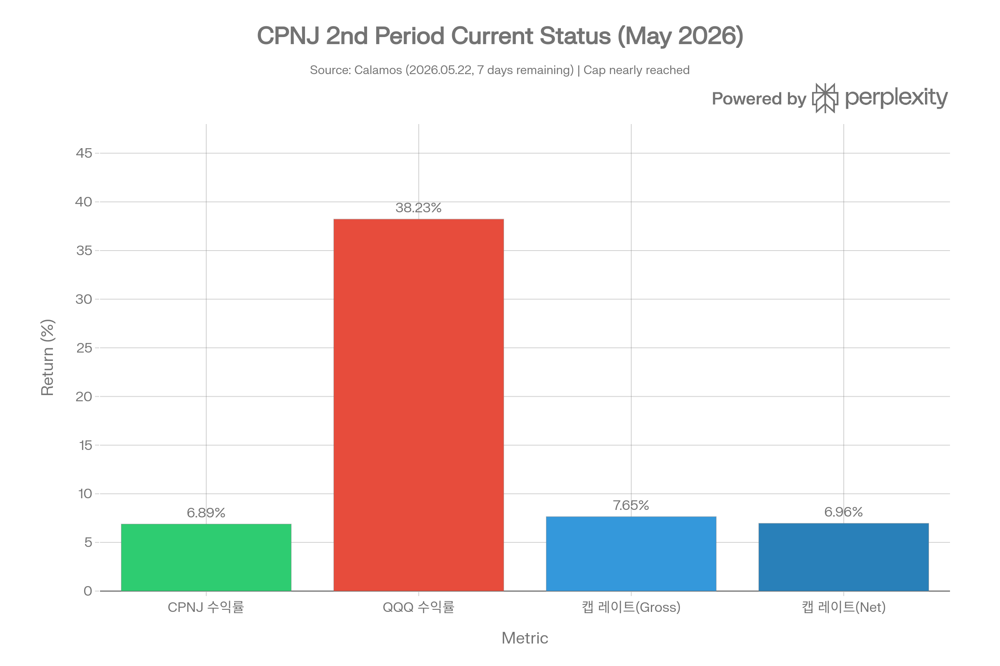
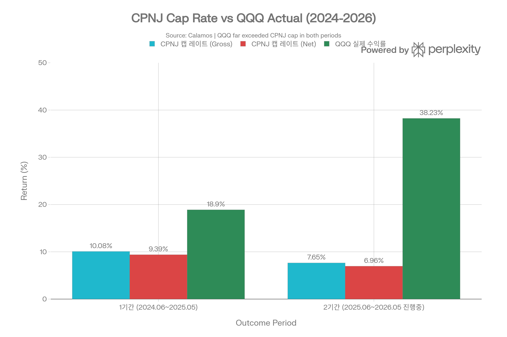
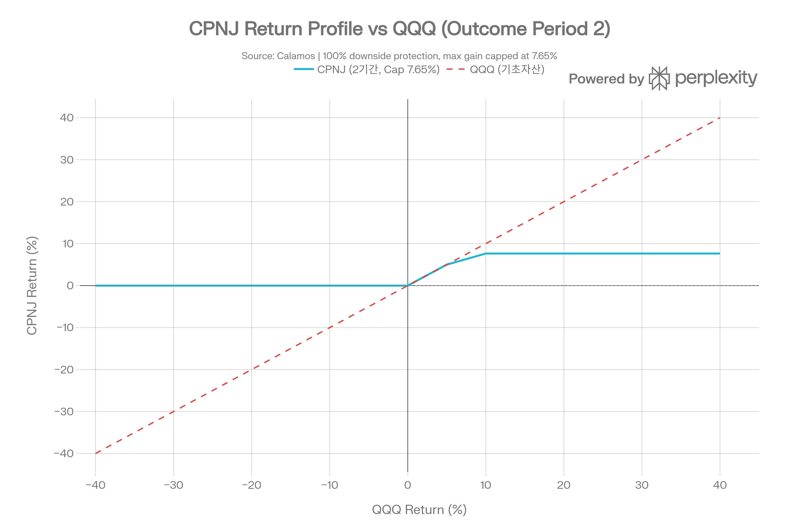
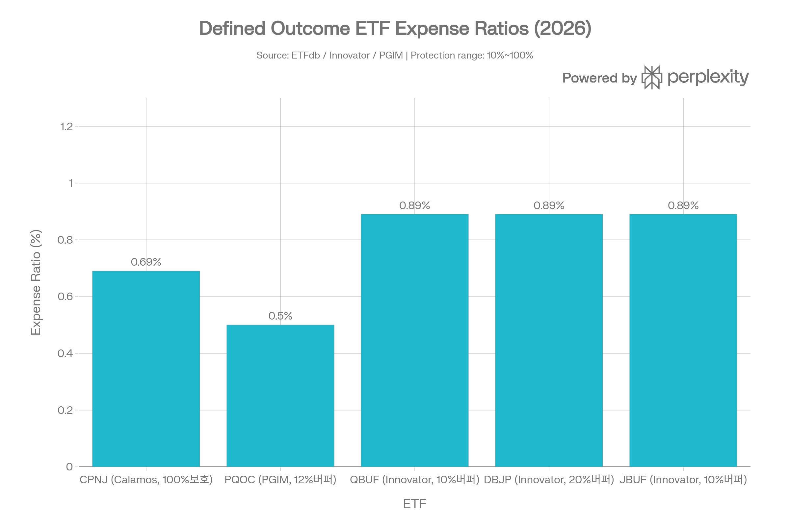
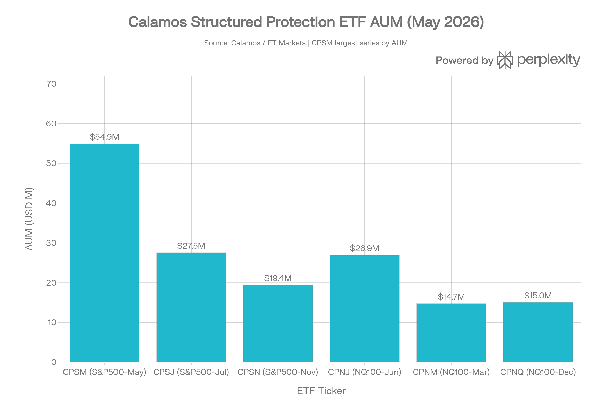

## 요약

> <strong>작성일</strong>: 2026년 5월 25일 기준 데이터 | <strong>운용사</strong>: Calamos Investments LLC | <strong>카테고리</strong>: Defined Outcome / 구조적 보호 ETF

***
## ETF 분류

| 항목 | 내용 |
|------|------|
| <strong>최종 폴더</strong> | `ETF/Defined Outcome/Capital Protection/CPNJ` |
| <strong>대분류</strong> | Defined Outcome |
| <strong>하위 분류</strong> | Capital Protection |
| <strong>핵심 전략</strong> | QQQ 가격 수익률 기준 하방 보호 + 상방 수익 제한 |
| <strong>운용 방식</strong> | 액티브 |
| <strong>레버리지·인버스 여부</strong> | 아니오 |
| <strong>옵션 인컴 전략 여부</strong> | 아니오 |
| <strong>주요 구조</strong> | FLEX 옵션 기반 구조적 보호 |

CPNJ는 Nasdaq-100 또는 QQQ 노출을 활용하지만, 핵심 목적은 대표지수 단순 추종이 아니라 <strong>정해진 아웃컴 기간 동안 하방 보호와 제한된 상방 참여를 제공하는 구조적 결과</strong>입니다. ETF 분류 기준상 실제 수익 구조와 투자 목적을 우선하므로 `Broad Market/Nasdaq-100`이 아니라 `Defined Outcome/Capital Protection`으로 분류합니다.

***
## 1. 기본 정보
CPNJ는 <strong>Calamos Investments LLC</strong>가 운용하는 <strong>Nasdaq-100 완전 하방 보호(100% Downside Protection) ETF</strong>로, 2024년 6월 3일 최초 상장되었다. 전 세계 최초로 Nasdaq-100에 대한 100% 원금 보호를 ETF 형태로 제공하는 상품으로 주목받았으며, Calamos S&P 500 Structured Alt Protection ETF(CPSM)의 성공(AUM \$100M 이상 달성) 이후 출시된 두 번째 구조적 보호 ETF 시리즈다.

| 항목 | 내용 |
|------|------|
| <strong>정식 명칭</strong> | Calamos Nasdaq-100 Structured Alt Protection ETF – June |
| <strong>티커</strong> | CPNJ (NYSE Arca) |
| <strong>설정일</strong> | 2024년 6월 3일 |
| <strong>운용 기간</strong> | 약 2년(2024년 6월 설정) |
| <strong>추종 지수</strong> | 없음 (액티브 관리) |
| <strong>벤치마크</strong> | MerQube Capital Protected US Large Cap Tech Index – June |
| <strong>기준 자산</strong> | Invesco QQQ Trust, Series 1 (QQQ) 가격 수익률 |
| <strong>운용사</strong> | Calamos Investments LLC |
| <strong>포트폴리오 매니저</strong> | Co-CIO Eli Pars 외 Alternatives Team |
| <strong>상장거래소</strong> | NYSE Arca, Inc. |
| <strong>순자산(AUM)</strong> | \$26.9M (2026년 5월 21일 기준) |
| <strong>NAV</strong> | \$27.61 (2026년 5월 22일) |
| <strong>시장가</strong> | \$27.62 (2026년 5월 22일) |
| <strong>총 보수(TER)</strong> | 0.69% |
| <strong>분배 배당</strong> | 없음(배당 미지급) |
| <strong>카테고리(Morningstar)</strong> | Defined Outcome |
| <strong>2025년 자본이득 분배</strong> | \$0 (무분배) |

***
## 2. 핵심 전략: 아웃컴 기간(Outcome Period) 구조
CPNJ는 <strong>전통적인 주식형 ETF와 근본적으로 다른 구조</strong>를 갖는 "정의된 결과(Defined Outcome)" 상품이다. 투자 결과는 반드시 아웃컴 기간(Outcome Period) 전체를 보유한 투자자에게만 적용된다.
### 아웃컴 기간 구조
```
매년 6월 초 리셋 → 1년 아웃컴 기간 시작 → 매년 5월 말 종료 → 다음 해 6월 새 캡 레이트로 재설정
```

- <strong>아웃컴 기간</strong>: 매년 약 1년(364일)
- <strong>보호 수준</strong>: 아웃컴 기간 전체 보유 시 QQQ 하락 손실 100% 차단
- <strong>캡 레이트</strong>: QQQ 상방 수익 참여의 최대 상한(매년 재설정)
- <strong>플로어(Floor)</strong>: 0%(보수 차감 전)/−0.69%(보수 차감 후)
### 두 개의 아웃컴 기간 실적
| 구분 | 1기간(2024.06.03\~2025.05.30) | 2기간(2025.06.02\~2026.05.29) |
|------|--------------------------|--------------------------|
| <strong>캡 레이트(Gross/Net)</strong> | 10.08% / 9.39% | 7.65% / 6.96% |
| <strong>QQQ 실제 수익률</strong> | 약 +18.9% | +38.23%(5/22 현재) |
| <strong>CPNJ 수익률</strong> | 약 +9.39%(캡 소진) | +6.89%(5/22 현재) |
| <strong>보호 기능 발동 여부</strong> | 해당 없음(시장 상승) | 해당 없음(시장 상승) |
| <strong>남은 기간</strong> | 0일(종료) | 7일(2026.05.22 기준) |



*▲ CPNJ 2기간 현황 (2026.05.22, 만기 7일 전): CPNJ +6.89% 달성, QQQ는 +38.23%로 캡 레이트 초과*

두 기간 모두 QQQ가 큰 폭으로 상승하여 <strong>CPNJ의 캡 레이트 상한에서 수익이 제한</strong>되었다. 이는 상승 시장에서 CPNJ가 보호 기능 대신 기회비용을 치르게 되는 구조를 잘 보여준다.



*▲ CPNJ 캡 레이트 vs QQQ 실제 수익률: 두 아웃컴 기간 모두 QQQ가 캡 레이트를 대폭 초과*

***
## 3. 투자 메커니즘: FLEX 옵션 칼라 전략
CPNJ는 <strong>FLEX(Flexible Exchange) 옵션</strong>을 활용하여 구조적 보호를 구현한다. FLEX 옵션은 표준화된 옵션과 달리 만기일, 행사가격 등 조건을 맞춤 설정할 수 있는 비표준 옵션이다.
### FLEX 옵션 3중 구조
<strong>① 풋 옵션 매수 (Downside Protection)</strong>
- QQQ에 대한 깊은 인더머니(Deep In-the-Money) 풋 옵션을 매수
- 행사가격: QQQ 시작가 수준(아웃컴 기간 첫날 NAV에 해당)
- 기능: QQQ가 하락해도 펀드 NAV가 시작 수준 이하로 떨어지지 않도록 방어

<strong>② 콜 옵션 매도 (Cap 설정을 통한 보호 비용 조달)</strong>
- QQQ에 대한 아웃오브더머니(Out-of-the-Money) 콜 옵션 매도
- 행사가격: 캡 레이트에 해당하는 수준(예: QQQ 시작가 × 107.65%)
- 기능: 콜 옵션 매도 프리미엄으로 풋 옵션 매수 비용을 충당
- 부작용: QQQ가 캡 이상 상승 시 초과 수익 포기

<strong>③ 포지션 조정 (비용 차감 보정)</strong>
- 보수(0.69%) 차감으로 인해 실제 Net 캡 레이트는 Gross 캡 레이트보다 약 0.69%p 낮음
- Net 플로어: -0.69%(보수 상당 손실은 피할 수 없음)
### 수익 구조 프로파일


*▲ CPNJ 수익 구조 프로파일: QQQ 하락 시 0% 보호(보수 차감 전), 상승 시 최대 7.65% 참여 후 상방 제한*

이 구조의 핵심 트레이드오프는 다음과 같다:
- QQQ가 <strong>하락</strong> → CPNJ는 0% 손실(완전 보호)
- QQQ가 <strong>소폭 상승(0\~캡)</strong> → CPNJ는 QQQ와 동행
- QQQ가 <strong>캡 초과 상승</strong> → CPNJ는 캡 레이트에서 수익 고정, 초과분 포기

***
## 4. 추종 성과 지표
### NAV 괴리율 및 추적 차이
| 항목 | 수치 |
|------|------|
| <strong>NAV 대비 시장가격 괴리율</strong> | +0.04% (소폭 프리미엄) |
| <strong>NAV</strong> | \$27.61 (2026.05.22) |
| <strong>시장가</strong> | \$27.62 (2026.05.22) |
| <strong>30일 중간 호가 스프레드</strong> | 미공시(타 Calamos 시리즈 기준 0.18\~0.21%) |
| <strong>현재 캡 레이트(Gross)</strong> | 0.08%(기간 말 소진) |
| <strong>현재 캡 레이트(Net)</strong> | 0.07% |
| <strong>현재 보호 수준</strong> | 92.94%(기간 중 감소) |

괴리율 +0.04%는 매우 낮은 수준으로 NAV와 시장가격이 거의 일치한다. 이는 Calamos 시리즈 다른 ETF(예: CPSM 괴리율 -0.27%)보다 양호한 추적 품질을 보여준다.
### 아웃컴 기간 종료 시점의 캡 현황
2026년 5월 22일 기준(만기 7일 전) 캡 레이트 잔여분이 0.08%/0.07%(Gross/Net)에 불과하다. 이는 CPNJ가 이미 이번 아웃컴 기간 상방 수익 대부분을 소진했음을 의미한다. 이 시점에 신규 매수한 투자자는 남은 상방 여지가 거의 없으면서도 하방 리스크에 노출된다.

***
## 5. 비용 구조
| 항목 | 수치 |
|------|------|
| <strong>총 보수(Gross Expense Ratio)</strong> | 0.69% |
| <strong>비용 감면</strong> | 없음 |
| <strong>포트폴리오 회전율</strong> | N/A (옵션 기반 구조) |
| <strong>최대 단기 자본이득세율</strong> | 39.60% |
| <strong>최대 장기 자본이득세율</strong> | 20.00% |
| <strong>세금 처리</strong> | Ordinary income |
| <strong>2025년 자본이득 분배</strong> | \$0 — 세금 효율적 ETF 구조 |
| <strong>K-1 세금 양식</strong> | 해당 없음 |
### 경쟁 ETF 보수 비교


*▲ Defined Outcome ETF 보수율 비교: CPNJ 0.69%, PGIM 버퍼(0.50%) 대비 높고 Innovator 시리즈(0.89%) 대비는 낮음*

| ETF | 운용사 | 보호 수준 | 보수 | AUM |
|-----|--------|---------|------|-----|
| <strong>CPNJ</strong> | Calamos | <strong>100% 완전 보호</strong> | <strong>0.69%</strong> | \$26.9M |
| PQOC | PGIM | 12% 버퍼 | 0.50% | \$16.7M |
| QBUF | Innovator | 10% 버퍼 | 0.89% | — |
| DBJP | Innovator | 20% 버퍼 | 0.89% | — |
| JBUF | Innovator | 10% 버퍼 | 0.89% | — |

100% 완전 보호를 제공하는 유일한 ETF로서 CPNJ의 0.69% 보수는 부분 버퍼 ETF(10\~20% 버퍼, 0.89%) 대비 오히려 낮다는 점이 주목할 만하다. 단순 패시브 ETF(QQQ 0.20%)와 비교하면 높지만, 구조적 보호 비용을 감안하면 경쟁력 있는 수준이다.

***
## 6. 유동성 평가
| 항목 | 수치 |
|------|------|
| <strong>AUM</strong> | \$26.9M (2026.05.21) |
| <strong>거래량</strong> | 소규모(일 수천\~수만 주 수준, 정확한 데이터 미공시) |
| <strong>호가 스프레드</strong> | Calamos 시리즈 유사 ETF 기준 0.18\~0.21% |
| <strong>옵션 거래 가능 여부</strong> | 없음 |
| <strong>숏 포지션 거래</strong> | 해당 없음 |

AUM \$26.9M은 소규모 ETF에 해당한다. 다만 정의된 결과(Defined Outcome) ETF 카테고리 내에서는 평균 수준이며, Calamos의 S&P 500 시리즈(CPSM \$54.9M) 대비 절반 수준이다. 유동성 측면에서 가장 중요한 리스크는 <strong>기간 중간 매도 시 시장가격과 이론적 옵션 가치 사이의 괴리</strong>가 발생할 수 있다는 점이다.



*▲ Calamos 구조적 보호 ETF 시리즈 AUM (2026.05): CPSM이 최대 규모(\$54.9M), CPNJ는 \$26.9M*

***
## 7. 포트폴리오 구성
CPNJ는 개별 주식이나 ETF 지분을 직접 보유하지 않는다. <strong>FLEX 옵션 계약으로 100% 구성</strong>된 독특한 포트폴리오 구조를 갖는다.
### 자산 유형
| 구분 | 비중 |
|------|------|
| FLEX 옵션 (QQQ 기반) | 99.21% |
| 현금 및 단기 금융 상품 | 0.79% |
| 주식 직접 보유 | 0% |
| 채권 | 0% |
### 보유 종목 수
- <strong>보유 종목 수</strong>: 2개(FLEX 콜 옵션 포지션 + FLEX 풋 옵션 포지션)
### 섹터·국가 배분
FLEX 옵션 구조 특성상 전통적인 섹터·국가 배분 분석이 적용되지 않는다. 기초 자산인 QQQ(Nasdaq-100)를 간접적으로 추적하므로, 기초 노출 측면에서는 기술 섹터 53%, 커뮤니케이션 서비스 16%, 소비재 12% 등 Nasdaq-100의 섹터 구성을 따른다.
### 리밸런싱 주기
- <strong>연간 1회</strong> 아웃컴 기간 종료 시(6월 초) 전체 옵션 포지션 재구성
- FLEX 옵션의 만기는 아웃컴 기간 종료일(5월 말)과 일치

***
## 8. 성과 분석
### 기간별 수익률
CPNJ는 2024년 6월 설정으로 3년/5년 데이터가 없다.

| 기간 | CPNJ 수익률 | ETF 카테고리 평균 | QQQ 비교 |
|------|------------|----------------|---------|
| 1개월 | +0.80% | +0.90% | +11.0% |
| 3개월 | +4.51% | +4.14% | — |
| YTD(2026년) | +4.08% | +1.89% | +1.66% |
| 1년 | +8.06% | +3.63% | +16.95% |
| 설정 이후(\~2025.06) | +9.39% (1기간 캡 소진) | — | +18.9% |
### 위험 조정 성과 지표
| 지표 | CPNJ | 설명 |
|------|------|------|
| <strong>최대 낙폭(MDD)</strong> | <strong>-5.99%</strong> | 2025.04.08 기록 |
| <strong>알파(Alpha, 연환산)</strong> | <strong>+3.62%</strong> | vs S&P 500 |
| <strong>베타</strong> | <strong>0.28</strong> | vs S&P 500 (낮은 시장 민감도) |
| <strong>R²</strong> | 0.78 | vs S&P 500 |
| <strong>표준편차</strong> | 0.56% | 매우 낮은 일간 변동성 |
| <strong>5일 변동성</strong> | 13.71% | — |
| <strong>20일 변동성</strong> | 2.75% | — |
| <strong>200일 변동성</strong> | 9.95% | — |
| <strong>Risk/Return 순위</strong> | 상위 93%ile | 위험 대비 수익 우수 |

<strong>MDD -5.99%</strong>는 주식형 ETF와 비교하면 매우 낮은 수준이다. 이 낙폭은 아웃컴 기간 중간에 발생한 것으로, 기간 전체를 보유하면 이론적으로 0%가 되는 구조다. 베타 0.28은 시장 대비 극히 낮은 변동성 노출을 보여주며, 이는 구조적 보호 메커니즘이 실제로 작동하고 있음을 의미한다.
### 월별 성과 특징
- <strong>87%의 달에 양수 수익률</strong> 기록
- 최고 월: 2025년 5월 +4.0%
- 최저 월: 2025년 3월 -2.0%
- 최고 단일일: 2025년 4월 9일 +3.3%
- 최저 단일일: 2025년 4월 3일 -2.2%

***
## 9. 배당 정보
CPNJ는 <strong>배당을 지급하지 않는다</strong>. 운용 구조상 배당 수익이 없으며, 이익은 모두 NAV 상승(자본이득)의 형태로 실현된다.

| 항목 | 내용 |
|------|------|
| <strong>배당 수익률</strong> | 0%(배당 없음) |
| <strong>배당 지급 이력</strong> | 해당 없음 |
| <strong>2025년 자본이득 분배</strong> | \$0 |
| <strong>세금 처리</strong> | 1년 이상 보유 시 장기 자본이득세율(최대 20%) 적용 |
### 세금 혜택 (Tax Alpha)
CPNJ의 중요한 특징 중 하나는 <strong>세금 이연(Tax-Deferred) 효과</strong>다:
- ETF 형태 내에서 자본이득이 실현되지 않고 이연됨
- 1년 이상 보유 시 장기 자본이득세율(20%) 적용 — 단기 자본이득세율(39.6%) 대비 절세 효과
- 아웃컴 기간 종료 후 재투자 시 세금 없이 복리 효과 가능
- 2025년 자본이득 분배 \$0으로 세금 효율성 입증

***
## 10. 리스크 요소
### 핵심 구조적 리스크
<strong>① 캡 제한 리스크(Cap Change Risk)</strong>
- 캡 레이트는 매년 재설정되며, 금리·변동성 환경에 따라 변동한다
- 금리 하락 시 캡 레이트도 낮아질 수 있음
- 1기간 캡 10.08% → 2기간 캡 7.65%로 이미 하락

<strong>② 아웃컴 기간 미완성 리스크(Timing Risk)</strong>
- 기간 중간에 매수하거나 매도하면 의도된 보호 효과를 받지 못할 수 있음
- 기간 말(현재처럼 잔여 7일)에 신규 매수 시 상방 여지가 거의 없음

<strong>③ 시장 상승 기회비용 리스크</strong>
- QQQ가 캡 레이트를 크게 초과 상승할 경우 대규모 기회비용 발생
- 1기간 QQQ +18.9% vs CPNJ +9.39% → 약 9.5%p 기회비용
- 2기간 QQQ +38.23% vs CPNJ +6.89% → 약 31.3%p 기회비용

<strong>④ FLEX 옵션 유동성 리스크</strong>
- FLEX 옵션은 비표준 맞춤형 계약으로, 표준 옵션 대비 유동성이 낮을 수 있음
- 기간 중 포지션 조정이 어려울 수 있음

<strong>⑤ 카운터파티 리스크(Counterparty Risk)</strong>
- FLEX 옵션 계약 상대방(대형 금융기관)의 채무 불이행 시 보호 기능 손실 가능
- OCC(Options Clearing Corporation) 보증 구조로 위험 일부 완화

<strong>⑥ 소규모 AUM 리스크</strong>
- AUM \$26.9M은 ETF 청산 가능성 임계에 가까운 수준
- Calamos의 더 큰 S&P 500 시리즈(CPSM \$54.9M)에 비해 규모가 작음

<strong>⑦ 보수 차감 후 실효 하방 리스크</strong>
- Gross 기준 100% 보호이나, Net 기준 0.69% 손실 가능성 존재
- 연속 보유 시 매년 0.69% 보수 비용 누적
### 베타 및 상관관계
| 비교 자산 | CPNJ와의 관계 |
|----------|------------|
| QQQ (기초 자산) | 0\~캡 구간에서 양의 상관, 하락 시 무상관 |
| S&P 500 | 베타 0.28(낮음) |
| 채권(BND) | 낮은 상관 |
| VIX(변동성) | 역의 상관(변동성 상승 → 캡 레이트 상승 가능성) |

***
## 11. Calamos 구조적 보호 ETF 전체 시리즈
Calamos는 다양한 기초 자산과 월별 시리즈로 구조적 보호 ETF 라인업을 운영한다:
### Nasdaq-100 시리즈 (CPNX 계열)
| 티커 | 이름 | 설정일 | AUM |
|------|------|-------|-----|
| <strong>CPNJ</strong> | Calamos NQ-100 Structured Alt Protection – June | 2024.06.03 | \$26.9M |
| CPNS | Calamos NQ-100 Structured Alt Protection – September | 2024.09.01 | — |
| CPNQ | Calamos NQ-100 Structured Alt Protection – December | 2024.12.02 | \$15.0M(추정) |
| CPNM | Calamos NQ-100 Structured Alt Protection – March | 2025.03.03 | \$14.7M |
### S&P 500 시리즈
| 티커 | 설정일 | AUM |
|------|-------|-----|
| CPSM (May) | 2024.05.01 | \$54.9M |
| CPSJ (July) | 2024.07.01 | \$27.5M(추정) |
| CPSN (November) | 2024.11.01 | \$19.4M |
| CPSU (June) | 2025.06.02 | — |

***
## 12. 투자자 고려사항 및 총평
<strong>CPNJ는 Nasdaq-100 하락을 완전히 차단하면서 제한적 상방 참여를 제공하는 혁신적 구조적 보호 ETF다.</strong> 단, 최적 효과는 아웃컴 기간 첫날 매수 후 마지막 날까지 보유한 경우에만 실현된다.
### 핵심 장·단점
| 구분 | 내용 |
|------|------|
| <strong>장점</strong> | 100% 하방 보호(보수 차감 전), 세금 이연 효과(Tax Alpha), 낮은 베타(0.28) & MDD(-5.99%), 정기 자본이득 \$0 |
| <strong>단점</strong> | 상방 캡 레이트 제한(7.65%, 1기간 10.08%에서 하락), 소규모 AUM \$26.9M, 아웃컴 기간 중간 투자 효율 저하, 기회비용 큼(QQQ +38% vs CPNJ +7%) |
### 투자 적합 프로파일
- <strong>적합</strong>: 원금 보전 최우선 투자자, 은퇴 준비·직전 투자자, Nasdaq-100 노출을 원하지만 급락 리스크가 두려운 투자자, 세금 이연 효과를 원하는 고소득 투자자
- <strong>부적합</strong>: 강한 상승 시장에서 최대 수익을 추구하는 공격적 투자자, 단기 트레이더, 배당 인컴이 필요한 투자자, 기간 중 수시 입출금이 필요한 투자자
### 현재 시점(2026년 5월) 투자 주의사항
2026년 5월 22일 기준으로 현재 아웃컴 기간 종료까지 <strong>7일 남았다</strong>. 이 시점의 신규 투자자는:
1. 남은 상방 여지 0.07%(Net)에 불과
2. 하방 보호 수준도 92.94%로 감소한 상태
3. <strong>신규 투자를 원한다면 2026년 6월 2일 새 아웃컴 기간 시작 시점까지 대기 권장</strong>
### 핵심 지표 요약
| 항목 | 평가 |
|------|------|
| 하방 보호 강도 | ⭐⭐⭐⭐⭐ (100% 완전 보호) |
| 장기 성과 잠재력 | ⭐⭐ (캡 레이트 7.65%, 기회비용 큼) |
| 비용 효율성 | ⭐⭐⭐ (0.69%, 버퍼 ETF 대비 경쟁력) |
| 세금 효율성 | ⭐⭐⭐⭐⭐ (자본이득 이연, \$0 분배) |
| 유동성 | ⭐⭐ (AUM \$26.9M, 소형) |
| 운용 이력 | ⭐⭐ (설정 2년 미만) |
| 변동성 제어 | ⭐⭐⭐⭐⭐ (베타 0.28, MDD -5.99%) |
| 투자 진입 타이밍 중요도 | 🔴 매우 높음 (반드시 기간 첫날 매수해야 최대 효과) |

> ⚠️ <strong>면책 조항</strong>: 본 보고서는 정보 제공 목적으로 작성되었으며, 투자 권고로 해석되어서는 안 된다. CPNJ의 보호 효과는 반드시 아웃컴 기간 전체 보유 시에만 실현되며, 기간 중간에 매매하는 경우 의도된 결과와 다를 수 있다. 모든 투자에는 원금 손실 가능성이 있다.
