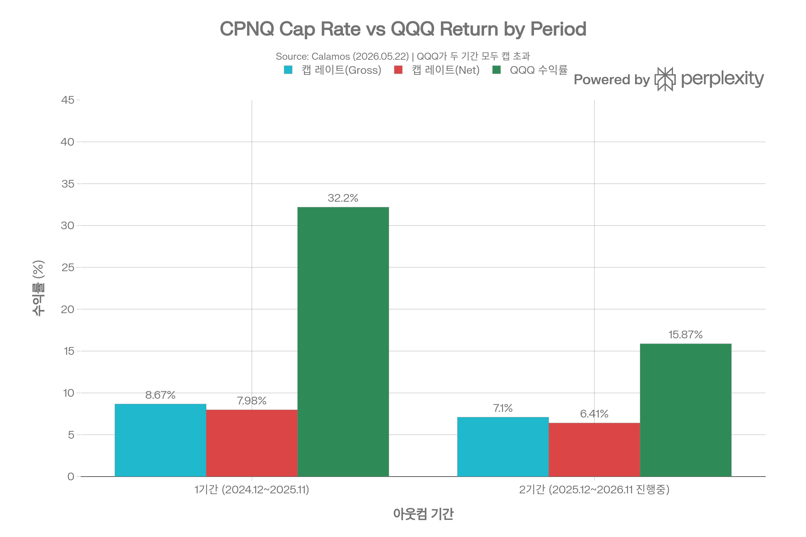
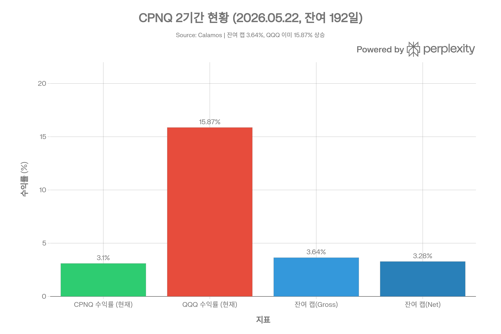
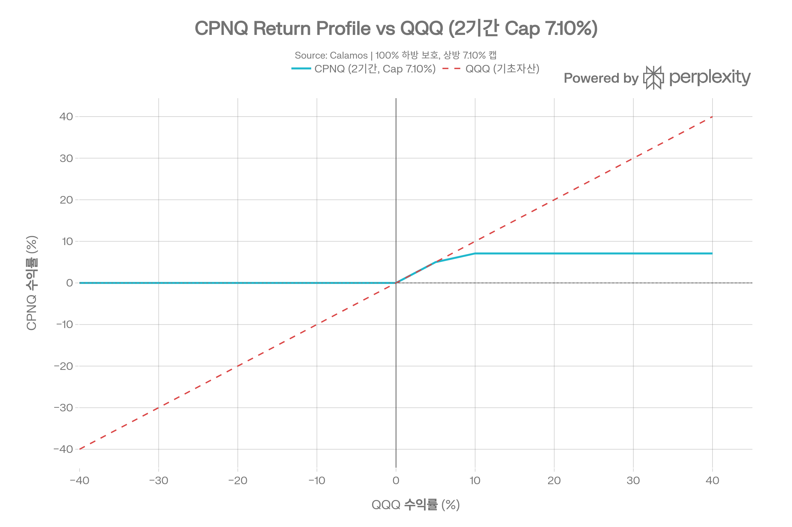
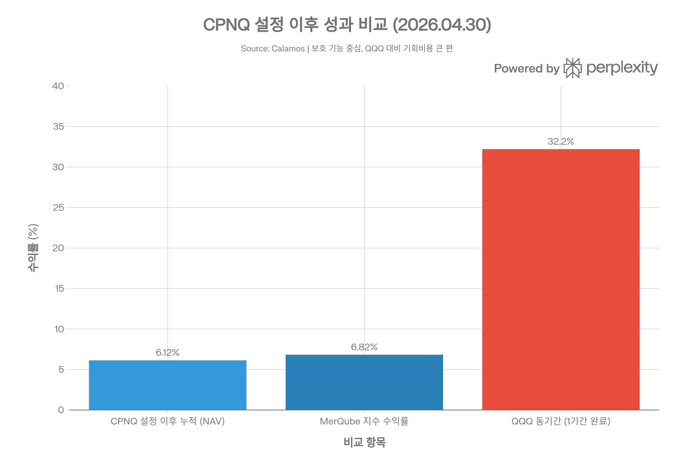
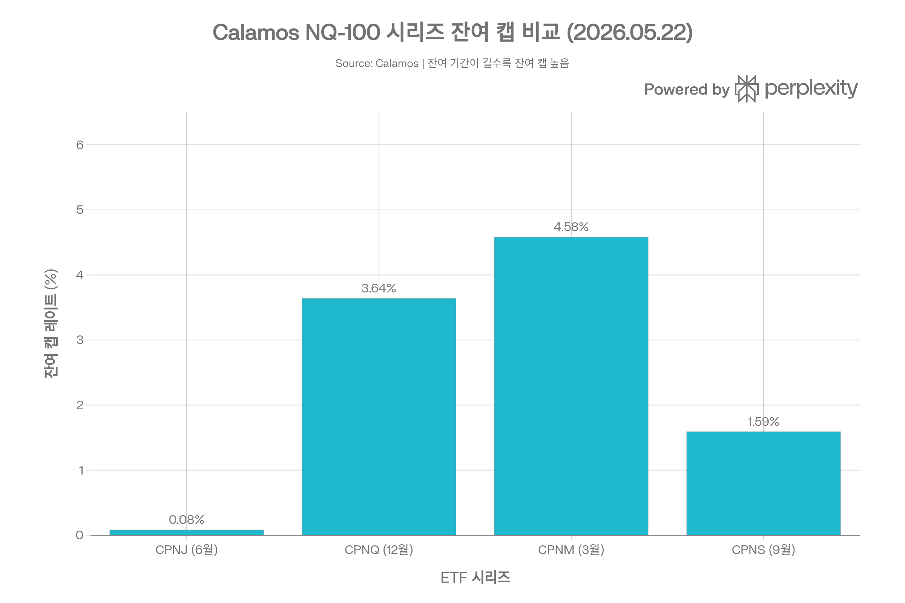

## 요약

> <strong>작성일</strong>: 2026년 5월 25일 기준 데이터 | <strong>운용사</strong>: Calamos Investments LLC | <strong>카테고리</strong>: Defined Outcome / 구조적 보호 ETF

***
## ETF 분류

| 항목 | 내용 |
|------|------|
| <strong>최종 폴더</strong> | `ETF/Defined Outcome/Capital Protection/CPNQ` |
| <strong>대분류</strong> | Defined Outcome |
| <strong>하위 분류</strong> | Capital Protection |
| <strong>핵심 전략</strong> | QQQ 가격 수익률 기준 하방 보호 + 상방 수익 제한 |
| <strong>운용 방식</strong> | 액티브 |
| <strong>레버리지·인버스 여부</strong> | 아니오 |
| <strong>옵션 인컴 전략 여부</strong> | 아니오 |
| <strong>주요 구조</strong> | FLEX 옵션 기반 구조적 보호 |

CPNQ는 Nasdaq-100 또는 QQQ 노출을 활용하지만, 핵심 목적은 대표지수 단순 추종이 아니라 <strong>정해진 아웃컴 기간 동안 하방 보호와 제한된 상방 참여를 제공하는 구조적 결과</strong>입니다. ETF 분류 기준상 실제 수익 구조와 투자 목적을 우선하므로 `Broad Market/Nasdaq-100`이 아니라 `Defined Outcome/Capital Protection`으로 분류합니다.

***
## 1. 기본 정보
CPNQ는 <strong>Calamos Investments LLC</strong>가 운용하는 <strong>Nasdaq-100 100% 하방 완전 보호 ETF</strong>로, 2024년 12월 2일 설정된 Calamos Structured Protection ETF 시리즈 중 <strong>12월물(December)</strong>이다. CPNJ(6월), CPNS(9월), CPNM(3월)과 함께 Nasdaq-100 연속 보호 시리즈를 구성하며, 매 12월 첫 거래일에 새 아웃컴 기간이 시작된다.

| 항목 | 내용 |
|------|------|
| <strong>정식 명칭</strong> | Calamos Nasdaq-100 Structured Alt Protection ETF – December |
| <strong>티커</strong> | CPNQ (NYSE Arca) |
| <strong>설정일</strong> | 2024년 12월 2일 |
| <strong>운용 기간</strong> | 약 1.5년 (2026년 5월 기준) |
| <strong>추종 지수</strong> | 없음 (액티브 관리) |
| <strong>벤치마크</strong> | MerQube Capital Protected US Large Cap Tech PR Index – December (MQQ1PP12) |
| <strong>기준 자산</strong> | Invesco QQQ Trust, Series 1 (QQQ) 가격 수익률 |
| <strong>운용사</strong> | Calamos Investments LLC |
| <strong>포트폴리오 매니저</strong> | Co-CIO Eli Pars 외 Alternatives Team |
| <strong>상장거래소</strong> | NYSE Arca, Inc. |
| <strong>순자산(AUM)</strong> | <strong>$32.1M</strong> (2026년 5월 21일 기준) |
| <strong>NAV</strong> | $27.34 (2026년 5월 22일) |
| <strong>시장가</strong> | $27.25 (2026년 5월 22일) |
| <strong>총 보수(TER)</strong> | <strong>0.69%</strong> |
| <strong>분배 배당</strong> | 없음 |
| <strong>52주 가격 범위</strong> | $23.98 \~ $27.24 |
| <strong>1년 가격 변동률</strong> | +10.31% |

***
## 2. 아웃컴 기간 구조
CPNQ는 매년 12월 초 리셋되는 <strong>1년 아웃컴 기간(Outcome Period)</strong> 구조를 가진다. 투자 결과는 반드시 아웃컴 기간 전체(시작일부터 만료일까지)를 보유한 투자자에게만 보장된다.

```
매년 12월 초 리셋 → 1년 아웃컴 기간 → 다음 해 11월 말 종료
→ 새 캡 레이트로 재설정
```
### 두 개의 아웃컴 기간 현황
| 구분 | 1기간 (2024.12.02 \~ 2025.11.28) | 2기간 (2025.12.01 \~ 2026.11.27 진행중) |
|------|-------------------------------|--------------------------------------|
| <strong>캡 레이트(Gross/Net)</strong> | <strong>8.67% / 7.98%</strong> | <strong>7.10% / 6.41%</strong> |
| <strong>기간 시작 QQQ 가격</strong> | $526.92(추정) | $619.25 |
| <strong>기간 종료 / 현재 QQQ</strong> | 기간 종료 | $717.54 (2026.05.22) |
| <strong>QQQ 기간 수익률</strong> | \~+32.2%(추정) | <strong>+15.87%</strong> (2026.05.22 현재) |
| <strong>CPNQ 수익률</strong> | \~+7.98%(캡 소진) | <strong>+3.10%</strong> (2026.05.22 현재) |
| <strong>잔여 캡(Gross/Net)</strong> | 0%(소진) | <strong>3.64% / 3.28%</strong> |
| <strong>현재 보호 수준</strong> | 완전 보호(기간 완료) | <strong>96.77% / 96.41%</strong> |
| <strong>남은 기간</strong> | 0일(종료) | <strong>192일</strong> (2026.05.22 기준) |



*▲ CPNQ 캡 레이트 vs QQQ 수익률: 두 기간 모두 QQQ가 캡을 크게 초과*

<strong>1기간 분석</strong>: 첫 아웃컴 기간(2024.12\~2025.11) 동안 QQQ는 약 +32.2% 상승하여 캡 레이트 8.67%를 대폭 초과했다. CPNQ 보유자는 약 +7.98%(Net) 달성 후 추가 수익 없이 기간을 마감했다.

<strong>2기간 분석</strong>: 2025년 12월 1일 시작된 두 번째 아웃컴 기간에서 2026년 5월 22일 기준 QQQ는 이미 +15.87% 상승하여 캡(7.10%)을 훨씬 초과했다. 현재 잔여 캡이 3.64%이므로, 이미 상당 부분 상방 수익이 소진된 상태다.



*▲ CPNQ 2기간 현황 (2026.05.22): 잔여 캡 3.64%, QQQ +15.87%로 이미 초과*

***
## 3. 투자 메커니즘: FLEX 옵션 칼라 전략
CPNQ는 CPNJ와 동일한 <strong>FLEX(Flexible Exchange) 옵션 칼라</strong> 구조를 활용한다:

| 옵션 포지션 | 내용 | 목적 |
|-----------|------|------|
| <strong>깊은 인더머니 풋 매수</strong> | QQQ 시작가 기준 행사가 | 하방 100% 보호 제공 |
| <strong>아웃오브더머니 콜 매도</strong> | 캡 레이트 기준 행사가 | 풋 매수 비용 조달, 상방 제한 |
| <strong>옵션 만기</strong> | 아웃컴 기간 종료일 일치 | 기간 내 완전한 보호 구조 유지 |



*▲ CPNQ 수익 구조: QQQ 하락 시 0% 손실 보호, 상승 시 최대 7.10% 참여(2기간)*
### 보유 자산 구성
- <strong>FLEX 콜 옵션</strong>: 포트폴리오의 \~99%
- <strong>FLEX 풋 옵션</strong>: 포트폴리오의 \~99% (매수 포지션)
- <strong>현금·단기 금융상품</strong>: 약 1%
- <strong>주식 직접 보유</strong>: 0%

***
## 4. 추종 성과 지표
### NAV 괴리율 및 추적 차이
| 항목 | 수치 |
|------|------|
| <strong>NAV 괴리율</strong> | <strong>-0.33%</strong> (소폭 디스카운트) |
| <strong>NAV</strong> | $27.34 (2026.05.22) |
| <strong>시장가</strong> | $27.25 (2026.05.22) |
| <strong>30일 중간 호가 스프레드</strong> | 약 0.18\~0.21%(시리즈 전체 기준) |

CPNQ의 NAV 대비 시장가가 -0.33% 디스카운트를 보인다는 점은 CPNJ(+0.04% 프리미엄)와 다소 다른 양상이다. 이는 CPNQ의 소규모 AUM($32.1M)과 상대적으로 낮은 거래 활성도에서 비롯될 수 있다.
### 성과 기록 (2026.04.30 기준)
| 기간 | CPNQ 시장가 | CPNQ NAV | MerQube 지수 |
|------|-----------|---------|-----------|
| <strong>1개월</strong> | +1.84% | +2.26% | +2.32% |
| <strong>6개월</strong> | +2.81% | +2.89% | +2.86% |
| <strong>1년</strong> | +10.22% | <strong>+10.16%</strong> | +11.14% |
| <strong>설정 이후(2024.12.02)</strong> | +7.33% | <strong>+7.44%</strong> | +8.16% |

*※ 2026.03.31 기준: 1년 8.89%(시장가) / 8.47%(NAV), 설정 이후 6.33%(시장가) / 6.12%(NAV)*



*▲ CPNQ 설정 이후 성과: NAV +7.44%, MerQube 지수 +8.16%, QQQ \~+32%(1기간 기준)*
### 아웃컴 기간 캡 레이트 추이
캡 레이트는 매 기간 리셋 시점의 시장 변동성·금리 환경에 따라 결정된다:

| 기간 | 캡 레이트(Gross) | 캡 레이트(Net) | 비고 |
|------|---------------|-------------|------|
| 1기간(2024.12) | <strong>8.67%</strong> | 7.98% | 초기 출시 시 높은 변동성 반영 |
| 2기간(2025.12) | <strong>7.10%</strong> | 6.41% | 변동성 하락으로 캡 감소 |

같은 Calamos NQ-100 시리즈 내 타 ETF와의 캡 레이트 비교:

| 시리즈 | 현재 캡 레이트(Gross) | 남은 기간 | AUM |
|-------|-----------------|--------|-----|
| CPNJ(6월) | 0.08% | 7일 | $26.9M |
| CPNS(9월) | 1.59% | 101일 | \~$25M |
| <strong>CPNQ(12월)</strong> | <strong>3.64%</strong> | <strong>192일</strong> | <strong>$32.1M</strong> |
| CPNM(3월) | 4.58% | 280일 | $14.7M |



*▲ Calamos NQ-100 시리즈 잔여 캡 비교: 잔여 기간이 길수록 잔여 상방 여지 큼*

***
## 5. 비용 구조
| 항목 | 수치 |
|------|------|
| <strong>총 보수(TER)</strong> | 0.69% |
| <strong>비용 감면</strong> | 없음 |
| <strong>포트폴리오 회전율</strong> | N/A (FLEX 옵션 구조) |
| <strong>보수 적용 기준서일</strong> | 2025년 12월 1일 |
| <strong>최대 단기 자본이득세율</strong> | 39.60% |
| <strong>최대 장기 자본이득세율</strong> | 20.00% |
| <strong>세금 처리</strong> | 1년 이상 보유 시 장기 자본이득 과세 |
| <strong>K-1 세금 양식</strong> | 없음 |
| <strong>2025년 자본이득 분배</strong> | $0 (무분배, 세금 이연) |

0.69% 보수율은 Calamos 전체 Structured Protection ETF 시리즈와 동일한 요율이다. CPNJ와 같이 증권 대여 수익 없이 순수 FLEX 옵션 구조로만 운용된다.

***
## 6. 유동성 평가
| 항목 | 수치 |
|------|------|
| <strong>AUM</strong> | $32.1M (2026.05.21) |
| <strong>30일 호가 스프레드</strong> | \~0.18\~0.21%(시리즈 기준) |
| <strong>일평균 거래량</strong> | 소규모(수천 주 내외, 정확한 수치 미공개) |
| <strong>NAV 괴리율</strong> | -0.33% |
| <strong>옵션 거래 가능 여부</strong> | 없음 |
| <strong>청산 위험 임계</strong> | AUM $100M 미만으로 주의 필요 |

CPNQ의 AUM $32.1M은 CPNJ($26.9M)보다 소폭 크지만 여전히 ETF 업계 안정 기준($100M) 미만이다. 다만 Calamos의 전체 시리즈가 운용 중이며, S&P 500 시리즈와 패키지 형태로 마케팅되어 단독 청산 가능성은 낮은 편이다.

***
## 7. 포트폴리오 구성
CPNQ는 FLEX 옵션만으로 포트폴리오가 구성된다. 전통적인 섹터·국가·시가총액 배분 분석이 적용되지 않는다.

| 구분 | 비중 |
|------|------|
| FLEX 옵션 (QQQ 기반) | \~99% |
| 현금 및 단기 금융상품 | \~1% |
| 개별 주식 | 0% |
| 채권 | 0% |
| 보유 계약 수 | 2개(콜·풋) |

- <strong>리밸런싱</strong>: 연간 1회, 12월 초 아웃컴 기간 리셋 시 전체 옵션 포지션 재구성
- <strong>기초 자산 노출</strong>: QQQ(Nasdaq-100 추적)를 통한 간접 노출

***
## 8. 성과 분석
### 위험 지표
| 지표 | 수치 |
|------|------|
| <strong>최대 낙폭(MDD, 1년)</strong> | -20.07% |
| <strong>최고 1년 수익률</strong> | +30.23% |
| <strong>최저 1년 수익률</strong> | +11.85% |
| <strong>평균 상승 수익률(1년)</strong> | +11.56% |
| <strong>하방 포착 비율(Down Capture)</strong> | <strong>0.00%</strong> (완전 하방 보호) |
| <strong>상방 포착 비율(Up Capture, 1년)</strong> | +1,874.56%(vs 벤치마크) |
| <strong>소르티노 비율(1년)</strong> | 4.16 |
| <strong>정보 비율(Information Ratio, 1년)</strong> | 1.81 |
| <strong>배팅 어베리지(월 양수 비율, 1년)</strong> | 66.67% |

<strong>하방 포착 비율 0.00%</strong>는 구조적 보호의 완전한 작동을 의미한다. 즉, 벤치마크가 하락하는 달에도 CPNQ는 손실을 기록하지 않았음을 보여준다. 소르티노 비율 4.16은 하방 위험 대비 수익이 매우 양호함을 나타낸다.
### 성과 비교: CPNQ vs CPNJ vs QQQ
| 항목 | CPNQ(12월물) | CPNJ(6월물) | QQQ(기초자산) |
|------|------------|------------|------------|
| <strong>설정일</strong> | 2024.12.02 | 2024.06.03 | — |
| <strong>1기간 캡(Gross/Net)</strong> | 8.67% / 7.98% | 10.08% / 9.39% | — |
| <strong>2기간 캡(Gross/Net)</strong> | 7.10% / 6.41% | 7.65% / 6.96% | — |
| <strong>설정 이후 수익률(NAV)</strong> | +7.44% | +9.39%(1기간 완료) | +48%(추정) |
| <strong>AUM</strong> | $32.1M | $26.9M | — |
| <strong>현재 NAV 괴리율</strong> | <strong>-0.33%</strong> | +0.04% | — |

***
## 9. 배당 정보
CPNQ는 <strong>배당을 지급하지 않는다</strong>. 수익은 NAV 상승(자본이득)의 형태로만 실현된다.

| 항목 | 내용 |
|------|------|
| <strong>배당 수익률</strong> | 0%(배당 없음) |
| <strong>2025년 자본이득 분배</strong> | $0 |
| <strong>세금 처리</strong> | 1년 이상 보유 시 장기 자본이득세율 적용 |

<strong>세금 알파(Tax Alpha) 효과</strong>: ETF 구조 내에서 자본이득이 이연되어, 1년 이상 보유 시 최대 39.60%의 단기 자본이득세 대신 20.00%의 장기 자본이득세 적용이 가능하다. 이 세제 혜택은 고소득·고세율 투자자에게 실질적 추가 수익(Tax Alpha)으로 작용한다.

***
## 10. 리스크 요소
### 핵심 구조적 리스크
<strong>① 캡 레이트 하락 추세</strong>
- 1기간 캡 8.67% → 2기간 캡 7.10%로 하락
- 금리·변동성 환경 변화에 따라 캡이 더 낮아질 수 있음
- 극단적 경우 최소 1% 캡으로 하락 가능(MerQube 지수 조건)

<strong>② 아웃컴 기간 중간 진입 리스크</strong>
- 현재(2026.05.22) 잔여 캡 3.64%, 잔여 보호 96.77%
- 이 시점 신규 매수 시: QQQ가 캡까지 추가 상승할 여지는 3.64%에 불과
- 반면 QQQ가 현재에서 약 3.23%(Gross) 이상 하락하면 손실 발생

<strong>③ 시장 상승기 기회비용</strong>
- 1기간 QQQ +32.2% vs CPNQ +7.98% → 약 24.2%p 기회비용
- 2기간 현재 QQQ +15.87% vs CPNQ +3.10% → 약 12.8%p 기회비용

<strong>④ NAV 디스카운트 리스크</strong>
- 현재 -0.33% 디스카운트로 시장가가 NAV보다 낮음
- 기간 중 거래 시 이론적 가치보다 낮은 가격에 매도 가능성

<strong>⑤ 소규모 AUM 리스크</strong>
- AUM $32.1M은 ETF 안정 기준($100M) 미만
- Calamos 전체 시리즈 운용 중이므로 단독 청산 가능성은 제한적

<strong>⑥ 보수 차감 후 실효 하방</strong>
- Gross 기준 100% 보호이지만 Net 기준으로 플로어가 -0.69%
- 즉 보수 해당 손실(연 0.69%)은 불가피

<strong>⑦ FLEX 옵션 카운터파티 리스크</strong>
- FLEX 옵션 계약 상대방 채무 불이행 시 보호 기능 훼손 가능
- OCC(Options Clearing Corporation) 보증으로 부분적 완화

***
## 11. Calamos NQ-100 시리즈 내 CPNQ의 위치
CPNQ는 Calamos NQ-100 4개 시리즈(3월/6월/9월/12월) 중 <strong>AUM 기준 최대</strong> 규모다.

| 시리즈 | 설정일 | AUM | 잔여 캡(Gross) | 잔여일 |
|-------|-------|-----|------------|------|
| CPNJ(6월) | 2024.06.03 | $26.9M | 0.08% | 7일 |
| CPNS(9월) | 2024.09.03 | \~$25M | 1.59% | 101일 |
| <strong>CPNQ(12월)</strong> | <strong>2024.12.02</strong> | <strong>$32.1M</strong> | <strong>3.64%</strong> | <strong>192일</strong> |
| CPNM(3월) | 2025.03.03 | $14.7M | 4.58% | 280일 |

2026년 5월 현재 CPNQ는 잔여 캡 3.64%와 192일이 남아, CPNM(4.58%, 280일) 다음으로 가장 많은 상방 여지를 보유한다. 기간 초기에 매수했더라면 더 많은 상방 참여 기회가 있었겠으나, 현재 시점에서는 잔여 캡이 제한적이다.

***
## 12. 총평 및 투자자 고려사항
<strong>CPNQ는 Nasdaq-100(QQQ)에 대한 100% 하방 보호를 제공하는 12월물 구조적 보호 ETF다.</strong> 하방 포착 비율 0.00%, 소르티노 비율 4.16이라는 지표는 구조적 보호가 실제로 작동하고 있음을 입증한다.
### 핵심 장·단점
| 구분 | 내용 |
|------|------|
| <strong>장점</strong> | QQQ 100% 하방 보호(보수 전), 설정 이후 연환산 약 +7.44% NAV, 하방 포착 0% / 소르티노 4.16, 세금 이연(Tax Alpha), 자본이득 분배 $0, 시리즈 내 최대 AUM($32.1M) |
| <strong>단점</strong> | 캡 레이트 8.67% → 7.10%로 하락 추세, AUM $32.1M(안정 기준 $100M 미만), 시장가 NAV 대비 -0.33% 디스카운트, 기회비용 큼(1기간 QQQ +32% vs CPNQ +8%), 기간 중 진입 시 보호 수준 96.77%로 완전하지 않음 |
### 현재 시점(2026년 5월) 투자 주의사항
2026년 5월 22일 기준 192일이 남았고 잔여 캡은 3.64%(Gross)다. 현재 신규 매수 시:
- 상방 가능 수익: 최대 3.64%(2026년 11월 말까지)
- 하방 리스크: -3.23%(QQQ가 현재 수준에서 하락 시)
- <strong>새 아웃컴 기간은 2026년 12월 1일 시작</strong>되며, 이 시점에 새 캡 레이트(통상 6\~8% 수준 예상)로 리셋된다

완전한 100% 보호와 최대 상방 참여를 원한다면 <strong>2026년 12월 1일 새 기간 시작 시점에 진입하는 것이 최적</strong>이다.
### 투자 적합 프로파일
- <strong>적합</strong>: 원금 보전이 최우선인 투자자, 은퇴 예정자, Nasdaq-100 하락 리스크 없이 부분 참여를 원하는 투자자, 세금 이연 효과를 활용하고자 하는 고세율 투자자
- <strong>부적합</strong>: 상승 시장에서 최대 수익을 추구하는 공격적 투자자, 유동성이 충분한 대형 ETF를 선호하는 투자자, 정기 배당 인컴이 필요한 투자자, 기간 중 자유롭게 매매하고자 하는 단기 트레이더

> ⚠️ <strong>면책 조항</strong>: 본 보고서는 정보 제공 목적으로 작성되었으며 투자 권고로 해석되어서는 안 된다. CPNQ의 100% 보호는 반드시 아웃컴 기간 전체 보유 시에만 실현되며, 기간 중간 매매 시 의도된 결과와 다를 수 있다. 모든 투자에는 원금 손실 가능성이 있다.
