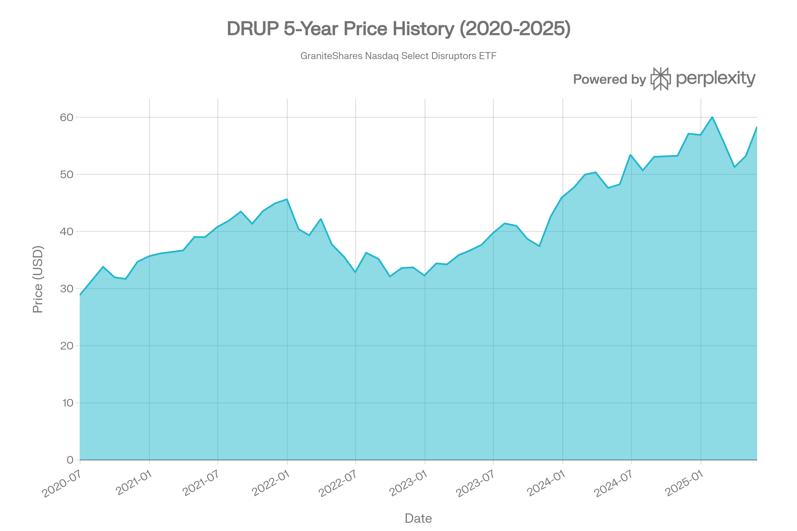
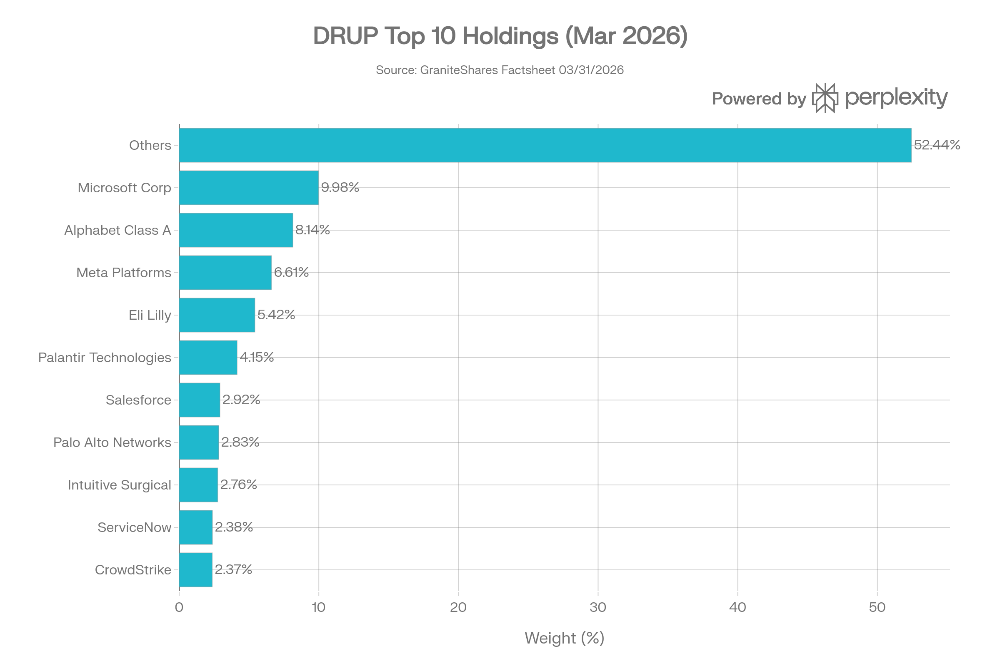
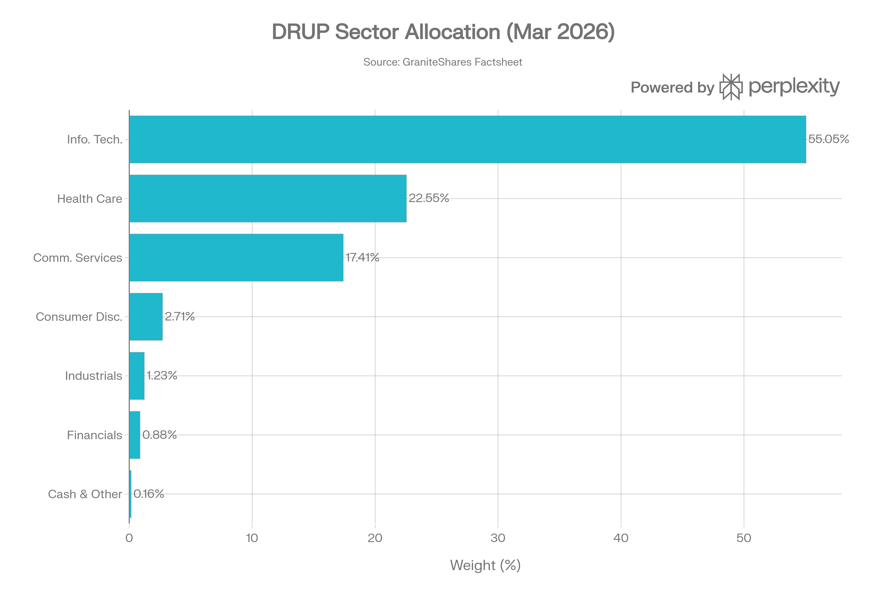
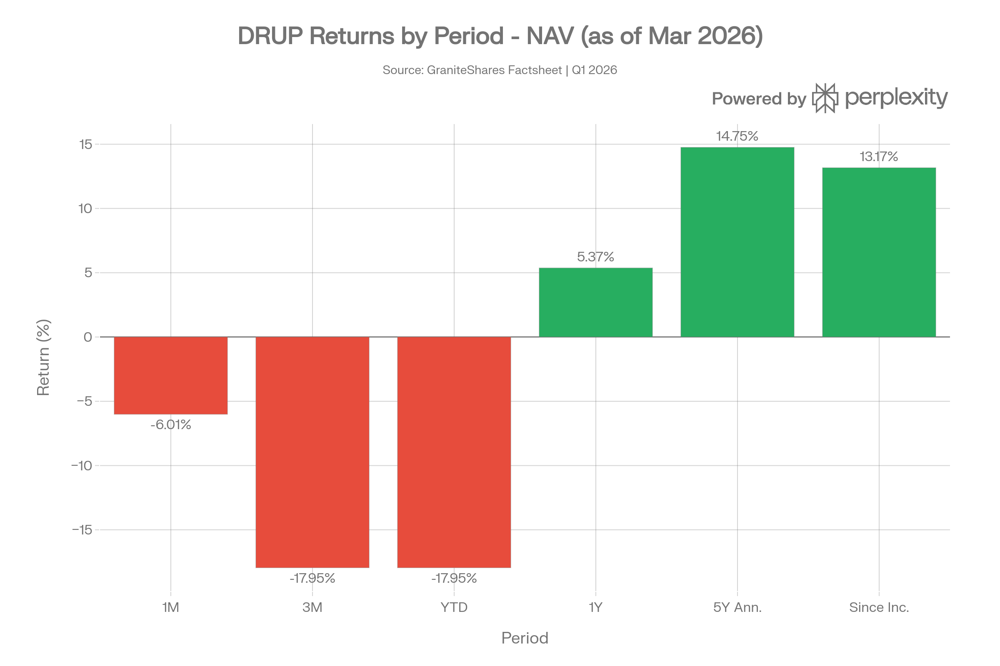

## 요약

> <strong>작성일</strong>: 2026년 5월 25일 기준 데이터 | <strong>운용사</strong>: GraniteShares Advisors LLC

***
## ETF 분류

| 항목 | 내용 |
|------|------|
| <strong>최종 폴더</strong> | `ETF/Disruptive Innovation/DRUP` |
| <strong>대분류</strong> | 테마 |
| <strong>하위 분류</strong> | 파괴적 혁신 |
| <strong>핵심 전략</strong> | Nasdaq US Large Cap Select Disruptors Index 추종 |
| <strong>운용 방식</strong> | 패시브 |
| <strong>레버리지·인버스 여부</strong> | 아니오 |
| <strong>옵션 인컴 전략 여부</strong> | 아니오 |

DRUP는 명칭에 `Nasdaq`이 포함되어 있지만 Nasdaq-100을 단순 추종하는 대표지수 ETF가 아니라, Disruption Score 기반으로 미국 대형 혁신기업을 선별하는 <strong>파괴적 혁신 테마 ETF</strong>입니다. 따라서 실제 투자 노출을 기준으로 `Disruptive Innovation` 폴더에 분류합니다.

***
## 1. 기본 정보
DRUP는 <strong>Nasdaq US Large Cap Select Disruptors Index(NLCSD)</strong>를 추종하는 <strong>비레버리지 패시브 ETF</strong>로, 나스닥이 자체 개발한 정량적 방법론('Disruption Score')을 통해 선별된 미국 대형주 50개 종목에 투자한다.[1][2]

| 항목 | 내용 |
|------|------|
| <strong>정식 명칭</strong> | GraniteShares Nasdaq Select Disruptors ETF |
| <strong>티커</strong> | DRUP (NYSE Arca) |
| <strong>설정일</strong> | 2019년 10월 4일[2] |
| <strong>운용 기간</strong> | 약 6.5년 (2019년\~현재) |
| <strong>추종 지수</strong> | Nasdaq US Large Cap Select Disruptors Index (NLCSD)[1][3] |
| <strong>운용사</strong> | GraniteShares Advisors LLC[1] |
| <strong>유통사</strong> | ALPS Distributors, Inc.[2] |
| <strong>상장거래소</strong> | NYSE Arca[2] |
| <strong>순자산(AUM)</strong> | 약 4,974만\~6,100만 달러 (시점별 변동)[4][5] |
| <strong>총 보유 종목 수</strong> | 51개[2] |
| <strong>분배 주기</strong> | 분기별(Quarterly)[2] |
| <strong>관리 스타일</strong> | 패시브(Passive)[1] |
| <strong>복제 방식</strong> | 완전 실물 복제(Physical Full Replication)[1] |
| <strong>CUSIP</strong> | 3874R603[2] |

<strong>펀드 이름 변경 이력</strong>: DRUP는 2019년 10월 설정 당시 <strong>GraniteShares XOUT US Large Cap ETF(XOUT)</strong> 라는 이름으로 운용을 시작했으며, <strong>XOUT U.S. Large Cap Index</strong>를 추종했다. 이후 2023년 8월 15일, 추종 지수를 현재의 Nasdaq US Large Cap Select Disruptors Index로 변경하고 펀드명과 티커를 DRUP로 바꿨다.[2][6][7]

***
## 2. 추종 지수 및 방법론
### Nasdaq US Large Cap Select Disruptors Index (NLCSD)
지수는 Nasdaq Inc.가 독자적으로 개발한 정량 방법론을 통해 운용된다. 선정 과정은 다음과 같다:[8]

1. <strong>유니버스</strong>: 미국 대형주 상위 500개 종목에서 출발[1]
2. <strong>Disruption Score 산출</strong>: 6가지 기초 지표를 평가
   - 특허 포트폴리오 가치(Patent Value)
   - R&D 지출(Research & Development Expenses)
   - 매출 성장률(Revenue Growth)
   - 매출총이익 성장률(Gross Margin Growth)
   - 평균 매출총이익률(Average Gross Margin)
   - 매출총이익 샤프(Gross Margin Sharpe)[9][1][8]
3. <strong>최종 선별</strong>: 스코어 상위 50개 종목[1]
4. <strong>가중 방식</strong>: 수정 시가총액 가중, 개별 종목 10% 상한, 4.75% 초과 종목 합산 50% 미만 유지[1]
5. <strong>리밸런싱</strong>: 분기별 / 반기별 재구성[1]

사업 생애주기(Infancy → Expansion → Maturity)의 3단계 모두에서 혁신적인 기업을 포착하도록 설계되어 있어, 단순 테크 ETF와 달리 헬스케어·제약 등 다양한 섹터의 혁신 기업도 포함된다.[2][9]

***
## 3. 추종 성과 지표
### 추적오차 및 추적 차이
DRUP는 <strong>완전 실물 복제</strong> 방식을 채택하고 있어, 스왑 기반 합성 복제 ETF에 비해 구조적 추적오차가 낮다. GraniteShares 반기 보고서(2024년 12월 기준)에 따르면, 2024년 6월 30일\~12월 31일 기간 동안 펀드 수익률은 <strong>6.02%</strong>, 벤치마크는 <strong>6.37%</strong>로 약 35bp의 추적 차이가 발생했다. 연간 보수(0.60%)를 고려하면 사실상 비용 범위 내에서 벤치마크를 거의 완전히 추적했다고 볼 수 있다.[1][7]
### NAV 대비 시장가격 괴리율

- <strong>30일 중간 매수·매도 스프레드</strong>: 0.25%[10]
- <strong>NAV/시장가 괴리율</strong>: TradingView 기준 최근 -0.2% 내외(소폭 할인) 또는 +0.15% 내외(소폭 프리미엄)로 안정적으로 유지됨[1]
- 소규모 AUM과 낮은 거래량에도 불구하고 시장조성자(Market Maker) 역할로 괴리율이 크게 벌어지는 현상은 드물다[1]
*▲ DRUP 5년 가격 추이 (2020–2025): 2021\~2022년 조정 후 2023년부터 점진적 회복*

***
## 4. 비용 구조
### 보수 및 비용
| 항목 | 수치 |
|------|------|
| <strong>총 보수(Gross Expense Ratio)</strong> | 0.60%[2] |
| <strong>순 보수(Net Expense Ratio)</strong> | 0.60%[2] |
| <strong>30-Day SEC Yield</strong> | 2.37% (2026년 3월 기준)[2] |
| <strong>배당 수익률(12개월)</strong> | 0.00% (분배금 없음)[2] |
| <strong>\$10,000 투자 기준 반기 비용</strong> | \$31.11 (0.60% 연환산)[7] |
| <strong>포트폴리오 회전율</strong> | 28.3% (2024년 12월 기준)[7] |

0.60% 보수는 동일 포지셔닝의 경쟁 ETF와 비교 시 다음과 같다:
### 경쟁 ETF 비용 비교
| ETF | 전략 | 보수 | AUM |
|-----|------|------|-----|
| <strong>DRUP</strong> | 미국 대형주 혁신/파괴 | <strong>0.60%</strong>[2] | \~\$50\~61M |
| QQQ | 나스닥 100 추종 | 0.20% | \~\$335B |
| ARKK | 파괴적 혁신 액티브 | 0.75%[11] | \~\$5B |
| VGT | IT 섹터 인덱스 | 0.09% | \~\$90B |
| XLK | S&P IT 섹터 | 0.08% | \~\$65B |

DRUP의 0.60% 보수는 순수 인덱스 ETF 대비 높지만, 독자적인 혁신 스크리닝 방법론 적용에 따른 비용으로 볼 수 있다. ARKK(액티브) 대비는 저렴하며, MSCI Innovation이나 ARK 유사 전략 ETF들과 유사한 수준이다.

<strong>포트폴리오 회전율 28.3%</strong>는 분기별 리밸런싱에도 불구하고 상당히 낮은 편으로, 비용 효율적인 운용이 이루어지고 있음을 나타낸다.[7]

***
## 5. 유동성 평가
### 거래량 및 거래대금
| 항목 | 수치 |
|------|------|
| <strong>일평균 거래량(30일)</strong> | 약 1,770\~1,800주[4][12] |
| <strong>AUM</strong> | 약 4,974만\~6,100만 달러[4][5] |
| <strong>발행 주식 수</strong> | 900,000주[1] |
| <strong>30일 중간 호가 스프레드</strong> | 0.25%[10] |
| <strong>1년 펀드 플로우</strong> | -1,125만 달러[1] |
| <strong>52주 고가</strong> | \$68.88[4] |
| <strong>52주 저가</strong> | \$44.61[4] |

DRUP의 일평균 거래량은 약 1,800주로, <strong>극히 낮은 유동성</strong>을 보인다. AUM도 약 5,000만\~6,000만 달러 수준으로 소형 ETF에 해당한다. 1년간 1,125만 달러 이상의 자금이 유출되고 있어, 대규모 기관 투자자 진입·청산 시 슬리피지 위험이 존재한다. 그러나 비드-애스크 스프레드 0.25%는 소규모 ETF치고 비교적 타이트하게 유지되고 있다.[10][4][1][5]

***
## 6. 포트폴리오 구성
### 상위 10대 보유 종목 (2026년 3월 31일 기준)

| 순위 | 종목 | 섹터 | 비중 |
|------|------|------|------|
| 1 | Microsoft Corp (MSFT) | 기술 | 9.98%[2] |
| 2 | Alphabet Class A (GOOGL) | 커뮤니케이션 | 8.14%[2] |
| 3 | Meta Platforms (META) | 커뮤니케이션 | 6.61%[2] |
| 4 | Eli Lilly & Co (LLY) | 헬스케어 | 5.42%[2] |
| 5 | Palantir Technologies (PLTR) | 기술 | 4.15%[2] |
| 6 | Salesforce (CRM) | 기술 | 2.92%[2] |
| 7 | Palo Alto Networks (PANW) | 기술 | 2.83%[2] |
| 8 | Intuitive Surgical (ISRG) | 헬스케어 | 2.76%[2] |
| 9 | ServiceNow (NOW) | 기술 | 2.38%[2] |
| 10 | CrowdStrike Holdings (CRWD) | 기술 | 2.37%[2] |
| <strong>상위 10종목 합계</strong> | | | <strong>47.56%</strong> |
*▲ DRUP 상위 10대 보유 종목 비중 (2026.03.31 기준)*

상위 10종목이 전체의 약 47.56%를 차지하며, 이는 Morningstar 기준 기술 카테고리 평균(52.75%)보다 다소 낮은 집중도이다. 상위 10종목 중 헬스케어 기업(Eli Lilly, Intuitive Surgical)이 포함된 점이 순수 기술 ETF와의 주요 차별점이다.[13]
### 섹터별 배분 현황 (2026년 3월 31일 기준)

| 섹터 | 비중 |
|------|------|
| 정보기술(Information Technology) | 55.05%[2] |
| 헬스케어(Health Care) | 22.55%[2] |
| 커뮤니케이션 서비스 | 17.41%[2] |
| 경기소비재 | 2.71%[2] |
| 산업재 | 1.23%[2] |
| 금융 | 0.88%[2] |
| 현금 및 기타 | 0.16%[2] |
*▲ DRUP 섹터 배분 현황 (2026.03 기준)*

정보기술과 헬스케어가 합계 <strong>77.60%</strong>를 차지한다. 헬스케어 비중 22.55%는 일반 기술 ETF 대비 매우 높으며, 이는 Eli Lilly, Intuitive Surgical, Vertex Pharmaceuticals 등 혁신 지수(Disruption Score)가 높은 의약·의료 기기 기업들을 적극 편입한 결과다.[2]
### 국가별 분산
전체 포트폴리오의 <strong>98.2%가 미국 기업</strong>이며, 네덜란드 1.6%(argenx ADR 등), 기타 0.2%로 구성된다. 글로벌 분산 효과는 제한적이다.[5]
### 리밸런싱 주기
- <strong>분기별 리밸런싱</strong> (Quarterly Rebalance)
- <strong>반기별 재구성</strong> (Semi-Annual Reconstitution)[1]
- 포트폴리오 회전율 28.3%로, 높은 리밸런싱 빈도에도 불구하고 비용 효율적[7]

***
## 7. 성과 분석
### 기간별 수익률 (2026년 3월 31일 기준, GraniteShares 팩트시트)

| 기간 | DRUP NAV | DRUP 시장가격 | 벤치마크(NLCSD) |
|------|---------|-----------|--------------|
| 1개월 | -6.01% | -5.98% | - |
| 3개월(YTD) | -17.95% | -18.03% | - |
| 1년 | +5.37% | +5.29% | - |
| 5년(연환산) | <strong>+14.75%</strong> | +14.76% | +16.11% |
| 설정 이후(연환산) | +13.17% | +12.81% | +17.86% |
*▲ DRUP 기간별 수익률 (NAV 기준, 2026.03.31 기준)*

Schwab 데이터(2025년 9월 30일 기준)에서는 YTD +15.7%, 1년 +22.4%, 5년(연환산) +15.5%를 기록했으며, 2024년 12월 31일 기준 3년 연환산 수익률은 <strong>8.01%</strong>, 5년 <strong>15.38%</strong>, 설정 이후 <strong>16.99%</strong>였다.[13][7]
### 벤치마크 및 카테고리 대비 성과
Schwab 분석 기준(2025년 9월 30일), DRUP는 5년(연환산) +15.5%로 Morningstar 기술 카테고리(+13.4%)를 약 2.1%p 상회했다. MSCI ACWI(글로벌 주식 지수) 대비로는 <strong>설정 이후 누적 \$25,398 vs \$20,287</strong>로 상당한 초과 성과를 기록했다. 단, 벤치마크 지수(NLCSD) 자체는 펀드 NAV 수익률을 약 87\~100bp 정도 상회하는 경향이 있다.[13][7]
### 변동성 및 리스크 지표
| 지표 | 수치 |
|------|------|
| <strong>베타(LTM)</strong> | 1.17x[12] |
| <strong>P/E 비율</strong> | 39.78배[4] |
| <strong>최고 3개월 수익률</strong> | +25.77%[13] |
| <strong>최저 3개월 수익률</strong> | -20.73%[13] |
| <strong>52주 범위</strong> | \$44.61 \~ \$68.88[4] |
| <strong>가중평균 시가총액</strong> | 약 \$7,519억[5] |

베타 1.17은 S&P 500보다 약간 높은 시장 민감도를 보여, 광의의 시장 변동에 연동되면서도 초과 성과 잠재력을 내포한다. P/E 39.78배는 높은 성장 기대를 반영한 수치로, 금리 급등 및 성장주 멀티플 압축 시 하방 위험이 존재한다.[4]

***
## 8. 배당 정보
DRUP는 분기별 배당을 지급하도록 설계되어 있으나, 실제로는 거의 배당이 지급되지 않는다.[2][14]
### 배당 이력
| 배당락일 | 주당 배당금 | 배당 수익률 |
|---------|-----------|-----------|
| 2023-12-27 | \$0.0401[14] | 0.09% |
| 그 외 기간 | \$0 | 0% |

- <strong>12개월 배당금 합산</strong>: 사실상 0(2026년 3월 기준 Distribution Rate = 0.00%)[2]
- <strong>30-Day SEC Yield</strong>: 2.37%(2026년 3월 기준) — 이는 포트폴리오 기초 자산의 배당 및 이자 수익을 반영하나, 실제 펀드 레벨 분배는 거의 없음[2]
- 성장주 중심 포트폴리오 특성상 자본이득 중심으로 수익을 추구하며, 고배당을 기대하는 투자자에게는 적합하지 않다

***
## 9. 리스크 요소
### 베타 계수
- 시장(S&P 500) 대비 <strong>1개월 베타 약 1.17x</strong>[12]
- 성장주·기술주 집중 포트폴리오로 시장 하락 국면에서 S&P 500보다 낙폭이 클 수 있음
### 섹터 집중도 리스크
정보기술(55.05%)과 커뮤니케이션 서비스(17.41%)만 합산해도 <strong>72.46%</strong>를 차지한다. 주요 리스크 요인:[2]

- <strong>AI/빅테크 밸류에이션 리스크</strong>: Microsoft, Alphabet, Meta 등 AI 관련 대형주 집중으로 AI 버블 우려 시 대규모 조정 가능
- <strong>금리 리스크</strong>: P/E 39.78배의 고평가 성장주는 금리 상승 시 멀티플 압축 직격탄
- <strong>규제 리스크</strong>: 빅테크 반독점 규제, AI 거버넌스 법안, 의약품 가격 규제 등
- <strong>헬스케어 파이프라인 리스크</strong>: Eli Lilly 등 제약주 비중(5.42%)이 FDA 결정에 취약
### 유동성 리스크
일평균 거래량 1,800주, AUM 약 5,000만 달러는 소형 ETF로서 대규모 매도 시 호가 스프레드 급확대 가능성이 있다. 1년 순유출 -1,125만 달러는 지속적인 자금 이탈을 의미하며, 극단적 시나리오에서는 펀드 청산 리스크도 배제할 수 없다.[4][12][1]
### 지수 방법론 리스크
'Disruption Score'는 Nasdaq 독자 방법론으로, 동 방법론이 실제 미래 초과 성과를 보장하지 않는다. 편입 기업의 혁신성 평가가 과거 지표 기반이어서, 진정한 미래 파괴적 혁신 기업을 선별하지 못할 수 있다.[2][8]
### 상관관계
| 비교 지수/자산 | 상관성 |
|--------------|--------|
| Nasdaq 100 (QQQ) | 높은 양의 상관 (상위 종목 대부분 겹침) |
| S&P 500 | 중간\~높은 양의 상관 (베타 1.17) |
| 헬스케어 지수 (XLV) | 부분적 상관 (헬스케어 비중 22%) |
| 채권/금 | 낮은 상관 (분산 효과 일부) |

***
## 10. 경쟁 ETF 비교
| 항목 | DRUP | QQQ | ARKK | VGT | IBB |
|------|------|-----|------|-----|-----|
| <strong>전략</strong> | 혁신 점수 기반 대형주 | 나스닥 100 | 파괴 혁신(액티브) | IT 섹터 | 나스닥 바이오 |
| <strong>보수</strong> | 0.60%[2] | 0.20% | 0.75% | 0.09% | 0.44% |
| <strong>AUM</strong> | \~\$50\~61M | \~\$335B | \~\$5B | \~\$90B | \~\$7.9B |
| <strong>5년 수익률(연환산)</strong> | +14.75%[2] | +18.9%[13] | -하락- | \~+21% | - |
| <strong>헬스케어 비중</strong> | 22.55%[2] | 소량 | 일부 | 없음 | 100% |
| <strong>레버리지</strong> | 없음 | 없음 | 없음 | 없음 | 없음 |
| <strong>관리 방식</strong> | 패시브 | 패시브 | 액티브 | 패시브 | 패시브 |

DRUP는 QQQ나 VGT 대비 보수가 높지만, 단순 시가총액 가중 지수가 아닌 '혁신 스코어' 기반 선별 포트폴리오라는 차별화 전략을 제공한다. ARKK 대비로는 패시브 운용으로 비용이 낮고 변동성도 상대적으로 제한적이다.[13][1]

***
## 11. 투자자 고려사항 및 총평
<strong>DRUP는 미국 대형주 중 '혁신 스코어'가 높은 50개 기업에 패시브하게 투자하는 테마형 ETF로, 단순 기술 인덱스 ETF와 차별화된 멀티섹터 혁신 포트폴리오를 제공한다.</strong> 헬스케어와 테크를 아우르는 구성이 특색이며, ARKK 같은 고위험 액티브 ETF 대비 안정적인 패시브 운용이 장점이다.[1][6]
### 핵심 장·단점
| 구분 | 내용 |
|------|------|
| <strong>장점</strong> | 독자적 Disruption Score 기반 선별, 헬스케어+기술 멀티섹터 혁신, 완전 실물 복제, 낮은 포트폴리오 회전율(28.3%)[7] |
| <strong>단점</strong> | 낮은 유동성(일평균 1,800주), 소규모 AUM(\~\$5,000만), 지속적 자금 유출(-\$1,125만/년), 고 P/E(39.78배) 밸류에이션 부담[4][1] |
### 투자 적합 프로파일
- <strong>적합</strong>: 미국 대형주 혁신 기업에 대한 장기 투자, QQQ/VGT 외 차별화 전략 모색, 헬스케어-기술 융합 혁신에 관심 있는 중장기 투자자
- <strong>부적합</strong>: 고유동성이 필요한 단기 트레이더, 배당 소득 추구 투자자, AUM 규모를 중시하는 기관 투자자
### 핵심 지표 요약
| 항목 | 평가 |
|------|------|
| 추적 정확도 | ⭐⭐⭐⭐ (완전 실물 복제, 추적 차이 \~35bp) |
| 비용 효율성 | ⭐⭐⭐ (0.60%, 테마 ETF 감안 시 보통) |
| 유동성 | ⭐ (일평균 1,800주, AUM \$5,000만, 매우 낮음) |
| 5년 성과 | ⭐⭐⭐⭐ (+14.75% 연환산)[2] |
| 섹터 분산 | ⭐⭐⭐⭐ (IT+헬스케어+커뮤니케이션 멀티섹터) |
| 유동성 리스크 | 🟡 중간 (소형 ETF이나 실물 복제로 구조 리스크 낮음) |
| 밸류에이션 리스크 | 🟠 주의 (P/E 39.78배) |

> ⚠️ <strong>면책 조항</strong>: 본 보고서는 정보 제공 목적으로 작성되었으며, 투자 권고로 해석되어서는 안 된다. 모든 투자에는 원금 손실 가능성이 있다.
