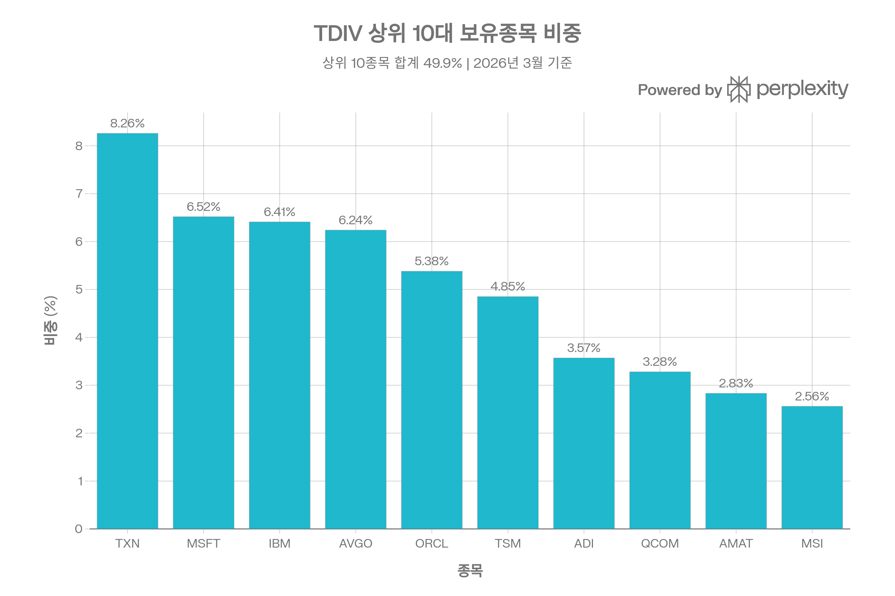
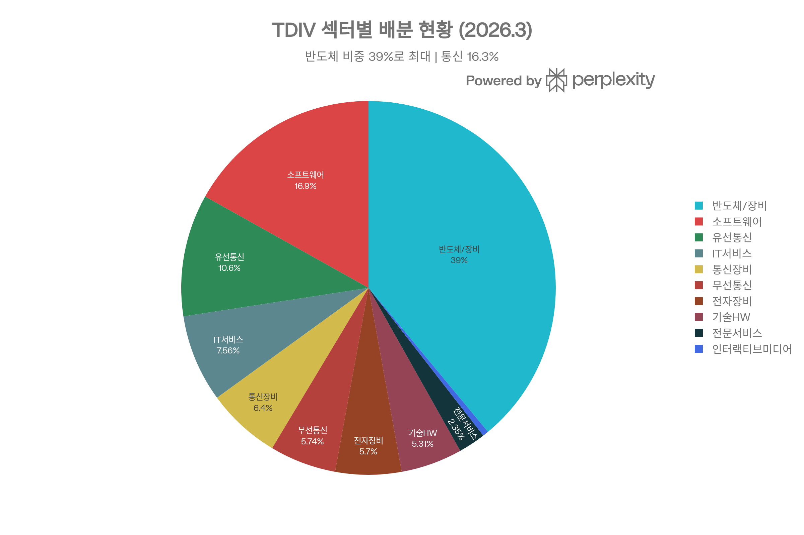
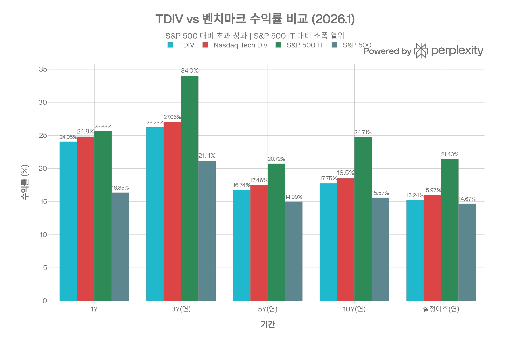
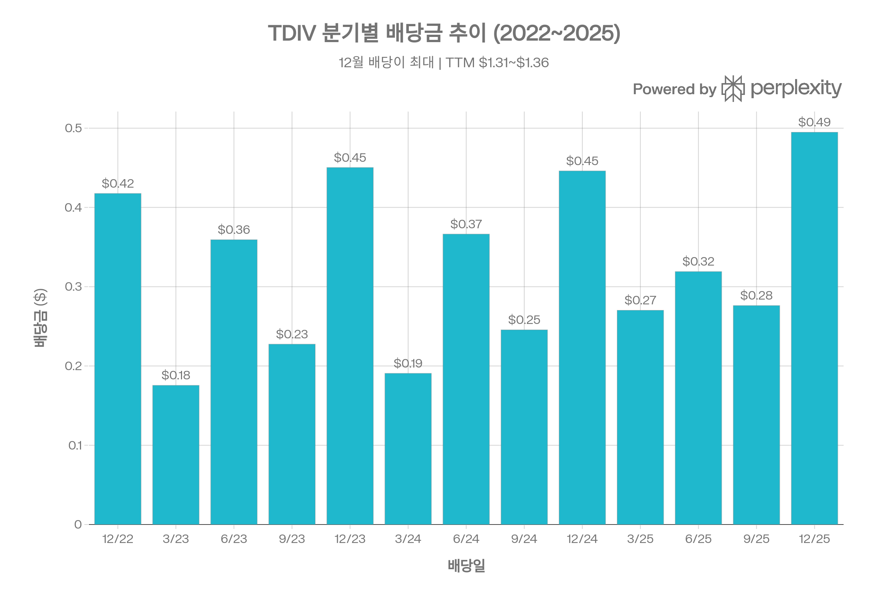
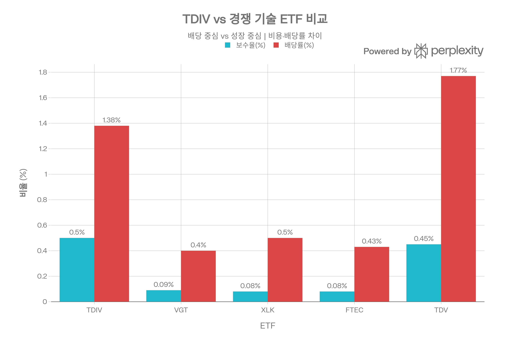

# TDIV (First Trust NASDAQ Technology Dividend Index Fund) 종합 분석 보고서
## 개요
TDIV는 <strong>배당을 지급하는 기술·통신 기업</strong>에 집중 투자하는 ETF로, 기술 섹터의 성장성과 배당 소득을 동시에 추구하는 독특한 포지셔닝을 갖고 있다. 2012년 설정 이후 연환산 15.24%의 수익률을 기록하며 S&P 500(14.67%)을 상회하고 있으나, 순수 기술 지수(S&P 500 IT, 21.43%)에는 열위를 보인다. AUM \$37억의 중대형 ETF로, "기술 섹터 방어적 투자"를 원하는 투자자에게 적합한 상품이다.[1][2]

***

## ETF 분류

| 항목 | 내용 |
|---|---|
| 최종 폴더 | `ETF/Dividend Income/Equity Dividend/Technology/TDIV` |
| 대분류 | 배당·인컴 |
| 하위 분류 | 주식 배당 / 기술·통신 |
| 핵심 전략 | 배당을 지급하는 기술·통신 기업을 선별해 기술 섹터 성장성과 배당 소득을 함께 추구 |
| 운용 방식 | Nasdaq Technology Dividend Index를 추종하는 패시브 배당주 ETF |
| 레버리지/인버스 | 없음 |
| 옵션 인컴 여부 | 없음 |
| 분류 판단 | 기술 섹터 노출이 크지만 편입 조건의 핵심이 배당 지급 기술·통신 기업 선별이므로 `배당·인컴 > 주식 배당` 분류를 우선 적용 |

***

## 1. 기본 정보
| 항목 | 내용 |
|------|------|
| <strong>티커/정식명</strong> | TDIV / First Trust NASDAQ Technology Dividend Index Fund |
| <strong>순자산 규모(AUM)</strong> | \$37.05억 (2026년 3월 5일 기준)[1] |
| <strong>설정일</strong> | 2012년 8월 13일 (운용 기간 약 13.5년)[1] |
| <strong>추종 지수</strong> | Nasdaq Technology Dividend™ Index[1] |
| <strong>운용사</strong> | First Trust Advisors L.P.[1] |
| <strong>상장 거래소</strong> | Nasdaq[1] |
| <strong>총 보수(TER)</strong> | 0.50%[1] |
| <strong>종목 수</strong> | 92개 (현금 제외, 2026년 3월 4일 기준)[1] |
| <strong>리밸런싱 주기</strong> | 분기별 (3월·6월·9월·12월)[1] |
### 지수 구성 기준
Nasdaq Technology Dividend™ Index에 편입되려면 다음 조건을 충족해야 한다:[1]
- Nasdaq, NYSE 또는 NYSE Amex 상장 + ICB 기준 기술/통신 분류
- 시가총액 \$5억 이상, 3개월 일평균 거래대금 \$100만 이상
- 최근 12개월 내 배당 지급, 배당수익률 0.5% 이상
- 최근 12개월 내 배당금 삭감 이력 없음
- 기술 80% / 통신 20%의 수정 배당 가치 가중 방식 적용, 개별 종목 비중 상한 설정

***
## 2. 추종 성과 지표
### 추적 차이(Tracking Difference)
TDIV의 NAV 기준 수익률과 벤치마크 지수의 차이를 통해 추적 차이를 확인할 수 있다:[1]

| 기간 | TDIV(NAV) | 지수 | 추적 차이 |
|------|-----------|------|-----------|
| 1년 | 24.05% | 24.80% | -0.75%p |
| 3년(연) | 26.23% | 27.05% | -0.82%p |
| 5년(연) | 16.74% | 17.46% | -0.72%p |
| 10년(연) | 17.75% | 18.50% | -0.75%p |
| 설정이후(연) | 15.24% | 15.97% | -0.73%p |

추적 차이는 연간 약 -0.73%\~-0.82%p 범위로 안정적이며, 이 중 대부분은 0.50%의 보수비용으로 설명된다. 잔여 차이(약 0.2\~0.3%p)는 리밸런싱 비용 및 현금 보유에 기인한다.[1]
### NAV 대비 시장가격 괴리율
| 구간 | 프리미엄 거래일 | 디스카운트 거래일 |
|------|----------------|-----------------|
| 2025년 전체 | 156일 | 94일[1] |
| 2026년 Q1(\~3/5) | 26일 | 17일[1] |

2026년 3월 5일 기준 Bid/Ask 기준 괴리율은 <strong>-0.01%</strong>(거의 NAV 수준)로, 프리미엄 거래일이 디스카운트보다 약 1.6배 많아 양호한 가격 효율성을 보인다. 30일 중앙값 매도-매수 스프레드는 0.05%에 불과하다.[1]

***
## 3. 비용 구조
### 총 보수 및 비용
TDIV의 총 보수비율(TER)은 <strong>0.50%</strong>로, 순수 기술 섹터 ETF(VGT 0.09%, XLK 0.08%, FTEC 0.08%) 대비 상당히 높다. 이는 배당 필터링 등 특수 지수 전략의 비용이 반영된 결과이다. 동일한 "기술+배당" 전략의 TDV(ProShares S&P Technology Dividend Aristocrats ETF, 0.45%)와 비교 시에도 5bp 높은 수준이다.[3][1][4]
### 포트폴리오 회전율
N-PORT 공시 기준 분기별 회전율은 약 <strong>5.76\~5.90%</strong>이며, ETFRC 기준 연간 회전율은 약 <strong>0.3%</strong>로 산출된다. 분기 리밸런싱을 고려하면 상대적으로 낮은 편이다.[5][6][3]
### 총 보유 비용 비교
| ETF | 보수(TER) | 평균 스프레드 | 총비용(TCO) |
|-----|-----------|-------------|------------|
| TDIV | 0.50% | 0.04% | <strong>54bp</strong>[3] |
| 경쟁 ETF 평균 | — | — | <strong>62bp</strong>[3] |

보수비율은 높지만, 양호한 스프레드(0.04%) 덕분에 총보유비용(TCO)은 동종 평균(62bp)보다 오히려 낮다.[3]

***
## 4. 유동성 평가
| 유동성 지표 | 수치 |
|------------|------|
| 일일 거래량(2026.3.5) | 99,303주[1] |
| 30일 평균 거래량 | 163,088주[1] |
| 평균 거래량(장기) | \~124,000주[3] |
| 일평균 거래대금(ADV) | \~\$1,200만[3] |
| 30일 중앙값 Bid/Ask 스프레드 | 0.05%[1] |
| 평균 Bid/Ask(NBBO) | 0.04% (범위 1\~7bp)[3] |
| 옵션 거래 가능 | 예[3] |

TDIV의 유동성은 <strong>중간 수준</strong>으로 평가된다. 일평균 \$1,200만 거래대금과 0.04%의 타이트한 스프레드는 개인 투자자에게 충분하나, 대규모 기관 거래 시에는 유동성 제한이 있을 수 있다. 52주 가격 범위가 \$64.41\~\$102.50으로 큰 폭의 변동을 보인 점도 참고해야 한다.[3][1]

***
## 5. 포트폴리오 구성
### 상위 10대 보유 종목 (2026년 3월 4일 기준)

| 순위 | 종목명 | 비중 |
|------|--------|------|
| 1 | Texas Instruments (TXN) | 8.26%[1] |
| 2 | Microsoft (MSFT) | 6.52%[1] |
| 3 | IBM | 6.41%[1] |
| 4 | Broadcom (AVGO) | 6.24%[1] |
| 5 | Oracle (ORCL) | 5.38%[1] |
| 6 | TSMC (TSM, ADR) | 4.85%[1] |
| 7 | Analog Devices (ADI) | 3.57%[1] |
| 8 | Qualcomm (QCOM) | 3.28%[1] |
| 9 | Applied Materials (AMAT) | 2.83%[1] |
| 10 | Motorola Solutions (MSI) | 2.56%[1] |
| | <strong>상위 10 합계</strong> | <strong>\~49.9%</strong> |
상위 10종목이 전체 자산의 약 50%를 차지하여 집중도가 다소 높다. 반도체 기업(TXN, AVGO, TSMC, ADI, QCOM, AMAT)이 상위 10에 6개를 차지하며, 비배당 성장주(Apple, Nvidia 등)는 배당 필터에 의해 제외된다.[1]
### 섹터별 배분 현황 (2026년 3월 4일 기준)

| 섹터 | 비중 |
|------|------|
| 반도체 및 반도체 장비 | 38.99%[1] |
| 소프트웨어 | 16.87%[1] |
| 유선 통신 서비스 | 10.57%[1] |
| IT 서비스 | 7.56%[1] |
| 통신 장비 | 6.40%[1] |
| 무선 통신 서비스 | 5.74%[1] |
| 전자 장비·부품 | 5.70%[1] |
| 기술 하드웨어 | 5.31%[1] |
| 전문 서비스 | 2.35%[1] |
| 인터랙티브 미디어 | 0.51%[1] |
반도체(39%)가 압도적 1위이며, 소프트웨어(17%)와 통신(합계 16.3%)이 뒤를 잇는다. 기술 80%·통신 20%의 지수 설계 원칙이 반영되어 있다.[1]
### 국가별 분산
| 국가 | 비중 |
|------|------|
| 미국 | 80.4%[3] |
| 대만 | 5.4%[3] |
| 캐나다 | 5.3%[3] |
| 아일랜드 | 2.5%[3] |
| 룩셈부르크 | 1.7%[3] |
| 네덜란드 | 1.7%[3] |

미국 비중이 80%로 대부분이나, TSMC(대만), 캐나다 통신주 등을 통해 약 20%가 해외에 노출되어 일반 기술 ETF(VGT, XLK 거의 100% 미국) 대비 소폭 국제 분산 효과를 제공한다.[3]

***
## 6. 성과 분석
### 기간별 수익률 (2026년 1월 30일 기준, NAV)

| 기간 | TDIV | 벤치마크 지수 | S&P 500 IT | S&P 500 |
|------|------|-------------|-----------|---------|
| 3개월 | -1.55% | -1.42% | -6.12% | 1.76%[1] |
| YTD | 2.03% | 2.08% | -1.66% | 1.45%[1] |
| 1년 | 24.05% | 24.80% | 25.63% | 16.35%[1] |
| 3년(연) | 26.23% | 27.05% | 34.00% | 21.11%[1] |
| 5년(연) | 16.74% | 17.46% | 20.72% | 14.99%[1] |
| 10년(연) | 17.75% | 18.50% | 24.71% | 15.57%[1] |
| 설정 이후(연) | 15.24% | 15.97% | 21.43% | 14.67%[1] |
### 벤치마크 대비 분석
TDIV는 S&P 500 대비 <strong>모든 기간에서 초과 성과</strong>를 달성하고 있으나, S&P 500 IT Index 대비 <strong>장기적으로 연 4\~7%p 열위</strong>를 보인다. 이 격차의 핵심 원인은 비배당 성장주(Apple, Nvidia, Meta) 부재와 배당 필터에 의한 밸류 편향이다. 다만 2026년 초에는 기술 대형주 조정 국면에서 TDIV가 S&P 500 IT를 오히려 상회하며 방어적 특성을 입증했다.[1]
### 리스크 조정 성과 (3년, 2026년 1월 기준)
| 지표 | TDIV | S&P 500 IT | S&P 500 |
|------|------|-----------|---------|
| 표준편차 | 15.83% | 18.54% | 11.65%[1] |
| 알파 | 1.65 | 7.15 | —[1] |
| 베타 | 1.20 | 1.27 | 1.00[1] |
| 샤프 지수 | 1.27 | 1.43 | 1.31[1] |
| 상관계수(vs S&P 500) | 0.89 | 0.80 | 1.00[1] |

샤프 지수 1.27은 "우수(Very Good)" 수준이며, S&P 500(1.31)과 유사한 리스크 대비 수익을 제공한다. S&P 500 IT(1.43)보다는 낮으나, 이는 최근 3년간 대형 기술주 초강세의 영향이 크다.[7][1]
### 최대 낙폭(Maximum Drawdown)
Seeking Alpha 분석에 따르면 TDIV의 5년 최대 낙폭은 <strong>-29.51%</strong>로, VGT(-35.08%)나 XLK(-33.56%)보다 낙폭이 작아 방어적 특성을 확인할 수 있다. 이 낙폭은 2022년 금리 인상에 따른 기술주 대폭락 시기에 기록된 것으로 추정된다.[8][9]

***
## 7. 배당 정보
### 배당 개요
| 항목 | 수치 |
|------|------|
| 배당 지급 주기 | 분기별 (3·6·9·12월)[10] |
| TTM 배당금 | \$1.31\~\$1.36[10] |
| 30-Day SEC 수익률 | 1.69% (2026.2.27)[1] |
| 12개월 분배율 | 1.38% (2026.2.27)[1] |
| 지수 배당수익률 | 2.20% (2026.2.27)[1] |
| 배당 성장률(1Y) | +4.68%[10] |
| 배당성향 | 33.10%[10] |
### 최근 배당 이력

| 배당일 | 배당금 |
|--------|--------|
| 2025.12 | \$0.4949[1] |
| 2025.9 | \$0.2762[10] |
| 2025.6 | \$0.3191[10] |
| 2025.3 | \$0.2703[10] |
| 2024.12 | \$0.446[10] |
| 2024.9 | \$0.2456[10] |
| 2024.6 | \$0.3664[10] |
| 2024.3 | \$0.1907[10] |
| 2023.12 | \$0.4503[10] |
### 배당 패턴 분석
TDIV의 배당에는 뚜렷한 <strong>계절성 패턴</strong>이 존재한다. 12월 배당이 가장 크고(\~\$0.45\~0.50), 3월이 가장 작으며(\~\$0.19\~0.27), 6월과 9월이 중간 수준이다. 이는 편입 종목들의 배당 지급 시기가 하반기에 집중되기 때문이다. TTM 기준 배당 추이는 +6.4% 증가세로, 1년 +18.0%, 3년 +13.9%의 견조한 배당 성장을 보이고 있다.[10][11]

다만 1.38%의 배당수익률은 기술 ETF치고는 높지만, 일반 배당 ETF(SCHD 3.5%, VYM 2.8%)에 비해 낮다. TDIV는 배당 수입보다는 <strong>기술 섹터 성장 + 배당의 하방 보호</strong> 역할에 초점을 맞춘 상품이다.[2]

***
## 8. 리스크 요소
### 베타 계수 및 시장 민감도
| 벤치마크 | 베타 | R² |
|---------|------|-----|
| S&P 500 | 1.13\~1.20 | 82%[3][1] |
| MSCI EAFE | 1.07 | 53%[3] |
| MSCI EM | 1.01 | 58%[3] |

베타 1.20(S&P 500 대비)은 시장보다 약 20% 높은 변동성을 의미하나, 순수 기술 ETF(VGT 베타 1.29\~1.33, FTEC 1.28\~1.32)보다는 낮다. 즉 기술 섹터 내에서는 <strong>상대적으로 방어적인 포지션</strong>이다.[4][12]
### 섹터 집중도 리스크
반도체 섹터가 39%로 압도적 비중을 차지하고 있어, 반도체 산업 사이클에 대한 노출이 크다. 또한 기술+통신에 100% 집중되어 있으므로 섹터 전반 조정 시 분산 효과가 없다. 상위 10종목이 \~50%를 차지하는 집중 포트폴리오로, 비분산형(non-diversified) 펀드로 분류된다.[1]
### 배당 관련 리스크
편입 기준에 "배당 삭감 시 즉시 제외" 조항이 있어, 기업의 배당 정책 변화에 따른 강제 매도(turnover 증가)가 발생할 수 있다. 이는 시장 스트레스 시 편입 종목 급변으로 이어질 수 있다.[1]
### 유동성 리스크
AUM \$37억, 일평균 거래대금 \$1,200만은 개인 투자자에게 충분하나, 대규모 기관 주문 시 시장 충격이 발생할 수 있다. 시장 스트레스 시 Authorized Participant(AP)가 Creation/Redemption을 중단하면 NAV 괴리가 확대될 수 있다.[3][1]
### 금리 민감도
배당주 특성상 금리 상승기에 상대적으로 불리하며, 2022년의 -29.51% 낙폭이 이를 증명한다. 다만 기술 성장성이 이를 일부 상쇄하여 순수 배당 ETF보다는 금리 민감도가 낮다.[8]

***
## 9. 경쟁 ETF 비교

| 항목 | TDIV | VGT | XLK | FTEC | TDV |
|------|------|-----|-----|------|-----|
| <strong>전략</strong> | 기술 배당 | 기술 전체 | 기술 전체 | 기술 전체 | 기술 배당 귀족 |
| <strong>운용사</strong> | First Trust | Vanguard | State Street | Fidelity | ProShares |
| <strong>TER</strong> | 0.50% | 0.09% | 0.08% | 0.08% | 0.45%[4][3] |
| <strong>AUM</strong> | \$37억 | \$1,300억 | \$830억 | \$170억 | \~\$10억[1][4] |
| <strong>종목 수</strong> | 92 | 312 | 68 | 288 | 43[3][4] |
| <strong>배당률</strong> | 1.38% | 0.40% | 0.50% | 0.43% | 1.77%[1][4] |
| <strong>5Y 최대 낙폭</strong> | -29.51% | -35.08% | -33.56% | -34.95% | N/A[8][9][12] |
| <strong>베타(5Y)</strong> | 1.10\~1.20 | 1.29\~1.33 | 1.18 | 1.28\~1.32 | N/A[1][4] |
### TDIV의 차별적 포지션
TDIV는 VGT/XLK/FTEC와 같은 시가총액 가중 기술 ETF와는 근본적으로 다른 전략이다:[2]

- <strong>밸류 편향</strong>: 배당 필터로 인해 Apple, Nvidia, Meta 등 비배당/저배당 성장주가 제외되어, P/E 21.7배로 VGT(\~30배 이상)보다 현저히 낮다[1]
- <strong>낮은 변동성</strong>: 5년 최대 낙폭이 VGT 대비 5.5%p 작고, 표준편차도 15.83% vs 18.54%로 낮다[8][1]
- <strong>높은 배당</strong>: 1.38%로 VGT(0.40%)의 약 3.5배 배당수익률 제공[4][1]
- <strong>대가는 성장 수익</strong>: 장기적으로 VGT/XLK 대비 연 4\~7%p 수익률 열위[1]

TDV(ProShares)는 TDIV와 가장 유사한 경쟁 ETF로, 7년 이상 연속 배당 증가 기업만을 편입하는 더 엄격한 기준을 적용한다. 비용이 5bp 낮지만 AUM과 유동성에서 TDIV가 우위이다.[3][13]

***
## 10. 종합 평가 및 투자 시사점
### 적합한 투자자 유형
- 기술 섹터 성장에 참여하되 순수 성장 ETF의 극단적 변동성을 회피하고 싶은 투자자
- 포트폴리오에 기술 노출을 추가하면서 분기 배당 수입을 원하는 <strong>배당성장 투자자</strong>
- S&P 500 IT와 SCHD 사이의 <strong>중간 지대</strong>를 찾는 투자자
### 주의 사항
- 비용비율 0.50%는 패시브 ETF치고 높으므로, 장기 복리 효과에서 VGT/XLK 대비 불리
- 반도체 섹터 39% 집중으로 인한 <strong>산업 사이클 리스크</strong> 상존
- 배당 필터로 인해 AI·클라우드 성장 주도주(Nvidia, Meta 등)가 <strong>구조적으로 제외</strong>되어, 기술 섹터 상승장에서 의미 있는 수익률 열위 가능
- 5년 최대 낙폭 -29.51%은 순수 기술 ETF보다 낮지만, 여전히 상당한 수준으로 <strong>방어형으로 오해하면 위험</strong>[8]
### Morningstar 등급
기술 카테고리 221개 펀드 중 3년 3스타(221개 중), 5년 <strong>5스타</strong>(199개 중), 10년 3스타(147개 중)로, 중기(5년) 리스크 조정 성과가 특히 우수하다.[1]
