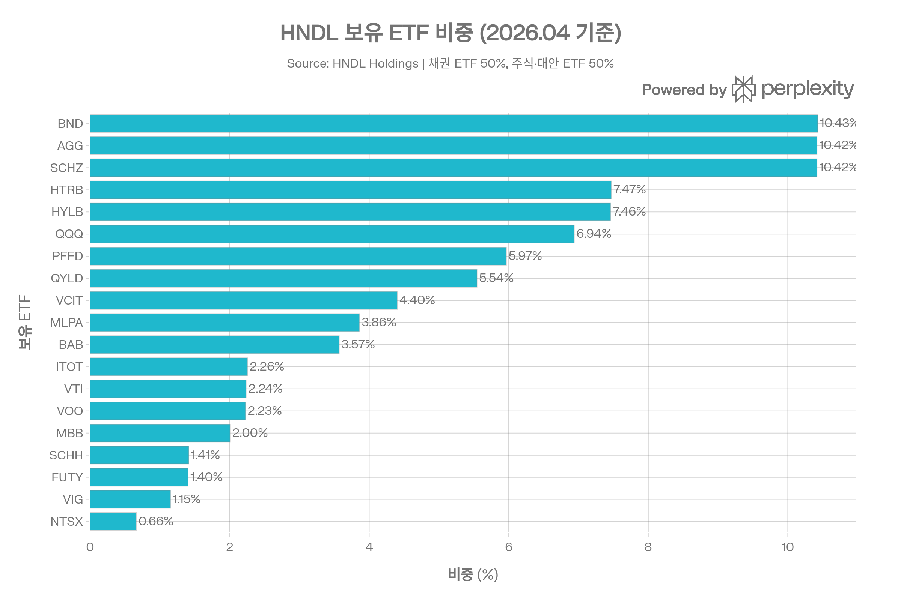
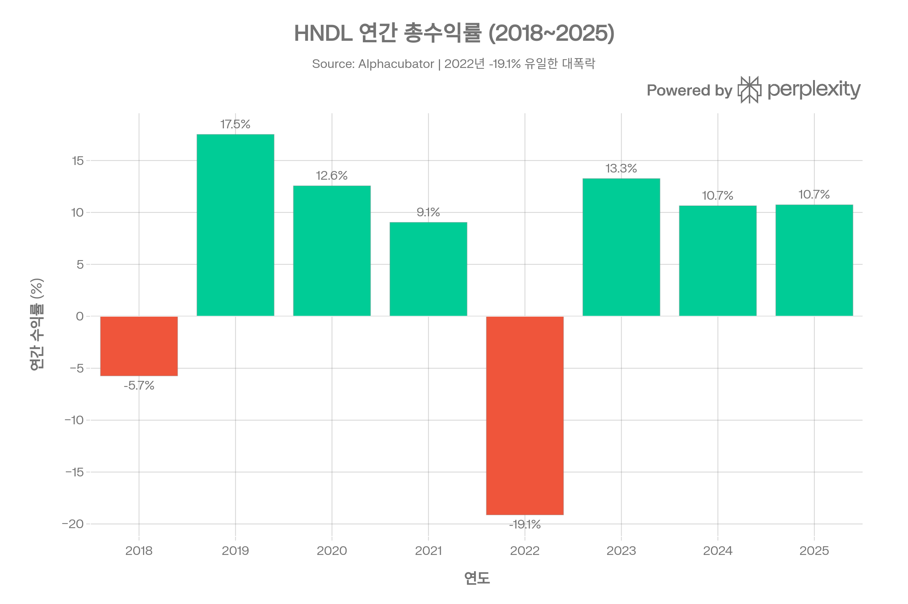
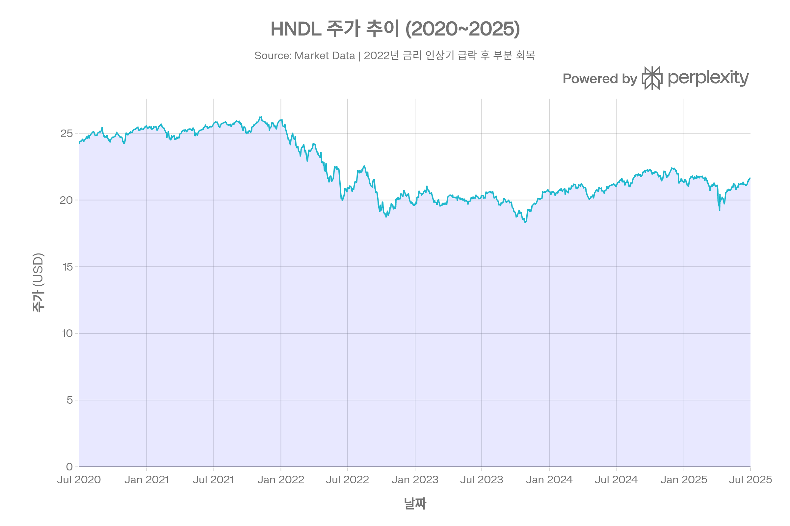
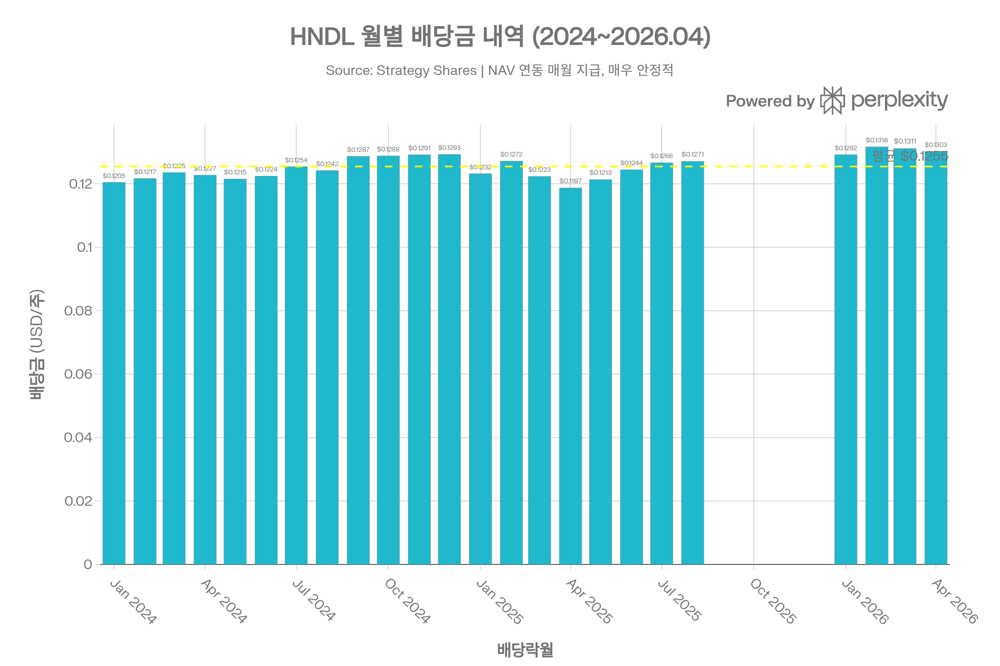

## 요약

> <strong>분석 기준일:</strong> 2026년 4월 16일  
> <strong>데이터 출처:</strong> Strategy Shares, Nasdaq, Schwab, Morningstar, Alphacubator, Stock Analysis, Yahoo Finance 등

***
## ETF 분류

| 항목 | 내용 |
|------|------|
| <strong>최종 폴더</strong> | `ETF/Dividend Income/Multi-Asset Income/HNDL` |
| <strong>대분류</strong> | 배당·인컴 |
| <strong>하위 분류</strong> | Multi-Asset Income |
| <strong>핵심 전략</strong> | ETF of ETFs + 월배당 + 연 7% 분배 목표 |
| <strong>운용 방식</strong> | 패시브, 지수 추종 |
| <strong>레버리지·인버스 여부</strong> | 구조적 레버리지 포함, 단일 레버리지 ETF는 아님 |
| <strong>옵션 인컴 전략 여부</strong> | 일부 편입 ETF를 통한 간접 노출 가능 |

HNDL은 Nasdaq 이름이 붙어 있지만 대표지수 ETF가 아니라 주식, 채권, 인컴형 ETF를 함께 담아 <strong>월배당과 목표 분배율</strong>을 추구하는 멀티에셋 인컴 ETF입니다. 23% 구조적 레버리지가 포함되어 있지만 상품의 핵심 목적은 일일 레버리지 노출이 아니라 인컴 분배이므로 `Dividend Income/Multi-Asset Income`으로 분류합니다.

***
## 1. 기본 정보
<strong>HNDL</strong>은 Strategy Shares가 운용하는 독특한 구조의 ETF로, "펀드 오브 펀드(Fund of Funds)" 형태로 다수의 ETF를 편입하여 <strong>연 7% 배당률을 매월 지급하는 것</strong>을 핵심 목표로 설계되었습니다. 2018년 1월 16일 설정 이후 약 8년간 일관되게 이 목표를 유지해 왔습니다.[1][2][3][4]

| 항목 | 내용 |
|------|------|
| 정식 명칭 | Strategy Shares Nasdaq 7 Handl™ Index ETF |
| 티커 | HNDL (NASDAQ) |
| 설정일 | 2018년 1월 16일 |
| 운용 기간 | 약 8년 |
| 운용사 | Strategy Shares (포트폴리오 매니저: David Miller / Charles Ashley) |
| 상장거래소 | NASDAQ |
| 추종 지수 | Nasdaq 7HANDL™ Index |
| 핵심 목표 | 연 7% 배당 (매월 지급) |
| 구조 | ETF of ETFs (펀드 오브 펀드) |
| 레버리지 | 23% 구조적 레버리지 포함 |
| 현재 주가 | \$22.35 (2026.04.15 기준) |
| 순자산 규모 (AUM) | 약 \$6억 2,100만 달러 |
| 총 보수비율(TER) | 0.95% |
| Morningstar 카테고리 | Moderately Conservative Allocation |

- <strong>현재 주가:</strong> \$22.35[1]
- <strong>52주 최저/최고:</strong> \$19.56 / \$22.84[5]
- <strong>순자산(AUM):</strong> 약 \$6.21억[2]
- <strong>일평균 거래량:</strong> 약 70,636주[5]
- <strong>배당 수익률:</strong> 약 7.0%(연 7% 목표, 실제 최근 6.84\~7.05%)[6][7]
- <strong>포트폴리오 회전율:</strong> 32%(2025년 회계연도)[3]

***
## 2. 추종 지수 — Nasdaq 7HANDL™ Index
HNDL이 추종하는 <strong>Nasdaq 7HANDL™ Index</strong>는 Nasdaq Dorsey Wright가 설계한 독자적인 다자산 지수입니다. "HANDL"은 <strong>High Allocation Nasdaq Dorsey Wright Large-Cap</strong> 의 약자입니다.[8][9][4]
### 지수 구성 — 2개 포트폴리오 구조
지수는 <strong>Core Portfolio(코어)와 Explore Portfolio(익스플로어)</strong> 두 파트로 균등 분할(각 50%)됩니다:[8][10]

#### 코어 포트폴리오 (50%)
| 구성 | 배분 | 편입 ETF |
|------|------|---------|
| 채권(Fixed Income) | 70% | BND, AGG, SCHZ (등가중) |
| 주식(Equity) | 30% | QQQ(50%), VOO·VTI·ITOT(각 1/6) |

- 코어는 미국 채권 ETF 3종과 대형주 ETF 4종으로 구성된 <strong>정적(Static) 포트폴리오</strong>[10]

#### 익스플로어 포트폴리오 (50%)
- 12개 자산 카테고리(고수익 채권, 우선주, 커버드콜, MLP, 지자체채권, 리츠, 유틸리티, 배당성장 등)의 ETF로 구성[8][10]
- <strong>모멘텀(Momentum), 수익률(Yield), 리스크</strong>를 결합한 <strong>전술적 자산 배분(Tactical Asset Allocation)</strong> 방식 적용[10]
- 성과 기반으로 순위를 매겨 상위 순서에 더 높은 비중을 선형 배분[8]
### 레버리지 구조
지수는 <strong>23%의 구조적 레버리지</strong>를 내장하여 총 포트폴리오 가치의 1.23배 노출을 갖습니다. 이 레버리지는 7% 배당률 달성을 위한 수익률 확대 수단이지만, 하락기에는 손실도 확대됩니다.[11][8][9][12]

- <strong>리밸런싱:</strong> 모멘텀 변화에 따라 탄력적으로 조정, 연간 회전율 32%[3]

***
## 3. 추종 성과 지표
### NAV 괴리율 및 추적 성과
| 지표 | 수치 |
|------|------|
| 최근 NAV (2026.04.13) | \$22.33[1] |
| 시장 가격 | \$22.35 |
| NAV 대비 프리미엄 | 약 +0.09% |
| 배당 수익률(분배) | 6.88%[2] |
| P/E 비율 | n/a (채권·인컴 중심) |

<strong>추적 차이(Tracking Difference):</strong> FT.com 기준 알파 -4.02%(1년, 카테고리 평균 -2.54%)로, HNDL은 지수 대비 유의미한 언더퍼폼을 보이고 있습니다. TER 0.95%와 레버리지 비용이 주요 원인이며, 실제 성과는 지수 성과에서 비용을 차감한 수준입니다.[13][14]

***
## 4. 비용 구조
### 총 보수 및 비용
HNDL의 <strong>TER은 0.95%</strong>로, 단순 채권·주식 혼합 ETF 대비 현저히 높습니다. 이는 <strong>이중 비용 구조</strong> 때문입니다:[1][15][16]

1. <strong>HNDL 자체 운용 보수:</strong> 0.95%
2. <strong>편입된 ETF들의 내부 비용:</strong> 각 보유 ETF(BND 0.03%, QYLD 0.60%, MLPA 0.45% 등)의 비용이 추가로 발생 → 실질 총비용(TER + 기초 ETF 비용)은 약 1.30\~1.50% 수준으로 추정[16]
### 비슷한 자산 배분 ETF와 비용 비교
| ETF | 전략 | TER | 배당 수익률 |
|-----|------|-----|-----------|
| <strong>HNDL</strong> | 7% 목표 배당, ETF of ETFs | <strong>0.95%</strong>[1] | \~7.0% |
| AOM | iShares Moderate Allocation (40/60) | 0.15% | \~2.0% |
| VASGX | Vanguard LifeStrategy Growth | 0.14% | \~2.5% |
| VSMGX | Vanguard LifeStrategy Moderate | 0.13% | \~3.0% |

- 동일한 40\~60 중도성향 배분 ETF 대비 HNDL의 비용은 약 7\~8배 높습니다[17][18]

***
## 5. 유동성 평가
| 지표 | 수치 |
|------|------|
| 일평균 거래량 (3개월) | 약 70,636주 |
| AUM | 약 \$6.21억 |
| 일평균 거래대금 | 약 \$1.6M |
| NAV 프리미엄/디스카운트 | 약 +0.09%[1] |
| 주요 기관 보유 | 111개 기관[11] |

- <strong>주요 기관 투자자:</strong> LPL Financial(767,283주), Cambridge Investment Research(405,816주), Osaic Holdings(206,404주) — 리테일 IFA(독립 재정 어드바이저) 중심 고객 기반을 반영합니다[11]
- 유동성은 소형 ETF 수준이나, 개인 투자자 거래에는 충분한 수준입니다. 레버리지 구조상 변동성 확대 시 NAV 괴리가 커질 위험이 있습니다[14]

***
## 6. 포트폴리오 구성
### 전체 보유 ETF (20개, 2026년 4월 기준)

| 티커 | ETF명 | 비중 | 분류 |
|------|-------|------|------|
| BND | Vanguard Total Bond | 10.43% | 코어 채권 |
| AGG | iShares Core US Agg Bond | 10.42% | 코어 채권 |
| SCHZ | Schwab US Agg Bond | 10.42% | 코어 채권 |
| HTRB | Hartford Total Return Bond | 7.47% | 익스플로어 |
| HYLB | Xtrackers USD High Yield | 7.46% | 익스플로어 |
| QQQ | Invesco QQQ | 6.94% | 코어 주식 |
| PFFD | Global X US Preferred | 5.97% | 익스플로어 |
| QYLD | Global X Nasdaq 100 Covered Call | 5.54% | 익스플로어 |
| VCIT | Vanguard Intermediate Corp Bond | 4.40% | 익스플로어 |
| MLPA | Global X MLP | 3.86% | 익스플로어 |
| BAB | Invesco Taxable Municipal Bond | 3.57% | 익스플로어 |
| ITOT | iShares Core S&P Total US | 2.26% | 코어 주식 |
| VTI | Vanguard Total Stock Market | 2.24% | 코어 주식 |
| VOO | Vanguard S&P 500 | 2.23% | 코어 주식 |
| MBB | iShares MBS | 2.00% | 익스플로어 |
| SCHH | Schwab US REIT | 1.41% | 익스플로어 |
| FUTY | Fidelity MSCI Utilities | 1.40% | 익스플로어 |
| VIG | Vanguard Dividend Appreciation | 1.15% | 익스플로어 |
| NTSX | WisdomTree US Efficient Core | 0.66% | 익스플로어 |
| *기타 현금/통화* | - | \~10.17% | 레버리지 담보 |

<strong>자산유형별 실질 배분 (FT.com 기준):</strong>[19]

| 자산 유형 | 비중 |
|----------|------|
| 미국 주식 | 34.59% |
| 미국 채권 | 29.71% |
| 현금/기타 | 28.88% |
| 비미국 채권 | 2.48% |
| 비미국 주식 | 1.74% |
| 기타 | 2.60% |

> 현금 비중 28.88%는 레버리지 조달을 위한 담보 및 운용 현금입니다. 실질 위험 자산 노출은 주식+채권=약 68%이며, 1.23x 레버리지로 이 비중을 확대합니다.[11][8]

***
## 7. 성과 분석
### 연간 총수익률(배당 포함)

| 연도 | HNDL 총수익률 | 비고 |
|------|-------------|------|
| 2018 | -5.74%[12] | 설정 직후 하락 |
| 2019 | +17.52%[12] | 최고 성과 |
| 2020 | +12.57%[12] | 코로나 회복 |
| 2021 | +9.05%[12] | 안정적 |
| 2022 | <strong>-19.13%</strong>[20] | 금리 인상 최대 낙폭 |
| 2023 | +13.27%[20] | 강한 반등 |
| 2024 | +10.65%[20] | 꾸준한 성과 |
| 2025 | +10.74%[12] | 배당 포함 |
### 기간별 수익률 (배당 포함 총수익률)

| 기간 | 총수익률(시장가) | 총수익률(NAV) |
|------|--------------|-------------|
| 1년 (2025 기준) | 11.13%[12] | 11.14%[20] |
| 3년 (연환산) | 10.09%[12] | — |
| 5년 (연환산) | 4.53%[12] | — |
| 설정 이후 (연환산) | 5.64%[12] | 5.76%[16] |
| 누적 (2018\~) | +54.94%[12] | — |
> <strong>핵심 분석:</strong> HNDL의 5년 연환산 총수익률(+4.53%)은 동일 위험 수준의 단순 60/40 포트폴리오(약 6\~8% 연환산)보다 낮습니다. 이는 0.95% 비용과 레버리지 비용, 그리고 <strong>배당 일부가 원금에서 지급(Return of Capital)</strong>되는 구조에 기인합니다.[16][17][18]
### 가격 수익률(배당 제외)
| 기간 | 가격 수익률 |
|------|----------|
| 1년 | +3.00% |
| 3년 (연환산) | +1.01% |
| 5년 (연환산) | -2.26% |

주가 자체(가격 수익률)는 5년간 -2.26%로 <strong>원금 대비 하락</strong>했으며, 이는 7% 배당의 일부가 실제 수익이 아닌 원금 반환(ROC)임을 시사합니다.[21][17]

***
## 8. 배당 정보 — 핵심 특징
HNDL의 가장 독보적인 특징은 <strong>연 7% 목표 배당을 매월 지급</strong>한다는 점입니다.[1][4]
### 배당 구조
- <strong>배당률 결정 방식:</strong> NAV의 7%를 12개월로 나눠 매월 지급. 예를 들어 NAV \$22.33 × 7% / 12 = 월 \$0.1305[1]
- <strong>안정성:</strong> 설정(2018.01) 이후 단 한 차례도 월배당을 거르지 않음[6]
- <strong>배당락일:</strong> 매월 둘째 주 목요일, 이틀 후 지급[1]
### 최근 월별 배당금 (2025\~2026)

| 배당락월 | 배당금/주 | 계산 NAV |
|---------|---------|---------|
| 2026.04 | \$0.1303[1] | \$22.33 |
| 2026.03 | \$0.1311 | \$22.48 |
| 2026.02 | \$0.1317 | \$22.57 |
| 2026.01 | \$0.1299 | \$22.27 |
| 2025.12 | \$0.1292 | \$22.14 |
| 2025.11 | \$0.1308 | \$22.43 |
| 2025.08 | \$0.1271[6] | \$21.79 |
| 2025.04 | \$0.1187 | \$20.35 |
### 배당 핵심 지표
| 지표 | 수치 |
|------|------|
| 연간 배당금(TTM) | \$1.51\~\$1.53/주[6][22] |
| 배당 수익률(포워드) | 7.05%[7] |
| 배당 지급 주기 | 매월[6] |
| 1년 배당 성장률 | +4.68%[6] |
| 최고 배당금 | \$0.1497/주 (2021.12)[6] |
| 최저 배당금 | \$0.1048/주 (2022.10)[6] |
### Return of Capital (ROC) 특성
HNDL의 월배당 중 일부는 실제 투자 수익이 아닌 <strong>원금 반환(Return of Capital)</strong>으로 분류됩니다. ROC는:[21][23]
- <strong>단기 세금 이연 효과:</strong> 지급 시점에 과세하지 않고 매도 시 자본이득으로 과세[24][21]
- <strong>비용 기준(Cost Basis) 하락:</strong> ROC만큼 매입가 기준이 낮아져 향후 매도 시 과세액이 증가[23][24]
- <strong>NAV 잠식 가능성:</strong> 포트폴리오 수익이 7% 배당률에 미치지 못하면 NAV에서 지급되어 장기 원금 잠식[18]

***
## 9. 리스크 지표
| 지표 | HNDL | 카테고리 평균 |
|------|------|------------|
| 베타 (LTM) | 0.59[22] | — |
| 베타 (1Y, FT) | +1.22[13] | +0.84 |
| 연간 변동성 (1년) | 13.07% | — |
| 연간 변동성 (3년) | 12.23% | — |
| 연간 변동성 (전체) | 10.84%[12] | — |
| 표준편차 (FT, 5Y) | 9.79%[13] | 7.19% |
| 샤프 비율 (설정 이후) | 0.56[12] | — |
| 샤프 비율 (3Y) | 0.98[12] | — |
| 샤프 비율 (5Y) | 0.44[12] | — |
| 소르티노 비율 | 0.78[12] | — |
| 최대 낙폭 (MDD) | <strong>-23.72%</strong>[12] / <strong>-30.13%</strong> (계산치) | — |
| 알파 (1Y, FT) | -4.02%[13] | -2.54% |

- <strong>낮은 베타(0.59\~1.22):</strong> 레버리지에도 불구하고 채권 비중(30\~35%)이 전체 변동성을 완화해 주식 단독보다 낮은 변동성 실현[22][13]
- <strong>최대 낙폭 -23.72\~30%:</strong> 2022년 금리 인상 사이클에서 주가가 \$26.5 → \$19.2 수준까지 하락[12]
- <strong>알파 -4.02%:</strong> 카테고리(온건 보수형 배분) 평균 대비도 저조한 리스크 조정 성과[13]

***
## 10. 주요 논쟁점 및 비판
HNDL은 고배당 수입을 제공하지만, 구조적 한계에 대한 비판이 지속적으로 제기됩니다.[17][18]
### 비판 1 — NAV 잠식(Return of Capital 문제)
7% 배당 중 포트폴리오가 실제로 창출하지 못하는 부분은 원금에서 지급됩니다. 주가가 설정 이후 \$25\~\$26에서 현재 \$22.35으로 하락한 것은 이를 일부 반영합니다. <strong>장기 보유 시 원금이 점진적으로 잠식될 위험</strong>이 있습니다.[17][18]
### 비판 2 — 이중 비용 구조
HNDL 자체 0.95%에 편입 ETF 비용이 추가되어 실질 총비용이 1.3\~1.5%에 달합니다. 동일한 목표 배분을 BND + QQQ + QYLD 직접 편입으로 구성하면 비용을 0.2\~0.3% 수준으로 낮출 수 있습니다.[16][17]
### 비판 3 — 단순 60/40 대비 장기 열위
Seeking Alpha 분석에 따르면, 5년 연환산 기준 HNDL(+4.53%)은 단순 60/40(AOM: 주가 상승+배당 합산 \~6\~8%)보다 낮습니다. 7% 배당의 매력에도 불구하고 <strong>총수익률 기준으로 단순 배분이 우위</strong>인 경우가 많습니다.[17][18]
### 긍정적 평가
- <strong>일관된 월배당:</strong> 설정 이후 8년간 월배당 지속 — 은퇴자 등 정기 현금흐름 수요자에게 실질적 가치[1][4]
- <strong>세금 이연:</strong> ROC 특성으로 당장의 세금 부담 없이 배당 수취 가능[21][23]
- <strong>낮은 변동성:</strong> 레버리지 내재에도 불구하고 베타 0.59, 변동성 10.84%로 주식 단독보다 안정적[22][12]

***
## 11. 리스크 요소
1. <strong>NAV 잠식 리스크:</strong> 포트폴리오 총수익이 7%에 미치지 못할 경우 원금에서 지급되어 장기 원금 감소[18]
2. <strong>레버리지 리스크:</strong> 23% 구조적 레버리지로 금리 상승·자산 하락기에 손실이 확대됨[9][12]
3. <strong>이중 비용 구조:</strong> HNDL 자체 TER + 기초 ETF 비용으로 실질 총비용 1.3\~1.5%[16]
4. <strong>금리 민감도:</strong> 채권 비중 30%+로 금리 급등 시(2022년 -19.1%) 상당한 손실 발생[20]
5. <strong>이중 과세 리스크:</strong> ROC로 인해 비용 기준이 낮아지고, 최종 매도 시 과세액 증가 가능[23][24]
6. <strong>의사결정 복잡성:</strong> 익스플로어 포트폴리오의 전술적 배분 전략이 불투명해 투자자가 내부 논리를 완전히 이해하기 어려움[25]
7. <strong>경쟁 리스크:</strong> 커버드콜 ETF(JEPI, JEPQ) 등 유사 목표의 고배당 ETF들이 더 낮은 비용·높은 유동성으로 경쟁 중[17]
8. <strong>소규모 운용사 리스크:</strong> Strategy Shares는 대형 운용사가 아니어서 장기 펀드 지속성 리스크 존재[26]
9. <strong>유동성 리스크:</strong> 일평균 거래량 70,636주 — 대규모 투자자에게는 스프레드 비용 발생

***
## 12. 투자 포인트 종합
### 투자 적합 대상 (Bullish 관점)
- <strong>은퇴자·정기 현금흐름 필요 투자자:</strong> 매월 일정한 배당으로 생활비 충당을 원하는 경우 — 연 7%의 예측 가능한 월배당은 실질적인 가치[1][4]
- <strong>배당 재투자 투자자:</strong> ROC의 세금 이연 효과를 활용해 배당을 재투자하며 장기 복리 효과를 추구[21][23]
- <strong>저변동성 선호:</strong> 베타 0.59, 변동성 10.84%로 주식 ETF보다 완충된 포트폴리오 원하는 투자자[22][12]
### 투자 주의 사항 (Bearish 관점)
- <strong>원금 보전 중시 장기 투자자:</strong> NAV 잠식 가능성으로 인해 장기 총수익이 단순 60/40 배분보다 낮을 수 있음[17][18]
- <strong>비용 효율 중시 투자자:</strong> 0.95% + 기초 ETF 비용으로 총 \~1.4%는 동일 배분의 단순 ETF 대비 과도[16]
- <strong>총수익률 극대화 목표:</strong> 5년 연환산 +4.53%는 유사 위험 프로파일의 대안보다 낮음[12]

> ⚠️ <strong>본 보고서는 투자 권유가 아니며, 투자 결정 전 전문가 상담과 추가 리서치를 권장합니다.</strong>  
> 특히 배당 중 Return of Capital 비중 및 세금 영향은 개인별 세금 전문가와 확인이 필요합니다.
