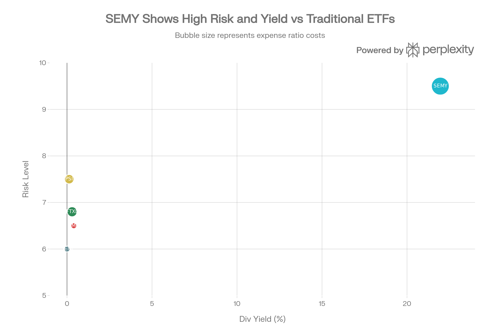

# SEMY (GraniteShares YieldBOOST Semiconductor ETF) 종합 분석 보고서

## ⚠️ 극도의 경고: 매우 신규 + 극도의 복잡성 + 극도의 고위험

SEMY는 전통적인 반도체 ETF가 **아니다**. 이것은 **레버리지 ETF에 대한 옵션 전략을 판매하는 극도로 복잡한 소득 생성 펀드**이다. 일반 투자자에게 강력히 비추천한다.

***

## ETF 분류

| 항목 | 내용 |
|---|---|
| 최종 폴더 | `ETF/Dividend Income/Option Income/Leveraged Semiconductor/SEMY` |
| 대분류 | 배당·인컴 |
| 하위 분류 | 옵션 인컴 / 레버리지 반도체 |
| 핵심 전략 | SOXL 등 3배 레버리지 반도체 ETF 관련 풋옵션을 매도해 옵션 프리미엄 기반 주간 분배금을 추구 |
| 운용 방식 | 액티브 옵션 인컴 ETF |
| 레버리지/인버스 | 펀드 자체의 명시적 레버리지 ETF는 아니지만, 기초 옵션 노출이 레버리지 반도체 ETF와 연결됨 |
| 옵션 인컴 여부 | 있음 |
| 분류 판단 | 반도체 산업 노출보다 옵션 프리미엄을 통한 인컴 생성이 핵심이고, 기초가 레버리지 반도체 ETF이므로 `배당·인컴 > 옵션 인컴 > 레버리지 반도체`로 분류 |

***

## 요약

SEMY는 2025년 11월 17일 출범한 GraniteShares의 초신규 옵션 기반 반도체 소득 ETF로, SOXL(3배 레버리지 반도체 ETF)의 풋옵션을 판매하는 전략을 사용한다. 21.96%-24.91%의 외계급 주간 배당금(연 24%)을 제공하지만, 이는 지속 불가능한 옵션 프리미엄이며 시장 변동성 급락 시 극도의 손실을 입을 수 있다. 불과 2개월 운영, \$12-23M 극소 자산, 1.07% 극히 높은 수수료는 심각한 우려사항이다. **일반 투자자에게 강력히 비추천**.

***

## 1. 기본 현황

| 항목 | 내용 |
| :-- | :-- |
| **펀드명** | GraniteShares YieldBOOST Semiconductor ETF |
| **티커** | SEMY |
| **거래소** | NASDAQ |
| **출범일** | 2025년 11월 17일 (1.3개월) ⚠️ **극신규** |
| **전략** | SOXL(3배 레버리지 반도체) 풋옵션 판매 |
| **현재 가격** | \$21-22 (변동성 극심) |
| **자산규모** | \$12.97M-\$23.35M (급감하는 중) |
| **연간 수수료** | 1.07% |
| **주간 배당률** | 21.96%-24.91% (연 기준) |
| **배당 주기** | 주간 (연 52회) |

SEMY는 CHPX(3.5개월), FTXL(9.3년), PSI(20.6년), SEMI(4.4년)와 비교하면 **훨씬 신규 펀드**이다. 더 중요하게는, SEMY는 주식 ETF가 아니라 **옵션 파생상품 기반 소득 펀드**이다.

***

## 2. 전략 분석 (핵심)

### SEMY는 반도체 주식에 투자하지 않는다

SEMY는 직접 NVIDIA, ASML, BROADCOM 같은 반도체 주식에 투자하지 **않는다**. 대신:

**전략 메커니즘**

| 단계 | 내용 | 예시 |
| :-- | :-- | :-- |
| **1. 풋옵션 판매** | SOXL(3배 레버리지 반도체) 풋옵션 판매 | SOXL \$100이면 \$105 풋옵션 판매 |
| **2. 프리미엠 받기** | 옵션 판매로 즉시 프리미엄 수령 | 예. \$5 프리미엄 (5% 수익률) |
| **3. 주간 롤** | 1개월 뒤 만료되면 새로운 풋옵션 판매 | 매주 새로운 옵션 판매 (52회/년) |
| **4. 누적 분배** | 52주 동안 받은 프리미엄 합산 배당 | 52주 × 약 5% = 260% (이론) |

### 실제 손익 시나리오

**시나리오 1: SOXL 상승 (긍정)**

- SOXL \$100 → \$110 상승 (10% 상승)
- SEMY는 판매한 \$105 풋옵션만 수익 (5%)
- **부분 수익만 캡처** (5% vs 10% 상승 기회 상실)

**시나리오 2: SOXL 횡보 (이상적)**

- SOXL \$100 → \$105-110 횡보
- SEMY는 매주 풋옵션 프리미엄만 취득 (5% 주간)
- **주간 배당금 극대화** (현재 상황)

**시나리오 3: SOXL 하락 (재앙)**

- SOXL \$100 → \$90 급락 (10% 급락)
- SEMY가 판매한 \$105 풋옵션 "손실" (10% 손실 + 5% 프리미엄 = net -5%)
- BUT: SOXL이 계속 떨어지면 손실은 무한정
- SOXL \$70까지 떨어지면 SEMY는 35% 손실 (미국채는 100% 보장)

### 핵심: 비대칭 위험

SEMY Risk vs Yield vs Cost: Extreme Outlier vs Peers

| 조건 | SEMY 수익 | 문제점 |
| :-- | :-- | :-- |
| 반도체 상승 | 극히 제한 (프리미엄만) | 기회 상실 |
| 반도체 횡보 | 최대 (매주 5-7%) | 일시적 |
| 반도체 하락 | **무제한 손실** ⚠️ | 치명적 |

***

## 3. 배당금 분석 - 지속 불가능성

### 외계급 배당률 (21.96% - 24.91%)

주간 배당: \$0.52-0.59 per share (변동성 극심)

**배당금이 지속 불가능한 이유**

1. **출처가 옵션 프리미엄**
    - 프리미엄 = 변동성 높을수록 증가
    - 변동성 낮아지면 프리미엄 급락
    - 2024년 반도체 변동성은 이미 낮아진 상태
2. **원본 자본 소비 가능성**
    - 24% 배당금은 연 자본의 1/4 이상
    - 3년 보유 시 원본의 1/4 소비
    - 실제로는 "자본 반환(Return of Capital)" 가능성 높음
3. **시장 스트레스 시 배당금 급락**
    - 2022년처럼 반도체 30% 급락 시
    - 변동성 급증 = 프리미엄 증가 (일시 호재)
    - BUT 동시에 기초 자산 급락 (재앙)
    - 배당금 유지 불가능
4. **역사적 증거**
    - GraniteShares YieldBOOST 계열의 다른 펀드들도 발표 후 배당금 급감
    - 신규 펀드의 초고 배당은 "마케팅 함정" 가능성

### 세금 문제

- 주간 배당 = 52회 과세 이벤트/년
- 보통소득세율로 과세 (장기자본이득 아님)
- 한국 투자자: 배당금 10% 원천징수 + 종합소득세
- **세후 배당률**: 20% 이상 하락 (약 16-17% 실질)

***

## 4. 비용 분석 - 극히 높음

**비용 비교**

| ETF | TER | 배당률 | 순배당률* |
| :-- | :-- | :-- | :-- |
| **SEMY** | 1.07% | 21.96% | ~20.89% |
| **SMH** | 0.35% | 0.40% | 0.40% |
| **FTXL** | 0.60% | 0.30% | 0.30% |
| **SEMI** | 0.35% | 0.00% | 0.00% |
| **PSI** | 0.56% | 0.13% | 0.13% |

*세금 전 기준

SEMY의 1.07% 수수료는:

- SMH/SEMI 대비 **3배 높음** (0.35%)
- FTXL 대비 **80% 높음** (0.60%)
- 숨겨진 옵션 거래 비용 추가 (투명하지 않음)

***

## 5. 신규 펀드 위험 - 심각

### 극히 짧은 운영 기간

- **출범**: 2025년 11월 17일
- **현재**: 2026년 1월 18일 (정확히 2개월 1일)
- **시장 사이클 경험**: 0

### 자산 급락 위험

- **초기 AUM**: \$23.35M (11월)
- **현재 AUM**: \$12.97M (1월)
- **2개월 자산 감소**: -44.4% ⚠️

**의미**: 투자자들이 빠르게 도망치고 있음. 펀드 청산 위험 증가.

### 유동성 악화

- 초기 일일 거래량: 93,310주
- 현재: 70,593주 (급감)
- AUM 감소 추세가 계속되면 유동성 위기 가능

### 펀드 청산 가능성

- AUM이 \$5-10M 이하로 떨어지면 GraniteShares가 펀드 폐쇄 가능
- 투자자들은 강제 환수 (NAV 기준)
- 환수 시 NAV 디스카운트 발생 가능

***

## 6. 위험 분석 - 극도의 위험

### 1. 레버리지 기초 자산 위험 ★★★★★

SOXL는 3배 레버리지 반도체 ETF. 특징:

- **일일 리밸런싱**: 매일 손실 누적 (추적 오류)
- **장기 보유 부적합**: 주식이 아닌 데일리 리밸런싱 도구
- **변동성 극심**: 반도체의 3배 변동성

예: 반도체 5% 일간 급락 → SOXL 15% 급락

### 2. 무제한 하락 손실 ★★★★★

- SEMY 손실: 0% (프리미엄) ~ -100%+ (극단적)
- SMH/FTXL 손실: 최대 -50%-60% (시장 이벤트)
- **차이**: SEMY는 이론적 무제한 손실, SMH는 한정 손실

### 3. 상승 수익 캡 ★★★★

- SEMY 상승: 주간 프리미엄만 (5-7% 월)
- 반도체 50% 상승 시에도 SEMY는 20-25% 정도만
- **기회 비용**: 반도체 강세장에서 이득 극히 제한

### 4. 변동성 급락 위험 ★★★★

- 높은 배당률은 **높은 변동성**에 의존
- 현재 반도체 변동성 높음 (AI 버블 우려)
- 2026년 변동성 정상화 시 배당금 급락 (50% 이상 가능)

### 5. 시장 스트레스 시 재앙 ★★★★★

**시나리오: 2024년 10월 같은 급락**

- 반도체 20% 급락 (1-2주)
- SOXL 60% 급락 (3배)
- SEMY 손실 (극한): -50% 이상 가능
- 배당금: 일시 중단 가능성

### 6. 세금 비효율 ★★★

- 주간 배당 = 52회 과세 이벤트
- 자본이득 vs 배당금: 배당금 (높은 세율)
- 한국 투자자: 배당금 10% 원천징수 + 종합소득세

### 7. 이해 불가능한 복잡성 ★★★★

- 옵션 판매 메커니즘 극도로 복잡
- 대부분의 개인 투자자가 전략 이해 불가
- 문제 발생 시 대응 불가능

***

## 7. 성과 vs 경쟁사

| 펀드 | 성과 기간 | 1년 수익률 | 3년 수익률 | 배당률 |
| :-- | :-- | :-- | :-- | :-- |
| **SEMY** | 2개월 | 계산 불가 | N/A | 21.96% (옵션 프리미엄 기반) |
| **SMH** | 14년 | 55% | 35.9% | 0.4% |
| **FTXL** | 9년 | 49% | 11.6% | 0.3% |
| **SEMI** | 4.4년 | 53.46% | 42.05% | 0% (누적식) |
| **PSI** | 20.6년 | 36.31% | 18.02% | 0.13% |

참고 1: SEMY 배당률은 옵션 프리미엄 기반으로 지속 가능성이 낮을 수 있습니다.
참고 2: SEMI는 누적식 상품으로 배당금을 지급하지 않습니다.

SEMY는 성과 측정 자체가 불가능하다. 2개월 운영으로는 단순히 "초기 배당금 높음" = 변동성 프리미엄 수혜일 뿐이다.

***

## 8. 경쟁 펀드 비교

### SEMY vs SMH (가장 직접 비교)

| 항목 | SEMY | SMH |
| :-- | :-- | :-- |
| **투자 자산** | SOXL 풋옵션 | 반도체 주식 |
| **배당률** | 21.96% | 0.40% |
| **수수료** | 1.07% | 0.35% |
| **위험도** | 극도 (비대칭) | 높음 (시장 동반) |
| **손실 한계** | 무제한 | -60% 정도 |
| **수익 한계** | 주간 프리미엄 | 무제한 |
| **복잡도** | 극도 | 단순 |
| **투명도** | 낮음 (옵션 가격 불명확) | 높음 (주식 공개) |
| **안정성** | 극도로 낮음 | 중간 |

**결론**: SEMY는 SMH의 **극도의 반대편**. SMH는 "안정적인 수익", SEMY는 "위험한 배당금".

***

## 9. 한국 투자자 고려사항

**거래 환경**

- **NASDAQ 상장**: 한국 증권사 해외거래 가능
- **환율 위험**: 달러 노출
- **세금**: 배당금 10% 원천징수 + 종합소득세

**투자 대안**

| 상품 | SEMY 대비 |
| :-- | :-- |
| **SMH 구매** | 훨씬 우수 (안정, 성과, 비용) |
| **국내 반도체 ETF** | 훨씬 우수 (원화, 유동성) |
| **채권 + 반도체 혼합** | 위험 감소 |
| **SEMY** | **강력히 비추천** |

***

## 10. 최종 평가 및 투자 권고

### 종합 점수: **1.5 / 10** ⚠️

| 항목 | 점수 | 코멘트 |
| :-- | :-- | :-- |
| **수익 잠재력** | 4/10 | 극도로 제한된 상승, 무제한 손실 |
| **비용 효율** | 1/10 | 1.07% 극히 높음 + 숨겨진 비용 |
| **포트폴리오 품질** | 2/10 | 옵션 기반이므로 주식 품질 무관 |
| **유동성** | 3/10 | 급락하는 AUM, 거래량 감소 |
| **위험 관리** | 1/10 | 비대칭 위험 (무제한 손실) |
| **혁신성** | 5/10 | 신선하지만 검증되지 않음 |
| **안정성** | 1/10 | 신규 펀드, 청산 위험 |
| **이해도** | 2/10 | 극도로 복잡, 대부분 이해 불가 |

### 투자 권고

#### 일반 투자자

- **권고**: **강력히 비추천** ⚠️⚠️⚠️
- **이유**: 극도의 위험, 복잡성, 신규 펀드, 비지속가능한 배당

#### 극도로 정교한 옵션 트레이더

- **권고**: **극도로 신중한 검토만**
- **조건**:
    - 옵션 전략을 완벽히 이해
    - 상실 가능성 (\$X) 적립 가능
    - 극도로 작은 포지션 (전체 자산 <1%)
    - 이직 또는 퇴사 후 풀타임 모니터링
- **위험**: 여전히 매우 높음

#### 보수적 투자자

- **권고**: **절대 비추천**

#### 소득 추구 투자자

- **권고**: **절대 비추천**
    - 배당률 지속 불가능
    - 원본 자본 소비 위험
    - 세금 비효율 극심

***

## 11. 결론

SEMY는 **기존 반도체 ETF의 개념을 완전히 벗어난 극도로 복잡한 옵션 기반 소득 펀드**이다. 21-25%의 주간 배당금은 매력적으로 보이지만, 이는:

1. **지속 불가능**: 옵션 프리미엄 기반이므로 변동성 급락 시 붕괴
2. **비대칭 위험**: 상승은 제한, 하락은 무제한
3. **신규 검증 미흡**: 2개월 펀드로 시장 사이클 미경험
4. **자산 급락**: AUM 44% 감소 (투자자들이 도망치는 중)
5. **복잡성 극도**: 평균 투자자 이해 불가능

**최종 권고**:

- **일반 투자자**: SEMY는 존재하지 않는 것처럼 무시
- **소득 추구**: SMH 배당(0.4%) 또는 국내 채권 추천
- **반도체 노출**: SEMI(글로벌, 53.46% YTD), FTXL(Nasdaq, 49%), SMH(VanEck, 55%) 추천

**SEMY는 "투자" 아니라 "위험한 배팅"이다.**
[^1][^10][^11][^12][^13][^14][^15][^16][^17][^18][^19][^2][^20][^21][^22][^23][^24][^25][^26][^27][^28][^29][^3][^4][^5][^6][^7][^8][^9]

⁂

[^1]: QTUM (Defiance Quantum ETF).md

[^2]: SETM (Sprott Critical Materials ETF).md

[^3]: REMX (VanEck Rare Earth, Strategic Metals ETF).md

[^4]: https://graniteshares.com/institutional/us/en-us/etfs/semy/

[^5]: https://graniteshares.com/institutional/us/en-us/press-release/graniteshares-launches-yieldboost-semiconductor-etf-nasdaq-semy-and-yieldboost-gold-miners-etf-nasdaq-nugy/

[^6]: https://markets.ft.com/data/etfs/tearsheet/summary?s=SEMY%3ANMQ%3AUSD

[^7]: https://www.globenewswire.com/news-release/2025/11/18/3189989/0/en/GraniteShares-Launches-YieldBOOST-Semiconductor-ETF-NASDAQ-SEMY-and-YieldBOOST-Gold-Miners-ETF-NASDAQ-NUGY.html

[^8]: https://etfgi.com/news/stories/2025/11/graniteshares-launches-yieldboosttm-semiconductor-etf-nasdaq-semy-and

[^9]: https://uk.investing.com/etfs/semi-holdings

[^10]: https://www.ishares.com/us/products/239500/ishares-select-dividend-etf

[^11]: https://public.com/stocks/semy

[^12]: https://www.ftportfolios.com/Retail/Etf/EtfHoldings.aspx?Ticker=FTXL

[^13]: https://www.vaneck.com/us/en/investments/semiconductor-etf-smh/

[^14]: https://robinhood.com/us/en/stocks/SEMY/

[^15]: https://www.investsmart.com.au/shares/asx-semi/global-x-semiconductor-etf/fund-details/25035

[^16]: https://marketchameleon.com/Overview/SEMY/Dividends/

[^17]: https://www.morningstar.com/etfs/xnas/semy/quote

[^18]: https://finance.yahoo.com/quote/SEMI/holdings/

[^19]: https://graniteshares.com/institutional/us/en-us/etfs/

[^20]: https://etfdb.com/fs-insight-reports/SEMY_insight_report.pdf

[^21]: https://graniteshares.com/institutional/us/en-us/press-release/

[^22]: https://dodgeandcox.com/individual-investor/us/en/insights/2025-semi-annual-fixed-income-review.html

[^23]: https://pdf.secdatabase.com/392/0001493152-25-026604.pdf

[^24]: https://www.signalbloom.ai/etf/SEMY

[^25]: https://am.gs.com/cms-assets/gsam-app/documents/insights/en/2025/fixed-income-outlook_4q25.pdf

[^26]: https://www.occ.gov/publications-and-resources/publications/semiannual-risk-perspective/files/pub-semiannual-risk-perspective-fall-2025.pdf

[^27]: https://seekingalpha.com/symbol/SEMY/expenses

[^28]: https://www.tradingview.com/symbols/NASDAQ-SEMY/

[^29]: https://reports.weforum.org/docs/WEF_Global_Risks_Report_2025.pdf
