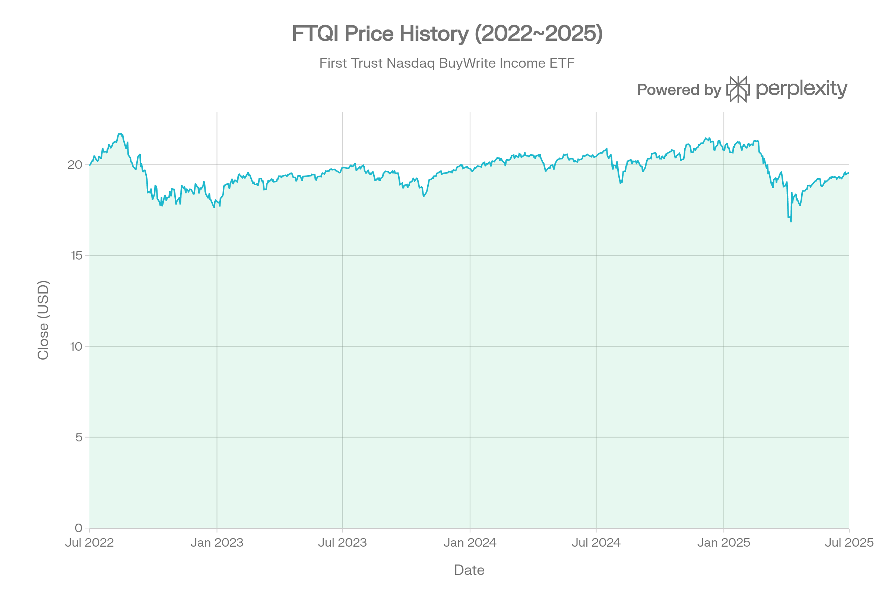
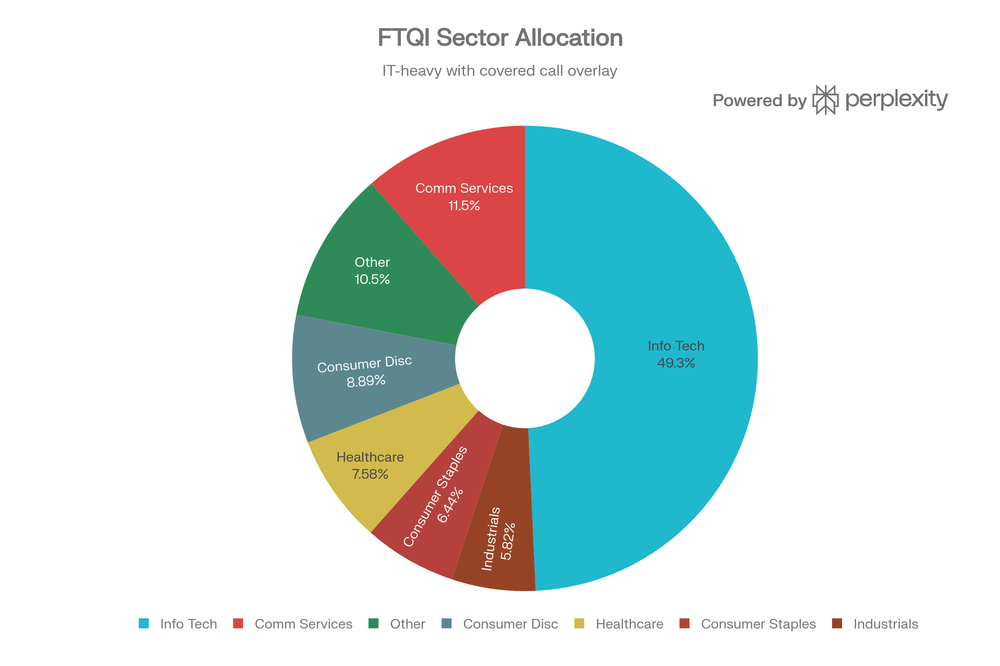
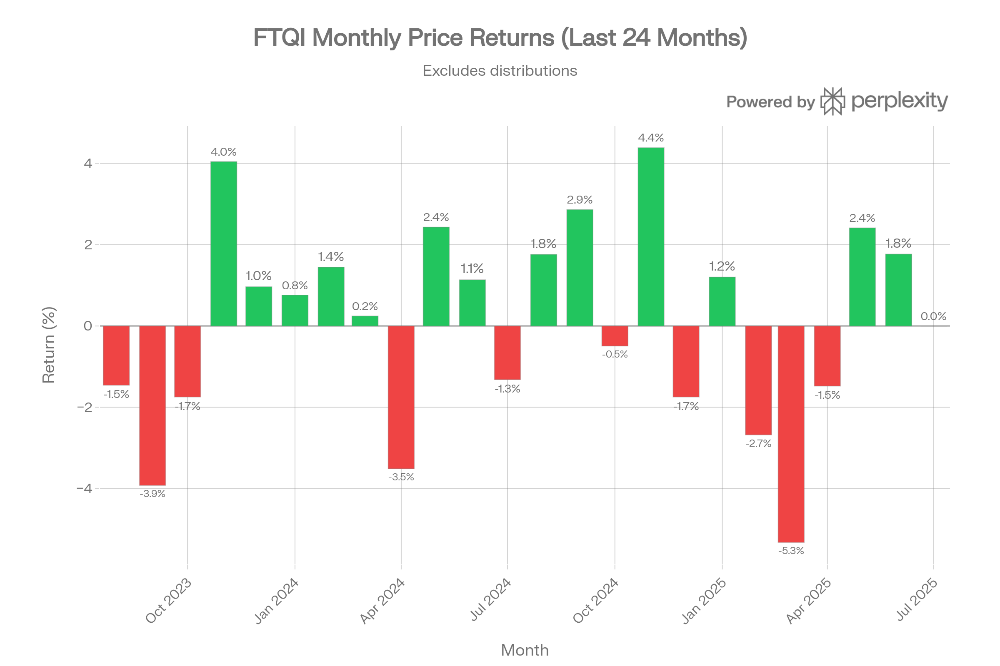
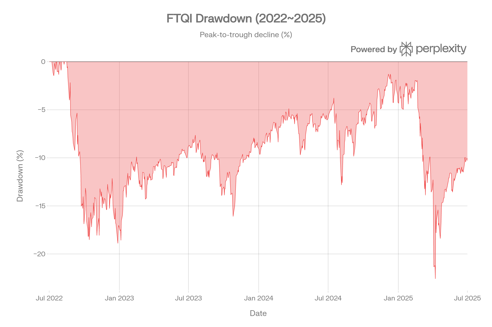
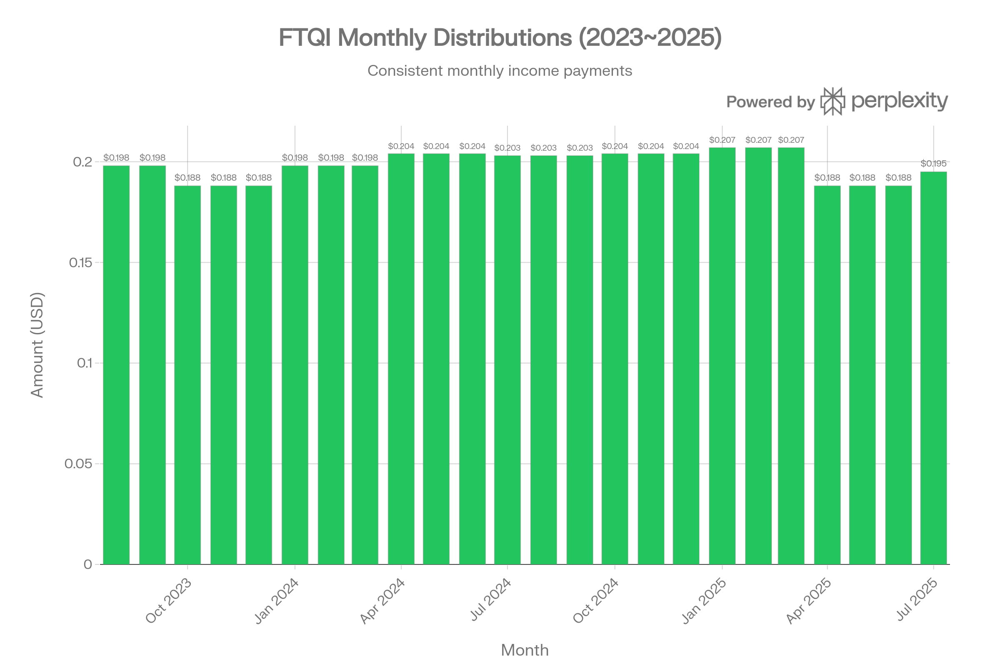

## 요약

## 개요
FTQI (First Trust Nasdaq BuyWrite Income ETF)는 미국 대형주 포트폴리오에 나스닥 100 지수의 커버드 콜 옵션 오버레이를 결합한 액티브 운용 ETF이다. 2014년 1월 6일에 설정되었으며, 약 12%의 높은 월 배당 수익률을 제공하는 인컴 중심 전략을 구사한다. 2022년 5월 "First Trust Hedged BuyWrite Income ETF"에서 현재의 "First Trust Nasdaq BuyWrite Income ETF"로 전환되며 전략이 크게 변경되어, 이전 실적과 현재 실적의 직접 비교에는 주의가 필요하다.[1][2]

***
## ETF 분류

| 항목 | 내용 |
|------|------|
| **최종 폴더** | `ETF/Dividend Income/Option Income/Nasdaq-100/FTQI` |
| **대분류** | 배당·인컴 |
| **하위 분류** | Option Income / Nasdaq-100 |
| **핵심 전략** | 미국 대형주 + Nasdaq-100 콜옵션 매도 |
| **운용 방식** | 액티브 |
| **레버리지·인버스 여부** | 아니오 |
| **옵션 인컴 전략 여부** | 예 |

FTQI는 Nasdaq-100 관련 옵션을 활용하지만 핵심 목적은 대표지수 단순 추종이 아니라 **콜옵션 매도를 통한 프리미엄 인컴 창출**입니다. ETF 분류 기준상 옵션 인컴 구조는 대표지수보다 우선하므로 `Dividend Income/Option Income/Nasdaq-100`으로 분류합니다.

***
## 1. 기본 정보
| 항목 | 내용 |
|------|------|
| **티커** | FTQI |
| **정식 명칭** | First Trust Nasdaq BuyWrite Income ETF |
| **운용사** | First Trust Advisors L.P.[1] |
| **상장 거래소** | NASDAQ[1] |
| **설정일** | 2014년 1월 6일[1] |
| **운용 기간** | 약 12년 2개월 |
| **순자산 규모(AUM)** | 약 $697M~$771M[2][3] |
| **추종 벤치마크** | Cboe Nasdaq-100 BuyWrite™ Index[1] |
| **운용 방식** | 액티브 운용 (Actively Managed)[3] |
| **설정가** | $19.93[1] |
| **CUSIP** | US33738R4074[1] |

FTQI는 **패시브 인덱스 추종 ETF가 아닌 액티브 운용 펀드**로, 미국 대형주를 독자적인 퀀트 모델로 선별한 뒤 나스닥 100 지수에 대한 콜 옵션을 매도하여 프리미엄 수입을 창출하는 "바이라이트(Buy-Write)" 전략을 사용한다. 참조 벤치마크인 Cboe Nasdaq-100 BuyWrite™ Index는 나스닥 100 포트폴리오를 보유하면서 매월 ATM(등가격) NDX 콜 옵션을 매도하는 전략의 수익률을 측정한다.[1][4]

***
## 2. 추종 성과 지표
### 추적오차 및 추적 차이
FTQI는 액티브 운용 펀드이므로 전통적 의미의 "추적오차(Tracking Error)"를 벤치마크 대비로 공시하지 않는다. 그러나 참조 벤치마크인 Cboe Nasdaq-100 BuyWrite Index 대비 성과 차이를 간접 비교할 수 있다. 펀드의 주식 포트폴리오가 나스닥 100 구성과 상이하고, 옵션 행사가·만기 선택이 지수와 달라 자연적인 추적 괴리가 발생한다.[1]
### NAV 대비 시장가격 괴리율
| 지표 | 수치 |
|------|------|
| S&P 500 대비 Beta | 0.89[3] |
| S&P 500 대비 R-squared | 91%[3] |
| 평균 호가 스프레드 | 0.10% (10bp)[3] |
| 총 소유 비용 (비용+스프레드) | 85bp[3] |
| 동종 평균 총 소유 비용 | 88bp[3] |

S&P 500과의 높은 R-squared(91%)는 펀드 가격 변동의 대부분이 시장 전체 움직임에 의해 설명됨을 나타낸다. NAV 대비 시장가격 괴리는 평균 10bp 수준의 호가 스프레드 내에서 관리되고 있으며, 인가된 참가자(AP) 중재 메커니즘이 작동하지만, 극심한 시장 변동 시 괴리가 확대될 수 있다.[1][3]

***
## 3. 비용 구조
### 총 보수 및 비용
| 항목 | FTQI |
|------|------|
| **총 보수비율(TER)** | 0.75%~0.76%[5][3] |
| **포트폴리오 회전율(Turnover)** | 0.9%[3] (일부 소스 58%)[6] |
| **평균 호가 스프레드** | 0.10%[3] |
| **총 소유 비용** | 약 85bp[3] |
### 경쟁 ETF 대비 비용 비교
| ETF | 전략 | 비용비율 | AUM | 배당수익률 |
|-----|------|---------|-----|-----------|
| **FTQI** | 나스닥 100 커버드 콜 (액티브) | 0.75%[5] | ~$697M[4] | ~12.1%[7] |
| **QYLD** | 나스닥 100 커버드 콜 (패시브) | 0.60%[8] | ~$8.3B[9] | ~11.6%[9] |
| **JEPQ** | 나스닥 프리미엄 인컴 (액티브) | 0.35%[8] | ~$34.7B[9] | ~10.6%[9] |
| **QYLG** | 나스닥 100 커버드콜 & 그로스 | 0.60%[10] | - | - |

FTQI는 동종 ETF 중 **가장 높은 비용비율**을 부과한다. 특히 JEPQ(0.35%)와 비교하면 두 배 이상의 비용 차이가 있어, 장기 투자 시 복리 효과에 의해 성과 차이가 누적될 수 있다. 다만 총 소유 비용(85bp)은 동종 평균(88bp)보다 약간 낮은 수준이다.[3][11]

***
## 4. 유동성 평가

| 지표 | 수치 |
|------|------|
| **일평균 거래량 (3개월)** | 약 267,246주​ |
| **일평균 거래대금 (3개월)** | 약 $5,013,550​ |
| **평균 거래량 (ETFrc 기준)** | 319,000주[3] |
| **일평균 거래대금 (ETFrc)** | $7M[3] |
| **호가 스프레드 평균** | 0.10%[3] |
| **호가 스프레드 범위** | 5~54bp[3] |
| **공매도 비율 (AUM 대비)** | 0.1%[3] |

유동성은 양호한 편이다. 일평균 약 26.7만주​가 거래되며, 거래대금은 약 $500만​ 수준이다. 호가 스프레드 평균 10bp는 동종 대비 합리적이나, 시장 변동성이 급등하는 시기에는 54bp까지 확대된 사례가 있다. 공매도 비율이 0.1%로 매우 낮아 역방향 투기 수요는 미미하다.[3]
---
## 5. 포트폴리오 구성
### 상위 10대 보유 종목
| 순위 | 종목명 | 티커 | 비중 |
|------|--------|------|------|
| 1 | NVIDIA Corporation | NVDA | 7.70%​ |
| 2 | Apple Inc. | AAPL | 7.62%​ |
| 3 | Microsoft Corporation | MSFT | 6.12%​ |
| 4 | Amazon.com, Inc. | AMZN | 3.88%​ |
| 5 | Advanced Micro Devices | AMD | 3.49%​ |
| 6 | Broadcom Inc. | AVGO | 3.41%​ |
| 7 | Tesla, Inc. | TSLA | 3.31%​ |
| 8 | Meta Platforms, Inc. | META | 2.66%​ |
| 9 | Costco Wholesale Corp. | COST | 2.47%​ |
| 10 | Netflix, Inc. | NFLX | 2.17%​ |

상위 10종목 합계 비중은 **42.82%​**이며, 전체 약 159개 주식 종목과 5개 NDX 옵션 포지션을 보유하고 있다.[3]
### 섹터별 배분 (2026년 3월 6일 기준)

| 섹터 | 비중 |
|------|------|
| 정보기술(IT) | 49.27%[12] |
| 커뮤니케이션 서비스 | 11.46%[12] |
| 경기소비재 | 8.89%[12] |
| 헬스케어 | 7.58%[12] |
| 필수소비재 | 6.44%[12] |
| 산업재 | 5.82%[12] |
| 기타 | 10.54% |

IT 섹터에 약 **49.3%**가 집중되어 있어 기술주 변동에 크게 노출되어 있다. 나스닥 100 지수의 특성상 IT와 커뮤니케이션 서비스(합계 ~61%)가 지배적이며, 금융·에너지·유틸리티 비중은 매우 낮다.[12]
### 국가별 배분
| 국가 | 비중 |
|------|------|
| 미국 | 90.9%[3] |
| 아일랜드 | 1.7%[3] |
| 영국 | 0.5%[3] |

선진국 비중 95.2%, 신흥국 0.3%로 사실상 미국 중심 포트폴리오이다.[3]
### 리밸런싱 및 옵션 오버레이
FTQI의 옵션 전략은 **매월 NDX(나스닥 100 지수) 콜 옵션을 매도**하는 방식으로 운용된다. 현재 보유 중인 옵션 포지션을 보면, 2026년 3월 만기(행사가 24,900~25,600)와 4월 만기(행사가 25,000) 콜 옵션을 다양한 행사가에 걸쳐 분산 매도하고 있다. 이는 단일 행사가에 집중하는 QYLD의 ATM 전략과 달리, 복수의 행사가에 옵션을 분산하여 리스크를 관리하는 접근법이다.[1][13]

***
## 6. 성과 분석
### 기간별 수익률 (2026년 2월 28일 기준)
| 기간 | 가격 수익률 | 배당 수익률 | 총 수익률 |
|------|------------|------------|----------|
| YTD | -2.0% | +1.0% | -1.0%[3] |
| 1년 | +0.3% | +12.8% | +13.0%[3] |
| 2년 (연환산) | +0.1% | +12.7% | +12.8%[3] |
| 3년 (연환산) | +2.5% | +13.0% | +15.5%[3] |
| 5년 (연환산) | +0.0% | +10.3% | +10.3%[3] |
| 10년 (연환산) | +0.6% | +6.7% | +7.4%[3] |
| 설정 이래 (연환산) | +0.1% | +6.1% | +6.2%[3] |

이 수익률 데이터에서 핵심적인 관찰 사항은 **가격 수익률이 거의 0%에 수렴**한다는 점이다. 설정 이래 연환산 가격 수익률이 +0.1%에 불과하여, 총 수익률 6.2%의 거의 대부분이 배당(인컴)에 의해 창출되고 있다. 이는 커버드 콜 전략의 본질적 특성으로, 옵션 프리미엄 수입을 배당으로 환원하는 대신 상승 참여를 제한하기 때문이다.[3]
### 가격 기준 수익률 (OHLCV 데이터 기반)

| 기간 | 가격 수익률 |
|------|------------|
| 1개월 | +1.46%​ |
| 3개월 | +2.96%​ |
| 6개월 | -7.67%​ |
| 1년 | -4.51%​ |
### 경쟁 ETF 대비 총 수익률 비교 (연환산)
| ETF | 1년 | 3년 | 5년 | 설정 이래 |
|-----|-----|-----|-----|----------|
| **FTQI** | +13.0%[3] | +15.5%[3] | +10.3%[3] | +6.2%[3] |
| **JEPQ** | +13.8%[11] | +8.1%[11] | N/A | N/A |
| **QYLD** | +9.8%[8] | +10.3%[8] | +8.0%[8] | +8.0%[8] |

FTQI는 최근 3년 총 수익률(15.5%)에서 QYLD(10.3%)를 크게 앞서고 있으나, 이는 2022년 전략 전환 이후의 높은 배당 지급에 기인한다. 1년 총 수익률 기준으로는 JEPQ(13.8%)와 유사한 수준이다.[3][8][11]
### 리스크 조정 성과 지표

| 지표 | 수치 | 출처 |
|------|------|------|
| **샤프 비율 (1Y)** | 0.26[11] | PortfoliosLab |
| **샤프 비율 (3Y)** | 0.65[14] | FT.com |
| **소르티노 비율 (1Y)** | 0.51[11] | PortfoliosLab |
| **칼마 비율** | 0.33[15] | Composer |
| **표준편차 (1Y, 자체 계산)** | 19.33%​ | OHLCV 데이터 |
| **표준편차 (3Y, 자체 계산)** | 15.68%​ | OHLCV 데이터 |
| **표준편차 (3Y, FT.com)** | 10.28%[14] | FT.com |
| **최대 낙폭 (2022~)** | **-22.59%**​ (2025-04-08) | OHLCV 데이터 |
| **최대 낙폭 (전체 기간)** | -19.42%[11] | PortfoliosLab |

샤프 비율 0.26(1Y 기준)은 "평균 이하" 수준으로, 감수하는 위험 대비 수익이 충분하지 않음을 시사한다. 특히 JEPQ의 샤프 비율 0.40과 비교하면 리스크 조정 효율에서 열위에 있다. 2025년 4월 발생한 최대 낙폭 약 -22.6%​는 커버드 콜 전략이 하방 보호 기능이 제한적이라는 점을 명확히 보여준다.[11]
---
## 7. 배당 정보
### 배당 수익률 및 개요
| 항목 | 수치 |
|------|------|
| **배당 수익률 (TTM)** | 12.13%~12.91%[7][11] |
| **연간 배당금 (TTM)** | $2.39~$2.40[7] |
| **지급 주기** | 매월[3] |
| **배당 성장률 (1Y)** | +1.22%[7] |
| **배당 지급 비율** | 399.57%~413.27%[7][4] |

배당 지급 비율이 400%를 초과한다는 것은 **배당의 상당 부분이 옵션 프리미엄 수입 또는 자본 환원(Return of Capital)**으로 충당되고 있음을 의미한다. 이는 전통적인 배당과는 성격이 다르며, 세금 효율성 측면에서 고려할 사항이다.[1][7]
### 배당 이력 추이 (주요 시기별 월 배당금)

| 시기 | 월 배당금 | 비고 |
|------|----------|------|
| 2020~2022.4 | $0.055 | 전략 전환 이전[7] |
| 2022.5~6 | $0.210 | 전략 전환 직후 급등[7] |
| 2022.7~9 | $0.200 | [7] |
| 2022.10~12 | $0.179 | [7] |
| 2023.1~3 | $0.179 | [7] |
| 2023.4~6 | $0.194 | [7] |
| 2023.7~9 | $0.198 | [7] |
| 2023.10~12 | $0.188 | [7] |
| 2024.1~3 | $0.198 | [7] |
| 2024.4~6 | $0.204 | [7] |
| 2024.7~9 | $0.203 | [7] |
| 2024.10~12 | $0.204 | [7] |
| 2025.1~3 | $0.207 | [7] |
| 2025.4~6 | $0.188 | [7] |
| 2025.7 | $0.195 | [7] |
2022년 5월 전략 전환을 기점으로 월 배당금이 **$0.055에서 $0.210으로 약 4배 급등**한 것이 가장 두드러진 변화다. 이후 $0.179~$0.210 범위에서 비교적 안정적으로 유지되고 있으나, 2025년 4~6월에는 시장 변동성 영향으로 $0.188까지 소폭 하락했다. 전환 이전과 이후의 배당 수익률을 단순 비교하면, 2021년 약 3.1%에서 2024년 11.7%로 극적으로 상승했다.[7][11]

***
## 8. 리스크 요소
### 베타 계수 및 상관계수
| 대비 지수 | 베타 | R-squared |
|-----------|------|-----------|
| S&P 500 | 0.89[3] | 91%[3] |
| MSCI EAFE | 0.86[3] | 61%[3] |
| MSCI 신흥국 | 0.74[3] | 55%[3] |
| JEPQ 대비 상관계수 | - | 0.90[11] |

Beta 0.89는 시장 대비 약 11% 낮은 변동성을 보이며, 커버드 콜 프리미엄이 일부 하방 완충 역할을 하고 있음을 반영한다. 그러나 다른 출처에서는 Beta 0.60으로 보고되기도 하여, 측정 기간에 따라 상당한 차이가 존재한다.[3][4]
### 섹터 집중도 리스크
IT 섹터 비중 49.27%는 **극심한 섹터 집중**을 나타낸다. NVIDIA, Apple, Microsoft 3종목만으로 전체의 약 21.4%를 차지하며, 반도체·빅테크 시장 환경에 민감하게 반응한다. 2025년 초 기술주 조정 시 FTQI가 -22.59%​까지 하락한 것은 이 집중도 리스크가 현실화된 사례다.[12]
### 옵션 전략 고유 리스크
- **상승 제한(Upside Capping)**: 콜 옵션 매도로 인해 기초지수가 행사가 이상으로 상승 시 이익이 제한된다. 2025년 나스닥 100이 20% 이상 상승했음에도 FTQI의 가격 수익률은 사실상 보합이었다.[3][16]
- **하방 미보호**: 커버드 콜은 옵션 프리미엄만큼의 제한적 완충만 제공하며, 급락 시 대부분의 손실을 감수해야 한다.[4]
- **자본 환원 리스크**: 옵션 프리미엄으로 충당되는 배당은 순자산 감소를 동반할 수 있어, 장기적으로 NAV 하락이 발생할 수 있다.[1]
- **거래 상대방 리스크**: 옵션 거래에서 상대방의 의무 불이행 가능성이 존재한다.[1]
- **높은 세금 비효율성**: 빈번한 옵션 매매와 자본 환원 배당으로 세금 부담이 증가할 수 있다.[1]
### 유동성 리스크
일평균 거래량 약 26.7만주​와 일평균 거래대금 $500만​은 소규모 투자자에게는 충분하나, 기관급 대량 거래에는 제약이 있을 수 있다. 시장 스트레스 시 호가 스프레드가 54bp까지 확대되는 패턴이 관찰된다.[3]
### 경쟁 ETF 대비 리스크 비교
| 지표 | FTQI | JEPQ | QYLD |
|------|------|------|------|
| 최대 낙폭 | -19.42%[11] | -20.07%[17] | -19.06%[17] |
| 변동성 (1M) | 11.03%[11] | 11.83%[11] | 낮음[8] |
| 샤프 비율 | 0.26[11] | 0.40[11] | - |
| 비용비율 | 0.75%[5] | 0.35%[8] | 0.60%[8] |

FTQI는 JEPQ 대비 낮은 변동성을 보이지만 낮은 샤프 비율로 **리스크 대비 수익 효율이 떨어진다**. QYLD와 비교 시 최대 낙폭은 유사하나 비용이 15bp 더 높다. 다수의 Seeking Alpha 분석에서 FTQI를 경쟁 대비 "열위(worst of breed)"로 평가하거나 "더 나은 대안이 존재"한다고 지적하고 있다.[3][4][11][6]

***
## 투자 시사점
FTQI는 **월 배당 12% 이상의 높은 인컴**을 제공하는 것이 가장 큰 매력이나, 가격 상승 잠재력이 극도로 제한되어 총 수익 측면에서는 상승장에서 나스닥 100 자체(QQQ)에 크게 뒤처진다. 설정 이래 연환산 총 수익률 6.2%는 같은 기간 QQQ의 수익률에 비해 현저히 낮다.[3]

0.75%의 높은 비용비율, 400% 초과의 배당 지급 비율(자본 환원 가능성), 그리고 동종 대비 열위의 리스크 조정 성과를 고려하면, 순수 인컴 목적의 투자자에게도 JEPQ(비용 0.35%, 더 높은 샤프 비율)가 더 효율적인 대안이 될 수 있다. 다만 FTQI의 포트폴리오가 나스닥 100 전체가 아닌 약 159개 종목을 액티브로 선별한다는 차별점은 있다.[8][11]
