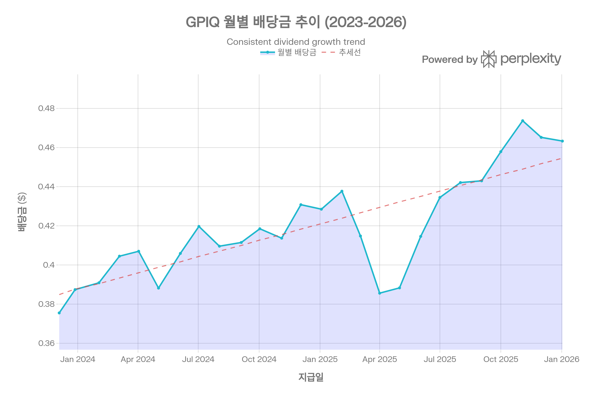
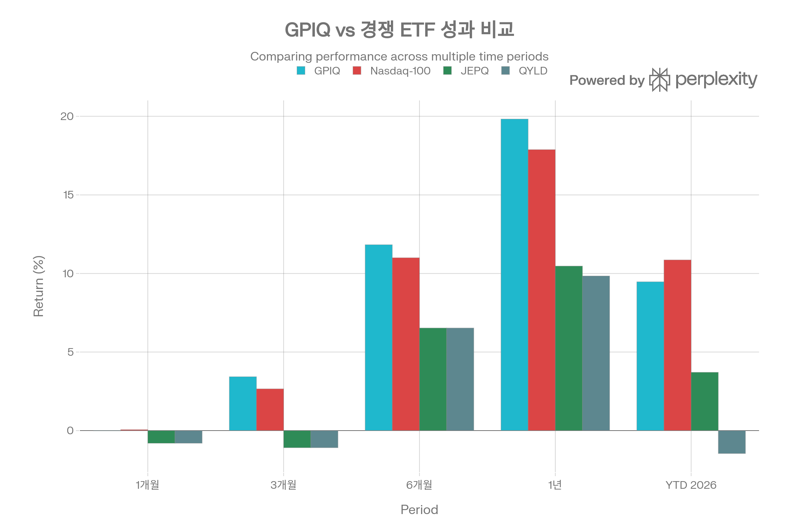
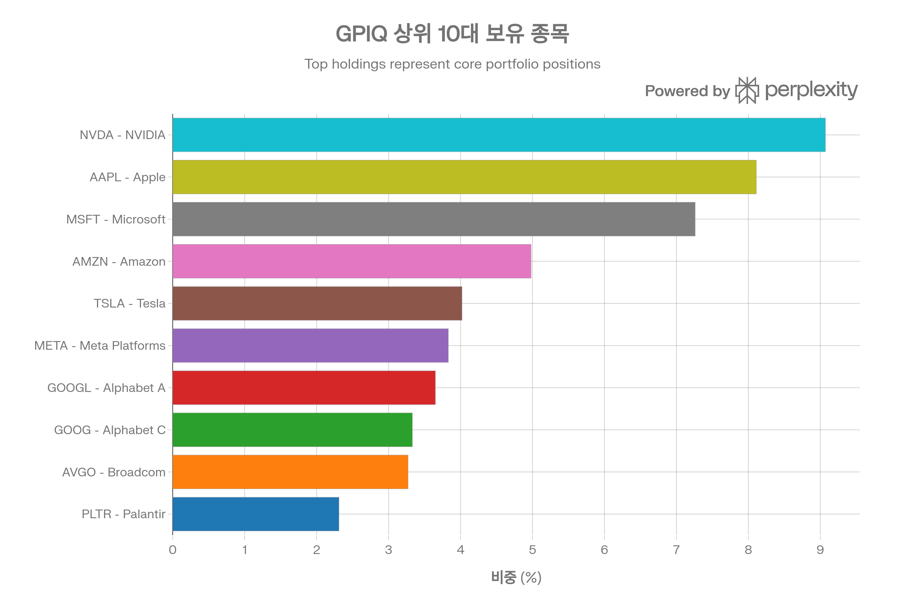
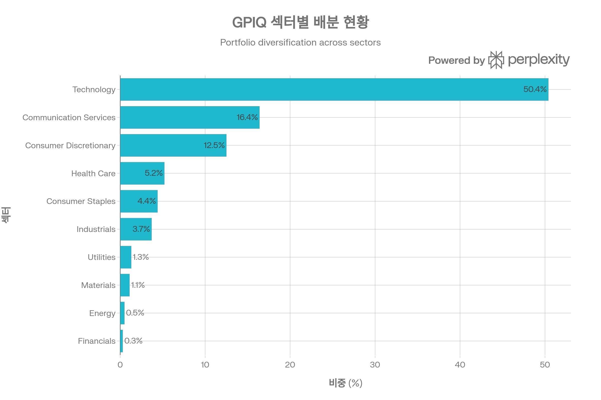

## 요약

GPIQ는 Nasdaq-100 성장주 노출에 동적 커버드콜 전략을 결합해 월배당 인컴을 추구하는 액티브 ETF입니다.

***

## ETF 분류

| 항목 | 내용 |
|------|------|
| <strong>최종 폴더</strong> | `ETF/Dividend Income/Option Income/Nasdaq-100/GPIQ` |
| <strong>대분류</strong> | 배당·인컴 |
| <strong>하위 분류</strong> | Option Income / Nasdaq-100 |
| <strong>핵심 전략</strong> | Nasdaq-100 주식 노출 + 콜옵션 매도 |
| <strong>운용 방식</strong> | 액티브 |
| <strong>레버리지·인버스 여부</strong> | 아니오 |
| <strong>옵션 인컴 전략 여부</strong> | 예 |

GPIQ는 Nasdaq-100 지수를 기반으로 하지만 핵심 목적은 대표지수 단순 추종이 아니라 <strong>옵션 프리미엄을 활용한 월배당 인컴 창출</strong>입니다. ETF 분류 기준상 옵션 인컴 구조는 대표지수보다 우선하므로 `Dividend Income/Option Income/Nasdaq-100`으로 분류합니다.

## 1. 기본 정보

Goldman Sachs Nasdaq-100 Core Premium Income ETF(티커: GPIQ)는 2023년 10월 24일 Goldman Sachs Asset Management가 설정한 액티브 운용 ETF로, Nasdaq-100 지수를 추종하면서 동적 커버드콜 전략을 통해 월배당 수입을 창출하는 것을 목표로 합니다. 설정 후 약 2년 3개월 만에 순자산 규모 \$2.89B(약 2조 8,900억 원)를 기록하며 커버드콜 ETF 시장에서 빠르게 주목받고 있습니다.[^1][^2][^3]

### 핵심 정보

| 항목 | 세부 내용 |
| :-- | :-- |
| <strong>티커</strong> | GPIQ |
| <strong>설정일</strong> | 2023년 10월 24일 |
| <strong>순자산(AUM)</strong> | \$2.89B (2026년 1월 기준) |
| <strong>추종 지수</strong> | Nasdaq-100 Index |
| <strong>운용사</strong> | Goldman Sachs Asset Management |
| <strong>상장거래소</strong> | NASDAQ |
| <strong>보유 종목 수</strong> | 107개 |
| <strong>총 보수(TER)</strong> | 0.29% (2026년 4월까지 비용 상한 적용) |

GPIQ ETF의 월별 배당금 지급 추이. 2025년 들어 배당금이 꾸준히 증가하는 모습을 보여줍니다.

GPIQ는 Goldman Sachs가 프리미엄 인컴 전략으로 선보인 두 개의 ETF 중 하나로(다른 하나는 S\&P 500 기반 GPIX), Nasdaq-100의 성장성과 옵션 프리미엄 수입을 결합한 차별화된 상품입니다. 설정 이후 일관된 자금 유입을 기록하며, 2025년 한 해 동안 약 \$2B의 순유입을 달성했습니다.[^4][^5][^6]

## 2. 추종 성과 지표

### 2.1 추적오차 및 추적 차이

GPIQ는 Nasdaq-100 지수를 벤치마크로 하지만, 커버드콜 전략의 특성상 순수 지수 추종 ETF와는 다른 성과 패턴을 보입니다. 이 펀드는 지수를 정확히 복제하는 것이 아니라, 지수 구성 종목을 보유하면서 25-75% 범위에서 콜옵션을 매도하여 수입을 창출하는 액티브 전략을 구사합니다.[^7][^8]

<strong>주요 추적 특성:</strong>

- <strong>베타 계수</strong>: 0.85-0.99로 Nasdaq-100 대비 약간 낮은 변동성을 보입니다[^2][^9][^10]
- <strong>상관계수</strong>: Nasdaq-100과 높은 상관관계 유지 (포트폴리오 구성이 지수를 미러링)
- <strong>상승장 포착률</strong>: 약 75-85% 수준으로, 콜옵션 매도로 인한 상승 제한을 반영합니다[^10]

GPIQ는 순수 지수 추종이 아닌 인컴 창출 전략이므로, 전통적인 의미의 추적오차(Tracking Error)보다는 총수익률 비교가 더 적절합니다. 2025년 상반기 기준 GPIQ는 6.3% 상승한 반면 QQQ는 7.1% 상승했으며, 이는 콜옵션 매도로 인한 상승 제한과 배당 수입의 균형을 나타냅니다.[^11]

### 2.2 NAV 대비 시장가격 괴리율

GPIQ의 NAV 추적은 비교적 양호한 수준을 유지하고 있습니다.

| 지표 | 수치 |
| :-- | :-- |
| <strong>NAV (2026년 1월)</strong> | \$49.80-52.15 |
| <strong>시장가격 (2026년 1월)</strong> | \$53.77 |
| <strong>괴리율</strong> | +0.06% (프리미엄) |

[^12][^1]

프리미엄 거래는 투자자들의 강한 수요를 반영하며, 괴리율이 0.06%로 매우 낮아 유동성과 차익거래 메커니즘이 효과적으로 작동하고 있음을 시사합니다. 대부분의 거래 시간에 NAV에 근접한 가격에 거래되고 있습니다.[^1][^13]

GPIQ와 경쟁 상품의 기간별 수익률 비교. GPIQ는 1년 기준 19.83%의 수익률로 경쟁 커버드콜 ETF를 크게 상회합니다.

위 차트는 GPIQ와 주요 경쟁 ETF의 기간별 수익률을 비교한 것입니다. GPIQ는 1년 기준 19.83%의 수익률을 기록하며 Nasdaq-100 지수(17.88%)에 근접한 성과를 보이면서도, JEPQ(10.47%)와 QYLD(9.84%)를 크게 앞섰습니다. 이는 GPIQ의 동적 커버드콜 전략이 경쟁 제품의 고정적 접근방식보다 효과적임을 입증합니다.[^14]

## 3. 비용 구조

### 3.1 총 보수 및 비용

GPIQ는 커버드콜 ETF 중에서도 경쟁력 있는 비용 구조를 자랑합니다.

| 비용 항목 | GPIQ | JEPQ | QYLD | QQQI |
| :-- | :-- | :-- | :-- | :-- |
| <strong>순 보수율</strong> | 0.29% | 0.35% | 0.60% | 0.68% |
| <strong>총 보수율</strong> | 0.35% | - | - | - |

[^2][^15][^16][^9]

Goldman Sachs는 2026년 4월까지 0.29%의 순 보수율을 유지하기로 약속했으며, 이는 초과 비용을 자체 부담하는 비용 상한 약정을 의미합니다. 이러한 낮은 비용은 GPIQ의 핵심 경쟁 우위 중 하나로, JEPQ보다 17% 낮고 QYLD보다 52% 낮은 수준입니다.[^17][^16][^9][^18]

### 3.2 포트폴리오 회전율

GPIQ의 포트폴리오 회전율은 4.00%로 매우 낮은 수준입니다. 이는 펀드가 기본적으로 Nasdaq-100 구성 종목을 매수 후 보유(buy-and-hold) 전략을 취하며, 액티브 매매보다는 옵션 전략을 통해 수익을 창출함을 의미합니다. 낮은 회전율은 거래 비용을 최소화하고 세금 효율성을 높이는 데 기여합니다.[^15]

### 3.3 거래 비용 및 스프레드

GPIQ의 유동성 지표는 양호한 수준을 보여줍니다:

- <strong>일평균 거래량 (3개월)</strong>: 996,300주[^19]
- <strong>유동성 등급</strong>: B+ (전체 ETF 대비 상위권)[^19]
- <strong>호가 스프레드</strong>: 양호 (구체적 수치 미공개이나 유동성 등급으로 추정)

일평균 거래량이 100만 주에 근접하며, 이는 기관투자자와 개인투자자 모두에게 충분한 유동성을 제공합니다. 유동성 등급 B+는 대부분의 투자자가 큰 슬리피지 없이 매매할 수 있는 수준입니다.[^19]

## 4. 유동성 평가

### 4.1 일평균 거래량 및 거래대금

2026년 1월 기준 GPIQ의 유동성 지표:

| 지표 | 수치 |
| :-- | :-- |
| <strong>일평균 거래량 (3개월)</strong> | 996,300주 |
| <strong>최근 일일 거래량</strong> | 1,038,572 - 1,359,949주 |
| <strong>일평균 거래대금</strong> | 약 \$50-54M (주가 \$53 기준) |

[^2][^19][^20]

GPIQ의 거래량은 설정 초기 대비 지속적으로 증가하는 추세를 보이고 있습니다. 2025년 내내 순유입이 발생하며 거래량도 함께 증가했으며, 이는 펀드에 대한 관심과 수요가 꾸준히 증가하고 있음을 시사합니다.[^6]

### 4.2 유동성 추이 및 안정성

GPIQ의 유동성은 다음과 같은 특징을 보입니다:

<strong>긍정적 요인:</strong>

- <strong>지속적 자금 유입</strong>: 2025년 모든 주에 순유입을 기록하며 AUM이 \$1.28B에서 \$2.89B로 증가[^7][^6]
- <strong>기관 투자</strong>: Requisite Capital Management 등 대형 기관의 \$79M 규모 투자[^21]
- <strong>유동성 등급 개선</strong>: 자산 규모 증가에 따라 유동성도 함께 향상

<strong>고려사항:</strong>

- 설정 2년차 펀드로 경쟁 제품 JEPQ(\$30B AUM)에 비해 규모가 작음[^22]
- 그러나 빠른 성장세로 유동성 우려는 점차 해소되고 있음

시장 변동성이 높은 시기에도 GPIQ는 안정적인 유동성을 유지했으며, 2025년 4월 시장 하락 시에도 정상적인 거래가 이루어졌습니다.[^23]

## 5. 포트폴리오 구성

### 5.1 상위 10대 보유 종목 및 비중

GPIQ ETF의 상위 10대 보유 종목과 비중. NVIDIA가 9.07%로 1위, Apple 8.11%, Microsoft 7.26% 순입니다.

GPIQ의 상위 10대 보유 종목은 Nasdaq-100 지수의 대표 기업들로 구성되어 있으며, 2026년 1월 기준 다음과 같습니다:

| 순위 | 티커 | 기업명 | 비중 |
| :-- | :-- | :-- | :-- |
| 1 | NVDA | NVIDIA | 9.07% |
| 2 | AAPL | Apple | 8.11% |
| 3 | MSFT | Microsoft | 7.26% |
| 4 | AMZN | Amazon | 4.98% |
| 5 | TSLA | Tesla | 4.02% |
| 6 | META | Meta Platforms | 3.83% |
| 7 | GOOGL | Alphabet (Class A) | 3.65% |
| 8 | GOOG | Alphabet (Class C) | 3.33% |
| 9 | AVGO | Broadcom | 3.27% |
| 10 | PLTR | Palantir | 2.31% |

[^24][^25][^26]

상위 10대 종목이 전체 포트폴리오의 약 49.95-53%를 차지하며, 이는 Nasdaq-100 지수의 집중도를 그대로 반영합니다. 특히 NVIDIA, Apple, Microsoft 3개 종목만으로 전체의 24.44%를 구성하고 있어, 이들 대형 기술주의 성과가 펀드 수익률에 큰 영향을 미칩니다.[^27][^24]

<strong>집중도 분석:</strong>

- NVIDIA 10.3%의 높은 비중은 AI 열풍을 반영하며, 동시에 단일 종목 리스크를 야기합니다[^27]
- 상위 5개 종목으로 33.44%를 구성하여 상당한 집중도를 보입니다[^3]
- 이러한 집중은 변동성을 높일 수 있으나, 동시에 옵션 프리미엄 수입 증대에도 기여합니다[^27]

### 5.2 섹터별 배분 현황

GPIQ ETF의 섹터별 자산 배분. 기술주가 50.4%로 가장 높은 비중을 차지하며, 통신서비스와 경기소비재가 그 뒤를 잇습니다.

GPIQ의 섹터별 자산 배분은 Nasdaq-100 지수의 기술주 중심 특성을 그대로 반영합니다:

| 섹터 | 비중 |
| :-- | :-- |
| <strong>Information Technology</strong> | 50.4% |
| <strong>Communication Services</strong> | 16.4% |
| <strong>Consumer Discretionary</strong> | 12.5% |
| <strong>Health Care</strong> | 5.2% |
| <strong>Consumer Staples</strong> | 4.4% |
| <strong>Industrials</strong> | 3.7% |
| <strong>Utilities</strong> | 1.3% |
| <strong>Materials</strong> | 1.1% |
| <strong>Energy</strong> | 0.5% |
| <strong>Financials</strong> | 0.3% |

[^3][^26]

기술주가 전체의 절반 이상을 차지하며, 통신서비스(16.4%)와 경기소비재(12.5%)를 합치면 약 79.3%가 성장주 중심 섹터에 집중되어 있습니다. 이는 경제 성장기에는 유리하지만, 금리 인상기나 경기 침체기에는 더 큰 변동성에 노출될 수 있음을 의미합니다.

### 5.3 리밸런싱 주기

GPIQ의 리밸런싱은 두 가지 차원에서 이루어집니다:

<strong>1. 주식 포트폴리오 리밸런싱:</strong>

- Nasdaq-100 지수의 정기 리밸런싱(연 1회, 12월)에 맞춰 조정됩니다[^28]
- 지수 구성 변경 시 신속하게 포트폴리오를 재조정하여 추적오차를 최소화합니다

<strong>2. 옵션 전략 리밸런싱:</strong>

- <strong>월별 조정</strong>: 옵션 오버라이트 비율을 25-75% 범위에서 매월 재검토합니다[^8][^29]
- <strong>변동성 기반 조정</strong>: 내재 변동성이 낮을 때는 더 많은 콜옵션을 매도(최대 75%)하고, 변동성이 높을 때는 적게 매도(최소 25%)하여 상승 잠재력을 확보합니다[^30]
- <strong>동적 관리</strong>: 시장 상황에 따라 행사가격과 만기를 조정하는 FLEX 옵션을 활용합니다[^31]

이러한 동적 리밸런싱 전략은 GPIQ가 고정 비율 커버드콜 전략을 사용하는 QYLD와 차별화되는 핵심 요소입니다.[^23][^30]

## 6. 성과 분석

### 6.1 기간별 수익률

GPIQ는 설정 이후 일관되게 강력한 성과를 보여주고 있습니다:

| 기간 | GPIQ | Nasdaq-100 | JEPQ | QYLD |
| :-- | :-- | :-- | :-- | :-- |
| <strong>1개월</strong> | -0.01% | +0.06% | -0.80% | -0.80% |
| <strong>3개월</strong> | +3.43% | +2.66% | -1.09% | -1.09% |
| <strong>6개월</strong> | +11.83% | +11.00% | +6.53% | +6.53% |
| <strong>1년</strong> | +19.83% | +17.88% | +10.47% | +9.84% |
| <strong>YTD 2026</strong> | +9.47% | +10.86% | +3.71% | -1.46% |
| <strong>설정 이후 누적</strong> | +35%+ | +75% (QQQ 기준) | - | - |

[^14][^32][^27][^20][^23]

<strong>주요 성과 특징:</strong>

1. <strong>경쟁 커버드콜 ETF 압도</strong>: GPIQ는 1년 기준 JEPQ보다 89% 높은 수익률(19.83% vs 10.47%), QYLD보다 101% 높은 수익률을 기록했습니다[^9][^14]
2. <strong>Nasdaq-100 대비 선방</strong>: 커버드콜 전략임에도 불구하고 순수 지수 추종 QQQ에 근접한 성과를 보였습니다. 이는 동적 옵션 전략의 효과를 입증합니다[^11][^23]
3. <strong>일관된 아웃퍼폼</strong>: 2025년 YTD 기준 GPIQ는 16.4% 수익률로 JEPQ(12.06%), QQQI(15.73%), QYLD(-4.5%)를 모두 앞섰습니다[^23]

### 6.2 벤치마크 대비 초과 수익률

GPIQ는 Nasdaq-100 지수를 벤치마크로 하지만, 커버드콜 전략의 특성상 시장 환경에 따라 성과가 달라집니다:

<strong>상승장에서의 성과:</strong>

- 2025년 5-7월 Nasdaq-100이 15% 상승했을 때 GPIQ는 5.3% 상승에 그쳤습니다[^33]
- 이는 콜옵션 매도로 인한 상승 제한(upside cap)의 영향입니다
- 그러나 동일 기간 JEPQ는 더 낮은 상승률을 기록하여, GPIQ의 부분 헤지 전략이 더 효과적이었음을 보여줍니다

<strong>변동성 장에서의 성과:</strong>

- 2025년 4월 시장 급락 시 GPIQ는 -24.67% 하락했으나, 이후 32.99% 반등하며 경쟁 ETF를 크게 앞섰습니다[^31]
- 이는 일부 포지션이 상승에 완전 노출되어 있어 반등 시 더 많은 수익을 포착했기 때문입니다[^30]

<strong>하락장에서의 성과:</strong>

- 전통적 커버드콜 전략은 하락의 84%를 그대로 노출됩니다[^34][^35]
- GPIQ도 예외는 아니지만, 옵션 프리미엄 수입이 일부 완충 역할을 합니다
- 그러나 "하방 보호"라는 기대는 과장된 면이 있으며, 주된 이점은 인컴 창출입니다[^34]

### 6.3 리스크 조정 성과 지표

#### 샤프 지수 (Sharpe Ratio)

GPIQ의 샤프 지수는 위험 대비 수익률이 우수함을 보여줍니다:

| 기간 | GPIQ | JEPQ | QYLD |
| :-- | :-- | :-- | :-- |
| <strong>1년</strong> | 1.03 | 0.90 | 0.57 |
| <strong>설정 이후</strong> | 1.54 | - | - |
| <strong>CAGR 기준</strong> | 1.23 | - | - |

[^32][^36][^9][^18]

GPIQ의 1년 샤프 지수 1.03은 같은 기간 JEPQ(0.90), QYLD(0.57)를 크게 상회하며, 위험 대비 수익률이 가장 우수함을 입증합니다. 설정 이후 전체 기간 샤프 지수 1.54는 매우 인상적인 수치로, 펀드가 변동성 대비 효율적인 수익을 창출하고 있음을 의미합니다.[^9][^18][^32]

#### 변동성 (표준편차)

| 펀드 | 연간 변동성 | 베타 |
| :-- | :-- | :-- |
| <strong>GPIQ</strong> | 19.04% | 0.85-0.99 |
| <strong>JEPQ</strong> | 높음 (구체적 수치 미공개) | 0.90 |
| <strong>QYLD</strong> | 19.00% | 0.57 |

[^36][^18][^9]

GPIQ의 연간 변동성 19.04%는 Nasdaq-100의 높은 변동성을 일부 반영하면서도, 커버드콜 전략으로 인해 순수 지수 ETF보다는 낮은 수준입니다. 베타 계수 0.85-0.99는 시장 대비 약간 낮은 민감도를 의미하며, 이는 옵션 프리미엄 수입이 변동성을 완화하는 역할을 함을 시사합니다.[^10][^36][^9]

#### 최대 낙폭 (Maximum Drawdown)

GPIQ의 최대 낙폭은 설정 이후 <strong>-21.06%</strong>를 기록했습니다. 이는 2025년 4월 시장 급락 시 발생한 것으로 추정되며, 이후 빠른 회복을 보였습니다.[^37][^31][^23]

<strong>비교 분석:</strong>

- QQQI: -20.00% (GPIQ보다 약간 낮음)[^37]
- 그러나 회복 속도에서는 GPIQ가 우위를 보임[^31]

GPIQ의 최대 낙폭이 20%를 넘는다는 것은 커버드콜 전략이 제한적인 하방 보호만 제공함을 의미하며, 투자자들은 이를 인지하고 투자해야 합니다.[^34][^35]

### 6.4 Sortino Ratio 및 기타 지표

<strong>Sortino Ratio</strong>: 0.97[^9]

- Sortino Ratio는 하방 변동성만을 고려한 위험 조정 수익률 지표입니다
- GPIQ의 0.97은 QQQI(2.10)보다 낮지만, 이는 GPIQ가 더 높은 하방 리스크를 가지고 있음을 의미합니다
- 그러나 총수익률에서는 GPIQ가 우위를 보여, 추가 리스크에 대한 보상이 있었습니다[^9]

<strong>CAGR (연평균 성장률)</strong>: 28.43% (설정 이후 1.7년)[^36]

- 이는 매우 인상적인 수치로, 설정 초기 시장 환경이 유리했음을 반영합니다

## 7. 배당 정보

### 7.1 배당 수익률 및 배당 이력

GPIQ의 배당 구조는 월배당 형태로 안정적인 현금흐름을 제공합니다:

| 지표 | 수치 |
| :-- | :-- |
| <strong>현재 배당 수익률</strong> | 9.73-10.32% |
| <strong>최근 12개월 배당</strong> | \$5.22 |
| <strong>최근 배당액 (2026년 1월)</strong> | \$0.46331 |
| <strong>배당 지급 주기</strong> | 월배당 (매월 초 ex-date) |
| <strong>Payout Ratio</strong> | 344.80% |

[^2][^38][^39]

GPIQ는 2023년 12월부터 26개월 연속 월배당을 지급하고 있으며, 배당 안정성이 높습니다. 344.80%의 높은 Payout Ratio는 배당이 순이익을 초과함을 의미하지만, 이는 커버드콜 ETF의 일반적 특성으로, ROC(Return of Capital) 처리되는 부분이 많기 때문입니다.[^38][^2]

### 7.2 배당 지급 주기 및 안정성

<strong>배당 지급 스케줄:</strong>

- <strong>Ex-Dividend Date</strong>: 매월 첫 영업일 전후 (1-4일)
- <strong>Payment Date</strong>: Ex-date 후 약 4-7일
- <strong>선언일</strong>: Ex-date 1-2일 전

GPIQ의 배당 이력을 분석하면:

| 연도 | 총 배당 | 월평균 | 전년 대비 증가율 |
| :-- | :-- | :-- | :-- |
| <strong>2023</strong> | \$0.7629 (2개월) | \$0.3815 | - |
| <strong>2024</strong> | \$4.5003 | \$0.3750 | -1.68% (연간화) |
| <strong>2025</strong> | \$5.1859 | \$0.4322 | +15.23% |

2025년 배당금이 2024년 대비 15.23% 증가하며 성장세를 보이고 있습니다. 월평균 배당금도 \$0.375에서 \$0.4322로 증가했으며, 최근에는 \$0.46-0.47 수준을 안정적으로 유지하고 있습니다.

<strong>배당 안정성 요인:</strong>

1. <strong>옵션 프리미엄 수입</strong>: 변동성이 높을수록 더 높은 프리미엄을 받아 배당 원천이 풍부해집니다[^30]
2. <strong>24개월 연속 지급</strong>: 설정 이후 한 번도 배당을 거르지 않았습니다[^7]
3. <strong>목표 배당률</strong>: Goldman Sachs는 10.5% 배당률 목표를 명시하고 있습니다[^40][^30]

### 7.3 배당 성장률 추이

1년 기준 배당 성장률은 <strong>5.93%</strong>를 기록했습니다. 그러나 월별 배당 추이를 보면 더 역동적인 패턴이 나타납니다:[^38]

<strong>2024년:</strong>

- 평균 \$0.40 수준에서 등락
- 최저 \$0.3755 (2023년 12월), 최고 \$0.4308 (2024년 12월)

<strong>2025년:</strong>

- 지속적 상승 추세
- 1월 \$0.4285 → 12월 \$0.4652
- 특히 하반기에 \$0.44-0.47 범위로 안정화

<strong>2026년:</strong>

- 1월 \$0.4633로 전월 대비 소폭 감소하지만 여전히 높은 수준 유지

배당 성장은 다음 요인에 기인합니다:

1. <strong>Nasdaq-100 성과 개선</strong>: 기초 자산 가격 상승으로 옵션 프리미엄 증가
2. <strong>변동성 증가</strong>: 2025년 시장 변동성 확대로 옵션 프리미엄 상승[^27]
3. <strong>AUM 증가</strong>: 규모의 경제 효과로 운용 효율성 개선

## 8. 리스크 요소

### 8.1 베타 계수 및 시장 민감도

GPIQ의 베타 계수는 출처에 따라 <strong>0.85-0.99</strong> 범위로 보고되고 있습니다. 이는 다음을 의미합니다:[^2][^9][^10]

- <strong>시장 대비 약간 낮은 변동성</strong>: 베타 0.92 기준, Nasdaq-100이 10% 움직일 때 GPIQ는 약 9.2% 움직입니다
- <strong>하락장 노출</strong>: 시장이 20% 하락하면 GPIQ는 약 17% 하락할 것으로 예상됩니다[^10]
- <strong>상승장 제한</strong>: 옵션 프리미엄으로 인해 상승 포착률은 75-85% 수준입니다[^10]

<strong>베타 변동 요인:</strong>

- 옵션 오버라이트 비율에 따라 베타가 변동합니다
- 25% 오버라이트 시: 베타 약 0.95-0.99 (시장 민감도 높음)
- 75% 오버라이트 시: 베타 약 0.85-0.90 (시장 민감도 낮음)

### 8.2 상관계수 분석

GPIQ는 Nasdaq-100 및 S\&P 500과 높은 상관관계를 보입니다:

- <strong>SPY ETF와 상관계수</strong>: 0.94[^41]
- <strong>Nasdaq-100 Index</strong>: 매우 높은 상관관계 (포트폴리오 구성이 지수를 미러링)

이러한 높은 상관계수는 다음을 의미합니다:

<strong>긍정적:</strong>

- 기술주 중심 성장 포트폴리오에 효율적 노출
- 전통적 인컴 자산(채권, 배당주)과 낮은 상관관계로 분산 효과[^42]

<strong>부정적:</strong>

- 기술주 하락 시 GPIQ도 동반 하락
- 분산투자 효과 제한 (이미 Nasdaq-100 보유 시 중복)

### 8.3 섹터 집중도 리스크

GPIQ의 가장 큰 리스크 중 하나는 기술주 집중입니다:

<strong>집중도 분석:</strong>

- <strong>기술 관련 섹터</strong>: Technology(50.4%) + Communication Services(16.4%) = <strong>66.8%</strong>
- <strong>상위 3개 종목</strong>: NVDA(9.07%) + AAPL(8.11%) + MSFT(7.26%) = <strong>24.44%</strong>
- <strong>상위 10개 종목</strong>: 약 <strong>50%</strong>

<strong>리스크 시나리오:</strong>

1. <strong>AI 버블 붕괴</strong>: NVIDIA 등 AI 관련 주식이 급락하면 포트폴리오 타격이 큼[^27]
2. <strong>금리 인상</strong>: 기술주는 금리에 민감하여, 금리 상승 시 밸류에이션 압력을 받습니다
3. <strong>규제 리스크</strong>: Alphabet, Meta 등 빅테크 규제 강화 시 영향

<strong>완화 요인:</strong>

- 107개 종목 보유로 일정 수준의 분산[^2]
- 옵션 프리미엄 수입이 일부 완충 역할
- 그러나 근본적으로는 Nasdaq-100의 리스크를 그대로 계승

### 8.4 유동성 리스크

GPIQ의 유동성 리스크는 크지 않지만, 고려할 사항이 있습니다:

<strong>긍정적:</strong>

- 일평균 거래량 100만 주 수준으로 충분한 유동성[^19]
- AUM \$2.89B로 중형 ETF 규모[^1]
- 지속적 자금 유입으로 유동성 개선 추세[^6]

<strong>주의사항:</strong>

- 경쟁 제품 JEPQ(\$30B)에 비해 규모가 1/10 수준[^22]
- 극심한 시장 스트레스 시 유동성 경색 가능성
- 대량 매도 시 시장 충격 위험

<strong>미래 전망:</strong>

- 현재 성장 속도 유지 시 2-3년 내 \$5-10B 규모로 성장 예상
- 유동성 리스크는 점차 감소할 것으로 전망

### 8.5 옵션 전략 고유 리스크

커버드콜 전략의 구조적 리스크:

<strong>1. 상승 제한 (Upside Cap)</strong>

- 급격한 상승장에서 수익 제한
- 예시: 2025년 5-7월 Nasdaq-100 15% 상승 시 GPIQ는 5.3% 상승에 그침[^33]

<strong>2. 제한적 하방 보호</strong>

- 옵션 프리미엄이 약간의 완충만 제공
- 하락의 약 80-85%는 그대로 노출됨[^34][^35]

<strong>3. 변동성 의존성</strong>

- 낮은 변동성 환경에서는 옵션 프리미엄 감소로 배당 하락 가능
- 그러나 동적 전략으로 이를 부분적으로 완화[^30]

<strong>4. 세금 복잡성</strong>

- ROC 처리로 즉시 과세는 없지만, 취득원가 조정 필요
- 세금 계산이 복잡할 수 있음[^43][^44]

### 8.6 집중 리스크 완화 전략

투자자들은 다음 방법으로 GPIQ의 집중 리스크를 완화할 수 있습니다:

1. <strong>포트폴리오 분산</strong>: GPIQ를 전체 포트폴리오의 10-20% 수준으로 제한
2. <strong>보완 자산 결합</strong>: S\&P 500 기반 GPIX 또는 채권 ETF와 혼합
3. <strong>리밸런싱</strong>: 정기적으로 비중 조정하여 과도한 집중 방지
4. <strong>시장 환경 고려</strong>: 밸류에이션이 과도할 때 비중 축소

## 9. 경쟁 ETF 비교

### 9.1 JEPQ (JPMorgan Nasdaq Equity Premium Income ETF)

JEPQ는 GPIQ의 직접적 경쟁 제품으로, \$30B AUM을 보유한 대형 펀드입니다.[^22]

| 비교 항목 | GPIQ | JEPQ |
| :-- | :-- | :-- |
| <strong>AUM</strong> | \$2.89B | \$30B |
| <strong>보수율</strong> | 0.29% | 0.35% |
| <strong>배당 수익률</strong> | 9.73% | 11.2% |
| <strong>1년 수익률</strong> | 19.83% | 10.47% |
| <strong>옵션 전략</strong> | 동적 (25-75%) | 고정 (\~80%, ELN 사용) |
| <strong>세금 효율성</strong> | Section 1256 유리 | ROC 중심, 일반소득세 |

[^2][^14][^9][^33]

<strong>GPIQ의 우위:</strong>

1. <strong>낮은 보수</strong>: 0.29% vs 0.35% (17% 저렴)[^9]
2. <strong>우수한 총수익</strong>: 1년 19.83% vs 10.47% (89% 높음)[^14][^9]
3. <strong>동적 전략</strong>: 시장 환경에 따라 옵션 비율 조정으로 유연성 확보[^30]
4. <strong>세금 효율</strong>: Index options 사용으로 60/40 세제 혜택[^31]

<strong>JEPQ의 우위:</strong>

1. <strong>규모</strong>: 10배 큰 AUM으로 더 높은 유동성
2. <strong>배당 수익률</strong>: 약간 높은 배당률 (그러나 총수익은 낮음)
3. <strong>트랙 레코드</strong>: 더 긴 운용 이력

<strong>결론</strong>: GPIQ는 총수익과 비용 효율성에서 우위를 보이며, JEPQ는 규모와 안정성 측면에서 앞섭니다. 투자 목적에 따라 선택할 수 있으나, 2025년 성과 기준으로는 GPIQ가 우수합니다.[^23][^9]

### 9.2 QYLD (Global X Nasdaq-100 Covered Call ETF)

QYLD는 가장 오래된 Nasdaq-100 커버드콜 ETF 중 하나입니다.

| 비교 항목 | GPIQ | QYLD |
| :-- | :-- | :-- |
| <strong>보수율</strong> | 0.29% | 0.60% |
| <strong>배당 수익률</strong> | 9.73% | 13.38% |
| <strong>1년 수익률</strong> | 19.83% | 9.84% |
| <strong>YTD 2026</strong> | +9.47% | -1.46% |
| <strong>옵션 전략</strong> | 동적 (25-75%) | 고정 (100% ATM) |
| <strong>자본 증식</strong> | 가능 | 제한적 |

[^14][^38][^18][^20]

<strong>GPIQ의 압도적 우위:</strong>

1. <strong>총수익</strong>: GPIQ가 QYLD보다 101% 높은 1년 수익률[^14]
2. <strong>낮은 비용</strong>: 0.29% vs 0.60% (52% 저렴)
3. <strong>자본 보전</strong>: QYLD는 NAV 지속 하락, GPIQ는 NAV 성장[^6][^45]
4. <strong>상승 포착</strong>: 동적 전략으로 QYLD보다 더 많은 상승분 포착[^30]

<strong>QYLD의 유일한 우위:</strong>

- 더 높은 배당 수익률 (13.38% vs 9.73%)
- 그러나 총수익에서 크게 뒤지며, 장기적으로 NAV 침식 문제[^45]

<strong>결론</strong>: GPIQ가 거의 모든 면에서 우위를 보이며, QYLD는 매월 최대 현금흐름만을 원하는 극소수 투자자에게만 적합합니다. 대부분의 경우 GPIQ가 더 나은 선택입니다.[^22][^23]

### 9.3 QQQI (NEOS Nasdaq-100 High Income ETF)

QQQI는 콜 스프레드 전략을 사용하는 고배당 ETF입니다.

| 비교 항목 | GPIQ | QQQI |
| :-- | :-- | :-- |
| <strong>보수율</strong> | 0.29% | 0.68% |
| <strong>배당 수익률</strong> | 9.73% | 13.92% |
| <strong>1년 수익률</strong> | 21.35% | 20.22% |
| <strong>샤프 지수</strong> | 1.03 | 1.36 |
| <strong>Sortino Ratio</strong> | 0.97 | 2.10 |
| <strong>최대 낙폭</strong> | -21.06% | -20.00% |
| <strong>세금 효율성</strong> | Section 1256 | Section 1256 |

[^37][^9][^46]

<strong>QQQI의 우위:</strong>

1. <strong>더 높은 배당</strong>: 13.92% (GPIQ보다 43% 높음)[^9]
2. <strong>우수한 리스크 지표</strong>: 더 높은 샤프 및 Sortino 비율[^9]
3. <strong>낮은 최대 낙폭</strong>: -20.00% vs -21.06%[^37]

<strong>GPIQ의 우위:</strong>

1. <strong>낮은 비용</strong>: 0.29% vs 0.68% (57% 저렴)[^9]
2. <strong>약간 높은 총수익</strong>: 21.35% vs 20.22%[^9]
3. <strong>더 나은 상승 포착</strong>: 동적 전략으로 랠리 시 더 많이 참여[^30]

<strong>결론</strong>: QQQI와 GPIQ는 매우 유사한 성과를 보이지만, GPIQ의 낮은 비용이 장기적으로 유리합니다. QQQI는 최대 배당을 원하는 투자자에게, GPIQ는 총수익과 비용 효율을 중시하는 투자자에게 적합합니다.[^47][^9]

### 9.4 QQQ (Invesco QQQ Trust)

순수 Nasdaq-100 지수 추종 ETF와의 비교:

| 비교 항목 | GPIQ | QQQ |
| :-- | :-- | :-- |
| <strong>보수율</strong> | 0.29% | 0.20% |
| <strong>배당 수익률</strong> | 9.73% | \~0.5% |
| <strong>1년 수익률</strong> | 19.83% | 22.69% |
| <strong>YTD 2026</strong> | 9.47% | 10.86% |
| <strong>총수익 (설정 이후)</strong> | 35%+ | 75%+ |

[^14][^48][^11][^22]

<strong>QQQ의 우위:</strong>

1. <strong>더 높은 자본 증식</strong>: 배당 재투자 포함 시 QQQ가 우위
2. <strong>완전한 상승 포착</strong>: 콜옵션 제약 없음
3. <strong>약간 낮은 비용</strong>: 0.20% vs 0.29%

<strong>GPIQ의 우위:</strong>

1. <strong>압도적 배당 수익</strong>: 9.73% vs 0.5%
2. <strong>낮은 변동성</strong>: 베타 0.85-0.99로 시장보다 안정적
3. <strong>월 현금흐름</strong>: 은퇴자나 인컴 투자자에게 매력적

<strong>전략적 선택:</strong>

- <strong>성장 중시, 장기 투자</strong>: QQQ 선택
- <strong>인컴 중시, 변동성 완화</strong>: GPIQ 선택
- <strong>균형 전략</strong>: 60% QQQ + 40% GPIQ 조합 고려

## 10. 투자 권고 및 결론

### 10.1 투자 적합성 분석

GPIQ는 다음과 같은 투자자에게 적합합니다:

<strong>강력 추천:</strong>

1. <strong>월 현금흐름 추구 투자자</strong>: 안정적인 월배당 \$0.46-0.47 (연 9.7%)[^38]
2. <strong>은퇴자 및 은퇴 준비자</strong>: 정기적 현금흐름이 필요한 투자자
3. <strong>기술주 노출 원하지만 변동성 완화 원하는 투자자</strong>: 베타 0.85-0.99로 시장보다 안정적[^9]
4. <strong>세금 효율적 인컴 투자자</strong>: ROC 및 Section 1256 세제 혜택[^31][^47]

<strong>조건부 적합:</strong>

1. <strong>중립 내지 약세장 예상 투자자</strong>: 커버드콜은 횡보/약세장에서 유리[^49]
2. <strong>포트폴리오 분산 목적</strong>: 전통적 채권/배당주와 낮은 상관관계[^42]

<strong>부적합:</strong>

1. <strong>최대 자본 증식 추구 투자자</strong>: QQQ가 더 적합
2. <strong>급등장 예상 투자자</strong>: 상승 제한으로 큰 랠리 시 뒤처짐[^33]
3. <strong>기술주 리스크 회피 투자자</strong>: 50% 이상이 기술주로 집중[^26]

### 10.2 포트폴리오 내 역할

GPIQ는 다음과 같은 포트폴리오 전략에서 활용 가능합니다:

<strong>1. 인컴 포트폴리오 (30-50% 비중)</strong>

- 채권 대체재로 활용
- BND/AGG(채권) 30% + GPIQ 30% + GPIX 30% + 현금 10%

<strong>2. 균형 포트폴리오 (15-25% 비중)</strong>

- VTI 40% + VXUS 20% + GPIQ 20% + BND 20%
- 성장 + 인컴 균형

<strong>3. 기술주 인컴 포트폴리오 (30-40% 비중)</strong>

- QQQ 40% + GPIQ 30% + GPIX 20% + 현금 10%
- 최대 기술주 노출 + 인컴 창출

<strong>4. 은퇴 포트폴리오 (20-30% 비중)</strong>

- 정기 출금 계획에 GPIQ의 월배당 활용
- GPIQ 25% + JEPI 25% + BND 30% + VXUS 20%

### 10.3 리스크 완화 전략

GPIQ 투자 시 리스크를 관리하는 방법:

<strong>1. 포지션 크기 제한</strong>

- 전체 포트폴리오의 20-30% 이하 유지
- 기술주 집중 리스크 완화

<strong>2. 분산 결합</strong>

- GPIQ (Nasdaq-100) + GPIX (S\&P 500) 조합
- 50/50 또는 60/40 비율로 분산

<strong>3. 정기 리밸런싱</strong>

- 분기별 또는 반기별 원래 비중으로 조정
- 과도한 집중 방지

<strong>4. 시장 환경 모니터링</strong>

- 변동성 지표(VIX) 추적
- 고밸류에이션 시 비중 축소 고려

<strong>5. 세금 계획</strong>

- ROC로 인한 취득원가 조정 추적
- 세무 전문가 상담 권장

### 10.4 장기 전망

GPIQ의 장기 전망은 다음 요인에 따라 결정됩니다:

<strong>긍정적 요인:</strong>

1. <strong>AI 및 기술 성장</strong>: Nasdaq-100의 장기 성장 추세 지속 가능성[^27]
2. <strong>옵션 시장 성숙</strong>: 변동성 지속으로 프리미엄 수입 유지
3. <strong>자금 유입 지속</strong>: 2025년 \$2B 유입 추세 지속 시 규모 확대[^6]
4. <strong>경쟁 우위 확대</strong>: JEPQ, QYLD 대비 성과 우위 지속[^23]
5. <strong>Goldman Sachs 브랜드</strong>: 대형 운용사의 지속적 지원

<strong>부정적 요인:</strong>

1. <strong>AI 버블 우려</strong>: 과도한 밸류에이션 조정 시 큰 하락[^27]
2. <strong>금리 불확실성</strong>: 금리 재상승 시 기술주 압박
3. <strong>경쟁 심화</strong>: 유사 전략 ETF 증가로 차별성 약화 가능
4. <strong>변동성 감소</strong>: 낮은 변동성 환경에서 배당률 하락 가능

<strong>시나리오 분석:</strong>

<strong>낙관 시나리오 (확률 40%)</strong>

- Nasdaq-100 연평균 15-20% 성장 지속
- GPIQ 총수익 20-25% (배당 포함)
- AUM \$10B 달성, 유동성 대폭 개선

<strong>기본 시나리오 (확률 50%)</strong>

- Nasdaq-100 연평균 8-12% 성장
- GPIQ 총수익 15-18% (배당 포함)
- AUM \$5-7B, 안정적 성장

<strong>비관 시나리오 (확률 10%)</strong>

- 기술주 버블 붕괴, Nasdaq-100 -20% 이상 하락
- GPIQ -15% \~ -20% (옵션 프리미엄으로 일부 완충)
- 배당률 일시적 하락, 그러나 월배당은 유지

### 10.5 최종 투자 의견

<strong>투자 등급: 매수 (BUY)</strong>

GPIQ는 다음과 같은 이유로 매수 등급을 부여합니다:

<strong>핵심 강점:</strong>

1. <strong>압도적 성과</strong>: 경쟁 커버드콜 ETF 대비 월등한 총수익률 (1년 19.83%)[^14]
2. <strong>비용 경쟁력</strong>: 0.29%의 낮은 보수로 장기 복리 효과 극대화[^16]
3. <strong>동적 전략</strong>: 25-75% 동적 헤지로 시장 환경 적응력 우수[^30]
4. <strong>안정적 배당</strong>: 26개월 연속 월배당, 9.7% 수익률 유지[^38]
5. <strong>세금 효율</strong>: Section 1256 및 ROC 처리로 세후 수익 최적화[^31]
6. <strong>빠른 성장</strong>: 2년 만에 \$2.89B 달성, 지속적 자금 유입[^6]

<strong>주의사항:</strong>

1. 기술주 집중 (50%+) 리스크 인지 필요[^26]
2. 상승 제한으로 급등장에서는 QQQ 대비 저성과 가능[^33]
3. 하방 보호는 제한적 (하락의 80-85% 노출)[^34]
4. 포트폴리오의 20-30% 이하로 제한 권장

<strong>목표 가격 (2026년 말):</strong>

- <strong>기본 시나리오</strong>: \$56.50-\$58.00 (현재가 \$53.77 대비 5-8% 상승)
- <strong>배당 포함 총수익 예상</strong>: 16-18%

<strong>투자 전략:</strong>

- <strong>단기 (1년)</strong>: 적극 매수, 월배당 수령
- <strong>중기 (3-5년)</strong>: 보유 유지, 정기 리밸런싱
- <strong>장기 (5년+)</strong>: QQQ 혼합 고려, 인컴 중시 시 유지

<strong>결론:</strong>

GPIQ는 Goldman Sachs가 선보인 혁신적인 인컴 ETF로, 설정 2년 만에 커버드콜 ETF 시장에서 독보적인 위치를 확립했습니다. 동적 옵션 전략, 낮은 비용, 우수한 성과의 삼박자를 갖추고 있으며, 특히 JEPQ와 QYLD 대비 압도적인 총수익률을 기록하고 있습니다. 기술주 집중과 상승 제한이라는 구조적 한계는 있지만, 월 9.7%의 안정적인 배당 수익률과 세금 효율성은 인컴 투자자에게 매력적입니다.

Nasdaq-100의 장기 성장성을 믿으면서도 변동성을 완화하고 정기적 현금흐름을 원하는 투자자에게 GPIQ는 최적의 선택지입니다. 특히 은퇴자, 은퇴 준비자, 세금 효율적 인컴 투자자에게 강력 추천하며, 포트폴리오의 20-30% 비중으로 장기 보유할 것을 권장합니다.

***

<strong>작성일</strong>: 2026년 1월 31일
<strong>데이터 기준일</strong>: 2026년 1월 28일
<strong>다음 리뷰 예정일</strong>: 2026년 4월 (분기 실적 발표 후)
[^100][^101][^102][^103][^104][^105][^106][^107][^108][^109][^110][^111][^112][^113][^114][^115][^116][^117][^118][^50][^51][^52][^53][^54][^55][^56][^57][^58][^59][^60][^61][^62][^63][^64][^65][^66][^67][^68][^69][^70][^71][^72][^73][^74][^75][^76][^77][^78][^79][^80][^81][^82][^83][^84][^85][^86][^87][^88][^89][^90][^91][^92][^93][^94][^95][^96][^97][^98][^99]

⁂

[^1]: https://www.tradingview.com/symbols/NASDAQ-GPIQ/

[^2]: https://stockanalysis.com/etf/gpiq/

[^3]: https://markets.ft.com/data/etfs/tearsheet/summary?s=GPIQ%3ANMQ%3AUSD

[^4]: https://oreateai.com/blog/jepi-vs-gpix-decoding-the-covered-call-etf-landscape/4bcb8ec061124133ff6bce7ff12152b0

[^5]: https://www.youtube.com/watch?v=0dII5DHgE7Q

[^6]: https://cryptorank.io/news/feed/6f1e5-is-goldman-sachs-gpiq-etf-a-buy-as-ytd-inflows-near-2-billion

[^7]: https://www.investing.com/analysis/this-goldman-sachs-etf-combines-98-yield-with-growth-exposure-200670879

[^8]: https://www.etftrends.com/goldman-sachs-new-covered-calls-offer-simplicity/

[^9]: https://www.ainvest.com/news/gpiq-jepq-qqqi-goldman-sachs-income-etf-outperforms-yield-resilience-2508/

[^10]: https://www.tradingnews.com/news/gpiq-etf-high-yield-nasdaq-100-income-engine-near-its-highs

[^11]: https://www.etftrends.com/goldman-sachs-options-based-etfs-double-assets-2025/

[^12]: https://kr.investing.com/etfs/gpiq

[^13]: https://am.gs.com/en-us/advisors/products/exchange-traded-funds

[^14]: https://markets.ft.com/data/etfs/tearsheet/performance?s=GPIQ%3ANMQ%3AUSD

[^15]: https://finance.yahoo.com/quote/GPIQ/profile/

[^16]: https://www.schwab.wallst.com/schwab/Prospect/research/etfs/reports/reportRetrieve.asp?reportType=etfrc\&symbol=GPIQ

[^17]: https://seekingalpha.com/article/4856471-gpiq-a-tour-of-this-actively-managed-buy-write-income-engine

[^18]: https://portfolioslab.com/tools/stock-comparison/JEPQ/QYLD

[^19]: https://seekingalpha.com/symbol/GPIQ/liquidity

[^20]: https://www.investing.com/etfs/gpiq

[^21]: https://finance.yahoo.com/news/79-million-bet-nasdaq-income-221059055.html

[^22]: https://cryptorank.io/news/feed/d9c18-gpiq-etf-beats-jepq-by-far-but-qqq-is-a-better-nasdaq-100-fund

[^23]: https://www.tradingnews.com/news/gpiq-etf-gits-52-usd-9-percent-yield-2b-usd-aum

[^24]: https://finance.yahoo.com/quote/GPIQ/holdings/

[^25]: https://stockanalysis.com/etf/gpiq/holdings/

[^26]: https://www.schwab.wallst.com/schwab/Prospect/research/etfs/schwabETF/index.asp?type=holdings\&symbol=GPIQ

[^27]: https://www.investing.com/analysis/gpiq-etf-rises-on-10-yield-and-ai-boom-as-investors-brace-for-tech-volatility-200668514

[^28]: https://www.nasdaq.com/articles/global-indexes/2025-nasdaq-100-reconstitution-and-performance-highlights

[^29]: https://www.youtube.com/watch?v=jMN-MgVrpuc

[^30]: https://www.morningstar.com/news/marketwatch/20251106214/this-income-investing-approach-from-goldman-sachs-has-been-paying-off

[^31]: https://www.tradingnews.com/news/gpiq-etf-surges-53-percent-total-return

[^32]: https://portfolioslab.com/symbol/GPIQ

[^33]: https://www.nasdaq.com/articles/meet-etf-thats-heavily-invested-nvidia-and-believe-it-or-not-offers-ultra-high-yield-113

[^34]: https://www.proshares.com/browse-all-insights/insights/covered-call-etfs-the-myth-of-downside-protection

[^35]: https://www.interactivebrokers.com/campus/traders-insight/securities/options/covered-call-etfs-the-myth-of-downside-protection/

[^36]: https://finominal.com/fund-analyzer-analyze/1/US/GPIQ

[^37]: https://portfolioslab.com/tools/stock-comparison/GPIQ/QQQI

[^38]: https://stockanalysis.com/etf/gpiq/dividend/

[^39]: https://www.digrin.com/stocks/detail/GPIQ/

[^40]: https://lilys.ai/en/notes/covered-call-etf-20251031/gpiq-buy-write-strategy-monthly-payouts

[^41]: https://marketchameleon.com/Overview/GPIQ/MultiLegOptionTrades/

[^42]: https://www.gsam.com/content/dam/gsam/pdfs/us/en/fund-literature/monthly-fact-card/GPIQ_fc.pdf?sa=n\&rd=n

[^43]: https://www.globalx.ca/wp-content/uploads/2025/10/Covered-Call-Return-of-Capital-Explained-EN.pdf

[^44]: https://blog.roundhillinvestments.com/roc-distributions-in-etfs

[^45]: https://seekingalpha.com/article/4829412-gpiq-periodically-selling-qqq-has-advantages-disadvantages

[^46]: https://stockanalysis.com/etf/compare/qqqi-vs-qqqm-vs-gpiq/

[^47]: https://www.etftrends.com/monthly-income-channel/2-etfs-enhanced-tax-efficiency-income-large-caps/

[^48]: https://portfolioslab.com/tools/stock-comparison/GPIQ/QQQM

[^49]: https://www.bmoetfs.ca/articles/covered-call-option-strategy-enhanced-income-with-covered-calls

[^50]: VXUS (Vanguard Total International Stock ETF).md

[^51]: BND (Vanguard Total Bond Market ETF).md

[^52]: VGT (Vanguard Information Technology ETF).md

[^53]: https://am.gs.com/en-us/advisors/funds/detail/PV105259/38149W630/goldman-sachs-nasdaq-100-premium-income-etf

[^54]: https://kr.investing.com/etfs/gpiq-candlestick

[^55]: https://invest.deepsearch.com/etf/GPIQ/

[^56]: https://cbonds.com/etf/200263/

[^57]: https://robinhood.com/us/en/stocks/GPIQ/

[^58]: https://www.ig.com/en/shares/markets-shares/goldman-sachs-nasdaq-100-core-premium-income-etf

[^59]: https://247wallst.com/investing/2025/05/30/if-you-invested-5000-in-gpiq-2-years-ago-this-is-how-much-cash-from-dividends-you-would-have-today/

[^60]: https://www.nasdaq.com/market-activity/etf/gpiq

[^61]: https://www.trackinsight.com/en/fund/GPIQ

[^62]: https://www.morningstar.com/etfs/xnas/gpiq/portfolio

[^63]: https://www.etfcentral.com/compare-etfs/ONEQ-vs-GPIQ

[^64]: https://blog.valuengine.com/index.php/2025-etf-wrap-up-what-to-expect-in-2026/

[^65]: https://etfdb.com/etf/GPIQ/

[^66]: https://seekingalpha.com/article/4857867-gpiq-is-a-buy-jepq-a-hold-choosing-efficiency-for-the-2026-tech-rally

[^67]: https://mlq.ai/etf/GPIQ/holdings/

[^68]: https://seekingalpha.com/article/4756444-gpiq-one-of-the-best-constructed-covered-call-funds-for-2025

[^69]: https://ng.investing.com/etfs/gpiq-holdings

[^70]: https://www.tradingview.com/symbols/BOATS-GPIQ/

[^71]: https://www.schwab.com/research/etfs/quotes/summary/gpiq

[^72]: https://marketchameleon.com/Overview/GPIQ/

[^73]: https://www.nasdaq.com/market-activity/etf/gpiq/dividend-history

[^74]: https://marketchameleon.com/Overview/GPIQ/Dividends/

[^75]: https://mlq.ai/etf/GPIQ/dividends/

[^76]: https://www.investing.com/etfs/gpiq-dividends

[^77]: https://stockevents.app/en/stock/GPIQ/dividends

[^78]: https://divvydiary.com/en/goldman-sachs-nasdaq-100-premium-income-etf-US38149W6306

[^79]: https://finance.yahoo.com/quote/GPIQ/history/

[^80]: https://seekingalpha.com/symbol/GPIQ/dividends/history

[^81]: https://www.investopedia.com/terms/r/returnofcapital.asp

[^82]: https://finance.yahoo.com/news/why-6-million-buy-growth-203114715.html

[^83]: https://www.reddit.com/r/dividends/comments/18kmwxr/qyld_compared_to_jepq/

[^84]: https://www.morningstar.com/etfs/xnas/gpiq/quote

[^85]: https://www.youtube.com/watch?v=WmxBSIxb1L0

[^86]: https://www.gsam.com/content/dam/gsam/pdfs/us/en/fund-resources/monthly-highlights/Monthly_ETF_Distribution_Schedule.pdf?sa=n\&rd=n

[^87]: https://www.barchart.com/etfs-funds/quotes/GPIQ

[^88]: https://kr.tradingview.com/symbols/NASDAQ-GPIQ/

[^89]: https://finance.yahoo.com/quote/GPIQ/

[^90]: https://www.nasdaq.com/articles/index-monthly-scorecard-september-2025

[^91]: https://seekingalpha.com/symbol/GPIQ

[^92]: https://www.invesco.com/apac/en/institutional/insights/etf/nasdaq-100-Index-commentary-november-2025.html

[^93]: https://curvo.eu/backtest/en/market-index/nasdaq-100

[^94]: https://www.etfreplay.com/etf/gpiq

[^95]: https://oreateai.com/blog/gpiq-vs-jepq-navigating-the-nasdaqs-incomefocused-etfs/7743d2a27e52706b2649f942539b99c6

[^96]: https://kr.investing.com/etfs/gpiq-historical-data-dividends

[^97]: https://www.gsam.com/content/dam/gsam/pdfs/us/en/tax-information/2023/EI-51 Cap End_Distribution-2023%20ETF.pdf

[^98]: https://seekingalpha.com/article/4844785-gpiq-is-the-only-covered-call-etf-i-would-ever-buy

[^99]: https://kr.investing.com/etfs/gpiq-dividends

[^100]: https://getbaraka.com/learn/etf-rebalancing-dates-optimize-your-investments

[^101]: https://pages.m1.com/invest/stocks/GPIQ

[^102]: https://www.nasdaq.com/articles/what-79-million-bet-nasdaq-income-etf-signals-about-investors-strategy

[^103]: https://am.gs.com/cms-assets/gsam-app/documents/evergreen/en/am-etf-premium-income-brochure.pdf

[^104]: https://seekingalpha.com/article/4829396-gpiq-a-prudent-high-yield-way-to-participate-in-tech

[^105]: https://www.kavout.com/market-lens/is-goldmans-high-yield-dividend-etf-gpiq-a-smart-buy

[^106]: https://www.reddit.com/r/dividends/comments/1o9cowk/how_well_would_those_income_cc_etfs_pay_in_a_true/

[^107]: https://neosfunds.com/the-importance-of-tax-efficiency-within-your-income-portfolio/

[^108]: https://totalrealreturns.com/s/QQQ,SPY,GPIQ,JEPQ

[^109]: https://totalrealreturns.com/n/QQQI,GPIQ,QQQ

[^110]: https://www.ainvest.com/news/covered-call-etfs-choosing-optimal-income-strategy-2025-2512/

[^111]: https://seekingalpha.com/article/4799081-gpiq-it-might-be-just-what-you-need-for-the-rest-of-2025

[^112]: https://evolveetfs.com/wp-content/uploads/2025/05/EvolveACC_Whatmakesusdifferent.pdf

[^113]: https://www.reddit.com/r/dividends/comments/1o9wnip/what_is_the_worstcase_scenario_when_relying_on/

[^114]: https://graniteshares.com/institutional/us/en-us/research/covered-call-etfs-explained/

[^115]: https://am.gs.com/en-us/advisors/campaign/premium-income-etfs

[^116]: https://www.nasdaq.com/articles/why-6-million-buy-growth-focused-income-etf-makes-sense

[^117]: https://www.morningstar.com/funds/understanding-your-covered-call-yield

[^118]: https://www.aol.com/finance/why-6-million-buy-growth-203114267.html
