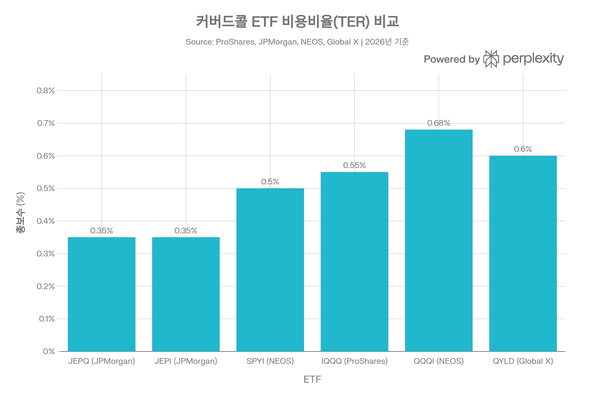
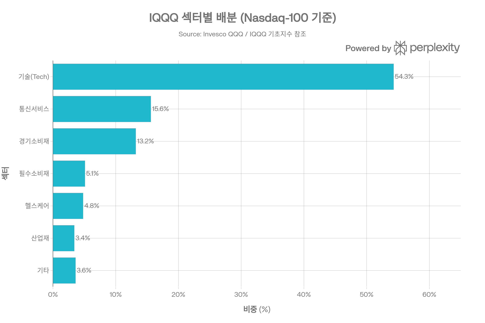
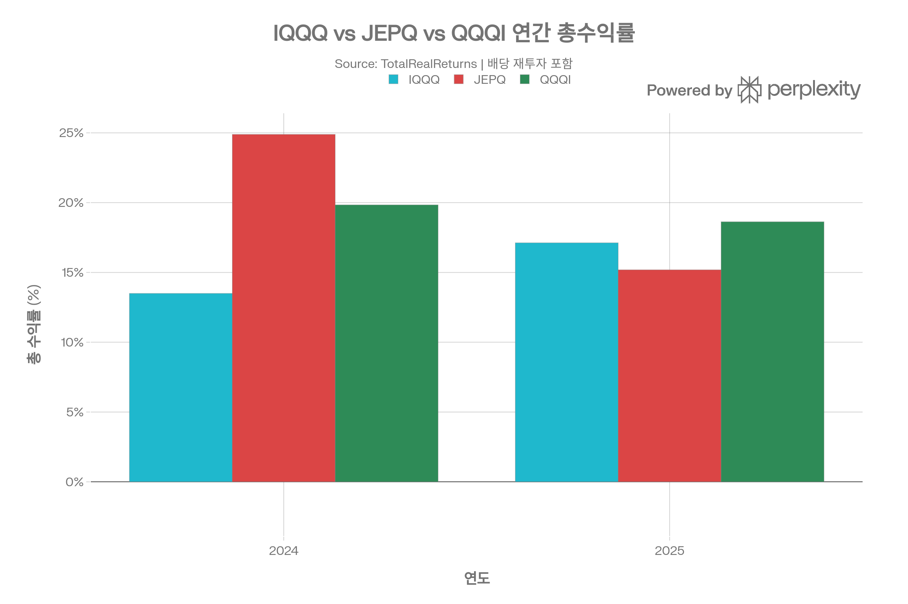
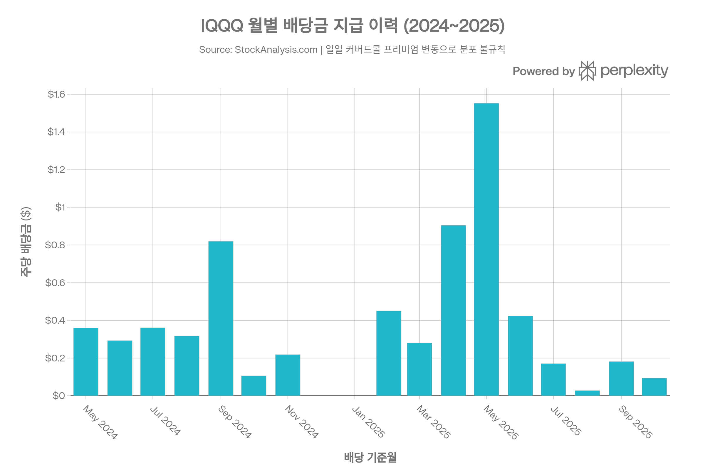

## 요약

> **작성 기준일:** 2026년 5월 2일 | **데이터 출처:** ProShares 공식 사이트, StockAnalysis, Morningstar, TradingView 등

***
## ETF 분류

| 항목 | 내용 |
|------|------|
| **최종 폴더** | `ETF/Dividend Income/Option Income/Nasdaq-100/IQQQ` |
| **대분류** | 배당·인컴 |
| **하위 분류** | Option Income / Nasdaq-100 |
| **핵심 전략** | Nasdaq-100 일일 커버드콜 인덱스 추종 |
| **운용 방식** | 패시브, 일일 커버드콜 지수 추종 |
| **레버리지·인버스 여부** | 아니오 |
| **옵션 인컴 전략 여부** | 예 |

IQQQ는 Nasdaq-100 노출을 활용하지만 핵심 목적은 대표지수 단순 추종이 아니라 **일일 커버드콜 전략을 통한 옵션 프리미엄 인컴 창출**입니다. ETF 분류 기준상 옵션 인컴 구조는 대표지수보다 우선하므로 `Dividend Income/Option Income/Nasdaq-100`으로 분류합니다.

***
## 1. 기본 정보
| 항목 | 내용 |
|------|------|
| 티커 | IQQQ |
| 전체명 | ProShares Nasdaq-100 High Income ETF |
| 운용사 | ProShares (ProShare Advisors LLC) |
| 상장거래소 | NASDAQ |
| CUSIP | 74347G234 |
| 설정일 | 2024년 3월 18일 |
| 운용기간 | 약 2년 (2026년 5월 기준) |
| 순자산(AUM) | 약 $3억 8,154만 (≈ 약 5,300억 원) |
| 운용 전략 | 패시브 (일일 커버드콜 인덱스 추종) |
| 추종 지수 | Nasdaq-100 Daily Covered Call Index |
| 총 종목 수 | 101개 |

ProShares Nasdaq-100 High Income ETF(IQQQ)는 2024년 3월 18일 상장된 비교적 신생 ETF로, 나스닥 100 지수의 일일 커버드콜 전략을 추종하며 높은 분배 수익률과 장기 총수익률을 동시에 추구합니다. 순자산(AUM)은 약 $3억 8,154만 수준이며, ProShares의 High Income ETF 제품군이 누적 10억 달러를 돌파한 시리즈 중 하나입니다.[1][2]

***
## 2. 추종 지수 및 전략 구조
### 추종 지수: Nasdaq-100 Daily Covered Call Index
IQQQ가 추종하는 **Nasdaq-100 Daily Covered Call Index**는 나스닥 100 지수의 롱 포지션에 만기 1일짜리(0DTE, Zero Days to Expiration) 콜옵션 매도를 결합한 전략을 복제하도록 설계되어 있습니다. 매일 만기가 되는 콜옵션(0DTE)을 반복 매도함으로써 옵션 프리미엄을 극대화하고, 동시에 야간(오버나이트) 시장 상승에도 100% 롱 포지션을 유지합니다.[3][4]

월별 만기 옵션을 사용하는 전통적 커버드콜 ETF(QYLD 등)와 달리, 일일 커버드콜 전략은 다음과 같은 구조적 장점을 가집니다:[5]
- 매일 시가 기준으로 옵션 행사가격을 재설정하여 더 많은 시장 상승 참여
- 야간 보유 포지션에 단기 옵션 리스크가 없음
- 하루 단위 프리미엄 수익 누적으로 더 높은 분배율 가능

실제로 펀드는 스왑 계약(Goldman Sachs International, BNP Paribas)과 E-Mini 선물을 통해 지수 노출을 구현하며, 개별 옵션을 직접 거래하지 않습니다. 2026년 4월 말 기준 옵션 행사가격은 27,540(나스닥 100 지수 기준), 만기일 2026년 4월 30일, 행사가 대비 시장가격(Moneyness)은 101.3%입니다.[1]
### 최소 배당 수익률 보장 조항
2026년 1월부터 펀드 배당은 **연 6% 최소 수익률**을 보장하도록 정책이 변경되었습니다. 콜옵션 프리미엄 수입이 부족할 경우 자본 환급(Return of Capital) 형태로도 분배를 지급하므로, 월별 배당금이 크게 변동할 수 있습니다.[1][2]

***
## 3. 비용 구조
### 총 보수(TER)

| 항목 | 내용 |
|------|------|
| 총 보수율(TER) | **0.55%** (연간) |
| 최초 판매 수수료 | 없음 |
| 환매 수수료 | 없음 |
| 30일 중간 호가 스프레드 | **0.16%** |

IQQQ의 총보수율은 0.55%로, 동일 전략 경쟁 ETF인 JEPQ(0.35%), JEPI(0.35%)보다 높고, QQQI(0.68%)보다는 낮은 수준입니다. QYLD는 0.60%로 IQQQ(0.55%)보다 소폭 높습니다.[1][6][7][8]
### 경쟁 ETF 비용 비교
| ETF | 운용사 | 전략 | 비용률 | 배당수익률 |
|-----|--------|------|--------|----------|
| JEPQ | JPMorgan | 나스닥 100 ELN 커버드콜 | 0.35% | ~10.5% |
| JEPI | JPMorgan | S&P 500 ELN 커버드콜 | 0.35% | ~7-9% |
| SPYI | NEOS | S&P 500 적극적 커버드콜 | 0.50% | ~5-7% |
| **IQQQ** | **ProShares** | **나스닥 100 일일 커버드콜** | **0.55%** | **~8.77%** |
| QYLD | Global X | 나스닥 100 ATM 커버드콜 | 0.60% | ~11-13% |
| QQQI | NEOS | 나스닥 100 세금효율 커버드콜 | 0.68% | ~14% |

포트폴리오 회전율(Turnover Ratio)은 일일 커버드콜 전략 특성상 높은 편이나 공식 수치는 미공개입니다. 거래 비용 측면에서 30일 중간 호가 스프레드는 0.16%로, 유동성이 다소 제한적임을 반영합니다.[1]

***
## 4. 유동성 평가
| 항목 | 내용 |
|------|------|
| 일평균 거래량 (3개월) | 약 63,990~68,260주[9] |
| AUM | 약 $3.81억 |
| 30일 중간 호가 스프레드 | 0.16%[1] |
| 상장주식수 | 약 820만 주[3] |

일평균 거래량은 약 6~7만 주 수준으로, AUM 대비 거래량이 제한적입니다. 경쟁 ETF인 JEPQ(AUM $37.2B)와 비교하면 유동성이 현저히 낮아, 대규모 투자 시 거래 비용(스프레드)이 수익률에 미치는 영향을 반드시 고려해야 합니다. 호가 스프레드 0.16%는 QQQ(0.01% 미만)나 JEPQ 대비 높은 수준입니다.[9][7]

***
## 5. 포트폴리오 구성
### 상위 10대 보유 종목 (2026년 4월 29일 기준)
| 순위 | 종목명 | 티커 | 비중 |
|------|--------|------|------|
| 1 | NVIDIA Corp | NVDA | 7.71% |
| 2 | Apple Inc | AAPL | 6.01% |
| 3 | Microsoft Corp | MSFT | 4.78% |
| 4 | Amazon.com Inc | AMZN | 4.28% |
| 5 | Alphabet (Class A) | GOOGL | 3.09% |
| 6 | Meta Platforms | META | 2.99% |
| 7 | Broadcom Inc | AVGO | 2.92% |
| 8 | Alphabet (Class C) | GOOG | 2.86% |
| 9 | Tesla Inc | TSLA | 2.82% |
| 10 | Walmart Inc | WMT | 2.62% |

상위 10대 종목의 합산 비중은 약 38~48%로, 나스닥 100 지수의 편중 특성을 그대로 반영합니다. 특히 NVIDIA, Apple, Microsoft의 3대 종목이 전체 포트폴리오의 약 18%를 차지합니다.[10][1]
### 섹터별 배분 (Nasdaq-100 지수 기준)

IQQQ는 나스닥 100 지수를 기초로 하므로 **기술 섹터 비중이 약 54%**로 가장 높고, 통신 서비스(15.6%), 경기소비재(13.2%)가 뒤를 잇습니다. 금융, 에너지, 부동산 섹터 편입은 없거나 미미합니다. 이 구조는 높은 기술주 집중 리스크를 수반합니다.[11]
### 국가별 분산 및 리밸런싱
- 미국 주식 비중 약 92.85%, 비미국 주식 3.60%[12]
- 나스닥 100 지수는 분기 리밸런싱, 연간 재구성이 원칙[13]
- IQQQ는 스왑 계약 비중(Goldman Sachs 85.44%, BNP Paribas 14.45%)과 E-Mini 선물(14.75%)로 노출을 구현[1]

***
## 6. 성과 분석
### 기간별 수익률 (2026년 3월 31일 기준, NAV 기준)

| 기간 | IQQQ NAV | IQQQ 시장가 | 추종 지수 |
|------|----------|------------|---------|
| 1개월 | -5.09% | -4.90% | -5.02% |
| 3개월 | -5.41% | -5.37% | -5.24% |
| 6개월 | -3.38% | -3.13% | -3.05% |
| YTD | -5.41% | -5.37% | -5.24% |
| 1년 | +19.31% | +19.61% | +19.97% |
| 설정 이후 누적 | +12.57% | +12.68% | +13.36% |

1년 총수익률(배당 포함)은 약 19.24~19.61%로 양호한 성과를 보였으나, 설정 이후 누적으로는 추종 지수(13.36%) 대비 약 0.79%p 뒤처져 있습니다. 이는 비용(0.55%)과 스왑 구조에서 발생하는 추적 차이에 기인합니다.[1][14]
### 연간 총수익률 비교 (배당 재투자 기준)
| 연도 | IQQQ | JEPQ | QQQI |
|------|------|------|------|
| 2024 | +13.50% | +24.89% | +19.84% |
| 2025 | +17.12% | +15.19% | +18.63% |
| 2026 YTD | -2.37% | -1.05% | -2.14% |

2024년에는 경쟁 ETF(JEPQ, QQQI) 대비 저조한 성과를 보였으나, 2025년에는 JEPQ를 소폭 상회하며 경쟁력을 회복했습니다.[15]
### 위험 조정 성과 지표
| 지표 | 값 |
|------|---|
| 샤프 지수(Sharpe Ratio) | ~0.55~0.90 (기간별 상이)[16] |
| 베타 | 1.11~1.12[17][9] |
| SPY와의 상관계수 | 0.90[17] |
| 52주 최저/최고 | $36.03 / $47.01[18] |
| 최대 낙폭(Max Drawdown) | -13.82% (최악 3개월 기준)[19] |
| 변동성(연간 표준편차) | 약 20%[20] |

베타 1.11은 나스닥 100 기반 ETF 특성상 시장 대비 다소 높은 변동성을 의미하며, 커버드콜 전략임에도 불구하고 하락장에서 완충 효과가 일반 커버드콜 ETF보다 약할 수 있습니다.[17]

***
## 7. 배당 정보
### 배당 개요

| 항목 | 내용 |
|------|------|
| 배당 주기 | 월배당 (매월) |
| 12개월 분배율 | **8.77%** (2026년 3월 기준)[1] |
| TTM 배당금 | 주당 $4.69[14] |
| SEC 30일 수익률 | 0.23%[1] |
| 최소 수익률 정책 | 연 6% (2026년 1월 시행)[1] |
### 월별 배당금 이력 (2024~2025)
| 배당 기준일 | 주당 배당금 | 지급일 |
|-----------|-----------|------|
| 2025-10-01 | $0.09293 | 2025-10-07 |
| 2025-09-02 | $0.18064 | 2025-09-08 |
| 2025-08-01 | $0.02746 | 2025-08-07 |
| 2025-07-01 | $0.16986 | 2025-07-08 |
| 2025-06-02 | $0.42326 | 2025-06-06 |
| 2025-05-01 | **$1.55182** | 2025-05-07 |
| 2025-04-01 | $0.90412 | 2025-04-07 |
| 2025-02-02 | $0.45042 | 2025-02-10 |
| 2024-09-03 | $0.81919 | 2024-09-10 |
| 2024-05-01 | $0.35852 | 2024-05-08 |

배당금 변동성이 매우 크다는 점이 IQQQ의 주요 단점 중 하나입니다. 2025년 5월에는 주당 $1.55로 역대 최고치를 기록한 반면, 2025년 8월에는 $0.027에 불과했습니다. 이는 일일 콜옵션 프리미엄이 시장 변동성에 직접적으로 연동되기 때문입니다. 분배금의 일부는 자본 환급(Return of Capital) 성격일 수 있어, 세전 분배율(12개월 8.77%)과 실질 수익 창출 능력 간의 차이를 이해하는 것이 중요합니다.[1][21]

***
## 8. 추종 성과 지표 (Tracking)
### 추적 오차 및 추적 차이
| 항목 | 내용 |
|------|------|
| 추적 차이 (1년, NAV vs Index) | 약 -0.66%p (설정 이후: -0.79%p)[1] |
| NAV 대비 프리미엄/디스카운트 | 약 +0.08% (소폭 프리미엄)[22] |
| 30일 중간 호가 스프레드 | 0.16%[1] |

IQQQ의 추적 차이(Tracking Difference)는 1년 기준 약 -0.66%p로, 펀드 수익률이 지수 대비 소폭 뒤처집니다. 이는 0.55%의 운용 비용과 스왑 계약의 거래 비용에서 비롯됩니다. NAV 대비 시장가격 괴리율은 통상 0.1% 이내로 좁은 편이나, 일평균 거래량이 적은 구조상 괴리율이 벌어질 수 있습니다.[1][22]

***
## 9. 리스크 요소
### 주요 리스크 요약
| 리스크 유형 | 내용 |
|-----------|------|
| 베타 (시장 민감도) | 1.11~1.12 — 시장 대비 소폭 고변동성[17] |
| 섹터 집중도 리스크 | 기술 섹터 54%, 소수 대형주 집중[11] |
| 배당 변동성 리스크 | 월별 분배금 최대 50배 이상 편차[21] |
| 유동성 리스크 | 일 거래량 6~7만주, 호가 스프레드 0.16%[1] |
| 상방 제한 리스크 | 일일 콜옵션 매도로 시장 급등 시 수익 제한[3] |
| 자본 환급 리스크 | 분배금 일부가 원금 환급 형태 가능[1] |
| 운용 역사 리스크 | 2년 미만 운용 — 약세장 검증 미흡[6] |

**섹터 집중도 리스크:** 포트폴리오 약 54%가 기술 섹터에 집중되어 있으며, AI 반도체 사이클 둔화, 대형 기술주 규제 이슈 등에 취약합니다. NVIDIA, Apple, Microsoft 3종목만으로 전체의 약 18%를 차지하는 점도 집중 리스크를 심화시킵니다.[1][11]

**커버드콜 구조적 한계:** 0DTE(만기 당일) 콜옵션 매도는 일중 상승폭은 제한하면서 하락에는 완전히 노출되는 구조입니다. 변동성(VIX)이 낮아지면 프리미엄 수입이 급감해 배당금이 크게 줄어들 수 있습니다.[4]

**SPY 상관계수 0.90:** 다른 자산군과의 분산 효과가 제한적입니다. 하락장에서 커버드콜이 제공하는 완충은 매우 제한적이며, 나스닥 100 하락 시 IQQQ도 유사하게 하락합니다.[17]

**운용 기간 미흡:** 2022년과 같은 본격적인 기술주 약세장을 경험하지 않아, 장기 리스크 관리 능력의 검증이 부족합니다. JEPQ는 2022년 약세장에서 약 -20% 최대 낙폭을 기록했으나, IQQQ는 유사한 환경에서의 실제 실적이 없습니다.[6]

***
## 10. 경쟁 ETF 종합 비교
| 항목 | IQQQ | JEPQ | QQQI | QYLD |
|------|------|------|------|------|
| 운용사 | ProShares | JPMorgan | NEOS | Global X |
| 전략 | 일일 커버드콜 (패시브) | 월별 OTM 커버드콜 (액티브) | 세금효율 커버드콜 | ATM 월별 커버드콜 |
| 설정일 | 2024-03-18 | 2022-05-03 | 2024-01-17 | 2013-12-11 |
| AUM | ~$3.8억 | ~$372억 | 大 | ~$83억 |
| 비용률 | 0.55% | 0.35% | 0.68% | 0.60% |
| 12개월 배당률 | ~8.77% | ~10.5% | ~14% | ~12% |
| 2024 총수익률 | 13.50% | 24.89% | 19.84% | — |
| 2025 총수익률 | 17.12% | 15.19% | 18.63% | — |
| 상방 제한 | 중간 (일일 재설정) | 낮음 (OTM) | 낮음 | 높음 (ATM) |
| 약세장 검증 | ✗ | ✓ (2022) | ✗ | ✓ |

***
## 11. 투자 요약 및 주요 고려사항
IQQQ는 나스닥 100의 성장성을 추구하면서 일일 커버드콜 프리미엄으로 월배당 수입을 창출하는 독특한 구조의 ETF입니다. 2025년 수익률 17.12%는 경쟁 JEPQ(15.19%)를 상회했으나, 2024년에는 상당히 저조한 성과를 기록했습니다. 배당금의 극심한 변동성(월 $0.03~$1.55)과 0.55%의 비교적 높은 비용률, 그리고 2년 미만의 짧은 운용 이력은 주요 단점으로 꼽힙니다.[1][3][21][15][6]

**적합한 투자자 프로파일:**
- 나스닥 100 성장성에 노출을 유지하면서 월 현금 흐름을 원하는 투자자
- 배당금의 변동성을 감수할 수 있는 중위험 성향 투자자
- 기존 나스닥 ETF(QQQ 등) 대비 분배율을 높이고 싶은 투자자

**주의가 필요한 경우:**
- 안정적인 고정 배당 소득을 목표로 하는 투자자
- 커버드콜의 상방 제한에 민감한 장기 성장 투자자
- 대규모 자금 집행 시(유동성 제약 고려 필요)
