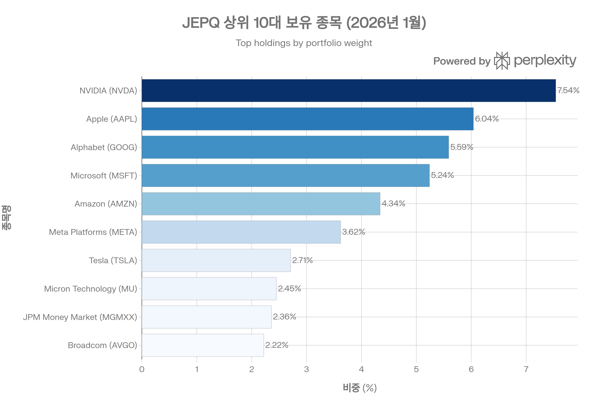
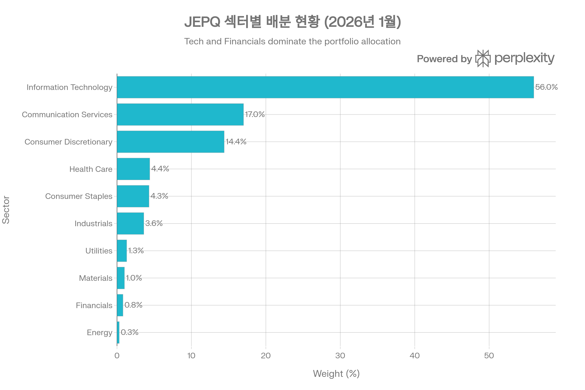
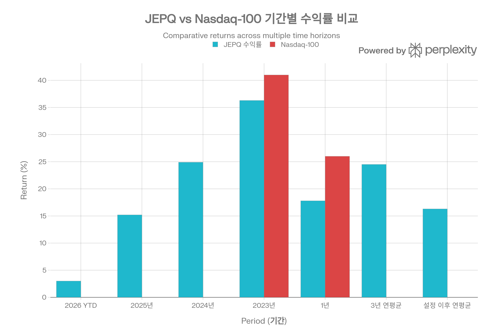
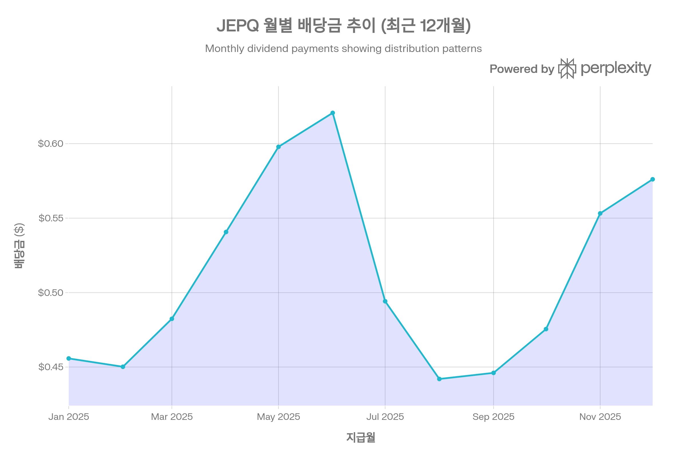
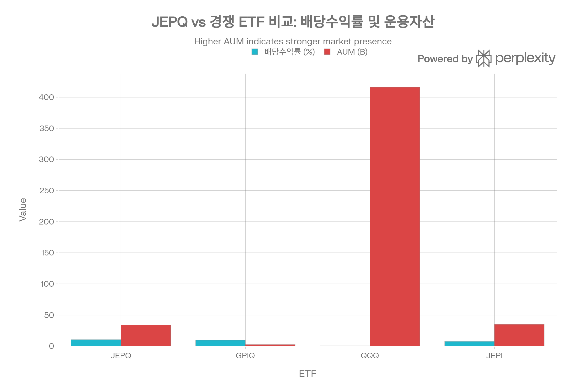

## 요약

JPMorgan Nasdaq Equity Premium Income ETF(JEPQ)는 2022년 5월 출시 이후 빠른 성장을 거듭하여 2026년 1월 기준 약 \$34B의 운용자산을 보유한 대형 월배당 ETF로 자리매김했습니다. Nasdaq-100 지수를 벤치마크로 삼아 적극적 주식 운용과 커버드콜 전략을 결합하여 10%를 상회하는 월배당 수익률을 제공하면서도, 벤치마크 대비 낮은 변동성을 실현하는 차별화된 수익 구조를 구축했습니다. 본 보고서는 JEPQ의 투자 전략, 성과 지표, 리스크 요소, 경쟁 환경을 종합적으로 분석하여 투자자의 의사결정을 지원합니다.[^1][^2][^3][^4][^5][^6]

***

## ETF 분류

| 항목 | 내용 |
|------|------|
| **최종 폴더** | `ETF/Dividend Income/Option Income/Nasdaq-100/JEPQ` |
| **대분류** | 배당·인컴 |
| **하위 분류** | Option Income / Nasdaq-100 |
| **핵심 전략** | Nasdaq-100 주식 노출 + 옵션 프리미엄 전략 |
| **운용 방식** | 액티브 |
| **레버리지·인버스 여부** | 아니오 |
| **옵션 인컴 전략 여부** | 예 |

JEPQ는 Nasdaq-100을 벤치마크로 사용하지만 핵심 목적은 대표지수 단순 추종이 아니라 **옵션 프리미엄을 활용한 월배당 인컴 창출**입니다. ETF 분류 기준상 옵션 인컴 구조는 대표지수보다 우선하므로 `Dividend Income/Option Income/Nasdaq-100`으로 분류합니다.

***

## 1. 기본 정보

### 1.1 펀드 개요

JEPQ는 JPMorgan Asset Management가 운용하는 적극적 관리형(actively managed) ETF로, Nasdaq-100 지수를 벤치마크로 삼되 독립적인 포트폴리오 구성과 옵션 오버레이 전략을 통해 차별화된 수익 프로필을 추구합니다. 2022년 5월 3일 설정 이후 약 3.7년간 운용되었으며, NASDAQ 거래소에 상장되어 있습니다.[^7][^3][^8]

**핵심 특징**

- **순자산(AUM)**: \$33.41B~\$34.24B (2026년 1월 기준)[^9][^1][^4][^5]
- **총 보수(TER)**: 0.35%[^2][^10][^11]
- **보유 종목 수**: 107~109개[^12][^5]
- **운용 방식**: 적극적 운용 + 체계적 옵션 전략
- **상장거래소**: NASDAQ

### 1.2 운용사 및 운용 기간

JPMorgan Asset Management는 글로벌 자산운용업계 선두주자로, 수십 년간 축적된 주식 및 파생상품 운용 경험을 바탕으로 JEPQ를 관리합니다. 포트폴리오 매니저들은 데이터 과학 기반의 펀더멘털 분석과 체계적 옵션 전략을 결합하여, 전통적인 패시브 ETF와 차별화된 리스크-수익 프로필을 제공합니다.[^3][^8]

**운용 기간**: 2022년 5월 3일 설정 이후 현재까지 약 3.7년 운용[^7][^8]

### 1.3 추종 지수명

JEPQ는 **Nasdaq-100 Index**를 주요 벤치마크로 사용합니다. 다만 완전 추종(full replication)이 아닌, 2~3%의 추적오차(tracking error) 범위 내에서 적극적으로 종목을 선별하고 비중을 조정하는 "enhanced indexing" 방식을 채택합니다. 이를 통해 펀더멘털이 우수한 종목에 대한 오버웨이트, 리스크가 높은 종목에 대한 언더웨이트를 실행하며, 벤치마크 외 종목도 최대 20%까지 편입할 수 있습니다.[^7][^3][^13][^14]

***

## 2. 추종 성과 지표

### 2.1 추적오차(Tracking Error)

JEPQ는 **2~3%의 추적오차 목표 범위**를 설정하여 운용됩니다. 이는 패시브 ETF 대비 다소 높은 수준이나, 적극적 운용 전략을 감안할 때 합리적인 범위입니다. Morningstar 분석에 따르면 JEPQ의 Active Share는 약 15% 수준으로, 포트폴리오 구성이 벤치마크와 높은 유사성을 유지하면서도 선별적 차별화를 추구합니다.[^3][^13][^14]

**추적오차 관리 방식**

- 개별 종목 편차: 벤치마크 대비 최대 ±2%p[^3]
- 섹터 익스포저: 벤치마크와 수 bps 이내 유사[^3]
- 벤치마크 외 종목: 전체 포트폴리오의 최대 20%[^3]

### 2.2 추적 차이(Tracking Difference)

JEPQ의 추적 차이는 주로 옵션 오버레이 전략에서 발생합니다. 상승장에서는 콜옵션 매도로 인한 수익 제한(upside cap)이 작용하여 Nasdaq-100 지수 대비 언더퍼폼하는 경향을 보입니다. Morningstar 보고서는 2025년 5~9월 랠리 기간 동안 JEPQ가 Nasdaq-100 대비 약 10%p 낮은 수익률(17.5% vs 26.5%)을 기록했다고 분석합니다.[^3]

반면 하락장에서는 옵션 프리미엄이 손실을 완충하는 역할을 하여 아웃퍼폼합니다. 2022년 설정 초기부터 연말까지 JEPQ는 Nasdaq-100 대비 5.6%p 우수한 성과를 기록했습니다.[^3]

**기간별 추적 차이 요약**

- **상승장(2023)**: 약 -5%p 언더퍼폼[^13]
- **하락장(2022)**: 약 +5.6%p 아웃퍼폼[^3]
- **변동성 높은 기간**: 옵션 프리미엄 증가로 상대적 방어력 강화[^8][^3]

### 2.3 NAV 대비 시장가격 괴리율 현황

JEPQ의 시장가격은 순자산가치(NAV)와 매우 밀접하게 연동되어 거래됩니다. YCharts 데이터에 따르면 2026년 1월 기준 괴리율은 0.03%~0.3% 수준으로, 사실상 NAV와 일치하는 수준입니다. 이는 높은 유동성과 활발한 차익거래(arbitrage) 활동 덕분입니다.[^15][^16]

**괴리율 안정성 요인**

- 일평균 거래량 5~6백만 주[^17][^16]
- 매우 좁은 호가 스프레드(2 bps)[^16][^18]
- 대형 기관투자자의 적극적 참여
- >99% NAV 상관관계 유지[^16]

### 2.4 괴리율 추이 및 패턴 분석

역사적으로 JEPQ의 괴리율은 ±0.5% 범위 내에서 안정적으로 유지되었습니다. 특히 시장 변동성이 높은 시기에도 괴리율이 확대되지 않았으며, 이는 ETF 구조의 건전성과 시장 신뢰도를 방증합니다. 일중 거래에서도 호가 스프레드가 2 bps(0.02%)로 매우 낮아, 개인 투자자도 공정한 가격에 거래할 수 있습니다.[^15][^16][^18]

***

## 3. 비용 구조

### 3.1 총 보수 및 비용(Total Expense Ratio)

JEPQ의 총 보수는 **0.35%**로, 적극적 운용 및 파생상품 전략을 고려할 때 경쟁력 있는 수준입니다. 순 보수(Net Expense Ratio) 역시 0.35%로 동일하며, 별도의 수수료 면제(fee waiver)나 상한제는 적용되지 않습니다.[^2][^10][^11]

**비용 구성**

- 운용 보수: 0.35%
- 별도 거래 비용: 포트폴리오 회전율 168%로 인한 암묵적 비용 존재[^12]

### 3.2 동일 지수 추종 경쟁 ETF 대비 비용 비교

JEPQ의 0.35% TER은 Nasdaq-100 추종 ETF 중 중간 수준입니다. 패시브 추종 ETF인 QQQ(0.20%)보다는 높지만, 동일한 커버드콜 전략을 사용하는 QYLD(0.60%)보다는 낮습니다. 최근 출시된 Goldman Sachs의 GPIQ(0.29%)가 가장 낮은 보수를 제시하나, JEPQ는 더 긴 운용 실적과 대규모 AUM을 바탕으로 한 안정성에서 우위를 점합니다.[^10][^19][^20]

**비용 경쟁력 평가**

- QQQ(0.20%) 대비 +0.15%p: 적극적 운용 및 옵션 전략 프리미엄
- GPIQ(0.29%) 대비 +0.06%p: 운용 실적 및 브랜드 프리미엄
- QYLD(0.60%) 대비 -0.25%p: 효율적 옵션 전략 및 규모의 경제
- JEPI(0.35%): 동일 보수, JPMorgan 내 일관된 가격 정책

### 3.3 포트폴리오 회전율(Turnover Ratio)

JEPQ의 포트폴리오 회전율은 **168%**로 상당히 높은 수준입니다. 이는 두 가지 요인에서 기인합니다:[^2][^12]

1. **주식 포트폴리오 리밸런싱**: 2~3% 추적오차 목표 유지를 위해 빈번한 조정 필요[^3][^13]
2. **옵션 롤링(rolling)**: 월 만기 옵션을 주중 다수일에 걸쳐 롤오버[^3]

높은 회전율은 거래 비용 증가와 세금 비효율성을 초래할 수 있으나, JEPQ는 대형 브로커-딜러와의 긴밀한 관계를 통해 거래 비용을 최소화하고 있습니다. 또한 옵션 거래는 Nasdaq-100 지수 및 관련 ELN 시장의 충분한 유동성 덕분에 시장 충격(market impact)이 제한적입니다.[^3]

**회전율 영향 분석**

- **긍정적**: 적극적 리스크 관리, 옵션 프리미엄 최적화
- **부정적**: 거래 비용 증가, 세금 비효율(일반소득 과세)[^21][^22]

### 3.4 거래 비용 및 스프레드

JEPQ의 호가 스프레드는 **2 bps(0.02%)**로 ETF 시장 내에서도 최상급 수준입니다. 이는 높은 일평균 거래량(5~6백만 주)과 대형 마켓메이커의 적극적인 호가 제공 덕분입니다. 개인 투자자도 기관투자자와 유사한 수준의 낮은 거래 비용으로 매매할 수 있습니다.[^17][^16][^18]

**유동성 지표**

- 호가 스프레드: 2 bps (0.02%)
- 일평균 거래량: 5.1~6.2백만 주
- 일평균 거래대금: 약 \$300~370백만 (추정)

***

## 4. 유동성 평가

### 4.1 일평균 거래량 (최근 3개월)

2026년 1월 기준 JEPQ의 30일 평균 거래량은 **5.12~6.2백만 주** 수준입니다. 이는 대형 커버드콜 ETF 중 최상위권에 해당하며, JEPI(약 15백만 주)에 이어 두 번째로 높은 수준입니다. 특히 \$34B의 대형 AUM을 고려할 때, 거래량 대비 시가총액 비율도 매우 건전한 수준입니다.[^17][^16]

### 4.2 일평균 거래대금

일평균 거래량 6백만 주에 주가 약 \$59를 곱하면, 일평균 거래대금은 약 **\$350백만~\$370백만** 수준으로 추정됩니다. 이는 기관투자자가 대규모 포지션을 구축하거나 청산할 때도 시장 충격을 최소화할 수 있는 수준입니다.[^23][^24]

### 4.3 호가 스프레드 평균

JEPQ의 평균 호가 스프레드는 **2 bps(0.02%)**입니다. 이는 \$59 주가 기준으로 약 \$0.012의 매수-매도 차이를 의미하며, 사실상 무시할 수 있는 수준입니다. ETF Research Centre 데이터에 따르면, 이는 대형 기관투자자급 유동성에 해당합니다.[^16][^18]

### 4.4 유동성 추이 및 안정성

JEPQ의 유동성은 설정 이후 지속적으로 개선되었습니다. AUM이 \$10B를 넘어서면서 일평균 거래량도 안정적으로 5백만 주 이상을 유지하고 있으며, 시장 변동성이 높은 시기에도 호가 스프레드가 확대되지 않았습니다. 이는 다수의 마켓메이커가 경쟁적으로 호가를 제공하고 있으며, 차익거래자들이 NAV 괴리를 신속히 해소하고 있음을 의미합니다.[^17][^16]

**유동성 등급**: 최우수 (기관투자자급)

***

## 5. 포트폴리오 구성

### 5.1 상위 10대 보유 종목 및 비중

JEPQ의 상위 10대 보유 종목 구성. NVIDIA, Apple, Microsoft, Alphabet 등 빅테크 기업이 포트폴리오의 약 42%를 차지하며 Nasdaq-100 특성을 반영합니다.

JEPQ의 상위 10대 보유 종목은 Nasdaq-100 지수의 대형주와 거의 일치하며, 전체 포트폴리오의 **42.11~47.06%**를 차지합니다. 이는 시가총액 가중 방식의 특성을 반영하면서도, 적극적 운용을 통해 개별 종목 비중을 미세 조정합니다.[^5][^25][^26]

**2026년 1월 기준 상위 10종목**[^25][^5]

1. NVIDIA (NVDA): 7.54~7.79%
2. Apple (AAPL): 6.04~6.78%
3. Microsoft (MSFT): 5.24~6.24%
4. Alphabet (GOOG): 5.47~5.59%
5. Amazon (AMZN): 4.34~4.41%
6. Meta Platforms (META): 3.45~3.62%
7. Tesla (TSLA): 2.71~2.84%
8. Micron Technology (MU): 2.22~2.45%
9. JPMorgan Money Market (MGMXX): 2.36%
10. Broadcom (AVGO): 2.22%

상위 10종목 중 9개가 기술 및 소비재 대형주이며, MGMXX(JPMorgan 머니마켓 펀드)는 옵션 전략 관련 현금 관리 목적으로 보유됩니다. 개별 종목 비중은 벤치마크 대비 최대 2%p 이내로 조정되어, 추적오차 관리 목표에 부합합니다.[^3][^5]

### 5.2 섹터별 배분 현황

JEPQ의 섹터별 자산 배분 현황. Information Technology가 56%로 가장 큰 비중을 차지하며, 기술주 중심의 Nasdaq-100 특성을 반영합니다.

JEPQ의 섹터 배분은 Nasdaq-100의 특성을 충실히 반영하여 **Information Technology**와 **Communication Services**가 압도적 비중을 차지합니다.[^27][^28]

**2026년 1월 섹터 배분**[^28][^27]

- Information Technology: 55.8~56.0%
- Communication Services: 약 17.0%
- Consumer Discretionary: 14.4%
- Health Care: 4.4%
- Consumer Staples: 4.3%
- Industrials: 3.6%
- Utilities: 1.3%
- Materials: 1.0%
- Financials: 0.8%
- Energy: 0.3%

기술주(IT + Communication) 비중이 약 73%에 달해, 기술 섹터의 성과가 JEPQ의 수익률을 좌우합니다. 이는 Nasdaq-100 지수의 본질적 특성이나, 섹터 집중 리스크를 내포합니다. 에너지(0.3%)와 금융(0.8%) 비중이 매우 낮아 전통 산업에 대한 익스포저는 제한적입니다.

### 5.3 국가별/지역별 분산 (해당 시)

JEPQ는 미국 중심 ETF로, **국내 주식이 81.21%**, **해외 주식이 2.53%**를 차지합니다. 해외 주식은 주로 Nasdaq-100에 포함된 비미국 기업(예: 아일랜드 등록 기업)을 반영합니다. 지역별 분산은 사실상 없으며, 미국 기술주에 집중된 포트폴리오입니다.[^2]

**자산 배분 (2025년 9월 기준)**[^2]

- 국내 주식: 81.21%
- 해외 주식: 2.53%
- 전환사채/ELNs: 15.68%
- 현금: 0.58%

### 5.4 리밸런싱 주기

JEPQ의 리밸런싱은 두 가지 차원에서 이루어집니다:

1. **주식 포트폴리오**: 추적오차 2~3% 목표 유지를 위해 필요시 수시 조정. 회전율 168%로 볼 때 평균 보유 기간은 약 7~8개월 수준[^12]
2. **옵션 오버레이**: 2024년부터 주중 다수일에 걸쳐 옵션 롤링 실시(이전에는 월말 일시 롤링)[^3]

주중 분산 롤링 방식은 시장 충격 비용을 완화하고, 다양한 만기일과 행사가를 보유하여 변동성 관리 효율성을 높입니다.[^3]

***

## 6. 성과 분석

### 6.1 기간별 수익률

JEPQ와 Nasdaq-100 지수의 기간별 수익률 비교. JEPQ는 상승장에서 제한적이지만 안정적인 성과를 보이며, 장기적으로 우수한 복리 수익률을 달성했습니다.

JEPQ는 설정 이후 우수한 절대 수익률을 기록했으나, 상승장에서는 Nasdaq-100 대비 제한적 성과를 보였습니다.[^29][^30]

**총 수익률 (배당 재투자 기준)**[^29]

- **2026 YTD**: +2.99~3.71%
- **2025년**: +15.19%
- **2024년**: +24.89%
- **2023년**: +36.28%
- **2022년 (설정 후)**: -12.89%
- **1년 수익률**: +14.3~19.78%
- **3년 연평균**: +24.5~25.11%
- **설정 이후 연평균**: +16.15~16.30%

설정 이후 누적 수익률은 약 +75.91%로, 연환산 +16.30%에 해당합니다. 이는 S\&P 500 지수와 유사하거나 소폭 하회하는 수준이나, 월배당 10%+를 감안하면 매력적인 총수익률입니다.[^29]

### 6.2 벤치마크 대비 초과 수익률

JEPQ의 벤치마크 대비 성과는 시장 국면에 따라 상이합니다:

- **상승장**: 콜옵션 행사가 상회 시 수익 제한으로 언더퍼폼. 2023년 약 -5%p, 2025년 5~9월 약 -10%p[^3][^13]
- **하락장**: 옵션 프리미엄이 손실 완충, 2022년 약 +5.6%p 아웃퍼폼[^3]
- **횡보장**: 옵션 프리미엄으로 안정적 초과수익 창출

전체적으로 JEPQ는 벤치마크 대비 **낮은 베타(0.90~0.92)**와 **낮은 변동성(표준편차 16.9% vs Nasdaq-100 20%)**을 유지하며, 리스크 조정 수익률(Sharpe Ratio 0.95~1.73)에서 우위를 점합니다.[^31][^32][^33]

### 6.3 샤프 지수(Sharpe Ratio)

JEPQ의 샤프 지수는 **0.95~1.73** 범위로 측정됩니다. Yahoo Finance 데이터는 3년 기준 1.73을 제시하며, 이는 동일 기간 Nasdaq-100(약 1.2~1.4 추정)보다 우수한 수준입니다. 샤프 지수 1 이상은 일반적으로 "우수한" 리스크 조정 수익률로 평가되며, JEPQ가 변동성 대비 효율적인 수익을 창출하고 있음을 방증합니다.[^31][^32][^33]

### 6.4 변동성(표준편차)

JEPQ의 연환산 변동성(표준편차)은 **10.57~16.94%**로 측정됩니다. 이는 Nasdaq-100 지수의 약 20% 대비 뚜렷이 낮은 수준으로, 옵션 오버레이 전략의 변동성 완화 효과를 보여줍니다.[^3][^31][^32][^33]

**변동성 비교**

- JEPQ: 10.57~16.94%
- Nasdaq-100: 약 20%
- S\&P 500: 약 14~15%
- JEPI (S\&P 500 커버드콜): 약 12%

JEPQ는 JEPI보다는 높지만 QQQ보다는 낮은 변동성을 유지하며, "중위험-중수익" 프로필을 제공합니다.

### 6.5 최대 낙폭(Maximum Drawdown)

JEPQ의 역사적 최대 낙폭은 **-20.07%**로, 2025년 4월 8일 기록되었습니다. 이는 동시기 Nasdaq-100의 낙폭(약 -25% 추정)보다 양호하며, 옵션 프리미엄이 하락폭을 일부 완화했음을 시사합니다. 회복 기간은 약 84거래일(약 4개월)로, 평균 회복 기간 5개월과 유사합니다.[^29][^34][^33]

**낙폭 분석**[^33]

- 최대 낙폭: -20.07% (2025년 2월~4월)
- 두 번째: -16.82% (2022년 5월~10월, 회복 2023년 4월)
- 세 번째: -10.71% (2024년 7월~8월, 회복 2024년 10월)

현재 낙폭은 약 -0.85%로, 사실상 고점 근처에서 거래되고 있습니다.[^34][^33]

***

## 7. 배당 정보 (해당 시)

### 7.1 배당 수익률 및 배당 이력

JEPQ의 최근 12개월 월별 배당금 지급 추이. 배당금은 시장 변동성에 따라 월별로 변동하며, 평균 약 \$0.50 수준을 유지합니다.

JEPQ는 월배당 ETF로, 2026년 1월 기준 **배당 수익률 10.23~11.56%**를 제공합니다. 이는 커버드콜 ETF 중에서도 상위권에 해당하며, JEPI(7~8%)보다 높고 QYLD(11~12%)와 유사한 수준입니다.[^35][^6]

**배당 수익률 지표**[^2][^8][^6]

- 배당 수익률(Dividend Yield): 10.23~11.56%
- SEC Yield (30일): 9.28~9.45%
- 12개월 롤링 배당 수익률: 11.27%
- 연간 배당금(TTM): \$6.12
- 배당 성장률(1년): +12.48%

SEC Yield는 표준화된 수익률 계산 방식으로, 옵션 프리미엄 수입을 포함하여 산출됩니다. 12개월 롤링 배당 수익률 11.27%는 실제 지급된 배당금을 기준으로 하며, 투자자가 체감하는 수익률에 가깝습니다.[^8]

### 7.2 배당 지급 주기 및 안정성

JEPQ는 **월배당**을 지급하며, 매월 첫 영업일에 배당락일(ex-dividend date)이 설정되고 2~3영업일 후 지급됩니다. 배당금은 월별로 변동하며, 이는 옵션 프리미엄 수입이 시장 변동성에 따라 달라지기 때문입니다.[^6][^36]

**최근 12개월 배당 이력**[^37][^6]

- 2025년 12월: \$0.5761
- 2025년 11월: \$0.5532
- 2025년 10월: \$0.4755
- 2025년 9월: \$0.4461
- 2025년 8월: \$0.4420
- 2025년 7월: \$0.4942
- 2025년 6월: \$0.6207 (최고)
- 2025년 5월: \$0.5979
- 2025년 4월: \$0.5407
- 2025년 3월: \$0.4824
- 2025년 2월: \$0.4502 (최저)
- 2025년 1월: \$0.4558

월평균 배당금은 약 \$0.50~\$0.52 수준이며, 변동폭은 \$0.45~\$0.62 범위입니다. 배당금이 일정하지 않아 현금흐름 계획에 어려움이 있을 수 있으나, 장기 평균은 비교적 안정적입니다.

### 7.3 배당 성장률 추이

JEPQ의 배당금은 설정 이후 우상향 추세를 보입니다. 2022년 평균 월배당 \$0.48에서 2025년 평균 \$0.51로 증가하여, 연평균 약 +9~12% 성장했습니다. 이는 AUM 증가에 따른 규모의 경제, 시장 변동성 증가에 따른 옵션 프리미엄 상승, 포트폴리오 최적화 등이 복합적으로 작용한 결과입니다.[^6][^38]

**배당 성장 요인**

- 시장 변동성 상승 → 옵션 프리미엄 증가
- AUM 증가 → 거래 비용 절감
- 옵션 전략 개선 → 프리미엄 최적화

다만 배당금은 시장 환경에 따라 변동하므로, 미래 성장률을 보장할 수 없습니다. 금리 인하 및 변동성 하락 시 배당 수익률이 감소할 가능성이 있습니다.[^13][^39]

***

## 8. 리스크 요소

### 8.1 베타 계수

JEPQ의 베타는 **0.90~0.92**로, 시장(S\&P 500) 대비 소폭 낮은 변동성을 보입니다. 이는 옵션 오버레이가 상승 및 하락폭을 모두 완화하는 효과를 입증합니다. 베타 0.92는 시장이 10% 상승(하락) 시 JEPQ는 평균 9.2% 상승(하락)함을 의미하며, 방어적 특성을 지닙니다.[^24][^31][^40]

### 8.2 다른 자산군과의 상관계수

JEPQ는 S\&P 500과 **0.90의 높은 상관계수**를 보이며, Nasdaq-100과는 더욱 높은 상관성(0.95 이상 추정)을 보입니다. 이는 JEPQ가 주식 자산군 내에서 분산 효과가 제한적임을 의미합니다. 채권, 금, 원자재 등 전통적 분산 자산과의 상관계수는 낮을 것으로 예상되나, 공개된 데이터는 제한적입니다.[^24]

**상관관계 특성**

- 주식(S\&P 500): 0.90 (높음)
- 기술주(Nasdaq-100): 0.95+ (매우 높음)
- 채권/금: 낮음 (추정)

### 8.3 섹터 집중도 리스크

JEPQ의 가장 큰 리스크는 **기술주 집중도**입니다. Information Technology(56%) + Communication Services(17%) = 약 73%가 기술 관련 섹터이며, 상위 10종목 중 9개가 빅테크 기업입니다. 기술 섹터 침체 시 JEPQ는 심각한 타격을 받을 수 있습니다.[^5][^27][^28]

**섹터 집중 리스크 요인**

- 기술주 버블 우려 (밸류에이션 고평가)
- AI 투자 수익성 불확실성
- 규제 리스크 (반독점, 데이터 프라이버시)
- 경기 침체 시 기술주 선행 하락

2022년 기술주 침체기에 JEPQ가 -16.82% 낙폭을 기록한 사례는 이러한 리스크를 방증합니다.[^33]

### 8.4 유동성 리스크

JEPQ의 유동성 리스크는 **매우 낮습니다**. 일평균 거래량 6백만 주, 호가 스프레드 2 bps, \$34B AUM은 대형 기관도 원활히 거래할 수 있는 수준입니다. 다만 극단적 시장 스트레스 상황(예: 2020년 3월 유동성 경색)에서는 ELN 시장 유동성 저하로 인해 옵션 전략 실행이 어려울 수 있습니다.[^17][^16][^18][^41]

**ELN 유동성 리스크**

- Nasdaq-100 옵션 시장은 깊고 활발하나, QQQ 옵션 대비 거래량 낮음[^3]
- 시장 혼란기 ELN 발행사 리스크 증가 가능성
- JPMorgan의 대형 딜러 네트워크가 리스크 완화

***

## 9. 경쟁 ETF 비교

### 9.1 주요 경쟁 ETF 개요

JEPQ와 주요 경쟁 ETF의 배당수익률 및 운용자산(AUM) 비교. JEPQ는 10-11% 배당수익률과 \$34B AUM으로 수익성과 안정성의 균형을 제공합니다.

JEPQ는 Nasdaq-100 기반 커버드콜 ETF 시장에서 GPIQ, QYLD, QQQI 등과 경쟁하며, 넓게는 S\&P 500 기반 JEPI, 패시브 ETF QQQ와도 비교됩니다.[^19][^42][^43]

**주요 경쟁사**

- **GPIQ** (Goldman Sachs Nasdaq-100 Core Premium Income ETF): 0.29% TER, 9~10% 수익률, 체계적 옵션 전략[^20]
- **QYLD** (Global X Nasdaq-100 Covered Call ETF): 0.60% TER, 11~12% 수익률, 전체 커버드콜(ATM)[^19]
- **QQQ** (Invesco QQQ Trust): 0.20% TER, 0.46% 수익률, 패시브 추종[^44]
- **JEPI** (JPMorgan Equity Premium Income ETF): 0.35% TER, 7~8% 수익률, S\&P 500 기반[^45]

### 9.2 성과 비교 (1년/3년/5년)

**1년 수익률 (2025년 기준)**[^46][^47][^20]

- GPIQ: +22.93% (최우수)
- QQQ: +28.46% (패시브 최고)
- JEPQ: +17.8%
- QYLD: 데이터 부족

GPIQ가 JEPQ를 약 5%p 상회하며, 이는 GPIQ의 더 유연한 옵션 전략(coverage ratio 조정) 덕분으로 분석됩니다. QQQ는 커버드콜 전략 없이 순수 상승분을 모두 향유하여 최고 수익률을 기록했습니다.[^48][^49]

**3년 연평균**[^29]

- JEPQ: +24.5%
- GPIQ: 설정 2년 미만으로 데이터 부족
- QYLD: 낮은 총수익률 (NAV 하락 + 배당)[^50]

JEPQ의 3년 연평균 24.5%는 매우 우수한 성과이나, QQQ의 3년 연평균(약 25~30% 추정)에는 미치지 못합니다.

### 9.3 보수 및 배당 수익률 비교

| ETF | 총 보수(TER) | 배당 수익률 | 특징 |
| :-- | :-- | :-- | :-- |
| JEPQ | 0.35% | 10-11% | 적극적+ELNs, 대형 AUM |
| GPIQ | 0.29% | 9-10% | 체계적, 낮은 보수 |
| QYLD | 0.60% | 11-12% | 전체 커버드콜, 높은 보수 |
| QQQ | 0.20% | 0.5% | 패시브, 최저 보수 |
| JEPI | 0.35% | 7-8% | S\&P 500, 저변동성 |

JEPQ는 보수와 배당 수익률 양면에서 중간 수준을 유지하며, GPIQ 대비 0.06%p 높은 보수는 JPMorgan 브랜드 프리미엄 및 긴 운용 실적을 반영합니다. QYLD는 높은 배당에도 불구하고 NAV 하락 문제로 총수익률이 낮아, JEPQ 대비 매력도가 떨어집니다.[^51][^50]

### 9.4 투자 전략 차이

- **JEPQ**: 적극적 주식 선별 + ELNs를 통한 OTM 콜 매도. 2~3% 추적오차 목표[^3]
- **GPIQ**: 체계적 옵션 전략, coverage ratio 조정 가능. 상승장 대응력 우수[^48][^49]
- **QYLD**: 100% ATM 콜 매도. 높은 배당, 낮은 성장[^51][^50]
- **QQQ**: 옵션 전략 없음. 순수 지수 추종[^44]
- **JEPI**: S\&P 500 저변동성 주식 + 옵션 오버레이. 방어적[^45]

JEPQ의 차별화 요소는 **ELNs 활용**과 **적극적 주식 선별**입니다. ELNs는 커스터마이징된 파생상품으로, 표준 옵션 대비 유연성이 높고 거래 비용을 절감할 수 있습니다. 반면 GPIQ는 표준 옵션을 사용하되 coverage ratio를 동적으로 조정하여, 상승장에서 더 많은 상승분을 포착합니다.[^41][^48]

***

## 10. 투자 전략 및 운용 프로세스

### 10.1 핵심 투자 전략

JEPQ의 투자 전략은 **두 가지 빌딩 블록**으로 구성됩니다:[^7][^3][^8]

1. **주식 포트폴리오 (약 80%)**
    - Nasdaq-100 주요 종목 중심
    - 데이터 과학 기반 펀더멘털 분석
    - JPMorgan 애널리스트 추정치, 기업 펀더멘털, 대체 데이터(supply chain 등) 활용
    - 기대수익 분포 모델링 후 리스크-수익 최적화
    - 추적오차 2~3% 목표 범위 유지
2. **옵션 오버레이 (약 20%)**
    - Nasdaq-100 지수 1개월 만기 OTM 콜옵션 매도
    - ELNs(Equity-Linked Notes) 활용
    - 고정 델타 방식으로 행사가 결정 (보통 지수가 대비 2.5% 상회)[^3]
    - 주중 다수일 분산 롤링 (2024년부터 시행)[^3]

### 10.2 옵션 전략 세부 사항

JEPQ의 옵션 전략은 시장 변동성을 수익으로 전환(volatility harvesting)하는 것이 핵심입니다. 변동성이 높을수록 옵션 프리미엄이 증가하여 배당금도 늘어납니다. 반대로 변동성이 낮으면 프리미엄이 감소하여 배당 수익률도 하락합니다.[^8][^13][^39][^41]

**옵션 행사가 설정**

- 시장 변동성 높을 때: 행사가 더 높게 설정 (예: 지수가 대비 3~4% 상회)
- 시장 변동성 낮을 때: 행사가 낮게 설정 (예: 지수가 대비 1~2% 상회)
- 금리 높을 때: 행사가 상승 (carry cost 반영)

2024년부터 도입된 **주중 분산 롤링**은 시장 충격 비용을 완화하고 다양한 만기일을 확보하여 변동성 관리 효율성을 높였습니다. 예를 들어 월요일, 수요일, 금요일에 나누어 롤링하면 특정 일자 시장 상황에 따른 리스크를 분산할 수 있습니다.[^3]

### 10.3 리스크 관리

JEPQ는 다층적 리스크 관리 체계를 운영합니다:

- **추적오차 관리**: 개별 종목 편차 최대 2%p, 섹터 편차 수십 bps 이내[^3]
- **옵션 델타 관리**: 고정 델타로 행사가 자동 조정, 과도한 수익 제한 방지
- **ELN 신용 리스크**: JPMorgan 및 우량 딜러 발행 ELN 사용, 분산 투자
- **유동성 관리**: Nasdaq-100 옵션 및 QQQ ETF 옵션 시장의 깊은 유동성 활용[^3]

### 10.4 배당 정책

JEPQ는 **월배당 지급**을 목표로 하며, 배당금은 두 가지 원천에서 발생합니다:[^8]

1. **주식 배당금**: 평균 약 0.62% (연환산, 롤링 12개월)[^8]
2. **옵션 프리미엄**: 평균 약 10.26% (연환산, 롤링 12개월)[^8]

옵션 프리미엄이 배당금의 약 94%를 차지하며, 이는 시장 변동성에 따라 변동합니다. JEPQ는 배당금을 일정하게 유지하려 노력하나(예: \$0.50 목표), 실제로는 월별 변동이 불가피합니다. 배당 원천이 자본이득(capital gain)이 아닌 옵션 프리미엄이므로, NAV 감소 없이 배당을 지급할 수 있습니다.[^3][^6]

***

## 11. 세금 처리 및 세금 효율성

### 11.1 배당 소득 세금 처리

JEPQ 배당금의 대부분은 **일반소득(Ordinary Income)**으로 과세됩니다. 옵션 프리미엄 수입은 적격 배당(Qualified Dividend)이 아니며, 단기 자본이득으로도 처리되지 않고 일반소득세율이 적용됩니다. 미국 거주 투자자의 경우 최고 37% 연방소득세율이 적용될 수 있습니다.[^21][^22][^52][^53]

**세금 처리 특성**

- 옵션 프리미엄: 일반소득 (최고 37%)
- 주식 배당금: 일부 적격 배당 (15~20%)
- 전체 배당금의 약 94%가 일반소득 과세[^8][^21]

이는 QQQ의 장기 자본이득(최고 20%)이나, Section 1256 계약 적용 ETF(QQQI, SPYI 등, 60% 장기/40% 단기)에 비해 세금 비효율적입니다.[^22]

### 11.2 권장 보유 계좌

세금 비효율성을 감안할 때, JEPQ는 **세금우대 계좌(IRA, Roth IRA 등)**에 보유하는 것이 권장됩니다. 과세 계좌(taxable account)에서는 배당금에 대한 세금이 수익률을 크게 잠식할 수 있습니다.[^21][^22][^54]

**계좌별 적합성**

- **Roth IRA**: 최적 (배당 및 양도차익 모두 비과세)
- **Traditional IRA**: 우수 (인출 시까지 과세 이연)
- **과세 계좌**: 비권장 (높은 일반소득세 부담)

한국 거주 투자자의 경우 미국-한국 조세조약에 따라 배당소득세 15% 원천징수 후, 한국에서 금융소득종합과세 대상 여부에 따라 추가 과세될 수 있습니다. 세무 전문가 상담이 필요합니다.

***

## 12. 2026년 전망 및 투자 권고

### 12.1 2026년 시장 전망

JPMorgan의 2026년 전망 보고서에 따르면, 미국 연방준비제도(Fed)는 2026년 중 2~3회 금리 인하를 단행할 것으로 예상됩니다. 금리 인하는 기술주에 긍정적이나, 인플레이션 재상승 및 정책 불확실성으로 인해 **변동성은 높게 유지**될 전망입니다.[^55][^56][^57][^58]

**2026년 주요 시나리오**

- **금리**: 3.50~3.75% → 3.00~3.25% 인하 예상[^57][^55]
- **인플레이션**: 3% 수준 고착, 관세 영향으로 상승 리스크[^58][^55]
- **기술주**: AI 투자 지속, 밸류에이션 부담 존재[^55]
- **변동성**: 정책 불확실성, 지정학적 리스크로 높은 수준 유지[^56][^55]

### 12.2 JEPQ에 미치는 영향

**긍정적 요인**

- 높은 변동성 → 옵션 프리미엄 증가 → 배당 수익률 상승[^59][^60]
- 금리 인하 → 기술주 밸류에이션 지지 → 주가 상승 가능성
- Nasdaq-100 우수 성과 지속 시 자본이득 + 배당 동시 실현

**부정적 요인**

- 금리 인하 완료 후 변동성 하락 → 옵션 프리미엄 감소 → 배당 하락[^13][^39]
- 기술주 밸류에이션 조정 → NAV 하락
- 상승장 지속 시 옵션 행사가 상회 → 수익률 제한[^3][^13]

전체적으로 2026년은 JEPQ에 **중립적~약긍정적** 환경으로 평가됩니다. 변동성이 높게 유지되는 한 배당 수익률은 안정적일 것이며, Nasdaq-100의 점진적 상승은 자본이득 기회를 제공할 것입니다.

### 12.3 투자자 유형별 적합성

**적합한 투자자**

1. **월배당 현금흐름 필요 투자자**: 은퇴자, 정기 소득 필요 투자자
2. **기술주 익스포저 + 변동성 완화 원하는 투자자**: QQQ 100% 보유 대비 리스크 감내력 낮은 투자자
3. **세금우대 계좌 보유자**: IRA, Roth IRA 등에서 세금 부담 없이 배당 재투자 가능
4. **중위험 선호 투자자**: 주식 100% 대비 낮은 변동성, 채권 대비 높은 수익률 추구

**부적합한 투자자**

1. **최대 자본이득 추구 투자자**: QQQ 등 패시브 ETF가 적합
2. **과세 계좌 고소득자**: 일반소득세 부담으로 실질 수익률 저하
3. **단기 투자자**: 배당 변동성 및 NAV 변동으로 단기 성과 불확실
4. **기술주 집중 리스크 회피 투자자**: 섹터 분산이 필요한 경우 JEPI 또는 다른 자산군 고려

### 12.4 투자 전략 제안

**핵심 포지션 (Core Position)**

- 포트폴리오의 10~20%를 JEPQ에 배분하여 월배당 현금흐름 확보
- QQQ 또는 다른 기술주 ETF와 50:50 혼합하여 수익률 제한 완화

**위성 포지션 (Satellite Position)**

- 변동성 높은 시기에 전술적 배분 확대 (옵션 프리미엄 증가 기대)
- 금리 인하 사이클 초기에 진입하여 기술주 상승 + 배당 동시 향유

**리밸런싱 전략**

- 연 1~2회 리밸런싱으로 목표 비중 유지
- NAV가 역사적 고점 대비 10% 이상 하락 시 추가 매수 고려
- 배당 수익률이 8% 미만으로 하락 시 경쟁 ETF와 비교 후 재평가

***

## 13. 결론 및 종합 평가

### 13.1 강점 (Strengths)

1. **높은 월배당 수익률 (10%+)**: 경쟁 ETF 대비 우수한 현금흐름 제공[^6]
2. **대형 AUM (\$34B+)**: 안정성 및 유동성 보장[^1][^5]
3. **우수한 유동성**: 일평균 6백만 주, 2 bps 스프레드[^17][^16][^18]
4. **낮은 변동성**: Nasdaq-100 대비 약 15~20% 낮은 표준편차[^3][^31]
5. **하락장 방어력**: 2022년 사례 입증[^3]
6. **경쟁력 있는 보수 (0.35%)**: 적극적 운용 대비 합리적[^2][^10]
7. **JPMorgan 브랜드**: 신뢰성 및 운용 전문성[^8]

### 13.2 약점 (Weaknesses)

1. **상승장 수익률 제한**: 콜옵션으로 인한 수익 캡[^3][^13]
2. **높은 포트폴리오 회전율 (168%)**: 거래 비용 증가[^12]
3. **세금 비효율성**: 일반소득 과세로 과세 계좌 부적합[^21][^22]
4. **기술주 집중 리스크 (73%)**: 섹터 분산 부족[^27][^28]
5. **짧은 운용 기간 (3.7년)**: 장기 실적 검증 부족[^29]
6. **배당 변동성**: 월별 배당금 차이 존재[^6]

### 13.3 기회 (Opportunities)

1. **2026년 높은 변동성**: 옵션 프리미엄 증가 기회[^55][^56]
2. **금리 인하**: 기술주 밸류에이션 지지[^57][^55]
3. **AI 테마 지속**: Nasdaq-100 구성 종목 수혜[^55]
4. **월배당 ETF 수요 증가**: 은퇴자 및 소득 투자자 유입

### 13.4 위협 (Threats)

1. **기술주 버블 붕괴**: 밸류에이션 조정 시 NAV 급락
2. **변동성 하락**: 금리 안정화 후 프리미엄 감소[^13][^39]
3. **경쟁 심화**: GPIQ, QQQI 등 유사 상품 증가[^20]
4. **규제 리스크**: 빅테크 반독점 규제 강화

### 13.5 최종 투자 등급

**투자 등급: BUY (매수)**[^16][^61][^62]

JEPQ는 10% 이상의 월배당 수익률과 Nasdaq-100 익스포저를 동시에 제공하는 독특한 포지션을 점하고 있습니다. 2026년 예상되는 높은 시장 변동성은 옵션 프리미엄 증가로 이어져 배당 수익률을 지지할 것입니다. \$34B의 대형 AUM과 우수한 유동성은 안정성을 보장하며, JPMorgan의 운용 역량은 경쟁 우위를 제공합니다.[^1][^8][^59][^16]

다만 상승장에서의 수익률 제한과 세금 비효율성은 투자자가 반드시 고려해야 할 요소입니다. **세금우대 계좌에서 장기 보유**하며 **월배당을 재투자**하는 전략이 최적입니다. 포트폴리오 내 10~20% 배분을 통해 현금흐름을 확보하되, QQQ 등 패시브 ETF와 혼합하여 수익률 제한을 완화하는 것이 권장됩니다.[^21][^22][^54]

**목표 주가**: \$62~\$65 (2026년 말 기준, 현재가 \$59 대비 약 5~10% 상승 여력)[^16]

***

## 부록: 주요 데이터 요약 테이블

### A. 기본 정보 요약

### B. 성과 비교

### C. 리스크 지표

### D. 배당 이력 (최근 12개월)

### E. 경쟁 ETF 비교

### F. 상위 보유 종목

### G. 유동성 지표

### H. 장단점 요약

---

**작성 기준일**: 2026년 1월 31일
**데이터 출처**: Morningstar, YCharts, ETF Database, Yahoo Finance, JPMorgan Asset Management, Nasdaq, TradingNews, 기타 금융 데이터 제공업체

**면책 조항**: 본 보고서는 정보 제공 목적으로 작성되었으며, 투자 권유가 아닙니다. 투자 결정은 투자자 본인의 책임이며, 세무 및 법률 자문은 전문가와 상담하시기 바랍니다. 과거 성과는 미래 수익을 보장하지 않습니다.
[^100][^101][^102][^103][^104][^105][^106][^107][^108][^109][^110][^111][^112][^63][^64][^65][^66][^67][^68][^69][^70][^71][^72][^73][^74][^75][^76][^77][^78][^79][^80][^81][^82][^83][^84][^85][^86][^87][^88][^89][^90][^91][^92][^93][^94][^95][^96][^97][^98][^99]

⁂

[^1]: https://www.trackinsight.com/en/fund/XNMS:JEPQ

[^2]: https://www.schwab.wallst.com/schwab/Prospect/research/etfs/reports/reportRetrieve.asp?reportType=etfrc\&symbol=JEPQ

[^3]: https://www.morningstar.com/etfs/xnas/jepq/quote

[^4]: https://www.etfcentral.com/fund/JEPQ

[^5]: https://stockanalysis.com/etf/jepq/holdings/

[^6]: https://stockanalysis.com/etf/jepq/dividend/

[^7]: https://marketchameleon.com/Overview/JEPQ/ETFProfile/

[^8]: https://am.jpmorgan.com/content/dam/jpm-am-aem/americas/us/en/literature/fund-story/STO-JEPQ.pdf

[^9]: https://ycharts.com/companies/JEPQ/total_assets_under_management

[^10]: https://www.etfcentral.com/compare-etfs/JEPQ-vs-FDRS

[^11]: https://wealthyhood.com/en/etfs/jepq.lse/

[^12]: https://am.jpmorgan.com/content/dam/jpm-am-aem/americas/us/en/literature/commentary/FC-JEPQ.PDF

[^13]: https://www.ainvest.com/news/jepq-yield-sustainability-double-edged-sword-volatile-markets-2506/

[^14]: https://www.morningstar.com/etfs/xnas/jepq/analysis

[^15]: https://ycharts.com/companies/JEPQ/discount_or_premium_to_nav

[^16]: https://www.tradingnews.com/news/jepq-etf-nadaq-jepq-climbs-toward-59-usd-10-yeild-31b-usd-aum

[^17]: https://ycharts.com/companies/JEPQ/average_volume_30

[^18]: https://www.etfrc.com/JEPQ

[^19]: https://www.etfcentral.com/compare-etfs/QYLD-vs-JEPQ

[^20]: https://portfolioslab.com/tools/stock-comparison/GPIQ/JEPQ

[^21]: https://seekingalpha.com/article/4841299-jepq-how-to-use-and-who-is-it-for

[^22]: https://www.reddit.com/r/dividends/comments/1l3bwj3/jepq_too_good_to_be_true/

[^23]: https://markets.ft.com/data/etfs/tearsheet/historical?s=JEPQ%3ANMQ%3AUSD

[^24]: https://marketchameleon.com/Overview/JEPQ/SingleLegOptionTradesDashboard/

[^25]: https://www.poems.com.sg/etf-screener/NASDAQ-JEPQ/

[^26]: https://markets.ft.com/data/etfs/tearsheet/holdings?s=JEPQ%3ANMQ%3AUSD

[^27]: https://am.jpmorgan.com/content/dam/jpm-am-aem/americas/ca/en/literature/commentary/FC-CA-JEPQ.PDF

[^28]: https://www.gurufocus.com/etf/JEPQ/summary

[^29]: https://totalrealreturns.com/n/JEPQ

[^30]: https://marketchameleon.com/Overview/JEPQ/Payback-Period/

[^31]: https://finance.yahoo.com/quote/JEPQ/risk/

[^32]: https://www.composer.trade/etf/JEPQ

[^33]: https://www.alphacubator.com/analysis/JEPQ

[^34]: https://portfolioslab.com/portfolio/jdx73dhmtukw8hmemggazz2j

[^35]: https://www.nasdaq.com/market-activity/etf/jepq/dividend-history

[^36]: https://www.wallstreethorizon.com/jepq-dividend-calendar

[^37]: https://stockevents.app/en/stock/JEPQ/dividends

[^38]: https://www.dividendmax.com/united-states/nasdaq/exchange-traded-funds/jp-morgan-exchange-traded-fund-trust-jpmorgan-nasdaq-equity-premium-income-etf/dividends

[^39]: https://www.investing.com/analysis/the-jepq-puzzle-attractive-yield-but-at-what-cost-to-total-return-200662458

[^40]: https://ycharts.com/companies/JEPQ/market_beta_all

[^41]: https://blueberrymarkets.com/market-analysis/beginners-guide-to-the-jepq-stock/

[^42]: https://seekingalpha.com/comparison/93880378dc-JEPQ,-JEPI,-QYLD,-SCHD,-QQQ,-SPY-Comparison

[^43]: https://money.usnews.com/investing/articles/high-yield-covered-call-etfs-income-investors-will-love

[^44]: https://tickeron.com/compare/JEPQ-vs-QQQ/

[^45]: https://www.moneynestlab.com/en/dividend-etf-calculators/guide/jepi-vs-jepq

[^46]: https://portfolioslab.com/tools/stock-comparison/JEPQ/QQQ

[^47]: https://stockanalysis.com/etf/compare/jepq-vs-qqq/

[^48]: https://www.youtube.com/watch?v=KNuxcxir0iA

[^49]: https://oreateai.com/blog/gpiq-vs-jepq-navigating-the-nasdaqs-incomefocused-etfs/7743d2a27e52706b2649f942539b99c6

[^50]: https://www.reddit.com/r/dividends/comments/1l2t3vh/jepq_qyld_ryld_or_xyld/

[^51]: https://financialexpertclass.com/qyld-or-jepq-etf/

[^52]: https://www.ebc.com/forex/is-jepq-a-good-investment-for-diversified-portfolios-in-2025

[^53]: https://247wallst.com/personal-finance/2025/09/05/why-i-questioned-jepqs-high-returns-and-what-you-should-know-about-dividend-funds/

[^54]: https://www.bogleheads.org/forum/viewtopic.php?t=466863

[^55]: https://am.jpmorgan.com/content/dam/jpm-am-aem/global/en/2026 Year-Ahead Investment Outlook.pdf

[^56]: https://www.jpmorgan.com/content/dam/jpmorgan/documents/wealth-management/outlook-2026.pdf

[^57]: https://www.ishares.com/us/insights/fed-outlook-2026-interest-rate-forecast

[^58]: https://id.allianzgi.com/en-id/insights/outlook-and-commentary/outlook-2026

[^59]: https://www.finzoly.com/jepq-stock-explained-2026/

[^60]: https://www.nasdaq.com/articles/got-10000-super-high-yield-dividend-etf-could-turn-it-over-1000-passive-income-each-year

[^61]: https://advisortools.zacks.com/proxy/ResearchReport/JEPQ/report?d=20251228

[^62]: https://seekingalpha.com/article/4857867-gpiq-is-a-buy-jepq-a-hold-choosing-efficiency-for-the-2026-tech-rally

[^63]: GPIQ (Goldman Sachs Nasdaq-100 Core Premium Income ETF).md

[^64]: VXUS (Vanguard Total International Stock ETF).md

[^65]: BND (Vanguard Total Bond Market ETF).md

[^66]: VGT (Vanguard Information Technology ETF).md

[^67]: https://www.nasdaq.com/market-activity/etf/jepq

[^68]: https://robinhood.com/us/en/stocks/JEPQ/

[^69]: https://www.tradingview.com/symbols/EURONEXT-JEPQ/analysis/

[^70]: https://www.justetf.com/en/etf-profile.html?isin=IE000U9J8HX9

[^71]: https://finominal.com/fund-analyzer-analyze/1/CA/JEPQ

[^72]: https://marketchameleon.com/Overview/JEPQ/Option-Strategy-Benchmarks/Ratio-Put-Spread/

[^73]: https://seekingalpha.com/symbol/JEPQ

[^74]: https://am.jpmorgan.com/content/dam/jpm-am-aem/americas/ca/en/literature/fund-story/STO-JEPQ.pdf

[^75]: https://etfdb.com/etf/JEPQ/

[^76]: https://www.hl.co.uk/shares/shares-search-results/j/jpm-nasdaq-equity-premium-income-active

[^77]: https://seekingalpha.com/article/4781502-jepq-falls-short-on-income-and-volatility-control

[^78]: https://www.etfstream.com/articles/jp-morgan-am-brings-usd37bn-us-equity-premium-income-etf-to-europe

[^79]: https://finance.yahoo.com/quote/JEPQ/history/

[^80]: https://www.etfcentral.com/compare-etfs/CEPI-vs-JEPQ

[^81]: https://www.reddit.com/r/JEPI/comments/150mnfj/rebalancing/

[^82]: https://www.investing.com/etfs/jepq

[^83]: https://www.morningstar.com/etfs/xnas/jepq/portfolio

[^84]: https://finance.yahoo.com/quote/JEPQ/holdings/

[^85]: https://stockanalysis.com/etf/jepq/

[^86]: https://www.sumgrowth.com/etf-profile/invest-in-JEPQ-etf.html

[^87]: https://marketchameleon.com/Overview/JEPQ/Dividends/

[^88]: https://snowball-analytics.com/public/asset/JEPQ.NASDAQ.USD

[^89]: https://www.tradingview.com/symbols/LSE-JEPQ/analysis/

[^90]: https://www.reddit.com/r/dividends/comments/1l1kz55/if_i_buy_jepq_today_will_i_get_this_months/

[^91]: https://www.investing.com/etfs/jepq-dividends

[^92]: https://ca.finance.yahoo.com/quote/JEPQ/history/

[^93]: https://am.jpmorgan.com/us/en/asset-management/adv/products/jpmorgan-nasdaq-equity-premium-income-etf-etf-shares-46654q203

[^94]: https://www.morningstar.com/etfs/xnas/jepq/risk

[^95]: https://www.etftrends.com/equity-etf-channel/jpmorgan-says-helo-advisors-seeking-downside-protection/

[^96]: https://www.kavout.com/market-lens/qqqi-vs-jepq-comparing-top-income-etfs-for-investors

[^97]: https://www.reddit.com/r/JEPI/comments/13txx7w/can_holding_equal_shares_of_jepi_and_jepq_provide/

[^98]: https://global.morningstar.com/en-ca/investments/etfs/0P0001OHUU/risk

[^99]: https://financialexpertclass.com/jepq-and-jepi-comparison/

[^100]: https://www.youtube.com/watch?v=lMrPeAR6siA

[^101]: https://www.daystoexpiry.com/blog/best-covered-call-etfs-2025

[^102]: https://www.youtube.com/watch?v=30LIJdj0kjw

[^103]: https://ca.finance.yahoo.com/news/2-favourite-etfs-2026-214000389.html

[^104]: https://www.youtube.com/watch?v=WmxBSIxb1L0

[^105]: https://www.dripcalc.com/compare/jepq/qqq/

[^106]: https://finance.yahoo.com/news/3-elite-etfs-compound-focused-142200644.html

[^107]: https://www.nasdaq.com/articles/smart-money-turns-jepq-income-and-calm-volatile-market

[^108]: https://longbridge.com/en/news/271309286

[^109]: https://harvestportfolios.com/covered-call-option-etfs/

[^110]: https://www.fidelity.ca/en/insights/articles/benefits-of-covered-call-etfs/

[^111]: https://www.hartfordfunds.com/dam/en/docs/pub/whitepapers/WP878.pdf

[^112]: https://uk.finance.yahoo.com/news/covered-calls-passive-income-strategy-082600063.html
