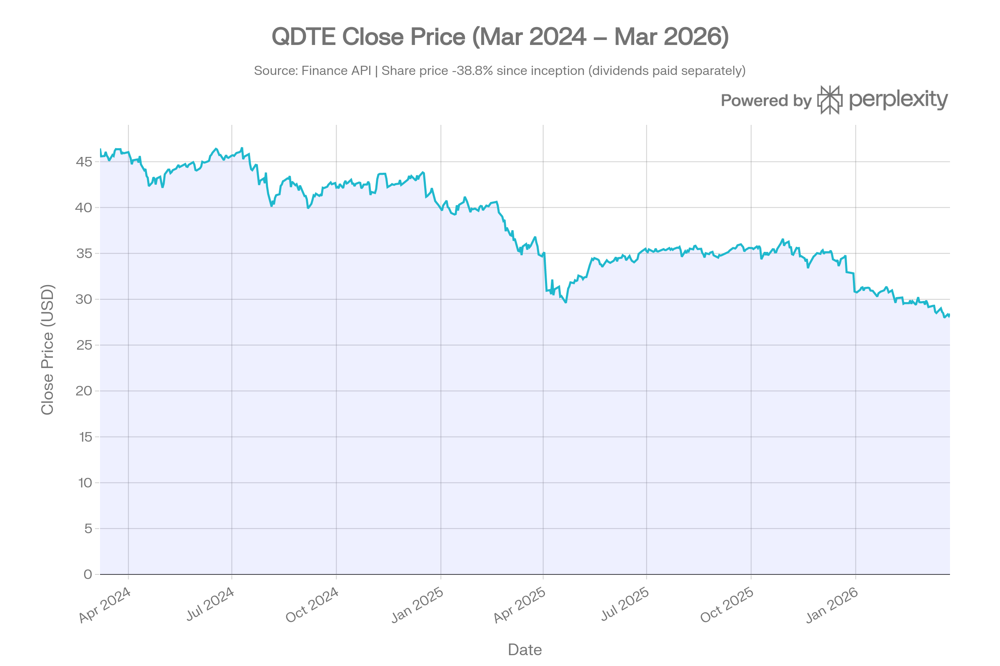
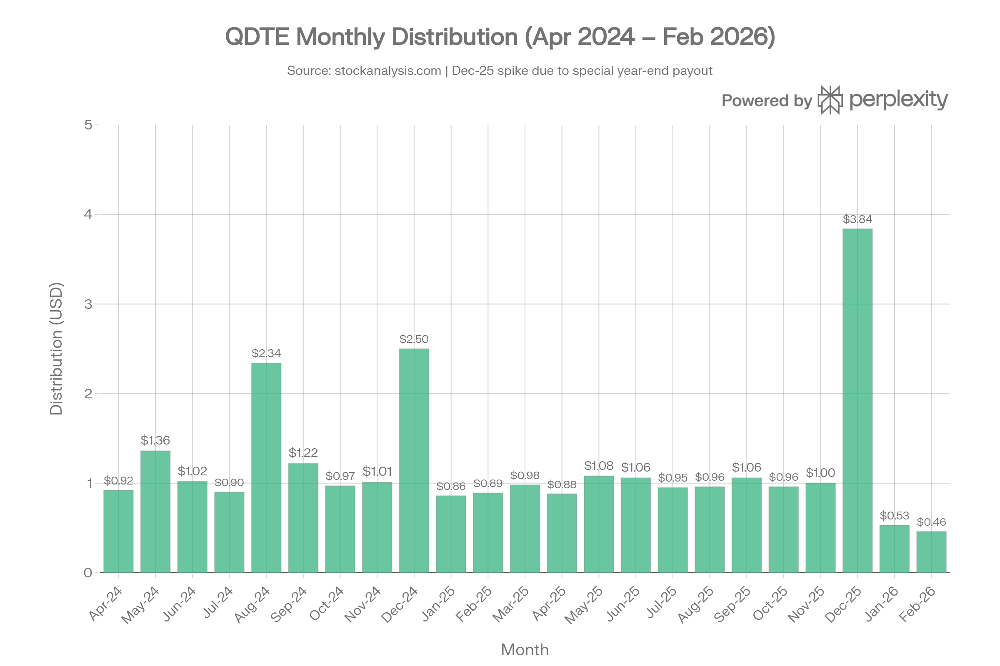

# QDTE (Roundhill Innovation-100 0DTE Covered Call Strategy ETF) 종합 분석 보고서
> **분석 기준일: 2026년 3월 25일**

## ETF 분류

| 항목 | 내용 |
|------|------|
| **최종 폴더** | `ETF/Dividend Income/Option Income/Nasdaq-100/QDTE` |
| **대분류** | 배당·인컴 |
| **하위 분류** | Option Income / Nasdaq-100 |
| **핵심 전략** | Innovation-100/Nasdaq-100 합성 롱 노출 + 매일 0DTE 콜옵션 매도 프리미엄 |
| **운용 방식** | 액티브 |
| **레버리지·인버스 여부** | 아니오 |
| **옵션 인컴 전략 여부** | 예 |
| **분류 판단** | Nasdaq-100 성격의 기초지수에 노출되지만 핵심 목적은 0DTE 커버드콜 프리미엄을 활용한 주간 인컴 창출이므로 대표지수보다 옵션 인컴 분류를 우선 적용한다. |

***
## 1. 기본 정보
QDTE는 Roundhill Investments가 2024년 3월 7일 출시한 세계 최초의 0DTE(Zero Days to Expiry) 옵션 활용 ETF입니다. CBOE BZX 거래소에 상장되어 있으며, Innovation-100 Index(실질적으로 나스닥-100과 동일)를 기초로 합성 커버드콜(Synthetic Covered Call) 전략으로 주간 배당을 창출하는 **액티브 운용 ETF**입니다.[1][2][3]

| 항목 | 내용 |
|------|------|
| 정식명 | Roundhill Innovation-100 0DTE Covered Call Strategy ETF |
| 티커 | QDTE |
| 설정일 | 2024년 3월 7일[1][3] |
| 추종 기초지수 | Innovation-100 Index (≈ NASDAQ-100)[2][4] |
| 운용사 | Roundhill Investments |
| 상장거래소 | Cboe BZX[1] |
| AUM | 약 $832~866M (2026년 3월)[5][6] |
| 현재가 | $28.36 (2026-03-25) |
| 총 보수(ER) | 0.95~0.97%[1][7] |
| 운용 방식 | 액티브 관리[1] |
| 배당 주기 | 매주(Weekly)[1] |

***
## 2. 전략 구조 및 작동 원리
QDTE의 핵심은 **0DTE 옵션을 활용한 합성 커버드콜 전략**으로, 기존의 커버드콜 ETF(QYLD, XYLD 등)와 근본적으로 다릅니다.[1][4]
### 전략 메커니즘
1. **합성 롱 포지션 구축 (야간)**: 매 거래 마감 후, Innovation-100 Index에 대한 **깊은 내가격(Deep ITM) FLEX 옵션을 매수**하여 지수의 직접 보유와 동일한 수익 구조를 만듭니다.[1][8]
2. **0DTE 콜옵션 매도 (매일 아침)**: 장 개시 직후, 동일 지수에 대해 **당일 만기(0DTE) OTM(Out-of-the-money) 콜옵션을 매도**하여 옵션 프리미엄을 수취합니다.[9][1]
3. **"나이트 이펙트(Night Effect)" 활용**: 타 커버드콜 ETF와 달리, QDTE는 **야간 포지션이 언캡드(Uncapped)**입니다. 전날 종가부터 다음날 장 개시까지의 상승분은 제한 없이 누릴 수 있어, 이 구조적 차이가 초과수익의 주요 원천입니다.[10][3]
4. **담보 운용**: 실물 주식 대신 FLEX 옵션과 T-Bill ETF(WEEK)로 구성되어 자본 효율을 높입니다.[1]
### 기존 커버드콜과의 차이점
| 구분 | QDTE (0DTE 방식) | QYLD (월물 방식) |
|------|-----------------|-----------------|
| 옵션 만기 | 0일(매일 신규)[1] | 30일(월 1회)[11] |
| 야간 노출 | **언캡드** (풀 업사이드)[10] | 캡드 (콜매도로 제한) |
| 배당 주기 | **매주**[1] | 매월[11] |
| 보수율 | 0.97%[2] | 0.60%[12] |
| 전략 유형 | 액티브[1] | 패시브 규칙 기반[11] |
### 보유 자산 구조 (2026년 3월 기준)
| 자산 | 내용 | 비중 |
|------|------|------|
| NDX FLEX 콜옵션 (합성롱, 2026.06 만기) | NDX 06/18/2026 C2177 | 23.50% |
| NDX FLEX 콜옵션 (2026.09 만기) | NDX 09/18/2026 C2250 | 18.92% |
| NDX FLEX 콜옵션 (2026.12 만기) | NDX 12/18/2026 C2450.1 | 23.50% |
| NDX FLEX 콜옵션 (2027.03 만기) | NDX 03/19/2027 C2510.15 | 24.24% |
| WEEK (Roundhill T-Bill ETF, 담보) | T-Bill 담보 | 5.88% |

***
## 3. 추종 성과 지표
### 추적오차 및 NAV 괴리율
QDTE는 지수를 직접 복제하지 않고 **FLEX 옵션으로 합성 롱을 구현**하므로, 전통적인 추적오차 개념이 다르게 적용됩니다. NAV 대비 시장 가격 괴리율은 약 **0.1%** 수준으로 매우 타이트하게 유지됩니다. 옵션 만기 구조상 분기·연 단위로 롤오버가 이루어집니다.[1][13]

***
## 4. 비용 구조
### 총 보수(TER)
QDTE의 총 보수율은 **0.95~0.97%**로, 고도화된 0DTE 옵션 운용 비용을 반영합니다. 동류 커버드콜 ETF 대비 유의미하게 높은 수준입니다.[1][2]
### 경쟁 ETF 비용 비교
| ETF | 전략 | 보수율 | 배당주기 | TTM 배당수익률 |
|-----|------|--------|----------|--------------|
| **QDTE** | 0DTE 커버드콜 (나스닥-100) | **0.97%**[2] | 주간[1] | ~47~50%[14] |
| QYLD | 월물 커버드콜 (나스닥-100) | 0.60%[12] | 월간 | ~11~13% |
| JEPQ | ELN 기반 (나스닥-100) | 0.35% | 월간 | ~9~11% |
| XYLD | 월물 커버드콜 (S&P500) | 0.07%[11] | 월간 | ~19~20%[11] |

비용 대비 수익 측면에서 QDTE의 주간 배당은 압도적이나, 장기 총수익(total return) 기준에서는 납부한 0.97% 보수가 누적 성과에 유의미한 드래그로 작용합니다.[8]

***
## 5. 유동성 평가
QDTE의 유동성은 동급 배당 ETF 중에서 높은 편입니다. AUM이 약 $832~866M에 달하며, 일평균 거래량은 약 **75만 주(최근 3개월 평균)**로, 일평균 거래대금은 **약 $22.7M** 수준입니다.[5][6]

| 유동성 지표 | 수치 |
|------------|------|
| AUM (2026.03) | 약 $832~866M[5][6] |
| 일평균 거래량 (3M) | ~749,000주 |
| 일평균 거래대금 (3M) | ~$22.7M |
| 평균 거래량 (전체) | 746,008주 |
| NAV 괴리율 | 약 0.1%[13] |
| 1년 펀드플로우 | +$812.7M[13] |

1년 펀드플로우 +$812.7M은 강한 자금 유입세를 반영하며, Roundhill 전체 0DTE 스위트(XDTE+QDTE+RDTE)는 2024년 12월 합산 AUM $1B를 돌파했습니다.[10][13]

***
## 6. 포트폴리오 구성
### 보유 자산
QDTE의 실제 주식 보유는 없습니다. 100%에 가까운 포지션이 **나스닥-100 FLEX 옵션**과 **T-Bill ETF(WEEK)**로 구성됩니다. FLEX 옵션은 유럽식 옵션으로 기초자산(Innovation-100)의 가격 수익률을 정밀하게 복제합니다.[1]
### 섹터 배분
기초자산인 Innovation-100 Index는 사실상 나스닥-100과 동일하여, 포트폴리오는 아래 섹터에 간접 노출됩니다.[2]

- **IT/기술**: ~50~60% (Nvidia, Microsoft, Apple, Meta 등)
- **경기소비재**: ~15%
- **커뮤니케이션서비스**: ~10%
- **헬스케어**: ~7%
- **기타**: ~8%

기술 섹터 집중도가 극히 높아, 나스닥-100 의 AI·반도체 사이클에 성과가 직결됩니다.[2]
### 리밸런싱
지수는 분기별 리밸런싱·연 1회 재구성이 이루어지며, 0DTE 콜옵션은 **매일** 새로 발행·만기됩니다.[2]

***
## 7. 성과 분석
### 가격 vs 총수익률 이해

QDTE를 평가할 때 **주가만 보면 오해를 유발**합니다. 설정일(2024.03.07) 이후 주가는 $46.44 → $28.36으로 약 -38.9% 하락했지만, 이는 매주 배당이 주가에서 차감되어 지급되기 때문입니다. **총수익률 기준(배당 재투자 포함)**은 설정 이후 연환산 약 **15.99%**, 1년 총수익률은 약 **19.92%**입니다.[14]
### 기간별 총수익률
| 기간 | 가격 수익률 | 총수익률(배당 포함) |
|------|------------|-------------------|
| 1개월 | -5.97% | 약 -5~4%(주간배당 포함) |
| 3개월 | -13.71% | 약 -8~-3%[15] |
| 6개월 | -19.27% | 약 -12~-6%[15] |
| 1년 | -22.82% (가격) | **+19.92%**[14] |
| 설정 이후(연환산) | N/A | **+15.99%**[14] |

> 1년 총수익률 +19.92%는 주간 배당 $14+를 포함한 수치입니다.
### vs 벤치마크 초과수익
2024년 9월 말 기준 데이터에 따르면, QDTE의 NAV 수익률(13.58%)은 같은 기간 Nasdaq-100의 11.85%를 **+1.73%p 초과**했습니다. 이는 "나이트 이펙트"를 활용한 언캡드 야간 노출 덕분입니다. 2025년 Schwab 데이터 기준으로는, 설정 이후 $13,890(QDTE) vs 파생상품 소득 인덱스 $12,237 vs S&P500 $13,289로 상대적으로 양호한 성과를 보였습니다.[10][16]
### 리스크 조정 성과

| 지표 | QDTE | QYLD(참고) |
|------|------|-----------|
| 1Y 샤프 비율 | 1.02(총수익)[15] | 0.3~0.5 |
| 연환산 변동성(1Y) | 21.68% | ~20% |
| 최대 낙폭(가격) | **-39.88%** (2026.03.20) | ~-30% |

***
## 8. 배당 정보
QDTE의 배당 구조는 기존 ETF와 근본적으로 다릅니다. 배당 재원은 **매일 아침 0DTE 콜옵션 매도로 수취한 프리미엄**이며, 이를 모아 **매주 금요일 분배**합니다.[1][17]
### 배당 수익률 및 이력
- **TTM 배당수익률**: 약 47~50%[14][17]
- **연간 총 배당금(TTM)**: 약 $14.12~14.56/주[17][14]
- **주간 배당 단가**: 대체로 $0.17~$0.28, 변동폭 큼[17]
### 최근 주요 배당 이력
| 기간 | 주간 배당금 |
|------|-----------|
| 2026년 1~3월 | $0.10~$0.18/주[17] |
| 2025년 12월 말 특별배당 | $1.72+$1.92 = 약 $3.64[17] |
| 2025년 7~8월 | $0.23~$0.24/주[17] |
| 2024년 7~8월 | $0.35~$0.57/주 (고변동성 환경)[17] |
### 배당의 세금 성격: 자본환급(Return of Capital)
배당의 상당 부분이 **자본환급(RoC)** 성격을 가집니다. 이는 ① 세금을 매도 시점까지 이연하는 효과가 있으나, ② 투자자의 원가기준(cost basis)을 지속적으로 낮춥니다. 30일 SEC 수익률이 **-0.49%**로 음수인 이유가 여기에 있습니다. 즉 GAAP 기준 경상수익보다 배당이 더 많이 지급되어, 초과분은 원금 환급으로 처리됩니다.[7][18][19]
### 배당 안정성
배당 금액은 옵션 프리미엄(=변동성 수준)에 직결되므로 **변동성이 큰 시장에서 배당이 높아지고** 안정적 시장에서 낮아지는 경향이 있습니다. 2024년 8월(VIX 스파이크) 당시 주간 배당이 $0.51~$0.57까지 상승한 것이 이를 방증합니다.[20][17]

***
## 9. 리스크 요소
### 핵심 리스크
**1. 상승 업사이드 제한(Upside Cap)**
장중 커버드콜 매도로 일중 상승이 특정 수준에서 제한됩니다. 강한 상승장에서는 Nasdaq-100 직접 보유 대비 성과가 크게 뒤처질 수 있습니다. 단, 야간(전일 종가→당일 시초가)의 상승은 언캡드로 참여합니다.[10][20][8]

**2. NAV 에로전 논쟁**
주가 하락(-38.9% since inception)을 'NAV 에로전'으로 오해하는 경우가 많으나, 이는 **매주 배당을 주가에서 지급하는 정상적인 메커니즘**입니다. 총수익 기준으로는 양호한 성과를 보여왔습니다. 단, 경쟁사 분석에 의하면 하락장에서 배당이 RoC로 처리되어 실질 NAV 잠식이 발생할 수 있습니다.[21][22]

**3. 자본환급(RoC) 리스크**
배당의 상당분이 RoC이므로, 장기 보유 시 원가기준이 0까지 낮아진 후 추가 분배는 자본이득으로 과세됩니다. 과세계좌 장기 보유자는 세금 계획이 필수입니다.[19]

**4. 0DTE 옵션 유동성 리스크**
0DTE 옵션은 스프레드가 넓고 유동성이 낮을 수 있어, 고변동성 구간에서 실행 비용이 증가합니다.[2][8]

**5. 섹터 집중 리스크**
기초자산이 나스닥-100 성격이어서, 기술주·AI·반도체 사이클에 고도로 의존합니다. 섹터 로테이션이나 기술주 조정 시 직접적인 타격을 받습니다.[2]

**6. 높은 비용(0.97%)**
QQQ(0.20%) 대비 약 5배, QYLD(0.60%) 대비 60% 높은 운용보수는 장기 총수익에 지속적인 드래그로 작용합니다.[8]

**7. 비분산(Non-Diversified) 펀드**
SEC 기준 비분산형 펀드로, 집중 포지션 리스크가 존재합니다.[2]
### 리스크 요약 매트릭스
| 리스크 유형 | 수준 | 비고 |
|------------|------|------|
| 업사이드 제한 | 높음 | 강세장 시 언더퍼폼 가능[20] |
| 하방 리스크 | 중~높음 | 기초지수 전체 하락 노출[1] |
| 유동성 리스크 | 중간 | 0DTE 스프레드 변동[2] |
| 섹터 집중 리스크 | 높음 | 나스닥-100 기술주 편중[2] |
| 세금 리스크 | 중간 | RoC 원가기준 감소[19] |
| 배당 변동성 | 높음 | VIX 연동 프리미엄[17] |

***
## 10. 종합 평가
QDTE는 세계 최초의 0DTE 커버드콜 ETF로서 **"주간 고배당 + 나이트 이펙트 초과수익"**이라는 독창적인 가치 제안을 가집니다. 설정 이후 나스닥-100을 총수익 기준으로 소폭 초과 달성한 점은 전략의 유효성을 일부 입증합니다.[1][10]

**투자에 적합한 경우:**
- 월별·주별 현금흐름(Cash Flow)이 필요한 은퇴자 또는 소득 투자자
- 나스닥-100 노출을 유지하면서 변동성 프리미엄을 수취하려는 투자자
- 고변동성 환경에서 프리미엄 극대화를 추구하는 투자자
- 과세계좌에서 세금 이연(RoC) 효과를 활용하려는 투자자

**투자에 부적합한 경우:**
- 장기 자본이득 극대화가 목표인 투자자 → QQQ/QQQM이 훨씬 우월
- 기술주 강세장 완전 참여를 원하는 투자자 → 업사이드 캡으로 손실 가능
- 낮은 변동성 환경에서 안정적 배당을 기대하는 투자자 → 배당이 VIX 연동으로 급감

QDTE는 **"소득 중심 + 중기 보유"**에 최적화된 전략이며, QQQ 포트폴리오의 100% 대체재가 아니라 위성(satellite) 배분 수단으로 활용하는 것이 적절합니다. 보수율 0.97%와 세금 복잡성을 감안하면, 최소 10~15%의 포트폴리오 비중 내에서 활용하고 총수익 기준으로 평가하는 관점이 필요합니다.[8]
