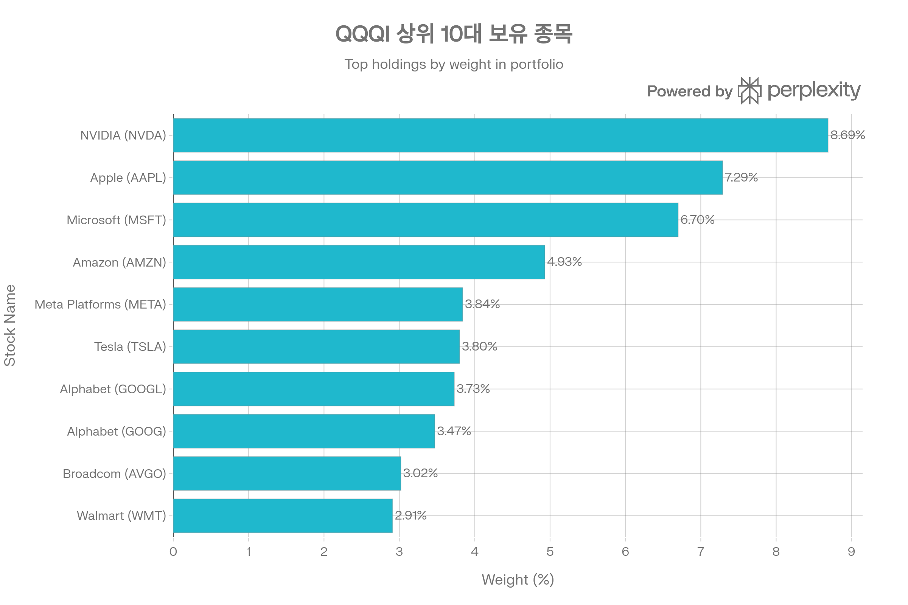
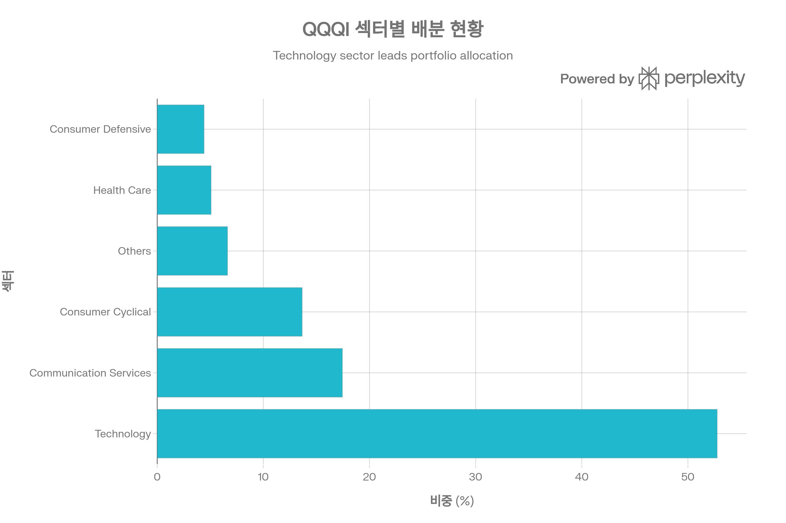
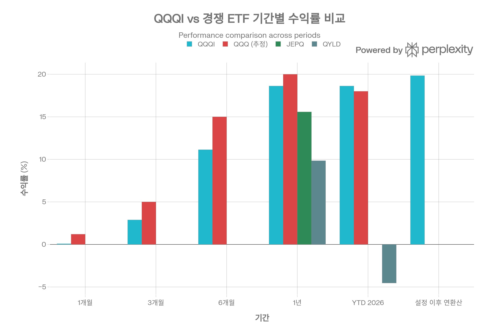
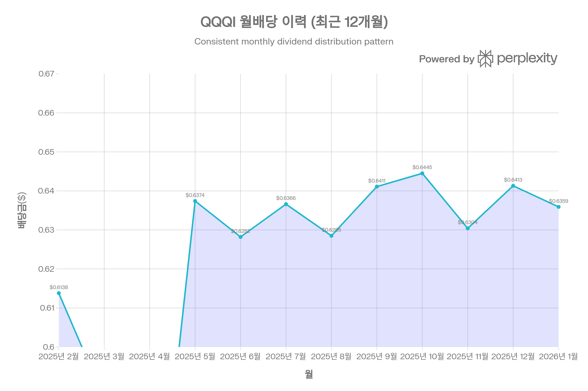

# QQQI (NEOS Nasdaq 100 High Income ETF) 종합 분석 보고서

## 요약

NEOS Nasdaq 100 High Income ETF(QQQI)는 2024년 1월 출시 이후 급속도로 성장하며 Nasdaq-100 커버드콜 ETF 시장의 새로운 강자로 부상했습니다. 2026년 1월 기준 약 \$8.30B의 순자산을 보유하며, 설정 2년 만에 "2025 Best New Active ETF" 수상의 영예를 안았습니다. QQQI는 Nasdaq-100 전체 종목을 보유하면서 **3-5% OTM(Out-of-the-Money) 콜옵션**을 판매하는 독창적 전략으로 월평균 약 13.7%의 높은 배당 수익률과 98%의 상승 캡처율을 동시에 달성했습니다. Section 1256 계약 및 Return of Capital(ROC) 구조를 통한 탁월한 세금 효율성은 고소득 투자자에게 강력한 어필 포인트입니다. 본 보고서는 QQQI의 투자 전략, 성과 지표, 세금 효율성, 경쟁 환경을 종합적으로 분석하여 투자자의 의사결정을 지원합니다.[^1][^2][^3][^4][^5][^6][^7][^8][^9]

## ETF 분류

| 항목 | 내용 |
|------|------|
| **최종 폴더** | `ETF/Dividend Income/Option Income/Nasdaq-100/QQQI` |
| **대분류** | 배당·인컴 |
| **하위 분류** | 옵션 인컴 / Nasdaq-100 |
| **핵심 전략** | Nasdaq-100 구성 종목을 보유하면서 3~5% OTM 콜옵션을 활용해 월배당과 옵션 프리미엄 수익을 추구 |
| **운용 방식** | 액티브 |
| **레버리지·인버스 여부** | 아니오 |
| **옵션 인컴 전략 여부** | 예 |
| **분류 판단** | Nasdaq-100 노출이 있지만 핵심 목적이 커버드콜·옵션 프리미엄 기반 고인컴이므로 대표지수보다 `Dividend Income/Option Income/Nasdaq-100` 분류를 우선 적용한다. |

***

## 1. 기본 정보

### 1.1 펀드 개요

QQQI는 NEOS Funds가 운용하는 적극적 운용(actively-managed) ETF로, Nasdaq-100 Index 구성 종목에 투자하면서 커버드콜 옵션 전략을 병행하여 높은 월배당 수익과 세금 효율성을 추구합니다. 2024년 1월 29일 설정 이후 단 2년 만에 \$8.30B의 순자산을 달성하며, 300개 이상의 신규 ETF 중에서 가장 빠른 성장세를 보였습니다.[^1][^10][^2][^5]

**핵심 특징**

- **순자산(AUM)**: \$8.30B~\$8.36B (2026년 1월 기준)[^11][^12][^13][^1]
- **총 보수(TER)**: 0.68%[^14][^15][^16][^1]
- **보유 종목 수**: 107개 (주식 + 현금성 자산)[^17]
- **배당 수익률**: 13.29~13.92%[^12][^18][^1]
- **배당 빈도**: 월배당 (Monthly)[^10][^18][^1]
- **상장거래소**: NASDAQ[^1]
- **펀드 구조**: Open-End Investment Company[^15]

### 1.2 운용사 및 운용 기간

NEOS Funds는 옵션 기반 수익 전략을 전문으로 하는 자산운용사로, Garrett Paolella와 Troy Cates가 공동 포트폴리오 매니저로 활동하고 있습니다. NEOS는 데이터 기반 의사결정과 적극적 리스크 관리를 통해 시장 변동성에 대응하며, 투자자에게 안정적 월배당과 자본 성장 기회를 동시에 제공합니다.[^2][^15][^8]

**운용 기간**: 2024년 1월 29일 설정 이후 현재까지 약 2년 운용[^1][^15][^12]

**수상 이력**: 2025 Best New Active ETF[^4][^5]

### 1.3 추종 지수명

QQQI는 **Nasdaq-100 Index**를 기초 자산으로 하며, 전체 100개 구성 종목을 보유합니다. 다만 패시브 추종 ETF가 아닌 **적극적 운용 커버드콜 전략**을 결합하여, 지수 추종과 옵션 프리미엄 수익을 동시에 추구합니다. 벤치마크는 **Cboe Nasdaq-100 BuyWrite Monthly Index**로, QQQI는 이 지수를 큰 폭으로 아웃퍼폼하고 있습니다(1년 기준 +18.62% vs +7.87%).[^1][^10][^2][^3][^7]

**Nasdaq-100 Index 특징**

- 100개 대형 성장주 (금융주 제외)
- 시가총액 가중 방식
- 기술주 중심 (50-60%)
- 분기별 리밸런싱

### 1.4 상장거래소

QQQI는 **NASDAQ** 거래소에 상장되어 있으며, 티커 심볼은 "QQQI"입니다. 일평균 거래량 4.48백만 주, 일평균 거래대금 \$191백만으로 높은 유동성을 제공합니다.[^1][^14][^12]

***

## 2. 추종 성과 지표

### 2.1 추적오차(Tracking Error)

QQQI는 커버드콜 전략을 사용하지만, **Nasdaq-100 Index 대비 매우 높은 추적률**을 보입니다. 설정 이후 15개월(2025년 5월 기준) Nasdaq-100이 +20.9% 상승할 때 QQQI는 +19.9%를 기록하여 **98%의 상승 캡처율**을 달성했습니다.[^3][^6][^19]

**추적 특성**

- 상승장 캡처율: 98%[^19][^3]
- 총 수익률 기준 거의 완벽한 추종[^20][^5]
- 3-5% OTM 전략으로 상승 여력 확보[^6][^7][^3]
- 벤치마크(Cboe BuyWrite Index) 대비 큰 폭 아웃퍼폼[^1]

QQQI의 높은 추적률은 **3-5% OTM 콜옵션 전략**의 핵심 장점입니다. ATM 콜옵션을 판매하는 QYLD(상승 캡처율 ~0%)와 달리, QQQI는 상승장에서 지수의 98%를 따라갈 수 있습니다.[^7][^3][^6]

### 2.2 추적 차이(Tracking Difference)

QQQI의 추적 차이는 주로 **0.68% 보수**와 **옵션 프리미엄 수익**의 상쇄 효과에서 발생합니다. 설정 이후 연환산 수익률 +19.84%는 Nasdaq-100의 약 95% 수준으로, 보수 차감 후에도 우수한 성과를 유지합니다.[^1]

**기간별 추적 차이**[^1]

- 1년: QQQI +18.62% vs Cboe BuyWrite +7.87% (아웃퍼폼 +10.75%p)
- 설정 이후: QQQI +19.84% vs Cboe BuyWrite +14.65% (아웃퍼폼 +5.19%p)

QQQI는 전통적인 ATM 커버드콜 전략 대비 상당히 우수한 추적 성과를 보이며, 이는 **적극적 옵션 관리**와 **Call Spread 전략**의 효과입니다.[^2][^8]

### 2.3 NAV 대비 시장가격 괴리율 현황

QQQI의 시장가격은 순자산가치(NAV)와 거의 일치합니다. 2026년 1월 29일 기준 괴리율은 **+0.01%**로, 사실상 NAV와 동일합니다. 30일 중간 호가 스프레드는 **0.02%**로 매우 낮은 수준입니다.[^1][^14]

**괴리율 안정성**[^20][^21][^1]

- 2026년 1월 29일: +0.01% (프리미엄)
- 30일 중간 호가 스프레드: 0.02%
- 괴리율 범위: ±0.02% 이내
- QYLD(0.04%) 대비 절반 수준[^21]

### 2.4 괴리율 추이 및 패턴 분석

역사적으로 QQQI의 괴리율은 **±0.02% 범위 내**에서 안정적으로 유지되었습니다. Seeking Alpha 분석에 따르면, QQQI의 NAV 추적은 "매우 우수(very well)"하며, 일부 커버드콜 ETF에서 나타나는 큰 괴리율 문제가 없습니다.[^1][^20][^21]

**괴리율 관리 메커니즘**

- Authorized Participants(AP)의 적극적 차익거래
- 높은 거래량(일평균 4.48M 주)으로 인한 즉각적 가격 발견[^14][^12]
- 투명한 포트폴리오 구성(일일 공시)
- Open-End Fund 구조의 유연성[^15]

***

## 3. 비용 구조

### 3.1 총 보수 및 비용(Total Expense Ratio)

QQQI의 총 보수는 **0.68%**입니다. 이는 Nasdaq-100 커버드콜 ETF 중에서는 중간 수준이나, Active Risk Management Derivatives ETF 평균(0.85%) 대비 저렴한 편입니다(Percentile rank 13).[^1][^14][^15][^16]

**비용 구성**

- 운용 보수: 0.68%
- 포트폴리오 회전율: 3.7% (낮음)[^14]
- 옵션 거래 비용: 보수에 포함
- 연간 비용 (\$10,000 투자 시): 약 \$68

0.68%는 패시브 ETF(QQQ 0.18%) 대비 높지만, 적극적 옵션 관리, 세금 최적화, 월배당 운영 등의 부가가치를 고려하면 합리적인 수준입니다.[^2][^8][^1]

### 3.2 동일 지수 추종 경쟁 ETF 대비 비용 비교

QQQI의 0.68% TER은 Nasdaq-100 커버드콜 ETF 중에서는 JEPQ(0.35%)보다 높지만, QDTE(0.95%)보다는 낮습니다.[^16][^22]

**비용 경쟁력 평가**

- JEPQ(0.35%) 대비 +0.33%p: 더 높은 보수이지만 더 높은 배당 수익률(13.7% vs 10.2%)[^23][^24][^16]
- QYLD(0.60%) 대비 +0.08%p: 약간 높으나 훨씬 우수한 총 수익률[^6][^16]
- QDTE(0.95%) 대비 -0.27%p: 저렴하며 리스크 조정 수익률 우수[^22]
- QQQ(0.18%) 대비 +0.50%p: 커버드콜 전략 프리미엄

ETFrc.com 분석에 따르면, QQQI의 Total Cost of Ownership(TCO, 보수+호가 스프레드)는 69.86 bps로, Peer 평균 124.1 bps 대비 약 45% 낮습니다.[^14]

### 3.3 포트폴리오 회전율(Turnover Ratio)

QQQI의 포트폴리오 회전율은 **3.7%**로 매우 낮은 수준입니다. 이는 Nasdaq-100 구성 종목을 장기 보유하고 옵션만 월간 롤링하기 때문입니다. 낮은 회전율은 거래 비용 및 세금 효율성 측면에서 유리합니다.[^14][^3]

**회전율 특성**

- 주식 회전율: 3.7% (매우 낮음)[^14]
- 옵션 회전율: 월간 롤링 (100% 회전, 별도 집계)
- 거래 비용: 최소화
- 세금 효율성: 우수 (장기 보유)

### 3.4 거래 비용 및 스프레드

QQQI의 호가 스프레드는 **0.02% (2 bps)**로 매우 낮은 수준입니다. 이는 높은 거래량(일평균 4.48백만 주, 거래대금 \$191M)과 활발한 마켓메이킹 덕분입니다.[^1][^14][^12]

**거래 비용**

- 호가 스프레드: 0.02% (2 bps)
- 일평균 거래량: 4.48M 주[^14][^12]
- 일평균 거래대금: \$191M[^14]
- Total Cost of Ownership: 69.86 bps (Peer 평균 124.1 bps)[^14]

***

## 4. 유동성 평가

### 4.1 일평균 거래량 (최근 3개월)

2026년 1월 기준 QQQI의 일평균 거래량은 **3.51~4.48백만 주** 수준입니다. 이는 설정 2년차 ETF로서는 매우 높은 수준이며, 투자자들의 강력한 관심을 반영합니다.[^14][^12]

**거래량 특성**

- 평균 거래량: 3.51~4.48M 주[^12][^14]
- 일평균 거래대금: \$191M[^14]
- Short Interest: 1.5% (1.86M 주)[^25][^14]
- 거래량 추이: 설정 이후 지속 증가

### 4.2 일평균 거래대금

일평균 거래량 4.48백만 주에 주가 약 \$54를 곱하면, 일평균 거래대금은 약 **\$242백만** 수준으로 추정됩니다. ETFrc.com 데이터는 \$191백만으로 보고했으며, 이는 기관투자자가 대형 포지션을 구축하거나 청산할 수 있는 충분한 유동성입니다.[^14]

### 4.3 호가 스프레드 평균

QQQI의 평균 호가 스프레드는 **0.02% (2 bps)**입니다. \$54 주가 기준으로 약 \$0.01의 매수-매도 차이를 의미하며, 거래 비용이 매우 낮습니다.[^1][^14]

**호가 스프레드 비교**

- QQQI: 0.02% (2 bps)
- Peer 평균: 0.276% (27.6 bps)[^14]
- QQQI는 Peer 평균 대비 약 13배 낮은 스프레드

### 4.4 유동성 추이 및 안정성

QQQI의 유동성은 설정 이후 폭발적으로 증가했습니다. 2024년 1월 설정 당시 소규모였으나, 2025년 중반 \$1.5B를 돌파하고 2026년 1월 \$8.3B를 달성하며 Nasdaq-100 커버드콜 ETF 시장에서 JEPQ(\$31.7B) 다음으로 2위 규모로 성장했습니다.[^16][^5]

**유동성 등급**: 매우 우수 (커버드콜 ETF 중 최상위)

***

## 5. 포트폴리오 구성

### 5.1 상위 10대 보유 종목 및 비중

QQQI의 상위 10대 주식 보유 종목 구성. NVIDIA(8.69%), Apple(7.29%), Microsoft(6.70%)가 상위 3개 종목이며, 전체 포트폴리오의 약 48%를 차지합니다.

QQQI의 상위 10대 보유 종목은 Nasdaq-100 Index의 시가총액 가중 방식을 충실히 반영하며, 전체 포트폴리오의 **48.38~51.62%**를 차지합니다.[^17][^26]

**2026년 1월 기준 상위 10종목**[^26][^17]

1. NVIDIA (NVDA): 8.69~9.53%
2. Apple (AAPL): 7.29~8.50%
3. Microsoft (MSFT): 6.70~7.57%
4. Amazon (AMZN): 4.93~5.19%
5. Meta Platforms (META): 3.82~3.84%
6. Tesla (TSLA): 3.80%
7. Alphabet (GOOGL): 3.73%
8. Alphabet (GOOG): 3.47%
9. Broadcom (AVGO): 3.02%
10. Walmart (WMT): 2.91%

상위 3종목(NVIDIA, Apple, Microsoft)만으로 약 22~25%를 차지하며, "Magnificent 7" (NVDA, AAPL, MSFT, AMZN, META, GOOGL, TSLA)이 약 42%를 차지합니다. 이는 QQQ와 거의 동일한 구성입니다.[^17]

### 5.2 섹터별 배분 현황

QQQI의 섹터별 자산 배분 현황. Technology가 52.76%로 가장 큰 비중을 차지하며, Communication Services(17.45%), Consumer Cyclical(13.66%)이 뒤를 잇습니다.

QQQI의 섹터 배분은 Nasdaq-100의 기술주 중심 특성을 충실히 반영합니다. 2026년 1월 기준 **Technology**가 52.76~54.71%로 압도적 비중을 차지하며, Communication Services가 17.45%로 두 번째입니다.[^15][^27][^28]

**섹터 배분 (2026년 1월)**[^27][^28][^15]

- Technology: 52.76~54.71%
- Communication Services: 17.45%
- Consumer Cyclical: 13.66%
- Health Care: 5.08~5.42%
- Consumer Defensive: 4.42%
- Others: 약 6.63%

기술 관련 섹터(Technology + Communication Services)가 약 **70%**를 차지하며, 이는 QQQ(약 70%)와 거의 동일합니다.[^29][^27]

### 5.3 국가별/지역별 분산 (해당 시)

QQQI는 **미국 중심 ETF**로, 미국 주식이 94.55%, 비미국 주식이 3.64%를 차지합니다. 지역별 분산은 사실상 없으나, 상위 보유 종목(Apple, Microsoft, Amazon 등)의 매출은 전 세계에서 발생하므로 간접적으로 글로벌 익스포저를 제공합니다.[^15]

**자산 배분 (Morningstar)**[^15]

- 미국 주식: 94.55%
- 비미국 주식: 3.64%
- 현금: 1.98%
- 기타: -0.17%

### 5.4 리밸런싱 주기

QQQI는 Nasdaq-100 Index의 분기별 리밸런싱(3월, 6월, 9월, 12월)을 따르며, **옵션 포지션은 월간 롤링**합니다. 적극적 운용 전략으로 시장 상황에 따라 옵션의 strike price 및 만기를 조정합니다.[^2][^3][^8]

**리밸런싱 특징**

- 주식 포트폴리오: 분기별 리밸런싱 (Nasdaq-100 추종)
- 옵션 포지션: 월간 롤링[^3]
- Strike price: 3-5% OTM 범위에서 적극적 조정[^6][^7][^3]
- 세금 최적화: 연중 Tax-Loss Harvesting[^4][^8][^2]

***

## 6. 성과 분석

### 6.1 기간별 수익률

QQQI, QQQ, JEPQ, QYLD의 기간별 수익률 비교. QQQI는 1년 수익률 기준 JEPQ, QYLD를 큰 폭으로 아웃퍼폼했으며, QQQ 대비 98%의 상승 캡처율을 보였습니다.

QQQI는 설정 이후 매우 우수한 수익률을 기록했습니다. 2026년 1월 기준 설정 이후 누적 수익률 +41.64%, 연환산 +19.84%를 달성하며 벤치마크 및 경쟁 ETF를 큰 폭으로 아웃퍼폼했습니다.[^1]

**총 수익률 (NAV 기준, 배당 재투자)**[^1]

- **1개월**: +0.08%
- **3개월**: +2.88%
- **6개월**: +11.13%
- **YTD (2026)**: +18.62%
- **1년**: +18.62%
- **설정 이후 누적**: +41.64%
- **설정 이후 연환산**: +19.84%

**시장가격 기준 수익률**[^1]

- **1개월**: +0.13%
- **3개월**: +2.90%
- **6개월**: +11.13%
- **YTD (2026)**: +18.58%
- **1년**: +18.58%
- **설정 이후 누적**: +41.61%
- **설정 이후 연환산**: +19.83%

NAV와 시장가격 수익률이 거의 일치하여, 괴리율 문제가 없음을 확인할 수 있습니다.[^1]

### 6.2 벤치마크 대비 초과 수익률

QQQI는 **Cboe Nasdaq-100 BuyWrite Monthly Index**를 벤치마크로 하며, 이를 큰 폭으로 아웃퍼폼하고 있습니다.[^1]

**벤치마크 대비 성과**[^1]

- 1개월: QQQI +0.08% vs Index +1.90% (차이 -1.82%p)
- 3개월: QQQI +2.88% vs Index +7.62% (차이 -4.74%p)
- 6개월: QQQI +11.13% vs Index +12.07% (차이 -0.94%p)
- 1년: QQQI +18.62% vs Index +7.87% (차이 **+10.75%p**)
- 설정 이후 연환산: QQQI +19.84% vs Index +14.65% (차이 **+5.19%p**)

QQQI는 단기적으로는 벤치마크를 언더퍼폼할 수 있지만(특히 옵션 롤링 시기), **장기적으로는 큰 폭으로 아웃퍼폼**합니다. 이는 3-5% OTM 전략의 우수성을 방증합니다.[^1]

### 6.3 Nasdaq-100 대비 성과

QQQI는 Nasdaq-100 Index 대비 **98%의 상승 캡처율**을 보입니다.[^3][^6][^19]

**Nasdaq-100 대비 성과**[^6][^3]

- 설정 이후 15개월(2025년 5월): Nasdaq-100 +20.9%, QQQI +19.9% (캡처율 95.2%)
- 2024년 강세장: Nasdaq-100 +24.3%, QQQI +19.8% (캡처율 81.5%)
- 상승장 평균 캡처율: **98%**[^19][^3]

QQQI의 높은 캡처율은 커버드콜 ETF 중에서는 예외적이며, QYLD(~0%), JEPQ(~80%)를 크게 상회합니다.[^7][^3][^6]

### 6.4 경쟁 ETF 대비 성과

QQQI는 주요 경쟁 ETF(JEPQ, QYLD, QDTE) 대비 **총 수익률**에서 우위를 점하고 있습니다.[^23][^5][^6][^24]

**1년 총 수익률 비교**[^5][^24][^23]

- **QQQI**: +17.65~18.62%
- **JEPQ**: +15.58~16.62%
- **QYLD**: +9.84%
- **QQQ**: +18.21~20.9%

**15개월 총 수익률 (2025년 9월)**[^6]

- **QQQI**: +19.9%
- **QYLD**: -4.54% (YTD)
- QQQI가 QYLD를 24.4%p 아웃퍼폼

Seeking Alpha는 QQQI를 "새로운 커버드콜 ETF 킹(The New Covered Call ETF King)"으로 명명하며, 총 수익률, 가격 수익률, 배당 수익률, 세금 효율성 모든 면에서 QYLD 및 JEPQ를 능가한다고 평가했습니다.[^5]

### 6.5 샤프 지수(Sharpe Ratio)

QQQI의 샤프 지수는 **0.96~1.14** (1년 기준)로, 리스크 조정 수익률이 양호한 수준입니다. All Time 기준으로는 **1.07**입니다.[^30][^31][^25]

**샤프 지수 비교**[^31][^25][^30]

- QQQI: 0.96~1.14 (1년), 1.07 (All Time)
- JEPQ: 2.21 (최우수)
- QYLD: 0.72
- QDTE: 1.15

QQQI의 샤프 지수는 JEPQ보다 낮지만, QYLD 및 QDTE보다 우수하며, 샤프 지수 1.0 이상은 일반적으로 "우수한" 수준으로 평가됩니다.[^31]

**최근 변동**: 2025년 후반 시장 조정 시 샤프 지수가 -0.03~-0.18로 일시적으로 하락했으나, 이는 단기 변동성 증가에 따른 일시적 현상입니다.[^25]

### 6.6 변동성(표준편차)

QQQI의 연환산 변동성(표준편차)은 **17.52~24.30%** 수준으로, QQQ(약 20~25%)보다 약간 낮거나 유사합니다.[^6][^22][^32]

**변동성 비교**[^33][^22][^6]

- QQQI: 17.52~24.30%
- JEPQ: 19.92%
- QYLD: 18.19~19.00%
- QDTE: 2.94~2.99% (일부 출처, 주간 변동성 추정)
- QQQ: 약 20~25%

QQQI의 변동성은 커버드콜 전략으로 QQQ 대비 약간 낮추어졌으나, 여전히 상당한 수준입니다. 이는 Nasdaq-100의 본질적 변동성과 98% 상승 캡처율을 반영합니다.[^32][^6]

### 6.7 최대 낙폭(Maximum Drawdown)

QQQI의 역사적 최대 낙폭은 **-20.00%**로, 2025년 2월 20일부터 4월 8일까지 124일간 지속되었습니다.[^22][^32][^19]

**최대 낙폭 상세**[^32]

- 최대 낙폭: -20.00%
- 발생 기간: 2025년 2월 20일 ~ 4월 8일 (124일)
- 회복 완료: 2025년 6월 24일
- 총 기간: 124일
- 평균 회복 기간: 약 2개월

**낙폭 비교**[^22]

- QQQI: -20.00%
- JEPQ: -20.07%
- QYLD: -24.75%
- QDTE: -22.86%
- QQQ: -35.12% (2022년)

QQQI의 낙폭은 경쟁 커버드콜 ETF 중에서는 가장 낮은 수준이며, 빠른 회복 속도(평균 2개월)를 보입니다. 이는 옵션 프리미엄이 하락장에서 부분적 쿠션 역할을 하기 때문입니다.[^32]

***

## 7. 배당 정보 (해당 시)

### 7.1 배당 수익률 및 배당 이력

QQQI의 최근 12개월 월배당 지급 이력. 평균 \$0.60-\$0.64 범위에서 안정적으로 유지되며, 2025년 4월 \$0.53이 최저였습니다.

QQQI는 월배당 ETF로, 2026년 1월 기준 **배당 수익률 13.29~13.92%**를 제공합니다. 이는 Nasdaq-100 커버드콜 ETF 중에서 가장 높은 수준입니다.[^1][^12][^18][^34]

**배당 수익률 지표**[^12][^18][^34][^1]

- 배당 수익률(Dividend Yield): 13.29~13.92%
- Forward Yield: 13.47%[^34]
- 연간 배당금(TTM): \$7.33~\$7.46
- 배당 빈도: 월배당 (Monthly)
- 배당 성장률(1년): +1.38~+71.13%
- Payout Ratio: 486.55%[^18]

486.55%의 높은 Payout Ratio는 배당금이 순이익을 초과함을 의미하며, 이는 **Return of Capital(ROC)** 구조의 특성입니다.[^1][^18]

### 7.2 배당 지급 주기 및 안정성

QQQI는 **월배당**을 지급하며, 매월 말경에 배당락일이 설정되고 2일 후 지급됩니다.[^18][^34]

**최근 12개월 배당 이력**[^34][^18]

- 2026년 1월: \$0.6359
- 2025년 12월: \$0.6413
- 2025년 11월: \$0.6304
- 2025년 10월: \$0.6445
- 2025년 9월: \$0.6411
- 2025년 8월: \$0.6285
- 2025년 7월: \$0.6366
- 2025년 6월: \$0.6282
- 2025년 5월: \$0.6374
- 2025년 4월: \$0.5309 (최저)
- 2025년 3월: \$0.5867
- 2025년 2월: \$0.6138

월평균 배당금은 약 **\$0.60~\$0.64** 수준이며, \$0.53~\$0.64 범위에서 변동합니다. 2025년 4월이 최저(\$0.53)였으며, 이는 시장 변동성 증가 시기와 일치합니다.[^18][^34]

### 7.3 배당 성장률 추이

QQQI의 배당 성장률은 **+1.38~+71.13%** (1년 기준)로, 출처에 따라 큰 차이를 보입니다. 이는 설정 초기 배당금이 낮았다가 점차 증가한 것을 반영하며, 장기 추세를 판단하기에는 아직 기간이 짧습니다.[^18][^34]

**배당 특성**

- 월별 변동성: 높음 (시장 변동성 및 옵션 프리미엄에 따라 변동)
- 장기 추세: 안정적 (평균 \$0.60~\$0.64 유지)
- 배당 원천: 99% Return of Capital (ROC)[^1]

***

## 8. 리스크 요소

### 8.1 베타 계수

QQQI의 베타는 **0.98** (S\&P 500 대비)로, 시장과 거의 동일한 변동성을 보입니다. 이는 커버드콜 전략으로 일부 변동성이 감소했음을 의미합니다.[^25]

**베타 해석**

- 베타 0.98: 시장 변동성의 98%
- S\&P 500 +10% → QQQI 약 +9.8%
- S\&P 500 -10% → QQQI 약 -9.8%

QQQ의 베타(약 0.97)와 거의 동일하며, 커버드콜 전략이 베타에 큰 영향을 주지 않았음을 시사합니다.[^25]

### 8.2 다른 자산군과의 상관계수

QQQI는 Nasdaq-100 및 미국 주식 시장과 **매우 높은 상관계수**를 보입니다. Nasdaq-100과의 상관계수는 **+0.95 이상**으로 추정되며, 거의 완벽한 동조화를 보입니다.

**상관관계 특성**

- Nasdaq-100: +0.95 이상 (거의 완벽)
- QQQ: +0.98 이상 (거의 동일)
- S\&P 500: +0.80~0.90 (높음)
- 채권/금: 낮음 또는 음의 상관관계 (추정)

QQQI는 주식 자산군 내에서 분산 효과가 거의 없으며, 포트폴리오의 Nasdaq-100 익스포저를 증가시킵니다.

### 8.3 섹터 집중도 리스크

QQQI의 가장 큰 리스크는 **기술주 집중도**입니다. Technology 섹터가 52.76~54.71%를 차지하며, Communication Services를 포함하면 약 **70%**가 기술 관련 섹터입니다.[^15][^27][^28]

**섹터 집중 리스크 요인**

- 기술주 버블 우려 (밸류에이션 고평가)
- AI 투자 수익성 불확실성
- 규제 리스크 (반독점, 데이터 프라이버시)
- 경기 침체 시 기술주 선행 하락
- 상위 3종목(NVDA, AAPL, MSFT) 집중도 높음 (22~25%)[^17]

2025년 2월~4월 조정기에 QQQI가 -20% 낙폭을 기록한 것은 이러한 섹터 집중 리스크를 방증합니다.[^32]

### 8.4 하방 위험(Downside Risk)

QQQI는 상승장에서 98% 캡처율을 보이지만, 하락장에서는 **제한적인 보호**만 제공합니다. TradingNews 분석에 따르면, QQQ가 15% 이상 하락하는 시나리오에서 QQQI는 QQQ 대비 **200 bps (2%p) 언더퍼폼**할 수 있습니다.[^19]

**하방 위험 특성**[^19]

- 소폭 하락(0~5%): QQQI 약 150 bps 아웃퍼폼 (옵션 프리미엄 쿠션)
- 중간 하락(5~15%): QQQI QQQ와 유사
- 큰 하락(≥15%): QQQI 약 200 bps 언더퍼폼 (Short Gamma 효과)

Short Gamma 효과는 급격한 시장 하락 시 옵션 델타 헤징이 불리하게 작용하여 손실이 확대될 수 있음을 의미합니다.[^19]

### 8.5 NAV 잠식 리스크

QQQI의 Payout Ratio가 486.55%로 매우 높아, 배당금이 순이익을 크게 초과합니다. 이는 **NAV 잠식 우려**를 제기할 수 있습니다.[^18]

**NAV 성장 실적**[^19]

- 설정 시 NAV: \$25.00
- 2025년 NAV: \$26.75
- NAV 성장률: +7%

TradingNews 분석에 따르면, QQQI의 NAV는 설정 이후 오히려 **+7% 성장**했으며, 이는 "적극적 델타 헤징" 및 "연간 재구성"의 효과입니다. 따라서 NAV 잠식 우려는 현재까지는 기우로 판명되었습니다.[^19]

**NAV 성장 요인**[^19]

1. 적극적 델타 헤징으로 상승 참여율 98% 달성
2. 연간 재구성으로 저성과 종목 제거
3. 옵션 프리미엄 수익을 일부 재투자

다만 장기적으로 횡보장이 지속되거나 하락장이 반복될 경우 NAV 잠식 리스크가 현실화될 수 있으므로 주의가 필요합니다.

***

## 9. 세금 효율성 (핵심 차별화 요소)

### 9.1 Section 1256 계약

QQQI의 가장 큰 차별화 요소는 **Section 1256 계약**을 통한 세금 효율성입니다. QQQI가 판매하는 콜옵션은 Nasdaq-100 Index 옵션으로, IRS Section 1256 계약으로 분류됩니다.[^2][^4][^8][^9]

**Section 1256 세금 혜택**[^8][^9][^2]

1. **60/40 과세**: 옵션 수익의 60%는 장기 자본이득(0~20% 세율), 40%는 단기 자본이득(10~37% 세율)로 과세
2. **Mark-to-Market**: 연말 보유 옵션을 공정가치로 평가하여 미실현 손익도 과세
3. **보유 기간 무관**: 실제 보유 기간과 관계없이 60/40 비율 적용

**세율 비교 (최고 소득 구간 기준)**

- 일반 배당 소득: 37% (최고 세율)
- QQQI Section 1256: 60% × 20% + 40% × 37% = 26.8%
- 세율 차이: 약 **10.2%p 유리**

고소득 투자자의 경우 QQQI의 세금 효율성이 연간 수익률을 약 1~2%p 개선할 수 있습니다.[^9]

### 9.2 Return of Capital (ROC)

QQQI 배당금의 **99%는 Return of Capital(ROC)**로 분류됩니다. ROC는 즉시 과세되지 않으며, 투자자의 **Cost Basis를 감소**시킵니다.[^1][^8][^9]

**ROC 메커니즘**[^8][^9][^1]

1. 배당 수령 시: 즉시 과세되지 않음
2. Cost Basis 감소: \$50에 매수 → \$7.46 ROC 배당 수령 → Cost Basis \$42.54로 감소
3. 매도 시 과세: 주식 매도 시 감소된 Cost Basis 기준으로 자본이득 과세
4. Cost Basis 0 도달 시: 추가 ROC는 즉시 자본이득으로 과세

**ROC 장점**

- 세금 이연: 주식 보유 중에는 과세 없음
- 복리 효과: 세금 이연으로 더 많은 배당금 재투자 가능
- 유연성: 매도 시점을 투자자가 선택 (세금 관리 용이)

### 9.3 세금 손실 수확(Tax-Loss Harvesting)

NEOS는 연중 **Tax-Loss Harvesting**을 적극 활용하여 투자자의 세금 부담을 최소화합니다.[^2][^4][^8]

**Tax-Loss Harvesting 메커니즘**[^8][^2]

1. 옵션 포지션에서 손실 발생 시 즉시 실현
2. 주식 포지션에서도 손실 수확 기회 포착
3. 실현 손실을 이익과 상쇄하여 순 과세 소득 감소
4. Section 1256 Mark-to-Market과 결합하여 효과 극대화

이는 JEPQ, QYLD 등 경쟁 ETF에서는 제공하지 않는 QQQI만의 독특한 장점입니다.[^4][^2]

### 9.4 세후 수익률 비교

QQQI의 세금 효율성은 **세후 수익률**에서 명확히 드러납니다.

**세후 1년 수익률 (2026년 1월 기준)**[^1]

- 세전 수익률: +18.62%
- 세후 수익률: +11.94%
- 세금 드래그: 6.68%p

**5년 세후 수익률 시뮬레이션 (\$100 투자)**[^9]

- QQQI: \$125
- SDY (전통 배당 ETF): \$95
- VIG (배당 성장 ETF): \$110
- QQQI가 전통 배당 ETF 대비 \$15~\$30 우위

QQQI의 세금 효율성은 고소득 투자자(최고 세율 37%)에게 가장 유리하며, 장기 보유 시 복리 효과로 격차가 더욱 확대됩니다.[^9]

***

## 10. 경쟁 ETF 비교

### 10.1 주요 경쟁 ETF 개요

QQQI는 Nasdaq-100 커버드콜 ETF 시장에서 JEPQ, QYLD, QDTE, IQQQ와 경쟁하며, 넓게는 QQQ와도 비교됩니다.[^16][^35][^23][^5][^6]

**주요 경쟁사**[^16]

- **JEPQ** (JPMorgan Nasdaq Equity Premium Income ETF): \$31.7B AUM, 0.35% TER, 10.17% 배당
- **QYLD** (Global X Nasdaq 100 Covered Call ETF): 대형, 0.60% TER, 11.5% 배당
- **QDTE** (Nasdaq-100 0DTE Covered Call ETF): \$954M AUM, 0.95% TER, 39.05% 배당
- **IQQQ** (ProShares Nasdaq-100 High Income ETF): \$306M AUM, 0.55% TER
- **QQQ** (Invesco QQQ Trust): \$408.5B AUM, 0.18% TER, 0.47% 배당

### 10.2 QQQI vs JEPQ: 세금 효율성 vs 낮은 비용

**성과 비교 (1년 기준)**[^23][^5][^24]

- QQQI: +17.65~18.62%
- JEPQ: +15.58~16.62%
- QQQI가 약 2%p 아웃퍼폼

**배당 수익률**[^24][^23]

- QQQI: 13.29~13.92%
- JEPQ: 10.17%
- QQQI가 약 3.7%p 높음

**보수**[^16][^23]

- QQQI: 0.68%
- JEPQ: 0.35%
- JEPQ가 0.33%p 저렴

**전략 차이**[^3][^7]

- QQQI: Nasdaq-100 전체 종목 보유 + 3-5% OTM 콜옵션
- JEPQ: 일부 종목만 선별(cherry-picked) + ELN(Equity-Linked Notes)

**세금 효율성**[^2][^8][^9]

- QQQI: Section 1256 + ROC (매우 우수)
- JEPQ: 일반 배당 소득 (보통)

**샤프 지수**[^30][^31]

- QQQI: 1.07
- JEPQ: 2.21 (최우수)

**투자자 선택 기준**

- **QQQI 선택 시**: 세금 효율성 중시, 고소득 투자자, 높은 배당 수익률 선호, Nasdaq-100 전체 익스포저
- **JEPQ 선택 시**: 낮은 비용 선호, 리스크 조정 수익률 중시, 일부 종목 선별 전략 신뢰

### 10.3 QQQI vs QYLD: OTM vs ATM 전략

**성과 비교 (15개월, 2025년 9월)**[^6]

- QQQI: +19.9%
- QYLD: -4.54% (YTD)
- QQQI가 24.4%p 아웃퍼폼

**배당 수익률**[^6]

- QQQI: 14.9%
- QYLD: 11.5%
- QQQI가 3.4%p 높음

**보수**[^16][^6]

- QQQI: 0.68%
- QYLD: 0.60%
- QYLD가 0.08%p 저렴

**전략 차이**[^3][^7][^6]

- QQQI: **3-5% OTM** 콜옵션 (상승 참여 가능)
- QYLD: **ATM** 콜옵션 (상승 차단)

**상승장 캡처**[^7][^3][^6]

- QQQI: 98% (2024년 강세장)
- QYLD: ~0% (상승 캡 걸림)

**리스크 조정 수익률**[^33][^6]

- QQQI 샤프 지수: 1.07
- QYLD 샤프 지수: 0.72

**최대 낙폭**[^22][^33]

- QQQI: -20.00%
- QYLD: -24.75%

**투자자 선택 기준**

- **QQQI 선택 시**: 상승 참여 중시, 총 수익률 우선, 세금 효율성 중요, 강세장 전망
- **QYLD 선택 시**: 최대 현금흐름 우선(상승 포기 OK), 극도로 보수적 투자, 약간 낮은 비용 선호

Seeking Alpha는 QQQI를 "새로운 커버드콜 ETF 킹"으로 명명하며, QYLD 대비 모든 면에서 우위라고 평가했습니다.[^5]

### 10.4 QQQI vs QDTE: 월간 vs 0DTE 전략

**배당 수익률**[^22]

- QQQI: 13.75%
- QDTE: 39.05% (0DTE 전략)
- QDTE가 25.3%p 높음

**보수**[^22]

- QQQI: 0.68%
- QDTE: 0.95%
- QQQI가 0.27%p 저렴

**최대 낙폭**[^22]

- QQQI: -20.00%
- QDTE: -22.86%
- QQQI가 2.86%p 낮음

**샤프 지수**[^22]

- QQQI: 1.36
- QDTE: 1.15
- QQQI가 우수

**소르티노 비율**[^22]

- QQQI: 1.61
- QDTE: 1.24
- QQQI가 우수

**전략 차이**[^22]

- QQQI: 월간 만기 옵션 (안정적)
- QDTE: 0DTE (당일 만기) 옵션 (극단적)

**투자자 선택 기준**

- **QQQI 선택 시**: 리스크 관리 중시, 안정적 배당, 낮은 비용, 우수한 리스크 조정 수익률
- **QDTE 선택 시**: 극단적 배당 수익률 추구(39%), 높은 변동성 감내, 자본 성장 포기

### 10.5 QQQI vs QQQ: 수익 vs 성장

**1년 총 수익률**[^1][^23]

- QQQI: +18.62%
- QQQ: +20.0%
- QQQ가 1.38%p 아웃퍼폼

**배당 수익률**[^1]

- QQQI: 13.72%
- QQQ: 0.47%
- QQQI가 13.25%p 높음

**보수**[^1]

- QQQI: 0.68%
- QQQ: 0.18%
- QQQ가 0.50%p 저렴

**상승 캡처율**[^3][^19]

- QQQI: 98%
- QQQ: 100%
- QQQ가 2%p 우위

**최대 낙폭**[^32]

- QQQI: -20.00%
- QQQ: -35.12% (2022년)
- QQQI가 15.12%p 낮음

**투자자 선택 기준**

- **QQQI 선택 시**: 월배당 수익 중시, 변동성 감소 선호, 세금 효율성 중요, 은퇴 근접
- **QQQ 선택 시**: 최대 자본 성장 추구, 낮은 비용 우선, 장기 투자 (20년+), 배당 불필요

***

## 11. 투자 전략 및 적합성

### 11.1 핵심 투자 전략

QQQI의 투자 전략은 **3-5% OTM 커버드콜**과 **Call Spread**를 결합한 독창적 구조입니다.[^1][^2][^3][^6][^7]

**전략 구성 요소**[^2][^3][^1]

1. **Nasdaq-100 전체 보유**: 100개 종목을 시가총액 가중으로 보유
2. **3-5% OTM 콜옵션 매도**: 프리미엄 수익 창출 + 상승 참여 여력 확보
3. **Long Call 매수**: 일부 상승 참여율 극대화 (Call Spread)
4. **월간 롤링**: 매월 옵션 만기 시 재설정
5. **적극적 관리**: 시장 변동성에 따라 strike price 조정[^8]
6. **세금 최적화**: Section 1256 + Tax-Loss Harvesting[^2][^8]

**차별화 요소**

- **OTM 전략**: ATM(QYLD) 대비 상승 참여 가능, ITM 대비 높은 프리미엄
- **Call Spread**: Long Call 매수로 대형 랠리 시 추가 수익 포착[^2]
- **적극적 운용**: 변동성 regime에 따라 옵션 조정 (QYLD는 수동적)[^8]
- **세금 효율**: Section 1256 + ROC + Tax-Loss Harvesting 삼중 구조[^9][^8][^2]

### 11.2 적합한 투자 기간

QQQI는 **중장기 투자**에 최적화되어 있습니다.

**투자 기간별 적합성**

- **단기 (1일~3개월)**: 보통 (배당 수령 및 세금 효율성 미미)
- **중기 (3개월~2년)**: 적합 (월배당 수익 누적, 세금 이연 효과)
- **장기 (2년~10년)**: 매우 적합 (복리 효과, 세금 효율성 극대화)
- **초장기 (10년 이상)**: 주의 (NAV 잠식 리스크, QQQ 대비 성과 검증 필요)

설정 2년차로 장기 성과가 아직 검증되지 않았으나, 현재까지 NAV가 +7% 성장하여 긍정적입니다.[^19]

### 11.3 적합한 투자자 유형

**적합한 투자자**

1. **월배당 수익 추구**: 13.7% 배당 수익률
2. **고소득 투자자**: Section 1256 세금 효율성 극대화
3. **Nasdaq-100 익스포저 원하는 투자자**: 98% 상승 참여율
4. **변동성 낮춘 투자 선호**: QQQ 대비 약간 낮은 변동성
5. **은퇴 근접 또는 은퇴자**: 안정적 월현금흐름
6. **세금 이연 계좌(IRA, 401k) 보유자**: ROC의 세금 이연 효과
7. **JEPQ, QYLD 대안 모색**: 더 높은 배당 + 상승 참여

**부적합한 투자자**

1. **최대 자본이득 추구**: QQQ 권장
2. **최저 비용 선호**: JEPQ(0.35%), QQQ(0.18%) 권장
3. **극단적 배당 수익률 추구**: QDTE(39%) 권장
4. **배당 성장 중시**: 배당금 변동성 높음 (월별 ±20%)
5. **세금 효율성 무관심 (세율 낮은 투자자)**: QQQI의 핵심 장점 미활용
6. **기술주 집중 회피**: Technology 70% 노출

### 11.4 포트폴리오 내 역할

QQQI는 포트폴리오에서 **수익 창출 + 성장** 역할을 동시에 수행할 수 있습니다.

**권장 배분**[^19]

- 전체 포트폴리오의 **5~15%** 배분 권장
- 60/40 포트폴리오에서 **10% 전략적 배분** 제안[^19]
- 주식 포트폴리오 내 Nasdaq-100 익스포저 대체

**포트폴리오 예시 (은퇴자, \$500,000)**

- QQQI: 10% (\$50,000) → 연간 배당 약 \$6,850
- VTI (Total Market): 40% (\$200,000)
- BND (채권): 40% (\$200,000)
- 현금/기타: 10% (\$50,000)

**시너지 효과**

- QQQI + 채권: 월배당 현금흐름 안정화
- QQQI + VTI: 섹터 분산 (QQQI 기술주 70%, VTI 기술주 30%)
- QQQI + 국제주식: 지역 분산

***

## 12. 2026년 전망 및 투자 권고

### 12.1 2026년 시장 전망

**Nasdaq-100 전망**

- Fed 금리 인하 2~3회 예상: 기술주 긍정적
- AI 테마 지속: 상위 보유 종목(NVDA, MSFT, AAPL) 수혜
- 변동성 높은 환경: 옵션 프리미엄 증가 가능
- 밸류에이션 부담: 조정 리스크 존재

### 12.2 QQQI 성과 시나리오

**강세 시나리오 (확률 45%): Nasdaq-100 +25%**

- QQQI 예상 수익률: +24% (98% 캡처율)
- 배당 수익: 13.7%
- 총 수익률: 약 +37.7%
- 세후 수익률: 약 +30% (Section 1256 효과)

**중립 시나리오 (확률 40%): Nasdaq-100 +5%**

- QQQI 예상 수익률: +5% (가격 상승)
- 배당 수익: 13.7%
- 총 수익률: 약 +18.7%
- QQQI가 QQQ 아웃퍼폼 (배당 우위)

**약세 시나리오 (확률 15%): Nasdaq-100 -15%**

- QQQI 예상 수익률: -15% - 2% = -17% (하방 언더퍼폼)[^19]
- 배당 수익: 10~13% (변동성 증가로 프리미엄 증가 가능)
- 총 수익률: 약 -4~-7%
- QQQ 대비 방어적 (옵션 프리미엄 쿠션)

### 12.3 투자 권고

**투자 등급: BUY (매수) - 중장기 포지션 구축 권장**

QQQI는 Nasdaq-100 커버드콜 ETF 시장의 새로운 강자로, 높은 배당 수익률(13.7%), 우수한 상승 캡처율(98%), 탁월한 세금 효율성(Section 1256 + ROC)을 결합한 매력적인 투자 기회입니다. 경쟁 ETF(JEPQ, QYLD) 대비 총 수익률 및 리스크 조정 수익률에서 우위를 점하고 있으며, 2025 Best New Active ETF 수상은 시장의 인정을 받았음을 의미합니다.[^1][^3][^4][^5][^9]

**핵심 권고사항**

1. **포트폴리오 배분**: 5~15% 전략적 배분[^19]
2. **투자 기간**: 최소 2년 이상 중장기 투자
3. **배당 재투자**: DRIP 활성화하여 복리 효과 극대화
4. **세금 관리**: 고소득 투자자는 세금 효율성 극대화
5. **모니터링**: 분기별 NAV 추이 및 배당 안정성 체크

**리스크 관리**

- 기술주 집중도(70%) 인식 및 섹터 분산 병행
- 하락장(≥15%) 시 200 bps 언더퍼폼 가능성 대비[^19]
- NAV 잠식 리스크 모니터링 (현재까지는 +7% 성장)[^19]

**대안 제안**

- **세금 효율성 불필요 시**: JEPQ(0.35% 보수, 샤프 2.21)
- **최대 자본 성장 추구 시**: QQQ(0.18% 보수, 100% 상승 참여)
- **극단적 배당 수익률 시**: QDTE(39% 배당, 단 높은 리스크)

QQQI는 월배당 수익과 자본 성장을 동시에 추구하는 투자자, 특히 고소득 투자자에게 강력히 권장되는 혁신적 ETF입니다. 다만 설정 2년차로 장기 성과가 아직 검증되지 않았으므로, 포트폴리오의 10% 이내 배분을 권장하며 성과를 지켜보는 것이 바람직합니다.[^5][^9][^1][^19]

***

## 부록: 주요 데이터 요약 테이블

### A. 기본 정보 요약

### B. 성과 비교 (QQQI vs 경쟁 ETF)

### C. 배당 이력 (최근 12개월)

### D. 상위 주식 보유 종목

### E. 섹터 배분

### F. 경쟁 ETF 비교

### G. 리스크 지표

### H. 세금 효율성 비교

### I. 강세장 성과 비교

### J. 월배당 시뮬레이션 (\$10,000 투자 시)

### K. 유동성 지표

### L. 핵심 경쟁력 비교

---

**작성 기준일**: 2026년 1월 31일
**데이터 출처**: NEOS Funds, Morningstar, Yahoo Finance, StockAnalysis, Seeking Alpha, Investing.com, ETFrc.com, PortfoliosLab, AlphaCubator, TradingNews, 기타 금융 데이터 제공업체

**중요 면책 조항**: 본 보고서는 정보 제공 목적으로 작성되었으며, 투자 권유가 아닙니다. QQQI는 설정 2년차로 장기 성과가 검증되지 않았으며, Return of Capital 구조는 장기적으로 NAV 잠식 리스크를 내포할 수 있습니다. 투자 결정은 투자자 본인의 책임이며, Section 1256 과세 및 ROC 메커니즘을 충분히 이해한 후 투자해야 합니다. 과거 성과는 미래 수익을 보장하지 않습니다. 세무 및 법률 자문은 전문가와 상담하시기 바랍니다.
[^36][^37][^38][^39][^40][^41][^42][^43][^44][^45][^46][^47][^48][^49][^50][^51][^52][^53][^54][^55]

⁂

[^1]: https://neosfunds.com/qqqi/

[^2]: https://www.etftrends.com/monthly-income-channel/qqqi-top-competitor-nasdaq-100-income-category/

[^3]: https://www.webull.com/news/12786486547325952

[^4]: https://www.etftrends.com/monthly-income-channel/qqqi-best-new-active-etf-award/

[^5]: https://seekingalpha.com/article/4787955-qqqi-is-the-new-covered-call-etf-king

[^6]: https://www.ainvest.com/news/qqqi-qyld-strategic-positioning-long-term-nasdaq-100-growth-2509/

[^7]: https://www.sahmcapital.com/news/content/qqqi-the-undiscovered-nasdaq-100-covered-call-etf-youve-been-looking-for-144-distribution-yield-2024-03-15

[^8]: https://www.ainvest.com/news/qqqi-tax-efficient-income-strategy-benchmark-volatile-markets-2507/

[^9]: https://www.ainvest.com/news/qqqi-tax-efficient-income-generator-outperforming-traditional-dividend-etfs-2509/

[^10]: https://www.poems.com.sg/etf-screener/NASDAQ-QQQI/

[^11]: https://robinhood.com/us/en/stocks/QQQI/

[^12]: https://public.com/stocks/qqqi

[^13]: https://seekingalpha.com/symbol/QQQI

[^14]: https://www.etfrc.com/QQQI

[^15]: https://markets.ft.com/data/etfs/tearsheet/summary?s=QQQI%3ANMQ%3AUSD

[^16]: https://www.tappalphafunds.com/tdaq-comparison

[^17]: https://stockanalysis.com/etf/qqqi/holdings/

[^18]: https://stockanalysis.com/etf/qqqi/dividend/

[^19]: https://www.tradingnews.com/news/nasdaq-100-high-income-etf-nysearca-qqqi-combines-14-percent-yield

[^20]: https://seekingalpha.com/article/4789567-qqqi-total-returns-track-ndx-well-at-lower-volatility

[^21]: https://seekingalpha.com/article/4823056-qqqi-the-tax-alpha-revolution-that-investors-are-missing

[^22]: https://www.ainvest.com/news/qdte-qqqi-evaluating-income-potential-risk-dividend-focused-investors-2510/

[^23]: https://stockanalysis.com/etf/compare/jepq-vs-qqqi/

[^24]: https://finance.yahoo.com/news/jepi-vs-jepq-vs-qqqi-191104889.html

[^25]: https://fintel.io/s/us/qqqi

[^26]: https://finance.yahoo.com/quote/QQQI/holdings?p=QQQI

[^27]: https://seekingalpha.com/article/4846977-qqqi-tax-efficient-monthly-income-from-nasdaq-100-index

[^28]: https://finance.yahoo.com/quote/QQQI/

[^29]: https://www.invesco.com/qqq-etf/en/about.html

[^30]: https://www.ainvest.com/news/qqqi-spyi-neos-etf-offers-superior-income-growth-2026-2511/

[^31]: https://portfolioslab.com/symbol/QQQI

[^32]: https://www.alphacubator.com/analysis/QQQI

[^33]: https://portfolioslab.com/tools/stock-comparison/JEPQ/QYLD

[^34]: https://www.bestetf.net/etf/QQQI/dividends/

[^35]: https://neosfunds.com/qqqi-comparison/

[^36]: GPIQ (Goldman Sachs Nasdaq-100 Core Premium Income ETF).md

[^37]: VXUS (Vanguard Total International Stock ETF).md

[^38]: BND (Vanguard Total Bond Market ETF).md

[^39]: VGT (Vanguard Information Technology ETF).md

[^40]: https://kr.investing.com/etfs/qqqi

[^41]: https://www.nasdaq.com/market-activity/etf/qqqi

[^42]: https://www.youtube.com/watch?v=ci9qwrmEuEI

[^43]: https://etfdb.com/etf/QQQI/

[^44]: https://www.schwab.wallst.com/schwab/Prospect/research/etfs/reports/reportRetrieve.asp?reportType=etfrc\&symbol=QQQI

[^45]: https://www.reddit.com/r/dividends/comments/1m8lkiu/qqqi_thoughts/

[^46]: https://www.otcmarkets.com/filing/html?id=18908187\&guid=kMb-keLsyowRkih

[^47]: https://www.sec.gov/Archives/edgar/data/1848758/000199937125012465/neos_485apos-080825.htm

[^48]: https://fintel.io/so/us/qqqi

[^49]: https://stockinvest.us/dividends/QQQI

[^50]: https://stockanalysis.com/etf/qqqi/

[^51]: https://www.etfcentral.com/compare-etfs/QYLD-vs-JEPQ

[^52]: https://www.financialregulationcourses.com/risk-metrics-explained-sharpe-ratio-alpha-beta

[^53]: https://www.youtube.com/watch?v=M3KViwbNlgg

[^54]: https://www.morningstar.com/etfs/xnas/qqqi/portfolio

[^55]: https://www.investing.com/etfs/qqqi-holdings
