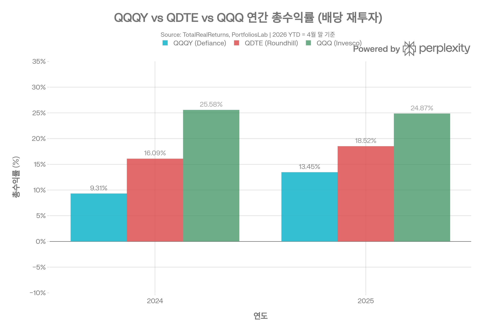
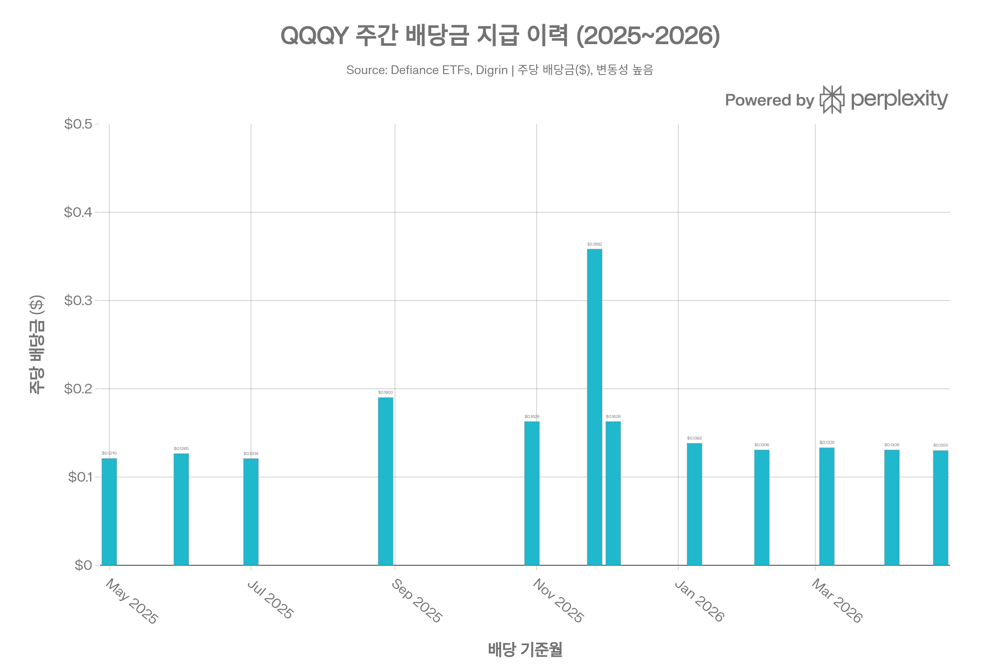
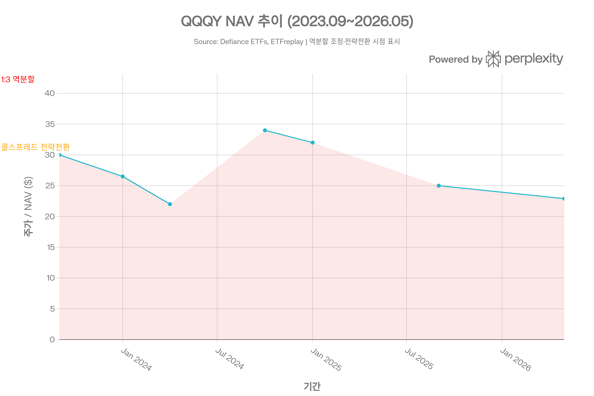

# QQQY (Defiance Nasdaq 100 Weekly Distribution ETF) 종합 분석 보고서
> <strong>작성 기준일:</strong> 2026년 5월 3일 | <strong>데이터 출처:</strong> Defiance ETFs 공식 사이트, Morningstar, PortfoliosLab, TotalRealReturns, SEC, Seeking Alpha 등

## ETF 분류

| 항목 | 내용 |
|------|------|
| <strong>최종 폴더</strong> | `ETF/Dividend Income/Option Income/Nasdaq-100/QQQY` |
| <strong>대분류</strong> | 배당·인컴 |
| <strong>하위 분류</strong> | 옵션 인컴 / Nasdaq-100 |
| <strong>핵심 전략</strong> | Nasdaq-100 옵션 포지션과 일일 콜스프레드 전략을 활용해 주간 분배와 옵션 프리미엄 수익을 추구 |
| <strong>운용 방식</strong> | 액티브 |
| <strong>레버리지·인버스 여부</strong> | 아니오 |
| <strong>옵션 인컴 전략 여부</strong> | 예 |
| <strong>분류 판단</strong> | Nasdaq-100 노출이 있지만 핵심 목적이 주간 분배와 옵션 프리미엄 인컴이므로 대표지수보다 `Dividend Income/Option Income/Nasdaq-100` 분류를 우선 적용한다. |

***
## 1. 기본 정보
| 항목 | 내용 |
|------|------|
| 티커 | QQQY |
| 전체명 | Defiance Nasdaq 100 Target 30 Weekly Distribution ETF |
| 운용사 | Defiance ETFs |
| 상장거래소 | NASDAQ |
| CUSIP | 88636J154[1] |
| 설정일 | <strong>2023년 9월 13일</strong>[1] |
| 운용기간 | 약 2년 8개월 |
| 순자산(AUM) | 약 <strong>\$1억 6,190만\~\$2억 0,580만</strong> (시기별 상이)[1][2][3] |
| 총 보수(Expense Ratio) | <strong>1.01%</strong>[1][4] |
| 운용 방식 | <strong>액티브 운용 (Active)</strong>[5] |
| 배당 주기 | <strong>주간배당 (Weekly)</strong>[1][6] |
| 목표 연간 배당률 | <strong>30% (NAV 기준, 비보장)</strong>[1][7] |
| 현재 NAV | \$22.89 (2026/04/28)[1] |
| NAV 프리미엄/디스카운트 | +0.07%[1] |
| 총 종목 수(홀딩) | 5개 (선물/옵션/현금 포함)[1] |
| 30일 SEC 수익률 | <strong>-1.00%</strong> (2026/03/31)[1] |

> <strong>⚠️ 중요 고지 (2026/05/01 19-a1 Notice):</strong> QQQY 분배금 중 <strong>83.97%가 자본 환급(Return of Capital)</strong>으로 추정됩니다. 자본 환급 포함 분배금은 ETF의 NAV와 거래가격을 감소시키며, 시간 경과에 따라 원금 손실을 야기합니다.[1]

***
## 2. 전략 구조 및 운용 역사
### 2.1 초기 전략 (2023.09 \~ 2025.05): 0DTE 풋옵션 매도
QQQY는 설정 초기에 <strong>나스닥-100 지수 옵션에 만기 당일 인더머니(ITM) 풋옵션을 매도(0DTE Put Write)</strong>하는 전략을 구사했습니다. 나스닥-100 지수가 보합 또는 상승할 경우 풋옵션이 무가치하게 만료되어 프리미엄 수익을 얻는 구조였습니다.[8][9]

- 초기 연간 배당률: <strong>66%</strong>까지 상승 (2024년 4월 기준)[8]
- 전략 취약점: 나스닥이 하락하거나 횡보해도 프리미엄 이상의 손실 발생 가능
- 분배금의 상당 부분이 자본 환급 형태여서 <strong>NAV가 지속 하락</strong>[8]
- <strong>2024년 8월 1일: 1:3 역분할(Reverse Split) 시행</strong>[10][11]
  - NAV가 약 \$13까지 하락하여 주가 관리를 위해 역분할 단행[10]
  - 역분할 후 주가는 일시적으로 \$39 수준으로 회복[12]

역분할에도 불구하고 전략적 문제는 해소되지 않았습니다. 풋옵션 매도 전략은 나스닥 강세장에서 수익을 제한하는 동시에 하락장에는 완전히 노출되는 비대칭 리스크 구조였습니다.[13][8]
### 2.2 현재 전략 (2025.05.27\~ ): 일일 콜스프레드 매도
2025년 5월 27일 Defiance는 QQQY를 <strong>리브랜딩하고 전략을 완전히 전환</strong>했습니다. 새로운 전략의 핵심은 다음과 같습니다:[8][12]

1. <strong>나스닥-100 지수 롱 포지션 유지:</strong> 나스닥-100 추종 ETF 또는 옵션으로 인덱스 장기 노출 확보[1][7]
2. <strong>일일 콜옵션 스프레드 매도:</strong> 매일 콜옵션 스프레드(콜 매수 + 더 높은 행사가 콜 매도)를 실행하여 프리미엄 수입 창출[1][8]
3. <strong>목표 배당률 하향 조정:</strong> 66% → <strong>30% 연간</strong> (현실적 수준으로 하향)[7][12]
4. <strong>상방 참여 확보:</strong> 콜 매수로 인덱스 상승 시 일정 수준까지 이익 참여 가능[7]

<strong>콜스프레드 구조의 장점(구전략 대비):</strong>
- 하방 무한 노출이 아닌 <strong>리스크 정의된(Defined Risk) 구조</strong>[1]
- 인덱스 상방 상승 시 일부 이익 참여 가능[7]
- NAV 침식 속도 감소 기대[12]

<strong>콜스프레드 구조의 한계:</strong>
- 강한 시장 상승 시 상방 수익 제한[13]
- 콜스프레드 전략은 <strong>낮은 변동성 횡보장</strong>에서 가장 유리하며, 급등락 시 불리[8]
- 여전히 NAV 침식 진행 중 (30일 SEC 수익률 -1.00%)[1]
### 2.3 현재 포트폴리오 구성 (2026/04/28 기준)
| 보유 자산 | 비중 |
|----------|------|
| NDX 12/18/2026 콜옵션 포지션 | 99.78%[1] |
| 현금 및 기타 | 0.20%[1] |
| First American Government Obligations Fund | 0.16%[1] |

QQQY는 개별 주식을 보유하지 않으며, 나스닥-100 지수(NDX) 옵션 포지션과 현금성 자산으로만 구성됩니다.[1]

***
## 3. 비용 구조
| 항목 | 내용 |
|------|------|
| 총 보수율(TER) | <strong>1.01%</strong>[1][4] |
| 30일 SEC 수익률 | <strong>-1.00%</strong>[1] |
| 30일 중간 호가 스프레드 | <strong>0.05%</strong>[1] |
| 포트폴리오 회전율 | 매우 높음 (일일 옵션 전략 특성) |

QQQY의 비용률 1.01%는 경쟁 ETF 대비 높은 편입니다. 특히 <strong>30일 SEC 수익률 -1.00%</strong>는 비용 차감 후 실질 옵션 프리미엄 수익이 사실상 마이너스임을 의미하며, 배당금의 83.97%가 자본 환급임을 고려하면 실질 수익 창출 능력에 심각한 의문이 제기됩니다.[1][14]
### 경쟁 주간 배당 ETF 비용 비교
| ETF | 운용사 | 전략 | 비용률 | 배당주기 |
|-----|--------|------|--------|---------|
| QDTE | Roundhill | 나스닥-100 0DTE 커버드콜 | 0.95%[14] | 주간 |
| <strong>QQQY</strong> | <strong>Defiance</strong> | <strong>나스닥-100 일일 콜스프레드</strong> | <strong>1.01%</strong> | <strong>주간</strong> |
| QDTY | YieldMax | 나스닥-100 0DTE 커버드콜 | \~0.99% | 주간 |
| QLDY | GraniteShares | LightningSpread™ | — | 2회/주 |

QQQY는 경쟁 주간 배당 ETF 중 가장 높은 비용률을 가지며, 전략 성과도 QDTE 대비 열세입니다.[14]

***
## 4. 유동성 평가
| 항목 | 내용 |
|------|------|
| 현재 주가 (2026/05/01) | \$23.22[15] |
| AUM | 약 \$1.62억\~\$2.06억[1][2] |
| 총 발행 주식 수 | 7,508,308주[1] |
| 52주 최저 / 최고 | \$19.92 / \$26.32[15] |
| 30일 중간 호가 스프레드 | <strong>0.05%</strong>[1] |
| 1년 펀드 플로우(자금 유입) | +\$5,511만\~\$5,602만[16][3] |

호가 스프레드 0.05%는 AUM 대비 양호한 수준이지만, 전략 변경 이후 AUM이 \$1.6억대로 감소 추세입니다. 주간 배당 ETF로서 소매 투자자 중심의 거래가 대부분이며, 기관 유동성은 제한적입니다.[1]

***
## 5. 성과 분석
### 기간별 수익률 (2026년 4월 28일 기준, NAV 기준)

| 기간 | QQQY NAV 총수익률 |
|------|-----------------|
| YTD | <strong>-6.29%</strong>[1] |
| 1개월 | -4.83%[1] |
| 3개월 | -6.29%[1] |
| 6개월 | -4.55%[1] |
| 설정 이후 누적 | <strong>+26.03%</strong>[1] |
### 연간 총수익률 (배당 재투자 기준)
| 연도 | QQQY | QDTE | QQQ | 비고 |
|------|------|------|-----|------|
| 2023(설정 이후) | +7.22% | — | — | 4개월 운용[17] |
| <strong>2024</strong> | <strong>+9.31%</strong> | <strong>+16.09%</strong> | <strong>+25.58%</strong> | QDTE/QQQ 대비 크게 저조[17] |
| <strong>2025</strong> | <strong>+13.45%</strong> | <strong>+18.52%</strong> | <strong>+24.87%</strong> | 전략전환 후에도 저조[17] |
| 2026 YTD | +0.07% | +0.06% | \~-5.20% | 2026 초반[17] |
| <strong>1Y 총수익률</strong> | <strong>+20.30%</strong> | <strong>+40.70%</strong> | — | QDTE와 큰 격차[18] |

QQQY의 총수익률(배당 재투자)은 설정 이후 연환산 +9.34%/년이며, QDTE(+16.44%/년)와의 누적 격차가 매우 큰 상황입니다. 특히 나스닥이 강세를 보인 2024\~2025년에 QQQ 대비 크게 저조한 점은 콜옵션 전략의 상방 제한 효과를 명확히 보여줍니다.[17]
### 위험 조정 성과 지표
| 지표 | QQQY | QDTE |
|------|------|------|
| 샤프 지수 | 2.36[14] | 2.55[14] |
| 소르티노 비율 | 2.89[14] | 3.33[14] |
| 칼마 비율 | 3.37[14] | 4.37[14] |
| 베타 | 0.87[2] | — |
| 표준편차 | 14.01%[19] | — |

QQQY의 베타 0.87은 나스닥 100 대비 낮은 시장 민감도를 나타내며, 이는 콜스프레드 전략이 하락 보호 효과를 제공함을 의미합니다. 그러나 모든 위험 조정 수익 지표에서 QDTE보다 열세입니다.[2][14]

***
## 6. 추종 성과 지표 (Tracking)
| 항목 | 내용 |
|------|------|
| 복제 방식 | 합성 복제 (옵션/파생상품 기반)[1] |
| NAV 프리미엄/디스카운트 | +0.07%[1] |
| 30일 중간 호가 스프레드 | 0.05%[1] |
| 30일 SEC 수익률 | <strong>-1.00%</strong>[1] |
| 지수 추종 목적 | 없음 (액티브 전략, 지수 추종 ETF 아님)[5] |

QQQY는 인덱스를 추종하는 패시브 ETF가 아닌 <strong>액티브 운용 펀드</strong>로, 전통적 추적 오차 개념이 적용되지 않습니다. NAV 대비 시장가 괴리율 +0.07%는 좁은 수준이지만, <strong>30일 SEC 수익률 -1.00%</strong>는 분배금이 실제 수익이 아닌 자본 환급 비중이 압도적임을 보여주는 핵심 지표입니다.[1][5]

***
## 7. 배당 정보

### 배당 개요
| 항목 | 내용 |
|------|------|
| 배당 주기 | <strong>주간 (매주)</strong>[1][6] |
| 목표 연간 배당률 | <strong>30%</strong> (비보장)[1] |
| 표시 배당 수익률 (포워드) | 약 30.38%[6] |
| TradingView 배당률 | 45.91%\~63.87% (기준 시점별 상이)[16][3] |
| 자본 환급 비율 (2026/05/01) | <strong>83.97%</strong>[1] |
| 30일 SEC 수익률 | <strong>-1.00%</strong>[1] |
### 주요 주간 배당금 이력 (2025\~2026)

| 기준일 | 주당 배당금 | 비고 |
|--------|-----------|------|
| 2026-04-24 | \$0.1300[3] | 최근 |
| 2026-04-03 | \$0.1306[3] | |
| 2026-03-06 | \$0.1331[3] | |
| 2026-02-06 | \$0.1306[3] | |
| 2026-01-08 | \$0.1382[20] | |
| 2025-12-04 | \$0.1628[21] | |
| <strong>2025-11-26</strong> | <strong>\$0.3582</strong>[21] | 변동성 급등 시 배당 급증 |
| 2025-10-30 | \$0.1628[21] | |
| 2025-08-28 | \$0.1900 | |
| 2025-07 | \$0.1209 | 전략전환 직후 |
| 2025-06 | \$0.1265 | |

표시 배당률이 높아 보이지만, 2026년 5월 기준 분배금의 <strong>83.97%가 실질 수익이 아닌 자본 환급</strong>입니다. 즉 \$0.13/주 배당금 중 약 \$0.109가 투자자 자신의 원금을 돌려주는 것입니다. 2025년 11월 변동성 급등 시 \$0.3582를 지급한 반면, 낮은 변동성 구간에서는 \$0.12\~\$0.13 수준으로 편차가 큽니다.[1][21]
---
## 8. NAV 침식 분석
QQQY의 가장 심각한 문제는 <strong>지속적인 NAV 하락(NAV Erosion)</strong>입니다.[13][22]

| 기간 | 역분할 조정 NAV | 누적 변화 |
|------|--------------|---------|
| 2023-09 (설정 초기) | \~\$30 | — |
| 2024-07 (역분할 직전) | \~\$13 | <strong>-56.7%</strong> |
| 2024-08 (1:3 역분할 후) | \~\$39 | 역분할 조정 |
| 2025-01 | \~\$32 | |
| 2025-05 (전략전환) | \~\$28 | |
| 2026-04 | <strong>\$22.89</strong> | 역분할 이후 -41.3% |

<strong>역분할 전 실제 가격 기준:</strong> \$30(설정) → \$13(2024/07) → 1:3 역분할로 \$39 환산 → \$22.89(현재)[1][10]

연간 배당률 30%가 실질 수익이 아닌 자본 환급에 의존하는 구조에서는 <strong>배당금 수령액 + NAV 하락분 = 실질 수익(혹은 손실)</strong>이 됩니다. 아무리 높은 배당을 받더라도 NAV가 그 이상 하락하면 총수익은 마이너스입니다.[13]

***
## 9. 리스크 요소
### 주요 리스크 요약
| 리스크 유형 | 내용 |
|-----------|------|
| <strong>NAV 침식 리스크</strong> | 장기 보유 시 배당을 상회하는 NAV 하락 가능[13][22] |
| <strong>자본 환급 리스크</strong> | 배당의 83.97%가 원금 반환이므로 실질 수익 아님[1] |
| <strong>배당 변동성 리스크</strong> | 주별 배당금이 \$0.12\~\$0.36으로 큰 편차[21] |
| <strong>상방 제한 리스크</strong> | 콜스프레드 전략으로 나스닥 강세 시 수익 제한[7] |
| <strong>전략 지속가능성 리스크</strong> | 역분할 이력, 전략 전환 등 근본적 실행 문제[10] |
| <strong>낮은 변동성 리스크</strong> | VIX 하락 시 프리미엄 감소 → 배당금 급감[23] |
| <strong>과세 리스크</strong> | 자본 환급은 취득 단가를 낮춰 향후 과세 이연[24] |
| <strong>추가 역분할 리스크</strong> | NAV 추가 하락 시 역분할 재실시 가능[12] |

<strong>구조적 딜레마:</strong> QQQY의 콜스프레드 전략은 보합\~완만한 상승 시장에서는 프리미엄 수입을 창출하지만, 나스닥 강세 시에는 상방이 막히고 하락 시에는 지수 손실을 고스란히 받습니다. 30% 목표 배당률을 유지하려면 시장 환경에 관계없이 프리미엄 수입이 지속되어야 하는데, 이는 필연적으로 더 공격적인 옵션 매도 → 더 높은 NAV 침식의 악순환을 야기합니다.[13][8]

***
## 10. 경쟁 ETF 종합 비교
| 항목 | <strong>QQQY</strong> | QDTE | QQQI | IQQQ |
|------|----------|------|------|------|
| 운용사 | Defiance | Roundhill | NEOS | ProShares |
| 전략 | 일일 콜스프레드 | 0DTE 커버드콜 | 세금효율 커버드콜 | 일일 커버드콜(스왑) |
| 배당주기 | <strong>주간</strong> | <strong>주간</strong> | 월간 | 월간 |
| 비용률 | 1.01% | 0.95% | 0.68% | 0.55% |
| AUM | \~\$1.6억 | — | 대규모 | \~\$3.8억 |
| 목표 배당률 | 30% | \~30% | \~14% | \~8.77% |
| 2024 총수익률 | 9.31% | 16.09% | 19.84% | 13.50% |
| 2025 총수익률 | 13.45% | 18.52% | 18.63% | 17.12% |
| 1Y 총수익률 | 20.30% | 40.70% | — | 19.31% |
| 샤프(1Y) | 2.36 | 2.55 | — | — |
| NAV 침식 여부 | <strong>심각</strong> | 낮음 | 낮음 | 보통 |
| 자본환급 비율 | <strong>83.97%</strong> | 낮음 | 낮음 | 일부 |
| 역분할 이력 | <strong>있음 (2024.08)</strong> | 없음 | 없음 | 없음 |

***
## 11. 투자 요약 및 핵심 결론
QQQY는 연간 30% 배당을 표방하지만, <strong>배당금의 83.97%가 자본 환급</strong>이어서 실질 현금 창출 능력이 매우 제한적입니다. 2024\~2025년 총수익률이 각각 9.31%, 13.45%로 QQQ 대비 크게 저조하며, 설정 이후 1:3 역분할을 시행하고 전략 자체를 전면 변경할 만큼 구조적 결함이 있었습니다. 현재의 콜스프레드 전략은 기존 풋옵션 매도보다 안정적이지만, 30일 SEC 수익률 -1.00%에서 보듯 비용 차감 후 실질 옵션 수익은 마이너스입니다.[1][17][10][12]

<strong>QQQY의 핵심 문제:</strong>
- 고수익 표면 이면의 <strong>원금 소각형 배당 구조</strong>[13]
- 2년 반 운용에서 <strong>단 한 번의 역분할과 전략 전면 교체</strong>라는 전례 없는 이력[10]
- 동일 전략의 QDTE 대비 낮은 수익에 높은 비용[14]
- 장기 보유 시 NAV 지속 하락이 배당 수익을 잠식할 가능성[22]

<strong>유일한 활용 시나리오:</strong> 고변동성 단기 시장 환경(VIX 20 이상)에서 주간 현금흐름이 절실히 필요한 투자자가 매우 <strong>단기간(수 주 이내)</strong> 포지션을 취하는 경우에 한해 고려할 수 있습니다. 장기 보유는 NAV 침식으로 인한 원금 손실이 거의 불가피합니다.[23][13]
