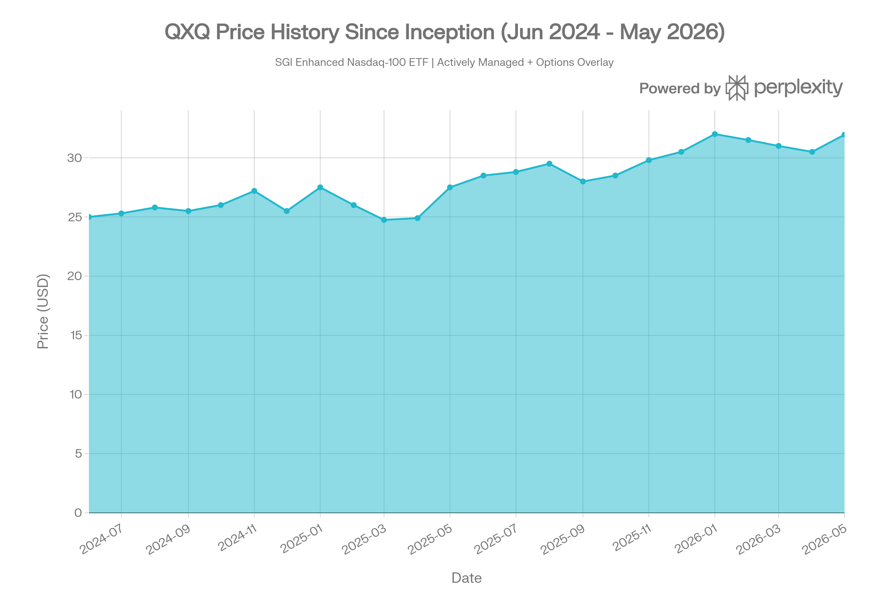
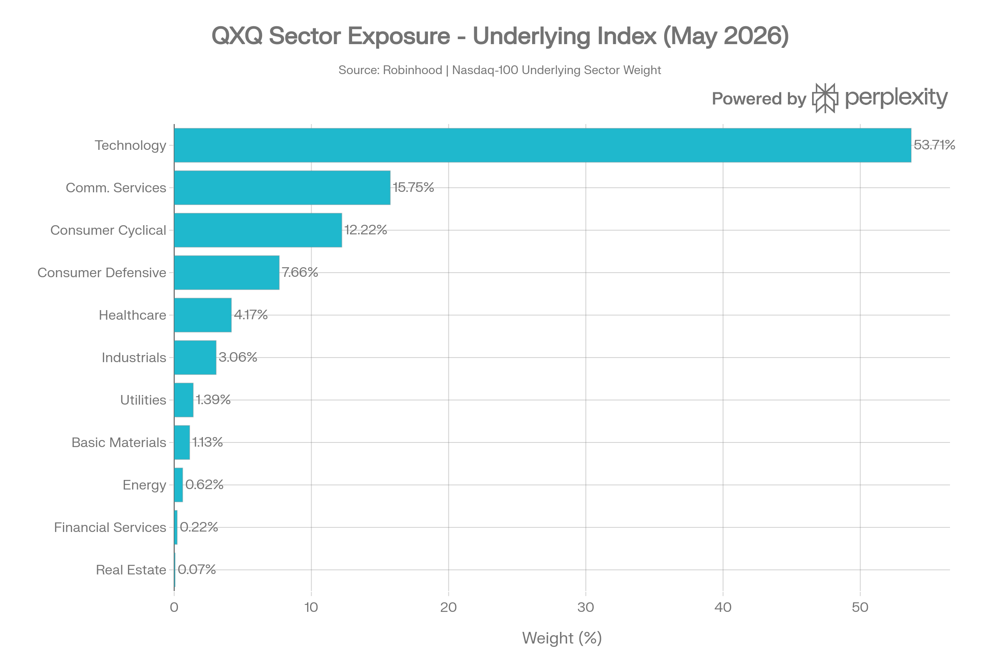
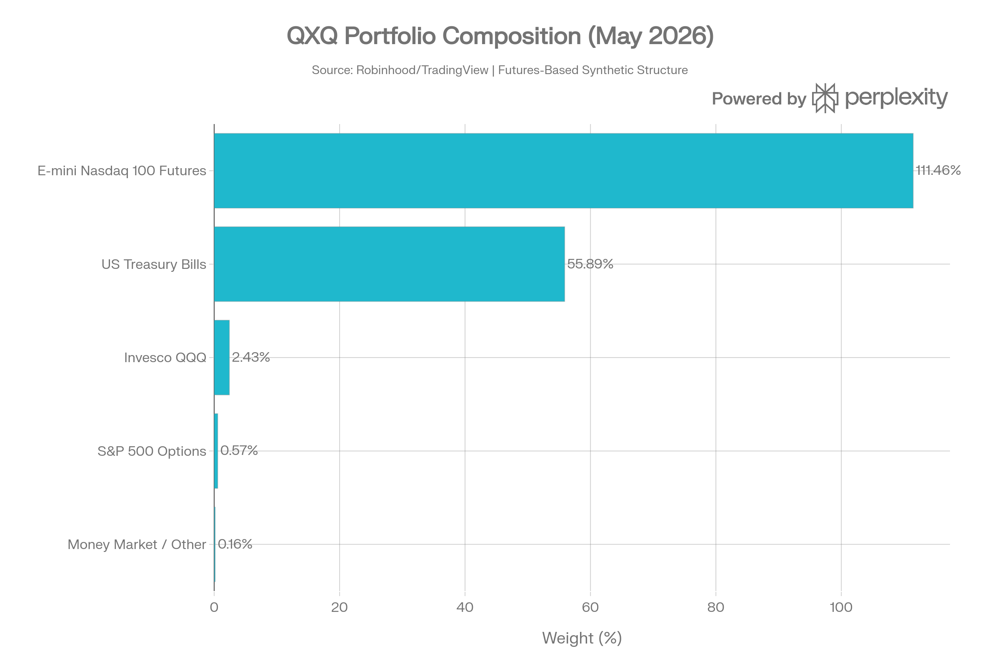
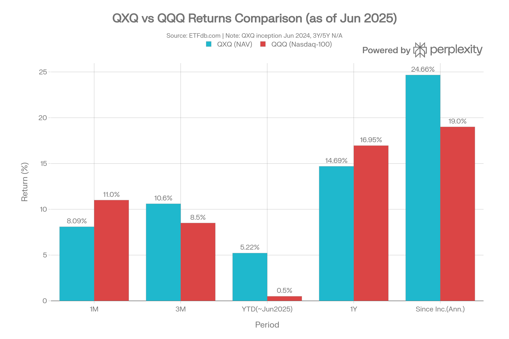
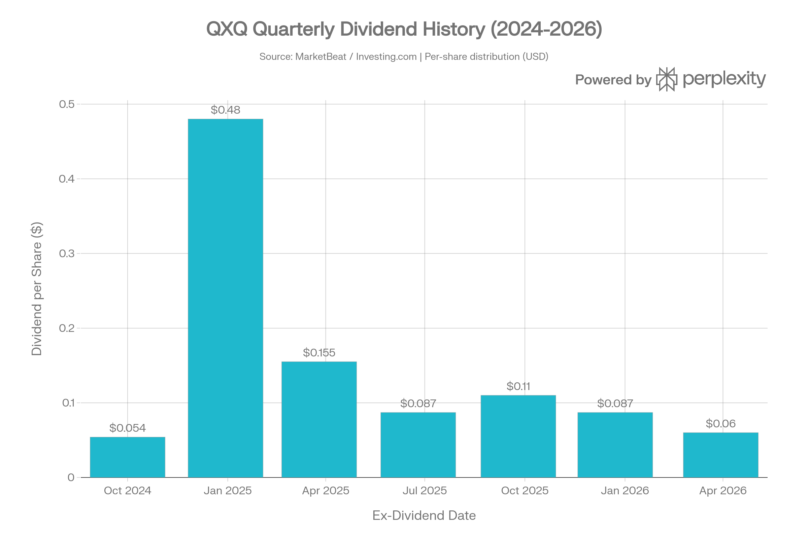

# QXQ (SGI Enhanced Nasdaq-100 ETF) 종합 분석 보고서
> <strong>작성일</strong>: 2026년 5월 25일 기준 데이터 | <strong>운용사</strong>: Summit Global Investments LLC

## ETF 분류

| 항목 | 내용 |
|------|------|
| <strong>최종 폴더</strong> | `ETF/Dividend Income/Option Income/Nasdaq-100/QXQ` |
| <strong>대분류</strong> | 배당·인컴 |
| <strong>하위 분류</strong> | 옵션 인컴 / Nasdaq-100 |
| <strong>핵심 전략</strong> | Nasdaq-100 선물로 핵심 노출을 만들고 1\~7일 만기 초단기 풋·콜 옵션 매도 오버레이로 추가 프리미엄 수익을 추구 |
| <strong>운용 방식</strong> | 액티브 |
| <strong>레버리지·인버스 여부</strong> | 펀드 자체는 레버리지 ETF가 아니지만 선물 명목 노출이 NAV를 초과할 수 있음 |
| <strong>옵션 인컴 전략 여부</strong> | 예 |
| <strong>분류 판단</strong> | Nasdaq-100 익스포저가 있지만 핵심 전략은 초단기 옵션 오버레이를 통한 파생상품 인컴 창출이므로 대표지수보다 `Dividend Income/Option Income/Nasdaq-100` 분류를 우선 적용한다. |

***
## 1. 기본 정보
QXQ는 <strong>Summit Global Investments LLC(SGI)</strong>가 운용하는 <strong>액티브 관리형 파생상품 인컴 ETF</strong>로, Nasdaq-100 지수의 수익률을 선물·옵션을 통해 복제하면서 초단기 풋·콜 옵션 매도 전략을 통한 추가 수익(Enhanced Yield) 창출을 동시에 추구한다.

| 항목 | 내용 |
|------|------|
| <strong>정식 명칭</strong> | SGI Enhanced Nasdaq-100 ETF |
| <strong>법인 구조</strong> | The RBB Fund, Inc. (오픈엔드 펀드) |
| <strong>티커</strong> | QXQ (NASDAQ) |
| <strong>설정일</strong> | 2024년 6월 14일 |
| <strong>운용 기간</strong> | 약 11개월 (2024년 6월\~현재) |
| <strong>추종 지수</strong> | 없음 (No Underlying Index — 완전 액티브 관리) |
| <strong>투자 목표</strong> | Nasdaq-100 수익률 달성 + 초단기 옵션 전략 통한 추가 수익 |
| <strong>운용사(Advisor)</strong> | Summit Global Investments LLC |
| <strong>유통사(Distributor)</strong> | Quasar Distributors LLC |
| <strong>상장거래소</strong> | NASDAQ |
| <strong>순자산(AUM)</strong> | 약 $87\~90M (2026년 5월 기준) |
| <strong>발행 주식 수</strong> | 약 2.73M주 |
| <strong>관리 스타일</strong> | 액티브(Active) |
| <strong>카테고리</strong> | 파생상품 인컴(Derivative Income) |
| <strong>총 보수</strong> | 0.98% |
| <strong>분배 주기</strong> | 분기별(Quarterly) |
| <strong>현재가</strong> | $31.95 (2026.05.22 기준) |
| <strong>P/E 비율</strong> | 47.05배 |

***
## 2. 운용 전략 (투자 방법론)
QXQ는 일반적인 ETF와 근본적으로 다른 구조를 지닌 <strong>파생상품 합성 전략 ETF</strong>다. 개별 Nasdaq-100 구성 주식을 직접 매수하는 대신, 세 가지 핵심 구성요소를 결합한다:
### 핵심 구성 요소
<strong>① Nasdaq-100 익스포저 (Core Exposure)</strong>
- E-mini Nasdaq-100 선물(Futures) 계약 + 마이크로 E-mini 선물을 통해 Nasdaq-100 지수 노출을 확보
- 필요 시 Invesco QQQ(QQQ) ETF를 소량 편입하여 보완
- 총 노셔널 익스포저(명목 노출)는 NAV를 초과할 수 있음(e.g., E-mini Futures 111.46%)

<strong>② 담보 자산 (Collateral)</strong>
- 미국 단기 국채(US Treasury Bills, T-Bills)를 선물 증거금 담보로 보유
- 포트폴리오의 약 55\~94%를 T-Bills로 유지

<strong>③ 옵션 오버레이 전략 (Options Overlay — SGI의 Managed Risk Approach™)</strong>
- S&P 500, Nasdaq-100 또는 기타 광범위 벤치마크 지수를 기초자산으로 하는 <strong>풋 및 콜 옵션을 매도(Writing)</strong>
- 만기 <strong>1\~7일 이내의 초단기 옵션</strong> 활용 — 장기 옵션 대비 동일 기간 더 많은 프리미엄 수취 가능
- <strong>深 외가격(Deep Out-of-the-Money) 행사가격</strong> 선택으로 기초자산 급등 시 수익 참여 제한을 최소화
- 동적 헤징(Dynamic Hedging) 전략으로 리스크를 능동적으로 관리

이 전략의 핵심 차별점은 <strong>"초단기(1\~7일 만기) 옵션 매도"</strong>다. JEPQ(월별 만기)나 QYLD(월별 콜 매도) 같은 경쟁 상품들이 장기 옵션을 활용하는 데 반해, QXQ는 일/주 단위 초단기 옵션을 활용해 더 높은 프리미엄 수취를 노린다.

*▲ QXQ 설정 이후 가격 추이 (2024.06\~2026.05): 52주 저가 $24.75에서 최근 $31.95 수준으로 회복*

***
## 3. 추종 성과 지표
### 추적오차 및 NAV 괴리율
QXQ는 <strong>공식 추종 지수가 없는 순수 액티브 ETF</strong>다. 따라서 전통적인 의미의 추적오차(Tracking Error)는 적용되지 않으며, 대신 Nasdaq-100 지수 대비 초과/저조 성과를 분석한다.

| 항목 | 수치 |
|------|------|
| <strong>NAV 대비 시장가격 괴리율</strong> | +0.16\~+0.2% (소폭 프리미엄) |
| <strong>30-Day Yield(SEC)</strong> | 1.27% |
| <strong>1개월 NAV 수익률</strong> | +4.31% |
| <strong>1개월 시장가 수익률</strong> | +4.62% |
| <strong>1년 NAV 수익률</strong> | +5.74% |

QXQ는 현재 <strong>소폭 프리미엄 상태</strong>로 거래되고 있으며, 시장가격과 NAV 간 차이가 0.2% 내외로 타이트하게 유지되고 있다.

***
## 4. 비용 구조
### 보수 및 비용
| 항목 | 수치 |
|------|------|
| <strong>총 보수(Gross Expense Ratio)</strong> | 0.98% |
| <strong>순 보수(Net Expense Ratio)</strong> | 0.98% |
| <strong>비용 감면</strong> | 없음 |
| <strong>최대 단기 자본이득세율</strong> | 39.60% |
| <strong>최대 장기 자본이득세율</strong> | 20.00% |
| <strong>분배금 세금 처리</strong> | 적격 배당(Qualified Dividends) |

0.98%의 보수는 파생상품 전략을 활용하는 옵션 인컴 ETF 범주에서는 평균적인 수준이다. 비교 상품별 보수를 살펴보면:
### 경쟁 ETF 비용 비교
| ETF | 전략 | 보수 | AUM |
|-----|------|------|-----|
| <strong>QXQ</strong> | 나스닥-100 선물 + 초단기 옵션 오버레이 | <strong>0.98%</strong> | \~$87\~90M |
| QQQ | 나스닥-100 패시브 추종 | 0.20% | \~$335B |
| JEPQ | 나스닥-100 + ELN 옵션 전략 | 0.35% | \~$25B |
| QQQI | 나스닥-100 + 콜 옵션 매도(월간) | 0.68% | \~$12.3B |
| QYLD | 나스닥-100 콜 매도 전략 | 0.60% | \~$8B |

QXQ의 0.98% 보수는 경쟁 상품 대비 높은 편이다. 그러나 SGI는 독자적인 초단기 옵션 매도 방법론(Managed Risk Approach™)에 따른 비용임을 강조한다.
### 포트폴리오 회전율
공식 회전율은 공시되지 않았으나, 1\~7일 만기 초단기 옵션을 지속적으로 매도·갱신하는 전략 특성상 <strong>매우 높은 포트폴리오 회전율</strong>이 예상된다. 이로 인한 거래 비용은 0.98% 보수 외 추가 비용 발생 요인이 될 수 있다.

***
## 5. 유동성 평가
### 거래량 및 거래대금
| 항목 | 수치 |
|------|------|
| <strong>일평균 거래량(30일)</strong> | 약 10,800\~23,700주 |
| <strong>최근 일일 거래량</strong> | 2,860\~9,760주 |
| <strong>AUM</strong> | 약 $87\~90M |
| <strong>발행 주식 수</strong> | 약 2.73M주 |
| <strong>1년 펀드 플로우</strong> | +$26.97M (자금 유입) |
| <strong>52주 고가</strong> | $32.99 |
| <strong>52주 저가</strong> | $24.75 |
| <strong>5일 변동성</strong> | 32.43% |
| <strong>20일 변동성</strong> | 12.39% |
| <strong>200일 변동성</strong> | 32.86% |

AUM $87\~90M 규모는 소형 ETF에 해당하지만, 1년간 +$26.97M의 지속적인 자금 유입이 이루어지고 있어 성장 모멘텀이 있다. 2024년 6월 설정 시점 대비 빠른 성장세를 보이고 있다.

***
## 6. 포트폴리오 구성
QXQ는 개별 주식이 아닌 <strong>파생상품(선물·옵션)과 단기 국채</strong>로 포트폴리오를 구성한다. 이는 일반 주식형 ETF와 근본적으로 다른 구조다.
### 보유 자산 구성 (2026년 5월 기준)
| 자산 | 비중 | 역할 |
|------|------|------|
| E-mini Nasdaq-100 선물 (Jun 2026) | 111.46% | 핵심 지수 노출 확보 |
| 미국 단기 국채 (T-Bills) | 55.89% | 선물 증거금 담보 |
| Invesco QQQ (QQQ) | 2.43% | 보완적 지수 노출 |
| First American 머니마켓 | 0.57% | 유동성 관리 |
| S&P 500 풋 옵션 (만기 May/Jun 2026) | <0.01\~0.01% | 옵션 오버레이 전략 |
| 마이크로 E-mini 선물 | 0.13% | 미세 조정 |
| 현금/기타 | \~-69.80% (증거금 상계) | 증거금 차감 |

*▲ QXQ 포트폴리오 구성 (2026.05): 선물 기반 합성 구조*

> ⚠️ <strong>구조 해설</strong>: E-mini 선물 비중이 111.46%로 표시되는 것은 선물의 레버리지 특성 때문이다. 실제로는 T-Bills를 담보로 맡기고 선물 계약을 통해 약 1배 수준의 Nasdaq-100 노출을 확보하는 구조다. 총 명목 노출은 Nasdaq-100의 약 1배 수준이며, 레버리지 상품이 아니다.
### 기초 지수 섹터 노출도 (Underlying Nasdaq-100 기준)
| 섹터 | 비중 |
|------|------|
| 기술(Technology) | 53.71% |
| 커뮤니케이션 서비스 | 15.75% |
| 경기소비재(Consumer Cyclical) | 12.22% |
| 경기방어재(Consumer Defensive) | 7.66% |
| 헬스케어 | 4.17% |
| 산업재 | 3.06% |
| 유틸리티 | 1.39% |
| 원자재 | 1.13% |
| 에너지 | 0.62% |
| 금융 | 0.22% |
| 부동산 | 0.07% |

*▲ QXQ 기초 나스닥-100 지수 섹터 노출도 (2026.05 기준)*

기술 섹터 53.71%, 커뮤니케이션 서비스 15.75%로 <strong>합산 69.46%</strong>가 기술·미디어 영역에 집중된다. 이는 Nasdaq-100 지수의 섹터 구성을 그대로 반영한 결과다.
### 상위 10개 종목 노출 (기초 지수 기준, QXQ 선물 포지션 통해 간접 노출)

QXQ는 직접 개별주식을 보유하지 않지만, Nasdaq-100 선물을 통해 아래 상위 종목에 간접 익스포저를 가진다:

| 순위 | 종목 | Nasdaq-100 비중(약) |
|------|------|-------------------|
| 1 | NVIDIA (NVDA) | \~8.56% |
| 2 | Apple (AAPL) | \~7.41% |
| 3 | Microsoft (MSFT) | \~5.08% |
| 4 | Amazon (AMZN) | \~5.0% |
| 5 | Meta Platforms (META) | \~4.8% |
| 6 | Alphabet A (GOOGL) | \~4.5% |
| 7 | Alphabet C (GOOG) | \~4.2% |
| 8 | Tesla (TSLA) | \~3.5% |
| 9 | Broadcom (AVGO) | \~3.0% |
| 10 | Costco (COST) | \~2.5% |
### 리밸런싱 주기
- 선물 포지션: <strong>분기별</strong> 롤오버(Roll-over) — 만기 도래 선물을 차기 만기 선물로 교체
- 옵션 오버레이: <strong>매일\~주간</strong> 단위 만기 도래 옵션 교체(1\~7일 초단기)

***
## 7. 성과 분석
### 기간별 수익률
QXQ는 2024년 6월 14일 설정으로, 3년/5년 실적 데이터가 없다.

| 기간 | QXQ NAV | QXQ 시장가 | QQQ(Nasdaq-100) |
|------|---------|----------|----------------|
| 1개월 | +8.09% | +8.09% | +11% |
| 3개월 | +10.60% | +10.60% | +8.5%(추정) |
| YTD(\~Jun2025) | +5.22% | +5.22% | +0.5%(추정) |
| 1년 | +14.69% | +14.69% | +16.95% |
| 설정 이후(연환산) | <strong>+24.66%</strong> | - | \~19%(QQQ 동기간) |

*▲ QXQ vs QQQ 기간별 수익률 비교 (2025.06 기준): 설정 이후 연환산 기준 QXQ +24.66%로 QQQ 상회*

설정 이후 연환산 수익률 +24.66%는 동기간 QQQ 대비 약 5\~6%p 초과 성과를 달성한 것으로 추정된다. 다만 설정 기간이 약 1년 남짓으로 짧아, 다양한 시장 사이클에 걸친 지속 가능성 판단에는 더 많은 데이터가 필요하다.
### 벤치마크 대비 성과 평가
- 1년 수익률 +14.69%는 QQQ 1년 +16.95% 대비 약 2.26%p <strong>저조</strong>
- 반면 1개월, 3개월 단기 기간에서는 QQQ 대비 우수하거나 유사한 성과 기록
- 최대 낙폭(Maximum Drawdown): <strong>-22.52%</strong>
- 1년 펀드 플로우 +$26.97M으로 투자자 관심 증가 중
### 변동성
| 지표 | 수치 |
|------|------|
| <strong>5일 변동성</strong> | 32.43% |
| <strong>20일 변동성</strong> | 12.39% |
| <strong>50일 변동성</strong> | 20.44% |
| <strong>200일 변동성</strong> | 32.86% |
| <strong>표준편차(일별)</strong> | 1.45% |
| <strong>최대 낙폭(MDD)</strong> | -22.52% |
| <strong>베타</strong> | 1.12x |

***
## 8. 배당 정보
QXQ의 배당 전략은 초단기 옵션 프리미엄 수익을 분기별로 분배하는 구조다. 그러나 <strong>배당 규모의 극심한 변동성</strong>이 핵심 특징이자 위험이다.
### 배당 이력 (설정 이후 전체)
| 배당락일 | 지급일 | 주당 배당금 | 연간 환산 수익률 |
|---------|--------|-----------|--------------|
| 2024-10-01 | 2024-10-02 | $0.054 | 0.84% |
| 2024-12-30 | 2024-12-31 | <strong>$0.480</strong> | 7.58% |
| 2025-03-26 | 2025-03-28 | $0.155 | 2.42% |
| 2025-06-25 | 2025-06-27 | $0.087 | — |
| 2025-09-25 | 2025-09-29 | $0.110 | 1.43% |
| 2025-12-23 | 2025-12-24 | <strong>$4.650</strong> | <strong>67.11%</strong> |
| 2026-03-30 | 2026-03-31 | $0.060 | 0.97% |

*▲ QXQ 분기별 배당 이력: 2025년 12월 $4.65의 대규모 특별 배당 발생*
### 배당의 특이사항
<strong>2025년 12월 대형 특별배당 ($4.65/주)</strong>

2025년 12월 23일 배당락일 기준으로 주당 $4.65의 대규모 배당이 발생했다. 이는 통상적인 분기 배당($0.06\~$0.48) 대비 약 10\~77배에 달하는 이례적 규모로, 해당 분기 옵션 프리미엄 수익 또는 자본이득 분배로 추정된다.

그러나 이런 대형 배당 지급 시 <strong>NAV가 동일 금액만큼 하락</strong>하므로, 총수익(Total Return) 관점에서는 특별히 유리하지 않다. 다만 배당소득 형태의 현금 흐름을 선호하는 투자자에게는 의미가 있다.
### 현재 배당 수익률
- <strong>연간 배당(TTM)</strong>: $4.90\~$5.00/주 (MarketBeat 기준)
- <strong>배당 수익률</strong>: 15.34% — 단, 2025년 12월 대형 배당 포함 효과
- <strong>정상화 배당 수익률</strong>: 약 1.5\~2.5% 수준 (2025년 12월 특별배당 제외)
- <strong>배당 성향(Payout Ratio)</strong>: 115.10%\~122.11% — 즉, 수익 이상의 배당 지급 발생, 원금 손실 가능성 포함

***
## 9. 리스크 요소
### 베타 계수
- 시장 대비 베타: <strong>1.12x</strong>
- 기초 자산이 Nasdaq-100이므로 S&P 500 대비 높은 성장주 집중 노출
### 옵션 전략 특유의 리스크
<strong>① 상방 수익 제한 위험(Cap on Upside)</strong>
심 외가격(Deep OTM) 콜 옵션을 매도하는 전략은, 시장이 콜 행사가격 이상으로 급등할 경우 초과 수익 참여가 제한될 수 있다. 짧은 만기(1\~7일)로 이 위험이 다소 완화되지만 완전히 제거되지는 않는다.

<strong>② 극단적 시장 변동성 리스크</strong>
초단기 옵션은 VIX(변동성 지수) 급등 시 프리미엄이 급격히 증가하지만, 동시에 펀드가 매도한 옵션의 손실도 커진다. 2025년 4월 관세 충격 같은 급락 국면에서 옵션 매도 전략이 NAV에 부정적으로 작용할 수 있다.

<strong>③ 배당 지속성 불확실</strong>
분기별 배당금이 $0.06\~$4.65로 극심하게 변동하며, 일부 분기는 수익을 초과한 배당(원금 잠식)이 발생한다. 배당 수익률 15.34%의 대부분은 2025년 12월 특별배당에 기인하므로, 안정적 인컴을 기대하는 투자자에게는 부적합하다.

<strong>④ 운용 기간 부재 리스크</strong>
2024년 6월 설정으로 운용 이력이 약 11개월에 불과하다. 2022년 같은 금리 급등·성장주 급락 국면이나 2020년 팬데믹 급락 국면에서의 성과를 검증할 수 없다.

<strong>⑤ 카운터파티 및 롤오버 리스크</strong>
선물 계약의 분기별 롤오버 시 선물 콘탱고(Contango) 또는 백워데이션(Backwardation) 상황에 따른 롤 비용이 발생할 수 있다.

<strong>⑥ 소규모 AUM 및 유동성 리스크</strong>
AUM $87\~90M, 일평균 거래량 약 1만 주는 소규모 ETF 기준에 해당한다. 향후 자금 유출이 지속될 경우 펀드 청산 리스크가 발생할 수 있다.
### 상관계수
| 비교 자산 | QXQ와의 상관성 |
|----------|-------------|
| Nasdaq-100 (QQQ) | 높은 양의 상관 (기초 자산이 동일) |
| S&P 500 | 높은 양의 상관 (베타 1.12) |
| 채권(BND) | 낮은 상관 |
| 변동성 지수(VIX) | 음의 상관 (옵션 매도 전략으로 변동성 급등 시 추가 손실 위험) |

***
## 10. 경쟁 ETF 비교
QXQ는 Nasdaq-100 기반 옵션 인컴 ETF 카테고리에 속하며, 다수의 유사 전략 경쟁 상품이 있다.

| 항목 | QXQ | JEPQ | QQQI | QYLD | QQQ |
|------|-----|------|------|------|-----|
| <strong>전략</strong> | 나스닥-100 선물 + 초단기(1-7일) 풋·콜 매도 | 나스닥-100 주식 + ELN 옵션 | 나스닥-100 + 콜 매도(월간) | 나스닥-100 콜 매도(월간) | 패시브 지수 추종 |
| <strong>보수</strong> | <strong>0.98%</strong> | 0.35% | 0.68% | 0.60% | 0.20% |
| <strong>AUM</strong> | \~$90M | \~$25B | \~$12.3B | \~$8B | \~$335B |
| <strong>배당 수익률</strong> | 15.34%(특별 포함) | \~10% | 월배당 | \~12% | \~0.4% |
| <strong>설정일</strong> | 2024.06 | 2022.05 | 2024.01 | 2013.12 | 1999.03 |
| <strong>상방 수익 제한</strong> | 낮음(초단기 OTM 옵션) | 중간 | 높음 | 높음 | 없음 |
| <strong>관리 방식</strong> | 액티브 | 액티브 | 패시브 | 패시브 | 패시브 |

QXQ의 주요 경쟁 우위는 <strong>초단기 옵션 만기(1\~7일)</strong>를 통한 높은 프리미엄 수취와 <strong>심 OTM 행사가</strong>를 통한 상방 수익 참여 극대화이다. 반면 0.98%의 높은 보수, 소규모 AUM, 짧은 운용 이력이 약점이다.

***
## 11. 투자자 고려사항 및 총평
<strong>QXQ는 Nasdaq-100 노출을 유지하면서 초단기 옵션 프리미엄으로 추가 수익을 추구하는 전략적 액티브 ETF다.</strong> 전통 커버드콜 ETF(QYLD, JEPQ 등)와 달리 일주일 미만의 초단기 옵션을 활용하여 상방 수익 제한을 최소화하는 동시에 더 많은 프리미엄 수취를 목표로 한다.
### 핵심 장·단점
| 구분 | 내용 |
|------|------|
| <strong>장점</strong> | 초단기 옵션으로 상방 제한 최소화, 설정 이후 QQQ 초과 성과(+24.66% 연환산), 1년 자금 유입 +$26.97M |
| <strong>단점</strong> | 높은 보수(0.98%), 배당 변동성 극심($0.06\~$4.65), 운용 이력 1년 미만, 소규모 AUM \~$90M |
### 투자 적합 프로파일
- <strong>적합</strong>: Nasdaq-100 노출을 유지하면서 옵션 프리미엄 추가 수익을 원하는 투자자, JEPQ·QQQI 등 옵션 인컴 ETF 대안 탐색자, 단기\~중기 전술적 포지션 구축
- <strong>부적합</strong>: 안정적 배당 수익 추구 투자자, 운용 이력을 중시하는 장기 투자자, 보수 민감 투자자(QQQ 대비 4.9배 비싼 보수)
### 핵심 지표 요약
| 항목 | 평가 |
|------|------|
| 전략 혁신성 | ⭐⭐⭐⭐⭐ (초단기 옵션 매도로 차별화) |
| 비용 효율성 | ⭐⭐ (0.98%, 경쟁 대비 높음) |
| 유동성 | ⭐⭐ (소규모 AUM $90M, 일 1만주) |
| 설정 이후 성과 | ⭐⭐⭐⭐ (+24.66% 연환산) |
| 배당 안정성 | ⭐ (극심한 분기별 변동) |
| 운용 이력 | ⭐ (약 11개월, 데이터 부족) |
| 상방 수익 제한 | 🟡 낮음 (초단기 OTM 특성상 최소화) |
| 옵션 전략 리스크 | 🟠 주의 (변동성 급등 시 손실 위험) |

> ⚠️ <strong>면책 조항</strong>: 본 보고서는 정보 제공 목적으로 작성되었으며, 투자 권고로 해석되어서는 안 된다. 모든 투자에는 원금 손실 가능성이 있으며, 파생상품 전략 ETF는 추가적인 복잡성과 리스크를 내포한다.
