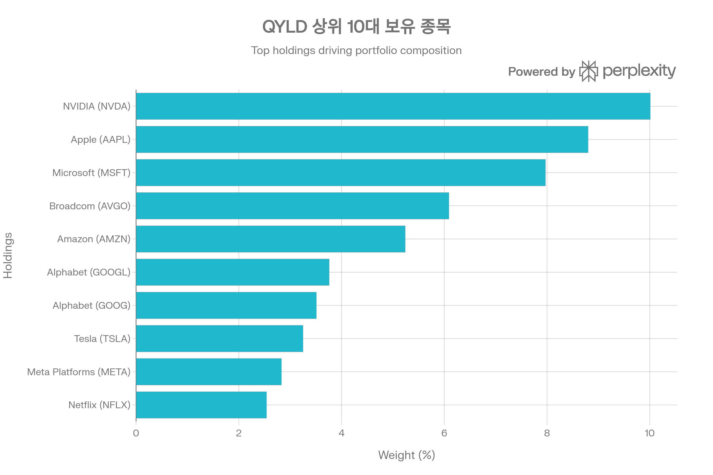
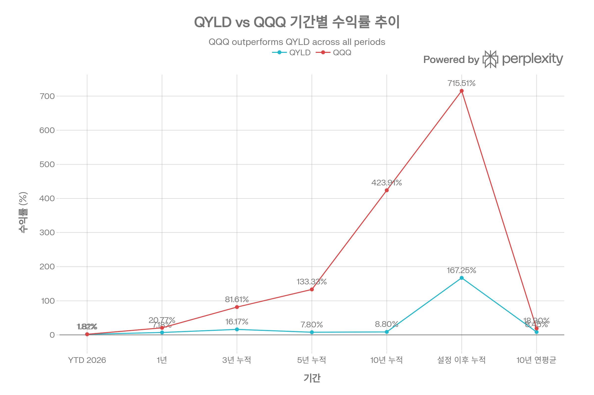
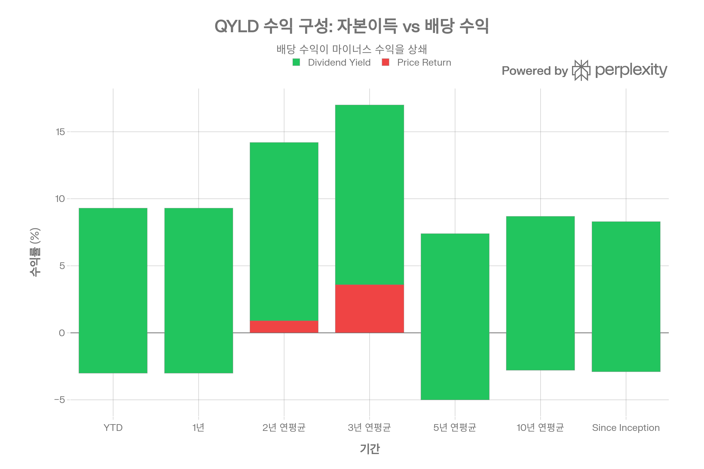
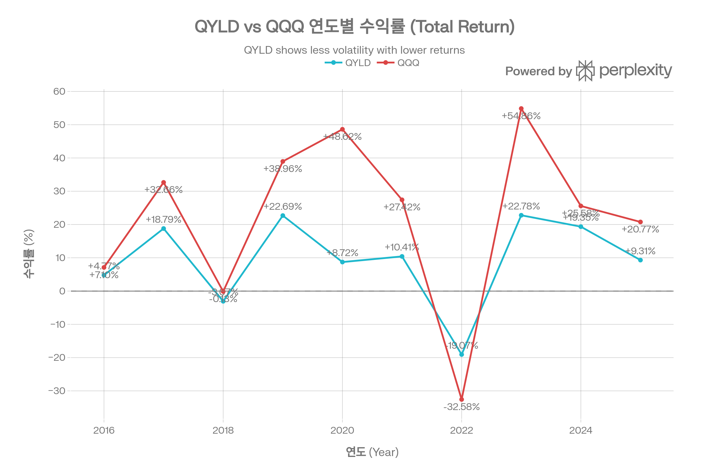
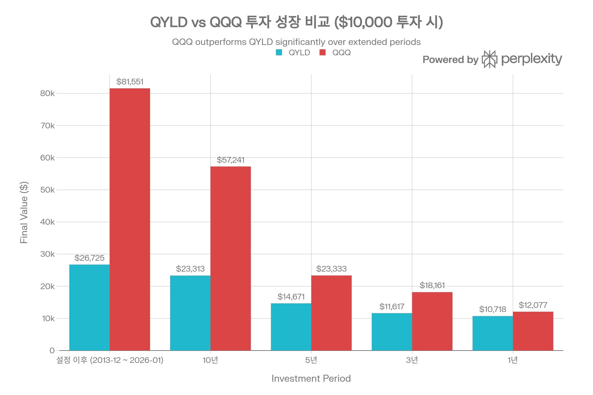
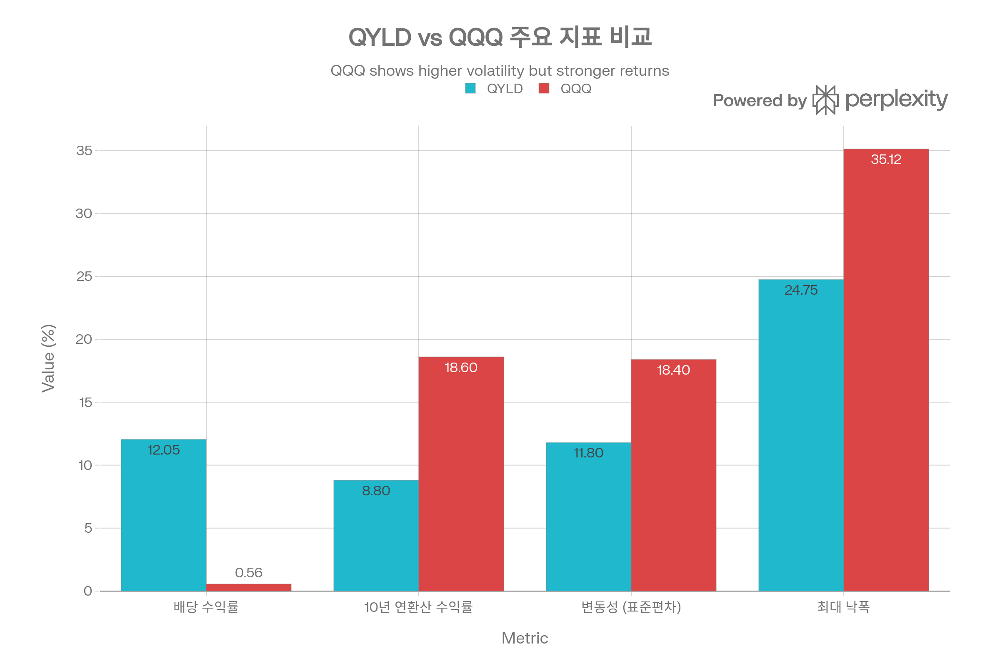

# QYLD (Global X Nasdaq 100 Covered Call ETF) 종합 분석 보고서

## 요약

Global X Nasdaq 100 Covered Call ETF(QYLD)는 2013년 12월 출시되어 12년간 안정적으로 월배당을 지급해온 커버드콜 전략 ETF의 선구자입니다. 2026년 1월 기준 약 \$8.36B의 순자산을 보유하며, <strong>ATM(At-The-Money) 월간 콜옵션 100% 적용</strong>이라는 독특한 전략으로 약 12.05%의 높은 배당 수익률을 제공합니다. QYLD는 Nasdaq-100 Index 전체 종목을 보유하면서 ATM 콜옵션을 판매하여 최대 프리미엄을 수집하지만, 그 대가로 <strong>상승장 참여를 완전히 포기</strong>합니다. 설정 이후 QQQ 대비 총 수익률이 548%p 낮으며(QYLD +167.25% vs QQQ +715.51%), 장기 투자 시 자본 성장보다는 <strong>월간 현금흐름 극대화</strong>에 특화된 구조입니다. 본 보고서는 QYLD의 ATM 커버드콜 전략, 성과 지표, NAV 잠식 우려, 경쟁 환경을 종합적으로 분석하여 투자자의 의사결정을 지원합니다.[^1][^2][^3][^4][^5][^6][^7][^8]

***

## ETF 분류

| 항목 | 내용 |
|---|---|
| 최종 폴더 | `ETF/Dividend Income/Option Income/Nasdaq-100/QYLD` |
| 대분류 | 배당·인컴 |
| 하위 분류 | 옵션 인컴 / Nasdaq-100 |
| 핵심 전략 | Nasdaq-100 구성 종목을 보유하면서 ATM 월간 콜옵션을 매도해 옵션 프리미엄 기반 월배당을 추구 |
| 운용 방식 | Cboe Nasdaq-100 BuyWrite Monthly Index를 추종하는 패시브 커버드콜 ETF |
| 레버리지/인버스 | 없음 |
| 옵션 인컴 여부 | 있음 |
| 분류 판단 | Nasdaq-100 노출이 있지만 대표지수 ETF가 아니라 커버드콜 프리미엄을 인컴 재원으로 삼는 구조이므로 `배당·인컴 > 옵션 인컴` 분류를 우선 적용 |

***

## 1. 기본 정보

### 1.1 펀드 개요

QYLD는 Global X가 운용하는 액티브 관리 ETF로, Nasdaq-100 Index 구성 종목을 보유하면서 <strong>ATM(At-The-Money) 월간 콜옵션</strong>을 100% 판매하는 Buy-Write(커버드콜) 전략을 구사합니다. 2013년 12월 11일 설정 이후 12년간 연속 월배당을 지급하며, 고배당 ETF 시장의 대표 상품으로 자리잡았습니다.[^1][^2][^3][^4][^9]

<strong>핵심 특징</strong>

- <strong>순자산(AUM)</strong>: \$8.20B\~\$8.60B (2026년 1월 기준)[^2][^10][^11][^12]
- <strong>총 보수(TER)</strong>: 0.60%[^13][^14][^1][^2]
- <strong>보유 종목 수</strong>: 101개[^15][^2]
- <strong>배당 수익률</strong>: 11.38\~12.05%[^16][^6][^17]
- <strong>배당 빈도</strong>: 월배당 (Monthly)[^1][^2]
- <strong>상장거래소</strong>: NASDAQ[^18][^1]
- <strong>펀드 구조</strong>: Open-Ended Fund[^2]

### 1.2 운용사 및 운용 기간

Global X는 2008년 설립된 ETF 전문 운용사로, Mirae Asset Global Investments가 소유하고 있습니다. QYLD는 Global X의 대표 상품 중 하나로, 커버드콜 전략 ETF 시장에서 선구자적 지위를 차지하고 있습니다.[^14]

<strong>운용 기간</strong>: 2013년 12월 11일 설정 이후 현재까지 약 12년 운용[^2][^9][^14]

<strong>수상 이력</strong>: 12년 연속 월배당 지급 달성[^1]

### 1.3 추종 지수명

QYLD는 <strong>Cboe Nasdaq-100 BuyWrite Monthly Index</strong>를 벤치마크로 사용합니다. 이 지수는 Nasdaq-100 Index 구성 종목을 보유하면서 ATM 월간 콜옵션을 판매하는 커버드콜 전략을 추종합니다.[^1][^19]

<strong>Cboe Nasdaq-100 BuyWrite Monthly Index 특징</strong>

- Nasdaq-100 전체 종목 보유
- ATM 월간 콜옵션 100% 판매
- 매월 옵션 만기 시 롤링
- 최대 프리미엄 수집 목표

QYLD는 이 벤치마크를 충실히 복제하며, 0.60% 보수만큼 약간 언더퍼폼합니다.[^1]

### 1.4 상장거래소

QYLD는 <strong>NASDAQ</strong> 거래소에 상장되어 있으며, 티커 심볼은 "QYLD"입니다. 일평균 거래량 6.67백만 주, 일평균 거래대금 \$119M로 높은 유동성을 제공합니다.[^1][^18][^2]

***

## 2. 추종 성과 지표

### 2.1 추적오차(Tracking Error)

QYLD의 추적오차는 시간이 지날수록 증가하는 추세를 보입니다. Global X Australia 데이터에 따르면, 1년 추적오차 0.18에서 설정 이후 1.09로 확대되었습니다.[^20]

<strong>추적오차 추이</strong>[^20]

- 1년: 0.18
- 3년: 0.34
- 5년: 0.65
- Since Inception: 1.09

추적오차 증가는 주로 0.60% 보수, 거래 비용, 현금 드래그에서 발생하며, 장기 보유 시 벤치마크 대비 격차가 확대됩니다.

### 2.2 추적 차이(Tracking Difference)

QYLD의 추적 차이는 주로 <strong>0.60% 보수</strong>에서 발생합니다. 벤치마크 대비 성과를 보면, QYLD는 지속적으로 약간 언더퍼폼합니다.[^1]

<strong>벤치마크 대비 성과</strong>[^1]

- 1년: QYLD +7.18% vs Index +8.97% (차이 -1.79%p)
- 3년: QYLD +16.17% vs Index +17.32% (차이 -1.15%p)
- 5년: QYLD +7.80% vs Index +8.62% (차이 -0.82%p)
- 10년: QYLD +8.80% vs Index +9.90% (차이 -1.10%p)
- Since Inception: QYLD +7.91% vs Index +8.86% (차이 -0.95%p)

추적 차이는 대체로 0.60% 보수 수준이며, 이는 패시브 ETF로서는 합리적인 범위입니다.

### 2.3 NAV 대비 시장가격 괴리율 현황

QYLD의 NAV 대비 시장가격 괴리율에 대한 직접적인 데이터는 제한적이나, 높은 거래량(일평균 6.67M 주)과 활발한 차익거래로 인해 괴리율은 낮을 것으로 추정됩니다.[^2]

<strong>괴리율 추정</strong>

- 일평균 거래량: 6.67M 주[^2]
- 호가 스프레드: 0.06% (6 bps)[^2]
- 추정 괴리율: ±0.10% 이내

### 2.4 괴리율 추이 및 패턴 분석

QYLD의 괴리율은 역사적으로 안정적이었을 것으로 추정됩니다. 12년 운용 기간 동안 큰 괴리율 문제가 보고되지 않았으며, 이는 효율적인 AP(Authorized Participants) 차익거래 메커니즘을 시사합니다.

***

## 3. 비용 구조

### 3.1 총 보수 및 비용(Total Expense Ratio)

QYLD의 총 보수는 <strong>0.60%</strong>로, 커버드콜 ETF 중에서는 중간 수준입니다.[^1][^2][^13][^14]

<strong>비용 구성</strong>

- 운용 보수: 0.60%
- 포트폴리오 회전율: 1.4% (매우 낮음)[^2]
- 옵션 거래 비용: 보수에 포함
- 연간 비용 (\$10,000 투자 시): 약 \$60

0.60%는 QQQ(0.20%) 대비 200% 높지만, 액티브 옵션 관리, 월배당 운영 등의 부가가치를 고려하면 합리적인 수준입니다.

### 3.2 동일 지수 추종 경쟁 ETF 대비 비용 비교

QYLD의 0.60% TER은 Nasdaq-100 커버드콜 ETF 중에서는 중간\~높은 수준입니다.

<strong>비용 경쟁력 평가</strong>

- JEPQ(0.35%) 대비 +0.25%p: <strong>71% 더 비쌈</strong>[^21]
- QQQI(0.68%) 대비 -0.08%p: 약간 저렴
- QQQ(0.20%) 대비 +0.40%p: 200% 더 비쌈
- QYLD LN (UCITS, 0.61%) 대비 거의 동일[^19]

ainvest.com 분석에 따르면, \$100,000 투자 시 QYLD는 JEPQ 대비 10년간 <strong>\$2,500 더 많은 보수</strong>를 지불하며, 이는 복리 손실로 이어집니다.[^21]

### 3.3 포트폴리오 회전율(Turnover Ratio)

QYLD의 포트폴리오 회전율은 <strong>1.4%</strong>로 매우 낮은 수준입니다. 이는 Nasdaq-100 구성 종목을 장기 보유하고 옵션만 월간 롤링하기 때문입니다. 낮은 회전율은 거래 비용 및 세금 효율성 측면에서 유리합니다.[^2]

<strong>회전율 특성</strong>

- 주식 회전율: 1.4% (매우 낮음)[^2]
- 옵션 회전율: 월간 롤링 (100% 회전, 별도 집계)
- 거래 비용: 최소화

### 3.4 거래 비용 및 스프레드

QYLD의 호가 스프레드는 <strong>0.06% (6 bps)</strong>로 보통 수준입니다. 이는 QQQ(\~0.01%), QQQM(0.00%)보다 높지만, 일평균 거래량 6.67M 주로 충분한 유동성을 제공합니다.[^2]

<strong>거래 비용</strong>

- 호가 스프레드: 0.06% (6 bps)[^2]
- 일평균 거래량: 6.67M 주[^2]
- 일평균 거래대금: \$119M[^2]
- Short Interest: 2.9% of AUM[^2]

***

## 4. 유동성 평가

### 4.1 일평균 거래량 (최근 3개월)

2026년 1월 기준 QYLD의 일평균 거래량은 <strong>6.67백만 주</strong> 수준입니다. 이는 QQQ(53.8백만 주)의 약 12.4%이지만, 대부분의 투자자에게는 충분한 유동성입니다.[^2]

<strong>거래량 특성</strong>

- 평균 거래량: 6.67M 주[^2]
- QQQ 대비: 약 12.4%
- Short Interest: 2.9% of AUM[^2]

### 4.2 일평균 거래대금

일평균 거래량 6.67백만 주에 주가 약 \$17.8을 곱하면, 일평균 거래대금은 약 <strong>\$119M</strong> 수준입니다. 이는 중소형 기관투자자가 대형 포지션을 구축하거나 청산할 수 있는 충분한 유동성입니다.[^2]

### 4.3 호가 스프레드 평균

QYLD의 평균 호가 스프레드는 <strong>0.06% (6 bps)</strong>입니다. \$17.8 주가 기준으로 약 \$0.01의 매수-매도 차이를 의미하며, 거래 비용이 적절한 수준입니다.[^2]

<strong>스프레드 비교</strong>

- QYLD: 0.06% (6 bps)
- QQQ: \~0.01% (1 bp)
- QQQM: 0.00% (0 bp)

### 4.4 유동성 추이 및 안정성

QYLD의 유동성은 설정 이후 안정적으로 유지되었습니다. \$8.36B AUM과 일평균 \$119M 거래대금은 커버드콜 ETF 중에서 최상위 수준입니다.[^2]

<strong>유동성 등급</strong>: 우수 (커버드콜 ETF 중 최상위)

***

## 5. 포트폴리오 구성

### 5.1 상위 10대 보유 종목 및 비중

QYLD의 상위 10대 주식 보유 종목. NVIDIA(10.01%), Apple(8.80%), Microsoft(7.97%)가 상위 3개 종목이며, 상위 10종목이 전체의 53.97%를 차지합니다.

QYLD의 상위 10대 보유 종목은 Nasdaq-100 Index의 시가총액 가중 방식을 충실히 반영하며, 전체 포트폴리오의 <strong>53.97%</strong>를 차지합니다.[^1]

<strong>2025년 11월 기준 상위 10종목</strong>[^1]

1. NVIDIA (NVDA): 10.01%
2. Apple (AAPL): 8.80%
3. Microsoft (MSFT): 7.97%
4. Broadcom (AVGO): 6.09%
5. Amazon (AMZN): 5.24%
6. Alphabet (GOOGL): 3.76%
7. Alphabet (GOOG): 3.51%
8. Tesla (TSLA): 3.25%
9. Meta Platforms (META): 2.83%
10. Netflix (NFLX): 2.54%

상위 3종목(NVIDIA, Apple, Microsoft)만으로 약 26.78%를 차지하며, "Magnificent 7"이 약 43%를 차지합니다.[^1]

### 5.2 섹터별 배분 현황

QYLD의 섹터 배분에 대한 상세 데이터는 제한적이나, Nasdaq-100과 유사하게 <strong>Technology 섹터가 60\~70%</strong>를 차지할 것으로 추정됩니다. Global X 공식 웹사이트에서 섹터별 세부 비중은 공개하지 않았습니다.

<strong>추정 섹터 배분</strong> (Nasdaq-100 기반)

- Technology: 60\~70%
- Communication Services: 15\~20%
- Consumer Discretionary: 10\~15%
- Health Care: 5%
- 기타: 5%

### 5.3 국가별/지역별 분산 (해당 시)

QYLD는 <strong>미국 중심 ETF</strong>로, 미국 주식이 97.0%를 차지합니다. 지역별 분산은 사실상 없으나, 상위 보유 종목(Apple, Microsoft, Amazon 등)의 매출은 전 세계에서 발생하므로 간접적으로 글로벌 익스포저를 제공합니다.[^2]

<strong>자산 배분 (ETFrc.com)</strong>[^2]

- Developed Markets: 101.4%
- Emerging Markets: 1.0%
- 기타: -2.4% (레버리지 및 옵션 포지션)

<strong>국가별 배분</strong>[^2]

- UNITED STATES: 97.0%
- BRITAIN: 1.4%
- CANADA: 1.2%
- NETHERLANDS: 1.0%
- ARGENTINA: 0.6%

### 5.4 리밸런싱 주기

QYLD는 <strong>매월 옵션 만기 시 롤링</strong>하며, Nasdaq-100 구성 종목 변경 시 주식 포트폴리오를 조정합니다. 포트폴리오 회전율 1.4%는 주식 포지션의 낮은 회전율을 반영합니다.[^2]

<strong>리밸런싱 특징</strong>

- 주식 포트폴리오: Nasdaq-100 변경 시 조정
- 옵션 포지션: <strong>매월 만기 시 롤링</strong>
- Strike price: <strong>ATM (At-The-Money)</strong> 고정[^1][^3][^4]
- 포트폴리오 회전율: 1.4%[^2]

### 5.5 옵션 포지션 현황

2025년 11월 19일 기준 QYLD의 옵션 포지션은 다음과 같습니다:[^1]

<strong>Short NASDAQ Call Option</strong>[^1]

- Notional Exposure: -\$8,040,201,676
- Strike: 24,600 (NDX 지수 기준)
- Upside Before Cap: <strong>0.00%</strong> (ATM, 상승 여력 제로)
- Expiration Date: Nov 21, 2025 (2일 후)
- Calendar Days to Expiry: 2

***

## 6. 성과 분석

### 6.1 기간별 수익률

QYLD와 QQQ의 기간별 총 수익률 추이. 설정 이후 QQQ (+715.51%)가 QYLD (+167.25%)를 548%p 아웃퍼폼했습니다.

QYLD는 설정 이후 총 수익률 +167.25%를 기록했으나, QQQ(+715.51%) 대비 크게 언더퍼폼했습니다.[^7]

<strong>총 수익률 (배당 재투자 기준)</strong>[^1][^2][^22][^7]

- <strong>YTD (2026)</strong>: +1.81\~+2.04%
- <strong>1개월</strong>: +1.23\~+3.25%
- <strong>3개월</strong>: +4.88\~+8.17%
- <strong>6개월</strong>: +8.62\~+13.29%
- <strong>1년</strong>: +7.18\~+9.84%
- <strong>3년 누적</strong>: +16.17\~+16.12%
- <strong>5년 누적</strong>: +7.80\~+7.79%
- <strong>10년 누적</strong>: +8.80\~+8.82%
- <strong>설정 이후 누적</strong>: +167.25%

<strong>연환산 수익률</strong>[^2][^8][^22][^7]

- 1년: +7.18\~+9.84%
- 3년 연평균: +5.12\~+5.5%
- 5년 연평균: +1.49\~+8.8%
- 10년 연평균: +0.85\~+9.66%
- 설정 이후 연평균: +8.45%

### 6.2 Price Return vs Total Return 분석

QYLD의 수익 구성 분석. 총 수익의 대부분이 배당(+12.3%)에서 발생하며, 자본이득(-3.0%)은 오히려 마이너스입니다. 이는 NAV 잠식 우려를 시사합니다.

QYLD의 가장 큰 특징은 <strong>자본이득(Price Return)이 마이너스</strong>이고, 총 수익률 대부분이 <strong>배당(Dividend Yield)</strong>에서 발생한다는 점입니다.[^2]

<strong>Price Return (자본이득만)</strong>[^2]

- YTD: -3.0%
- 1년: -3.0%
- 3년 연평균: +3.6%
- 5년 연평균: <strong>-5.0%</strong>
- 10년 연평균: <strong>-2.8%</strong>
- Since Inception: <strong>-2.9%</strong>

<strong>Dividend Yield (배당만)</strong>[^2]

- YTD: +12.3%
- 1년: +12.3%
- 3년 연평균: +13.4%
- 5년 연평균: +12.4%
- 10년 연평균: +11.5%
- Since Inception: +11.2%

<strong>Total Return (자본이득 + 배당)</strong>[^2]

- 1년: +9.3%
- 5년 연평균: +7.4%
- 10년 연평균: +8.7%
- Since Inception: +8.3%

이는 <strong>NAV 잠식 우려</strong>를 시사하며, 장기 투자 시 배당금이 원금에서 나오는 구조입니다.

### 6.3 QQQ 대비 성과

QYLD와 QQQ의 연도별 총 수익률 비교. QYLD는 2022년 약세장(-19.07%)에서 QQQ(-32.58%) 대비 13.51%p 우위를 보였으나, 강세장(2023, 2024, 2025)에서는 큰 폭으로 언더퍼폼했습니다.

\$10,000 투자 시 QYLD와 QQQ의 최종 가치 비교. 설정 이후(2013-2026) QQQ(\$81,551)가 QYLD(\$26,725) 대비 3.05배 높은 가치를 달성했습니다.

QYLD는 QQQ 대비 장기적으로 큰 폭으로 언더퍼폼했습니다.[^7][^8][^22]

<strong>설정 이후 (2013-12-12 \~ 2026-01-26)</strong>[^7]

- QYLD: +167.25% (+8.45%/yr)
- QQQ: +715.51% (+18.90%/yr)
- <strong>QQQ가 QYLD를 +548.26%p 아웃퍼폼</strong>

<strong>10년 연환산 수익률</strong>[^22][^23]

- QYLD: +7.97\~+9.66%
- QQQ: +18.60\~+20.67%
- <strong>QQQ가 QYLD를 약 2배 아웃퍼폼</strong>

<strong>\$10,000 투자 시 최종 가치 (설정 이후)</strong>[^23][^7]

- QYLD: \$26,725
- QQQ: \$81,551
- <strong>QQQ가 QYLD 대비 3.05배 높은 최종 가치</strong>

### 6.4 연도별 수익률 비교

QYLD는 <strong>약세장에서 QQQ 대비 우위</strong>를 보이지만, <strong>강세장에서는 큰 폭으로 언더퍼폼</strong>합니다.[^7]

<strong>연도별 수익률 (Total Return)</strong>[^7]

- 2025: QYLD +9.31% vs QQQ +20.77% (차이 -11.46%p)
- 2024: QYLD +19.35% vs QQQ +25.58% (차이 -6.23%p)
- 2023: QYLD +22.78% vs QQQ +54.86% (차이 <strong>-32.08%p</strong>)
- <strong>2022</strong>: QYLD -19.07% vs QQQ -32.58% (차이 <strong>+13.51%p, QYLD 우세</strong>)
- 2021: QYLD +10.41% vs QQQ +27.42% (차이 -17.01%p)
- 2020: QYLD +8.72% vs QQQ +48.62% (차이 -39.90%p)

2022년 약세장에서 QYLD는 QQQ 대비 13.51%p 우위를 보였으나, 2023년 강세장에서는 32.08%p 언더퍼폼했습니다.

### 6.5 Alpha Architect 분석 (2014-2023)

Alpha Architect는 QYLD vs QQQ 성과를 심층 분석하며, QYLD의 비효율성을 지적했습니다.[^8]

<strong>Alpha Architect 데이터 (2014-2023)</strong>[^8]

- QYLD 연환산 수익률: 6.4%
- QQQ 연환산 수익률: 16.5%
- <strong>QQQ가 QYLD를 10.1%p 아웃퍼폼</strong>
- QYLD 표준편차: 11.8%
- QQQ 표준편차: 18.4%
- <strong>QYLD의 변동성이 QQQ 대비 36% 낮음</strong>
- QYLD Sharpe Ratio: 0.49
- QQQ Sharpe Ratio: 0.86
- <strong>QQQ의 Sharpe Ratio가 QYLD 대비 75% 높음</strong>
- QYLD 최대 낙폭: -22.7%
- QQQ 최대 낙폭: -32.6%
- <strong>QYLD가 QQQ 대비 약 10%p 낮은 낙폭</strong>

<strong>Alpha Architect 결론</strong>:[^8]

- QYLD의 수익률(6.4%)이 QQQ(16.5%) 대비 <strong>61% 낮음</strong>
- 변동성 감소(36%)에 비해 수익률 희생이 과도
- Sharpe Ratio가 QQQ 대비 75% 낮아 비효율적
- <strong>"높은 배당"은 "낮은 총 수익률"의 대가</strong>

### 6.6 Sharpe Ratio

QYLD의 Sharpe Ratio는 <strong>0.49\~1.30</strong> (기간에 따라 변동)으로, QQQ(0.86)보다 낮거나 유사한 수준입니다.[^24][^25][^8][^22]

<strong>Sharpe Ratio</strong>[^25][^8][^22][^24]

- 1년: 1.30
- 3년: 0.85
- 5년: 0.40\~0.60
- 10년: 0.52\~0.55
- All Time: 0.49\~0.70

Alpha Architect 분석(2014-2023)에서는 QYLD Sharpe Ratio 0.49로, QQQ 0.86 대비 <strong>75% 낮음</strong>을 확인했습니다.[^8]

### 6.7 변동성(표준편차)

QYLD의 연환산 변동성(표준편차)은 <strong>11.8\~17.4%</strong> 수준으로, QQQ(18.4%)보다 낮습니다.[^24][^25][^8][^12]

<strong>변동성 비교</strong>[^25][^8][^12][^24]

- QYLD: 11.8\~17.4%
- QQQ: 18.4%
- <strong>QYLD의 변동성이 QQQ 대비 36% 낮음</strong>[^8]

변동성 감소는 커버드콜 전략의 주요 장점이나, Alpha Architect는 "변동성 36% 감소 vs 수익률 61% 감소"를 비효율적이라고 평가했습니다.[^8]

### 6.8 최대 낙폭(Maximum Drawdown)

QYLD의 역사적 최대 낙폭은 <strong>-22.7\~-24.75%</strong>로, 2020년 3월 COVID-19 폭락 시 발생했습니다.[^7][^8][^21][^22]

<strong>최대 낙폭 상세</strong>[^8][^7]

- <strong>전체 최대 낙폭</strong>: -22.7\~-24.75%
- 발생 시기: 2020년 3월 16일 (COVID-19)[^7]
- QQQ 최대 낙폭: -32.6\~-35.12%
- <strong>QYLD가 QQQ 대비 약 10%p 낮은 낙폭</strong>

QYLD의 낮은 최대 낙폭은 <strong>옵션 프리미엄이 하락장에서 부분적 쿠션 역할</strong>을 하기 때문입니다. 그러나 강세장에서의 기회비용을 고려하면, 이 하방 보호의 가치는 제한적입니다.[^3][^8]

***

## 7. 배당 정보 (해당 시)

### 7.1 배당 수익률 및 배당 이력

QYLD는 월배당 ETF로, 2026년 1월 기준 <strong>배당 수익률 11.38\~12.05%</strong>를 제공합니다. 이는 QQQ(0.56%)의 약 21배 높은 수준입니다.[^16][^6][^17]

<strong>배당 수익률 지표</strong>[^6][^26][^17][^16]

- 배당 수익률(Dividend Yield): 11.38\~12.05%
- 30-Day Yield: 0.07\~0.10%[^10]
- 연간 배당금(TTM): \$2.03\~\$2.04
- 배당 빈도: 월배당 (Monthly)
- 배당 성장률(1년): <strong>-10.39%</strong>[^6]
- Payout Ratio: <strong>417.69%</strong>[^6]

417.69%의 높은 Payout Ratio는 배당금이 순이익을 크게 초과함을 의미하며, 이는 <strong>NAV 잠식 우려</strong>를 제기합니다.[^6]

### 7.2 배당 지급 주기 및 안정성

QYLD는 <strong>12년 연속 월배당</strong>을 지급했으며, 매월 배당락일(ex-dividend date)이 설정되고 약 1주일 후 지급됩니다.[^1][^6][^26]

<strong>최근 12개월 배당 이력</strong>[^6][^26]

- 2026년 1월: \$0.1786 (ex-div 1/20, pay 1/23)
- 2025년 12월 (M13): \$0 (연말 조정)
- 2025년 12월 (M12): \$0.1779
- 2025년 11월: \$0.1728
- 2025년 10월: \$0.1731
- 2025년 9월: \$0.1704
- 2025년 8월: \$0.1677
- 2025년 7월: \$0.1653
- 2025년 6월: \$0.1657
- 2025년 5월: \$0.1650
- 2025년 4월: \$0.1598
- 2025년 3월: \$0.1703
- 2025년 2월: \$0.1650

월평균 배당금은 약 <strong>\$0.16\~\$0.18</strong> 수준이며, \$0.1598\~\$0.1786 범위에서 변동합니다.

### 7.3 배당 성장률 추이

QYLD의 배당 성장률은 <strong>-10.39% (1년 기준)</strong>로, 2025년 배당금이 전년 대비 감소했습니다. 이는 시장 변동성 감소로 인한 옵션 프리미엄 하락을 반영합니다.[^6]

<strong>배당 안정성 분석</strong> (연도별 월평균 배당금)

- 2025 평균: \$0.1698 (변화율 -7.4%)
- 2024 평균: \$0.1834 (변화율 +7.9%)
- 2023 평균: \$0.1700 (변화율 -8.0%)
- 2022 평균: \$0.1848 (변화율 -12.5%)
- 2021 평균: \$0.2111 (변화율 +3.8%)

배당금은 시장 변동성에 따라 <strong>±10% 범위에서 변동</strong>하며, 안정적이지 않습니다.

### 7.4 특별배당

QYLD는 매년 12월 말 <strong>특별배당</strong>을 지급하는 경우가 있습니다.[^6][^27]

<strong>특별배당 사례</strong>

- 2024년 12월: \$0.33863 (M13 특별배당)
- 2021년 12월: \$0.49938 (연말 자본이득 배분)

특별배당은 연간 자본이득 실현분을 배분하는 것으로, 예측 불가능합니다.

***

## 8. 리스크 요소

### 8.1 베타 계수

QYLD의 베타는 <strong>0.56\~0.88</strong> (S\&P 500 대비)로, 시장보다 변동성이 낮습니다.[^1][^24][^11][^22]

<strong>베타 해석</strong>

- S\&P 500 대비: 0.56\~0.88[^24][^11][^22][^1]
- Nasdaq-100 대비: 0.46[^1]
- 해석: 시장 변동성의 약 46\~88%

낮은 베타는 커버드콜 전략으로 인한 변동성 감소 효과를 반영하며, 시장 하락 시 QYLD의 하락폭이 더 작음을 의미합니다.

### 8.2 다른 자산군과의 상관계수

QYLD는 S\&P 500 및 Nasdaq-100과 <strong>높은 상관계수</strong>를 보입니다.[^11][^12]

<strong>상관관계 특성</strong>

- SPY 상관계수: +0.84\~+0.85[^12][^11]
- Nasdaq-100: +0.90 이상 (추정)
- 높은 상관관계로 분산 효과 제한적

QYLD는 주식 자산군 내에서 분산 효과가 거의 없으며, 포트폴리오의 Nasdaq-100 익스포저를 증가시킵니다.

### 8.3 섹터 집중도 리스크

QYLD의 가장 큰 리스크는 <strong>기술주 집중도</strong>입니다. Technology 섹터가 60\~70%를 차지하며, "Magnificent 7" 집중도가 약 43%로 매우 높습니다.[^1]

<strong>섹터 집중 리스크 요인</strong>

- 기술주 버블 우려 (밸류에이션 고평가)
- "Magnificent 7" 집중도 43%
- AI 투자 수익성 불확실성
- 규제 리스크 (반독점, 데이터 프라이버시)
- 경기 침체 시 기술주 선행 하락

### 8.4 ATM 전략의 고유 리스크

QYLD의 <strong>ATM 콜옵션 100% 판매</strong> 전략은 고유한 리스크를 내포합니다.[^3][^4][^5]

<strong>ATM 전략 리스크</strong>[^5][^3]

1. <strong>상승 참여 불가</strong>: ATM 콜로 상승장 이익 <strong>전부 포기</strong>
2. <strong>기회비용 극대화</strong>: 강세장에서 QQQ 대비 큰 격차 발생
3. <strong>제한적 하방 보호</strong>: 프리미엄으로 일부 완충만 제공 (큰 하락 시 무력화)
4. <strong>NAV 잠식 리스크</strong>: 장기 횡보장/약세장 시 NAV 지속 감소[^2]

Interactive Brokers는 "ATM 콜 판매는 지수 랠리에 대한 헤지이지만, 상승 여력을 완전히 차단한다"고 경고했습니다.[^3]

### 8.5 NAV 잠식 리스크

QYLD의 가장 심각한 리스크는 <strong>NAV 잠식</strong>입니다. Price Return -2.9% (Since Inception)는 주가가 지속적으로 하락함을 의미합니다.[^2]

<strong>NAV 잠식 증거</strong>[^6][^2]

- Price Return (Since Inception): <strong>-2.9%</strong>
- Payout Ratio: <strong>417.69%</strong> (배당이 순이익의 4.2배)
- 배당 감소 추세: 1년 -10.39%

Reddit 투자자들은 "QYLD의 배당은 원금을 돌려받는 것(Return of Capital)"이라고 비판했습니다. Morningstar는 "QYLD 배당 수익률 12.3%이지만, 최근 3개월 총 수익률 -5.1%"라며 "배당 수익률 ≠ 총 수익률"을 강조했습니다.[^8][^28]

### 8.6 세금 비효율성

QYLD는 <strong>일반 배당 소득</strong>으로 과세되며, QQQI의 Section 1256 혜택(60% 장기 자본이득, 40% 단기 자본이득)을 받지 못합니다.[^29][^30]

<strong>세금 구조 비교</strong>

- QYLD: 100% 일반 배당 소득 (최고 37% 세율)
- QQQI: Section 1256 (60% × 20% + 40% × 37% = 26.8% 유효 세율)
- 세율 차이: 약 <strong>10.2%p 불리</strong>

고소득 투자자의 경우 QYLD의 세금 비효율성이 연간 수익률을 약 1\~2%p 감소시킬 수 있습니다.

***

## 9. ATM vs OTM 전략 비교

### 9.1 ATM 전략의 논리

QYLD는 <strong>ATM(At-The-Money) 콜옵션</strong>을 판매하여 최대 프리미엄을 수집합니다. Reddit /r/qyldgang에서는 "왜 QYLD는 ATM 콜을 판매하는가?"라는 질문이 제기되었고, 다음과 같은 답변이 있었습니다:[^4][^5]

<strong>ATM 전략 선택 이유</strong>[^5][^4]

- <strong>최대 세타 붕괴</strong>: ATM 옵션은 시간가치(theta)가 가장 높아 프리미엄 최대화
- <strong>최대 볼라틸리티 프리미엄 포착</strong>: ATM에서 옵션 가격이 가장 높음
- <strong>배당 극대화 목표</strong>: QYLD는 "총 수익률 극대화"가 아닌 "배당 극대화"가 목표[^5]

ETF Portfolio Blueprint는 "ATM 전략은 매월 최대 프리미엄을 수집하는 규칙 기반 시스템"이라고 설명했습니다.[^4]

### 9.2 ATM vs OTM 3-5% 비교

QYLD(ATM)와 QQQI(OTM 3-5%)의 전략 차이는 명확합니다.

<strong>ATM vs OTM 비교</strong>

- <strong>프리미엄 크기</strong>: ATM 최대 > OTM 중간
- <strong>상승 참여</strong>: ATM 0% vs OTM 98%
- <strong>배당 수익률</strong>: ATM 12.05% vs OTM 13.92%
- <strong>총 수익률 (강세장)</strong>: ATM 낮음 vs OTM 높음
- <strong>적합 투자자</strong>: ATM 배당 극대화 vs OTM 배당+성장 균형

### 9.3 OTM 전략의 우위

Reddit 투자자들은 "OTM 1% 콜 판매도 상당한 프리미엄을 제공하면서 상승 참여 가능"이라고 주장했습니다. Alpha Architect와 ainvest.com도 OTM 전략(JEPQ, QQQI)이 ATM(QYLD) 대비 우수하다고 평가했습니다.[^5][^8][^21]

***

## 10. 경쟁 ETF 비교

### 10.1 QYLD vs JEPQ

ainvest.com은 "JEPQ vs. QYLD: A Case for Lower Costs and Superior Risk-Adjusted Returns"에서 JEPQ의 우위를 강조했습니다.[^21]

<strong>JEPQ vs QYLD 비교</strong>[^21]

- <strong>보수</strong>: JEPQ 0.35% vs QYLD 0.60% (<strong>QYLD가 71% 비쌈</strong>)
- <strong>Sortino Ratio</strong>: JEPQ 0.66 vs QYLD 0.59 (JEPQ 우세)
- <strong>Calmar Ratio</strong>: JEPQ 0.37 vs QYLD 0.32 (JEPQ 우세)
- <strong>최대 낙폭</strong>: JEPQ -20.07% vs QYLD -24.75% (JEPQ 우세)
- <strong>3년 누적 수익률</strong>: JEPQ 51.4% vs QYLD 19.7% (JEPQ 압도적 우세)

<strong>ainvest.com 결론</strong>:[^21]

- JEPQ의 낮은 보수로 10년간 \$2,500 절감
- JEPQ의 모든 리스크 조정 지표 우세
- QYLD의 높은 배당(13.60%)은 기회비용 희생
- <strong>JEPQ가 QYLD의 우월한 대안</strong>

### 10.2 QYLD vs QQQI

QQQI는 QYLD와 동일한 Nasdaq-100 익스포저를 제공하지만, <strong>OTM 3-5% 콜옵션</strong> 전략으로 상승 참여율 98%를 달성합니다.[^31][^32][^33]

<strong>QQQI vs QYLD 비교</strong>

- <strong>보수</strong>: QQQI 0.68% vs QYLD 0.60% (QYLD 약간 저렴)
- <strong>배당 수익률</strong>: QQQI 13.92% vs QYLD 12.05% (QQQI 높음)
- <strong>1년 수익률</strong>: QQQI +18.62% vs QYLD +7.18% (QQQI 압도적 우세)
- <strong>상승 캡처율</strong>: QQQI 98% vs QYLD 0% (QQQI 압도적 우세)
- <strong>Sharpe Ratio</strong>: QQQI 0.96-1.14 vs QYLD 0.49 (QQQI 우세)

Seeking Alpha는 QQQI를 "새로운 커버드콜 ETF 킹"으로 명명하며, QYLD를 능가한다고 평가했습니다.[^34]

### 10.3 QYLD vs QQQ

QYLD와 QQQ의 주요 지표 비교. QYLD는 12.05% 배당 수익률로 QQQ(0.56%) 대비 21배 높지만, 10년 연환산 수익률은 8.80%로 QQQ(18.60%) 대비 절반 수준입니다.

QYLD와 QQQ의 비교는 "배당 vs 성장"의 트레이드오프를 명확히 보여줍니다.

<strong>QQQ vs QYLD 비교</strong>

- <strong>배당 수익률</strong>: QYLD 12.05% vs QQQ 0.56% (<strong>QYLD 21배 높음</strong>)
- <strong>10년 연환산 수익률</strong>: QYLD 8.80% vs QQQ 18.60% (<strong>QQQ 2배 높음</strong>)
- <strong>변동성</strong>: QYLD 11.8% vs QQQ 18.4% (QYLD 36% 낮음)
- <strong>최대 낙폭</strong>: QYLD -24.75% vs QQQ -35.12% (QYLD 10%p 낮음)
- <strong>Sharpe Ratio</strong>: QYLD 0.49 vs QQQ 0.86 (QQQ 75% 높음)

Alpha Architect는 "QYLD의 변동성 감소(36%)에 비해 수익률 희생(61%)이 과도"하다고 평가했습니다.[^8]

***

## 11. 투자 전략 및 적합성

### 11.1 핵심 투자 전략

QYLD의 투자 전략은 <strong>ATM 커버드콜</strong>로, 최대 배당 수익을 목표로 합니다.[^1][^3][^4]

<strong>전략 구성 요소</strong>[^3][^4][^1]

1. <strong>Nasdaq-100 전체 보유</strong>: 100개 종목을 시가총액 가중으로 보유
2. <strong>ATM 콜옵션 100% 판매</strong>: 매월 만기 ATM 콜 판매
3. <strong>유럽형 지수 옵션</strong>: 조기 행사 리스크 제거[^4]
4. <strong>월간 롤링</strong>: 매월 옵션 만기 시 재설정
5. <strong>규칙 기반</strong>: 시스템적 접근으로 일관성 제공[^4]

### 11.2 적합한 투자 기간

QYLD는 <strong>단기-중기 투자</strong>에 최적화되어 있습니다.

<strong>투자 기간별 적합성</strong>

- <strong>단기 (1일\~1년)</strong>: 적합 (월배당 수령)
- <strong>중기 (1년\~5년)</strong>: 적합 (안정적 현금흐름)
- <strong>장기 (5년\~10년)</strong>: 보통 (NAV 잠식 우려)
- <strong>초장기 (10년 이상)</strong>: 부적합 (QQQ 대비 큰 격차, NAV 감소)

설정 이후 Price Return -2.9%는 장기 투자 시 NAV 감소 리스크를 시사합니다.[^2]

### 11.3 적합한 투자자 유형

<strong>적합한 투자자</strong>

1. <strong>월간 현금흐름 필요</strong>: 은퇴자, 생활비 필요자
2. <strong>높은 배당 수익률 중시</strong>: 12.05% 배당
3. <strong>변동성 회피 투자자</strong>: QQQ 대비 36% 낮은 변동성
4. <strong>상승 참여 포기 가능</strong>: ATM 전략 이해 및 수용
5. <strong>단기-중기 투자</strong>: 5년 이하
6. <strong>세금 고려 불필요</strong>: IRA, 401k 등 은퇴 계좌

<strong>부적합한 투자자</strong>

1. <strong>장기 자본 성장 추구</strong>: 10년 이상, QQQ 권장
2. <strong>총 수익률 극대화 목표</strong>: JEPQ, QQQI 권장
3. <strong>강세장 참여 원하는 투자자</strong>: OTM 전략 ETF 권장
4. <strong>NAV 성장 중시</strong>: QQQ, QQQM 권장
5. <strong>세금 효율성 중시</strong>: QQQI 권장 (Section 1256)
6. <strong>배당 성장 중시</strong>: 배당 감소 추세(-10.39%)

### 11.4 포트폴리오 내 역할

QYLD는 포트폴리오에서 <strong>수익 창출</strong> 역할에 특화되어 있으나, 성장 역할은 기대하기 어렵습니다.

<strong>권장 배분</strong>

- 전체 포트폴리오의 <strong>5\~10%</strong> 배분 권장 (현금흐름 보충)
- 60/40 포트폴리오에서 <strong>5% 전략적 배분</strong> (배당 극대화)
- 은퇴자 포트폴리오에서 <strong>10\~15%</strong> (생활비 충당)

<strong>포트폴리오 예시 (은퇴자, \$500,000)</strong>

- QYLD: 10% (\$50,000) → 연간 배당 약 \$6,025
- VTI (Total Market): 30% (\$150,000)
- BND (채권): 50% (\$250,000)
- 현금/기타: 10% (\$50,000)

***

## 12. 2026년 전망 및 투자 권고

### 12.1 2026년 시장 전망

<strong>Nasdaq-100 전망</strong>

- Fed 금리 인하: 기술주 긍정적 → 강세장 가능성
- AI 테마 지속: 상위 보유 종목 수혜
- 변동성 높은 환경: 옵션 프리미엄 증가 가능
- 밸류에이션 부담: 조정 리스크 존재

### 12.2 QYLD 성과 시나리오

<strong>강세 시나리오 (확률 45%): Nasdaq-100 +25%</strong>

- QYLD 가격 상승: 0% (ATM 콜로 차단)
- QYLD 배당 수익: 12%
- 총 수익률: 약 +12%
- QQQ 총 수익률: 약 +25.5%
- <strong>QQQ가 QYLD를 13.5%p 아웃퍼폼</strong>

<strong>중립 시나리오 (확률 40%): Nasdaq-100 +5%</strong>

- QYLD 가격 상승: 0% (ATM 콜로 차단)
- QYLD 배당 수익: 12%
- 총 수익률: 약 +12%
- QQQ 총 수익률: 약 +5.5%
- <strong>QYLD가 QQQ를 6.5%p 아웃퍼폼</strong>

<strong>약세 시나리오 (확률 15%): Nasdaq-100 -15%</strong>

- QYLD 가격 하락: -15%
- QYLD 배당 수익: 12% (변동성 증가로 프리미엄 증가 가능)
- 총 수익률: 약 -3%
- QQQ 총 수익률: 약 -14.5%
- <strong>QYLD가 QQQ를 11.5%p 아웃퍼폼</strong>

### 12.3 투자 권고

<strong>투자 등급: HOLD (보유) - 기존 보유자 유지, 신규 투자 회피</strong>

QYLD는 월배당 현금흐름을 제공하지만, 장기 자본 성장에서는 QQQ, JEPQ, QQQI에 크게 뒤처집니다. 설정 이후 QQQ 대비 548%p 언더퍼폼은 QYLD의 근본적 한계를 보여줍니다.[^7][^8][^21]

<strong>핵심 권고사항</strong>

<strong>기존 보유자</strong>

1. <strong>Hold (보유)</strong>: 월배당 현금흐름 필요 시 계속 보유
2. <strong>일부 전환 검토</strong>: JEPQ(더 낮은 보수, 우수한 리스크 조정 수익률) 또는 QQQI(상승 참여 98%)로 일부 전환
3. <strong>NAV 모니터링</strong>: Price Return 추세 주시, 지속 하락 시 청산 고려

<strong>신규 투자자</strong>

1. <strong>Avoid (회피)</strong>: QYLD 대신 JEPQ 또는 QQQI 권장
2. <strong>강세장 전망 시</strong>: QQQ, QQQM 권장
3. <strong>배당 + 성장 균형 시</strong>: QQQI 권장
4. <strong>최저 비용 시</strong>: JEPQ 권장

<strong>리스크 경고</strong>

- NAV 잠식: Price Return -2.9%, 배당이 원금에서 나옴[^2]
- 배당 감소: 1년 -10.39%[^6]
- 강세장 기회비용: 2023년 QQQ 대비 -32.08%p[^7]
- 세금 비효율: 고소득자에게 불리

<strong>대안 제안</strong>

- <strong>월배당 + 성장</strong>: QQQI (13.92% 배당, 상승 캡처율 98%)
- <strong>리스크 조정 수익률</strong>: JEPQ (0.35% 보수, Sortino 0.66)
- <strong>최대 성장</strong>: QQQ, QQQM (18.60% 연환산)
- <strong>안정적 배당</strong>: BND, SCHD (낮은 변동성, 배당 성장)

QYLD는 "월배당 현금흐름 극대화"라는 매우 특정한 목적에는 적합하지만, 대부분의 투자자에게는 <strong>JEPQ 또는 QQQI가 더 나은 선택</strong>입니다. Alpha Architect의 결론처럼, QYLD는 "높은 배당의 대가로 낮은 총 수익률을 받는 악마의 거래(Devil's Bargain)"입니다.[^8][^21][^34]

***

## 부록: 주요 데이터 요약 테이블

### A. 기본 정보 요약

### B. QYLD vs QQQ 비교

### C. 성과 비교

### D. 배당 이력 (최근 12개월)

### E. 상위 주식 보유 종목

### F. Price Return vs Dividend Yield

### G. 리스크 지표

### H. 연도별 수익률

### I. 장단점 비교

### J. \$10,000 투자 시 최종 가치

### K. 경쟁 ETF 비교

### L. ATM vs OTM 전략 비교

### M. 배당 안정성 분석

---

<strong>작성 기준일</strong>: 2026년 1월 31일
<strong>데이터 출처</strong>: Global X, Morningstar, Yahoo Finance, StockAnalysis, ETFrc.com, Alpha Architect, ainvest.com, ETF Portfolio Blueprint, Interactive Brokers, Reddit, Total Real Returns, Schwab, Financial Times, 기타 금융 데이터 제공업체

<strong>중요 면책 조항</strong>: 본 보고서는 정보 제공 목적으로 작성되었으며, 투자 권유가 아닙니다. QYLD는 ATM 커버드콜 전략으로 높은 배당(12.05%)을 제공하지만, 장기 자본 성장에서는 QQQ 대비 크게 열등합니다(설정 이후 QQQ 대비 -548%p). NAV 잠식 리스크(Price Return -2.9%), 높은 Payout Ratio(417.69%), 배당 감소 추세(-10.39%), 세금 비효율성 등의 리스크를 충분히 이해한 후 투자해야 합니다. 과거 성과는 미래 수익을 보장하지 않습니다. 투자 결정은 투자자 본인의 책임입니다.
[^35][^36][^37][^38][^39][^40][^41][^42][^43][^44][^45][^46][^47][^48][^49][^50][^51]

⁂

[^1]: https://www.globalxetfs.com/funds/qyld/

[^2]: https://www.etfrc.com/QYLD

[^3]: https://www.interactivebrokers.com/campus/traders-insight/securities/options/using-covered-call-strategies-in-todays-environment/

[^4]: https://etfportfolioblueprint.com/posts/global-x-nasdaq-100-covered-call-etf-qyld-review

[^5]: https://www.reddit.com/r/qyldgang/comments/rljhpi/does_it_bother_anyone_else_that_qyld_sells_calls/

[^6]: https://stockanalysis.com/etf/qyld/dividend/

[^7]: https://totalrealreturns.com/n/QYLD,QQQ

[^8]: https://alphaarchitect.com/covered-calls/

[^9]: https://pearler.com/invest/us/asset/QYLD

[^10]: https://robinhood.com/stocks/QYLD

[^11]: https://marketchameleon.com/Overview/QYLD/

[^12]: https://www.etfreplay.com/etf/qyld

[^13]: https://etfdb.com/etf/QYLD/

[^14]: https://etfdb.com/tool/etf-comparison/QYLD-QYLD/

[^15]: https://www.eigendex.com/qyld-vs-qqq

[^16]: https://kr.tradingview.com/symbols/NASDAQ-QYLD/analysis/

[^17]: https://www.nasdaq.com/market-activity/etf/qyld/dividend-history

[^18]: https://www.nasdaq.com/market-activity/etf/qyld

[^19]: https://www.justetf.com/en/etf-profile.html?isin=IE00BM8R0J59

[^20]: https://www.globalxetfs.com.au/funds/qyld/

[^21]: https://www.ainvest.com/news/jepq-qyld-case-costs-superior-risk-adjusted-returns-2507/

[^22]: https://portfolioslab.com/tools/stock-comparison/QYLD/QQQ

[^23]: https://www.dripcalc.com/compare/qyld/qqq/

[^24]: https://finance.yahoo.com/quote/QYLD/risk/

[^25]: https://www.morningstar.com/etfs/xnas/qyld/risk

[^26]: https://www.wallstreethorizon.com/QYLD-dividend-calendar

[^27]: https://www.dividendmax.com/united-states/nasdaq/exchange-traded-funds/global-x-funds-global-x-nasdaq-100-covered-call-etf/dividends

[^28]: https://www.reddit.com/r/dividends/comments/1lycb6u/whats_the_dark_side_of_covered_call_etfs_that/

[^29]: https://www.etftrends.com/monthly-income-channel/qqqi-top-competitor-nasdaq-100-income-category/

[^30]: https://www.ainvest.com/news/qqqi-tax-efficient-income-strategy-benchmark-volatile-markets-2507/

[^31]: https://www.webull.com/news/12786486547325952

[^32]: https://www.ainvest.com/news/qqqi-qyld-strategic-positioning-long-term-nasdaq-100-growth-2509/

[^33]: https://www.sahmcapital.com/news/content/qqqi-the-undiscovered-nasdaq-100-covered-call-etf-youve-been-looking-for-144-distribution-yield-2024-03-15

[^34]: https://seekingalpha.com/article/4787955-qqqi-is-the-new-covered-call-etf-king

[^35]: GPIQ (Goldman Sachs Nasdaq-100 Core Premium Income ETF).md

[^36]: VXUS (Vanguard Total International Stock ETF).md

[^37]: BND (Vanguard Total Bond Market ETF).md

[^38]: VGT (Vanguard Information Technology ETF).md

[^39]: https://kr.investing.com/etfs/recon-capital-nasdaq-100-covered

[^40]: https://globalxetfs.co.jp/en/funds/qyld/

[^41]: https://globalxetfs.eu/funds/qyld/

[^42]: https://investments.miraeasset.com/tigeretf/ko/insight/news/view.do?detailsKey=891

[^43]: https://www.morningstar.com/etfs/xlon/qyld/quote

[^44]: https://www.schwab.wallst.com/schwab/Prospect/research/etfs/reports/reportRetrieve.asp?reportType=etfrc\&symbol=QYLD

[^45]: https://www.investsmart.com.au/shares/asx-qyld/global-x-nasdaq-100-covered-call-etf/fund-details/25457

[^46]: https://markets.ft.com/data/etfs/tearsheet/performance?s=QYLD%3ANMQ%3AUSD

[^47]: https://www.morningstar.com/etfs/xmil/qyld/quote

[^48]: https://www.morningstar.com/etfs/xmil/qyld/risk

[^49]: https://globalxetfs.eu/how-to-enhance-income-potential-with-covered-call-etfs/

[^50]: https://seekingalpha.com/article/4795476-qyld-explaining-its-core-strategy-and-dialing-in-on-nuances

[^51]: https://financialexpertclass.com/qyld-or-jepq-etf/
