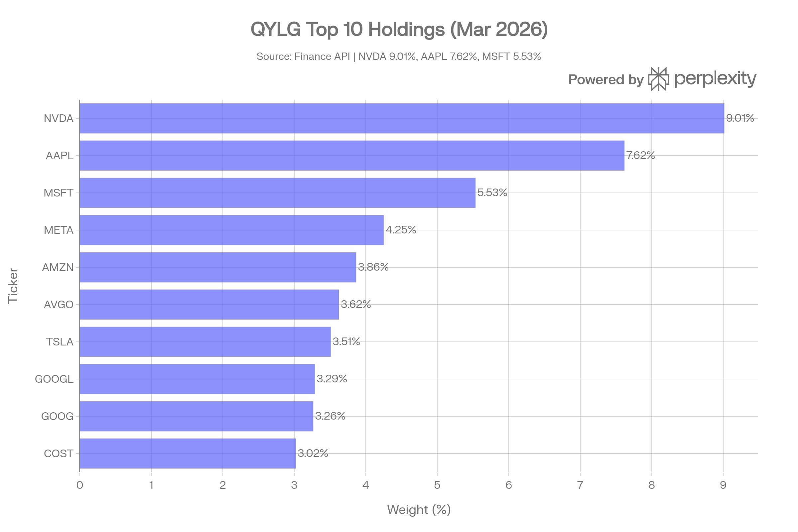
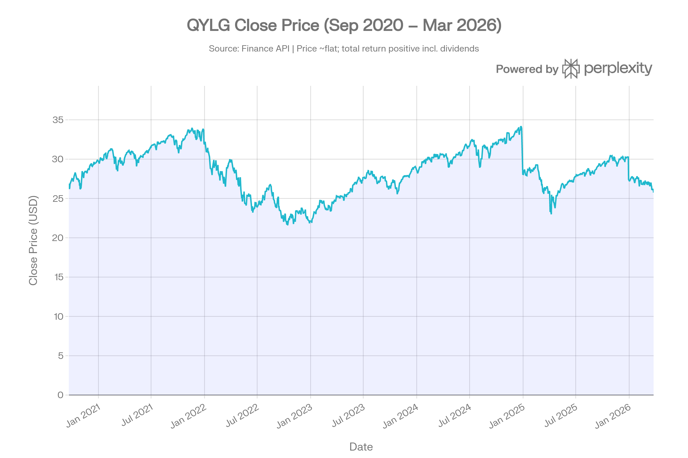
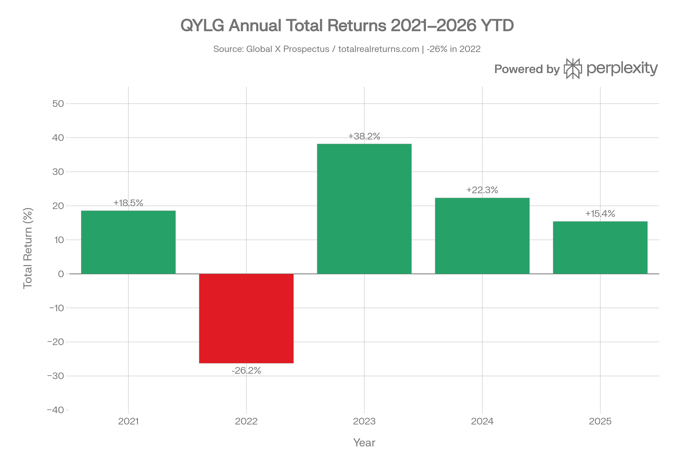

# QYLG (Global X Nasdaq 100 Covered Call & Growth ETF) 종합 분석 보고서
> <strong>분석 기준일: 2026년 3월 27일</strong>

***

## ETF 분류

| 항목 | 내용 |
|---|---|
| 최종 폴더 | `ETF/Dividend Income/Option Income/Nasdaq-100/QYLG` |
| 대분류 | 배당·인컴 |
| 하위 분류 | 옵션 인컴 / Nasdaq-100 |
| 핵심 전략 | Nasdaq-100 포트폴리오를 보유하면서 약 50%에만 ATM 월간 콜옵션을 매도해 옵션 인컴과 상승 참여를 함께 추구 |
| 운용 방식 | Cboe Nasdaq-100 Half BuyWrite V2 Index를 추종하는 패시브 하프 커버드콜 ETF |
| 레버리지/인버스 | 없음 |
| 옵션 인컴 여부 | 있음 |
| 분류 판단 | Nasdaq-100 노출이 있지만 핵심 목적이 커버드콜 프리미엄과 성장 참여의 혼합이므로 대표지수보다 `배당·인컴 > 옵션 인컴` 분류를 우선 적용 |

***

## 1. 기본 정보
QYLG는 Global X ETFs가 2020년 9월 18일에 출시한 <strong>"하프 커버드콜(Half Covered Call)"</strong> 전략 ETF입니다. QYLD(100% 커버드콜)와 QQQ(100% 성장) 사이의 중간 지점을 목표로, 나스닥-100 포지션의 <strong>약 50%에만 콜옵션을 매도</strong>하여 배당 수입과 자본 성장을 동시에 추구합니다.[1][2][3]

| 항목 | 내용 |
|------|------|
| 정식명 | Global X Nasdaq 100 Covered Call & Growth ETF |
| 티커 | QYLG |
| 설정일 | 2020년 9월 18일[1][4] |
| 추종 지수 | Cboe Nasdaq-100 Half BuyWrite V2 Index (BXNH)[3][5] |
| 운용사 | Global X ETFs (Mirae Asset 계열)[1] |
| 상장거래소 | NASDAQ[3] |
| AUM | 약 \$133\~135M (2026년 3월)[1][6] |
| 현재가 | \$25.74 (2026-03-26) |
| 총 보수(TER) | 0.35%[1][7] |
| 운용 방식 | 패시브(지수 추종)[4] |
| 배당 주기 | 매월(Monthly)[1] |
| PE 비율 | 31.72배 |

***
## 2. 전략 구조: "하프 바이라이트(Half BuyWrite)"
### 추종 지수: Cboe Nasdaq-100 Half BuyWrite V2 Index (BXNH)
BXNH 지수는 나스닥-100 주식 포트폴리오를 보유하면서, <strong>매월 만기 ATM(등가격) 나스닥-100 콜옵션을 포트폴리오 가치의 50%에 해당하는 수량만큼</strong> 매도하는 전략을 측정합니다. 전통적인 바이라이트(100% 커버드콜)와 달리 절반만 헤징하여 상승 잠재력을 부분적으로 보존합니다.[3][5][8]
### 기존 커버드콜 ETF와 차이점
| 구분 | QYLG (하프 커버드콜) | QYLD (풀 커버드콜) | QQQ (순수 성장) |
|------|---------------------|-------------------|----------------|
| 콜옵션 매도 비율 | <strong>50%</strong>[3] | 100%[2] | 0% |
| 업사이드 참여 | <strong>부분 허용</strong> | 거의 차단 | 완전 참여 |
| 배당수익률 | \~5\~7%[7][9] | \~11\~13% | \~0.5% |
| 장기 자본이득 잠재력 | 중간 | 낮음 | 높음 |
| 총수익(장기) | <strong>QYLD 대비 우월</strong>[10] | QQQ 대비 열위 | 최고 |
### 운용 메커니즘
매 달력 월 초, 포트폴리오는 나스닥-100 구성 종목을 직접 보유하면서 해당 포트폴리오 가치의 50%에 해당하는 1개월 만기 ATM 나스닥-100 콜옵션을 매도합니다. 옵션 만기 시 지수가 행사가격을 상회하면 초과 수익의 50%는 콜 매도를 통해 포기하고, 나머지 50%는 보유 주식을 통해 향유합니다. 펀드는 80% 이상을 기초지수 구성 자산에 직접 투자하는 <strong>완전 복제(full replication) 방식</strong>을 채용합니다.[3][11]

***
## 3. 추종 성과 지표
### 추적오차(Tracking Error) 및 추적 차이
QYLG는 기초지수(BXNH)를 패시브하게 복제하며, Global X 공식 데이터 기준으로 NAV, 시장가격, 지수 간 성과가 매우 근접합니다.[1]

| 기간 | NAV 수익률 | 시장가 수익률 | 지수 수익률 | 추적 차이 |
|------|-----------|------------|-----------|----------|
| 1년 | 15.64%[1] | 15.44%[1] | 16.61%[1] | -0.97%p |
| 3년(연환산) | 23.95%[1] | 23.90%[1] | 24.82%[1] | -0.87%p |
| 5년(연환산) | 12.55%[1] | 12.54%[1] | 13.29%[1] | -0.74%p |

> 추적 차이는 대체로 총보수율(0.35%) 수준이며, 이는 완전 복제 전략의 효율성을 반영합니다.
### NAV 대비 시장가격 괴리율
AUM이 \$133M 수준으로 상대적으로 작은 편이나, 일평균 거래량 약 51,961주(3개월 기준)로 평균적인 괴리율은 낮게 유지됩니다. 30일 SEC 수익률은 <strong>0.33\~0.52%</strong>로 순수 배당 수익 관점에서는 낮은 편입니다.[7][12]

***
## 4. 비용 구조
### 총 보수(TER)
QYLG의 총 보수율은 <strong>0.35%</strong>입니다. 동일한 나스닥-100 커버드콜 계열의 QYLD(0.60%) 대비 25bp 저렴하며, QDTE(0.97%) 대비는 약 1/3 수준으로 매우 경쟁력 있습니다.[1][7]
### 경쟁 ETF 비용 비교
| ETF | 전략 | 보수율 | 콜 매도 비중 | TTM 배당수익률 |
|-----|------|--------|------------|--------------|
| <strong>QYLG</strong> | 하프 커버드콜 (NDX) | <strong>0.35%</strong>[1] | 50%[3] | \~5\~7%[9] |
| QYLD | 풀 커버드콜 (NDX) | 0.60% | 100%[2] | \~11\~13% |
| JEPQ | ELN 기반 (NDX) | 0.35% | \~20\~30% (재량) | \~9\~11% |
| QQQ | 순수 NDX 추종 | 0.20% | 없음 | \~0.5% |
| XYLD | 하프 커버드콜 (SPX) | 0.35% | 100% | \~19\~20% |
### 포트폴리오 회전율
기초지수가 분기별 리밸런싱되는 나스닥-100을 따르므로, 연간 회전율은 약 <strong>5\~15%</strong> 수준으로 추정됩니다. 옵션은 매월 갱신되지만 주식 포트폴리오 자체는 나스닥-100 구성 변화 시에만 조정됩니다.

***
## 5. 유동성 평가
QYLG는 AUM \$133M 규모로 동급 커버드콜 ETF(QYLD: \~\$8B, JEPQ: \~\$20B+)에 비해 현저히 작습니다. 이는 유동성 제약으로 이어져, 일평균 거래량은 약 <strong>51,961주(3개월 기준)</strong>, 일평균 거래대금은 약 <strong>\$1.42M</strong>에 불과합니다.[1][6]

| 유동성 지표 | 수치 |
|------------|------|
| AUM | \~\$133\~135M[1][6] |
| 일평균 거래량 (3M) | \~51,961주 |
| 일평균 거래대금 (3M) | \~\$1.42M |
| 10일 평균 거래량 | 39,838주[12] |
| 52주 가격 범위 | \$22.15\~\$30.55 |
| 1년 펀드플로우 | +\$17.88M[4] |

AUM 규모가 작아 대량 거래 시 스프레드 확대 위험이 있으므로, <strong>대규모 포지션 진입 시 시장가 주문을 지양</strong>하고 지정가 주문을 권장합니다.

***
## 6. 포트폴리오 구성
### 상위 10대 보유 종목 (2026년 3월 기준)

| 순위 | 티커 | 종목명 | 비중 |
|------|------|--------|------|
| 1 | NVDA | NVIDIA | 9.01% |
| 2 | AAPL | Apple | 7.62% |
| 3 | MSFT | Microsoft | 5.53% |
| 4 | META | Meta Platforms | 4.25% |
| 5 | AMZN | Amazon | 3.86% |
| 6 | AVGO | Broadcom | 3.62% |
| 7 | TSLA | Tesla | 3.51% |
| 8 | GOOGL | Alphabet A | 3.29% |
| 9 | GOOG | Alphabet C | 3.26% |
| 10 | COST | Costco | 3.02% |

<strong>상위 10종목 합계: 약 46.97%</strong> — 나스닥-100 자체의 집중도를 그대로 반영합니다.
### 섹터별 배분
펀드는 기초지수(나스닥-100) 구성과 동일하게 집중 투자하며, 2025년 12월 기준 <strong>반도체·반도체 장비 산업에 25% 이상 집중</strong>되어 있고 <strong>정보기술(IT) 섹터에 상당한 노출</strong>을 가집니다.[3]

| 섹터 | 추정 비중 |
|------|----------|
| 정보기술(IT) | \~50\~55%[3] |
| 경기소비재 | \~15% |
| 커뮤니케이션서비스 | \~10% |
| 헬스케어 | \~7% |
| 기타 | \~13% |

가중평균 시가총액은 <strong>\$1,808,462M(약 \$1.81조)</strong>으로 초대형주 중심입니다.[1]
### 국가별 분산
나스닥-100 지수를 직접 복제하므로 실질적으로 <strong>미국 대형주 100%</strong> 포트폴리오입니다. 단, ARM(영국), Check Point(이스라엘) 등 나스닥 상장 외국 기업이 소수 포함됩니다.
### 리밸런싱 주기
기초지수(나스닥-100) 분기별 리밸런싱을 따르며, 커버드콜 옵션은 <strong>매월 ATM 옵션으로 갱신</strong>됩니다.[3]

***
## 7. 성과 분석
### 가격 수익률 vs 총수익률

QYLG의 주가는 설정일(\$26.38) 이후 \$25.74로 약 -2.41% 하락했습니다. 그러나 이 기간 동안 지급된 누적 배당을 포함한 <strong>총수익률은 유의미하게 양호</strong>합니다. 설정 이후 연환산 총수익률은 약 <strong>11.25%</strong>로, 같은 기간 순수 배당에 집중한 QYLD 대비 높은 자본 보전력을 보였습니다.[10][3]
### 기간별 총수익률 (배당 포함)
| 기간 | QYLG | QYLD | QQQ | 비고 |
|------|------|------|-----|------|
| 1년 | +15.64%[1] | +14.39%[13] | \~+22% | QYLG > QYLD |
| 3년(연환산) | +23.95%[1] | 낮음 | \~+20% | QYLG 우위 |
| 5년(연환산) | +12.55%[1] | 낮음 | \~+17% | QQQ 우위 |
| 설정 이후(연환산) | <strong>+11.25%</strong>[3] | — | \~+17% | QQQ 우위 |

### 연간 총수익률 내역

| 연도 | 총수익률 | 비고 |
|------|---------|------|
| 2021 | +18.54%[3] | NDX 강세 부분 참여 |
| 2022 | <strong>-26.25%</strong>[3] | NDX 조정, 옵션프리미엄으로 일부 방어 |
| 2023 | <strong>+38.16%</strong>[3] | 강세장 회복 충분히 참여 |
| 2024 | +22.31%[3][14] | NDX(+25.58%) 대비 소폭 하회 |
| 2025 | +15.38%[3][14] | NDX(+20.77%) 대비 하회 |
| 2026 YTD | -2.04%[14] | NDX(-4.16%) 대비 방어 성공 |

> 2022년 하락장에서 QQQ(-32.6%)보다 손실을 억제했고, 2023년 상승장에서도 +38.16%로 상당 부분 참여한 것이 전략의 유효성을 보여줍니다.[3]
### 벤치마크 대비 성과
Schwab 데이터 기준(2025년 10월 기준), 설정 이후 QYLG는 \$18,818로 성장하여 Derivative Income 카테고리 평균(\$17,471)을 상회했으나, S&P500 TR(\$21,931)에는 미치지 못했습니다.[12]

***
## 8. 배당 정보
QYLG는 <strong>매월 배당</strong>을 지급합니다. 배당 재원은 50%분의 커버드콜 프리미엄으로, QYLD 대비 절반 수준의 프리미엄 수입을 창출하나 배당수익률보다 총수익률을 중시하는 설계입니다.[1][2][3]
### 배당 수익률 및 이력
- <strong>TTM 배당수익률</strong>: 약 5.76\~6.50%[9]
- <strong>연간 총 배당금</strong>: 약 \$1.63\~\$1.73/주[9]
- <strong>30일 SEC 수익률</strong>: 0.33\~0.52% — 경상수익이 배당보다 낮아 일부 배당이 자본환급(RoC) 성격[7][12]
### 최근 배당 이력[15]
| 지급일(근사) | 배당금 |
|------------|--------|
| 2025년 2월 | \$0.1277 |
| 2025년 1월 | \$0.1592 |
| 2024년 12월 | <strong>\$5.2983</strong> (연말 특별 배당 포함) |
| 2024년 11월 | \$0.1757 |
| 2025년 8월 | \$0.1356[9] |

> 2024년 12월에 \$5.30의 대규모 배당이 지급된 것은 연말 자본이득 분배 성격이 포함되어 특이치로 보아야 합니다.
### 5년 연속 월 배당 지급
Global X 공식 자료에 따르면 QYLG는 <strong>5년 연속 월 배당을 지급</strong>해왔으며, 배당 지속성 면에서 신뢰도가 높습니다.[1]

***
## 9. 리스크 요소
### 핵심 리스크 지표
| 지표 | QYLG | QYLD | QQQ |
|------|------|------|-----|
| 베타 (5년) | 0.83[16] | \~0.57[13] | \~1.0 |
| 3Y 변동성 | 10.9%[16] / 19.21% | 낮음 | \~22% |
| 최대 낙폭(All-time) | <strong>-29.98%\~-36.49%</strong>[17] | -24.75%[13] | -82.98%[17] |
| 샤프 비율(1Y) | 0.84[17][13] | 0.57[13] | \~0.98[17] |
| QYLD와 상관계수 | 0.85[13] | — | — |
### 주요 리스크 분석
<strong>1. 상승 업사이드 제한(절반 캡)</strong>
포트폴리오의 50%가 콜옵션으로 헤징되어 있으므로, 강한 상승장에서 QQQ 대비 수익이 제한됩니다. 2024년 QQQ(+25.58%) 대비 QYLG(+22.31%), 2025년 QQQ(+20.77%) 대비 QYLG(+15.38%)가 이를 반영합니다.[3][14]

<strong>2. 낮은 AUM 및 유동성 리스크</strong>
AUM \~\$133M은 동급 ETF(QYLD \~\$8B, JEPQ \~\$20B+) 대비 현저히 작아, 대량 매매 시 Bid/Ask 스프레드 확대 및 유동성 충격 위험이 존재합니다.[1]

<strong>3. 기술 섹터 집중 리스크</strong>
나스닥-100 기반으로 IT 섹터 \~50\~55%에 집중되어 있으며, 반도체·반도체 장비 산업에 25%+ 집중됩니다. 기술주 사이클 변화에 고도로 의존합니다.[3]

<strong>4. 하락장 손실 위험</strong>
50% 커버드콜이 하락 시 부분적 완충만 제공합니다. 2022년 -26.25% 손실은 QYLD(-24.75%) 대비 오히려 약간 더 컸습니다. 즉 하락 방어보다는 상승 참여에 방점이 있는 전략입니다.[13][3]

<strong>5. 배당 변동성</strong>
배당은 옵션 프리미엄(변동성 수준에 연동)과 시장 상황에 따라 변동됩니다. 저변동성 환경에서는 배당이 감소하는 경향이 있습니다.

<strong>6. 섹터·지역 집중</strong>
실질적으로 미국 나스닥-100 단일 집중 포지션으로, 글로벌 분산 효과가 없습니다.[3]

***
## 10. 경쟁 ETF와의 종합 비교
| 항목 | QYLG | QYLD | JEPQ | QQQ |
|------|------|------|------|-----|
| 콜 매도 비율 | 50%[3] | 100%[2] | \~20\~30% | 없음 |
| AUM | \$133M[1] | \~\$8B | \~\$20B+ | \~\$350B+ |
| 보수율 | 0.35%[1] | 0.60% | 0.35% | 0.20% |
| TTM 배당수익률 | \~5.76%[9] | \~11\~13% | \~9\~11% | \~0.5% |
| 1년 총수익 | 15.64%[1] | 14.39%[13] | \~18% | \~22% |
| 설정이후 연환산 | 11.25%[3] | 낮음 | — | \~17% |
| 최대 낙폭 | -29.98%[17] | -24.75%[13] | 낮음 | -82.98%[17] |
| 베타 | 0.83[16] | \~0.57 | \~0.6 | \~1.0 |
| 샤프 비율 | 0.84[13][17] | 0.57[13] | 높음 | \~0.98 |

***
## 11. 종합 평가
QYLG는 <strong>"나스닥-100의 성장 잠재력을 절반 보존하면서 월 배당도 수취"</strong>하는 절충형 전략으로, QYLD와 QQQ 사이의 합리적 중간지점을 제공합니다.[1][10]

설정 이후 5년 이상의 이력에서 QYLD 대비 총수익률 우위를 꾸준히 기록해왔습니다. 3년 연환산 총수익률 23.95%는 동급 배당 ETF 중 카테고리 상위 3\~6%에 해당하는 탁월한 성과입니다.[10][14][11][1]

<strong>투자 적합 케이스:</strong>
- 나스닥-100 성장에 참여하면서 월 배당(\~5\~7%)도 받고자 하는 투자자
- QYLD의 NAV 에로전이 우려되어 절충안을 찾는 투자자
- 중간 위험 수준에서 커버드콜 프리미엄을 활용하려는 투자자
- 장기 총수익 목표 + 월정 현금흐름을 동시 추구하는 투자자

<strong>투자 주의 케이스:</strong>
- 나스닥-100 완전 참여를 원하는 성장 지향 투자자 → QQQ/QQQM 선호
- 최고 배당수익률을 원하는 투자자 → QYLD/QDTE 등이 우월
- 대규모 포지션(수억 원 이상) 구축 시 → 유동성 제약 유의
- 기술주 사이클 하락 우려 시 → 기술주 집중도 고려 필요

QYLG의 핵심 경쟁력은 <strong>낮은 비용(0.35%) + 절반 업사이드 보존 + 5년 이상 월 배당 지속</strong>에 있으며, AUM 규모만 더 커진다면 훨씬 매력적인 선택지가 될 ETF입니다.[3][7][1]
