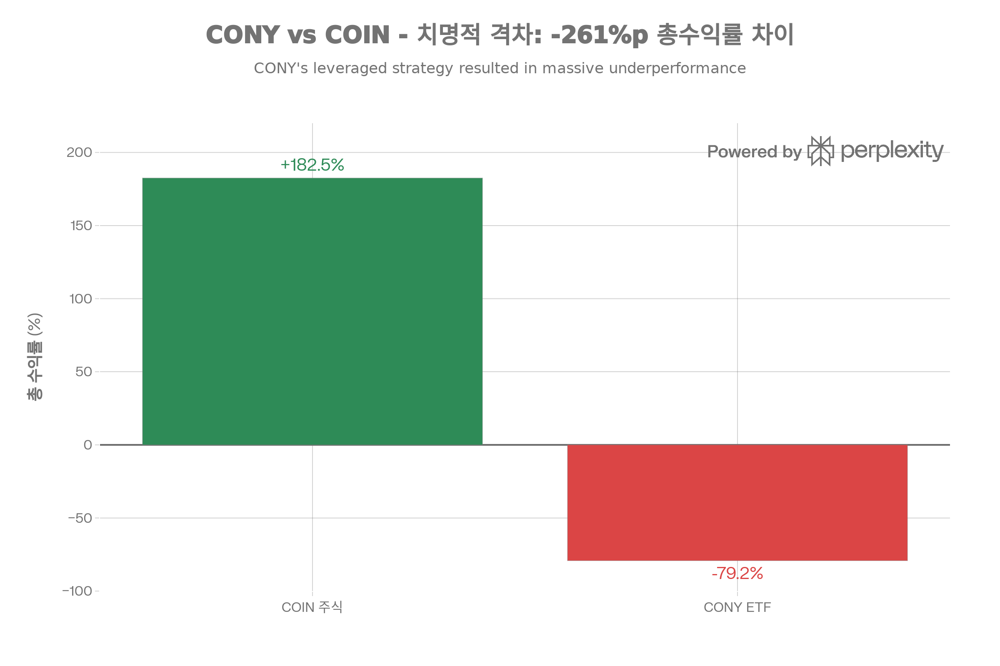

## 핵심 요약 (Executive Summary)

<strong>CONY(YieldMax COIN Option Income Strategy ETF)</strong> 는 2023년 8월 YieldMax가 출시한 <strong>Coinbase(COIN) 주식에 대한 합성 커버드콜 ETF</strong>로, <strong>주당 \$203.10에서 출시하여 2026년 1월 현재 \$42.26으로 -79.2% 폭락</strong>하며 투자자 자본을 대량 파괴했습니다. 같은 기간 COIN 주식은 \$80에서 \$226으로 <strong>+182.5% 상승</strong>하여, <strong>CONY는 COIN 대비 -261%p의 치명적 격차</strong>로 참패했습니다. <strong>159.89%라는 헤드라인 배당수익률은 위험한 환상</strong>—분배금의 96%가 자본환급(ROC)으로 투자자 원금을 돌려주는 것일 뿐이며, 실제 포트폴리오 수익률은 고작 3.53%입니다. 주간 배당(\$0.06-1.13의 극심한 변동성)을 받더라도 <strong>NAV 붕괴가 분배금을 압도</strong>하여 총수익률 참패로 이어졌습니다. CONY의 구조적 결함은 <strong>0-15% 월간 상승 제한 + 완전한 하방 노출</strong>로, COIN이 455% 랠리(\$80→\$444) 동안 CONY는 오히려 -79% 폭락했습니다. <strong>명확한 결론</strong>: CONY는 <strong>수학적으로 불가능한 160% 연간 분배(실제 수익은 3.53%)를 시도하는 수익률 함정</strong>이며, COIN 직접 보유 대비 모든 시나리오에서 열세입니다. 장기 투자자에게는 <strong>재앙적 선택</strong>입니다.[^1][^2][^3][^4][^5][^6][^7][^8][^9][^10]

## 펀드 기본 정보

### 개요

<strong>CONY</strong>는 YieldMax(ZEGA Financial)가 2023년 출시한 <strong>극단적 고배당 옵션 소득 ETF</strong>입니다:[^11][^1]

<strong>핵심 특징:</strong>

- <strong>운용사</strong>: YieldMax (ZEGA Financial)
- <strong>설정일</strong>: 2023년 8월 14일[^1][^12]
- <strong>상장거래소</strong>: NYSE Arca[^13]
- <strong>운용자산(AUM)</strong>: 6억 5,235만 달러[^1]
- <strong>운용보수</strong>: <strong>1.22%</strong>[^12][^1]
- <strong>투자 대상</strong>: <strong>Coinbase(COIN) 주식 옵션</strong> (합성 구조, 직접 보유 아님)[^6][^8][^1]
- <strong>투자 목표</strong>: 현재 소득 + COIN 제한적 상승[^2][^11][^1]


### 현재 시장 지표 (2026년 1월)

| 지표 | 수치 |
| :-- | :-- |
| 현재 가격 | \$42.26-42.66[^13][^1] |
| <strong>출시 가격</strong> | <strong>\$203.10</strong>[^4] |
| <strong>가격 변동</strong> | <strong>-79.2%</strong>[^1][^4] |
| 52주 최저가 | \$38.90[^1] |
| 52주 최고가 | \$143.40[^1] (2024년 3월) |
| <strong>Beta</strong> | <strong>3.05</strong>[^1] <strong>(극도로 높음)</strong> |
| <strong>배당수익률</strong> | <strong>159.89%</strong>[^1] <strong>(오해의 소지 극심)</strong> |
| 연간 배당금 (TTM) | \$68.08[^1] |
| 배당 빈도 | <strong>주간</strong> (52회/년)[^1][^14] |
| 발행주식수 | 1,860만 주[^1] |
| 시가총액 | \$6억 5,235만[^1] |
| 일평균 거래량 | 498,531주[^1] |

## 투자 전략 심층 분석

### 합성 커버드콜 전략: 구조적 결함

<strong>CONY는 COIN 주식을 직접 보유하지 않습니다</strong>:[^1][^2][^6][^8]

<strong>실제 구조</strong>:

- 합성 옵션으로 COIN 노출 복제
- 70-80% US 국채 보유[^13][^2]
- 커버드콜 매도로 소득 창출

<strong>3가지 핵심 구성 요소</strong>:[^2][^8][^15]

<strong>1. 합성 롱 포지션</strong>:[^8][^2]

```
목적: COIN 주식 보유 없이 가격 움직임 복제
메커니즘:
- ATM(등가) 콜옵션 매수
- ATM 풋옵션 매도
- 만기: 1-6개월

예시:
COIN $200일 때:
- $200 콜 매수 (3개월 만기)
- $200 풋 매도 (3개월 만기)
= COIN $200 합성 롱 (델타 ~1.0)
= COIN 주식 0주 실제 보유
```

<strong>2. 커버드콜 매도</strong>:[^11][^2][^8]

- <strong>목적</strong>: 프리미엄 소득 창출
- <strong>메커니즘</strong>: COIN 콜옵션 매도
- <strong>만기</strong>: 1개월 이하
- <strong>행사가</strong>: 0-15% OTM (현재 COIN 가격 위)[^2][^8]
- <strong>주간 실행</strong>: 매주 옵션 롤링[^11]

<strong>3. US 국채 담보</strong>:[^13][^2]

- <strong>보유</strong>: 70-80% US T-bills[^13]
- <strong>이점</strong>: 이자 수입 + 안전성


### FLEX 옵션 활용[^15][^2]

<strong>FLEX 옵션이란?</strong>:[^15]

- <strong>F</strong>lexible <strong>E</strong>xchange-traded 옵션
- 맞춤형 조건 (행사가, 만기)
- OCC 청산 (결제 보증)[^15]
- 표준 옵션처럼 거래소 거래

<strong>왜 FLEX?</strong>:[^2]

- 정확한 행사가 타겟팅
- 맞춤 만기일 (주간 롤링)
- 프리미엄 수집 최적화
- 규제 거래소 (감독 받음)


### 주간 분배 모델: 극단적 변동성

<strong>지급 일정</strong>:

- <strong>빈도</strong>: 매주[^1][^14]
- <strong>배당락일</strong>: 보통 수요일
- <strong>지급일</strong>: 다음 수요일
- <strong>연 52회 분배</strong> vs 전통적 4회

<strong>최근 주간 분배</strong>:[^16][^7][^17]

- 고점: \$1.13/주 (단일 주)[^7]
- 저점: \$0.06/주 (단일 주)[^7]
- 평균: \$0.50-0.80/주
- <strong>변동 범위</strong>: 1,783% (고점/저점 비율)

<strong>연환산 "수익률"</strong>:[^1]

- 최근 주간: \$0.7951 × 52주 = \$41.34/년
- 현재 가격: \$42.26
- <strong>헤드라인 수익률</strong>: 159.89%
- <strong>완전히 지속 불가능</strong>


## 성과 분석: 치명적 실패

### 역사적 수익률 (2023년 8월 \~ 2026년 1월)

<strong>CONY 공식 성과</strong>:[^1]


| 기간 | NAV 수익률 |
| :-- | :-- |
| <strong>YTD 2026</strong> | +9.63% |
| <strong>1년</strong> | -17.51% |
| <strong>출시 이후 연환산</strong> | +26.72% |

<strong>가격 이력</strong>:[^4]

- 출시 (2023년 8월): \$203.10
- 정점 (2024년 3월): \$143.40
- 현재 (2026년 1월): \$42.26
- <strong>하락</strong>: -79.2% (출시가 대비)


### vs COIN 직접 보유: CONY 압도적 패배


CONY는 출시 이후(2023년 8월\~2026년 1월) COIN 대비 -261%p의 치명적 격차로 참패했습니다. COIN이 +182.5% 상승하는 동안 CONY는 -79.2% 폭락하여 160%라는 헤드라인 배당수익률(96% ROC)도 NAV 붕괴를 상쇄하지 못했습니다. 커버드콜 전략이 상승을 0-15%로 제한하면서 하방은 완전 노출시킨 구조적 결함이 원인입니다.

위 차트가 명확히 보여주듯이, <strong>CONY는 COIN 대비 -261%p의 치명적 격차</strong>입니다:[^5][^9]

<strong>출시 이후</strong> (2023년 8월\~2026년 1월):[^16][^9][^10][^5]

<strong>COIN 주식</strong>:

- 2023년 8월: \~\$80[^10]
- 2026년 1월: \$226[^7]
- <strong>상승</strong>: +182.5%

<strong>CONY 가격</strong>:

- 2023년 8월: \$203.10[^4]
- 2026년 1월: \$42.26[^1]
- <strong>하락</strong>: -79.2%

<strong>총 수익률 비교</strong> (분배금 포함):[^9][^5]


| 지표 | CONY | COIN |
| :-- | :-- | :-- |
| 가격 CAGR | <strong>-14.56% to -10.30%</strong> | +0.97% to +2.96% |
| 배당 CAGR | -28.72% to -22.61% | 0% (무배당) |
| 2.2년 총수익 | 초기 투자자 +, 최근 투자자 - | <strong>+182.5%</strong> |
| 세금 처리 | 일반 소득 | <strong>장기 자본이득 20%</strong> |

<strong>Seeking Alpha 분석</strong> (2024년 10월):[^5]
> "CONY investors sitting on 100% gains, most of which is taxable income, COIN investors sitting on 200% gains, most of which is capital gains."

<strong>YouTube 비교</strong> (2025년 7월, 6개월):[^16]

- COIN: +69.06%
- <strong>CONY: -20.86%</strong>
- 분배금 재투자: CONY +13.7%, <strong>여전히 -55.36%p 뒤처짐</strong>

<strong>DripCalc 예측</strong> (2.2년 데이터):[^9]

- CONY: 주가 -10.30% CAGR
- COIN: 주가 +0.97% CAGR
- <strong>10년 예측</strong>: CONY 주당 \$2.51, COIN 주당 \$394


### NAV 하락: 핵심 문제

<strong>NAV 하락이란?</strong>[^3][^18][^14]

분배금이 실제 수익 초과 시:

1. 펀드가 주당 \$10 분배
2. 펀드가 프리미엄에서 주당 \$6만 벌어들임
3. <strong>\$4/주 = 자본환급 (ROC)</strong>
4. NAV가 \$4 하락 (배당락일 하락 별도)
5. 매주 반복 → NAV 붕괴

<strong>CONY의 NAV 하락</strong>:[^19][^7][^3]

<strong>AInvest 분석</strong> (2025년 7월):[^3]
> "CONY's high yield is a double-edged sword: it compensates for NAV volatility in the short term but carries existential risks over time... <strong>96.71% of the June 2025 distribution was return of capital.</strong>"

<strong>96.71% ROC</strong>:[^3]

- 실제 소득은 고작 3.29%
- 나머지는 투자자 원금 반환
- 취득원가 감소
- 결국 자본이득세 발생

<strong>NAV 하락</strong>:[^7][^3]

- YTD 2025 NAV: +28.63%
- 1년 NAV: <strong>-48.88%</strong>
- 출시 이후: 대규모 하락
- 현재 \$42.26 (출시가 \$203.10에서)

<strong>Reddit 토론</strong>:[^18]
> "The repetitive payment of distributions may significantly erode an Underlying YieldMax™ ETF's NAV and trading price over time, potentially resulting in notable losses for investors."

<strong>YieldMax 공식 경고</strong>:[^18]
> "NAV Erosion Risk Due to Distributions... The repetitive payment of distributions may significantly erode an Underlying YieldMax™ ETF's NAV and trading price over time."

## 배당 정보: 오해의 소지 160% 수익률

### 현재 배당 지표[^1][^20][^14]

<strong>경고</strong>: 159.89% 수익률은 <strong>극도로 오해의 소지</strong>

- <strong>헤드라인 수익률</strong>: 159.89%[^1]
- <strong>연간 배당금 (TTM)</strong>: \$68.08[^1]
- <strong>빈도</strong>: 주간[^14][^1]
- <strong>최근 주간</strong>: \$0.7951[^14]
- <strong>배당락일</strong>: 주간 (수요일)


### 160% 수익률이 불가능한 이유

<strong>간단한 수학</strong>:[^1][^7]

- 현재 가격: \$42.26
- 연간 배당: \$68.08
- <strong>수익률</strong>: 161%

<strong>문제</strong>: 연 161% 분배하면서 NAV 유지 불가능

<strong>현실 확인</strong>:[^3][^7]

1. <strong>96.71%가 자본환급</strong>[^3]
2. 옵션 프리미엄에서 3.29%만
3. 원금 분배, 수익 아님
4. NAV가 분배금만큼 하락
5. <strong>정의상 지속 불가능</strong>

### 분배금 변동성: 극심한 변동[^16][^7][^17]

<strong>최근 주간 분배</strong>:[^16][^7][^17]


| 기간 | 분배금 |
| :-- | :-- |
| 고점 | \$1.13/주 (단일 주)[^7] |
| 저점 | \$0.06/주 (단일 주)[^7] |
| 평균 | \$0.50-0.80/주 |
| <strong>변동</strong> | <strong>1,783%</strong> |

<strong>변동 요인</strong>:

1. COIN 변동성 (옵션 프리미엄 결정)
2. 비트코인 가격 변동
3. 내재 변동성 수준
4. 행사가 선택
5. 시장 심리

<strong>경쟁사 비교</strong>:[^16]

- COIW (경쟁 ETF): \$8.93 누적 (6개월)
- CONY: \$2.96 누적 (동일 기간)
- <strong>COIW가 201% 더 지급</strong>


### 세금 처리: 악몽[^5][^14]

<strong>분배금 구성</strong>:[^14]

- <strong>96-99% 자본환급</strong>[^3][^14]
- 1-4% 일반 소득/자본이득
- 주간 분배 = 세금 복잡성

<strong>ROC 세금 영향</strong>:[^18][^14]

1. <strong>즉시 과세 안 됨</strong> (좋음)
2. <strong>취득원가 감소</strong> (중립)
3. <strong>결국 자본이득 과세</strong> (원가 \$0 시)
4. <strong>연 52회 분배</strong> = 보고 악몽

<strong>Seeking Alpha 세금 분석</strong>:[^5]
> "CONY investors sitting on 100% gains, most of which is taxable income" vs "COIN investors sitting on 200% gains, most of which is capital gains"

<strong>세금 불리함</strong>:

- CONY: 일반 소득 세율 (최대 37%) + 주간 복잡성
- COIN: 장기 자본이득 (20%) + 단순


## 전략 분석

### CONY 장점 (제한적)

<strong>1. 주간 현금 흐름</strong>:[^11][^14]

- 연 52회 지급
- 일관된 일정
- 소득 추구자 매력
- <strong>하지만 분배금 감소 중</strong>[^3][^7]

<strong>2. 직접 COIN 보유 불필요</strong>:[^1][^6][^8]

- 합성 노출
- 실제 주식 구매 없음
- 초기 자본 요구 낮음
- <strong>하지만 COIN 배당 포기</strong>[^8][^15]

<strong>3. 변동성 기간 높은 소득</strong>:[^3]

- COIN 변동성 → 높은 옵션 프리미엄
- 2024년 암호화폐 강세: 높은 분배
- 단기 소득 극대화
- <strong>하지만 NAV 동시 붕괴</strong>


### CONY 단점 (치명적)

<strong>1. 극단적 NAV 하락: 출시 이후 -79%</strong>[^1][^3][^4][^7]

<strong>수치</strong>:[^4][^1]

- 출시: \$203.10 (2023년 8월)
- 현재: \$42.26 (2026년 1월)
- <strong>하락</strong>: -79.2%

<strong>30일 SEC 수익률</strong>: 고작 3.53%[^3]

- 진짜 포트폴리오 소득
- vs 159.89% 헤드라인 수익률
- <strong>156.36%p 격차</strong> = ROC

<strong>AInvest 경고</strong>:[^3]
> "The fund's NAV has become a rollercoaster... The -48.88% annual decline reflects the perils of COIN's volatility."

<strong>2. COIN 대비 대규모 저성과</strong>[^5][^16][^6][^9]

<strong>총수익률 비교</strong>:[^9][^5]

- COIN: +182.5% (2023년 8월 \~ 2026년 1월)
- CONY: -79.2% 가격, +X% 분배 = 여전히 막대한 손실
- <strong>COIN이 200-300%p 승리</strong>

<strong>YouTube 분석</strong> (6개월):[^16]

- COIN: +69.06%
- CONY: -20.86%
- 분배 재투자: CONY +13.7%, <strong>여전히 -55.36%p 뒤처짐</strong>

<strong>AOL Finance</strong> (2025년 6월):[^6]
> "Bitcoin has rallied this year, and so has Coinbase stock. In contrast, CONY stock is down on a year-to-date basis. This is undoubtedly a disappointing outcome."

<strong>3. 상승 제한, 완전 하방</strong>[^2][^8][^6][^3]

<strong>커버드콜 구조</strong>:[^8][^2]

- <strong>상승</strong>: 행사가에서 제한 (0-15% OTM)
- <strong>하방</strong>: 합성 롱으로 완전 노출
- <strong>비대칭 리스크/보상</strong>

<strong>2024-2025년 예시</strong>:[^7][^6]

- COIN 랠리: \$80 → \$444 (455% 상승)
- CONY 예상: 월 0-15% 포착
- <strong>현실</strong>: CONY \$203 → \$42 (-79%)
- <strong>커버드콜이 랠리 중 도움 안 됨</strong>

<strong>247 Wall Street 분석</strong>:[^7]
> "While CONY's 56% yield appears attractive, total return tells a different story. The ETF has fallen 30% over the past year... An investor who purchased CONY at the beginning of 2025 at \$52.89 would have collected substantial dividends but still faces a 26% capital loss."

<strong>4. 단일 주식 집중 리스크</strong>[^12][^1][^3]

<strong>100% COIN 노출</strong>:[^1][^12]

- 분산 없음
- COIN 고유 리스크
- 암호화폐 시장 상관관계
- 규제 불확실성

<strong>COIN 취약성</strong>:[^3][^7]

- 수익이 암호화폐 거래량 의존
- 규제 조사 (SEC 소송)
- 비트코인 가격 의존
- 사이버 보안 위협
- 거래소 경쟁

<strong>5. 극도로 높은 운용보수</strong>[^12][^1]

<strong>1.22%</strong>:[^1]

- JEPI: 0.35% (CONY가 249% 비쌈)
- SPYI: 0.68% (CONY가 79% 비쌈)
- VOO: 0.03% (CONY가 3,967% 비쌈)

<strong>\$10,000 연간 비용</strong>:

- CONY: \$122
- JEPI: \$35
- <strong>연 \$87 추가 비용</strong>

<strong>6. 극단적 변동성: Beta 3.05</strong>[^1]

<strong>Beta 3.05</strong>:[^1]

- S\&P 500 대비 3배 변동성
- COIN Beta 보통 2-2.5x
- <strong>CONY가 COIN보다 더 변동적</strong>
- 레버리지 유사 행동

<strong>52주 범위</strong>:[^1]

- 고점: \$143.40
- 저점: \$38.90
- <strong>범위</strong>: 268% (고점/저점)

<strong>7. 오해의 소지 수익률이 무지한 투자자 유인</strong>[^6][^7][^3]

<strong>160% 헤드라인 수익률</strong>:[^1]

- 장기적으로 수학적 불가능
- <strong>96% ROC 주도</strong>[^3]
- 수익률 추구자 유인
- NAV 붕괴 무시

<strong>AInvest 평결</strong>:[^3]
> "CONY's high yield is a siren song for income investors, but its risks demand sober scrutiny... For most, the answer is no."

## CONY vs 대안

### vs COIN 직접 보유[^5][^16][^6][^9]




CONY는 출시 이후(2023년 8월\~2026년 1월) COIN 대비 -261%p의 치명적 격차로 참패했습니다. COIN이 +182.5% 상승하는 동안 CONY는 -79.2% 폭락하여 160%라는 헤드라인 배당수익률(96% ROC)도 NAV 붕괴를 상쇄하지 못했습니다. 커버드콜 전략이 상승을 0-15%로 제한하면서 하방은 완전 노출시킨 구조적 결함이 원인입니다.


| 특징 | CONY | COIN | 승자 |
| :-- | :-- | :-- | :-- |
| 2023년 8월\~ | -79.2% + 분배 | <strong>+182.5%</strong> | <strong>COIN</strong> (260%p+) |
| YTD 2025 | -26% | +69% | <strong>COIN</strong> (95%p) |
| 세금 처리 | 일반 소득 | <strong>LTCG 20%</strong> | <strong>COIN</strong> |
| 상승 | 0-15% 월간 제한 | <strong>무제한</strong> | <strong>COIN</strong> |
| 하방 | 완전 노출 | 완전 노출 | 동점 |
| 배당 | <strong>주간 (160% 수익률)</strong> | 없음 | CONY (소득 중시 시) |
| 운용보수 | 1.22% | <strong>0%</strong> | <strong>COIN</strong> |
| 복잡성 | 높음 (옵션, ROC) | <strong>단순</strong> | <strong>COIN</strong> |

<strong>Seeking Alpha</strong> (2024년 10월):[^5]
> "COIN investors sitting on 200% gains, most of which is capital gains" vs "CONY investors sitting on 100% gains, most of which is taxable income."

<strong>평결</strong>: <strong>COIN이 총수익률에서 CONY 압도</strong>

### vs COIW (경쟁 COIN 소득 ETF)[^16]

| 특징 | CONY | COIW |
| :-- | :-- | :-- |
| 6개월 가격 | -20.86% | <strong>+32.08%</strong> |
| 6개월 분배 | \$2.96 | <strong>\$8.93</strong> (201% 더 많음) |
| 총수익 (6M) | +13.7% | <strong>+46.98%</strong> |
| 전략 | 합성 CC | 전통 CC |

<strong>YouTube 평결</strong>:[^16]
> "COIW is up \$15.67 for a 32.08% return... With CONY, we've seen dividends per share of \$2.96. With COIW, \$8.93. So it's paying out significantly more."

<strong>소득 ETF 중에서도 COIW가 압도적 우위</strong>

## 적합한 경우 (거의 없음)

### 드물게 수용 가능한 시나리오

<strong>1. 단기 COIN 강세 투기</strong>:

- COIN이 1-3개월 내 10-20% 상승 믿음
- 랠리 중 소득 원함
- 빠른 탈출 계획
- <strong>고위험, 타이밍 의존</strong>

<strong>2. 세금 손실 수확</strong>:

- 이미 COIN 손실 보유
- 31일간 CONY로 교체
- 암호화폐 노출 유지
- COIN 세금 손실 수확
- <strong>다시 COIN으로 교체</strong>

<strong>3. IRA에서 COIN 변동성 투기</strong>:

- IRA 계좌 (ROC 덜 문제)
- 단기 지평 (주/월)
- 높은 COIN 변동성 예상
- NAV 하락 리스크 수용
- <strong>탈출 전략 명확</strong>


### 투자자 프로필 (극도로 제한적)

✅ <strong>CONY가 괜찮을 수 있는 경우</strong>:

- <strong>고급 옵션 트레이더</strong> 합성 구조 이해
- <strong>단기 투기자</strong> (<3개월)
- <strong>IRA 계좌</strong> (ROC 세금 이연)
- <strong>고위험 감내</strong> (50%+ 손실 가능)
- <strong>적극적 모니터링</strong> (주간 분배, NAV)
- <strong>세금 손실 수확</strong> COIN과 함께

❌ <strong>CONY가 끔찍한 경우</strong>:

- <strong>장기 투자자</strong> (NAV 하락 재앙적)
- <strong>매수 후 보유</strong> (COIN 압도적 우위)
- <strong>소득 안정성 추구</strong> (분배 붕괴 중)
- <strong>보수적 투자자</strong> (Beta 3.05, -79% 하락)
- <strong>과세 계좌</strong> (일반 소득 + ROC 복잡성)
- <strong>160% 수익률에 끌림</strong> (지속 불가능 환상)
- <strong>은퇴 소득</strong> (불안정, 하락)
- <strong>분산 추구</strong> (100% COIN 노출)


## 전문가 의견 \& 커뮤니티

### Seeking Alpha 애널리스트 합의

<strong>"CONY: Yield Is High But Risk Is Higher"</strong>:[^1]
> "YieldMax COIN Option Income Strategy ETF offers high dividends but is risky with an annual expected return of -16% and a potential 70% YoY value loss."

<strong>"CONY: Don't Buy This Yield Trap"</strong>:[^1]
> "High-income option selling ETFs like CONY often erode principal value, which makes them a poor long-term investment despite high dividend yields."

<strong>"CONY: Say No To Temptation"</strong> (2025년 8월):[^19]
> "CONY's headline 140% yield is highly tempting, but it's largely driven by destructive return of capital that erodes NAV and share price... I recommend avoiding it due to unsustainable payouts and ongoing capital erosion."

<strong>"CONY: Why I'm Cautious After One Year (Rating Downgrade)"</strong> (2025년 11월):[^19]
> "YieldMax Coin Option Income Strategy ETF has delivered strong income, posting a 27% total return over the past year despite a 50% capital decline... The ETF remains a high-risk, high-yield instrument; headline yields are inflated by price declines."

### 금융 미디어 분석

<strong>AInvest</strong> (2025년 7월):[^3]
> "CONY's high yield is a double-edged sword: it compensates for NAV volatility in the short term but carries existential risks over time... Investors must ask themselves: Is the thrill of a 73% payout worth the gamble of a potential 50% drop in value? <strong>For most, the answer is no.</strong>"

<strong>247 Wall Street</strong> (2025년 12월):[^7]
> "CONY's income depends on option premium collection from Coinbase stock volatility... With COIN at \$226.14, these [short put] positions are deeply underwater, creating substantial risk... The fund's 1.22% expense ratio further erodes returns."

### Reddit/커뮤니티 토론

<strong>r/YieldMaxETFs</strong>:[^18]

사용자 질문:
> "순자산가치(NAV)가 어떻게 감소하는지 명확히 설명해 주실 수 있나요?"

<strong>주요 답변</strong>:[^18]
> "There are two main risks: First, significant declines in the underlying assets... Second, disbursing more funds than are received, which reduces the capital available for distribution... funds like XYLD have had to modify their distribution strategies."

<strong>YieldMax 공식 성명</strong>:[^18]
> "NAV Erosion Risk Due to Distributions... The repetitive payment of distributions may significantly erode an Underlying YieldMax™ ETF's NAV and trading price over time, potentially resulting in notable losses for investors."

## 2026년 전망

### 성과 기대

<strong>강세 시나리오</strong> (COIN 랠리):

- COIN: +50% (to \$339)
- CONY 상승: 월 0-15% 제한 = 총 +10-20%
- 높은 분배: 주당 \$0.80+ = 연 90% 수익률
- <strong>총 수익</strong>: +100-110%
- <strong>하지만 COIN 단독</strong>: +50%
- <strong>CONY 여전히 -50-60%p 저성과</strong>

<strong>기본 시나리오</strong> (COIN 횡보):

- COIN: \$226 (평탄)
- CONY: 느린 NAV 하락 (-10-20%)
- 적당한 분배: 주당 \$0.50 = 60% 수익률
- <strong>총 수익</strong>: +40-50%
- <strong>COIN 단독</strong>: 0%
- <strong>CONY가 +40-50%p 초과</strong> (CONY 승리 유일 시나리오)

<strong>약세 시나리오</strong> (COIN 폭락):

- COIN: -50% (to \$113)
- CONY: -50% to -70% (레버리지 하방)
- 낮은 분배: 주당 \$0.20 = 25% 수익률
- <strong>총 수익</strong>: -25% to -45%
- <strong>COIN 단독</strong>: -50%
- <strong>CONY가 +5-25%p 약간 나음</strong>


## 베스트 프랙티스 (CONY 회피)

### 대체 전략

<strong>COIN 노출</strong>:

1. <strong>COIN 주식 직접</strong>: 수수료 없음, 무제한 상승, 단순
2. <strong>COIN 콜옵션</strong>: 강세 시, 레버리지 이익
3. <strong>COIW</strong>: 소득 필요 시, CONY보다 나음[^16]
4. <strong>CONY 아님</strong> (-79% NAV 하락)

<strong>고소득</strong>:

1. <strong>JEPI</strong>: 7-12% 수익률, 안정 NAV, 분산
2. <strong>SPYI</strong>: 12% 수익률, Section 1256 세금 효율
3. <strong>SCHD</strong>: 3-4% 수익률, 배당 성장, 자본 이득
4. <strong>CONY 아님</strong> (160% 수익률 지속 불가)

### 이미 CONY 보유 시

<strong>권장사항</strong>: <strong>즉시 매도하고 COIN으로 전환</strong>

<strong>이유</strong>:

- 연 -10-30% NAV 하락 제거
- COIN 완전 상승 포착 (제한 안 됨)
- 세금 단순화 (LTCG vs 일반 소득 + ROC)
- 수수료 1.22%에서 0%로 감소

<strong>세금 고려사항</strong>:

- 과세 계좌: 자본 손실 가능성 (수확에 좋음)
- IRA: 즉시 매도 (세금 없음)
- ROC로 인한 원가 감소: 복잡하지만 보통 매도 정답


### 레드 플래그

🚩 <strong>160% 배당수익률에 끌림</strong> (지속 불가능 환상)
🚩 <strong>96% ROC 모름</strong> (본인 돈 돌려받기)
🚩 <strong>COIN 직접과 비교 안 함</strong> (+182% vs -79%)
🚩 <strong>주간 분배 = 보장 소득 생각</strong> (붕괴 중)
🚩 <strong>NAV 하락 이해 못함</strong> (출시 후 -79%)
🚩 <strong>3개월+ 보유</strong> (누적 하락)
🚩 <strong>과세 계좌 장기 사용</strong> (세금 악몽)

## 결론: "수익률 함정, 회피하라"

### 핵심 강점 (최소)

1. <strong>주간 현금 흐름</strong>: 연 52회 지급[^11][^14]
2. <strong>변동성 기간 높은 소득</strong>: 급등 시[^3]
3. <strong>COIN 보유 불필요</strong>: 합성 노출[^1][^6]
4. <strong>IRA 호환</strong>: 세금 이연 계좌에서 작동
5. <strong>규제 옵션</strong>: 거래소 거래, OCC 청산[^15]

### 치명적 약점

1. <strong>극단적 NAV 하락</strong>: 출시 후 -79%[^1][^4][^7]
2. <strong>대규모 저성과</strong>: COIN +182% vs CONY -79% = -261%p 격차[^5][^9]
3. <strong>지속 불가능 수익률</strong>: 160% 헤드라인, 실제 3.53%[^3]
4. <strong>96% ROC 분배</strong>: 원금 반환, 소득 아님[^14][^3]
5. <strong>상승 제한, 완전 하방</strong>: 커버드콜 보호 안 됨[^2][^6][^8]
6. <strong>단일 주식 집중</strong>: 100% COIN 노출[^1][^3]
7. <strong>극도로 높은 수수료</strong>: 1.22% (JEPI의 3.5배)[^1]
8. <strong>극단적 변동성</strong>: Beta 3.05 (시장의 3배)[^1]
9. <strong>오해의 소지 마케팅</strong>: 160% 수익률이 무지한 투자자 유인[^7][^3]
10. <strong>COIN 배당/권리 없음</strong>: 합성만[^8][^15]

### 최종 평가: "수학적 불가능, 수익률 함정"

<strong>CONY는 출시 이후(2023년 8월) 투자자 자본의 -79%를 파괴한 재앙적 수익률 함정</strong>으로, 같은 기간 COIN 주식은 +182% 상승했습니다. <strong>160% 헤드라인 배당수익률은 위험한 환상</strong>—96%가 자본환급(본인 돈 돌려받기)이며 실제 포트폴리오 수익은 고작 3.53%입니다. 주간 분배를 받더라도 CONY 투자자는 COIN 주식 단순 보유 대비 막대한 손실을 입었고, COIN의 +200% 이익은 유리한 장기 자본이득 세율로 과세되지만 CONY의 일반 소득은 불리합니다.[^1][^3][^4][^5][^9]

<strong>핵심 문제는 구조적</strong>입니다: CONY의 합성 커버드콜 전략은 <strong>월간 0-15% 상승을 제한하면서 완전한 하방에 노출</strong>시킵니다. COIN의 455% 랠리(\$80→\$444, 2023-2024) 동안 CONY는 \$203에서 \$42로 -79% 폭락했습니다. 주간 분배도 NAV 붕괴를 보상하지 못했습니다. 분배 재투자해도 CONY는 6개월간 COIN 대비 -55%p 저성과했고, 경쟁사 COIW는 +32% 상승하면서 201% 더 많은 분배를 지급했습니다.[^2][^4][^16][^6][^7][^8]

<strong>누가 CONY를 사야 하나?</strong> 거의 아무도. <strong>극소수 정당화 가능 사용</strong>:

1. <strong>세금 손실 수확</strong> COIN 포지션 (31일간 CONY 보유, 다시 교체)[^21]
2. <strong>단기 투기</strong> (<1개월) IRA 계좌에서 COIN 변동성
3. <strong>고급 트레이더</strong> 합성 구조 이해 + -79% NAV 하락 리스크 수용

<strong>누가 CONY를 피해야 하나?</strong> 다른 모든 사람:

- <strong>장기 투자자</strong>: NAV 하락이 부를 파괴 (연 -10-30% 지속)
- <strong>소득 추구자</strong>: 분배 감소, 96% ROC 지속 불가[^3][^19]
- <strong>COIN 믿음</strong>: COIN 직접 매수 (+182% vs -79%)[^5][^9]
- <strong>은퇴 소득</strong>: 너무 변동적 (Beta 3.05), 너무 불안정[^1]
- <strong>160% 수익률에 끌림</strong>: 본인 돈 돌려받는 것[^3]

<strong>권장사항</strong>: CONY 보유 시 <strong>즉시 매도하고 COIN 주식 직접 매수</strong>하세요. 지속적인 NAV 하락(-10-30%/년), 상승 제한(월 0-15%), 1.22% 운용보수는 10년간 0% 수수료에 무제한 상승의 COIN 보유 대비 수십만 달러 비용이 듭니다. 160% 수익률은 신기루—실제로는 3.53%만 벌면서 NAV 붕괴를 지켜보며 본인 원금을 받는 것입니다.

<strong>2026년 전망</strong>: COIN이 완벽히 횡보하지 않는 한(가능성 낮음), CONY는 재앙적 저성과를 지속할 것입니다. COIN 랠리 시(비트코인 채택으로 가능성) CONY는 월 0-15%만 포착하고 COIN은 급등합니다. COIN 폭락 시 둘 다 하락하지만 CONY 분배는 붕괴합니다. <strong>CONY가 장기적으로 COIN을 이기는 현실적 시나리오는 없습니다</strong>. 출시 이후 -79% NAV 파괴는 버그가 아니라 <strong>연 160% 분배(실제 수익 3.53%)를 시도하는 필연적 결과</strong>입니다. <strong>투자로 위장한 수학적 불가능</strong>.[^3]
<span style="display:none">[^22][^23][^24][^25][^26][^27][^28]</span>

<div align="center">⁂</div>

[^1]: https://stockanalysis.com/etf/cony/

[^2]: https://etfdb.com/fs-insight-reports/CONY_insight_report.pdf

[^3]: https://www.ainvest.com/news/cony-etf-dilemma-high-yield-temptation-nav-volatility-risks-2507/

[^4]: https://www.perplexity.ai/finance/CONY

[^5]: https://seekingalpha.com/article/4727913-cony-vs-coin-chasing-high-yield-or-direct-exposure-look-at-investment-options

[^6]: https://www.aol.com/cony-76-yield-coinbase-good-153246078.html

[^7]: https://247wallst.com/investing/2026/01/01/what-you-need-to-know-about-conys-outrageous-56-dividend-yield/

[^8]: https://www.tradingview.com/symbols/AMEX-CONY/analysis/

[^9]: https://www.dripcalc.com/compare/cony/coin/

[^10]: https://www.perplexity.ai/finance/COIN

[^11]: https://yieldmaxetfs.com/our-etfs/cony/

[^12]: https://robinhood.com/us/en/stocks/CONY/

[^13]: https://kr.investing.com/etfs/cony-nyse

[^14]: https://www.globenewswire.com/news-release/2026/01/14/3218485/0/en/YieldMax-ETFs-Announces-Weekly-Distributions-for-Group-2-ETFs.html

[^15]: https://www.sec.gov/Archives/edgar/data/1924868/000138713123012670/yieldmax-485apos_102523.htm

[^16]: https://www.youtube.com/watch?v=XIpUSes0WjY

[^17]: https://x.com/YieldMaxETFs

[^18]: https://www.reddit.com/r/YieldMaxETFs/comments/1gpnnco/navrisk_explanation/

[^19]: https://pages.m1.com/invest/stocks/CONY

[^20]: https://marketchameleon.com/Overview/CONY/Dividends/

[^21]: https://finance.yahoo.com/news/2-reasons-may-want-swap-132300013.html

[^22]: https://finance.yahoo.com/quote/CONY/

[^23]: https://yieldmaxetfs.com

[^24]: https://alphasquare.co.kr/home/stock-summary?code=CONY

[^25]: https://www.facebook.com/groups/sensible.investing/posts/1633082974233783/

[^26]: https://www.etfrc.com/CONY

[^27]: https://www.youtube.com/watch?v=ay8hiNWMJ0s

[^28]: https://mlq.ai/etf/CONY/
